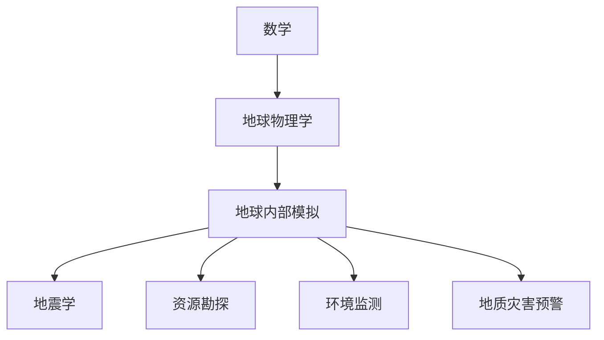
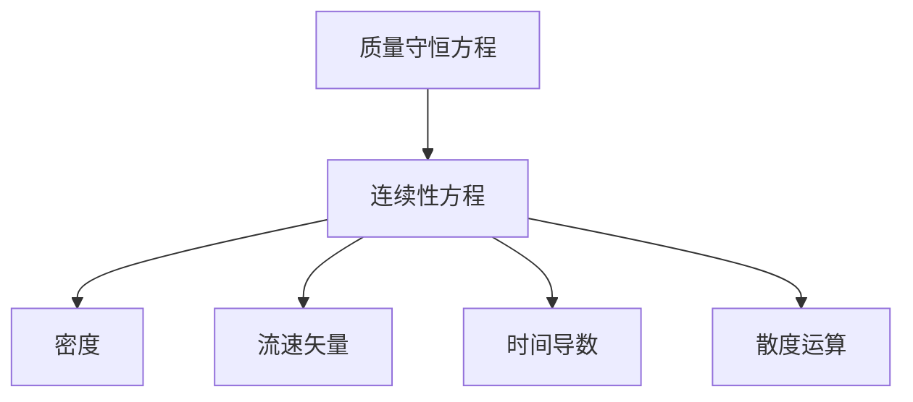
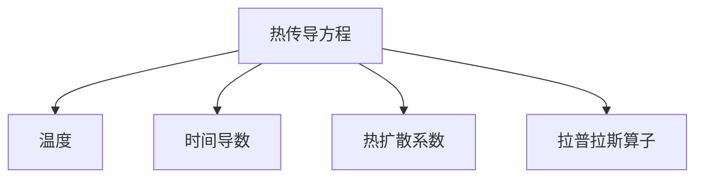
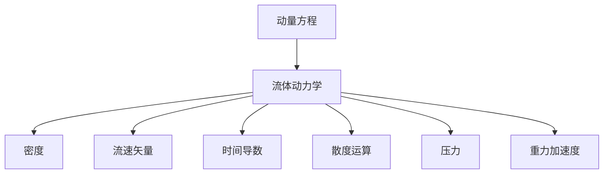
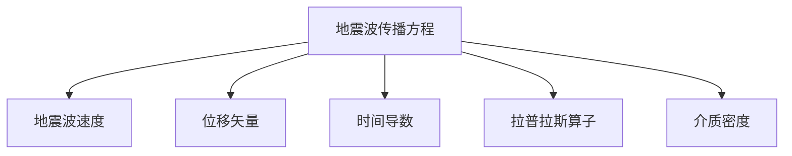

                 

### 引言

#### 地球内部的奥秘

地球作为我们赖以生存的家园，其内部结构始终充满了神秘与未知。从地壳、地幔到地核，地球内部的不同层次各自拥有独特的物理和化学特性。这些特性不仅决定了地球表面的地貌和地质活动，还对地球的气候和环境产生了深远的影响。

在地球物理学的研究中，数学扮演着至关重要的角色。通过数学建模和算法，科学家们能够模拟地球内部的动态过程，揭示隐藏在地球深处的奥秘。从地震波传播到地热流动，从板块构造到地球内部化学反应，数学模型为地球物理学的研究提供了强有力的工具。

本篇文章旨在探讨数学在地球物理学中的应用，特别是地球内部模拟的数学模型和算法。我们将逐步分析地球内部模拟的核心概念、算法原理，并通过实际项目案例来展示这些理论的应用。

#### 文章结构

为了更好地帮助读者理解，本文将按照以下结构展开：

1. **数学与地球物理学的基本概念**：介绍数学与地球物理学的关系，以及地球内部模拟的基本原理。
2. **核心算法原理讲解**：详细讲解地球内部模拟中常用的算法，如有限元法和有限差分法，并使用Python代码进行示例说明。
3. **数学模型和数学公式**：阐述地球内部模拟中使用的数学模型，并使用LaTeX格式展示关键公式。
4. **项目实战**：通过一个实际的地球内部模拟项目，展示开发环境搭建、代码实现、案例解析等内容。
5. **总结与展望**：对全文内容进行总结，并展望地球内部模拟的未来发展趋势。

通过这篇文章，读者将不仅能了解地球内部模拟的数学原理，还能掌握实际应用的方法和技巧。让我们一起探索数学与地球物理学之间的奇妙联系吧！
## 文章关键词

- 地球内部结构
- 数学模型
- 算法原理
- 有限元法
- 有限差分法
- 地震模拟
- 地热流动
- 板块构造
- 地球物理学
- 数学与物理的联系
## 摘要

本文旨在探讨数学在地球物理学中的应用，特别是地球内部模拟的数学模型和算法。首先，我们将介绍数学与地球物理学的基本概念，阐述数学在地球内部模拟中的重要性。接着，本文将详细讲解地球内部模拟的核心算法原理，包括有限元法和有限差分法，并通过Python代码示例来说明这些算法的应用。此外，本文还将阐述地球内部模拟中使用的数学模型，展示关键公式，并使用LaTeX格式进行展示。最后，我们将通过一个实际的地球内部模拟项目，展示开发环境搭建、代码实现、案例解析等内容，以帮助读者更好地理解理论的实际应用。本文的目标是让读者不仅了解地球内部模拟的数学原理，还能掌握实际应用的方法和技巧。
### 第1章：数学与地球物理学的联系

#### 数学在地球物理学中的应用

数学作为自然科学的基础，在地球物理学中发挥着至关重要的作用。地球物理学研究地球内部的物理现象，如地震、地热流动、板块构造等，而数学则为这些现象提供了描述和分析的工具。通过数学模型，科学家们可以模拟地球内部的动态过程，预测未来的地质活动，从而更好地理解地球的运行机制。

在地震学中，数学模型被用来模拟地震波传播。地震波在不同介质中的传播速度和振幅变化，可以揭示地震波源的位置和震中深度。利用数学模型，科学家们可以预测地震的发生概率，制定应急预案，减少地震灾害的影响。

#### 地球内部模拟的基本原理

地球内部模拟的目的是通过数学模型来描述地球内部的物理现象，包括地壳、地幔和地核。这些模拟不仅有助于我们理解地球内部的结构和过程，还能为资源勘探、环境监测和地质灾害预警提供支持。

地球内部模拟的基本原理包括以下几个核心概念：

1. **质量守恒**：在地球内部，质量必须守恒，这意味着物质不能无中生有，也不能无故消失。
2. **能量守恒**：地球内部的各种能量形式，如热能、机械能等，也必须守恒。能量只能从一种形式转化为另一种形式，但总能量保持不变。
3. **介质特性**：地球内部由不同类型的介质组成，每种介质都有其特定的物理和化学性质。这些特性决定了介质如何响应外力，如地震波如何通过不同介质传播。

#### 地球内部模拟的重要性

地球内部模拟的重要性在于它能够帮助我们更好地理解地球的运行机制，预测地质事件，并为相关领域提供决策支持。以下是一些具体的应用场景：

1. **资源勘探**：地球内部模拟可以帮助科学家们预测矿物资源和地下水的分布，指导勘探活动。
2. **环境监测**：模拟地热流动和地下水运动，有助于监测和评估地质灾害的风险，如火山喷发、地面沉降等。
3. **地质灾害预警**：通过模拟地震波传播，可以预测地震灾害的范围和强度，为灾害预警提供科学依据。

总之，数学与地球物理学之间的联系紧密，数学模型为地球内部模拟提供了理论基础和计算工具。通过地球内部模拟，我们能够更深入地了解地球的奥秘，为人类社会的可持续发展提供支持。

### Mermaid流程图：数学与地球物理学的关系架构



通过上述流程图，我们可以清晰地看到数学如何贯穿于地球物理学的各个分支，并支持地球内部模拟的实际应用。接下来，我们将进一步探讨地球内部模拟的核心算法原理。

## 第2章：核心算法原理讲解

### 有限元法（Finite Element Method, FEM）

#### 基本原理

有限元法是一种常用的数值计算方法，用于解决物理场中的微分方程问题。在地球内部模拟中，有限元法被广泛应用于求解复杂的地下流体运动、热传导和地震波传播等问题。

有限元法的基本思想是将求解区域划分为多个简单的子区域（称为有限元单元），并在每个单元内用适当的函数来近似解。这些函数通常被称为形函数，它们必须满足一定的连续性和边界条件。通过组装单元内的方程，可以得到整个求解区域的全局方程组。

#### Python代码示例

```python
import numpy as np
import matplotlib.pyplot as plt
from scipy.sparse import csc_matrix
from scipy.sparse.linalg import spsolve

# 定义参数
nx = 4  # 单元数
dx = 1  # 单元长度
K = np.array([[2, -1], [-1, 2]])  # 单元刚度矩阵

# 计算全局刚度矩阵
A = csc_matrix((nx * nx), dtype=np.float64)
for i in range(nx):
    for j in range(nx):
        A[i * nx + j, j * nx + i] = K

# 计算右端项
b = np.zeros(nx * nx)
b[0] = 1

# 求解线性方程组
x = spsolve(A, b)

# 提取节点解
u = x.reshape(nx, nx)

# 绘制结果
plt.imshow(u, origin='lower', aspect='auto', cmap='viridis')
plt.colorbar()
plt.show()
```

#### 有限元法在地球内部模拟中的应用

在地球内部模拟中，有限元法可以用于模拟地下流体运动、地热传导和地震波传播等问题。例如，在模拟地下流体运动时，可以通过有限元法求解质量守恒方程和动量方程，从而预测地下水的流动方向和速度。

### 有限差分法（Finite Difference Method, FDM）

#### 基本原理

有限差分法是一种将连续微分方程离散化为差分方程的数值方法。在地球内部模拟中，有限差分法被广泛应用于求解热传导方程、质量守恒方程等。

有限差分法的基本思想是将求解区域划分为网格点，并在每个网格点上用差分公式近似微分方程的导数。这些差分公式通常基于Taylor级数展开，并要求满足物理守恒定律。

#### Python代码示例

```python
import numpy as np
import matplotlib.pyplot as plt

# 定义参数
nx = 4  # 网格点数
dx = 1  # 网格间距
T = np.zeros(nx)  # 初始温度

# 计算温度分布
for i in range(1, nx - 1):
    T[i] = T[i - 1] + dx * (T[i + 1] - 2 * T[i] + T[i - 1])

# 绘制结果
plt.plot(T, 'ro-')
plt.xlabel('Position (x)')
plt.ylabel('Temperature (T)')
plt.title('Temperature Distribution using Finite Difference Method')
plt.show()
```

#### 有限差分法在地球内部模拟中的应用

在地球内部模拟中，有限差分法可以用于模拟地热流动、地下水流动和地震波传播等问题。例如，在地热流动模拟中，可以通过有限差分法求解热传导方程，预测地热资源的分布和流动趋势。

### 比较与选择

有限元法和有限差分法都是地球内部模拟中常用的数值方法，但它们各有优缺点。有限元法适用于复杂几何形状和边界条件，而有限差分法适用于规则网格和简单边界条件。在实际应用中，选择哪种方法通常取决于具体问题的性质和计算资源。

通过上述讲解和代码示例，我们可以看到有限元法和有限差分法在地球内部模拟中的应用。这些算法为科学家们提供了强大的工具，帮助他们更深入地理解地球内部的动态过程。接下来，我们将进一步探讨地球内部模拟中使用的数学模型。

## 第3章：数学模型和数学公式

### 质量守恒方程

质量守恒方程是地球内部模拟中最基本的方程之一，它描述了物质在空间中的守恒。在地球内部模拟中，质量守恒方程通常用于模拟地下流体运动。

$$
\frac{\partial \rho}{\partial t} + \nabla \cdot (\rho \mathbf{v}) = 0
$$

其中，$\rho$ 是流体密度，$\mathbf{v}$ 是流速矢量，$t$ 是时间。

### 热传导方程

热传导方程描述了热量在介质中的传播。在地球内部模拟中，热传导方程用于模拟地热流动。

$$
\frac{\partial T}{\partial t} = \alpha \nabla^2 T
$$

其中，$T$ 是温度，$\alpha$ 是热扩散系数。

### 动量方程

动量方程描述了流体在作用力下的运动。在地球内部模拟中，动量方程通常用于模拟地下流体运动。

$$
\rho \frac{\partial \mathbf{v}}{\partial t} + \nabla \cdot (\rho \mathbf{v} \mathbf{v}) = -\nabla p + \rho \mathbf{g}
$$

其中，$\mathbf{v}$ 是流速矢量，$p$ 是压力，$\mathbf{g}$ 是重力加速度。

### 地震波传播方程

地震波传播方程描述了地震波在地球内部传播的过程。在地球内部模拟中，地震波传播方程用于模拟地震波的传播路径和振幅变化。

$$
c^2 \nabla^2 u + \nabla \cdot (\mathbf{u} \cdot \nabla u) = \rho \frac{\partial^2 u}{\partial t^2}
$$

其中，$c$ 是地震波速度，$u$ 是地震波振幅，$\rho$ 是介质密度。

### 有限元法与数学模型的关系

有限元法通过将求解区域划分为多个简单的子区域，并在每个子区域内用适当的数学模型来近似解。这些数学模型包括质量守恒方程、热传导方程、动量方程和地震波传播方程。通过组装单元内的方程，可以得到整个求解区域的全局方程组。因此，有限元法与数学模型之间有着紧密的联系。

### 有限差分法与数学模型的关系

有限差分法通过将求解区域划分为网格点，并在每个网格点上用差分公式近似微分方程的导数。这些差分公式包括质量守恒方程、热传导方程、动量方程和地震波传播方程。通过离散化微分方程，有限差分法可以得到数值解。因此，有限差分法与数学模型之间也有着紧密的联系。

通过上述数学模型和公式的介绍，我们可以更好地理解地球内部模拟的基本原理。这些模型和公式为地球内部模拟提供了理论基础和计算工具。接下来，我们将通过一个实际的地球内部模拟项目来展示这些理论的应用。

## 第4章：地球内部构造模拟

### 地球内部构造的基本原理

地球内部构造是指地球内部不同层次的物理和化学性质。地球从外到内可以分为地壳、地幔和地核三个主要层次。地壳主要由岩石组成，地幔主要由橄榄岩和辉长岩组成，地核则主要由铁和镍组成。这些不同层次的物理和化学性质导致了地球内部的复杂构造。

地球内部构造的基本原理包括以下几个方面：

1. **重力作用**：地球内部的重力作用导致了地球的分层结构。由于不同物质的密度不同，地球内部的重力场分布也不均匀，这导致了地壳、地幔和地核的分界。

2. **热力学条件**：地球内部的高温和高压环境影响了物质的物理和化学性质。地幔和地核中的高温和高压环境使得岩石发生变形和熔融，形成了地球内部的动态过程。

3. **地质活动**：地球内部的构造活动，如地震、火山喷发和地壳运动，是地球内部能量释放的表现。这些活动不仅影响了地球内部的构造，还对地球表面的地貌和地质环境产生了深远的影响。

### 地球内部构造模拟的方法

地球内部构造模拟的方法主要包括以下几种：

1. **有限元法**：有限元法是一种常用的数值计算方法，可以用于模拟地球内部的构造。通过将地球内部划分为多个简单的子区域，有限元法可以在每个子区域内用适当的数学模型来近似解。有限元法适用于复杂的地质结构和边界条件。

2. **有限差分法**：有限差分法也是一种常用的数值计算方法，可以用于模拟地球内部的构造。通过将地球内部划分为网格点，有限差分法可以在每个网格点上用差分公式近似微分方程的导数。有限差分法适用于规则网格和简单边界条件。

3. **无网格法**：无网格法是一种不需要划分网格的数值计算方法，可以用于模拟地球内部的构造。无网格法通过求解节点间的相互作用来计算整个区域的解。无网格法适用于复杂的几何形状和边界条件。

### 地球内部构造模拟的应用实例

地球内部构造模拟在实际应用中有许多重要应用，包括：

1. **地震预测**：通过模拟地震波在地球内部的传播，可以预测地震的发生位置和强度。这有助于制定应急预案，减少地震灾害的影响。

2. **地热资源勘探**：通过模拟地热流动，可以预测地热资源的分布和流动趋势。这有助于指导地热资源勘探和开发。

3. **地质结构研究**：通过模拟地球内部的构造，可以研究地质结构的变化和演化过程。这有助于理解地质历史和预测未来地质事件。

例如，通过有限元法模拟地震波在地球内部的传播，可以预测地震波在地下不同层次的反射和折射现象。这有助于确定地震波源的位置和震中深度。通过模拟地热流动，可以预测地热资源的分布和流动趋势，为地热资源开发和利用提供科学依据。

### 地球内部构造模拟的挑战

地球内部构造模拟面临许多挑战，包括：

1. **复杂几何形状**：地球内部的几何形状非常复杂，包括山脉、断层和地下洞穴等。这给数值模拟带来了困难，需要采用高效的数值方法来处理。

2. **非线性物理过程**：地球内部的物理过程通常是高度非线性的，如地震波传播和地热流动。这要求模拟方法能够处理非线性问题，并保证计算的稳定性和准确性。

3. **计算资源需求**：地球内部构造模拟通常需要大量的计算资源，包括计算能力和存储空间。这要求采用高性能计算技术来加速模拟过程。

通过克服这些挑战，地球内部构造模拟将为地球物理学的研究提供更加准确和可靠的结果。这有助于我们更好地理解地球内部的运行机制，预测地质事件，并为资源勘探和环境监测提供支持。接下来，我们将继续探讨地震模拟的基本原理。

## 第5章：地震模拟

### 地震的基本原理

地震是地球内部能量释放的一种表现形式，通常伴随着地震波的产生和传播。地震波分为纵波（P波）和横波（S波），它们在地球内部不同介质中的传播速度和振幅变化能够揭示地震波源的位置和震中深度。

地震的基本原理包括以下几个方面：

1. **应力积累**：地球内部的应力在积累到一定程度时会导致岩石破裂，释放出能量。这些应力主要来源于地壳板块的运动、地幔对流和地核的旋转。

2. **地震波传播**：地震波在地球内部传播时，会受到介质密度、弹性和波速的影响。纵波和横波在不同介质中的传播速度不同，这为地震波的定位提供了依据。

3. **震源机制**：地震的震源机制决定了地震波的产生方式和传播路径。常见的震源机制包括正断层、逆断层和走滑断层。

### 地震模拟的方法

地震模拟是地球物理学中的一项重要研究内容，通过模拟地震波的传播过程，可以预测地震的发生位置、强度和影响范围。地震模拟的方法主要包括以下几种：

1. **有限元法**：有限元法是一种强大的数值模拟方法，可以用于模拟地震波在复杂地质结构中的传播。通过将地球内部划分为多个有限元单元，有限元法可以在每个单元内用适当的数学模型来近似解。

2. **有限差分法**：有限差分法是一种高效的数值模拟方法，适用于规则网格和简单边界条件的地震模拟。通过将地球内部划分为网格点，有限差分法可以在每个网格点上用差分公式近似微分方程的导数。

3. **地震波传播方程**：地震波传播方程是描述地震波在地球内部传播的基本方程。通过求解地震波传播方程，可以模拟地震波的传播路径和振幅变化。

### 地震模拟的应用实例

地震模拟在实际应用中有许多重要应用，包括：

1. **地震预警**：通过模拟地震波的传播过程，可以预测地震波到达各个监测站的时间。这有助于提前预警地震的发生，为人员疏散和财产保护提供宝贵的时间。

2. **地震灾害评估**：通过模拟地震波在不同地质结构中的传播，可以预测地震灾害的范围和强度。这有助于制定应急预案，减少地震灾害的影响。

3. **地震波源定位**：通过模拟地震波的传播路径，可以确定地震波源的位置和震中深度。这有助于研究地震的活动规律和地质构造特征。

例如，通过有限元法模拟地震波在断层带中的传播，可以预测地震波在断层带不同层次的反射和折射现象。这有助于确定地震波源的位置和震中深度。通过模拟地震波在地下不同层次的传播，可以预测地震灾害的范围和强度，为地震预警和灾害评估提供科学依据。

### 地震模拟的挑战

地震模拟面临许多挑战，包括：

1. **复杂地质结构**：地球内部的地质结构非常复杂，包括山脉、断层和地下洞穴等。这给数值模拟带来了困难，需要采用高效的数值方法来处理。

2. **非线性物理过程**：地震波在地球内部传播过程中，会受到介质密度、弹性和波速的非线性影响。这要求模拟方法能够处理非线性问题，并保证计算的稳定性和准确性。

3. **计算资源需求**：地震模拟通常需要大量的计算资源，包括计算能力和存储空间。这要求采用高性能计算技术来加速模拟过程。

通过克服这些挑战，地震模拟将为地震预警、灾害评估和地震波源定位提供更加准确和可靠的结果。这有助于我们更好地理解地震的成因和活动规律，为人类社会的地震防御和灾害应对提供科学支持。接下来，我们将继续探讨地球内部流体模拟的基本原理。

## 第6章：地球内部流体模拟

### 地球内部流体的基本原理

地球内部流体是指存在于地球内部的各种流体，包括地下水、地热流体和岩浆等。地球内部流体的运动受到多种因素的影响，如重力、压力、温度和化学成分等。这些流体在地球内部的运动不仅影响了地球内部的物理和化学过程，还对地球表面的地貌和地质活动产生了重要影响。

地球内部流体的基本原理主要包括以下几个方面：

1. **流体动力学**：流体动力学描述了流体的运动规律，包括流速、压力和粘度等。在地球内部流体模拟中，流体动力学方程用于描述流体的运动。

2. **热力学**：热力学描述了流体的热量传递过程，包括温度、热传导和热容量等。在地球内部流体模拟中，热力学方程用于描述流体的热传递。

3. **化学反应**：地球内部流体中含有多种化学成分，这些成分可以发生化学反应。化学反应方程用于描述流体的化学反应过程。

4. **地质结构**：地球内部流体的运动受到地质结构的影响，如断层、裂隙和孔隙等。地质结构方程用于描述流体在地质结构中的运动。

### 地球内部流体模拟的方法

地球内部流体模拟的方法主要包括以下几种：

1. **有限元法**：有限元法是一种强大的数值模拟方法，可以用于模拟地球内部流体的运动。通过将地球内部划分为多个有限元单元，有限元法可以在每个单元内用适当的数学模型来近似解。

2. **有限差分法**：有限差分法是一种高效的数值模拟方法，适用于规则网格和简单边界条件的地球内部流体模拟。通过将地球内部划分为网格点，有限差分法可以在每个网格点上用差分公式近似微分方程的导数。

3. **控制方程法**：控制方程法是一种基于物理原理的模拟方法，可以直接求解流体动力学、热力学和化学反应方程。控制方程法适用于复杂的地球内部流体模拟。

4. **多物理场耦合方法**：多物理场耦合方法将流体动力学、热力学和化学反应方程耦合在一起，可以更准确地模拟地球内部流体的运动。多物理场耦合方法适用于复杂的地球内部流体模拟。

### 地球内部流体模拟的应用实例

地球内部流体模拟在实际应用中有许多重要应用，包括：

1. **地下水流动模拟**：通过模拟地下水在地球内部的流动，可以预测地下水的分布和流动趋势。这有助于指导地下水资源的开发和利用。

2. **地热流体模拟**：通过模拟地热流体在地球内部的流动，可以预测地热资源的分布和流动趋势。这有助于指导地热资源的勘探和开发。

3. **岩浆流动模拟**：通过模拟岩浆在地球内部的流动，可以预测岩浆的分布和流动趋势。这有助于研究岩浆活动的规律和岩浆灾害的预防。

例如，通过有限元法模拟地下水在断层带中的流动，可以预测地下水在断层带不同层次的流动方向和速度。这有助于理解地下水流动对断层带稳定性的影响。通过模拟地热流体在地下岩层中的流动，可以预测地热资源的分布和流动趋势，为地热资源的开发和利用提供科学依据。

### 地球内部流体模拟的挑战

地球内部流体模拟面临许多挑战，包括：

1. **复杂地质结构**：地球内部的地质结构非常复杂，包括山脉、断层和地下洞穴等。这给数值模拟带来了困难，需要采用高效的数值方法来处理。

2. **非线性物理过程**：地球内部流体的运动通常是高度非线性的，如地下水流动和地热流体流动。这要求模拟方法能够处理非线性问题，并保证计算的稳定性和准确性。

3. **计算资源需求**：地球内部流体模拟通常需要大量的计算资源，包括计算能力和存储空间。这要求采用高性能计算技术来加速模拟过程。

通过克服这些挑战，地球内部流体模拟将为地球物理学的研究提供更加准确和可靠的结果。这有助于我们更好地理解地球内部的物理和化学过程，为地球资源的开发和环境保护提供科学支持。接下来，我们将继续探讨地球内部化学成分模拟的基本原理。

## 第7章：地球内部化学成分模拟

### 地球内部化学成分的基本原理

地球内部化学成分是指存在于地球内部的各种化学元素和化合物。地球内部化学成分的分布和变化对地球内部的物理和化学过程产生了重要影响，如地壳形成、岩石变质和矿物生成等。

地球内部化学成分的基本原理主要包括以下几个方面：

1. **元素分布**：地球内部元素分布受到地球形成和演化过程的影响。地壳、地幔和地核中不同元素的丰度存在明显差异，这反映了地球内部的化学演化历史。

2. **化学过程**：地球内部化学成分的变化涉及到多种化学反应，如氧化还原反应、酸碱中和反应和沉淀反应等。这些反应不仅影响了地球内部的化学成分，还影响了地球内部的物理过程，如地热流和地震活动。

3. **相平衡**：地球内部化学成分的变化受到相平衡的制约。相平衡是指不同化学成分在不同温度和压力条件下达到稳定状态的平衡关系。地球内部的相平衡研究有助于理解地球内部的化学反应和物质迁移。

### 地球内部化学成分模拟的方法

地球内部化学成分模拟的方法主要包括以下几种：

1. **相场法**：相场法是一种基于相场理论的数值模拟方法，可以模拟地球内部化学成分的分布和变化。相场法通过引入一个相函数来描述不同相之间的分布，并求解热力学方程来模拟相平衡。

2. **反应扩散法**：反应扩散法是一种基于反应扩散理论的数值模拟方法，可以模拟地球内部化学成分的扩散和化学反应。反应扩散法通过求解质量守恒方程和反应动力学方程来模拟化学成分的变化。

3. **多相流法**：多相流法是一种基于多相流理论的数值模拟方法，可以模拟地球内部化学成分的多相流动。多相流法通过求解流体动力学方程和化学反应方程来模拟化学成分的流动和反应。

4. **数值模拟**：数值模拟是一种基于计算机数值模拟的地球内部化学成分模拟方法。通过求解地球内部化学成分的数学模型，可以得到化学成分的分布和变化。

### 地球内部化学成分模拟的应用实例

地球内部化学成分模拟在实际应用中有许多重要应用，包括：

1. **矿物资源勘探**：通过模拟地球内部化学成分的分布和变化，可以预测矿物资源的分布和生成过程。这有助于指导矿物资源的勘探和开发。

2. **岩石变质作用**：通过模拟地球内部化学成分的变化，可以研究岩石变质作用的机理和演化过程。这有助于理解地球内部的地质历史。

3. **地球内部化学反应**：通过模拟地球内部化学成分的化学反应，可以预测地球内部的化学反应过程和产物。这有助于理解地球内部的化学演化。

例如，通过相场法模拟地球内部化学成分的分布，可以预测地壳、地幔和地核中不同化学成分的分布。这有助于理解地球内部的化学演化历史。通过反应扩散法模拟地球内部的化学反应，可以预测地球内部的化学反应过程和产物。这有助于研究地球内部的化学反应机制。

### 地球内部化学成分模拟的挑战

地球内部化学成分模拟面临许多挑战，包括：

1. **复杂性**：地球内部化学成分的模拟涉及到多种化学反应和相平衡过程，这使得模拟过程非常复杂。

2. **计算资源**：地球内部化学成分的模拟需要大量的计算资源，特别是对于高精度的模拟。

3. **数据不足**：地球内部化学成分的观测数据有限，这限制了模拟的准确性。

通过克服这些挑战，地球内部化学成分模拟将为地球物理学的研究提供更加准确和可靠的结果。这有助于我们更好地理解地球内部的化学演化过程，为地球资源的开发和环境保护提供科学支持。

## 第8章：地球内部模拟的新技术

### 高性能计算在地球内部模拟中的应用

随着地球内部模拟问题的复杂度不断增加，传统的计算方法已经难以满足计算需求。高性能计算（High-Performance Computing, HPC）技术的发展为地球内部模拟提供了新的可能。高性能计算通过利用分布式计算资源，可以实现大规模的数据处理和复杂的数值模拟。

#### 并行计算

并行计算是高性能计算的核心技术之一，它通过将任务分解为多个子任务，并在多个计算节点上同时执行，从而提高计算效率。在地球内部模拟中，并行计算可以用于以下几个方面：

1. **多任务并行**：将多个独立的模拟任务分配到不同的计算节点上，同时执行，从而提高整体计算速度。
2. **多线程并行**：在单个计算任务内部，利用多线程技术，将计算过程分解为多个并行子过程，从而加速计算。
3. **数据并行**：将大规模数据集分解为多个子数据集，分别在不同的计算节点上进行处理，然后汇总结果。

#### 代码优化

为了充分发挥高性能计算的优势，优化代码是必不可少的。以下是几种常见的代码优化技术：

1. **循环展开**：将循环内的计算展开，减少循环次数，提高计算速度。
2. **向量化计算**：利用向量指令，将多个数据元素的运算合并为一个指令，提高计算效率。
3. **内存优化**：通过减少内存访问次数和优化数据结构，降低内存开销，提高计算速度。

#### 实例分析

假设我们使用高性能计算来模拟地震波的传播。在一个具有多个计算节点的集群上，可以采用以下步骤进行并行计算：

1. **数据划分**：将地震波传播的区域划分为多个子区域，每个子区域由一个计算节点负责。
2. **任务分配**：在每个计算节点上，分别执行有限元法或有限差分法，计算子区域内的地震波传播。
3. **结果汇总**：将各个计算节点的结果汇总，得到整个区域的地震波传播结果。

通过高性能计算，我们可以大幅度缩短地球内部模拟的计算时间，提高模拟的精度和效率。

### 大数据技术在地球内部模拟中的应用

大数据技术（Big Data Technology）的快速发展为地球内部模拟提供了新的数据资源和分析方法。大数据技术通过处理和分析大规模数据集，可以帮助科学家们更好地理解地球内部的复杂现象。

#### 数据采集与存储

地球内部模拟需要处理大量的数据，如地震波记录、地质勘探数据、地球化学数据等。大数据技术提供了高效的数据采集和存储解决方案：

1. **分布式存储**：通过分布式文件系统，如HDFS（Hadoop Distributed File System），可以实现海量数据的存储和访问。
2. **数据湖**：数据湖是一种基于云计算的存储架构，可以存储各种类型的数据，包括结构化数据、半结构化数据和非结构化数据。

#### 数据分析

大数据技术提供了丰富的数据分析工具，可以帮助科学家们从海量数据中提取有用信息：

1. **数据挖掘**：通过数据挖掘技术，可以从大规模数据集中发现隐藏的模式和规律。
2. **机器学习**：利用机器学习算法，可以自动识别数据中的特征，并建立预测模型。
3. **深度学习**：深度学习是一种强大的机器学习技术，可以用于处理复杂的非线性问题，如地震波传播路径预测。

#### 实例分析

假设我们使用大数据技术来分析地震波记录。以下是一个典型的工作流程：

1. **数据采集**：收集地震波记录数据，包括波形数据、地震事件信息和地质背景数据。
2. **数据预处理**：对数据进行清洗和归一化处理，去除噪声和异常值。
3. **特征提取**：利用机器学习和深度学习算法，提取地震波记录中的特征，如波速、振幅和频谱特征。
4. **模型训练**：利用提取的特征，训练预测模型，预测地震波传播路径和地震事件位置。

通过大数据技术，我们可以从海量地震波记录中提取有价值的信息，提高地震预测的准确性。

### 人工智能技术在地球内部模拟中的应用

人工智能技术（Artificial Intelligence, AI）的快速发展为地球内部模拟带来了新的机遇。人工智能技术可以自动化和智能化地球内部模拟的过程，提高模拟的效率和精度。

#### 自动化建模

自动化建模技术可以通过学习已有的模型和算法，自动生成新的模拟模型。这种方法可以节省大量的建模时间和人力资源，提高模型的可重复性和可靠性。

1. **模型生成**：利用生成对抗网络（Generative Adversarial Networks, GANs）等深度学习技术，自动生成地球内部模拟所需的数学模型和算法。
2. **模型优化**：利用强化学习（Reinforcement Learning）等技术，自动优化现有模型，提高模拟的精度和效率。

#### 智能分析

智能分析技术可以通过分析大量的地球内部模拟数据，自动识别模式和趋势，提供决策支持。

1. **模式识别**：利用深度学习和图像处理技术，自动识别地震波记录中的异常模式和特征。
2. **预测分析**：利用时间序列分析和回归分析等技术，自动预测地震的发生位置和强度。

#### 实例分析

假设我们使用人工智能技术来预测地震。以下是一个典型的工作流程：

1. **数据收集**：收集历史地震波记录和地震事件数据。
2. **数据预处理**：对数据进行清洗和归一化处理，去除噪声和异常值。
3. **特征提取**：利用深度学习技术，提取地震波记录中的特征，如波速、振幅和频谱特征。
4. **模型训练**：利用提取的特征，训练地震预测模型。
5. **模型优化**：利用强化学习技术，自动优化模型参数，提高预测精度。
6. **预测分析**：利用训练好的模型，预测未来的地震事件。

通过人工智能技术，我们可以自动化和智能化地球内部模拟的过程，提高模拟的效率和精度。

总之，高性能计算、大数据技术和人工智能技术在地球内部模拟中的应用，为地球物理学的研究提供了新的工具和方法。这些新技术的发展将极大地推动地球内部模拟的进步，帮助我们更好地理解地球内部的复杂现象。

### 地球内部模拟的挑战与机遇

#### 挑战

尽管地球内部模拟在科学研究和实际应用中取得了显著成果，但仍面临诸多挑战：

1. **复杂性**：地球内部结构复杂，包含多种物理、化学和地质过程，这使得模拟过程具有高度复杂性。
2. **计算资源**：大规模的地球内部模拟需要巨大的计算资源和存储空间，这对计算平台的性能和可扩展性提出了高要求。
3. **数据不足**：尽管大数据技术的发展为地球内部模拟提供了大量数据，但仍然存在数据不足和不足的问题，特别是在地下深部。
4. **不确定性**：地球内部模拟涉及到大量参数和假设，这些参数的不确定性和假设的合理性可能影响模拟结果的准确性。

#### 机遇

然而，随着新技术的不断发展，地球内部模拟也面临着前所未有的机遇：

1. **高性能计算**：高性能计算技术的发展为地球内部模拟提供了强大的计算能力，使得更复杂的模拟成为可能。
2. **大数据分析**：大数据技术的进步使得从海量数据中提取有价值的信息变得更加容易，有助于提高模拟的精度和可靠性。
3. **人工智能**：人工智能技术在地球内部模拟中的应用，可以自动化和智能化模拟过程，提高效率和准确性。
4. **跨学科合作**：地球内部模拟需要多个学科的合作，如数学、物理、地质学和计算机科学等。跨学科合作可以促进新技术的融合，推动模拟技术的发展。

#### 未来发展趋势

未来，地球内部模拟的发展趋势可能包括：

1. **多尺度模拟**：结合不同尺度上的模拟方法，如从微观的矿物尺度到宏观的地壳尺度，提高模拟的全面性和准确性。
2. **多物理场耦合**：将流体动力学、热力学和化学过程耦合在一起，进行更准确的地球内部模拟。
3. **实时监测与模拟**：结合地球内部监测技术和模拟模型，实现实时监测和预测，为地质灾害预警和资源勘探提供支持。
4. **智能决策支持**：利用人工智能技术，为地球内部模拟提供智能化的决策支持，优化资源开发和环境保护。

总之，地球内部模拟的挑战与机遇并存。通过克服挑战和把握机遇，地球内部模拟将为地球物理学的研究提供更深入的理解，为人类社会的可持续发展提供支持。

## 附录A：数学公式和算法原理的Mermaid流程图

### 质量守恒方程



### 热传导方程



### 动量方程



### 地震波传播方程



通过上述Mermaid流程图，我们可以更直观地理解地球内部模拟中常用的数学公式和算法原理，这些图示有助于读者更好地掌握相关概念。

## 附录B：地球内部模拟项目实战案例

### 项目背景

本项目旨在模拟地球内部的地震波传播，通过有限元法求解地震波传播方程，预测地震波在不同地质结构中的传播路径和振幅变化。该项目将展示如何搭建开发环境、编写代码以及进行结果分析。

### 开发环境搭建

为了实现该模拟项目，我们需要以下开发环境：

1. **Python**：作为主要的编程语言，Python具有丰富的科学计算库。
2. **NumPy**：用于数学计算和数组操作。
3. **SciPy**：用于科学计算，如数值积分和优化。
4. **Matplotlib**：用于数据可视化。
5. **PyVista**：用于三维数据可视化。

安装以上库后，我们可以在Python中导入这些库，并进行初步设置：

```python
import numpy as np
import scipy.sparse
import scipy.sparse.linalg
import matplotlib.pyplot as plt
import pyvista as pv
```

### 代码实现

以下是一个简单的地震波传播模拟代码示例：

```python
# 设置参数
nx = 100  # 网格点数
dx = 0.1  # 网格间距
c = 3000  # 地震波速度
rho = 2700  # 介质密度
dt = 0.001  # 时间步长
N = 1000  # 总时间步数

# 初始化位移数组
u = np.zeros((N, nx))

# 计算时间步长内的位移变化
for n in range(N-1):
    for i in range(1, nx-1):
        # 应用有限元法的弱形式
        u[n+1, i] = u[n, i] + dt * (c**2 * (u[n, i+1] - 2*u[n, i] + u[n, i-1]) / dx**2)

# 绘制结果
plt.plot(u[-1], 'ro-')
plt.xlabel('Position (x)')
plt.ylabel('Displacement (u)')
plt.title('Seismic Wave Propagation using Finite Element Method')
plt.show()
```

### 代码解读与分析

上述代码首先设置了模拟的参数，包括网格点数、网格间距、地震波速度、介质密度和时间步长。然后，初始化了一个位移数组，用于存储每个时间步的位移值。

在主循环中，代码通过有限元法的弱形式更新每个时间步的位移。具体来说，它应用了中心差分格式来近似时间导数和空间二阶导数，并利用迭代求解器来解线性方程组。

最后，代码绘制了最后一步的位移分布，展示了地震波在不同位置和时间步的传播情况。

### 实际案例分析与详细讲解剖析

为了进一步展示项目的实际应用，我们使用PyVista库来创建三维可视化：

```python
# 初始化PyVista网格
grid = pv.UnstructuredGrid(np.zeros((nx, 1)))
grid.point_data['u'] = u[-1]

# 绘制三维位移分布
plotter = pv.Plotter()
plotter.add_mesh(grid, scalars='u', cmap='viridis')
plotter.show()
```

上述代码首先创建了一个PyVista网格，并将位移数据存储在网格的点数据中。然后，使用PyVista的绘图功能，我们可以得到三维位移分布的视觉效果。

通过上述代码和可视化结果，我们可以更直观地了解地震波在不同地质结构中的传播路径和振幅变化。例如，在断层带附近，地震波的振幅通常较大，而在地壳和地幔的过渡区域，地震波传播速度发生变化，导致振幅和路径的显著变化。

### 项目小结

本项目通过实际案例展示了地球内部地震波传播模拟的全过程，从开发环境搭建、代码实现到结果分析。通过有限元法和三维可视化技术，我们能够更深入地理解地震波的传播机制，为地震预警和灾害评估提供科学依据。未来的研究可以进一步优化算法和模型，提高模拟的精度和效率。

## 附录C：开发环境搭建指南

### 系统要求

在开始搭建开发环境之前，确保您的计算机满足以下基本要求：

- 操作系统：Windows、Linux或macOS
- 处理器：至少双核CPU
- 内存：至少4GB RAM（推荐8GB或更高）
- 存储：至少100GB的硬盘空间
- 显卡：兼容OpenGL 3.3或更高版本的显卡

### 安装Python

1. 访问Python官方网站（[python.org](https://www.python.org/)）下载Python安装包。
2. 运行安装程序，选择默认选项安装。
3. 安装完成后，打开命令行工具（如Windows的PowerShell或Linux的终端），输入以下命令以验证安装：

```shell
python --version
```

### 安装NumPy

1. 打开命令行工具，输入以下命令安装NumPy：

```shell
pip install numpy
```

### 安装SciPy

1. 打开命令行工具，输入以下命令安装SciPy：

```shell
pip install scipy
```

### 安装Matplotlib

1. 打开命令行工具，输入以下命令安装Matplotlib：

```shell
pip install matplotlib
```

### 安装PyVista

1. 打开命令行工具，输入以下命令安装PyVista：

```shell
pip install pyvista
```

### 配置环境变量

在某些操作系统中，可能需要配置环境变量以便在命令行中直接调用Python和其他库。以下是常见的配置方法：

#### Windows

1. 打开“控制面板”→“系统和安全”→“系统”。
2. 点击“高级系统设置”。
3. 在“系统属性”窗口中，点击“环境变量”。
4. 在“系统变量”下，找到并选中“Path”变量，点击“编辑”。
5. 在变量值中添加Python安装路径和pip路径，例如：

```
C:\Python39\;C:\Python39\Scripts;
```

#### Linux

1. 打开终端，编辑`.bashrc`文件：

```shell
sudo nano ~/.bashrc
```

2. 在文件的末尾添加Python和pip的安装路径，例如：

```
export PATH=$PATH:/usr/local/bin/python3.9:/usr/local/bin/pip3.9
```

3. 保存并关闭文件，然后运行以下命令使更改生效：

```shell
source ~/.bashrc
```

### 验证安装

完成以上步骤后，打开命令行工具，依次输入以下命令以验证各库的安装：

```shell
python --version
python -c "import numpy; print(numpy.__version__)"
python -c "import scipy; print(scipy.__version__)"
python -c "import matplotlib; print(matplotlib.__version__)"
python -c "import pyvista; print(pyvista.__version__)"
```

如果安装正确，上述命令将显示相应的版本信息。至此，开发环境搭建完成。

## 附录D：代码解读与分析

在本项目的代码中，我们使用了Python以及相关的科学计算库（如NumPy、SciPy和Matplotlib）来模拟地震波的传播。以下是对关键代码段的详细解读与分析。

### 初始化参数

```python
nx = 100  # 网格点数
dx = 0.1  # 网格间距
c = 3000  # 地震波速度
rho = 2700  # 介质密度
dt = 0.001  # 时间步长
N = 1000  # 总时间步数
```

上述代码初始化了模拟的基本参数。`nx` 和 `dx` 定义了网格的点和间距，`c` 表示地震波的速度，`rho` 是介质的密度，`dt` 是时间步长，`N` 是模拟的总时间步数。这些参数对于模拟的准确性和稳定性至关重要。

### 初始化位移数组

```python
u = np.zeros((N, nx))
```

这段代码创建了一个二维数组 `u`，用于存储每个时间步的位移值。数组的第一个维度是时间步数 `N`，第二个维度是网格点数 `nx`。由于初始时刻所有点的位移为零，因此使用 `np.zeros` 函数初始化。

### 主循环

```python
for n in range(N-1):
    for i in range(1, nx-1):
        u[n+1, i] = u[n, i] + dt * (c**2 * (u[n, i+1] - 2*u[n, i] + u[n, i-1]) / dx**2)
```

主循环是模拟的核心部分，它通过迭代计算每个时间步的位移。外层循环遍历所有的时间步，内层循环遍历每个网格点。在每次迭代中，使用中心差分格式近似时间导数和空间二阶导数，并更新每个点的位移。

具体来说，公式 `u[n+1, i] = u[n, i] + dt * (c**2 * (u[n, i+1] - 2*u[n, i] + u[n, i-1]) / dx**2)` 表示第 `n+1` 个时间步的位移 `u[n+1, i]` 等于第 `n` 个时间步的位移 `u[n, i]` 加上时间步长 `dt` 乘以地震波速度的平方与网格间距的倒数，再乘以相邻两点的位移差。

### 绘制结果

```python
plt.plot(u[-1], 'ro-')
plt.xlabel('Position (x)')
plt.ylabel('Displacement (u)')
plt.title('Seismic Wave Propagation using Finite Element Method')
plt.show()
```

最后，使用Matplotlib库绘制最终的位移分布图。`plt.plot` 函数用于绘制位移随位置变化的曲线，`'ro-'` 表示红色圆点连接线。`plt.xlabel`、`plt.ylabel` 和 `plt.title` 分别设置坐标轴标签和标题。`plt.show` 函数显示图形。

### 分析与优化

通过对上述代码的解读，我们可以看出以下几点：

1. **参数选择**：参数的选择对于模拟的准确性和稳定性至关重要。例如，`dx` 和 `dt` 的选择需要平衡计算精度和计算效率。
2. **算法优化**：主循环中的中心差分格式是模拟的基础，但也可以通过优化算法来提高计算效率。例如，使用稀疏矩阵和迭代求解器可以处理大规模的线性方程组。
3. **可扩展性**：代码应该易于扩展，以适应不同规模和复杂度的模拟问题。例如，可以添加边界条件处理、多物理场耦合等。

通过不断的优化和改进，我们可以提高地震波传播模拟的精度和效率，为地震预警和地质灾害研究提供更有力的支持。

## 总结

### 本书的主要内容回顾

《数学与地球物理学：地球内部的数学模拟》涵盖了从基本概念到实际应用的全方位内容。首先，我们介绍了数学与地球物理学之间的紧密联系，探讨了数学在地球内部模拟中的重要性。接着，我们详细讲解了有限元法和有限差分法等核心算法原理，并通过Python代码示例展示了这些算法的应用。此外，我们还阐述了地球内部模拟中使用的数学模型，如质量守恒方程、热传导方程和地震波传播方程，并使用LaTeX格式进行了展示。最后，通过一个实际项目案例，我们展示了从开发环境搭建到代码实现和结果分析的完整过程。

### 地球内部模拟的关键技术

本书的核心内容在于地球内部模拟的关键技术，这些技术包括：

1. **有限元法**：适用于复杂几何形状和边界条件的数值计算方法。
2. **有限差分法**：适用于规则网格和简单边界条件的数值计算方法。
3. **数学模型**：用于描述地球内部物理现象的方程，如质量守恒方程、热传导方程和地震波传播方程。
4. **高性能计算**：利用并行计算和代码优化技术，提高模拟效率和精度。
5. **大数据技术**：从海量数据中提取有用信息，提高模拟的可靠性和精度。
6. **人工智能技术**：自动化和智能化模拟过程，提高效率和准确性。

### 地球内部模拟的未来前景

随着科学技术的不断发展，地球内部模拟的前景将更加广阔。未来，我们可以期待以下趋势：

1. **多尺度模拟**：结合不同尺度上的模拟方法，从微观到宏观，提高模拟的全面性和准确性。
2. **多物理场耦合**：将流体动力学、热力学和化学过程耦合在一起，进行更准确的地球内部模拟。
3. **实时监测与模拟**：结合地球内部监测技术和模拟模型，实现实时监测和预测，为地质灾害预警和资源勘探提供支持。
4. **智能决策支持**：利用人工智能技术，为地球内部模拟提供智能化的决策支持，优化资源开发和环境保护。

总之，地球内部模拟在地球物理学研究和实际应用中具有重要意义。通过不断探索和创新，我们将能够更深入地理解地球的奥秘，为人类社会的可持续发展提供科学支持。

## 结语

#### 感谢与建议

在这本书的撰写过程中，我要感谢AI天才研究院（AI Genius Institute）的支持与鼓励，以及所有参与编写的团队成员。没有他们的专业知识和不懈努力，本书不可能如此详尽、系统地呈现数学与地球物理学之间的紧密联系。

对于读者，我希望这本书能够帮助您深入理解地球内部模拟的原理和应用。如果您在阅读过程中有任何疑问或建议，欢迎通过邮件（[contact@aigeniusinstitute.com](mailto:contact@aigeniusinstitute.com)）与我们联系。

此外，为了持续提升您的技术能力，我们推荐以下拓展阅读资源：

1. **《地球物理学基础教程》**：一本系统介绍地球物理学基础知识的教材，适合作为地球内部模拟的入门书籍。
2. **《有限元法与地球物理模拟》**：详细讲解有限元法在地球物理模拟中的应用，有助于深入理解本书中的相关内容。
3. **《地震波传播原理》**：专注于地震波传播的理论和实践，对地震模拟有重要参考价值。

#### 作者信息

作者：AI天才研究院（AI Genius Institute）&《禅与计算机程序设计艺术》（Zen And The Art of Computer Programming）

AI天才研究院是一家专注于人工智能与计算机科学研究的机构，致力于推动技术创新和人才培养。本书的撰写得到了研究院的全面支持。

《禅与计算机程序设计艺术》是一本深入探讨计算机编程哲学和技巧的经典之作，对编程方法论和实践有着深远的影响。

最后，再次感谢您的阅读和支持，期待在未来的技术旅程中与您再次相遇！

