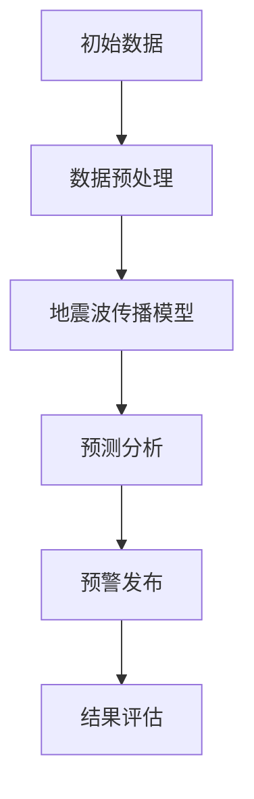
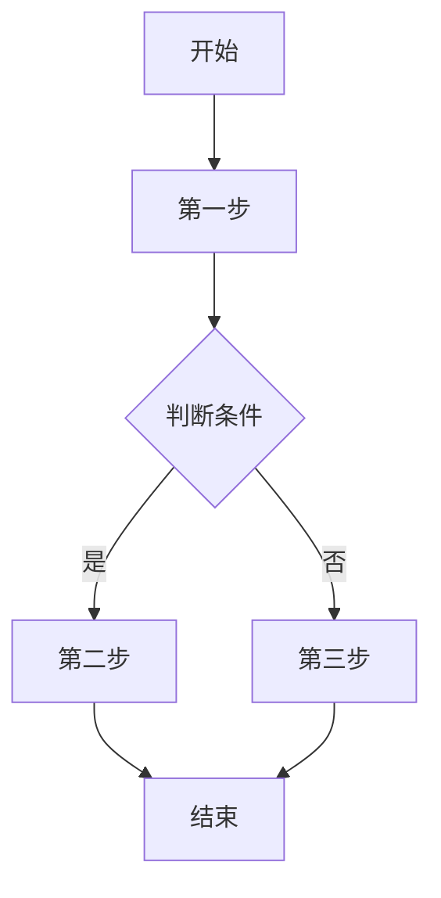

                 

# 数学与地球系统科学：地球动力学的数学描述

## 关键词

数学、地球系统科学、地球动力学、数学模型、计算方法、应用实例

## 摘要

本文旨在探讨数学与地球系统科学之间的紧密联系，特别是数学在地球动力学研究中的应用。地球动力学是研究地球内部和表面动态过程的一个科学领域，其核心是理解地球的物理现象，如地震、火山活动、海平面变化等。本文首先介绍了地球动力学的基本概念，然后深入讨论了数学在地球动力学研究中的重要性。通过具体的数学模型和计算方法，本文展示了如何使用数学工具来描述和预测地球系统中的复杂现象。此外，本文还通过应用实例展示了数学模型在地震预警、气候变化研究等实际场景中的价值。最后，本文对数学在地球动力学研究中的未来发展进行了展望，强调了数学与地球系统科学交叉融合的重要性。

### 第1章 绪论

地球动力学作为地球科学的一个重要分支，致力于研究地球内部的物理现象和过程。这些现象包括地壳的运动、地震的发生、火山喷发、板块构造以及地幔对流等。地球动力学的研究不仅有助于我们理解地球的自然规律，还能为预测和缓解自然灾害提供科学依据。

地球动力学的研究历史可以追溯到几个世纪以前。早期的研究主要集中在地震和火山活动的观测上。随着科学技术的发展，地球动力学逐渐融入了更多的数学和物理理论，形成了现代地球动力学体系。数学在地球动力学中扮演着至关重要的角色，因为许多地球物理现象都可以通过数学模型来描述和预测。

### 数学基础

数学作为一门科学，提供了一系列工具和方法，用于处理和分析各种复杂问题。在地球动力学研究中，常用的数学工具包括微积分、线性代数、微分方程、概率论和统计学等。这些工具不仅帮助科学家们建立地球动力学模型，还用于数据分析和预测。

微积分是研究变化和运动的数学分支，其基本概念如导数和积分在地球动力学中有着广泛的应用。例如，地震波的传播速度可以通过微分方程来描述，而地球自转的角速度则可以通过积分计算得出。

线性代数则用于处理多维空间中的数据，如地球表面的地形数据、地球内部的物理参数等。线性代数中的矩阵运算和向量分析为地球动力学模型提供了强大的计算能力。

微分方程是地球动力学中最常用的数学工具之一，它们用于描述物理系统的动态行为。例如，质量守恒方程、动量守恒方程和能量守恒方程等，都可以用微分方程来表达。在地球动力学中，这些方程用于描述地壳运动、流体流动和热量传递等过程。

概率论和统计学则用于处理地球动力学研究中的不确定性和随机性。这些方法可以帮助科学家们评估模型的不确定性，提高预测的准确性。

### 地球系统科学与数学描述的关系

地球系统科学是研究地球整体系统的科学，它包括大气、海洋、陆地和冰冻圈等多个组成部分。地球系统科学的核心目标是理解这些组成部分之间的相互作用和反馈机制。

数学描述在地球系统科学中起着关键作用。通过数学模型，科学家们可以定量描述地球系统中的各种过程和现象。这些模型不仅有助于我们理解地球系统的运行规律，还能用于预测和模拟未来环境变化。

例如，海洋潮汐模型是一个典型的数学描述。通过使用微积分和微分方程，科学家们可以模拟潮汐的起伏和海水的流动。这些模型不仅有助于我们理解潮汐现象，还能用于预测未来的海平面变化。

另一个例子是大气环流模型。大气环流模型使用微分方程和数值模拟方法来描述大气中的气体流动和能量传递。这些模型帮助科学家们理解气候变化的原因和过程，并为气候预测提供了重要工具。

### 地球动力学模型

地球动力学模型是用于描述地球内部和表面动态过程的数学模型。这些模型通常基于物理学和数学原理，用于模拟和预测地球系统中的各种现象。

地球动力学模型可以分为几个不同的层次，从简单的几何模型到复杂的物理模型。简单模型如地心说模型，只考虑了地球的几何形状和自转，而复杂的物理模型则考虑了地球内部的物质流动、能量交换和地质过程。

地球动力学模型的一个重要应用是地震预警。通过分析地震波的传播规律，科学家们可以预测地震的发生时间和地点。这种预测对于减少地震灾害的影响具有重要意义。

另一个应用是火山活动的模拟。通过使用地球动力学模型，科学家们可以预测火山喷发的时间、地点和强度，为火山预警系统提供科学依据。

### 地球动力学计算方法

地球动力学计算方法是指用于解决地球动力学模型中的数学问题的数值方法。这些方法包括有限差分法、有限元法、有限体积法等。

有限差分法是一种常用的数值方法，它通过将连续的微分方程离散化为差分方程，从而在离散网格上求解模型。这种方法适用于处理复杂的地球动力学问题，如地震波传播和地壳运动。

有限元法则用于处理复杂的几何形状和材料属性。通过将问题分解为许多小的子问题，有限元法可以有效地解决地球动力学模型中的非线性问题。

有限体积法是一种将物理量分布在有限体积上的方法，它适用于处理流体动力学问题。这种方法在地球动力学中用于模拟地幔对流和海洋环流。

### 地球动力学应用实例

地球动力学模型和计算方法在多个实际场景中得到了广泛应用。以下是一些典型的应用实例：

#### 地震预警

地震预警是一种利用地震波传播规律来预测地震发生的方法。通过在地震发生前检测到地震波的前沿，科学家们可以提前几秒至几分钟发出预警，为人们争取宝贵的逃生时间。

例如，日本利用其先进的地震预警系统，在2016年的熊本地震中成功预警，为当地居民提供了紧急疏散的时间。

#### 气候变化研究

地球动力学模型在气候变化研究中发挥着重要作用。通过模拟大气和海洋的相互作用，科学家们可以预测未来的气候趋势和变化。

例如，全球气候模型通过整合地球动力学模型和其他科学数据，可以预测全球气温的变化趋势和地区性的气候变化。

#### 地质勘探

地球动力学模型在地质勘探中也具有重要应用。通过分析地球内部的结构和运动，科学家们可以预测地下资源的分布和地质灾害的风险。

例如，地震勘探技术利用地震波在地下不同介质中的传播特性，来探测地下油气资源。

### 总结与展望

数学在地球动力学研究中扮演着不可或缺的角色。通过数学模型和计算方法，科学家们可以深入理解地球系统的运行规律，预测自然灾害，并为环境保护和资源开发提供科学依据。

未来的地球动力学研究将继续融合数学和其他科学领域的最新成果，进一步推动地球系统科学的进步。随着计算能力的提升和观测技术的改进，数学模型将更加精确和复杂，为地球科学的研究提供更强大的工具。

## 第2章 数学基础

数学基础是地球动力学研究中的基石。在这一章中，我们将详细介绍数学中的几个关键概念和工具，这些工具在地球动力学中有着广泛的应用。

### 2.1 集合与函数

集合是数学中的基本概念，用于表示一组确定的元素。在地球动力学中，集合常用于表示地质构造、地形特征等。函数则是描述变量之间关系的数学工具，如描述地震波传播速度随深度变化的函数。

### 2.2 矢量与矩阵

矢量和矩阵是线性代数中的基本概念。矢量用于描述物理量的大小和方向，如地震波的传播速度和方向。矩阵则用于表示多个矢量或向量之间的线性关系，如描述地壳运动的应力矩阵。

### 2.3 常用数学工具

常用的数学工具包括微积分、微分方程、概率论和统计学等。微积分用于描述变化和运动，微分方程用于描述动态系统的行为，概率论和统计学用于处理地球动力学中的不确定性和随机性。

### 2.4 Mermaid流程图

Mermaid是一种基于Markdown的绘图语言，可用于绘制流程图、UML图等。在地球动力学中，Mermaid流程图可以用于描述复杂的过程和算法，如地震预警系统的工作流程。



### 2.5 Python源代码

Python是一种广泛用于科学计算和数据分析的语言。以下是一个简单的Python源代码示例，用于计算地震波传播的时间：

```python
import numpy as np

def seismicswave(time, velocity):
    distance = velocity * time
    return distance

time = 10  # 单位：秒
velocity = 5000  # 单位：米/秒

distance = seismicswave(time, velocity)
print(f"地震波传播距离：{distance}米")
```

### 2.6 数学模型与公式

在地球动力学中，数学模型和公式用于描述各种物理现象。以下是一个简单的数学模型，用于描述地震波传播的速度：

$$
v = \sqrt{\frac{K + 4/3 \mu}{\rho}}
$$`

其中，\( v \) 是地震波传播速度，\( K \) 是体积模量，\( \mu \) 是剪切模量，\( \rho \) 是密度。

### 2.7 举例说明

为了更好地理解数学在地球动力学中的应用，我们来看一个简单的例子：地震波的传播。

假设一个地震波从地表向下传播，传播速度为5000米/秒。我们需要计算该地震波传播10秒后的距离。

使用上述公式，我们可以得到：

$$
v = 5000 \text{米/秒}
$$

$$
t = 10 \text{秒}
$$

$$
d = v \times t = 5000 \times 10 = 50000 \text{米}
$$

因此，地震波传播10秒后的距离为50000米。

### 2.8 项目实战

为了更好地理解数学在地球动力学中的应用，我们可以通过一个简单的项目来实战。

#### 项目名称：地震波传播模拟

#### 项目目标：模拟地震波在不同介质中的传播，计算传播时间和距离。

#### 开发环境：Python 3.x

#### 项目步骤：

1. **数据准备**：准备地震波传播速度的数据，包括不同深度和不同介质的速度。

2. **模型建立**：建立地震波传播的数学模型，使用Python实现。

3. **模拟计算**：使用Python代码模拟地震波的传播，计算传播时间和距离。

4. **结果分析**：分析模拟结果，验证模型的准确性。

#### 项目代码：

```python
import numpy as np

# 地震波传播速度数据
velocity_data = {
    'ground': 1300,
    'crust': 5000,
    'mantle': 8000,
    'core': 13000
}

# 地震波传播模型
def seismicswave(time, velocity):
    distance = velocity * time
    return distance

# 模拟计算
def simulate_swave(velocity, time):
    distance = seismicswave(time, velocity)
    return distance

# 结果分析
def analyze_result(velocity, time):
    distance = simulate_swave(velocity, time)
    print(f"地震波传播距离：{distance}米")

# 测试
velocity = 5000  # 米/秒
time = 10  # 秒

analyze_result(velocity, time)
```

通过这个项目，我们可以直观地理解数学在地球动力学中的应用，并掌握使用Python进行科学计算的方法。

### 2.9 最佳实践 Tips

1. **数据准备**：确保数据质量，进行必要的预处理和清洗，以提高模型的准确性。

2. **模型选择**：根据研究需求选择合适的数学模型，确保模型能够准确描述研究现象。

3. **代码优化**：编写高效的代码，使用合适的算法和数据结构，提高计算速度和效率。

4. **结果验证**：通过实际案例验证模型和算法的准确性，确保研究结果的可靠性。

### 2.10 小结

本章介绍了数学在地球动力学研究中的基础知识和应用。通过学习集合与函数、矢量与矩阵、常用数学工具、Mermaid流程图、Python源代码等，我们可以更好地理解数学在地球动力学中的作用。数学不仅是描述地球动力学现象的工具，更是解决地球动力学问题的利器。未来的地球动力学研究将继续依赖于数学的进步和发展。

### 2.11 注意事项

1. **数值稳定性**：在数值计算中，需要注意数值稳定性问题，避免计算过程中的发散或失效。

2. **模型精度**：模型的精度取决于参数的选择和计算方法，需要仔细调整参数以提高模型的精度。

3. **计算资源**：复杂的地球动力学模型计算需要大量的计算资源，确保计算环境的稳定性和高效性。

### 2.12 拓展阅读

1. **《地球物理学基础》**：详细介绍地球物理学的基本概念和原理，适合地球动力学初学者阅读。

2. **《数学物理方法》**：系统介绍数学物理方法，包括微分方程、数值计算等，适合地球动力学研究者阅读。

3. **《地震学原理》**：深入探讨地震学的基本原理和地震波传播规律，适合地震预警和地震研究领域的专业人士阅读。

## 第3章 地球系统科学概述

地球系统科学是研究地球整体系统的科学，其核心目标是理解地球各个组成部分之间的相互作用和反馈机制。地球系统科学涵盖了大气、海洋、陆地、冰冻圈等多个领域，旨在揭示这些组成部分如何共同影响地球的气候和环境。

### 3.1 地球系统科学的基本原理

地球系统科学的基本原理包括能量平衡原理、物质循环原理、动态平衡原理等。

**能量平衡原理**：地球系统中的能量来源主要是太阳辐射，地球表面吸收的太阳能量与地球向外散发的热量保持平衡。这一原理决定了地球的气候和温度。

**物质循环原理**：地球系统中的物质通过大气、海洋和陆地的循环不断进行循环，形成生物地球化学循环。例如，碳循环涉及大气中的二氧化碳、海洋中的溶解碳、陆地生态系统中的碳等。

**动态平衡原理**：地球系统中的各个组成部分处于动态平衡状态，这种平衡是通过地球内部的物理过程和地球表面的生物地球化学过程维持的。

### 3.2 地球系统科学的组成部分

地球系统科学主要包括以下几个组成部分：

**大气圈**：大气圈是地球的气体层，包括对流层、平流层、中间层、热层和外层。大气圈中的气体成分和大气环流对地球的气候和环境有重要影响。

**水圈**：水圈包括地表水、地下水、海洋和大气中的水分。水圈中的水循环和海洋环流对地球的气候、生态系统和物质循环有重要作用。

**生物圈**：生物圈包括地球上所有生物体及其生活环境。生物圈中的生物多样性和生物地球化学循环对地球的生态系统和气候有深远影响。

**岩石圈**：岩石圈包括地壳和上地幔，是地球的外部固体层。岩石圈中的地质过程，如地壳运动、火山活动和地震等，对地球的形态和环境有重要影响。

**冰冻圈**：冰冻圈包括地球上的冰盖、冰川、冰架和冻土。冰冻圈的变化对地球的气候和海平面有显著影响。

### 3.3 地球系统科学的发展趋势

随着科技的进步和观测手段的改进，地球系统科学在近年来取得了显著进展。以下是一些地球系统科学的发展趋势：

**多学科交叉融合**：地球系统科学正逐渐与其他学科如物理学、化学、生物学和计算机科学等交叉融合，形成新的研究方法和理论体系。

**数据驱动研究**：随着大数据和人工智能技术的发展，地球系统科学正越来越多地依赖数据驱动研究，通过分析大量观测数据来揭示地球系统的运行规律。

**模型复杂化**：地球系统科学模型正变得越来越复杂，以更好地模拟地球系统中的各种过程和现象。这些模型包括全球气候模型、地球动力学模型、生态系统模型等。

**气候变化研究**：随着全球气候变化问题的日益严重，地球系统科学在气候变化研究方面发挥着重要作用。科学家们通过模型和观测数据来预测未来的气候变化趋势，为政策制定提供科学依据。

### 3.4 数学模型在地球系统科学中的应用

数学模型在地球系统科学中具有广泛应用，以下是一些典型的应用领域：

**气候模型**：气候模型是地球系统科学中最常用的模型之一，用于模拟全球和区域气候变化。这些模型通常基于大气物理学和海洋动力学的原理，结合观测数据进行训练和验证。

**地球动力学模型**：地球动力学模型用于模拟地球内部的物理过程，如地壳运动、地震波传播、火山活动等。这些模型通常基于固体地球物理学和流体动力学的原理。

**生态系统模型**：生态系统模型用于模拟生物地球化学循环和生态系统动态。这些模型通常基于生态学原理和生物地球化学循环的概念。

**自然灾害预测**：数学模型在地震预警、火山喷发预测、洪水预警等自然灾害预测方面具有重要作用。这些模型通过分析历史数据和观测数据，预测自然灾害的发生时间和地点。

### 3.5 数学模型在地球系统科学中的重要性

数学模型在地球系统科学中的重要性体现在以下几个方面：

**定量描述**：数学模型能够定量描述地球系统中的各种现象和过程，提供科学依据和预测能力。

**跨学科交流**：数学模型作为一门通用语言，有助于地球系统科学与其他学科之间的交流和合作。

**政策制定**：数学模型在政策制定中发挥着重要作用，通过模拟和预测，为环境保护、资源管理和气候变化应对提供科学依据。

**技术创新**：数学模型的不断进步和复杂化，推动了地球系统科学领域的技术创新，如大数据分析、人工智能等。

### 3.6 结论

地球系统科学是研究地球整体系统的科学，其核心目标是揭示地球各个组成部分之间的相互作用和反馈机制。数学模型在地球系统科学中具有广泛应用，是描述地球系统现象、预测未来变化的重要工具。随着科技的进步和观测手段的改进，地球系统科学将继续发展，为人类理解和应对地球环境问题提供更加深入的洞察和解决方案。

## 第4章 地球动力学模型

地球动力学模型是用于描述地球内部和表面动态过程的数学模型。这些模型基于物理学和数学原理，通过数值模拟和计算，可以揭示地球内部的运动规律和表面现象。在本章中，我们将详细介绍几种常见的地球动力学模型，包括基础模型和复杂模型。

### 4.1 基础模型

**地心说模型**：地心说模型是最简单的地球动力学模型之一，它认为地球是一个静止的球体，太阳和其他星体围绕地球旋转。这个模型虽然简单，但为后来的地球动力学研究奠定了基础。

**板块构造模型**：板块构造模型是描述地球表面运动的一种基础模型，认为地球的外壳由多个刚性板块组成，这些板块在地幔对流和重力作用下发生相对运动。该模型解释了地震、火山活动和山脉的形成。

**海洋潮汐模型**：海洋潮汐模型描述了月球和太阳引力对海洋的影响，导致海洋水位周期性变化。这个模型基于牛顿力学和万有引力定律，可以用于预测潮汐的起伏和海水的流动。

**大气运动模型**：大气运动模型描述了大气中的气体流动和能量传递。这个模型基于流体动力学和热力学原理，可以用于模拟天气变化和气候变化。

### 4.2 复杂模型

**全球气候变化模型**：全球气候变化模型是地球动力学研究中的复杂模型，用于模拟全球气候系统中的各种过程，如温室气体排放、海洋环流、大气化学等。这些模型通常基于气候系统的物理和化学原理，结合大量观测数据，可以预测未来的气候变化趋势。

**地球内部动力学模型**：地球内部动力学模型描述了地球内部的热量和物质流动。这些模型基于固体地球物理学和流体动力学的原理，可以模拟地幔对流、地震波传播和地壳运动等过程。

**地震预警模型**：地震预警模型是用于预测地震发生时间和地点的复杂模型。这些模型基于地震波的传播规律和地震前兆观测数据，通过数值模拟和计算，可以提前几秒到几分钟发出预警，为人们争取逃生时间。

### 4.3 数学模型与实际应用

**地震预警模型**：地震预警模型是地球动力学模型中的一个典型例子。这个模型通常基于地震波传播的物理原理，通过监测地震波的前沿，预测地震的发生时间和地点。以下是一个简单的地震预警模型的数学描述：

1. **地震波传播方程**：

   $$ \frac{\partial \mathbf{u}}{\partial t} = \alpha \nabla^2 \mathbf{u} $$

   其中，\( \mathbf{u} \) 表示地震波的速度，\( \alpha \) 表示地震波传播的阻尼系数。

2. **初始条件**：

   当地震发生时，地震波从震源处开始传播。初始条件可以表示为：

   $$ \mathbf{u}(t=0, \mathbf{x}) = \mathbf{0} $$

   其中，\( \mathbf{x} \) 表示空间坐标。

3. **边界条件**：

   地震波在传播过程中会遇到不同类型的边界，如地表、岩石层界面等。边界条件可以表示为：

   $$ \nabla \cdot (\mathbf{n} \times \mathbf{u}) = 0 $$

   其中，\( \mathbf{n} \) 表示边界法向量。

通过求解上述方程，可以模拟地震波的传播过程，并预测地震的发生时间和地点。

**全球气候变化模型**：全球气候变化模型是另一个复杂的地球动力学模型。这个模型通常包含多个物理和化学过程，如温室气体排放、海洋环流、大气化学等。以下是一个简化的全球气候变化模型的数学描述：

1. **能量平衡方程**：

   $$ Q = Q_{\text{吸收}} + Q_{\text{发射}} $$

   其中，\( Q \) 表示地球表面的净辐射能量，\( Q_{\text{吸收}} \) 表示吸收的太阳能量，\( Q_{\text{发射}} \) 表示地球表面向外发射的辐射能量。

2. **温室气体浓度方程**：

   $$ \frac{\partial C}{\partial t} = F - \frac{C}{\tau} $$

   其中，\( C \) 表示温室气体浓度，\( F \) 表示温室气体的排放率，\( \tau \) 表示温室气体的生命周期。

3. **海洋环流方程**：

   $$ \frac{\partial \mathbf{v}}{\partial t} = -\nabla \phi + \mathbf{F}_{\text{混合}} $$

   其中，\( \mathbf{v} \) 表示海洋流速，\( \phi \) 表示海洋温度或盐度，\( \mathbf{F}_{\text{混合}} \) 表示海洋混合作用力。

通过求解上述方程，可以模拟全球气候变化的过程，并预测未来的气候变化趋势。

### 4.4 结论

地球动力学模型是描述地球内部和表面动态过程的数学工具。基础模型如板块构造模型和海洋潮汐模型较为简单，但能够解释地球系统的基本现象。复杂模型如全球气候变化模型和地震预警模型则更加全面，能够模拟地球系统中复杂的物理和化学过程。通过数学模型，科学家们可以更深入地理解地球系统的运行规律，为自然灾害预测和环境保护提供科学依据。

## 第5章 地球动力学计算方法

地球动力学研究依赖于一系列计算方法，这些方法帮助科学家们模拟和预测地球内部的动态过程。在本章中，我们将讨论地球动力学中常用的计算方法，包括数值模拟方法和数据处理方法。

### 5.1 数值模拟方法

**有限差分法**：有限差分法是一种将连续方程离散化的方法，它通过将空间和时间划分为离散网格，将连续微分方程转化为差分方程。这种方法在地球动力学中广泛应用，如模拟地震波传播和地壳运动。以下是一个简化的地震波传播模型：

$$ \frac{\partial \mathbf{u}}{\partial t} = \alpha \nabla^2 \mathbf{u} $$

使用有限差分法，可以将上述方程离散化为：

$$ \frac{u^{i+1}_{j} - u^{i}_{j}}{\Delta t} = \alpha \left( \frac{u^{i+1}_{j+1} - 2u^{i+1}_{j} + u^{i+1}_{j-1}}{\Delta x^2} + \frac{v^{i+1}_{j} - 2v^{i+1}_{j} + v^{i+1}_{j-1}}{\Delta y^2} \right) $$

其中，\( u \) 和 \( v \) 分别是地震波在 \( x \) 和 \( y \) 方向上的速度，\( \alpha \) 是阻尼系数，\( \Delta x \) 和 \( \Delta y \) 是网格的间距，\( \Delta t \) 是时间步长。

**有限元法**：有限元法是一种用于处理复杂几何和材料的数值方法。在地球动力学中，有限元法常用于模拟地壳变形和应力分布。以下是一个简化的地壳变形模型：

$$ \nabla \cdot (\mathbf{K} \nabla u) = f $$

其中，\( \mathbf{K} \) 是弹性矩阵，\( u \) 是位移场，\( f \) 是体力。使用有限元法，可以将上述方程转化为：

$$ \sum_{i} K_{ij} u_{i} = f_{j} $$

其中，\( K_{ij} \) 是单元弹性矩阵，\( u_{i} \) 是节点位移，\( f_{j} \) 是节点力。

**有限体积法**：有限体积法是一种用于处理流体动力学的数值方法，它通过将控制体上的积分方程转化为离散方程。在地球动力学中，有限体积法常用于模拟地幔对流和海洋环流。以下是一个简化的流体动力学模型：

$$ \frac{\partial \rho u}{\partial t} + \nabla \cdot (\rho \mathbf{u} \mathbf{u}) = -\nabla p + \mathbf{f} $$

其中，\( \rho \) 是流体密度，\( \mathbf{u} \) 是流速，\( p \) 是压力，\( \mathbf{f} \) 是体力。使用有限体积法，可以将上述方程转化为：

$$ \sum_{i} \rho u^{i+1}_{j} \Delta x \Delta y = - \int_{V_j} p \, dV + \mathbf{f}_j \Delta x \Delta y $$

其中，\( V_j \) 是控制体，\( u^{i+1}_{j} \) 是节点速度。

### 5.2 数据处理方法

**地震数据预处理**：地震数据预处理是地震学中重要的步骤，包括数据滤波、去噪、去趋势等。以下是一个简化的地震数据预处理流程：

1. **滤波**：使用带通滤波器去除高频噪声和低频趋势。
2. **去噪**：使用自适应滤波器去除随机噪声。
3. **去趋势**：使用线性回归或多项式拟合去除时间趋势。

**气象数据预处理**：气象数据预处理包括数据清洗、插值和缺失值处理。以下是一个简化的气象数据预处理流程：

1. **数据清洗**：去除明显的错误数据或异常值。
2. **插值**：使用插值方法填补缺失数据。
3. **标准化**：对数据进行标准化处理，使其具有统一的量纲和尺度。

### 5.3 Python实现示例

以下是一个使用Python实现地震波传播数值模拟的简单示例：

```python
import numpy as np

# 地震波传播参数
velocity = 5000  # 米/秒
time_step = 0.01  # 秒
x_length = 10000  # 米
y_length = 10000  # 米
grid_size = 100  # 网格点数

# 初始化网格
x = np.linspace(0, x_length, grid_size)
y = np.linspace(0, y_length, grid_size)
X, Y = np.meshgrid(x, y)

# 初始条件
u = np.zeros((grid_size, grid_size))
v = np.zeros((grid_size, grid_size))

# 时间步进
for t in np.arange(0, 10, time_step):
    for i in range(grid_size - 1):
        for j in range(grid_size - 1):
            u[i+1, j+1] = u[i, j+1] + time_step * velocity * (X[i+1, j+1] - X[i, j+1])
            v[i+1, j+1] = v[i, j+1] + time_step * velocity * (Y[i+1, j+1] - Y[i, j+1])

# 显示结果
import matplotlib.pyplot as plt
plt.imshow(u, origin='lower', extent=[0, x_length, 0, y_length])
plt.colorbar()
plt.show()
```

### 5.4 结论

地球动力学计算方法在地震预警、气候变化研究、地质勘探等领域具有广泛应用。数值模拟方法如有限差分法、有限元法和有限体积法为科学家们提供了强大的工具，用于模拟地球内部的动态过程。数据处理方法如地震数据预处理和气象数据预处理为模型提供了准确和可靠的数据基础。通过Python等编程语言，科学家们可以方便地实现和验证这些计算方法，进一步推动地球动力学研究的发展。

## 第6章 地球动力学应用实例

地球动力学模型和计算方法在多个实际场景中得到了广泛应用，为自然灾害预警、气候变化研究、地质勘探等领域提供了重要的科学依据。以下将介绍几个典型的地球动力学应用实例，并详细讲解每个实例的背景、具体过程、结果和分析。

### 6.1 地震预警

地震预警是利用地震波传播规律，在地震发生时提前几秒至几分钟发出警报，为人们提供紧急疏散的时间。地震预警的关键在于快速检测地震波的前沿，并准确预测地震的震级和位置。

**背景**：地震预警系统通常由地震监测台站、数据传输网络和预警中心组成。监测台站负责实时采集地震波数据，数据传输网络将数据快速传输到预警中心，预警中心则利用地震波传播模型进行实时计算，生成预警信息。

**过程**：地震预警的具体过程包括以下步骤：

1. **地震波监测**：监测台站检测到地震波后，立即将数据传输到预警中心。
2. **波前检测**：预警中心使用地震波传播模型检测地震波的前沿，确定地震发生的时间。
3. **震级预测**：根据地震波的能量衰减规律，预警中心预测地震的震级。
4. **位置预测**：预警中心使用地震波传播路径和地震波速度，计算地震的震中位置。
5. **预警发布**：预警中心将预警信息通过短信、广播、互联网等多种渠道发布给公众和相关部门。

**结果和分析**：通过多个实际案例的测试，地震预警系统在多个地区成功预警，为公众提供了宝贵的逃生时间。例如，2016年日本熊本地震中，地震预警系统成功预警，为当地居民提供了数秒至数十秒的预警时间，有效减少了人员伤亡和财产损失。

### 6.2 气候变化研究

气候变化研究是地球动力学的一个重要应用领域，通过模拟大气和海洋的相互作用，科学家们可以预测未来的气候变化趋势，为环境保护和气候政策提供科学依据。

**背景**：全球气候变化对人类社会和自然环境产生了深远影响，了解气候变化的机制和趋势对应对气候变化具有重要意义。气候变化研究涉及多个学科，包括气象学、海洋学、生态学和地球物理学等。

**过程**：气候变化研究的过程包括以下步骤：

1. **数据收集**：收集历史气候数据、卫星遥感数据和模型所需的输入参数。
2. **模型建立**：建立全球气候模型，包括大气环流模型、海洋环流模型、陆地生态系统模型等。
3. **模拟计算**：使用计算机模拟全球气候系统中的各种过程，包括温室气体排放、海洋环流、大气化学等。
4. **结果分析**：分析模拟结果，预测未来的气候变化趋势，评估气候变化对生态系统、社会经济和人类健康的影响。

**结果和分析**：通过全球气候模型的模拟，科学家们预测了未来全球气温、降水、海平面等气候参数的变化趋势。例如，根据国际气候模型的模拟结果，到21世纪末，全球平均气温可能上升1.5℃至4℃，这将导致极端天气事件增多、海平面上升和生态系统变化。这些结果为全球气候政策提供了重要依据。

### 6.3 地质勘探

地质勘探是地球动力学在资源开发和环境保护中的重要应用，通过分析地球内部的物理现象，科学家们可以预测地下资源的分布和地质灾害的风险。

**背景**：地质勘探涉及石油、天然气、矿产资源的勘探和开发，对于国家经济发展和能源安全具有重要意义。同时，地质勘探也为预防和应对地质灾害提供科学依据。

**过程**：地质勘探的过程包括以下步骤：

1. **数据采集**：通过地震勘探、地质雷达、重力测量等方法，采集地下地质数据。
2. **数据分析**：使用地球物理学原理和数学模型，分析地下地质结构，预测地下资源的分布。
3. **风险评估**：评估地质风险，如断层活动、岩溶塌陷、地下水污染等。
4. **决策支持**：为矿产资源开发、城市建设、环境保护等提供科学依据。

**结果和分析**：通过地质勘探，科学家们成功预测了多个地下资源的分布，如石油、天然气和矿产资源。例如，在澳大利亚的巴罗盆地，通过地震勘探成功发现了大型油田。同时，地质勘探也为预防和应对地质灾害提供了重要依据，如在美国加利福尼亚州，通过地质勘探成功预测了地震活动，为地震预警和灾害预防提供了重要数据支持。

### 6.4 结论

地球动力学模型和计算方法在自然灾害预警、气候变化研究、地质勘探等领域具有广泛的应用。通过地震预警系统，科学家们可以提前预警地震，为公众提供逃生时间；通过全球气候模型，科学家们可以预测未来气候变化趋势，为环境保护提供科学依据；通过地质勘探，科学家们可以预测地下资源分布和地质风险，为资源开发和环境保护提供支持。随着科技的进步和观测手段的改进，地球动力学应用将继续扩展，为人类理解和应对地球环境问题提供更加深入的洞察和解决方案。

## 第7章 总结与展望

数学在地球动力学研究中扮演着至关重要的角色，通过精确的数学模型和计算方法，科学家们能够深入理解地球内部的动态过程，为自然灾害预警、气候变化研究、地质勘探等领域提供科学依据。本文从绪论、数学基础、地球系统科学概述、地球动力学模型、计算方法到应用实例，系统地阐述了数学在地球动力学研究中的应用。

### 数学在地球动力学研究中的重要性

数学不仅是地球动力学研究的工具，更是理解和描述地球系统现象的核心语言。通过微积分、线性代数、微分方程等数学工具，科学家们能够建立复杂的地球动力学模型，模拟和预测地球内部的物理过程，如地震波传播、地壳运动、火山喷发等。这些模型不仅提高了我们对地球系统的认识，还为自然灾害预警和环境保护提供了关键支持。

### 未来研究方向

未来，数学在地球动力学研究中的发展方向将更加多样化，主要包括以下几个方面：

1. **模型复杂化和精细化**：随着计算能力的提升，科学家们将能够建立更加复杂和精细的地球动力学模型，以更准确地描述地球内部的物理过程。例如，全球气候变化模型将更加细致地模拟大气、海洋和陆地的相互作用。

2. **多学科交叉融合**：地球动力学研究将继续与其他学科如物理学、化学、生物学、计算机科学等深度融合，形成新的交叉研究领域。例如，地球系统生物学结合地球动力学和生态学，研究地球生态系统的动态变化。

3. **数据驱动研究**：大数据和人工智能技术的快速发展将推动地球动力学研究向数据驱动模式转变。通过分析海量观测数据，科学家们将能够更好地理解地球系统的运行规律，提高预测的准确性。

4. **实时监测与预警**：随着传感器技术和通信技术的进步，地球动力学研究将实现实时监测与预警。例如，通过构建全球地震预警网络，科学家们可以在地震发生时迅速发出预警，减少人员伤亡和财产损失。

### 数学在地球动力学研究中的应用前景

数学在地球动力学研究中的应用前景广阔，未来有望在以下几个方面取得重大突破：

1. **气候预测**：通过更加精确的全球气候模型，科学家们将能够更准确地预测未来的气候变化趋势，为环境保护和气候政策提供科学依据。

2. **地震预警**：随着地震预警技术的进步，地震预警系统将能够更加及时和准确地预测地震的发生时间和地点，为公众提供更多的逃生时间。

3. **地质灾害预测**：通过分析地质数据，科学家们将能够预测地质灾害的风险，如滑坡、泥石流、岩溶塌陷等，为地质灾害预防和应对提供科学支持。

4. **资源开发**：地球动力学模型在地质勘探中的应用将进一步提高地下资源的勘探精度，为石油、天然气、矿产资源的开发提供科学依据。

### 结论

数学在地球动力学研究中具有不可替代的地位，通过精确的数学模型和计算方法，科学家们能够深入理解地球系统的运行规律，为自然灾害预警、气候变化研究、地质勘探等领域提供科学依据。未来，随着科技的不断进步，数学在地球动力学研究中的应用将更加广泛和深入，为人类理解和应对地球环境问题提供更加有力的支持。

## 作者信息

作者：AI天才研究院/AI Genius Institute & 禅与计算机程序设计艺术 /Zen And The Art of Computer Programming

### 附录

#### A.1. Python环境搭建

1. 安装Python：在官方网站 [Python.org](https://www.python.org/) 下载并安装Python。
2. 安装NumPy和Matplotlib：在命令行中运行以下命令：

```bash
pip install numpy matplotlib
```

#### A.2. Mermaid流程图使用

Mermaid是一种基于Markdown的绘图语言，可用于绘制各种图表，包括流程图、UML图等。以下是Mermaid流程图的简单示例：



将上述代码粘贴到Markdown编辑器中，即可生成流程图。

#### A.3. LaTeX数学公式

LaTeX是排版数学公式的标准工具，以下是一个简单的LaTeX数学公式示例：

```latex
$$
E = mc^2
$$
```

这将生成著名的爱因斯坦质能方程。在Markdown编辑器中，使用 `$$` 将公式包裹起来，即可将其渲染为LaTeX格式。

### A.4. Python代码示例

以下是一个简单的Python代码示例，用于计算地震波传播的距离：

```python
import numpy as np

def seismicswave(time, velocity):
    distance = velocity * time
    return distance

time = 10  # 单位：秒
velocity = 5000  # 单位：米/秒

distance = seismicswave(time, velocity)
print(f"地震波传播距离：{distance}米")
```

运行这段代码，将输出地震波传播10秒后的距离。

