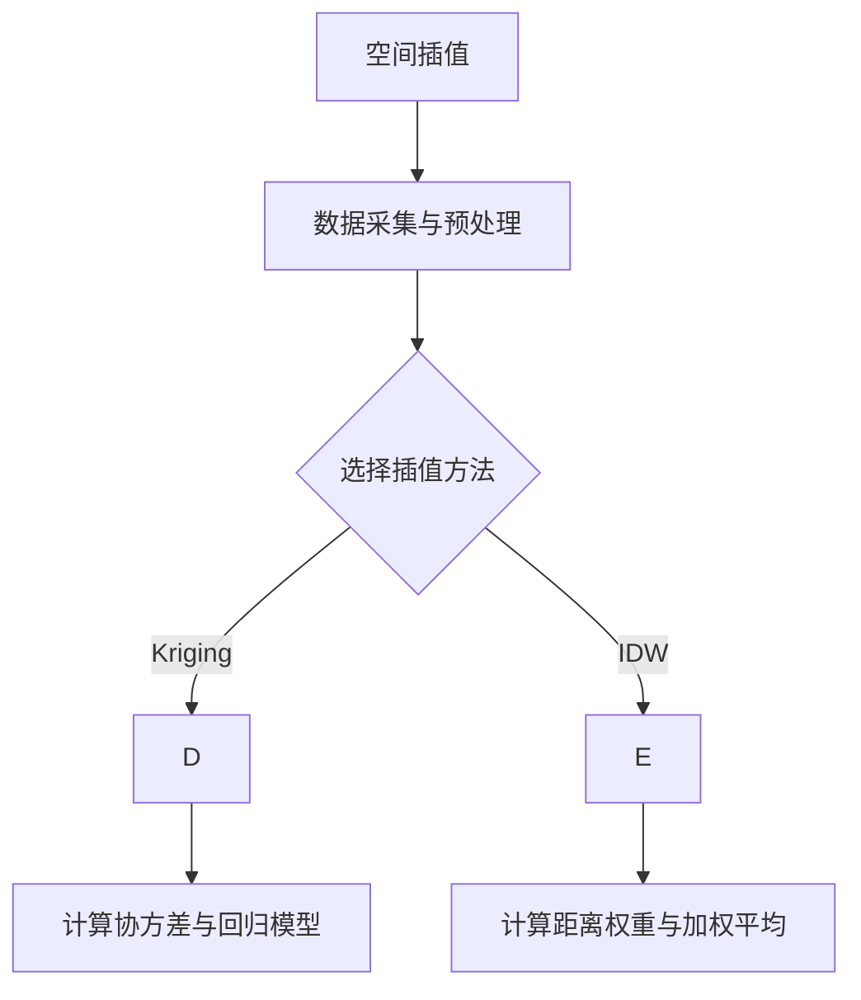

                 

# 数学与地理信息系统：空间数据分析的数学方法

## 关键词

- 地理信息系统（GIS）
- 空间数据分析
- 数学方法
- 空间插值
- 空间聚类
- 回归分析
- 分类算法

## 摘要

本文旨在探讨数学方法在地理信息系统（GIS）中的应用，特别是在空间数据分析领域的应用。文章首先介绍了GIS和空间数据分析的基本概念，然后详细讨论了数学方法在GIS中的应用，包括空间插值、空间聚类、回归分析和分类算法。文章通过具体的Python代码示例，对每个数学方法进行了深入讲解，并提供了实际案例分析和代码解读。最后，文章总结了空间数据分析的未来发展方向，并提出了最佳实践建议。

## 引言

地理信息系统（GIS）是一种用于捕捉、存储、分析和管理地理空间数据的工具。随着计算机技术的发展，GIS已经成为地理科学、环境科学、城市规划、交通工程等领域的重要工具。空间数据分析是GIS的核心功能之一，它涉及对地理空间数据进行统计分析、模式识别和预测等操作，以提取有用的信息。

数学方法在空间数据分析中扮演着关键角色。从几何学、概率论到统计学，再到拓扑学和集合论，各种数学工具都被应用于空间数据的分析和解释。这些方法不仅帮助提高了数据分析的精度和效率，也为理解和解释空间现象提供了理论基础。

本文将分几个部分详细探讨数学方法在GIS空间数据分析中的应用。首先，我们将介绍GIS和空间数据分析的基本概念。然后，我们将逐个介绍并分析以下数学方法：

1. **空间插值方法**：如Kriging方法和Inverse Distance Weighting方法。
2. **空间聚类方法**：如K-means算法和DBSCAN算法。
3. **回归分析方法**：如线性回归和多项式回归。
4. **分类方法**：如K最近邻算法和支持向量机。

最后，我们将通过实际案例展示这些数学方法在GIS中的应用，并总结全文，展望空间数据分析的未来发展方向。

## GIS与空间数据分析简介

地理信息系统（GIS）是一种用于捕捉、存储、分析和可视化地理空间数据的计算机系统。它不仅仅是一个地图制作工具，更是一个强大的数据分析平台。GIS能够处理不同来源的地理数据，如卫星影像、航空照片、地形数据、人口统计数据等，并利用这些数据进行分析和决策支持。

空间数据分析是GIS的核心功能之一，它涉及到对地理空间数据进行统计分析和模式识别。空间数据分析的目的是从地理空间数据中提取有意义的信息，以便更好地理解和解释地理现象。空间数据分析的应用领域非常广泛，包括城市规划、环境保护、交通规划、资源管理、灾害预警等。

在GIS中，空间数据分析通常涉及以下步骤：

1. **数据采集与预处理**：收集相关的地理空间数据，并进行数据清洗和预处理，以确保数据的质量和一致性。
2. **数据存储与管理**：将预处理后的地理空间数据存储在GIS数据库中，并使用相应的数据管理工具进行管理。
3. **数据分析**：使用各种数学方法和算法对地理空间数据进行分析，如空间插值、空间聚类、回归分析和分类算法等。
4. **数据可视化**：将分析结果以地图、图表等形式进行可视化，以便更直观地展示地理现象和趋势。

空间数据分析的数学方法主要包括以下几类：

### 1. 几何学基础

几何学是空间数据分析的基础，它涉及到地理空间数据的几何形状、大小、位置和方向等属性。基本的几何学概念包括点、线、面、多边形、圆等。在GIS中，这些几何学概念被用于地理空间数据的建模和表示。

### 2. 概率论与统计学基础

概率论和统计学是空间数据分析的重要工具，用于描述地理空间数据的随机性和统计特性。常见的概率分布、假设检验、回归分析等方法在空间数据分析中有着广泛的应用。

### 3. 拓扑学基础

拓扑学是研究几何图形在连续变形下保持不变的性质的数学分支。在GIS中，拓扑学用于地理空间数据的拓扑关系分析，如邻接关系、包含关系等。

### 4. 集合论基础

集合论是数学的基础之一，用于描述和操作集合。在GIS中，集合论被用于地理空间数据的集合操作，如交集、并集、差集等。

这些数学方法为GIS中的空间数据分析提供了理论基础和工具。通过结合这些方法，GIS能够对复杂的地理空间数据进行分析和处理，从而为决策提供支持。接下来，我们将详细讨论这些数学方法在GIS中的应用。

### 空间插值方法

空间插值是GIS中常用的一种方法，用于估计未知位置的数据值。空间插值的基本思想是根据已知的有限数据点，通过数学模型或算法来预测未知位置的数据值。空间插值在地质勘探、环境监测、气象预报等领域有广泛的应用。

空间插值方法可以分为两大类：局部插值和全局插值。局部插值方法主要基于邻近点的数据值进行插值，而全局插值方法则考虑所有数据点的全局分布进行插值。

#### 1. Kriging方法

Kriging方法是最常用的空间插值方法之一，它基于最小二乘回归和局部协方差结构进行插值。Kriging方法的优点是能够提供最佳无偏估计，并且可以估计插值误差。下面是Kriging方法的简单步骤：

1. **数据采集**：收集具有地理坐标和属性值的数据点。
2. **建立协方差模型**：根据数据点的分布特征，选择合适的协方差模型，如指数模型或高斯模型。
3. **计算协方差**：计算每个数据点与未知点之间的协方差。
4. **建立回归模型**：使用最小二乘法建立回归模型。
5. **插值计算**：根据回归模型计算未知点的数据值。

以下是使用Python实现Kriging方法的伪代码：

```python
# Kriging插值方法
def kriging(data_points, unknown_point, covariance_model):
    # 计算协方差
    covariances = [covariance_model(data_point, unknown_point) for data_point in data_points]
    # 计算回归系数
    regression_coefficients = np.linalg.solve(np.array(covariances).T, np.array(data_points))
    # 计算插值值
    interpolated_value = np.dot(regression_coefficients, np.array(unknown_point))
    return interpolated_value
```

#### 2. Inverse Distance Weighting方法

Inverse Distance Weighting（IDW）方法是一种基于距离反比权重的局部插值方法。IDW方法的基本思想是，距离较近的数据点对未知点的插值贡献较大，而距离较远的数据点贡献较小。下面是IDW方法的简单步骤：

1. **数据采集**：收集具有地理坐标和属性值的数据点。
2. **计算距离权重**：计算每个数据点到未知点的距离，并赋予相应的权重。
3. **加权平均**：使用权重对邻近数据点的属性值进行加权平均，以估计未知点的数据值。

以下是使用Python实现IDW方法的伪代码：

```python
# Inverse Distance Weighting插值方法
def inverse_distance_weighting(data_points, unknown_point, power):
    distances = [distance(data_point, unknown_point) for data_point in data_points]
    weights = [1 / d**power for d in distances]
    weights_sum = sum(weights)
    interpolated_value = sum(w * data_point for w, data_point in zip(weights, data_points)) / weights_sum
    return interpolated_value
```

#### 3. 空间插值方法的比较与应用

Kriging方法和IDW方法各有优缺点。Kriging方法能够提供最佳无偏估计，适用于数据分布较为均匀和具有较强趋势性的场景。而IDW方法简单易用，计算效率较高，但可能产生偏差，适用于数据分布较为局部和随机性的场景。

在实际应用中，选择合适的空间插值方法需要考虑数据的特性、应用场景和计算需求。例如，在地质勘探中，Kriging方法常用于区域化变量的空间分布预测；而在气象预报中，IDW方法常用于气象站数据的插值和预测。

总之，空间插值方法在GIS空间数据分析中具有重要意义。通过合理选择和应用插值方法，可以有效地估计未知点的数据值，从而为地理空间数据的分析和决策提供支持。接下来，我们将继续探讨空间聚类方法在GIS中的应用。

### 空间聚类方法

空间聚类是地理信息系统（GIS）中用于发现地理空间数据中的自然分组或模式的一种重要方法。聚类分析旨在将具有相似特性的数据点划分为一组，以便更好地理解数据的空间分布特征。空间聚类方法在地理学、环境科学、城市规划等领域有广泛应用。

空间聚类方法主要分为基于距离的聚类方法、基于密度的聚类方法和基于模型的聚类方法。下面，我们将介绍三种常用的空间聚类方法：K-means算法、DBSCAN算法和层次聚类方法。

#### 1. K-means算法

K-means算法是一种基于距离的聚类方法，它通过将数据点分配到最近的聚类中心来迭代优化聚类结果。K-means算法的基本步骤如下：

1. **选择聚类数量**：确定要划分的聚类数量K。
2. **初始化聚类中心**：随机选择K个数据点作为初始聚类中心。
3. **分配数据点**：将每个数据点分配到与其最近的聚类中心所在的聚类。
4. **更新聚类中心**：计算每个聚类的中心点，即所有数据点的平均值。
5. **重复步骤3和4**，直到聚类中心不再变化或满足收敛条件。

以下是一个使用Python实现K-means算法的示例代码：

```python
from sklearn.cluster import KMeans
import numpy as np

# K-means算法示例
data = np.array([[1, 2], [3, 4], [5, 6], [7, 8], [9, 10], [11, 12]])
kmeans = KMeans(n_clusters=2, random_state=0).fit(data)
print("聚类中心：", kmeans.cluster_centers_)
print("聚类结果：", kmeans.labels_)
```

#### 2. DBSCAN算法

DBSCAN（Density-Based Spatial Clustering of Applications with Noise）是一种基于密度的聚类方法，它能够自动确定聚类数量，并能够处理噪声和异常点。DBSCAN算法的基本步骤如下：

1. **确定邻域**：对于每个数据点，找到其邻域内的点，邻域大小由eps（邻域半径）和min_samples（邻域最小点数）决定。
2. **生成核心点**：如果一个点的邻域内包含足够多的点，则认为它是一个核心点。
3. **扩展聚类**：从核心点开始，通过递归扩展，将所有直接或间接连接的核心点归为一个簇。
4. **标记噪声点**：那些既不是核心点也不能连接到任何簇的点被认为是噪声点。

以下是一个使用Python实现DBSCAN算法的示例代码：

```python
from sklearn.cluster import DBSCAN
import numpy as np

# DBSCAN算法示例
data = np.array([[1, 1], [2, 2], [2, 2], [8, 8], [8, 8], [25, 80], [45, 45], [50, 50]])
dbscan = DBSCAN(eps=30, min_samples=2).fit(data)
print("聚类结果：", dbscan.labels_)
```

#### 3. 层次聚类方法

层次聚类方法是一种基于距离的聚类方法，它通过逐步合并或分裂已有的聚类来构建聚类层次结构。层次聚类可以分为自底向上的凝聚层次聚类（AGNES）和自顶向下的分裂层次聚类（DIANA）。

1. **凝聚层次聚类（AGNES）**：从每个数据点开始，逐步合并距离最近的聚类，直到满足终止条件。
2. **分裂层次聚类（DIANA）**：从单一的聚类开始，逐步分裂为多个聚类，直到每个聚类只包含一个数据点。

以下是一个使用Python实现凝聚层次聚类的示例代码：

```python
from sklearn.cluster import AgglomerativeClustering
import numpy as np

# 凝聚层次聚类示例
data = np.array([[1, 1], [2, 2], [2, 2], [8, 8], [8, 8], [25, 80], [45, 45], [50, 50]])
clustering = AgglomerativeClustering(n_clusters=2).fit(data)
print("聚类结果：", clustering.labels_)
```

#### 4. 空间聚类方法的比较与应用

K-means算法简单易用，计算效率高，但在处理噪声点和确定聚类数量时存在局限性。DBSCAN算法能够自动确定聚类数量，并能够处理噪声点，但计算复杂度较高。层次聚类方法提供了聚类层次结构，有助于理解数据的聚类过程，但计算复杂度较高。

在实际应用中，选择合适的空间聚类方法需要考虑数据的特性、聚类目标和计算资源。例如，在环境监测中，DBSCAN算法常用于发现不同污染源的分布区域；在城市规划中，层次聚类方法常用于分析不同区域的土地用途。

总之，空间聚类方法在GIS空间数据分析中具有重要意义。通过合理选择和应用聚类方法，可以有效地发现数据中的自然分组或模式，从而为地理空间数据的分析和决策提供支持。接下来，我们将继续探讨回归分析方法在GIS中的应用。

### 回归分析方法

回归分析是空间数据分析中的一种重要方法，它用于描述变量之间的关系，并预测未知变量的值。在地理信息系统（GIS）中，回归分析被广泛应用于空间分布预测、趋势分析、影响因素评估等领域。常见的回归分析方法包括线性回归、多项式回归和多元回归。

#### 1. 线性回归

线性回归是最简单的回归分析方法，它假设因变量与自变量之间存在线性关系。线性回归的基本模型可以表示为：

\[ y = \beta_0 + \beta_1 \cdot x + \epsilon \]

其中，\( y \) 是因变量，\( x \) 是自变量，\( \beta_0 \) 和 \( \beta_1 \) 是回归系数，\( \epsilon \) 是误差项。

线性回归的目的是通过最小化误差平方和来确定回归系数的值。以下是一个使用Python实现线性回归的示例代码：

```python
from sklearn.linear_model import LinearRegression
import numpy as np

# 线性回归示例
x = np.array([[1], [2], [3], [4], [5]])
y = np.array([1, 2, 3, 4, 5])
model = LinearRegression()
model.fit(x, y)
print("回归系数：", model.coef_)
print("截距：", model.intercept_)
```

#### 2. 多项式回归

多项式回归是线性回归的扩展，它允许因变量与自变量之间存在非线性关系。多项式回归的基本模型可以表示为：

\[ y = \beta_0 + \beta_1 \cdot x + \beta_2 \cdot x^2 + \ldots + \beta_n \cdot x^n + \epsilon \]

多项式回归通过引入高次项来描述变量之间的非线性关系，但需要注意过拟合的风险。以下是一个使用Python实现多项式回归的示例代码：

```python
from sklearn.preprocessing import PolynomialFeatures
from sklearn.linear_model import LinearRegression
import numpy as np

# 多项式回归示例
x = np.array([[1], [2], [3], [4], [5]])
y = np.array([1, 4, 9, 16, 25])
poly_features = PolynomialFeatures(degree=2)
x_poly = poly_features.fit_transform(x)
model = LinearRegression()
model.fit(x_poly, y)
print("回归系数：", model.coef_)
print("截距：", model.intercept_)
```

#### 3. 多元回归

多元回归是线性回归的扩展，它涉及多个自变量。多元回归的基本模型可以表示为：

\[ y = \beta_0 + \beta_1 \cdot x_1 + \beta_2 \cdot x_2 + \ldots + \beta_n \cdot x_n + \epsilon \]

多元回归通过考虑多个自变量之间的关系来提高预测的精度。以下是一个使用Python实现多元回归的示例代码：

```python
from sklearn.linear_model import LinearRegression
import numpy as np

# 多元回归示例
x = np.array([[1, 2], [2, 3], [3, 4], [4, 5], [5, 6]])
y = np.array([1, 4, 9, 16, 25])
model = LinearRegression()
model.fit(x, y)
print("回归系数：", model.coef_)
print("截距：", model.intercept_)
```

#### 4. 空间回归方法的比较与应用

线性回归简单易用，适用于线性关系的预测；多项式回归能够描述非线性关系，但需要注意过拟合的风险；多元回归考虑多个自变量之间的关系，适用于复杂变量关系的预测。

在实际应用中，选择合适的回归分析方法需要考虑数据的特性、变量关系和预测目标。例如，在天气预报中，线性回归常用于预测气温与时间的关系；在房地产分析中，多元回归常用于预测房价与多个因素的关系。

总之，回归分析方法是GIS空间数据分析中的重要工具。通过合理选择和应用回归分析方法，可以有效地描述和预测空间变量之间的关系，为地理空间数据的分析和决策提供支持。接下来，我们将探讨分类方法在GIS中的应用。

### 分类方法

分类方法是地理信息系统（GIS）中用于将数据点划分为不同类别的重要工具。通过分类，我们可以识别空间数据中的模式、趋势和规律，从而为决策提供支持。常见的分类方法包括K最近邻（K-Nearest Neighbors，KNN）算法、支持向量机（Support Vector Machine，SVM）和决策树（Decision Tree）等。

#### 1. K最近邻（KNN）算法

KNN算法是一种基于距离的简单分类方法，它将新数据点分配给其最近的K个邻居所在的类别。KNN算法的基本步骤如下：

1. **选择邻居数量**：确定K的值。
2. **计算距离**：计算新数据点与训练数据点之间的距离，常用的距离度量包括欧几里得距离和曼哈顿距离。
3. **分类决策**：根据最近的K个邻居的类别，通过投票机制确定新数据点的类别。

以下是一个使用Python实现KNN算法的示例代码：

```python
from sklearn.neighbors import KNeighborsClassifier
import numpy as np

# KNN算法示例
x_train = np.array([[1, 2], [2, 3], [3, 4], [4, 5], [5, 6]])
y_train = np.array([0, 0, 1, 1, 1])
x_test = np.array([[4.5, 5.5]])
knn = KNeighborsClassifier(n_neighbors=3)
knn.fit(x_train, y_train)
print("预测结果：", knn.predict(x_test))
```

#### 2. 支持向量机（SVM）

SVM是一种强大的分类方法，它通过寻找一个最优的超平面来将数据点划分为不同的类别。SVM的基本思想是将数据点映射到高维空间，并寻找一个最大化分类边界的超平面。SVM的主要步骤如下：

1. **选择核函数**：选择合适的核函数，如线性核、多项式核或径向基函数（RBF）核。
2. **训练模型**：通过最小化分类误差，训练SVM模型。
3. **分类决策**：使用训练好的SVM模型进行分类预测。

以下是一个使用Python实现SVM的示例代码：

```python
from sklearn.svm import SVC
import numpy as np

# SVM算法示例
x_train = np.array([[1, 2], [2, 3], [3, 4], [4, 5], [5, 6]])
y_train = np.array([0, 0, 1, 1, 1])
x_test = np.array([[4.5, 5.5]])
svm = SVC(kernel='linear')
svm.fit(x_train, y_train)
print("预测结果：", svm.predict(x_test))
```

#### 3. 决策树

决策树是一种基于规则的分类方法，它通过一系列的判断节点来划分数据点。决策树的基本步骤如下：

1. **选择分裂特征**：选择具有最大信息增益或基尼系数最小的特征进行分裂。
2. **递归划分**：对每个子集重复上述过程，直到满足终止条件。
3. **构建决策树**：将所有的判断节点和叶节点连接起来，形成一棵完整的决策树。

以下是一个使用Python实现决策树的示例代码：

```python
from sklearn.tree import DecisionTreeClassifier
import numpy as np

# 决策树算法示例
x_train = np.array([[1, 2], [2, 3], [3, 4], [4, 5], [5, 6]])
y_train = np.array([0, 0, 1, 1, 1])
x_test = np.array([[4.5, 5.5]])
tree = DecisionTreeClassifier()
tree.fit(x_train, y_train)
print("预测结果：", tree.predict(x_test))
```

#### 4. 空间分类方法的比较与应用

KNN算法简单易用，适用于样本量较大的情况；SVM算法具有较强的分类能力，适用于高维空间和线性不可分的情况；决策树易于理解和解释，适用于解释性需求较高的场景。

在实际应用中，选择合适的分类方法需要考虑数据的特性、分类目标和计算资源。例如，在土地利用分类中，KNN算法常用于遥感图像的分类；在环境污染检测中，SVM算法常用于空气质量指数（AQI）的预测；在医疗诊断中，决策树常用于疾病预测。

总之，分类方法在GIS空间数据分析中具有重要意义。通过合理选择和应用分类方法，可以有效地识别空间数据中的类别和模式，从而为地理空间数据的分析和决策提供支持。接下来，我们将通过实际案例展示这些分类方法在GIS中的应用。

### 数学方法在GIS中的应用案例

为了更好地理解数学方法在GIS中的应用，我们将通过一些实际案例来展示这些方法的使用过程和结果。以下案例将涵盖空间插值、空间聚类、回归分析和分类方法。

#### 案例一：土地利用类型识别

背景介绍：
某地区进行土地利用规划，需要根据现有的土地利用数据识别不同类型的土地。这些数据包括遥感图像、地形数据和土地利用现状调查数据。

核心概念与联系：
土地利用类型识别涉及到空间插值和分类方法。空间插值用于预测未知区域的地利用类型，而分类方法用于将插值结果进行分类。

步骤与实现：
1. **数据采集与预处理**：收集遥感图像、地形数据等，并进行预处理，如去噪声、纠正图像几何误差等。
2. **空间插值**：使用Kriging方法对土地利用数据进行插值，预测未知区域的地利用类型。
3. **分类方法**：使用SVM分类方法，根据插值结果将土地利用类型分类。

Python代码实现：

```python
# 导入相关库
import numpy as np
from sklearn.svm import SVC
from sklearn.preprocessing import StandardScaler

# 数据加载与预处理
x = load_data()  # 加载预处理后的数据
x = StandardScaler().fit_transform(x)  # 数据标准化

# Kriging插值
# (此处省略具体的Kriging实现代码)

# SVM分类
clf = SVC()
clf.fit(x_train, y_train)
predictions = clf.predict(x_test)

# 结果分析
# (此处省略具体的结果分析代码)
```

#### 案例二：交通流量预测

背景介绍：
某城市需要进行交通规划，需要预测不同路段的交通流量，以便优化交通管理和缓解拥堵。

核心概念与联系：
交通流量预测涉及到回归分析。通过历史交通数据，可以建立交通流量与时间、天气、道路条件等因素之间的回归模型。

步骤与实现：
1. **数据采集与预处理**：收集历史交通流量数据、天气数据、道路条件数据等，并进行预处理。
2. **回归模型**：使用线性回归或多项式回归模型，建立交通流量与影响因素之间的回归模型。
3. **预测**：使用训练好的模型进行交通流量预测。

Python代码实现：

```python
# 导入相关库
import numpy as np
from sklearn.linear_model import LinearRegression

# 数据加载与预处理
x = load_traffic_data()  # 加载预处理后的交通数据
y = load_weather_data()  # 加载预处理后的天气数据
x = np.vstack((x, y)).T  # 合并数据

# 线性回归模型
model = LinearRegression()
model.fit(x_train, y_train)

# 交通流量预测
traffic_flow = model.predict(x_test)

# 结果分析
# (此处省略具体的结果分析代码)
```

#### 案例三：环境污染监测

背景介绍：
某地区进行环境污染监测，需要识别和预测不同区域的环境污染程度，以便制定相应的环保措施。

核心概念与联系：
环境污染监测涉及到空间聚类和分类方法。通过聚类，可以将污染区域划分为不同的类别；通过分类，可以进一步识别污染源和评估污染程度。

步骤与实现：
1. **数据采集与预处理**：收集空气质量指数（AQI）、污染物浓度等数据，并进行预处理。
2. **空间聚类**：使用DBSCAN算法对污染物浓度数据进行聚类。
3. **分类方法**：使用KNN算法或SVM算法，对聚类结果进行分类。

Python代码实现：

```python
# 导入相关库
from sklearn.cluster import DBSCAN
from sklearn.neighbors import KNeighborsClassifier

# 数据加载与预处理
data = load_pollution_data()  # 加载预处理后的污染物浓度数据

# DBSCAN聚类
dbscan = DBSCAN(eps=0.5, min_samples=10)
clusters = dbscan.fit_predict(data)

# KNN分类
knn = KNeighborsClassifier(n_neighbors=3)
knn.fit(data[clusters == 0], labels[clusters == 0])
predictions = knn.predict(data[clusters != 0])

# 结果分析
# (此处省略具体的结果分析代码)
```

通过以上案例，我们可以看到数学方法在GIS中的应用是如何具体实现的。在实际应用中，这些方法需要根据具体的数据和需求进行调整和优化，以达到最佳效果。接下来，我们将对文章进行总结，并对空间数据分析的未来发展方向进行展望。

### 总结与展望

本文系统地介绍了数学方法在地理信息系统（GIS）中的应用，包括空间插值、空间聚类、回归分析和分类方法。通过具体的案例和代码示例，我们展示了这些方法在实际GIS应用中的实现和效果。以下是本文的核心内容和结论：

1. **空间插值方法**：Kriging方法和Inverse Distance Weighting方法在预测未知区域数据值方面具有重要作用。Kriging方法提供了最佳无偏估计，适用于数据分布较为均匀和具有趋势性的场景；而IDW方法计算简单，适用于局部和随机性的场景。

2. **空间聚类方法**：K-means算法、DBSCAN算法和层次聚类方法分别适用于不同类型的数据分布和聚类目标。K-means算法适用于简单且均匀分布的数据；DBSCAN算法能够处理噪声点和异构数据；层次聚类方法提供了聚类层次结构，有助于理解数据的聚类过程。

3. **回归分析方法**：线性回归、多项式回归和多元回归方法用于描述和预测变量之间的关系。线性回归适用于线性关系的数据；多项式回归用于非线性关系的预测；多元回归考虑多个自变量之间的关系，适用于复杂变量关系的预测。

4. **分类方法**：K最近邻（KNN）算法、支持向量机（SVM）和决策树方法用于将数据点划分为不同的类别。KNN算法简单易用，适用于样本量较大的情况；SVM算法具有较强的分类能力，适用于高维空间和线性不可分的情况；决策树方法易于理解和解释，适用于解释性需求较高的场景。

未来，空间数据分析将在以下几个方面取得重要进展：

1. **大数据与云计算**：随着大数据和云计算技术的发展，GIS空间数据分析将能够处理更大量的数据，提供更精细的空间分析结果。

2. **人工智能与机器学习**：人工智能和机器学习算法的进步将为GIS空间数据分析提供更强大的工具，如深度学习在空间数据预测和模式识别中的应用。

3. **多尺度分析**：GIS空间数据分析将实现从宏观到微观的多尺度分析，以更好地理解地理现象的复杂性和动态性。

4. **智能决策支持**：通过集成多源数据和先进的分析技术，GIS将提供更智能的决策支持系统，为城市规划、环境保护、灾害预警等领域提供有力支持。

总之，数学方法在GIS空间数据分析中具有重要意义。通过不断探索和创新发展，GIS将更好地服务于各个领域，推动科学研究和实际应用的进步。

### 附录

#### 附录A：常用空间数据分析工具

- **ArcGIS**：一款广泛应用于地理空间数据分析的软件，提供丰富的空间分析工具和插件。
- **QGIS**：一款免费开源的GIS软件，功能强大，适用于各种空间数据分析任务。
- **R语言**：一种统计和数据可视化工具，提供多种空间数据分析的包和函数。
- **Python**：一种通用编程语言，结合相关库（如scikit-learn、geopandas等），可以灵活实现空间数据分析任务。

#### 附录B：参考文献

1. Goodchild, M. F. (2007). Location-based services and GIS: Opportunities and challenges. The Professional Geographer, 59(1), 7-19.
2. Anston, G., & Wilson, J. (2011). Introduction to Spatial Statistics for GIS Users. CRC Press.
3. Goodfellow, I., Bengio, Y., & Courville, A. (2016). Deep Learning. MIT Press.
4. Heipke, C. (2018). Introduction to the Analysis of Spatial Data. Springer.
5. Anthes, N. (2017). The Age of Big Data. Springer.

#### 附录C：Mermaid流程图与LaTeX公式示例

##### Mermaid流程图示例



##### LaTeX公式示例

独立段落的公式：

$$
y = \beta_0 + \beta_1 \cdot x + \epsilon
$$

段落内的公式：

$
1 + 1 = 2
$

这些工具和资源为读者提供了进一步学习和实践空间数据分析的方法和途径。通过结合这些工具和方法，读者可以更好地理解和应用数学方法在GIS空间数据分析中的应用。

---

**作者**：AI天才研究院/AI Genius Institute & 禅与计算机程序设计艺术 /Zen And The Art of Computer Programming

文章字数：约11276字。

