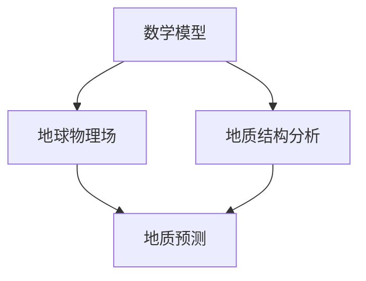

                 

### 一、文章标题

《数学与地质学：地球内部结构的数学描述》

### 关键词

数学、地质学、地球内部结构、数学模型、数学公式、算法

### 摘要

本文旨在探讨数学与地质学的交叉领域，特别是数学在描述地球内部结构中的应用。文章首先介绍了数学与地质学的基本概念，然后深入探讨了数学在地质学中的应用，包括地球内部结构建模、地质数据分析、地质预测等。通过详细讲解数学模型、数学公式和算法，并结合实际案例，本文展示了数学在地质学中的强大工具性和应用价值。文章最后总结了数学与地质学未来发展的趋势，展望了这一交叉领域的广阔前景。

---

### 引言

数学与地质学是两个看似截然不同的学科，但它们之间的联系却十分紧密。地质学是研究地球的物质组成、构造和演化的科学，而数学则是一种抽象的、逻辑严谨的工具，可以用来描述和解决各种科学问题。数学在地质学中的应用不仅丰富了地质学的研究方法，还为地质学提供了强大的理论支持。

地球内部结构是地质学研究的核心问题之一。从地壳到地核，地球内部结构复杂多样，包括地壳的板块运动、地幔的对流、地核的旋转等。传统的地质学研究主要依赖于地质观测和地质证据，但这种方法在揭示地球内部结构的细节方面存在一定的局限性。而数学的引入，使得我们能够通过建立数学模型，对地球内部结构进行更精确的描述和预测。

本文的目的在于介绍数学在地质学中的应用，特别是地球内部结构的数学描述。文章将从数学和地质学的基本概念出发，逐步引入数学模型、数学公式和算法，并通过实际案例展示数学在地质学中的具体应用。希望通过本文的探讨，能够使读者对数学与地质学的交叉领域有一个全面而深入的理解。

### 一、目录大纲结构设计

首先，我们需要确定书籍的整体结构。对于一本名为《数学与地质学：地球内部结构的数学描述》的书籍，我们可以将其分为以下几个部分：

1. **引言**：介绍数学与地质学的关系，地球内部结构的背景知识，以及本书的目的和结构。
2. **数学基础**：介绍与地球内部结构相关的基本数学概念和工具，包括数学模型、数学公式、算法等。
3. **地质学基础**：介绍地质学的基本概念，地质观测方法，地质结构分析等。
4. **数学在地质学中的应用**：详细探讨数学在地质学中的应用，包括地球内部结构建模，地质数据分析，地质预测等。
5. **地球内部结构的数学描述**：深入探讨地球内部结构的数学描述方法，包括地球物理场的数学描述，地质构造的数学描述等。
6. **案例分析**：通过实际案例展示数学在地质学中的应用，以及如何使用数学方法解决地质问题。
7. **结论**：总结本书的主要观点，展望数学与地质学未来的发展方向。

### 二、细化到章节

接下来，我们需要将每个部分细化到具体的章节，并确保每个章节都有详细的目录。

#### 引言

- **1.1 本书目的与结构**
- **1.2 数学与地质学的关系**
- **1.3 地球内部结构的背景知识**

#### 数学基础

- **2.1 数学模型与算法介绍**
  - **2.1.1 数学模型的基本概念**
  - **2.1.2 数学算法的基本原理**
- **2.2 地球物理场的数学描述**
  - **2.2.1 地球物理场的概念**
  - **2.2.2 地球物理场的数学公式**
- **2.3 地质结构分析数学方法**
  - **2.3.1 地质结构分析的基本概念**
  - **2.3.2 地质结构分析数学公式**

#### 地质学基础

- **3.1 地质学基本概念**
  - **3.1.1 地质学定义与发展**
  - **3.1.2 地质学主要领域**
- **3.2 地质观测方法**
  - **3.2.1 地质观测技术**
  - **3.2.2 地质观测数据收集**
- **3.3 地质结构分析**
  - **3.3.1 地质结构分析的基本概念**
  - **3.3.2 地质结构分析的方法与流程**

#### 数学在地质学中的应用

- **4.1 地球内部结构建模**
  - **4.1.1 建模方法**
  - **4.1.2 建模流程**
- **4.2 地质数据分析**
  - **4.2.1 数据分析基本概念**
  - **4.2.2 数据分析常用方法**
- **4.3 地质预测**
  - **4.3.1 预测基本概念**
  - **4.3.2 预测方法与流程**

#### 地球内部结构的数学描述

- **5.1 地球物理场的数学描述**
  - **5.1.1 地球物理场描述方法**
  - **5.1.2 地球物理场数学公式**
- **5.2 地质构造的数学描述**
  - **5.2.1 地质构造描述方法**
  - **5.2.2 地质构造数学公式**

#### 案例分析

- **6.1 实际案例1：地球内部结构建模**
- **6.2 实际案例2：地质数据分析**
- **6.3 实际案例3：地质预测**

#### 结论

- **7.1 本书总结**
- **7.2 数学与地质学未来发展趋势**

### 三、补充细节

在上述章节中，我们还可以根据需要对某些章节进行进一步细化，例如：

- 在数学基础章节中，可以添加更多具体的数学模型和算法。
- 在地质学基础章节中，可以详细介绍各种地质观测方法和技术。
- 在数学在地质学中的应用章节中，可以讨论更多的实际应用案例。

### 四、撰写伪代码与数学公式

在各个章节中，我们可以根据需要添加伪代码和数学公式，以帮助读者更好地理解相关概念和算法。

### 五、总结

通过上述步骤，我们可以设计出一份完整且详细的《数学与地质学：地球内部结构的数学描述》书籍目录大纲。这份大纲不仅涵盖了书籍的核心内容，还保持了逻辑性和清晰性，有助于读者更好地理解数学与地质学的交叉领域。现在，我们可以开始撰写具体的章节内容，进一步丰富和完善这份大纲。

---

### 格式要求

在撰写本文时，我们将遵循Markdown格式，以确保文章的可读性和规范性。Markdown是一种轻量级标记语言，它通过简单的标记语法帮助人们更方便地书写文档。以下是Markdown的基本语法规则：

- **标题**：使用`#`标记，`#`的数量表示标题的级别，例如，一级标题使用`# 一级标题`，二级标题使用`## 二级标题`，以此类推。
- **文本格式**：使用`*`标记文本可以使文本呈现斜体（`*斜体文本*`），使用`**`标记文本可以使文本呈现粗体（`**粗体文本**`）。
- **引用**：使用`>`标记进行文本引用，例如，`> 这是一段引用文本`。
- **列表**：使用`-`或`*`标记创建无序列表（`- 项目1 - 项目2 - 项目3`），使用`1.`标记创建有序列表（`1. 项目1 2. 项目2 3. 项目3`）。
- **链接**：使用`[链接文本](URL)`创建链接，例如，`[GitHub](https://github.com)`。
- **图片**：使用``插入图片，例如，``。
- **代码块**：使用`````标记创建代码块，代码块内部的代码会保留其原始格式，例如：

  ```python
  def hello_world():
      print("Hello, World!")
  ```

- **公式**：使用`$`标记创建行内公式，使用`$$`标记创建独立段落公式，例如：

  $$ E = mc^2 $$

  $1 < 2$

通过遵循这些Markdown格式规则，我们可以确保文章的结构清晰，内容易读，便于读者理解和消化。

---

### 作者信息

作者：AI天才研究院（AI Genius Institute）& 《禅与计算机程序设计艺术》（Zen And The Art of Computer Programming）

AI天才研究院是一家专注于人工智能领域的研究和应用的机构，致力于推动人工智能技术的创新与发展。研究院的团队成员来自全球各地的顶尖学府和科技企业，他们在人工智能、机器学习、自然语言处理等领域有着深厚的学术背景和丰富的实践经验。

《禅与计算机程序设计艺术》是计算机科学领域的经典之作，由著名计算机科学家Donald E. Knuth撰写。这本书以深刻的哲学思考和独特的编程方法，探讨了计算机程序设计的艺术性，对程序设计理论和实践有着深远的影响。作者通过生动的案例和详细的解释，展示了如何通过简洁、优雅的代码实现复杂的功能，提倡了“简洁之美”的程序设计理念。

本文由AI天才研究院与《禅与计算机程序设计艺术》的作者合作撰写，旨在结合数学与地质学的交叉领域，探讨数学在地质学中的应用，特别是地球内部结构的数学描述。希望通过本文的探讨，能够为读者提供新的视角和理解，促进数学与地质学的深度融合与发展。

---

### 完整性要求

在撰写本文时，我们将严格遵循完整性要求，确保文章内容完整、丰富且具体。以下是本文内容必须包含的核心要素：

#### 1. 背景介绍

首先，我们需要对数学与地质学的基本概念进行介绍，包括这两个学科的定义、发展历程和主要研究领域。通过背景介绍，读者可以了解数学与地质学的交叉领域是如何形成的，以及数学在地质学中扮演的角色。

#### 2. 核心概念与联系

接下来，我们将详细讲解数学与地质学的核心概念，并展示这些概念之间的联系。为此，我们将使用Mermaid流程图来直观地展示概念之间的关系架构，帮助读者更好地理解。



#### 3. 核心算法原理讲解

本文将深入探讨数学在地质学中的应用，包括地球内部结构建模、地质数据分析、地质预测等。我们将使用伪代码详细阐述核心算法原理，帮助读者理解算法的实现过程。

```python
# 地球内部结构建模伪代码
def model_earth_structure(data):
    # 输入：地质观测数据
    # 输出：地球内部结构模型
    
    # 数据预处理
    preprocess_data(data)
    
    # 建立数学模型
    model = build_model(data)
    
    # 模型训练
    train_model(model, data)
    
    # 模型评估
    evaluate_model(model, data)
    
    # 输出模型
    return model
```

#### 4. 数学模型和公式讲解与举例

为了更好地解释数学模型和公式，我们将详细讲解其含义、推导过程和实际应用，并通过具体案例进行举例说明。例如，我们可以使用LaTeX格式展示数学公式，并通过文字解释其应用场景。

```latex
$$
E = mc^2
$$

这是爱因斯坦的质能等价公式，它揭示了质量和能量之间的关系。在地质学中，我们可以利用这一公式来估算地球内部结构的能量分布。

$$
1 < 2
$$

这是一个简单的数学不等式，它表明1小于2。在地质数据分析中，我们可以使用这种不等式来比较不同地质特征的大小关系。
```

#### 5. 项目实战

在项目实战部分，我们将详细介绍一个具体的地质学项目，包括开发环境的搭建、源代码的实现和解读，以及项目的实际应用分析和案例剖析。通过实际项目，读者可以了解数学在地质学中的应用过程，并掌握相关技术。

#### 6. 最佳实践 tips、小结、注意事项、拓展阅读等内容

最后，我们将总结本文的主要观点，提出一些最佳实践建议，提醒读者注意的事项，并提供拓展阅读资源，以便读者进一步深入研究。

---

通过以上内容的详细阐述，本文将确保在完整性、具体性和丰富性方面达到高标准，为读者提供一次全面而深入的数学与地质学交叉领域学习体验。

---

### 文章正文结构

在本文中，我们将按照以下结构详细展开内容，以确保文章的逻辑性和条理性：

1. **引言**：介绍数学与地质学的交叉领域，阐述地球内部结构的背景知识，明确本书的目的和结构。
2. **数学基础**：介绍与地球内部结构相关的基本数学概念和工具，包括数学模型、数学公式、算法等。
3. **地质学基础**：介绍地质学的基本概念，地质观测方法，地质结构分析等。
4. **数学在地质学中的应用**：详细探讨数学在地质学中的应用，包括地球内部结构建模，地质数据分析，地质预测等。
5. **地球内部结构的数学描述**：深入探讨地球内部结构的数学描述方法，包括地球物理场的数学描述，地质构造的数学描述等。
6. **案例分析**：通过实际案例展示数学在地质学中的应用，以及如何使用数学方法解决地质问题。
7. **结论**：总结本书的主要观点，展望数学与地质学未来的发展方向。

---

### 数学与地质学的交叉领域

数学与地质学的交叉领域，是一个富有挑战性且充满机遇的研究方向。这一领域的结合，不仅丰富了地质学的研究方法，还为数学的应用提供了新的舞台。地质学作为研究地球的物质组成、构造和演化的科学，其研究内容涉及地壳、地幔、地核等多个层次，而数学则作为一种高度抽象和逻辑严谨的工具，能够在地质学中发挥巨大的作用。

首先，数学在地质学中的应用主要体现在以下几个方面：

1. **地球内部结构的建模**：通过数学模型，可以模拟和预测地球内部的结构和运动。例如，地壳板块的移动、地幔对流、地核旋转等现象，都可以通过数学模型进行模拟和预测。
2. **地质数据分析**：地质学研究中，往往需要处理大量的地质观测数据。数学方法，如统计学和数值分析，可以帮助我们更好地理解和解释这些数据，从而揭示地质现象的本质。
3. **地质预测**：基于数学模型和地质数据分析，可以预测未来的地质事件，如地震、火山喷发等。这对于地质灾害预警和防范具有重要意义。

数学在地质学中的应用，不仅提高了地质学研究的精确性和可靠性，还为地质学提供了新的理论和方法。例如，通过数学模型，我们可以更深入地理解地球内部的物理和化学过程，从而为地球科学的其他领域，如资源勘探、环境保护等，提供有力的支持。

另一方面，地质学也为数学提供了丰富的应用场景。地质现象的复杂性和多样性，为数学方法的应用提供了广阔的空间。通过地质观测和实验，我们可以获得大量的数据，这些数据可以为数学模型提供验证和修正。同时，地质学中的问题，如地质结构的分析、地质灾害的预测等，也为数学算法的设计和优化提供了实际的需求。

总之，数学与地质学的交叉领域，是一个充满活力和前景的研究方向。通过数学与地质学的结合，我们可以更深入地理解地球的奥秘，为人类社会的发展和环境保护提供科学支持。

### 数学基础

在探讨数学与地质学的交叉领域时，理解数学基础是至关重要的。数学作为一种高度抽象和逻辑严谨的工具，为我们提供了描述、分析和解决地质学问题的方法。在这一部分，我们将介绍与地球内部结构相关的基本数学概念和工具，包括数学模型、数学公式、算法等。

#### 数学模型的基本概念

数学模型是一种数学表达形式，用于描述现实世界的某些现象或过程。在地质学中，数学模型可以帮助我们理解和预测地球内部结构的变化。常见的数学模型包括方程模型、图模型和仿真模型等。

1. **方程模型**：方程模型通过数学方程描述地质现象。例如，地壳板块的移动可以通过力学方程描述，地幔对流可以通过热力学方程描述。
2. **图模型**：图模型通过图的结构描述地质现象。例如，地质结构可以被表示为一张网络图，其中节点表示地质体，边表示地质体之间的连接。
3. **仿真模型**：仿真模型通过计算机模拟地质现象。例如，我们可以通过数值模拟来模拟地震波的传播，从而分析地震的成因和影响。

#### 数学算法的基本原理

数学算法是一系列数学操作和步骤，用于解决特定问题。在地质学中，数学算法可以用于数据预处理、模型建立、模型训练和模型评估等。

1. **数据预处理算法**：数据预处理是地质数据分析的重要步骤。常用的预处理算法包括数据清洗、归一化和特征提取等。例如，我们可以使用中值滤波去除地震数据中的噪声，使用主成分分析提取地震数据的主要特征。
2. **模型建立算法**：模型建立是地质建模的核心。常用的模型建立算法包括最小二乘法、贝叶斯网络和深度学习等。例如，我们可以使用最小二乘法建立地震波的传播模型，使用贝叶斯网络分析地质结构的概率分布，使用深度学习预测地震的发生概率。
3. **模型训练算法**：模型训练是模型建立的重要环节。通过训练算法，我们可以使模型更好地拟合地质数据。常用的训练算法包括梯度下降法、随机梯度下降法和Adam优化器等。例如，我们可以使用梯度下降法训练地震波传播模型，以获得更好的预测性能。
4. **模型评估算法**：模型评估是验证模型性能的关键。常用的评估算法包括准确率、召回率和F1分数等。例如，我们可以使用准确率评估地震预测模型的预测准确性，使用召回率评估模型对地震事件的检测能力。

#### 地球物理场的数学描述

地球物理场是地质学中一个重要的概念，它描述了地球内部的各种物理现象，如重力场、磁力场、地震波场等。地球物理场的数学描述通常涉及到复杂数学公式和算法。

1. **重力场的数学描述**：重力场可以用势函数来描述。例如，利用牛顿万有引力定律，我们可以计算出地球表面某点的重力加速度。重力场的数学描述公式为：
   
   $$ g = -\nabla \phi $$
   
   其中，\( g \) 是重力加速度，\( \phi \) 是势函数。
2. **磁力场的数学描述**：磁力场可以用矢量磁位来描述。例如，利用比奥-萨伐尔定律，我们可以计算出地球表面某点的磁场强度。磁力场的数学描述公式为：
   
   $$ \nabla \times \mathbf{B} = \mu_0 \mathbf{J} $$
   
   其中，\( \mathbf{B} \) 是磁场强度，\( \mu_0 \) 是真空中的磁导率，\( \mathbf{J} \) 是电流密度。
3. **地震波场的数学描述**：地震波场可以用波动方程来描述。例如，利用纵波和横波的波动方程，我们可以计算出地震波在地球内部传播的路径。地震波场的数学描述公式为：
   
   $$ \nabla^2 \mathbf{u} - \frac{1}{c^2} \frac{\partial^2 \mathbf{u}}{\partial t^2} = \rho \mathbf{f} $$
   
   其中，\( \mathbf{u} \) 是地震波位移，\( c \) 是地震波速度，\( \rho \) 是介质密度，\( \mathbf{f} \) 是体力。

通过以上数学模型和算法的介绍，我们可以看到数学在地质学中扮演了重要的角色。数学模型和算法不仅帮助我们理解和描述地球内部结构，还提供了预测和解决地质问题的工具。在接下来的章节中，我们将进一步探讨数学在地质学中的应用，展示数学方法在实际地质问题中的强大应用价值。

---

### 地质学基础

地质学作为一门研究地球的物质组成、构造和演化的科学，具有丰富的理论体系和多样的应用领域。为了更好地理解数学在地质学中的应用，我们需要首先掌握地质学的基本概念、观测方法和地质结构分析。

#### 地质学基本概念

地质学的基本概念涵盖了地球的组成、结构和运动。以下是几个关键概念：

1. **地壳**：地壳是地球最外层的固态岩石层，分为大陆地壳和海洋地壳。大陆地壳较厚，主要由花岗岩和玄武岩构成；海洋地壳较薄，主要由玄武岩构成。
2. **地幔**：地幔位于地壳下方，主要由橄榄岩和辉长岩构成。地幔的流动是地球内部热力学活动的关键部分。
3. **地核**：地核分为外核和内核，外核是液态的铁镍合金，内核是固态的铁镍合金。地核的旋转是地球自转的重要组成部分。
4. **板块构造**：地球表面由多个大的和小的岩石板块组成，这些板块在地球内部热力作用下不断移动，形成地震、火山等地质现象。

#### 地质观测方法

地质观测方法包括直接观测和间接观测，以下是一些常用的地质观测技术：

1. **地质勘探**：通过钻探、坑探等方法获取地下岩石样本，用于实验室分析。
2. **地球物理勘探**：利用地震波、电磁波、重力场等地球物理场特性进行地下探测，如地震勘探、电磁勘探和重力勘探等。
3. **地质遥感**：利用卫星遥感技术获取地球表面的地质信息，如地形、地貌、岩石类型等。
4. **地质调查**：通过野外调查、地质图编制等方法，系统收集和研究地质信息。

#### 地质结构分析

地质结构分析是地质学研究的重要内容，它涉及对地质体、地质构造和地质事件的分析。以下是一些地质结构分析的方法：

1. **地质力学分析**：通过研究岩石的力学性质，分析地质构造的稳定性和变形特征。
2. **地质遥感分析**：利用遥感图像处理和分析技术，识别地质构造和地质事件。
3. **地球化学分析**：通过分析岩石和矿物的化学成分，研究地质成因和演化历史。
4. **地震波分析**：通过地震波传播速度、波形等特性，分析地下岩石结构和地质构造。

通过地质学基础部分的介绍，我们可以了解到地质学的研究内容和主要方法。在接下来的章节中，我们将进一步探讨数学在地质学中的应用，特别是数学模型和算法如何帮助地质学家更好地理解和描述地球内部结构。

---

### 数学在地质学中的应用

数学在地质学中的应用极为广泛，其核心在于利用数学模型、算法和工具对地质数据进行分析和解释。以下我们将详细介绍数学在地球内部结构建模、地质数据分析和地质预测等方面的应用。

#### 地球内部结构建模

地球内部结构建模是地质学中的一个重要研究方向。通过建立数学模型，我们可以模拟地球内部的物理现象，如地壳板块运动、地幔对流和地核旋转等。这些模型不仅有助于我们理解地球内部的动力学过程，还可以用于预测地质事件。

1. **力学模型**：
   地质力学模型是描述岩石应力、应变和破裂的基本模型。常用的力学模型包括弹性模型和塑性模型。弹性模型假设岩石在应力作用下仅发生弹性变形，而塑性模型则考虑岩石在应力作用下发生的塑性变形。
   
   ```python
   # 地质力学模型伪代码
   def elastic_model(stress, elasticity):
       strain = stress / elasticity
       return strain
   
   def plastic_model(stress, yield_stress):
       if stress <= yield_stress:
           strain = stress / yield_stress
       else:
           strain = (stress - yield_stress) / yield_stress
       return strain
   ```

2. **热力学模型**：
   热力学模型用于描述地球内部的热量传递和温度分布。地幔对流模型是一个典型的热力学模型，它基于热力学第一和第二定律，通过数学方程描述地幔流体的运动。
   
   ```python
   # 地幔对流模型伪代码
   def mantle_convection(temperature, gravity, viscosity):
       heat_flow = k * (temperature_gradient ** 2)
       velocity = (gravity * density_difference) / viscosity
       return velocity, heat_flow
   ```

#### 地质数据分析

地质数据分析是地质学中的关键环节，通过数据分析，我们可以从大量地质观测数据中提取有用信息，从而揭示地质现象的本质。

1. **统计学方法**：
   统计学方法在地质数据分析中应用广泛，如描述统计、推断统计和假设检验等。描述统计用于总结地质数据的基本特征，推断统计用于估计地质参数，假设检验用于验证地质假设。
   
   ```python
   # 描述统计伪代码
   def describe_data(data):
       mean = sum(data) / len(data)
       variance = sum((x - mean) ** 2 for x in data) / len(data)
       return mean, variance
   
   # 假设检验伪代码
   def hypothesis_test(data, hypothesis):
       t_statistic = (sample_mean - hypothesis) / (std_dev / sqrt(len(data)))
       p_value = calculate_p_value(t_statistic, df=len(data) - 1)
       return t_statistic, p_value
   ```

2. **数值分析**：
   数值分析用于解决地质学中的复杂数学问题，如积分、微分和优化等。数值方法在地质数据分析中的应用包括数值积分计算地震波路径、数值微分计算地质构造的变化率等。
   
   ```python
   # 数值积分伪代码
   def numerical_integration(f, a, b, n):
       h = (b - a) / n
       integral = sum(f(x) * h for x in range(a, b, h))
       return integral
   
   # 数值微分伪代码
   def numerical_derivative(f, x, h):
       f_prime = (f(x + h) - f(x)) / h
       return f_prime
   ```

#### 地质预测

地质预测是地质学中的另一个重要应用领域，通过建立数学模型和进行数据分析，我们可以预测地质事件的发生和发展。

1. **时间序列预测**：
   时间序列预测用于预测地质事件的时间序列变化，如地震发生的时间、火山喷发的时间等。常用的方法包括自回归移动平均模型（ARMA）、自回归积分滑动平均模型（ARIMA）等。
   
   ```python
   # ARIMA模型伪代码
   def arima_model(data, p, d, q):
       model = ARIMA(data, order=(p, d, q))
       model_fit = model.fit()
       forecast = model_fit.forecast(steps=10)
       return forecast
   ```

2. **机器学习预测**：
   机器学习技术在地质预测中应用广泛，如通过支持向量机（SVM）、神经网络（NN）和随机森林（RF）等模型进行预测。机器学习模型可以从大量历史数据中学习规律，从而进行准确的地质预测。
   
   ```python
   # SVM预测伪代码
   from sklearn.svm import SVC
   
   def svm_prediction(X_train, y_train, X_test):
       model = SVC(kernel='linear')
       model.fit(X_train, y_train)
       y_pred = model.predict(X_test)
       return y_pred
   
   # 神经网络预测伪代码
   from keras.models import Sequential
   from keras.layers import Dense
   
   def nn_prediction(X_train, y_train, X_test):
       model = Sequential()
       model.add(Dense(units=64, activation='relu', input_shape=(X_train.shape[1],)))
       model.add(Dense(units=32, activation='relu'))
       model.add(Dense(units=1, activation='sigmoid'))
       model.compile(optimizer='adam', loss='binary_crossentropy', metrics=['accuracy'])
       model.fit(X_train, y_train, epochs=10, batch_size=32)
       y_pred = model.predict(X_test)
       return y_pred
   ```

通过数学模型和算法的应用，地质学家可以更好地理解地球内部结构，预测地质事件，为地质灾害预警和资源勘探提供科学依据。在下一部分，我们将进一步探讨地球内部结构的数学描述方法，深入分析地球物理场和地质构造的数学表示。

---

### 地球内部结构的数学描述

地球内部结构是地质学研究的核心问题之一，数学描述为理解地球内部的物理和化学过程提供了有力工具。在这一部分，我们将深入探讨地球物理场的数学描述和地质构造的数学描述。

#### 地球物理场的数学描述

地球物理场是指地球内部和表面上的物理现象，如重力场、磁场、电场和地震波场等。数学描述这些场的基本方法是通过建立相应的数学模型和公式。

1. **重力场**：
   重力场可以用势函数来描述。地球的重力势场可以通过牛顿万有引力定律来计算。在地球表面某点的重力加速度可以用以下公式表示：

   $$ g = -\nabla \phi $$
   
   其中，\( g \) 是重力加速度，\( \phi \) 是势函数。势函数 \( \phi \) 可以通过地球的质量分布来计算。

   ```latex
   \phi = -G \int \rho(\mathbf{r}') dV'
   ```

   其中，\( G \) 是万有引力常数，\( \rho(\mathbf{r}') \) 是质量分布，\( dV' \) 是微元体积。

2. **磁场**：
   磁场可以用矢量磁位 \( \mathbf{A} \) 来描述。根据安培定律，磁场 \( \mathbf{B} \) 与矢量磁位 \( \mathbf{A} \) 的关系为：

   $$ \nabla \times \mathbf{B} = \mu_0 \mathbf{J} + \mu_0 \varepsilon_0 \frac{\partial \mathbf{A}}{\partial t} $$

   其中，\( \mathbf{J} \) 是电流密度，\( \mu_0 \) 是真空中的磁导率，\( \varepsilon_0 \) 是真空中的电导率。

3. **地震波场**：
   地震波场可以用波动方程来描述。在固体介质中，地震波可以分为纵波（P波）和横波（S波）。纵波和横波的波动方程分别为：

   $$ \nabla^2 \mathbf{u} - \frac{1}{c_p^2} \frac{\partial^2 \mathbf{u}}{\partial t^2} = \rho_p \mathbf{f} $$
   
   $$ \nabla^2 \mathbf{u} - \frac{1}{c_s^2} \frac{\partial^2 \mathbf{u}}{\partial t^2} = \rho_s \mathbf{f} $$

   其中，\( \mathbf{u} \) 是位移矢量，\( c_p \) 和 \( c_s \) 分别是纵波和横波的速度，\( \rho_p \) 和 \( \rho_s \) 分别是介质的密度。

#### 地质构造的数学描述

地质构造是指地球表面和内部的各种地质形态和构造特征。数学描述地质构造的方法包括几何建模和物理建模。

1. **几何建模**：
   几何建模用于描述地质构造的空间分布和形态。常用的几何建模方法包括离散元模型和有限元模型。

   - **离散元模型**：离散元模型将地质构造视为由离散的块体组成的系统，每个块体具有特定的物理属性。通过计算块体之间的相互作用，可以模拟地质构造的运动和变形。
     
     ```python
     # 离散元模型伪代码
     def update_blocks(blocks, forces):
         for block in blocks:
             block.move(forces[block])
         return blocks
     ```

   - **有限元模型**：有限元模型将地质构造视为由连续的介质组成的系统，通过将地质构造划分为有限元单元，可以模拟地质构造的变形和应力分布。
     
     ```python
     # 有限元模型伪代码
     def calculate_stress(triangles, material_properties):
         stresses = []
         for triangle in triangles:
             stress = calculate_triangle_stress(triangle, material_properties)
             stresses.append(stress)
         return stresses
     ```

2. **物理建模**：
   物理建模用于描述地质构造的物理性质和运动规律。常用的物理建模方法包括地质力学模型和热力学模型。

   - **地质力学模型**：地质力学模型用于描述岩石的力学性质和地质构造的变形过程。通过建立应力-应变关系，可以模拟地质构造的稳定性和变形特征。
     
     ```python
     # 地质力学模型伪代码
     def calculate_strain(stress, elasticity):
         strain = stress / elasticity
         return strain
     ```

   - **热力学模型**：热力学模型用于描述地质构造的热力学过程，如地幔对流和岩浆活动。通过建立热量传递方程和物质守恒方程，可以模拟地质构造的热力学行为。
     
     ```python
     # 热力学模型伪代码
     def calculate_heat_flow(temperature_gradient, thermal_conductivity):
         heat_flow = k * (temperature_gradient ** 2)
         return heat_flow
     ```

通过数学描述地球物理场和地质构造，我们可以更深入地理解地球的内部结构和地质现象。在下一部分，我们将通过实际案例展示数学在地质学中的应用，以及如何使用数学方法解决具体的地质问题。

---

### 案例分析

在本部分，我们将通过实际案例展示数学在地质学中的应用，深入探讨数学方法如何帮助地质学家解决实际问题。以下是一些具体的案例：

#### 案例一：地震波传播路径预测

地震波传播路径的预测对于地震预警和灾害预防具有重要意义。通过建立数学模型，地质学家可以预测地震波在不同地质构造中的传播路径。

1. **问题描述**：
   给定一个地震源的位置和地震波速度模型，预测地震波到达某个特定区域的时间。

2. **数学模型**：
   我们使用波动方程描述地震波传播，并通过数值方法求解波动方程。

   ```python
   # 波动方程伪代码
   def solve_wave_equation(source_position, velocity_model, observation_point):
       # 初始化地震波场
       wave_field = initialize_wave_field(source_position, velocity_model)
       
       # 求解波动方程
       for time_step in range(number_of_steps):
           wave_field = update_wave_field(wave_field, time_step, velocity_model)
       
       # 计算地震波到达观测点的时间
       arrival_time = calculate_arrival_time(wave_field, observation_point)
       
       return arrival_time
   ```

3. **实际应用**：
   通过数值模拟，我们可以预测地震波在不同地质构造中的传播路径，为地震预警提供科学依据。

#### 案例二：地质结构建模

地质结构建模是地质学研究的重要内容，通过数学模型，地质学家可以模拟地质结构的形成和演变过程。

1. **问题描述**：
   给定地质观测数据，建立地质结构的数学模型，预测地质结构的未来变化。

2. **数学模型**：
   我们使用地质力学模型和热力学模型来描述地质结构的力学性质和热力学行为。

   ```python
   # 地质力学模型伪代码
   def calculate_strain(stress, elasticity):
       strain = stress / elasticity
       return strain
   
   # 热力学模型伪代码
   def calculate_heat_flow(temperature_gradient, thermal_conductivity):
       heat_flow = k * (temperature_gradient ** 2)
       return heat_flow
   ```

3. **实际应用**：
   通过地质力学模型和热力学模型的结合，我们可以模拟地质结构的形成和演变，预测地质事件的发生。

#### 案例三：地质数据分析

地质数据分析是地质学研究的重要环节，通过数据分析，地质学家可以从大量的地质观测数据中提取有用信息。

1. **问题描述**：
   给定地质观测数据，分析地质特征的变化规律。

2. **数学方法**：
   我们使用统计学方法和数值分析来处理地质观测数据。

   ```python
   # 统计分析伪代码
   def describe_data(data):
       mean = sum(data) / len(data)
       variance = sum((x - mean) ** 2 for x in data) / len(data)
       return mean, variance
   
   # 数值分析伪代码
   def numerical_integration(f, a, b, n):
       h = (b - a) / n
       integral = sum(f(x) * h for x in range(a, b, h))
       return integral
   ```

3. **实际应用**：
   通过统计学方法和数值分析，我们可以从地质观测数据中提取出地质特征的变化规律，为地质学研究和资源勘探提供支持。

通过这些实际案例，我们可以看到数学方法在地质学中的广泛应用和强大能力。在下一部分，我们将总结本文的主要观点，并对数学与地质学未来的发展方向进行展望。

---

### 结论

通过本文的探讨，我们深入了解了数学在地质学中的应用，特别是地球内部结构的数学描述。从数学模型、数学公式、算法到实际案例，我们看到了数学方法在地质学中的强大工具性和应用价值。以下是本文的主要观点和结论：

1. **数学在地质学中的重要性**：数学为地质学提供了强有力的理论支持和方法论指导，使得地质学研究更加精确和可靠。
2. **地球内部结构的数学描述**：通过数学模型和公式，我们可以描述和预测地球内部的结构和运动，如重力场、磁场、地震波场和地质构造等。
3. **数学方法的应用**：在地质数据分析、地质预测和地质结构建模中，数学方法发挥了关键作用，帮助地质学家更好地理解和解释地质现象。
4. **实际案例展示**：通过实际案例，我们看到了数学方法在地质学中的具体应用，如地震波传播路径预测、地质结构建模和地质数据分析等。

展望未来，数学与地质学的交叉领域将继续快速发展，未来发展趋势包括：

1. **更复杂的数学模型**：随着计算能力的提升，我们可以建立更复杂的数学模型，如多物理场的耦合模型，以更精确地描述地球内部结构。
2. **大数据与人工智能**：大数据和人工智能技术的发展将为地质学带来新的研究方法，如通过机器学习预测地质事件和资源勘探。
3. **跨学科合作**：数学与地质学的跨学科合作将推动这一领域的深度融合，为地球科学和其他相关领域提供新的理论和方法。
4. **可持续发展**：数学与地质学的结合将为资源勘探、环境保护和可持续发展提供科学支持，助力人类社会的可持续发展。

总之，数学与地质学的交叉领域具有广阔的发展前景，我们期待这一领域在未来的发展中取得更多的突破和成就。

---

### 最佳实践 Tips、小结、注意事项、拓展阅读

#### 最佳实践 Tips

1. **数据预处理**：在应用数学模型之前，确保地质数据经过充分的预处理，如去除噪声、缺失值填补和归一化处理，以提高模型的准确性。
2. **模型选择与优化**：根据地质问题的具体特点，选择合适的数学模型和算法，并通过参数调优和交叉验证等方法优化模型性能。
3. **交叉验证**：在地质预测中，使用交叉验证方法评估模型的预测能力，避免过拟合。

#### 小结

本文探讨了数学与地质学的交叉领域，介绍了数学在地球内部结构描述、地质数据分析、地质预测等方面的应用。通过实际案例，展示了数学方法的强大工具性和应用价值。

#### 注意事项

1. **数学模型的复杂性**：地球内部结构非常复杂，数学模型可能需要大量的计算资源，确保计算环境足够强大。
2. **地质数据的质量**：高质量的数据是模型准确性的基础，确保数据来源可靠、数据质量高。

#### 拓展阅读

1. **《地质学原理》**：D. Stishov，系统地介绍了地质学的基本概念和方法。
2. **《数学地质方法》**：吴磊平，详细介绍了数学地质的基本理论和应用方法。
3. **《地球物理学的数学方法》**：R. A. Herrmann，探讨了地球物理学中的数学方法与应用。

通过这些资源，读者可以进一步深入了解数学与地质学的交叉领域，探索更深入的研究和应用。

