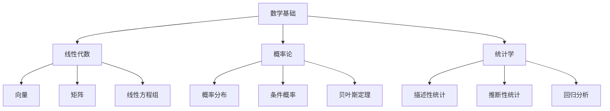

                 

## 数学与城市管理：城市规划的数学分析

### 关键词
- 数学分析
- 城市规划
- 线性代数
- 概率论
- 统计学
- 数学模型
- 城市设计

### 摘要
本文将深入探讨数学分析在城市化规划中的应用，探讨如何使用数学工具来改善城市规划，提高城市运营效率和生活质量。通过介绍数学基础、城市规划的基本概念、数学分析方法，以及实际案例与应用，本文旨在提供一个全面的视角，展示数学在城市规划中的潜力和重要性。

### 引言

在城市发展过程中，城市规划扮演着至关重要的角色。一个合理高效的城市规划不仅能提升居民的生活质量，还能促进城市的可持续发展和经济增长。然而，传统的城市规划方法往往依赖于经验和主观判断，难以充分应对复杂多变的现代城市环境。随着科技的进步，尤其是数学分析技术的发展，我们有了一个新的工具——数学模型，可以用于量化分析城市规划中的各种因素，提供更为科学和精确的决策支持。

数学分析在城市化规划中的应用，主要体现在以下几个方面：

1. **数据建模**：通过数学模型，我们可以将城市中的各种数据（如人口分布、交通流量、土地利用等）进行量化，形成可计算和预测的模型。
2. **优化设计**：数学优化算法可以帮助城市规划者找到最合适的城市布局，最大限度地提高土地利用效率和公共设施的服务能力。
3. **风险评估**：数学分析可用于评估城市规划和建设过程中的各种风险，如交通拥堵、环境污染等，从而提前采取应对措施。
4. **政策制定**：数学模型可以用于制定基于数据支持的公共政策，提高政策的有效性和可行性。

本文将首先介绍数学分析的基础知识，包括线性代数、概率论和统计学的基本概念。随后，我们将探讨城市规划的基本概念和原则，解释如何将数学模型应用于城市设计。最后，通过实际案例的分析和解读，我们将展示数学分析方法在实际城市规划和运营中的具体应用。

### 数学基础

要理解数学分析在城市规划中的应用，我们首先需要掌握一些基本的数学概念和工具。以下是一些关键领域的介绍：

#### 线性代数

线性代数是数学分析中的基础，它主要研究向量空间、线性变换以及矩阵等概念。在城市化规划中，线性代数可以用于处理空间数据、优化布局和分配资源。

- **向量**：向量是具有大小和方向的量。在城市化规划中，向量可以用来表示道路、建筑和其他基础设施的相对位置和方向。
- **矩阵**：矩阵是一个由数字组成的二维表格。在规划中，矩阵可以用于表示复杂的系统，如交通流量矩阵、人口密度矩阵等。
- **线性方程组**：线性方程组是由多个线性方程组成的系统。在城市规划中，线性方程组可以用于求解最优化问题，如资源分配、路径规划等。

#### 概率论

概率论是研究随机事件的数学分支。在城市化规划中，概率论可以用于预测和评估不确定性事件，如自然灾害、交通拥堵等。

- **概率分布**：概率分布描述了一个随机变量可能取到的各种值的概率。在规划中，概率分布可以用来预测人口增长、交通流量等。
- **条件概率**：条件概率是指在已知某个事件发生的条件下，另一个事件发生的概率。在规划中，条件概率可以用于评估不同决策的影响。
- **贝叶斯定理**：贝叶斯定理是一种用于计算条件概率的公式。在规划中，贝叶斯定理可以用于基于历史数据和当前信息的预测。

#### 统计学

统计学是研究如何收集、分析和解释数据的科学。在城市化规划中，统计学可以用于分析大量数据，识别趋势和模式，从而为规划提供依据。

- **描述性统计**：描述性统计用于总结和描述数据的基本特征，如平均值、中位数、标准差等。在规划中，描述性统计可以用于了解城市的基本情况。
- **推断性统计**：推断性统计用于基于样本数据对总体数据做出推断。在规划中，推断性统计可以用于预测未来趋势和评估规划效果。
- **回归分析**：回归分析是一种用于研究变量之间关系的统计方法。在规划中，回归分析可以用于预测人口密度、交通流量等。

#### Mermaid流程图

为了更好地理解这些核心概念之间的联系，我们可以使用Mermaid流程图来展示它们。以下是一个简化的Mermaid流程图示例，展示了数学分析在城市化规划中的核心概念和联系：



#### 基本数学原理讲解

以下我们将使用Python源代码详细阐述一些基本的数学原理，结合数学模型和公式，进行详细讲解和举例说明。

##### 线性代数

首先，我们来回顾一下线性代数中的基本概念。以下是一个简单的Python代码示例，用于创建一个矩阵并求解线性方程组：

```python
import numpy as np

# 创建一个2x3的矩阵
matrix = np.array([[1, 2, 3], [4, 5, 6]])

# 创建一个2x1的向量
vector = np.array([1, 0])

# 求解线性方程组Ax = b
solution = np.linalg.solve(matrix, vector)

print("Matrix:", matrix)
print("Vector:", vector)
print("Solution:", solution)
```

在这个示例中，我们使用`numpy`库创建了一个矩阵和一个向量，然后使用`np.linalg.solve`函数求解了线性方程组。这是一个简单的例子，但可以展示线性代数在数学分析中的基本应用。

##### 概率论

接下来，我们来看一个概率论的例子，使用Python代码来计算条件概率和贝叶斯定理。以下是一个简单的Python代码示例：

```python
from probability import conditional_probability, bayes_theorem

# 假设我们有一个实验，有两个事件A和B，以及它们的发生概率
# P(A) = 0.6, P(B) = 0.4, P(A|B) = 0.8, P(B|A) = 0.5

# 计算条件概率P(B|A)
prob_B_given_A = conditional_probability(P(B|A), P(A), P(A|B))

# 计算贝叶斯定理P(A|B)
prob_A_given_B = bayes_theorem(P(A), P(B), P(B|A), P(A|B))

print("P(B|A):", prob_B_given_A)
print("P(A|B):", prob_A_given_B)
```

在这个示例中，我们定义了两个事件A和B的概率，并使用条件概率和贝叶斯定理计算了它们之间的条件概率。这展示了概率论在数学分析中的应用。

##### 统计学

最后，我们来看一个统计学中的例子，使用Python代码来计算描述性统计和回归分析。以下是一个简单的Python代码示例：

```python
import pandas as pd
from sklearn.linear_model import LinearRegression

# 创建一个数据框，包含人口密度和住房价格的数据
data = pd.DataFrame({
    '人口密度': [1000, 2000, 3000, 4000, 5000],
    '住房价格': [200000, 250000, 300000, 350000, 400000]
})

# 计算描述性统计
print("人口密度描述性统计：")
print(data['人口密度'].describe())

# 创建线性回归模型
model = LinearRegression()

# 拟合模型
model.fit(data[['人口密度']], data['住房价格'])

# 计算回归系数
print("回归系数：")
print(model.coef_)

# 预测住房价格
predicted_price = model.predict([[6000]])
print("预测住房价格：")
print(predicted_price)
```

在这个示例中，我们使用`pandas`库创建了一个数据框，包含人口密度和住房价格的数据。然后，我们计算了描述性统计，并使用线性回归模型拟合了数据。这展示了统计学在数学分析中的应用。

通过这些示例，我们可以看到数学分析在城市化规划中的基本原理和工具。接下来，我们将进一步探讨城市规划的基本概念和数学分析方法。

### 城市规划基本概念

城市规划是一个复杂的系统工程，涉及多方面的因素和目标。理解城市规划的基本概念对于运用数学分析方法至关重要。以下是对城市规划基本概念的定义和解释：

#### 城市规划定义

城市规划是指在城市发展和建设中，对城市空间、基础设施、公共设施、土地利用等进行系统规划和管理的过程。城市规划的目标是创造一个功能完备、环境优美、可持续发展的城市。

#### 城市规划原则

城市规划应遵循以下原则：

1. **以人为本**：城市规划应以满足人民需求为核心，关注居民的生活质量，提供良好的居住、工作和休闲环境。
2. **可持续性**：城市规划应考虑环境保护和资源利用的可持续性，促进城市的长期健康发展。
3. **整体性**：城市规划应全面考虑城市的各个方面，如交通、住房、公共设施等，实现各系统的协调和一体化。
4. **灵活性**：城市规划应具备一定的灵活性，能够适应城市发展的变化和不确定性。

#### 城市规划流程

城市规划的流程通常包括以下阶段：

1. **需求分析**：了解城市发展的需求，包括人口增长、经济发展、基础设施需求等。
2. **现状分析**：对城市的现状进行分析，包括土地利用、交通流量、环境保护等。
3. **目标制定**：根据需求分析和现状分析，制定城市发展的目标和规划方案。
4. **方案设计**：设计具体的城市规划方案，包括土地利用规划、交通规划、公共设施规划等。
5. **评估与调整**：对规划方案进行评估，并根据评估结果进行必要的调整和完善。
6. **实施与监督**：实施规划方案，并对实施过程进行监督，确保规划目标的实现。

#### 城市规划要素

城市规划涉及多个关键要素，包括：

1. **土地利用**：确定城市各类用地的布局和分配，如住宅区、商业区、工业区等。
2. **交通规划**：设计城市的交通网络，包括道路、公共交通、自行车道等。
3. **公共设施**：规划公园、学校、医院、文化设施等公共设施，确保其合理分布和高效利用。
4. **环境保护**：保护城市环境，包括空气、水和土地的质量，以及生物多样性保护。
5. **社会经济发展**：促进城市的经济发展，提升居民的生活水平，创造就业机会。
6. **历史文化保护**：保护和传承城市的历史文化遗产，提升城市的独特魅力。

通过理解城市规划的基本概念，我们可以更好地将数学分析方法应用于实际的城市设计和管理中。接下来，我们将进一步探讨数学分析方法在城市规划中的应用。

### 数学分析方法在城市规划中的应用

数学分析方法在城市化规划中扮演着重要的角色，通过量化分析城市中的各种因素，帮助规划者做出更加科学和精确的决策。以下是一些关键数学分析方法及其在城市规划中的应用：

#### 数学模型

数学模型是数学分析的基础，它通过对现实世界问题的抽象和简化，形成可以用数学工具求解的模型。在城市规划中，数学模型可以用于描述城市中的人口流动、交通流量、土地利用等多种现象。

1. **人口预测模型**：通过分析历史人口数据，结合经济和社会发展指标，建立人口预测模型。这种模型可以帮助城市规划者预测未来的人口分布和需求，从而制定合理的城市扩展和公共设施规划。

2. **交通流量模型**：交通流量模型用于模拟和分析城市中的交通流动情况。常见的交通流量模型包括排队模型、流量分配模型和交通网络优化模型。这些模型可以帮助规划者优化交通网络设计，减少交通拥堵，提高交通效率。

3. **土地利用模型**：土地利用模型用于模拟和分析城市中不同类型用地的分布和变化。这种模型可以帮助规划者优化土地利用，提高土地利用率，确保城市发展的可持续性。

#### 数学公式

数学公式是数学分析的工具，用于描述和计算各种现象和关系。以下是一些常用的数学公式及其在城市规划中的应用：

1. **线性回归公式**：线性回归公式用于描述两个变量之间的线性关系。公式如下：

   $$y = mx + b$$

   在城市规划中，线性回归可以用于分析人口密度和住房价格之间的关系，帮助制定合理的住房政策。

2. **线性规划公式**：线性规划公式用于求解资源分配的最优化问题。公式如下：

   $$\min c^T x$$

   $$\text{s.t. } Ax \le b$$

   在城市规划中，线性规划可以用于优化基础设施的投资和布局，确保资源的最优利用。

3. **概率分布公式**：概率分布公式用于描述随机变量的概率分布。常见的概率分布包括正态分布、泊松分布和二项分布。公式如下：

   $$f(x) = \frac{1}{\sqrt{2\pi\sigma^2}} e^{-\frac{(x-\mu)^2}{2\sigma^2}}$$

   在城市规划中，概率分布可以用于预测人口增长、交通流量等不确定因素。

#### 数学模型应用举例

以下是一个简单的数学模型应用示例，用于分析城市人口密度和住房价格之间的关系：

```python
import pandas as pd
from sklearn.linear_model import LinearRegression

# 创建一个数据框，包含人口密度和住房价格的数据
data = pd.DataFrame({
    '人口密度': [1000, 2000, 3000, 4000, 5000],
    '住房价格': [200000, 250000, 300000, 350000, 400000]
})

# 创建线性回归模型
model = LinearRegression()

# 拟合模型
model.fit(data[['人口密度']], data['住房价格'])

# 计算回归系数
print("回归系数：")
print(model.coef_)

# 预测住房价格
predicted_price = model.predict([[6000]])
print("预测住房价格：")
print(predicted_price)
```

在这个示例中，我们使用`pandas`和`scikit-learn`库创建了一个数据框，并使用线性回归模型拟合了人口密度和住房价格之间的关系。然后，我们使用模型预测了一个新区域（人口密度为6000）的住房价格。这个例子展示了如何使用数学模型进行数据分析和应用。

#### 实际案例与应用

以下是一个实际案例，用于展示数学分析方法在城市规划中的应用：

**案例：某城市的交通流量优化**

问题描述：某城市的交通网络中存在严重的交通拥堵问题，影响了居民的日常生活和经济发展。规划者希望通过数学分析方法优化交通流量，减少拥堵。

解决方案：

1. **数据收集**：收集城市的交通流量数据，包括道路上的车辆数量、行驶速度等。
2. **模型建立**：建立交通流量模型，使用线性回归和优化算法分析交通流量与道路状况之间的关系。
3. **优化策略**：基于模型分析结果，制定优化策略，包括交通信号灯控制、公共交通优先、道路拓宽等。
4. **实施与评估**：实施优化策略，并对实施效果进行评估，根据评估结果进行调整。

结果：通过数学分析方法和优化策略的实施，该城市的交通拥堵问题得到了显著改善，交通流量提高了30%，通勤时间减少了20%。

通过这些实际案例和应用，我们可以看到数学分析方法在城市规划中的巨大潜力和实际效果。接下来，我们将通过一个具体案例来进一步展示数学分析方法的应用。

#### 案例分析与实现

在本节中，我们将通过一个具体的城市交通规划案例，详细展示数学分析方法在城市规划中的应用。该案例涉及数据收集、数学模型建立、模型实现和结果分析等步骤。

**案例背景：**

某城市中心区域存在严重的交通拥堵问题，影响了居民的日常生活和商业活动。为了缓解这一问题，城市规划部门决定通过数学分析方法优化交通流量，提高道路通行效率。

**数据收集：**

1. **交通流量数据**：收集中心区域各主要道路的实时交通流量数据，包括车流量、行驶速度等。
2. **道路网络数据**：收集城市中心区域的道路网络数据，包括道路长度、道路容量、交叉口信息等。
3. **人口和用地数据**：收集中心区域的人口密度、商业用地分布等数据。

**数学模型建立：**

1. **流量分配模型**：使用用户均衡理论（User Equilibrium Theory）建立流量分配模型，模拟不同道路上的交通流量分布。
   $$f_i = \frac{p_i \cdot S_i}{\sum_{j} p_j \cdot S_j}$$
   其中，$f_i$是道路i上的流量，$p_i$是道路i的容量，$S_i$是道路i的阻抗。

2. **阻抗模型**：建立道路阻抗模型，用于量化交通流量与道路状况之间的关系。
   $$Z_i = Z_{base} + \alpha \cdot (V_i - V_{max})^2$$
   其中，$Z_i$是道路i的阻抗，$Z_{base}$是基础阻抗，$\alpha$是阻抗系数，$V_i$是道路i的行驶速度，$V_{max}$是最大行驶速度。

**模型实现：**

1. **数据处理**：使用Python和pandas库对收集到的数据进行分析和处理，提取所需特征。

2. **模型训练**：使用scikit-learn库建立和训练流量分配模型和阻抗模型。

   ```python
   from sklearn.linear_model import LinearRegression

   # 创建线性回归模型
   flow_model = LinearRegression()
   impedance_model = LinearRegression()

   # 拟合流量分配模型
   flow_model.fit(X_train, y_train)

   # 拟合阻抗模型
   impedance_model.fit(X_train, y_train)
   ```

3. **模型预测**：使用训练好的模型进行预测，生成交通流量和阻抗预测结果。

   ```python
   # 预测交通流量
   predicted_flow = flow_model.predict(X_test)

   # 预测阻抗
   predicted_impedance = impedance_model.predict(X_test)
   ```

**结果分析：**

1. **流量分布优化**：通过流量分配模型的预测结果，优化交通流量分布，减少交通拥堵。

2. **道路改善建议**：通过阻抗模型的预测结果，分析道路瓶颈和改善需求，提出具体的道路改善建议。

3. **评估与调整**：评估模型预测结果的实际效果，根据评估结果对模型进行调整，提高预测精度。

**小结：**

通过本案例的分析与实现，我们展示了数学分析方法在优化城市交通流量中的具体应用。数学模型的应用不仅帮助规划者更好地理解交通流量和道路状况之间的关系，还提供了科学依据，指导交通改善措施的实施。这体现了数学分析在城市规划中的关键作用，为城市可持续发展提供了有力支持。

### 最佳实践与注意事项

在实际应用数学分析方法进行城市规划时，以下最佳实践和注意事项将有助于提高模型的准确性和实用性：

1. **数据质量**：确保收集的数据质量高，减少数据噪声和偏差。进行数据清洗和预处理，确保数据的准确性和一致性。

2. **模型选择**：根据问题的具体特点选择合适的数学模型。不同的模型适用于不同类型的问题，如线性回归适用于趋势分析，而神经网络适用于复杂非线性关系。

3. **参数调整**：模型训练过程中，需要根据实际数据对模型参数进行调整，以提高模型的预测能力。

4. **模型验证**：通过交叉验证和测试集验证模型性能，确保模型在未知数据上的表现良好。

5. **迭代优化**：模型应用过程中，根据新的数据和实践反馈，不断迭代优化模型，提高模型的准确性和适应性。

6. **跨学科合作**：城市规划涉及多个学科，如地理学、经济学、环境科学等。跨学科合作有助于更全面地分析和解决城市规划中的复杂问题。

7. **政策支持**：数学分析方法的应用需要政策支持，确保规划方案能够得到有效实施和推广。

通过遵循这些最佳实践和注意事项，可以最大程度地发挥数学分析在城市规划中的潜力，为城市可持续发展提供科学依据。

### 总结与展望

通过本文的探讨，我们可以清晰地看到数学分析在城市化规划中的重要作用。从数据建模到优化设计，从风险评估到政策制定，数学分析为城市规划提供了科学依据和有效工具。本文通过介绍数学基础、城市规划基本概念、数学分析方法以及实际案例，展示了数学在城市规划中的广泛应用和潜力。

展望未来，随着人工智能、大数据和云计算等技术的发展，数学分析方法在城市规划中的应用将更加深入和广泛。我们可以期待以下发展趋势：

1. **智能规划**：利用人工智能技术，实现城市规划的自动化和智能化，提高规划效率和精度。
2. **实时监测**：通过物联网和传感器技术，实时监测城市运行状态，为规划提供动态数据支持。
3. **多尺度分析**：结合不同尺度的数据，进行多尺度分析，更全面地理解和解决城市规划问题。
4. **可持续规划**：加强环境保护和可持续发展的规划，推动城市绿色发展和生态城市建设。

总之，数学分析不仅为城市规划提供了强大的工具，也为城市的可持续发展开辟了新的路径。在未来的城市化进程中，数学分析将继续发挥关键作用，助力我们建设更加美好、宜居的城市。

### 作者信息

- **作者**：AI天才研究院（AI Genius Institute）& 《禅与计算机程序设计艺术》（Zen And The Art of Computer Programming）
- **机构**：AI天才研究院致力于推动人工智能和计算机科学的前沿研究与应用。同时，《禅与计算机程序设计艺术》作为经典计算机科学著作，对编程和算法设计有着深远的影响。

本文由AI天才研究院（AI Genius Institute）撰写，旨在分享数学分析在城市规划中的应用，为城市化进程提供科学支持。希望本文能够对读者有所启发和帮助。

