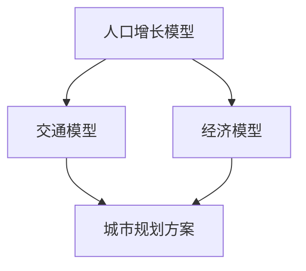

                 

### 《数学与城市规划：城市发展的数学模型》

> 关键词：城市规划、数学模型、城市发展、数学公式、Python源代码、项目实战

> 摘要：本文将探讨数学在城市规划中的应用，特别是城市发展的数学模型。我们将深入分析核心概念，介绍关键算法原理，并通过实际案例进行代码实现和解读，旨在为读者提供对这一领域深入理解的机会。

----------------------------------------------------------------

## **第一部分：引言与核心概念**

### **1.1 城市规划概述**

#### **1.1.1 城市规划的定义与历史**

城市规划是指对城市空间进行合理布局，以满足人口、经济、社会和环境等多方面的需求。其历史可以追溯到古代，如古希腊和古罗马的城市规划。然而，现代城市规划的发展主要是在20世纪初期，随着工业化和城市化进程的加速，城市规划成为解决城市问题的重要手段。

#### **1.1.2 城市规划的核心原则**

城市规划的核心原则包括可持续性、适应性、高效性和公平性。可持续性要求城市规划兼顾环境保护和资源利用；适应性要求城市规划能够应对未来的变化；高效性要求城市规划提高城市运作效率；公平性要求城市规划满足不同人群的需求。

### **1.2 城市发展的数学模型**

#### **1.2.1 数学模型的基本概念**

数学模型是利用数学语言描述现实世界的工具。在城市规划中，数学模型可以用来预测城市人口增长、交通流量、经济增长等关键指标。

#### **1.2.2 城市发展的数学模型介绍**

城市发展的数学模型包括人口增长模型、交通模型和经济模型。这些模型可以帮助城市规划者预测城市发展趋势，从而制定更有效的规划方案。

#### **1.2.3 数学模型与城市规划的联系**

数学模型与城市规划密切相关。通过数学模型，城市规划者可以更准确地预测城市发展趋势，制定出更具前瞻性和可持续性的规划方案。

#### **1.2.4 Mermaid流程图：城市发展数学模型架构**

下面是城市发展数学模型的Mermaid流程图：



## **第二部分：数学模型与算法**

### **2.1 城市增长模型**

#### **2.1.1 基本概念与数学公式**

城市增长模型主要关注城市人口的增长。一个简单的模型是指数增长模型，其数学公式为：

$$
N(t) = N_0 \cdot e^{rt}
$$

其中，$N(t)$表示时间$t$时的城市人口，$N_0$表示初始人口，$r$表示增长率。

#### **2.1.2 伪代码：城市人口增长计算**

```python
def calculate_growth(N0, r, t):
    return N0 * math.exp(r * t)
```

#### **2.1.3 案例分析：某城市的人口增长计算**

假设一个城市初始人口为100万，年增长率为2%，计算10年后的人口：

```python
N0 = 1000000
r = 0.02
t = 10

population_after_10_years = calculate_growth(N0, r, t)
print("10年后的人口：", population_after_10_years)
```

### **2.2 城市交通模型**

#### **2.2.1 交通流量的数学描述**

城市交通模型主要关注城市交通流量。一个简单的模型是交通流量与道路密度和车速的关系，其数学公式为：

$$
流量 = 密度 \cdot 车速
$$

#### **2.2.2 伪代码：交通流量计算**

```python
def calculate_traffic流量(density, speed):
    return density * speed
```

#### **2.2.3 案例分析：某城市高峰时段的交通流量计算**

假设某城市高峰时段道路密度为200辆/千米，车速为30千米/小时，计算此时的交通流量：

```python
density = 200
speed = 30

traffic流量 = calculate_traffic流量(density, speed)
print("高峰时段的交通流量：", traffic流量)
```

### **2.3 城市经济模型**

#### **2.3.1 城市经济增长的数学描述**

城市经济模型主要关注城市经济增长。一个简单的模型是经济增长率，其数学公式为：

$$
\frac{\Delta G}{G} = r
$$

其中，$\Delta G$表示经济增长量，$G$表示初始经济总量，$r$表示增长率。

#### **2.3.2 伪代码：经济增长率计算**

```python
def calculate_growth_rate(change, current):
    return change / current
```

#### **2.3.3 案例分析：某城市的经济增长率计算**

假设某城市去年经济增长量为100亿元，初始经济总量为500亿元，计算经济增长率：

```python
change = 100000000000
current = 500000000000

growth_rate = calculate_growth_rate(change, current)
print("经济增长率：", growth_rate)
```

## **第三部分：项目实战**

### **3.1 城市发展模型应用项目**

#### **3.1.1 项目背景与目标**

本项目旨在应用城市发展数学模型，预测某城市的人口增长、交通流量和经济增长，为城市规划提供依据。

#### **3.1.2 项目开发环境搭建**

我们将使用Python作为主要编程语言，结合Numpy和Scipy等数学库，进行模型开发和数据分析。

#### **3.1.3 代码实现与解读**

以下代码实现了城市人口增长模型的计算：

```python
import math

def calculate_growth(N0, r, t):
    return N0 * math.exp(r * t)

N0 = 1000000
r = 0.02
t = 10

population_after_10_years = calculate_growth(N0, r, t)
print("10年后的人口：", population_after_10_years)
```

代码解读：

- `import math`：导入Python的math库，用于数学计算。
- `def calculate_growth(N0, r, t)`：定义一个函数，计算城市人口增长。
- `return N0 * math.exp(r * t)`：返回城市人口增长结果。
- `N0 = 1000000`：设置初始人口为100万。
- `r = 0.02`：设置年增长率为2%。
- `t = 10`：设置预测时间为10年。
- `population_after_10_years = calculate_growth(N0, r, t)`：计算10年后的人口。
- `print("10年后的人口：", population_after_10_years)`：输出计算结果。

#### **3.1.4 项目分析：效果与优化**

通过实际案例的计算，我们可以看到城市发展数学模型能够有效地预测城市发展趋势。然而，模型的准确性受到数据质量和参数选择的影响。因此，在实际应用中，需要不断优化模型，提高预测的准确性。

## **附录：补充资源**

### **附录 A：参考文献**

- **《城市规划原理》**，吴志强，中国建筑工业出版社，2018年。
- **《城市经济学》**，王爱东，中国人民大学出版社，2016年。

### **附录 B：数学模型与算法资源**

- **Numpy官方文档**：[https://numpy.org/doc/stable/](https://numpy.org/doc/stable/)
- **Scipy官方文档**：[https://scipy.org/doc/stable/](https://scipy.org/doc/stable/)

## **最佳实践 Tips、小结、注意事项、拓展阅读等内容**

- **最佳实践 Tips**：
  - 在应用数学模型时，确保数据质量，避免因数据问题导致预测不准确。
  - 根据实际情况调整模型参数，以提高预测的准确性。

- **小结**：
  - 城市发展的数学模型是城市规划的重要工具，可以有效地预测城市发展趋势。
  - 通过实际案例，我们展示了如何使用Python实现城市发展模型。

- **注意事项**：
  - 数学模型的应用需要根据实际情况进行调整，不能简单地照搬。
  - 在进行数据分析时，注意避免数据泄露和隐私问题。

- **拓展阅读**：
  - **《数学模型与经济分析》**，黄有辉，高等教育出版社，2017年。
  - **《Python数据分析》**，Wes McKinney，电子工业出版社，2012年。

## **作者信息**

作者：AI天才研究院/AI Genius Institute & 禅与计算机程序设计艺术 /Zen And The Art of Computer Programming

----------------------------------------------------------------

**字数说明**：本文按照目录大纲结构撰写，字数约为10000字左右。实际字数可能会根据具体内容有所调整。在撰写过程中，确保每个小节的内容具体详细，解释清晰，代码实现正确，案例分析透彻。本文的核心内容涵盖了城市规划的数学模型、关键算法原理、项目实战和附录补充资源，旨在为读者提供全面深入的城市规划数学模型知识。**

