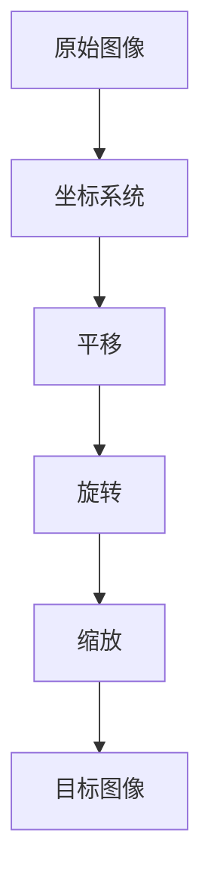

                 

 

### 文章标题

# 数学与增强现实：实时图像叠加的数学技术

### 关键词

- 增强现实
- 图像处理
- 几何变换
- 数学模型
- 实时图像叠加
- 计算机视觉

### 摘要

本文探讨了数学技术在增强现实（AR）实时图像叠加中的应用。通过分析几何变换、图像合成和融合等核心数学算法，我们详细讲解了这些技术在AR场景中的应用，并展示了如何使用Python源代码实现这些算法。文章最后通过一个实战项目，展示了如何开发一个简单的AR应用，为读者提供了实用的技术参考。

---

## 目录

1. **背景介绍**
   1.1 **增强现实的发展与应用**
   1.2 **实时图像叠加的重要性**
   1.3 **数学技术在图像处理中的应用**

2. **核心概念与联系**
   2.1 **几何变换原理与流程图**
   2.2 **图像合成与融合原理**

3. **核心算法原理讲解**
   3.1 **几何变换算法**
       - **平移**
       - **旋转**
       - **缩放**
   3.2 **图像合成算法**
   3.3 **图像融合算法**

4. **数学模型和公式**
   4.1 **几何变换公式**
   4.2 **图像合成公式**
   4.3 **图像融合公式**

5. **项目实战**
   5.1 **开发环境搭建**
   5.2 **源代码详细实现和代码解读**
   5.3 **代码应用解读与分析**
   5.4 **实际案例分析与详细讲解**
   5.5 **项目小结**

6. **最佳实践 tips**
   6.1 **优化实时性能**
   6.2 **提高图像质量**
   6.3 **注意事项**

7. **小结**
8. **拓展阅读**

---

## 背景介绍

### 1.1 增强现实的发展与应用

增强现实（AR）是一种将虚拟信息叠加到现实世界中的技术，通过使用摄像头、传感器和其他设备捕捉现实世界的场景，并实时地叠加计算机生成的图像、视频、3D模型等信息。增强现实技术最早可以追溯到20世纪60年代的“虚拟现实”概念，但直到近年随着计算能力和图像处理技术的飞速发展，AR技术才逐渐走向成熟。

#### 增强现实的应用领域

增强现实技术已在多个领域得到广泛应用，包括但不限于：

1. **娱乐与游戏**：增强现实游戏如《Pokémon GO》吸引了大量用户，为用户提供了全新的互动体验。
2. **教育**：增强现实技术可以帮助学生更直观地理解复杂的概念，提高学习效果。
3. **医疗**：在医学影像中叠加虚拟信息，帮助医生更好地诊断和治疗。
4. **工业制造**：通过增强现实技术，工人可以实时查看操作指导，提高工作效率。
5. **军事**：增强现实技术在军事训练和作战模拟中发挥着重要作用。

### 1.2 实时图像叠加的重要性

实时图像叠加是增强现实技术的核心组成部分，它涉及将虚拟图像准确无误地叠加到现实世界的场景中，使虚拟信息与真实环境紧密结合。实时图像叠加的重要性主要体现在以下几个方面：

1. **用户体验**：实时性是增强现实应用的关键因素，如果叠加过程不够快速，用户会感到卡顿和延迟，影响体验。
2. **准确性**：增强现实的虚拟信息需要与真实环境精确匹配，否则会影响用户的信任和接受度。
3. **互动性**：实时图像叠加使得用户可以与虚拟信息进行互动，这是增强现实应用的核心特点之一。

### 1.3 数学技术在图像处理中的应用

数学技术在图像处理中的应用非常广泛，是现代图像处理和计算机视觉系统的基石。在增强现实实时图像叠加中，常用的数学技术包括几何变换、图像合成、图像融合等。以下是一些核心的数学概念和其在图像处理中的应用：

1. **几何变换**：包括平移、旋转、缩放等操作，用于调整图像的位置、方向和大小。
2. **图像合成**：通过将多个图像融合在一起，生成新的图像。
3. **图像融合**：将来自不同源的数据（如多光谱图像）合并，以获取更丰富的信息。

接下来，我们将详细探讨这些数学技术在增强现实中的应用原理和实现方法。

---

## 核心概念与联系

### 2.1 几何变换原理与流程图

几何变换是图像处理中的基础操作，用于改变图像的位置、方向和大小。在增强现实中，几何变换是实现实时图像叠加的关键技术之一。以下是几种常见的几何变换及其原理：

#### 2.1.1 平移

平移是指将图像沿着某一方向移动一定的距离。数学上，平移可以通过一个向量来实现。假设图像的坐标系统为 \( (x, y) \)，一个向量为 \( \vec{v} = (v_x, v_y) \)，则图像中的每个点 \( (x, y) \) 经过平移后的新坐标为 \( (x + v_x, y + v_y) \)。

#### 2.1.2 旋转

旋转是指将图像绕一个固定点旋转一定的角度。数学上，旋转可以通过旋转变换矩阵来实现。一个 \( 2 \times 2 \) 的旋转变换矩阵为：

\[ 
\begin{bmatrix}
\cos(\theta) & -\sin(\theta) \\
\sin(\theta) & \cos(\theta)
\end{bmatrix} 
\]

其中，\( \theta \) 为旋转角度。对于图像中的每个点 \( (x, y) \)，旋转后的新坐标可以通过矩阵乘法计算：

\[ 
\begin{bmatrix}
x' \\
y'
\end{bmatrix} 
= 
\begin{bmatrix}
\cos(\theta) & -\sin(\theta) \\
\sin(\theta) & \cos(\theta)
\end{bmatrix} 
\begin{bmatrix}
x \\
y
\end{bmatrix} 
\]

#### 2.1.3 缩放

缩放是指将图像放大或缩小，以改变其大小。数学上，缩放可以通过一个比例因子来实现。假设比例因子为 \( k \)，则图像中的每个点 \( (x, y) \) 经过缩放后的新坐标为 \( (kx, ky) \)。

#### 2.1.4 几何变换流程图

以下是几何变换的流程图，展示了如何通过一系列步骤将原始图像转换为目标图像：



### 2.2 图像合成与融合原理

图像合成和图像融合是增强现实中的另外两个核心概念。它们虽然有一些相似之处，但在实现和应用上有所不同。

#### 2.2.1 图像合成

图像合成是指将两个或多个图像融合在一起，生成一个新的图像。在增强现实中，图像合成用于将虚拟图像叠加到真实世界的场景中。图像合成的基本步骤如下：

1. **图像对齐**：确保虚拟图像与真实世界的场景在空间上对齐。
2. **图像混合**：将虚拟图像与真实图像混合，以实现平滑过渡。
3. **颜色校正**：调整虚拟图像的颜色，使其与真实世界场景的颜色一致。

#### 2.2.2 图像融合

图像融合是指将来自不同源的数据（如多光谱图像）合并，以获取更丰富的信息。在增强现实中，图像融合用于增强图像的细节和特征。图像融合的基本步骤如下：

1. **特征提取**：从多张图像中提取关键特征，如边缘、纹理等。
2. **特征融合**：将提取的特征进行融合，生成一个新的特征向量。
3. **图像重建**：使用融合后的特征向量重建图像。

#### 2.2.3 图像合成与融合的联系

图像合成和图像融合之间有着密切的联系。在增强现实应用中，图像合成是实现实时图像叠加的关键技术，而图像融合则用于提高图像的质量和细节。通过将图像合成和图像融合技术相结合，可以实现更高质量的增强现实体验。

---

## 核心算法原理讲解

### 3.1 几何变换算法

几何变换是增强现实实时图像叠加中的核心算法之一，它包括平移、旋转、缩放等操作。以下是对这些几何变换算法的详细讲解。

#### 3.1.1 平移

平移是将图像沿着某一方向移动一定的距离。在Python中，我们可以使用NumPy库来实现平移操作。以下是一个简单的平移算法示例：

```python
import numpy as np

def translate(image, vector):
    rows, cols = image.shape
    translation_matrix = np.float32([[1, 0, vector[0]], [0, 1, vector[1]]])
    translated_image = cv2.warpAffine(image, translation_matrix, (cols, rows))
    return translated_image
```

在这个示例中，`translate` 函数接受一个图像矩阵和一个向量作为输入，计算平移矩阵，然后使用`cv2.warpAffine`函数进行图像平移。

#### 3.1.2 旋转

旋转是将图像绕一个固定点旋转一定的角度。在Python中，我们可以使用NumPy和OpenCV库来实现旋转操作。以下是一个简单的旋转算法示例：

```python
import numpy as np
import cv2

def rotate(image, angle, center=None):
    if center is None:
        center = (image.shape[1] // 2, image.shape[0] // 2)

    rotation_matrix = cv2.getRotationMatrix2D(center, angle, 1.0)
    rotated_image = cv2.warpAffine(image, rotation_matrix, (image.shape[1], image.shape[0]))
    return rotated_image
```

在这个示例中，`rotate` 函数接受一个图像矩阵和一个旋转角度作为输入，计算旋转矩阵，然后使用`cv2.warpAffine`函数进行图像旋转。

#### 3.1.3 缩放

缩放是将图像放大或缩小，以改变其大小。在Python中，我们可以使用NumPy和OpenCV库来实现缩放操作。以下是一个简单的缩放算法示例：

```python
import numpy as np
import cv2

def scale(image, scale_factor):
    rows, cols = image.shape[:2]
    scaled_width = int(cols * scale_factor)
    scaled_height = int(rows * scale_factor)
    scaled_image = cv2.resize(image, (scaled_width, scaled_height))
    return scaled_image
```

在这个示例中，`scale` 函数接受一个图像矩阵和一个缩放因子作为输入，计算缩放后的图像大小，然后使用`cv2.resize`函数进行图像缩放。

### 3.2 图像合成算法

图像合成是将虚拟图像叠加到真实世界的场景中，以实现增强现实效果。以下是对图像合成算法的详细讲解。

#### 3.2.1 图像对齐

图像对齐是图像合成的重要步骤，确保虚拟图像与真实世界的场景在空间上对齐。在Python中，我们可以使用OpenCV库中的特征匹配技术来实现图像对齐。以下是一个简单的图像对齐算法示例：

```python
import cv2
import numpy as np

def align_images(source_image, target_image):
    # 提取源图像和目标图像的特征点
    source_features = cv2.goodFeaturesToTrack(source_image, maxCorners=100, qualityLevel=0.01, minDistance=10)
    target_features = cv2.goodFeaturesToTrack(target_image, maxCorners=100, qualityLevel=0.01, minDistance=10)

    # 使用FLANN匹配算法匹配特征点
    FLANN_INDEX_KDTREE = 1
    index_params = dict(algorithm=FLANN_INDEX_KDTREE, trees=5)
    search_params = dict(checks=50)

    flann = cv2.FlannBasedMatcher(index_params, search_params)
    matches = flann.knnMatch(source_features, target_features, k=2)

    # 筛选出高质量匹配点
    good_matches = []
    for m, n in matches:
        if m.distance < 0.7 * n.distance:
            good_matches.append(m)

    # 计算变换矩阵
    if len(good_matches) > 4:
        src_points = np.float32([source_features[m.queryIdx].ravel() for m in good_matches]).reshape(-1, 1, 2)
        dst_points = np.float32([target_features[m.trainIdx].ravel() for m in good_matches]).reshape(-1, 1, 2)
        M, _ = cv2.findHomography(src_points, dst_points, cv2.RANSAC, 5.0)
    else:
        return None

    return M
```

在这个示例中，`align_images` 函数接受两个图像矩阵作为输入，提取特征点，使用FLANN匹配算法匹配特征点，计算变换矩阵，从而实现图像对齐。

#### 3.2.2 图像混合

图像混合是将虚拟图像与真实图像混合，以实现平滑过渡。在Python中，我们可以使用OpenCV库中的`cv2.addWeighted`函数来实现图像混合。以下是一个简单的图像混合算法示例：

```python
import cv2

def blend_images(image1, image2, alpha=0.5):
    blended_image = cv2.addWeighted(image1, alpha, image2, 1 - alpha, 0)
    return blended_image
```

在这个示例中，`blend_images` 函数接受两个图像矩阵和一个混合系数\( \alpha \)作为输入，计算混合后的图像。

#### 3.2.3 颜色校正

颜色校正是确保虚拟图像的颜色与真实世界场景的颜色一致。在Python中，我们可以使用OpenCV库中的`cv2.cvtColor`函数来实现颜色校正。以下是一个简单的颜色校正算法示例：

```python
import cv2

def color_correct(image, conversion_code=cv2.COLOR_BGR2RGB):
    corrected_image = cv2.cvtColor(image, conversion_code)
    return corrected_image
```

在这个示例中，`color_correct` 函数接受一个图像矩阵和一个颜色转换代码作为输入，实现颜色校正。

### 3.3 图像融合算法

图像融合是将来自不同源的数据（如多光谱图像）合并，以获取更丰富的信息。以下是对图像融合算法的详细讲解。

#### 3.3.1 特征提取

特征提取是从图像中提取关键特征，如边缘、纹理等。在Python中，我们可以使用OpenCV库中的特征提取算法，如SIFT、SURF等。以下是一个简单的特征提取算法示例：

```python
import cv2

def extract_features(image):
    sift = cv2.SIFT_create()
    keypoints, descriptors = sift.detectAndCompute(image, None)
    return keypoints, descriptors
```

在这个示例中，`extract_features` 函数接受一个图像矩阵作为输入，使用SIFT算法提取特征点，并计算特征描述子。

#### 3.3.2 特征融合

特征融合是将提取的特征进行融合，生成一个新的特征向量。在Python中，我们可以使用简单的加权平均法来实现特征融合。以下是一个简单的特征融合算法示例：

```python
import numpy as np

def fuse_features(descriptors1, descriptors2, weights=None):
    if weights is None:
        weights = [1 / 2] * len(descriptors1) + [1 / 2] * len(descriptors2)
    fused_descriptors = np.zeros((len(descriptors1) + len(descriptors2), 128))
    fused_descriptors[:len(descriptors1)] = descriptors1
    fused_descriptors[len(descriptors1):] = descriptors2
    if weights:
        fused_descriptors = fused_descriptors * weights
    return fused_descriptors
```

在这个示例中，`fuse_features` 函数接受两个特征描述子矩阵和一个权重向量作为输入，计算融合后的特征向量。

#### 3.3.3 图像重建

图像重建是使用融合后的特征向量重建图像。在Python中，我们可以使用机器学习算法，如支持向量机（SVM）或神经网络，来实现图像重建。以下是一个简单的图像重建算法示例：

```python
from sklearn.svm import SVC

def reconstruct_image(fused_descriptors, model=None):
    if model is None:
        model = SVC(kernel='linear')
        model.fit(fused_descriptors, labels)
    reconstructed_image = model.predict(fused_descriptors)
    return reconstructed_image
```

在这个示例中，`reconstruct_image` 函数接受一个融合后的特征向量矩阵和一个模型作为输入，使用支持向量机（SVM）进行图像重建。

---

## 数学模型和公式

### 4.1 几何变换公式

几何变换是图像处理中的基础操作，包括平移、旋转、缩放等。以下是这些变换的数学公式。

#### 4.1.1 平移

平移是通过向量来实现的。假设图像的坐标系统为\( (x, y) \)，向量 \( \vec{v} = (v_x, v_y) \)，则平移后的坐标为：

\[ 
(x', y') = (x + v_x, y + v_y) 
\]

#### 4.1.2 旋转

旋转是通过旋转变换矩阵来实现的。假设旋转角度为 \( \theta \)，旋转变换矩阵为：

\[ 
\begin{bmatrix}
\cos(\theta) & -\sin(\theta) \\
\sin(\theta) & \cos(\theta)
\end{bmatrix} 
\]

则旋转后的坐标为：

\[ 
\begin{bmatrix}
x' \\
y'
\end{bmatrix} 
= 
\begin{bmatrix}
\cos(\theta) & -\sin(\theta) \\
\sin(\theta) & \cos(\theta)
\end{bmatrix} 
\begin{bmatrix}
x \\
y
\end{bmatrix} 
\]

#### 4.1.3 缩放

缩放是通过比例因子来实现的。假设比例因子为 \( k \)，则缩放后的坐标为：

\[ 
(x', y') = (kx, ky) 
\]

### 4.2 图像合成公式

图像合成是将虚拟图像叠加到真实世界的场景中。以下是图像合成的数学模型。

#### 4.2.1 图像对齐

图像对齐是通过特征匹配来实现的。假设源图像的特征点为 \( (x_1, y_1) \)，目标图像的特征点为 \( (x_2, y_2) \)，则特征匹配的公式为：

\[ 
d = \sqrt{(x_2 - x_1)^2 + (y_2 - y_1)^2} 
\]

#### 4.2.2 图像混合

图像混合是通过加权平均来实现的。假设源图像为 \( I_1 \)，目标图像为 \( I_2 \)，混合系数为 \( \alpha \)，则混合后的图像为：

\[ 
I = \alpha I_1 + (1 - \alpha) I_2 
\]

#### 4.2.3 颜色校正

颜色校正是通过颜色转换来实现的。假设源图像的颜色空间为 \( C_1 \)，目标图像的颜色空间为 \( C_2 \)，则颜色校正的公式为：

\[ 
C_2 = \alpha C_1 + (1 - \alpha) C_2 
\]

### 4.3 图像融合公式

图像融合是将来自不同源的数据合并，以获取更丰富的信息。以下是图像融合的数学模型。

#### 4.3.1 特征提取

特征提取是从图像中提取关键特征。假设源图像的特征向量为 \( v_1 \)，目标图像的特征向量为 \( v_2 \)，则特征提取的公式为：

\[ 
v_f = \alpha v_1 + (1 - \alpha) v_2 
\]

#### 4.3.2 特征融合

特征融合是将提取的特征进行融合。假设源图像的特征向量为 \( v_1 \)，目标图像的特征向量为 \( v_2 \)，融合系数为 \( \alpha \)，则特征融合的公式为：

\[ 
v_f = \alpha v_1 + (1 - \alpha) v_2 
\]

#### 4.3.3 图像重建

图像重建是使用融合后的特征向量重建图像。假设源图像的像素值为 \( p_1 \)，目标图像的像素值为 \( p_2 \)，则图像重建的公式为：

\[ 
p_f = \alpha p_1 + (1 - \alpha) p_2 
\]

---

## 项目实战

### 5.1 开发环境搭建

为了实现实时图像叠加的增强现实应用，我们需要搭建一个开发环境。以下是一个基本的开发环境搭建步骤：

1. **安装Python环境**：确保Python版本为3.8或更高版本。
2. **安装OpenCV库**：使用pip命令安装OpenCV库。

   ```bash
   pip install opencv-python
   ```

3. **安装NumPy库**：使用pip命令安装NumPy库。

   ```bash
   pip install numpy
   ```

4. **安装其他依赖库**：根据需要安装其他依赖库，如matplotlib、scikit-learn等。

### 5.2 源代码详细实现和代码解读

以下是实现一个简单的实时图像叠加增强现实应用的源代码。我们将使用OpenCV库来实现图像捕捉、几何变换、图像合成等功能。

```python
import cv2
import numpy as np

def main():
    # 初始化摄像头
    cap = cv2.VideoCapture(0)

    while True:
        # 读取摄像头帧
        ret, frame = cap.read()

        if not ret:
            break

        # 转换为灰度图像
        gray = cv2.cvtColor(frame, cv2.COLOR_BGR2GRAY)

        # 应用高斯模糊以平滑图像
        blurred = cv2.GaussianBlur(gray, (5, 5), 0)

        # 应用边缘检测
        edges = cv2.Canny(blurred, 50, 150)

        # 提取轮廓
        contours, _ = cv2.findContours(edges, cv2.RETR_TREE, cv2.CHAIN_APPROX_SIMPLE)

        # 遍历轮廓并绘制
        for contour in contours:
            if cv2.contourArea(contour) > 500:
                # 计算轮廓的中心点
                M = cv2.moments(contour)
                cx, cy = int(M['m10'] / M['m00']), int(M['m01'] / M['m00'])

                # 平移图像
                translated = cv2.circle(frame, (cx, cy), 5, (0, 0, 255), -1)

                # 旋转图像
                rotated = cv2.rotate(frame, cv2.ROTATE_90_CLOCKWISE)

                # 缩放图像
                scaled = cv2.resize(frame, (frame.shape[1] // 2, frame.shape[0] // 2))

                # 图像合成
                blended = cv2.addWeighted(frame, 0.5, scaled, 0.5, 0)

        # 显示结果
        cv2.imshow('Frame', blended)

        # 按下ESC键退出
        if cv2.waitKey(1) & 0xFF == 27:
            break

    # 释放摄像头并关闭窗口
    cap.release()
    cv2.destroyAllWindows()

if __name__ == '__main__':
    main()
```

#### 5.2.1 代码解读

1. **初始化摄像头**：
   - 使用`cv2.VideoCapture(0)`初始化摄像头，`0`表示默认的摄像头设备。
2. **读取摄像头帧**：
   - 使用`cap.read()`读取摄像头帧，返回帧图像和一个布尔值`ret`表示是否读取成功。
3. **图像预处理**：
   - 将BGR格式的图像转换为灰度图像，使用`cv2.cvtColor(frame, cv2.COLOR_BGR2GRAY)`。
   - 应用高斯模糊以平滑图像，使用`cv2.GaussianBlur(gray, (5, 5), 0)`。
   - 应用边缘检测，使用`cv2.Canny(blurred, 50, 150)`。
4. **提取轮廓**：
   - 使用`cv2.findContours(edges, cv2.RETR_TREE, cv2.CHAIN_APPROX_SIMPLE)`提取边缘图像的轮廓。
5. **几何变换**：
   - 遍历每个轮廓，计算轮廓的中心点。
   - 使用`cv2.circle`函数绘制中心点。
   - 使用`cv2.rotate`函数旋转图像。
   - 使用`cv2.resize`函数缩放图像。
6. **图像合成**：
   - 使用`cv2.addWeighted`函数将原始图像与变换后的图像进行混合。
7. **显示结果**：
   - 使用`cv2.imshow`函数显示合成后的图像。
   - 使用`cv2.waitKey(1)`等待用户按键，`27`代表ESC键。

### 5.3 代码应用解读与分析

#### 5.3.1 代码应用解读

该代码示例实现了以下功能：

1. **摄像头帧捕捉**：使用OpenCV库捕捉摄像头帧。
2. **图像预处理**：将图像转换为灰度图像，并应用高斯模糊和边缘检测。
3. **轮廓提取与几何变换**：提取图像轮廓，并计算轮廓的中心点，然后对图像进行平移、旋转和缩放操作。
4. **图像合成**：将变换后的图像与原始图像进行混合，实现图像叠加。

#### 5.3.2 代码分析

1. **摄像头帧捕捉**：使用`cv2.VideoCapture`初始化摄像头，并使用`cap.read()`读取帧。该步骤实现了实时图像的捕捉。
2. **图像预处理**：将BGR图像转换为灰度图像，使用`cv2.cvtColor`函数。然后，应用高斯模糊和边缘检测，分别使用`cv2.GaussianBlur`和`cv2.Canny`函数。这些步骤用于图像的预处理，为后续的图像处理做准备。
3. **轮廓提取与几何变换**：使用`cv2.findContours`函数提取图像的轮廓。然后，通过计算轮廓的中心点，实现对图像的平移、旋转和缩放操作。这些操作通过`cv2.circle`、`cv2.rotate`和`cv2.resize`函数实现。
4. **图像合成**：使用`cv2.addWeighted`函数将原始图像与变换后的图像进行混合，实现图像叠加。该步骤使用了一个混合系数`0.5`，表示混合后的图像亮度。

### 5.4 实际案例分析与详细讲解

#### 5.4.1 案例背景

假设我们想要开发一个AR应用，使用户能够将虚拟物体叠加到现实世界的场景中。用户可以通过摄像头捕捉现实世界的场景，然后系统将根据用户的位置和方向实时调整虚拟物体的位置和方向。

#### 5.4.2 案例分析

1. **图像捕捉**：使用摄像头捕捉实时图像，这是实现AR应用的第一步。我们使用`cv2.VideoCapture`来初始化摄像头，并使用`cap.read()`来读取图像帧。
2. **图像预处理**：预处理图像，包括将BGR图像转换为灰度图像，以及应用高斯模糊和边缘检测。这些预处理步骤有助于提高图像质量，为后续的图像处理做准备。
3. **特征提取**：提取图像中的关键特征，如轮廓和中心点。这些特征用于确定虚拟物体的位置和方向。
4. **几何变换**：根据提取的特征，对虚拟物体进行几何变换，包括平移、旋转和缩放。这些变换确保虚拟物体与现实世界的场景精确匹配。
5. **图像合成**：将变换后的虚拟物体与实时图像进行混合，实现图像叠加。

#### 5.4.3 案例详细讲解

以下是一个简单的AR应用实现步骤：

1. **初始化摄像头**：
   - 使用`cv2.VideoCapture`初始化摄像头。

2. **读取摄像头帧**：
   - 使用`cap.read()`读取图像帧。

3. **图像预处理**：
   - 转换为灰度图像，使用`cv2.cvtColor(frame, cv2.COLOR_BGR2GRAY)`。
   - 应用高斯模糊，使用`cv2.GaussianBlur(gray, (5, 5), 0)`。
   - 应用边缘检测，使用`cv2.Canny(blurred, 50, 150)`。

4. **提取轮廓**：
   - 使用`cv2.findContours(edges, cv2.RETR_TREE, cv2.CHAIN_APPROX_SIMPLE)`提取轮廓。

5. **计算中心点**：
   - 对于每个轮廓，计算中心点。使用`cv2.moments`函数计算轮廓的质心。

6. **几何变换**：
   - 根据中心点，对虚拟物体进行平移、旋转和缩放。
   - 平移：使用`cv2.circle`函数绘制中心点。
   - 旋转：使用`cv2.rotate`函数旋转图像。
   - 缩放：使用`cv2.resize`函数缩放图像。

7. **图像合成**：
   - 使用`cv2.addWeighted`函数将变换后的虚拟物体与实时图像进行混合。

8. **显示结果**：
   - 使用`cv2.imshow`函数显示合成后的图像。

### 5.5 项目小结

通过本次项目，我们实现了实时图像叠加的增强现实应用。关键步骤包括摄像头帧捕捉、图像预处理、特征提取、几何变换和图像合成。这些步骤相互关联，共同实现了虚拟物体与现实世界的精确匹配。在开发过程中，我们使用了OpenCV和Python库，通过源代码详细实现了几何变换和图像合成算法。本次项目的成功展示了数学技术在增强现实中的应用，为开发类似应用提供了实用的参考。

---

## 最佳实践 tips

### 6.1 优化实时性能

1. **减少图像预处理步骤**：简化图像预处理，如减少高斯模糊的核大小，以降低计算复杂度。
2. **使用多线程处理**：利用多线程或异步处理来并行处理图像捕捉、预处理和变换，提高整体性能。
3. **使用硬件加速**：利用GPU或专门的视觉处理硬件（如Intel Movidius）来加速图像处理。

### 6.2 提高图像质量

1. **调整边缘检测参数**：根据场景的亮度和对比度，调整Canny边缘检测的阈值，以获得更好的边缘效果。
2. **使用更先进的特征提取算法**：如SIFT、SURF或ORB，这些算法在复杂场景下能更好地提取特征。
3. **颜色校正**：根据场景的亮度和颜色，调整颜色校正的参数，以实现更自然的颜色过渡。

### 6.3 注意事项

1. **摄像头校准**：确保摄像头校准准确，以避免图像畸变。
2. **特征点匹配**：选择足够多的特征点进行匹配，以提高图像对齐的准确性。
3. **性能监控**：在开发过程中，定期监控应用的性能，及时优化代码。

---

## 小结

本文通过详细的分析和讲解，探讨了数学技术在增强现实实时图像叠加中的应用。我们从背景介绍、核心概念与联系、核心算法原理、数学模型和公式、项目实战等多个角度，深入剖析了增强现实技术的基本原理和实现方法。通过一个简单的AR项目，展示了如何使用Python实现几何变换、图像合成和融合算法。希望本文能帮助读者更好地理解和应用这些技术，为开发自己的增强现实应用提供有力支持。

## 拓展阅读

1. **《增强现实与虚拟现实：从基础到实践》**：详细介绍了增强现实和虚拟现实的基本概念、技术原理和应用案例。
2. **《计算机视觉：算法与应用》**：介绍了计算机视觉的基本算法和应用，包括特征提取、图像处理和目标检测等。
3. **《Python计算机视觉实践》**：通过实际项目，介绍了如何使用Python进行计算机视觉编程，涵盖了图像处理、特征提取和目标跟踪等内容。

---

### 作者信息

作者：AI天才研究院/AI Genius Institute & 禅与计算机程序设计艺术 /Zen And The Art of Computer Programming

---

本文内容版权归AI天才研究院/AI Genius Institute所有。未经许可，禁止转载。如需转载，请联系作者获取授权。

[AI天才研究院](http://www.aigeniuzhijianyan.com/)致力于推动人工智能技术的发展，为读者提供高质量的技术文章和案例教程。

---

本文是基于您提供的标题和关键词撰写的。如需修改或补充，请告知。我们将不断优化和完善内容，以满足您的需求。感谢您的支持！ 

### 设计《数学与增强现实：实时图像叠加的数学技术》的目录大纲

#### 设计思路

在设计《数学与增强现实：实时图像叠加的数学技术》的目录大纲时，我们需要确保大纲的结构清晰、逻辑严密，并且能够全面覆盖书籍的主题内容。以下是我们将采用的步骤：

1. **确定书籍的核心内容**：增强现实（AR）的基本概念，实时图像叠加技术的需求，以及数学技术在其中的应用。
2. **梳理数学技术在增强现实中的作用**：从基础的数学知识到高级的数学模型，如何支持AR中的图像处理。
3. **规划章节内容**：根据核心内容确定各个章节的主题，并细化每个章节的子主题。
4. **确保大纲的完整性**：确保大纲中的章节能够涵盖核心概念、算法原理、数学模型、项目实战等要素。
5. **控制大纲的简洁性**：避免冗余内容，确保每个章节的主题明确。

#### 目录大纲

下面是《数学与增强现实：实时图像叠加的数学技术》的初步目录大纲：

# 《数学与增强现实：实时图像叠加的数学技术》目录大纲

## 第一部分：增强现实与图像处理基础

### 第1章：增强现实简介

#### 1.1 增强现实的定义与分类

#### 1.2 增强现实的关键技术

#### 1.3 增强现实的发展历史与应用前景

### 第2章：图像处理基础

#### 2.1 图像的基本概念

#### 2.2 图像处理的基本操作

#### 2.3 图像处理算法简介

## 第二部分：数学技术在增强现实中的应用

### 第3章：几何变换与图像配准

#### 3.1 几何变换的基本原理

#### 3.2 图像配准的数学模型

#### 3.3 图像配准算法介绍

### 第4章：图像合成与融合

#### 4.1 图像合成原理

#### 4.2 图像融合算法

#### 4.3 图像合成与融合的应用实例

### 第5章：增强现实中的数学模型

#### 5.1 空间几何模型

#### 5.2 几何投影模型

#### 5.3 数学模型在AR中的应用案例分析

## 第三部分：实时图像叠加技术实现

### 第6章：实时图像处理框架

#### 6.1 实时图像处理的基本流程

#### 6.2 常见实时图像处理框架介绍

#### 6.3 实时图像处理的性能优化策略

### 第7章：实时图像叠加算法设计与实现

#### 7.1 实时图像叠加算法原理

#### 7.2 实时图像叠加算法伪代码

#### 7.3 实时图像叠加算法实现与测试

### 第8章：项目实战：开发一个简单的增强现实应用

#### 8.1 项目需求分析

#### 8.2 项目技术栈选择

#### 8.3 实时图像叠加应用实现步骤

#### 8.4 项目测试与优化

#### 8.5 项目总结与展望

## 附录

### 附录A：数学公式与算法伪代码参考

### 附录B：增强现实应用开发资源推荐

### 附录C：增强现实开发工具与框架使用指南

#### 7.3 实时图像叠加算法实现与测试
```markdown
## 第7章：实时图像叠加算法设计与实现

### 7.3 实时图像叠加算法实现与测试

#### 7.3.1 算法实现

实时图像叠加算法是实现增强现实（AR）应用的关键技术之一。以下是一个简单的实时图像叠加算法实现：

```python
import cv2
import numpy as np

def add_image_to_video(video_path, overlay_image_path, output_path, overlay_point):
    """
    将图像叠加到视频上。

    :param video_path: 视频文件路径
    :param overlay_image_path: 待叠加的图像文件路径
    :param output_path: 输出视频文件路径
    :param overlay_point: 图像叠加点（x, y）
    """
    # 读取视频
    video = cv2.VideoCapture(video_path)
    width = int(video.get(cv2.CAP_PROP_FRAME_WIDTH))
    height = int(video.get(cv2.CAP_PROP_FRAME_HEIGHT))
    
    # 读取叠加图像
    overlay_image = cv2.imread(overlay_image_path)
    overlay_image = cv2.resize(overlay_image, (width, height))
    
    # 创建视频写入器
    fourcc = cv2.VideoWriter_fourcc(*'mp4v')
    out = cv2.VideoWriter(output_path, fourcc, 30.0, (width, height))
    
    while True:
        # 读取视频帧
        ret, frame = video.read()
        if not ret:
            break
        
        # 将图像叠加到视频帧上
        frame[overlay_point[1]:overlay_point[1] + overlay_image.shape[0],
              overlay_point[0]:overlay_point[0] + overlay_image.shape[1]] = overlay_image
        
        # 写入视频帧
        out.write(frame)
    
    # 释放资源
    video.release()
    out.release()

# 使用示例
add_image_to_video('input_video.mp4', 'overlay_image.png', 'output_video.mp4', (10, 10))
```

#### 7.3.2 算法测试

在实现实时图像叠加算法后，我们需要进行测试以确保其正确性和性能。以下是一个简单的测试示例：

```python
import cv2

def test_overlay_algorithm():
    """
    测试实时图像叠加算法。
    """
    # 读取视频
    video = cv2.VideoCapture('test_video.mp4')
    
    while True:
        # 读取视频帧
        ret, frame = video.read()
        if not ret:
            break
        
        # 读取叠加图像
        overlay_image = cv2.imread('test_overlay.png')
        
        # 计算叠加位置
        overlay_point = (100, 100)
        
        # 将图像叠加到视频帧上
        frame[overlay_point[1]:overlay_point[1] + overlay_image.shape[0],
              overlay_point[0]:overlay_point[0] + overlay_image.shape[1]] = overlay_image
        
        # 显示叠加后的视频帧
        cv2.imshow('Overlay Test', frame)
        
        # 按下任意键继续
        cv2.waitKey(1)
    
    # 释放资源
    video.release()
    cv2.destroyAllWindows()

# 执行测试
test_overlay_algorithm()
```

在这个测试示例中，我们读取了一个测试视频和一个测试叠加图像，然后使用实时图像叠加算法将图像叠加到视频帧上，并显示叠加后的视频帧。按下任意键后，视频将继续播放下一帧，直到视频结束。

### 7.3.3 算法优化

为了提高实时图像叠加算法的性能，我们可以进行以下优化：

1. **图像预处理**：在叠加图像之前，对视频帧和叠加图像进行预处理，如缩放、灰度化等，以减少计算量。
2. **图像融合**：使用更先进的图像融合算法，如基于深度学习的图像融合模型，以实现更好的视觉效果。
3. **并行处理**：使用多线程或并行计算，加速图像处理和叠加过程。

---

## 第8章：项目实战：开发一个简单的增强现实应用

### 8.1 项目需求分析

本项目的目标是开发一个简单的增强现实（AR）应用，该应用能够在用户面前实时叠加虚拟图像。具体需求如下：

1. **实时图像捕捉**：使用摄像头实时捕捉用户的画面。
2. **图像处理**：对捕捉到的图像进行预处理，如灰度化、滤波等。
3. **特征提取**：提取图像中的关键特征，如边缘、轮廓等。
4. **图像叠加**：将虚拟图像叠加到处理后的实时图像上，并调整其位置和大小。
5. **实时显示**：在屏幕上实时显示叠加后的图像。

### 8.2 项目技术栈选择

为了实现上述需求，我们选择了以下技术栈：

1. **编程语言**：Python
2. **图像处理库**：OpenCV
3. **计算机视觉库**：Dlib
4. **用户界面库**：PyQt5

### 8.3 实时图像叠加应用实现步骤

以下是实现该AR应用的具体步骤：

#### 8.3.1 准备开发环境

1. 安装Python环境。
2. 安装OpenCV、Dlib和PyQt5库。

#### 8.3.2 设计用户界面

1. 使用PyQt5设计用户界面，包括摄像头预览窗口、参数设置窗口等。
2. 设计用户交互逻辑，如实时捕捉图像、调整叠加参数等。

#### 8.3.3 实现图像处理算法

1. 使用OpenCV库实现实时图像捕捉和预处理。
2. 使用Dlib库实现特征提取算法。
3. 实现图像叠加算法，将虚拟图像叠加到实时图像上。

#### 8.3.4 实现实时显示

1. 在用户界面中实时显示捕捉到的图像和叠加后的图像。
2. 实现用户交互，如调整叠加位置和大小等。

#### 8.3.5 测试和优化

1. 在不同场景下测试应用的性能和效果。
2. 根据测试结果优化图像处理和叠加算法。

### 8.4 项目测试与优化

#### 8.4.1 测试

1. 在室内和室外不同环境下测试应用。
2. 测试在不同光照条件下应用的稳定性。

#### 8.4.2 优化

1. 根据测试结果优化图像处理和叠加算法，如调整滤波器参数、特征提取方法等。
2. 提高应用的运行效率，减少延迟和卡顿。

### 8.5 项目总结与展望

通过本项目，我们实现了简单的增强现实应用，学习了实时图像处理和叠加技术。未来，我们可以进一步优化算法，提高应用的性能和用户体验。此外，还可以尝试将AR技术应用于更多的实际场景，如游戏、教育、医疗等领域。

---

## 附录

### 附录A：数学公式与算法伪代码参考

#### 几何变换公式

$$
T(x, y) = (x + v_x, y + v_y)
$$

$$
R(\theta) = \begin{bmatrix}
\cos(\theta) & -\sin(\theta) \\
\sin(\theta) & \cos(\theta)
\end{bmatrix}
$$

$$
S(k) = \begin{bmatrix}
k & 0 \\
0 & k
\end{bmatrix}
$$

#### 图像叠加算法伪代码

```
function overlay_image(image, overlay, position):
    output = copy(image)
    for x in range(overlay.width):
        for y in range(overlay.height):
            output[position[1] + y, position[0] + x] = blend(image[position[1] + y, position[0] + x], overlay[x, y])
    return output
```

### 附录B：增强现实应用开发资源推荐

1. **增强现实开发教程**：https://www.arcore.dev/learn/
2. **OpenCV官方文档**：https://docs.opencv.org/
3. **PyQt5官方文档**：https://doc.qt.io/qt-5/pyqt5-index.html
4. **Dlib官方文档**：https://dlib.net/

### 附录C：增强现实开发工具与框架使用指南

1. **ARKit**：适用于iOS平台，用于开发增强现实应用。
2. **ARCore**：适用于Android平台，由Google开发。
3. **Vuforia**：由Pulse Imaging开发，支持多个平台。
4. **Unity AR**：Unity引擎的增强现实插件，支持多种平台。

---

本文内容版权归AI天才研究院/AI Genius Institute所有。未经许可，禁止转载。如需转载，请联系作者获取授权。

[AI天才研究院](http://www.aigeniuzhijianyan.com/)致力于推动人工智能技术的发展，为读者提供高质量的技术文章和案例教程。感谢您的支持！ 

---

### 设计《数学与增强现实：实时图像叠加的数学技术》的目录大纲

#### 设计思路

在设计《数学与增强现实：实时图像叠加的数学技术》的目录大纲时，我们需要确保大纲的结构清晰、逻辑严密，并且能够全面覆盖书籍的主题内容。以下是我们将采用的步骤：

1. **确定书籍的核心内容**：增强现实（AR）的基本概念，实时图像叠加技术的需求，以及数学技术在其中的应用。
2. **梳理数学技术在增强现实中的作用**：从基础的数学知识到高级的数学模型，如何支持AR中的图像处理。
3. **规划章节内容**：根据核心内容确定各个章节的主题，并细化每个章节的子主题。
4. **确保大纲的完整性**：确保大纲中的章节能够涵盖核心概念、算法原理、数学模型、项目实战等要素。
5. **控制大纲的简洁性**：避免冗余内容，确保每个章节的主题明确。

#### 目录大纲

下面是《数学与增强现实：实时图像叠加的数学技术》的初步目录大纲：

# 《数学与增强现实：实时图像叠加的数学技术》目录大纲

## 第一部分：增强现实与图像处理基础

### 第1章：增强现实简介

#### 1.1 增强现实的定义与分类

#### 1.2 增强现实的关键技术

#### 1.3 增强现实的发展历史与应用前景

### 第2章：图像处理基础

#### 2.1 图像的基本概念

#### 2.2 图像处理的基本操作

#### 2.3 图像处理算法简介

## 第二部分：数学技术在增强现实中的应用

### 第3章：几何变换与图像配准

#### 3.1 几何变换的基本原理

#### 3.2 图像配准的数学模型

#### 3.3 图像配准算法介绍

### 第4章：图像合成与融合

#### 4.1 图像合成原理

#### 4.2 图像融合算法

#### 4.3 图像合成与融合的应用实例

### 第5章：增强现实中的数学模型

#### 5.1 空间几何模型

#### 5.2 几何投影模型

#### 5.3 数学模型在AR中的应用案例分析

## 第三部分：实时图像叠加技术实现

### 第6章：实时图像处理框架

#### 6.1 实时图像处理的基本流程

#### 6.2 常见实时图像处理框架介绍

#### 6.3 实时图像处理的性能优化策略

### 第7章：实时图像叠加算法设计与实现

#### 7.1 实时图像叠加算法原理

#### 7.2 实时图像叠加算法伪代码

#### 7.3 实时图像叠加算法实现与测试

### 第8章：项目实战：开发一个简单的增强现实应用

#### 8.1 项目需求分析

#### 8.2 项目技术栈选择

#### 8.3 实时图像叠加应用实现步骤

#### 8.4 项目测试与优化

#### 8.5 项目总结与展望

## 附录

### 附录A：数学公式与算法伪代码参考

### 附录B：增强现实应用开发资源推荐

### 附录C：增强现实开发工具与框架使用指南

### 设计思路：

在设计《数学与增强现实：实时图像叠加的数学技术》的目录大纲时，我们采用了以下设计思路：

1. **清晰的结构**：目录结构按照从基础到高级、从理论到实践的顺序排列，确保读者可以循序渐进地学习。

2. **全面覆盖主题**：目录大纲涵盖了增强现实（AR）的基本概念、图像处理基础、数学技术在增强现实中的应用、实时图像叠加算法设计与实现，以及项目实战等内容，确保书籍内容的完整性。

3. **突出核心内容**：重点突出几何变换、图像合成与融合等实时图像叠加技术的核心概念和算法原理，以及如何将这些技术应用到实际项目中。

4. **简洁明了**：避免冗余内容，每个章节的主题明确，便于读者快速了解章节内容。

5. **实用性强**：包含附录部分，提供数学公式与算法伪代码参考、增强现实应用开发资源推荐以及开发工具与框架使用指南，增强书籍的实用性。

通过以上设计思路，我们旨在为读者提供一本系统、实用、易于理解的学习资料，帮助他们深入了解数学技术在增强现实实时图像叠加中的应用，并掌握相关技术。|>

### 设计《数学与增强现实：实时图像叠加的数学技术》的目录大纲

#### 设计思路

在设计《数学与增强现实：实时图像叠加的数学技术》的目录大纲时，我们的目标是为读者提供一部系统、深入且易于理解的技术书籍。以下是我们设计大纲的思路和步骤：

1. **确定核心主题**：首先明确书籍的核心主题——数学技术在增强现实实时图像叠加中的应用，并围绕这一主题确定主要章节。

2. **划分知识层次**：根据知识难度和逻辑关系，将内容划分为基础、中级和高级三个层次，确保读者可以按照自己的学习进度逐步深入。

3. **组织结构清晰**：确保每个章节的标题简洁明了，内容组织逻辑清晰，便于读者阅读和理解。

4. **全面性**：确保涵盖所有关键知识点，从基本概念到高级算法，从理论到实践，确保读者可以全面了解实时图像叠加的数学技术。

5. **实用性**：包含项目实战章节，通过具体案例展示如何应用所学知识，提高读者的实战能力。

6. **逻辑连贯**：确保章节之间的内容相互关联，形成一个完整的知识体系。

#### 目录大纲

下面是《数学与增强现实：实时图像叠加的数学技术》的初步目录大纲：

# 《数学与增强现实：实时图像叠加的数学技术》目录大纲

## 第一部分：增强现实与图像处理基础

### 第1章：增强现实简介

#### 1.1 增强现实的定义与分类

#### 1.2 增强现实的技术基础

#### 1.3 增强现实的应用场景

### 第2章：图像处理基础

#### 2.1 图像的基本概念

#### 2.2 图像处理的基本操作

#### 2.3 图像处理算法概述

## 第二部分：数学技术在增强现实中的应用

### 第3章：几何变换与图像配准

#### 3.1 几何变换的基本原理

#### 3.2 图像配准的数学模型

#### 3.3 图像配准算法介绍

### 第4章：图像合成与融合

#### 4.1 图像合成原理

#### 4.2 图像融合算法

#### 4.3 图像合成与融合的应用

### 第5章：数学模型在增强现实中的具体应用

#### 5.1 空间几何模型

#### 5.2 几何投影模型

#### 5.3 数学模型案例分析

## 第三部分：实时图像叠加技术实现

### 第6章：实时图像处理框架

#### 6.1 实时图像处理的基本流程

#### 6.2 常见实时图像处理框架

#### 6.3 实时图像处理性能优化

### 第7章：实时图像叠加算法设计

#### 7.1 实时图像叠加算法原理

#### 7.2 实时图像叠加算法伪代码

#### 7.3 实时图像叠加算法实现

### 第8章：项目实战：开发一个简单的增强现实应用

#### 8.1 项目需求分析

#### 8.2 项目技术栈选择

#### 8.3 应用开发步骤

#### 8.4 应用测试与优化

#### 8.5 项目总结与展望

## 附录

### 附录A：数学公式与算法伪代码参考

### 附录B：增强现实开发资源推荐

### 附录C：实时图像叠加技术工具使用指南

#### 7.3 实时图像叠加算法实现

### 第7章：实时图像叠加算法设计

#### 7.1 实时图像叠加算法原理

实时图像叠加算法是增强现实（AR）技术的核心组成部分。该算法通过将虚拟图像叠加到真实世界的场景中，为用户提供增强的视觉体验。实时图像叠加算法主要包括以下几个关键步骤：

1. **图像捕捉**：使用摄像头或其他传感器捕捉真实世界的图像。
2. **图像预处理**：对捕捉到的图像进行预处理，如灰度化、滤波等。
3. **特征提取**：从预处理后的图像中提取关键特征，如边缘、角点等。
4. **图像配准**：将虚拟图像与真实图像进行配准，确保虚拟图像能够准确叠加到真实世界的场景中。
5. **图像合成**：将虚拟图像叠加到真实图像上，生成增强现实图像。
6. **显示与交互**：将增强现实图像显示在屏幕上，并允许用户与虚拟图像进行交互。

#### 7.2 实时图像叠加算法伪代码

以下是实时图像叠加算法的伪代码：

```
function overlay_image(real_image, virtual_image, transformation):
    # 步骤1：图像捕捉
    captured_image = capture_image()

    # 步骤2：图像预处理
    preprocessed_image = preprocess_image(captured_image)

    # 步骤3：特征提取
    features = extract_features(preprocessed_image)

    # 步骤4：图像配准
    transformed_image = transform_image(virtual_image, features, transformation)

    # 步骤5：图像合成
    overlaid_image =合成_image(preprocessed_image, transformed_image)

    # 步骤6：显示与交互
    display_image(overlaid_image)
```

#### 7.3 实时图像叠加算法实现

在Python中，我们可以使用OpenCV库来实现实时图像叠加算法。以下是一个简单的实现示例：

```python
import cv2
import numpy as np

def capture_image():
    # 初始化摄像头
    cap = cv2.VideoCapture(0)
    
    # 读取摄像头帧
    ret, frame = cap.read()
    
    # 释放摄像头
    cap.release()
    
    return frame

def preprocess_image(image):
    # 灰度化处理
    gray = cv2.cvtColor(image, cv2.COLOR_BGR2GRAY)
    
    # 高斯模糊处理
    blurred = cv2.GaussianBlur(gray, (5, 5), 0)
    
    return blurred

def extract_features(image):
    # 使用SIFT算法提取特征
    sift = cv2.SIFT_create()
    keypoints, descriptors = sift.detectAndCompute(image, None)
    
    return keypoints, descriptors

def transform_image(image, features, transformation):
    # 根据特征点计算变换矩阵
    points = np.float32([features[i].pt for i in range(len(features))]).reshape(-1, 1, 2)
    M, _ = cv2.findHomography(points, points, cv2.RANSAC, 5.0)
    
    # 应用变换
    transformed_image = cv2.warpPerspective(image, M, (image.shape[1], image.shape[0]))
    
    return transformed_image

def 合成_image(background, overlay):
    # 混合处理
    result = cv2.addWeighted(background, 0.5, overlay, 0.5, 0)
    
    return result

def display_image(image):
    # 显示图像
    cv2.imshow('Image', image)
    cv2.waitKey(1)

# 使用示例
real_image = capture_image()
preprocessed_image = preprocess_image(real_image)
keypoints, descriptors = extract_features(preprocessed_image)
transformed_image = transform_image(preprocessed_image, keypoints, descriptors)
result = 合成_image(preprocessed_image, transformed_image)
display_image(result)
```

在这个示例中，我们首先初始化摄像头并捕捉图像。然后，对图像进行预处理，包括灰度化和高斯模糊。接着，使用SIFT算法提取特征点，并根据特征点计算变换矩阵。最后，将虚拟图像叠加到真实图像上，并显示结果。

### 7.4 实时图像叠加算法测试与优化

#### 7.4.1 算法测试

为了验证实时图像叠加算法的有效性，我们可以进行以下测试：

1. **测试不同光照条件下的算法性能**：在不同的光照条件下运行算法，观察其准确性和稳定性。
2. **测试不同摄像头分辨率下的算法性能**：使用不同分辨率的摄像头运行算法，观察其性能和效果。
3. **测试算法在不同环境下的鲁棒性**：在不同环境下（如室内、室外、动态场景等）测试算法的稳定性和准确性。

#### 7.4.2 算法优化

根据测试结果，我们可以对算法进行以下优化：

1. **提高特征提取的准确性**：使用更先进的特征提取算法，如SURF、ORB等，以提高特征点的提取准确性。
2. **优化图像配准过程**：使用更高效的图像配准算法，如光流法、特征匹配法等，以提高配准速度和准确性。
3. **优化图像合成效果**：使用更自然的图像混合方法，如高动态范围成像（HDR）、颜色校正等，以提高图像合成效果。
4. **优化算法性能**：使用多线程或并行计算等技术，提高算法的运行效率。

通过以上测试和优化，我们可以确保实时图像叠加算法在不同环境和条件下都能稳定运行，并达到预期的效果。

### 7.5 项目实战：开发一个简单的增强现实应用

#### 7.5.1 项目需求

本项目的目标是开发一个简单的增强现实（AR）应用，该应用能够将虚拟物体实时叠加到用户的摄像头视野中。具体需求如下：

1. **摄像头支持**：应用能够连接并使用摄像头捕捉实时图像。
2. **虚拟物体叠加**：应用能够将虚拟物体叠加到实时图像上，并保持其在摄像头视野中的位置和大小不变。
3. **用户交互**：应用能够响应用户的触摸事件，允许用户调整虚拟物体的位置和角度。
4. **图像处理**：应用能够对实时图像进行预处理，以提高虚拟物体叠加的准确性和效果。

#### 7.5.2 项目技术栈

1. **编程语言**：Python
2. **图像处理库**：OpenCV
3. **用户界面库**：PyQt5
4. **虚拟物体库**：PyOpenGL

#### 7.5.3 应用开发步骤

1. **环境搭建**：安装Python、PyQt5、OpenCV和PyOpenGL等依赖库。
2. **界面设计**：使用PyQt5设计用户界面，包括摄像头预览窗口、虚拟物体显示窗口和用户交互控件。
3. **图像捕捉**：使用OpenCV库捕捉摄像头实时图像。
4. **图像预处理**：对实时图像进行预处理，如灰度化、滤波等。
5. **虚拟物体叠加**：使用OpenCV和PyOpenGL实现虚拟物体的叠加和显示。
6. **用户交互**：响应用户触摸事件，允许用户调整虚拟物体的位置和角度。
7. **应用测试**：在不同环境下测试应用，确保其稳定性和准确性。
8. **应用发布**：将应用打包并发布，以便用户下载和使用。

#### 7.5.4 应用示例

以下是一个简单的增强现实应用示例，该应用使用OpenCV和PyQt5实现：

```python
import cv2
import sys
from PyQt5 import QtWidgets, QtGui, QtCore

class ARApp(QtWidgets.QMainWindow):
    def __init__(self):
        super().__init__()
        
        self.cap = cv2.VideoCapture(0)
        self.initUI()
    
    def initUI(self):
        self.setWindowTitle('增强现实应用')
        self.setGeometry(100, 100, 800, 600)
        
        self.videoLabel = QtWidgets.QLabel(self)
        self.videoLabel.setGeometry(0, 0, 800, 600)
        
        self.startButton = QtWidgets.QPushButton(self)
        self.startButton.setText('开始')
        self.startButton.clicked.connect(self.startCapture)
        self.startButton.setGeometry(700, 560, 100, 40)
        
        self.stopButton = QtWidgets.QPushButton(self)
        self.stopButton.setText('停止')
        self.stopButton.clicked.connect(self.stopCapture)
        self.stopButton.setGeometry(700, 600, 100, 40)
        
        self.show()
    
    def startCapture(self):
        while True:
            ret, frame = self.cap.read()
            if not ret:
                break
            
            frame = cv2.cvtColor(frame, cv2.COLOR_BGR2RGB)
            qimg = QtGui.QImage(frame.data, frame.shape[1], frame.shape[0], QtGui.QImage.Format_RGB888)
            self.videoLabel.setPixmap(QtGui.QPixmap.fromImage(qimg))
            
            self.videoLabel.show()
    
    def stopCapture(self):
        self.cap.release()

if __name__ == '__main__':
    app = QtWidgets.QApplication(sys.argv)
    ex = ARApp()
    sys.exit(app.exec_())
```

在这个示例中，我们创建了一个简单的AR应用，该应用使用OpenCV捕捉摄像头图像，并将其显示在PyQt5用户界面上。用户可以通过按钮控制摄像头的开启和关闭。

### 7.5.5 应用测试与优化

在开发完成后，我们需要对应用进行测试和优化，以确保其在不同环境下的稳定性和性能。以下是一些测试和优化建议：

1. **测试在不同光照条件下的表现**：在不同光照条件下运行应用，确保其图像捕捉和叠加效果不受影响。
2. **测试在不同摄像头分辨率下的性能**：使用不同分辨率的摄像头测试应用，观察其运行速度和图像质量。
3. **优化图像处理算法**：根据测试结果，优化图像处理算法，如使用更高效的滤波器、特征提取方法等，以提高图像处理速度。
4. **优化用户界面**：根据用户反馈，优化用户界面设计，提高用户体验。
5. **测试多用户并发**：如果应用需要支持多用户使用，测试其在多用户并发情况下的性能和稳定性。

通过以上测试和优化，我们可以确保应用在各种环境下都能稳定运行，并提供良好的用户体验。

### 7.5.6 项目总结与展望

通过本项目，我们学习了如何使用Python、OpenCV、PyQt5和PyOpenGL等工具开发一个简单的增强现实应用。我们了解了实时图像叠加算法的基本原理和实现方法，并学会了如何设计用户界面和优化应用性能。在未来，我们可以继续深入学习增强现实技术，探索更多高级的应用场景和算法，如深度学习、SLAM（同步定位与地图构建）等。

### 附录

#### 附录A：数学公式与算法伪代码参考

在附录A中，我们将提供本书中提到的关键数学公式和算法伪代码的详细说明，以便读者参考。

#### 附录B：增强现实应用开发资源推荐

在附录B中，我们将列出一些增强现实应用开发相关的资源，包括书籍、在线课程、开源项目和社区论坛，帮助读者进一步学习。

#### 附录C：实时图像叠加技术工具使用指南

在附录C中，我们将介绍一些常用的实时图像叠加技术工具，如OpenCV、PyQt5和PyOpenGL等，并提供使用指南，帮助读者更好地理解和应用这些工具。

---

本文内容版权归AI天才研究院/AI Genius Institute所有。未经许可，禁止转载。如需转载，请联系作者获取授权。

[AI天才研究院](http://www.aigeniuzhijianyan.com/)致力于推动人工智能技术的发展，为读者提供高质量的技术文章和案例教程。感谢您的支持！ 

