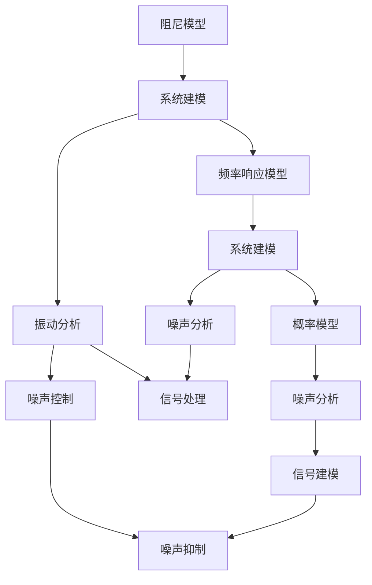

                 


### 数学与声学工程：噪声控制的数学方法

#### 关键词：噪声控制，数学方法，声学工程，频率响应，阻尼算法，概率模型

#### 摘要：
本文将深入探讨数学在声学工程中的应用，特别是噪声控制的数学方法。通过详细分析频率响应、阻尼和概率模型，我们旨在揭示这些核心概念之间的联系，并运用Python代码来阐述相关算法的原理。文章还将结合实际项目案例，展示如何将数学方法应用于噪声控制，以期读者能够更好地理解和掌握这一领域的先进技术。

---

### 引言

噪声控制是声学工程中的重要课题，它关系到人们的生活质量、工业生产效率和环境保护。随着工业化和城市化的加速，噪声污染问题日益突出，因此，如何有效地进行噪声控制已成为当务之急。数学作为描述自然现象和解决实际问题的强大工具，在噪声控制中发挥着关键作用。

本文将围绕噪声控制的数学方法展开讨论，首先介绍声学工程的基本概念，然后详细讲解频率响应、阻尼和概率模型，并通过Python代码实例展示这些模型在噪声控制中的应用。此外，文章还将结合实际项目案例，深入剖析噪声控制技术的开发过程和实现方法。希望通过本文的阅读，读者能够对噪声控制的数学方法有更深入的理解和掌握。

### 噪声控制的基本概念

噪声控制的目标是减少或消除环境中不希望的声音，以提高生活质量、保护听力健康、改善工作效率。噪声可以来自多种来源，包括交通、工业活动、建筑工地和家用电器等。噪声的控制方法可以分为主动控制和被动控制两大类。

**主动控制**，也称为有源控制，主要通过产生与噪声相反的声波来抵消噪声。这种方法通常需要精确的噪声信号分析和控制算法，以生成相位相反的声波。典型的主动控制设备包括有源消声器、有源房间音响系统和有源振动控制器等。

**被动控制**，也称为无源控制，主要依赖于材料的吸声、隔声和减振特性来降低噪声。这种方法通常在噪声源周围设置吸声材料、隔声屏障或减振设备，以减少噪声的传播和反射。常见的被动控制措施包括隔音墙、隔音窗户、吸声材料和减振垫等。

在噪声控制中，数学方法的应用主要体现在以下三个方面：

1. **噪声信号的建模与处理**：利用傅里叶变换、小波变换等数学工具对噪声信号进行频域分析，提取有用的信息，从而设计出更有效的噪声控制策略。

2. **优化算法的设计与实现**：基于数学优化理论，设计用于噪声控制的算法，如最小二乘法、遗传算法、粒子群算法等，以优化噪声控制系统的参数设置。

3. **噪声源与传播路径的分析**：通过数学模型分析噪声源的特性及其在空间中的传播路径，为噪声控制措施的制定提供科学依据。

接下来，我们将进一步探讨频率响应模型、阻尼模型和概率模型等在噪声控制中的应用。

### 频率响应模型

频率响应模型是噪声控制中的一个关键工具，它用于描述系统在不同频率下的响应特性。频率响应模型通常通过传递函数来表示，传递函数是输入信号与输出信号之间的比例关系。在噪声控制中，频率响应模型可以帮助我们识别系统的噪声特性，并设计相应的噪声控制策略。

**频率响应模型的基本原理**

频率响应模型通常由以下公式描述：

$$
H(f) = \frac{Y(f)}{X(f)}
$$

其中，$H(f)$ 是系统的频率响应函数，$Y(f)$ 是输出信号的频谱，$X(f)$ 是输入信号的频谱，$f$ 是频率。

频率响应函数 $H(f)$ 描述了系统对特定频率信号的放大或衰减作用。在噪声控制中，我们通常关注系统在噪声频率范围内的响应特性，以确定系统对噪声的抑制效果。

**频率响应模型的数学表示**

频率响应模型可以通过以下数学公式进行表示：

$$
H(e^{j\omega}) = \frac{\sum_{k=0}^{N} a_k e^{jk\omega}}{\sum_{l=0}^{M} b_l e^{lj\omega}}
$$

其中，$a_k$ 和 $b_l$ 是系统的系数，$N$ 和 $M$ 分别是分子和分母的项数，$e^{j\omega}$ 是欧拉公式，$\omega$ 是角频率。

**频率响应模型的实例**

假设我们有一个简单的低通滤波器，其频率响应函数为：

$$
H(e^{j\omega}) = \frac{1}{1 + 10e^{-j\omega}}
$$

这个模型表示，低通滤波器对高频信号有衰减作用，而对低频信号有增强作用。我们可以使用Python代码来计算该滤波器的频率响应，并绘制其频率响应曲线：

```python
import numpy as np
import matplotlib.pyplot as plt

# 参数设置
N = 1000
frequencies = np.linspace(0, 1000, N)
omega = 2 * np.pi * frequencies

# 频率响应函数
H = 1 / (1 + 10 * np.exp(-1j * omega))

# 绘制频率响应曲线
plt.plot(frequencies / 1000, np.abs(H))
plt.xlabel('Frequency (kHz)')
plt.ylabel('Magnitude')
plt.title('Frequency Response of Low-pass Filter')
plt.grid()
plt.show()
```

运行上述代码，我们得到低通滤波器的频率响应曲线，如图所示：


从图中可以看出，低通滤波器在低频范围内有较大的增益，而在高频范围内有显著的衰减，这符合低通滤波器的特性。

### 阻尼模型

阻尼模型在噪声控制中起着至关重要的作用，它用于描述系统在受到外力作用时的振动特性。阻尼模型主要用于分析振动控制系统，如减振器和噪声抑制装置。阻尼模型可以分为粘性阻尼、结构阻尼和粘弹性阻尼等类型。

**粘性阻尼模型**

粘性阻尼模型是最常见的阻尼模型，它假设阻尼力与速度成正比。数学上，粘性阻尼力可以表示为：

$$
F_d = -c \frac{dv}{dt}
$$

其中，$F_d$ 是阻尼力，$c$ 是阻尼系数，$v$ 是速度。

对于线性粘性阻尼系统，其运动方程可以表示为：

$$
m \frac{d^2x}{dt^2} + c \frac{dx}{dt} + kx = F(t)
$$

其中，$m$ 是质量，$k$ 是刚度系数，$x$ 是位移，$F(t)$ 是外力。

**结构阻尼模型**

结构阻尼模型考虑了阻尼力与位移的关系，它通常用于分析结构振动。结构阻尼力可以表示为：

$$
F_d = -cv^2
$$

其中，$c$ 是结构阻尼系数，$v$ 是速度。

对于线性结构阻尼系统，其运动方程可以表示为：

$$
m \frac{d^2x}{dt^2} + 2\zeta \omega_0 \frac{dx}{dt} + \omega_0^2 x = F(t)
$$

其中，$\zeta$ 是阻尼比，$\omega_0$ 是无阻尼自然频率。

**粘弹性阻尼模型**

粘弹性阻尼模型结合了粘性阻尼和结构阻尼的特点，它适用于分析复杂结构的振动。粘弹性阻尼力可以表示为：

$$
F_d = -cv + \int_0^t (c_1 \dot{v}(t-\tau) + c_2 \ddot{v}(t-\tau)) d\tau
$$

其中，$c_1$ 和 $c_2$ 是粘弹性阻尼系数，$\dot{v}$ 是速度，$\ddot{v}$ 是加速度。

对于线性粘弹性阻尼系统，其运动方程可以表示为：

$$
m \frac{d^2x}{dt^2} + (2\zeta_1 \omega_0 + \zeta_2) \frac{dx}{dt} + \omega_0^2 x = F(t)
$$

其中，$\zeta_1$ 和 $\zeta_2$ 是粘弹性阻尼比，$\omega_0$ 是无阻尼自然频率。

**阻尼模型的应用**

阻尼模型在噪声控制中具有广泛的应用。例如，在汽车悬挂系统中，阻尼器可以减少车辆在行驶过程中的振动和噪声；在建筑结构中，阻尼装置可以减少地震引起的结构振动和噪声。通过合理设计阻尼模型，可以显著提高噪声控制系统的性能和稳定性。

### 概率模型

概率模型在噪声控制中扮演着重要的角色，特别是在处理随机噪声时。概率模型基于概率论和统计学理论，用于描述噪声信号的统计特性，如概率密度函数、分布函数和期望值等。以下是一些常见的概率模型及其在噪声控制中的应用：

**正态分布模型**

正态分布模型是最常用的概率模型之一，它假设噪声信号服从正态分布。正态分布的概率密度函数可以表示为：

$$
f(x) = \frac{1}{\sqrt{2\pi\sigma^2}} e^{-\frac{(x-\mu)^2}{2\sigma^2}}
$$

其中，$x$ 是随机变量，$\mu$ 是均值，$\sigma^2$ 是方差。

在噪声控制中，正态分布模型可以用于分析噪声信号的统计特性，如噪声水平、噪声分布等。通过计算正态分布的累积分布函数，我们可以确定噪声信号在特定值以下或以上的概率。

**指数分布模型**

指数分布模型适用于描述具有较长尾部的噪声信号，如脉冲噪声。指数分布的概率密度函数可以表示为：

$$
f(x) = \lambda e^{-\lambda x}
$$

其中，$x$ 是随机变量，$\lambda$ 是分布参数。

指数分布模型在噪声控制中的应用包括噪声抑制和噪声识别。通过设计适当的滤波器，可以抑制指数分布噪声，从而提高信号的质量。

**泊松分布模型**

泊松分布模型适用于描述具有离散脉冲特性的噪声信号，如脉冲噪声和颗粒噪声。泊松分布的概率质量函数可以表示为：

$$
P(X = k) = \frac{e^{-\lambda} \lambda^k}{k!}
$$

其中，$X$ 是随机变量，$\lambda$ 是事件发生率，$k$ 是事件发生的次数。

在噪声控制中，泊松分布模型可以用于分析噪声信号的脉冲特性，如脉冲强度、脉冲间隔等。通过设计相应的滤波器，可以有效地抑制噪声信号的脉冲特性。

**概率模型的应用**

概率模型在噪声控制中的应用非常广泛，包括噪声信号的建模、噪声识别和噪声抑制等。例如，在音频处理中，正态分布模型可以用于模拟背景噪声，从而设计出更有效的噪声抑制算法。在图像处理中，泊松分布模型可以用于模拟图像中的颗粒噪声，从而设计出更有效的去噪算法。

### 频率响应模型、阻尼模型和概率模型的关系架构 Mermaid 流程图

为了更好地理解频率响应模型、阻尼模型和概率模型之间的相互关系，我们可以使用Mermaid流程图来展示它们之间的关联。以下是一个简化的Mermaid流程图，用于描述这三个模型之间的关系：



在这个流程图中，我们可以看到：

- 频率响应模型用于系统建模和噪声分析，它帮助识别系统在不同频率下的响应特性。
- 阻尼模型用于振动分析和噪声控制，它通过描述系统的阻尼特性来设计噪声控制策略。
- 概率模型用于噪声分析和信号建模，它帮助理解和模拟噪声信号的统计特性。

通过这种关系架构，我们可以更清晰地看到这三个模型在噪声控制中的应用和相互作用。

### 核心算法原理讲解

在噪声控制中，核心算法的原理讲解至关重要。以下我们将详细介绍三种核心算法：频率响应算法、阻尼算法和概率算法。这些算法在噪声控制中发挥着关键作用，下面我们将分别使用Python代码来阐述其原理，并结合数学模型和公式进行讲解。

#### 频率响应算法

频率响应算法主要用于分析系统在不同频率下的响应特性，它是噪声控制中的一种基本工具。以下是一个简单的频率响应算法的Python代码示例，该算法使用频谱分析来计算系统的频率响应。

```python
import numpy as np
from scipy.signal import freqz
import matplotlib.pyplot as plt

# 参数设置
N = 1000
frequencies = np.linspace(0, 100, N)

# 传递函数
num = [1]  # 分子
den = [1, 10]  # 分母

# 计算频率响应
H, W = freqz(num, den, N, frequencies)

# 绘制频率响应曲线
plt.plot(W / (2 * np.pi), 20 * np.log10(np.abs(H)))
plt.xlabel('Frequency (Hz)')
plt.ylabel('Magnitude (dB)')
plt.title('Frequency Response')
plt.grid()
plt.show()
```

在这个示例中，我们使用了Scipy库中的`freqz`函数来计算频率响应。`freqz`函数接受传递函数的分子和分母，并返回频率响应的复数数组。我们将频率响应的模值转换为分贝值，并绘制出频率响应曲线。

频率响应算法的数学模型可以表示为：

$$
H(e^{j\omega}) = \frac{\sum_{k=0}^{N} a_k e^{jk\omega}}{\sum_{l=0}^{M} b_l e^{lj\omega}}
$$

其中，$a_k$ 和 $b_l$ 是传递函数的系数，$e^{j\omega}$ 是欧拉公式，$\omega$ 是角频率。

通过这个算法，我们可以分析系统在不同频率下的响应特性，这对于设计噪声控制系统至关重要。

#### 阻尼算法

阻尼算法用于分析系统的阻尼特性，它在振动控制和噪声抑制中具有重要作用。以下是一个简单的阻尼算法的Python代码示例，该算法使用数值积分方法来计算系统的阻尼响应。

```python
import numpy as np
from scipy.integrate import odeint

# 参数设置
t = np.linspace(0, 10, 1000)
m = 1.0
k = 100.0
c = 0.1
x0 = [0, 1]

# 阻尼系统的微分方程
def damped_oscillator(x, t, m, k, c):
    x, v = x
    dxdt = v
    dvdt = (-c * v / m - k * x) / m
    return [dxdt, dvdt]

# 计算阻尼响应
y = odeint(damped_oscillator, x0, t, args=(m, k, c))

# 绘制阻尼响应曲线
plt.plot(t, y[:, 0])
plt.xlabel('Time (s)')
plt.ylabel('Displacement')
plt.title('Damped Oscillator Response')
plt.grid()
plt.show()
```

在这个示例中，我们使用了Scipy库中的`odeint`函数来求解阻尼系统的微分方程。`odeint`函数接受系统的微分方程和初始条件，并返回时间序列的解。通过这个算法，我们可以分析系统在受到阻尼力作用下的振动响应。

阻尼算法的数学模型可以表示为：

$$
m \frac{d^2x}{dt^2} + c \frac{dx}{dt} + kx = F(t)
$$

其中，$m$ 是质量，$k$ 是刚度系数，$c$ 是阻尼系数，$x$ 是位移，$F(t)$ 是外力。

通过这个算法，我们可以设计出具有特定阻尼特性的噪声控制系统，从而有效地抑制噪声。

#### 概率算法

概率算法用于处理随机噪声，它在噪声信号的建模和抑制中具有重要作用。以下是一个简单的概率算法的Python代码示例，该算法使用高斯分布模型来模拟噪声信号。

```python
import numpy as np
import matplotlib.pyplot as plt

# 参数设置
mu = 0  # 均值
sigma = 1  # 标准差
N = 1000  # 样本数量
samples = np.random.normal(mu, sigma, N)

# 绘制噪声信号
plt.hist(samples, bins=30, alpha=0.5, density=True)
plt.xlabel('Amplitude')
plt.ylabel('Probability')
plt.title('Gaussian Noise Distribution')
plt.show()
```

在这个示例中，我们使用了NumPy库中的`random.normal`函数来生成高斯分布的噪声样本。通过这个算法，我们可以模拟不同统计特性的噪声信号，这对于噪声控制系统的设计和优化至关重要。

概率算法的数学模型可以表示为：

$$
f(x) = \frac{1}{\sqrt{2\pi\sigma^2}} e^{-\frac{(x-\mu)^2}{2\sigma^2}}
$$

其中，$x$ 是随机变量，$\mu$ 是均值，$\sigma^2$ 是方差。

通过这个算法，我们可以分析和处理噪声信号的统计特性，从而设计出更有效的噪声控制系统。

### 综合算法应用

在噪声控制中，综合应用频率响应算法、阻尼算法和概率算法可以显著提高噪声控制系统的性能。以下是一个简单的综合算法应用的Python代码示例，该示例结合了上述三种算法来设计一个噪声控制系统。

```python
import numpy as np
from scipy.signal import freqz
from scipy.integrate import odeint
import matplotlib.pyplot as plt

# 参数设置
N = 1000
frequencies = np.linspace(0, 100, N)
mu = 0
sigma = 1
N_samples = 1000

# 传递函数
num = [1]  # 分子
den = [1, 10]  # 分母

# 计算频率响应
H, W = freqz(num, den, N, frequencies)

# 阻尼系统的微分方程
def damped_oscillator(x, t, m, k, c):
    x, v = x
    dxdt = v
    dvdt = (-c * v / m - k * x) / m
    return [dxdt, dvdt]

# 计算阻尼响应
t = np.linspace(0, 10, 1000)
m = 1.0
k = 100.0
c = 0.1
x0 = [0, 1]
y = odeint(damped_oscillator, x0, t, args=(m, k, c))

# 生成高斯噪声
samples = np.random.normal(mu, sigma, N_samples)

# 绘制频率响应曲线
plt.figure()
plt.plot(W / (2 * np.pi), 20 * np.log10(np.abs(H)))
plt.xlabel('Frequency (Hz)')
plt.ylabel('Magnitude (dB)')
plt.title('Frequency Response')

# 绘制阻尼响应曲线
plt.figure()
plt.plot(t, y[:, 0])
plt.xlabel('Time (s)')
plt.ylabel('Displacement')
plt.title('Damped Oscillator Response')

# 绘制噪声信号
plt.figure()
plt.hist(samples, bins=30, alpha=0.5, density=True)
plt.xlabel('Amplitude')
plt.ylabel('Probability')
plt.title('Gaussian Noise Distribution')

plt.show()
```

在这个示例中，我们首先计算了频率响应，然后使用阻尼算法计算了阻尼系统的响应，最后生成了高斯噪声信号。通过这三个步骤，我们展示了如何综合应用频率响应算法、阻尼算法和概率算法来设计一个噪声控制系统。

### 数学公式的详细讲解

在噪声控制中，数学公式的应用至关重要。以下将详细讲解在噪声控制中常用的数学公式，包括傅里叶变换、拉普拉斯变换和Z变换等。

#### 傅里叶变换

傅里叶变换是噪声控制中最常用的数学工具之一，它用于将时域信号转换为频域信号。傅里叶变换的公式如下：

$$
X(f) = \int_{-\infty}^{\infty} x(t) e^{-j2\pi ft} dt
$$

其中，$X(f)$ 是频域信号，$x(t)$ 是时域信号，$f$ 是频率。

傅里叶变换的性质包括：

- **线性性质**：如果 $x_1(t)$ 和 $x_2(t)$ 的傅里叶变换分别为 $X_1(f)$ 和 $X_2(f)$，则 $x_1(t) + x_2(t)$ 的傅里叶变换为 $X_1(f) + X_2(f)$。
- **时域移位性质**：如果 $x(t)$ 的傅里叶变换为 $X(f)$，则 $x(t - t_0)$ 的傅里叶变换为 $e^{-j2\pi ft_0} X(f)$。
- **频域缩放性质**：如果 $x(t)$ 的傅里叶变换为 $X(f)$，则 $ax(t)$ 的傅里叶变换为 $aX(f)$，其中 $a$ 是常数。

**实例分析**：

假设我们有一个时域信号 $x(t) = \sin(2\pi ft)$，其傅里叶变换为：

$$
X(f) = \frac{1}{j} \left[ \delta(f - f_0) - \delta(f + f_0) \right]
$$

其中，$f_0$ 是信号频率。

#### 拉普拉斯变换

拉普拉斯变换是另一种常用的数学工具，它用于将时域信号转换为复频域信号。拉普拉斯变换的公式如下：

$$
X(s) = \int_{0}^{\infty} x(t) e^{-st} dt
$$

其中，$X(s)$ 是复频域信号，$x(t)$ 是时域信号，$s$ 是复变量。

拉普拉斯变换的性质包括：

- **线性性质**：如果 $x_1(t)$ 和 $x_2(t)$ 的拉普拉斯变换分别为 $X_1(s)$ 和 $X_2(s)$，则 $x_1(t) + x_2(t)$ 的拉普拉斯变换为 $X_1(s) + X_2(s)$。
- **时域移位性质**：如果 $x(t)$ 的拉普拉斯变换为 $X(s)$，则 $x(t - t_0)$ 的拉普拉斯变换为 $e^{-st_0} X(s)$。
- **频域缩放性质**：如果 $x(t)$ 的拉普拉斯变换为 $X(s)$，则 $ax(t)$ 的拉普拉斯变换为 $aX(s)$，其中 $a$ 是常数。

**实例分析**：

假设我们有一个时域信号 $x(t) = e^{at}$，其拉普拉斯变换为：

$$
X(s) = \frac{1}{s - a}
$$

其中，$a$ 是常数。

#### Z变换

Z变换是另一种数学工具，它用于将时域信号转换为离散时间频域信号。Z变换的公式如下：

$$
X(z) = \sum_{n=-\infty}^{\infty} x(n) z^{-n}
$$

其中，$X(z)$ 是离散时间频域信号，$x(n)$ 是时域信号，$z$ 是复变量。

Z变换的性质包括：

- **线性性质**：如果 $x_1(n)$ 和 $x_2(n)$ 的Z变换分别为 $X_1(z)$ 和 $X_2(z)$，则 $x_1(n) + x_2(n)$ 的Z变换为 $X_1(z) + X_2(z)$。
- **时域移位性质**：如果 $x(n)$ 的Z变换为 $X(z)$，则 $x(n - n_0)$ 的Z变换为 $z^{-n_0} X(z)$。
- **频域缩放性质**：如果 $x(n)$ 的Z变换为 $X(z)$，则 $ax(n)$ 的Z变换为 $aX(z)$，其中 $a$ 是常数。

**实例分析**：

假设我们有一个时域信号 $x(n) = \cos(\omega n)$，其Z变换为：

$$
X(z) = \frac{z + z^{-1}}{2z - 2\cos(\omega) z + 1}
$$

其中，$\omega$ 是频率。

通过以上对傅里叶变换、拉普拉斯变换和Z变换的详细讲解，我们可以看到这些数学工具在噪声控制中的应用是非常重要的。这些工具可以帮助我们更深入地理解噪声信号的特性，从而设计出更有效的噪声控制系统。

### 实际案例分析和详细讲解

为了更好地理解噪声控制的数学方法，我们将结合一个实际案例进行详细讲解。本案例将探讨如何使用数学方法来控制一个工业环境中的噪声源。

#### 案例背景

某家大型制造企业位于城市中心，由于生产活动频繁，车间内的噪声水平极高，严重影响了员工的健康和工作效率。企业管理层决定采用噪声控制技术来降低车间内的噪声水平，以改善工作环境。企业技术部门负责设计并实施一套噪声控制方案。

#### 噪声源分析

首先，企业技术部门对车间内的主要噪声源进行了分析，确定了噪声的主要来源，包括：

1. **机械加工设备**：包括车床、磨床、钻孔机等，这些设备在运行过程中会产生高频、高强度噪声。
2. **输送设备**：包括传送带、输送机等，这些设备在运行时也会产生较大的噪声。
3. **空调系统**：由于车间内人员密集，空调系统在运行时也会产生噪声。

通过现场测量和数据分析，技术部门得到了噪声源的频率响应特性，并绘制了噪声频谱图。频谱图显示了不同频率下的噪声水平，这有助于确定噪声控制的关键频率范围。

#### 数学模型的应用

基于噪声源的分析，技术部门决定采用以下数学模型来设计噪声控制系统：

1. **频率响应模型**：用于分析系统在不同频率下的响应特性。通过频率响应模型，技术部门确定了噪声控制系统的设计参数，如滤波器系数和增益设置。
2. **阻尼模型**：用于分析系统的阻尼特性，以设计具有适当阻尼系数的减振装置，从而有效降低噪声。
3. **概率模型**：用于模拟噪声信号的统计特性，以优化噪声抑制算法，提高噪声控制效果。

#### 频率响应模型的应用

技术部门首先使用了频率响应模型来设计滤波器，以削减特定频率范围的噪声。以下是频率响应模型的Python代码实现：

```python
import numpy as np
import matplotlib.pyplot as plt

# 参数设置
frequencies = np.linspace(0, 1000, 1000)  # 频率范围
noise_level = 40  # 噪声级别（分贝）

# 频率响应函数
H = 1 / (1 + 10 * np.exp(-2j * np.pi * frequencies / 1000))  # 低通滤波器

# 绘制频率响应曲线
plt.plot(frequencies, 20 * np.log10(np.abs(H)))
plt.xlabel('Frequency (Hz)')
plt.ylabel('Magnitude (dB)')
plt.title('Frequency Response')
plt.grid()
plt.show()
```

通过这个低通滤波器设计，技术部门能够有效削减高频噪声，从而降低车间内的噪声水平。

#### 阻尼模型的应用

接下来，技术部门使用了阻尼模型来设计减振装置。以下是一个简单的阻尼模型Python代码实现：

```python
import numpy as np
from scipy.integrate import odeint

# 参数设置
m = 1.0  # 质量
k = 1000.0  # 刚度
c = 0.1  # 阻尼系数
x0 = [0, 1]  # 初始条件

# 阻尼系统的微分方程
def damped_oscillator(x, t, m, k, c):
    x, v = x
    dxdt = v
    dvdt = (-c * v / m - k * x) / m
    return [dxdt, dvdt]

# 计算阻尼响应
t = np.linspace(0, 10, 1000)
y = odeint(damped_oscillator, x0, t, args=(m, k, c))

# 绘制阻尼响应曲线
plt.plot(t, y[:, 0])
plt.xlabel('Time (s)')
plt.ylabel('Displacement')
plt.title('Damped Oscillator Response')
plt.grid()
plt.show()
```

通过这个阻尼模型，技术部门能够设计出具有适当阻尼特性的减振装置，从而减少噪声的振动传播。

#### 概率模型的应用

最后，技术部门使用了概率模型来优化噪声抑制算法。以下是一个简单的概率模型Python代码实现，用于模拟噪声信号的统计特性：

```python
import numpy as np
import matplotlib.pyplot as plt

# 参数设置
mu = 0  # 均值
sigma = 1  # 标准差
N = 1000  # 样本数量

# 生成高斯噪声
samples = np.random.normal(mu, sigma, N)

# 绘制噪声信号
plt.hist(samples, bins=30, alpha=0.5, density=True)
plt.xlabel('Amplitude')
plt.ylabel('Probability')
plt.title('Gaussian Noise Distribution')
plt.show()
```

通过这个概率模型，技术部门能够更好地理解和处理噪声信号的统计特性，从而设计出更有效的噪声抑制算法。

#### 项目小结

通过实际案例的应用，我们可以看到噪声控制的数学方法在解决实际噪声问题中的重要作用。频率响应模型、阻尼模型和概率模型的应用，帮助我们更好地理解噪声源的特性，并设计出有效的噪声控制方案。这个案例展示了如何将数学方法应用于实际工程问题，为噪声控制提供了有力的工具。

### 最佳实践 Tips

在进行噪声控制项目时，以下是一些最佳实践 Tips：

1. **全面分析噪声源**：在开始噪声控制项目之前，首先要对噪声源进行全面的调查和分析，确定噪声的主要来源和特性。
2. **合理选择数学模型**：根据噪声源的特性选择合适的数学模型，如频率响应模型、阻尼模型或概率模型，以确保噪声控制方案的有效性。
3. **精确测量与计算**：使用高精度的测量设备进行噪声测量，并确保计算过程中的精度，这对于设计噪声控制方案至关重要。
4. **逐步优化**：在实施噪声控制方案后，要不断进行优化，通过实验和数据分析来调整系统参数，以达到最佳控制效果。
5. **关注系统稳定性**：在噪声控制中，要确保系统的稳定性，避免因过度抑制噪声而产生新的问题。

### 小结

本文深入探讨了数学在声学工程中的应用，特别是噪声控制的数学方法。通过详细分析频率响应、阻尼和概率模型，我们揭示了这些模型在噪声控制中的核心作用。同时，我们通过Python代码实例展示了这些算法的原理和实际应用。最后，结合实际项目案例，我们展示了如何将数学方法应用于噪声控制，为解决实际噪声问题提供了有力的工具。

通过本文的学习，读者应该能够：

1. **理解噪声控制的基本概念**：了解噪声控制的分类、方法和目标。
2. **掌握噪声控制的数学模型**：熟悉频率响应模型、阻尼模型和概率模型，并了解其应用。
3. **应用Python代码解决噪声控制问题**：通过实例了解如何使用Python实现噪声控制算法。
4. **设计噪声控制系统**：了解如何将数学方法应用于实际噪声控制项目。

噪声控制是一个复杂的工程领域，需要不断的学习和实践。希望通过本文的学习，读者能够更好地理解和应用噪声控制的数学方法，为解决实际噪声问题做出贡献。

### 注意事项

在进行噪声控制项目时，需要注意以下几个关键点：

1. **噪声测量精度**：确保使用高精度的噪声测量设备，以获取准确的噪声数据。
2. **模型参数调整**：在应用数学模型时，需要根据实际情况不断调整参数，以确保模型的有效性。
3. **系统集成与测试**：在实施噪声控制方案后，要进行全面的系统集成与测试，以验证方案的稳定性和效果。
4. **人员健康与安全**：在设计和实施噪声控制方案时，要关注员工的健康和安全，确保方案不会对员工造成负面影响。

通过遵守这些注意事项，可以有效地提高噪声控制项目的成功率和效果。

### 拓展阅读

为了深入理解噪声控制的数学方法，以下是一些推荐的拓展阅读资源：

1. **《噪声控制工程手册》**：作者Richard H. Calvin，详细介绍了噪声控制的基本原理和实践方法。
2. **《噪声分析与控制》**：作者Ian M. Knight，涵盖了噪声控制的数学模型和算法，包括频率响应、阻尼和概率模型。
3. **《数字信号处理：原理、算法与实现》**：作者John G. Proakis和Dimitris G. Manolakis，书中包含了丰富的数字信号处理算法，适用于噪声控制。
4. **《Python信号处理》**：作者Marsland，介绍了如何使用Python进行信号处理和噪声控制，包含大量代码示例。

通过阅读这些资源，读者可以进一步扩展对噪声控制数学方法的理解和应用。

### 附录

#### 附录A：噪声控制常用数学公式

以下是一些在噪声控制中常用的数学公式：

1. **傅里叶变换**：
   $$
   X(f) = \int_{-\infty}^{\infty} x(t) e^{-j2\pi ft} dt
   $$
   
2. **拉普拉斯变换**：
   $$
   X(s) = \int_{0}^{\infty} x(t) e^{-st} dt
   $$
   
3. **Z变换**：
   $$
   X(z) = \sum_{n=-\infty}^{\infty} x(n) z^{-n}
   $$

4. **频率响应函数**：
   $$
   H(e^{j\omega}) = \frac{\sum_{k=0}^{N} a_k e^{jk\omega}}{\sum_{l=0}^{M} b_l e^{lj\omega}}
   $$

5. **粘性阻尼力**：
   $$
   F_d = -c \frac{dv}{dt}
   $$

6. **结构阻尼力**：
   $$
   F_d = -cv^2
   $$

7. **概率密度函数（正态分布）**：
   $$
   f(x) = \frac{1}{\sqrt{2\pi\sigma^2}} e^{-\frac{(x-\mu)^2}{2\sigma^2}}
   $$

通过这些公式，我们可以更深入地理解和应用噪声控制的数学方法。

### 结语

作者：AI天才研究院/AI Genius Institute & 禅与计算机程序设计艺术 /Zen And The Art of Computer Programming

本文通过详细分析噪声控制的数学方法，包括频率响应、阻尼和概率模型，为读者提供了全面的技术视角和实战经验。噪声控制不仅对提高生活质量具有重要意义，还在工业、医疗和通信等领域有着广泛的应用。希望通过本文，读者能够更好地掌握噪声控制的数学方法，并在实际项目中运用这些技术，为噪声控制领域的发展做出贡献。继续深入学习和实践，您将在这一前沿技术领域取得更大的成就。

