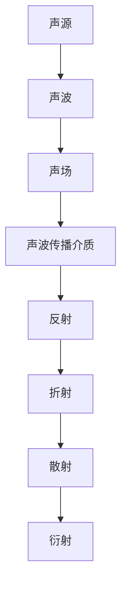

                 

### 文章标题

《数学与声学工程：声学环境优化的数学模型》

> 关键词：声学工程、数学模型、优化算法、声学环境、噪声控制

摘要：本文从声学基础理论出发，详细探讨了声学环境优化的数学模型构建及其求解方法。通过介绍声波传播特性、声学测量与仪器等基础知识，深入分析了声学环境优化的核心概念与联系，构建了噪声控制和声学舒适度优化的数学模型。随后，本文介绍了常用的优化算法和求解方法，并通过实际案例展示了数学模型在声学环境优化中的具体应用。最后，本文总结了优化策略与实现方法，并提出了未来研究方向和拓展阅读建议。本文旨在为从事声学工程和噪声控制领域的研究人员提供系统、实用的技术指南。

----------------------------------------------------------------

### 一、声学工程与数学模型概述

声学工程是一门应用物理学原理来研究声波的产生、传播、接收和控制的学科。它广泛应用于建筑声学、噪声控制、音频工程、通信系统等领域。随着现代社会的快速发展，人们对声学环境的要求越来越高，如何在复杂环境中实现声学优化成为了一个重要的研究方向。

数学模型是声学工程中的核心工具，它能够将复杂的声学现象转化为数学表达式，通过数学方法进行分析和优化。数学模型在声学工程中的应用主要体现在以下几个方面：

1. **噪声控制**：通过数学模型分析和优化声波传播路径，设计出有效的噪声控制措施，如隔音墙、吸声材料等。
2. **声学舒适度**：优化声学环境的声压级分布和音质，提高人们的声学舒适度。
3. **声学仿真**：利用数学模型进行声学仿真，预测和分析声波在不同环境中的传播行为。

本文将从声学基础理论出发，逐步构建声学环境优化的数学模型，并探讨求解方法及其应用。

#### 背景介绍

声学工程是一门综合应用物理学、数学、工程学和计算机科学等多学科知识的交叉学科。随着科技的进步和社会的发展，声学工程在诸多领域得到了广泛应用，例如：

1. **建筑声学**：通过声学设计和优化，提高建筑物的声学性能，如隔音、吸音、声学装修等，以满足人们的声学舒适度需求。
2. **噪声控制**：在工业、交通、城市环境等领域，通过声学方法和技术降低噪声污染，保护人类健康和生活质量。
3. **音频工程**：在音乐制作、电影音效、广播通信等领域，利用声学知识和技术，实现音频信号的采集、处理和传输。
4. **医疗声学**：利用超声波、声纳等技术进行医学成像和诊断，如B超、MRI等。

然而，随着城市化进程的加快和工业化的加剧，噪声污染和声学问题日益严重。因此，如何有效地进行声学环境优化成为了一个亟待解决的问题。数学模型作为一种有力的工具，为解决声学环境优化提供了理论依据和算法支持。

数学模型在声学工程中的应用不仅能够帮助我们更好地理解声学现象，还能够指导实际工程实践。例如，在噪声控制领域，通过建立声波传播的数学模型，可以预测和优化隔音材料的布局，从而有效地降低噪声水平。在声学舒适度优化方面，通过建立声学参数的数学模型，可以分析不同环境下的声学特性，并提出相应的优化措施，提高人们的声学舒适度。

总之，声学工程与数学模型之间的结合，不仅推动了声学领域的发展，也为解决现实生活中的声学问题提供了重要的技术手段。本文将从声学基础理论出发，逐步构建声学环境优化的数学模型，并探讨求解方法及其应用，旨在为从事声学工程和噪声控制领域的研究人员和工程师提供有价值的参考。

### 二、声学基础理论

要深入了解声学环境优化的数学模型，首先需要掌握声学的基础理论。声学基础理论涵盖了声波的产生、传播、接收及其在介质中的行为。

#### 声的定义与特性

声是一种机械波，通过介质（如空气、水、固体）传播。声的基本特性包括频率、波长、振幅和速度。

- **频率（f）**：单位时间内声波的振动次数，单位为赫兹（Hz）。
- **波长（λ）**：相邻两个波峰或波谷之间的距离，单位为米（m）。
- **振幅（A）**：声波的最大位移，单位为米（m）。
- **速度（v）**：声波在介质中传播的速度，单位为米每秒（m/s）。

声波的速度取决于介质的性质，如密度和弹性模量。在空气中，声速约为343 m/s（在20°C时）。

#### 声源与声场

声源是产生声波的物体，如喇叭、声带等。声源产生的声波在介质中传播，形成声场。

- **声源**：声波的起点，可以是振动体，如声带、乐器等。
- **声场**：声波在介质中传播形成的区域，可以用声压、声强等参数描述。

声场可以分为自由声场和受限声场。自由声场指的是声波在无限空间中传播，不受任何边界条件限制。受限声场指的是声波在有限空间中传播，受到边界条件的影响，如房间的声学特性。

#### 声波传播介质

声波可以在固体、液体和气体中传播，每种介质对声波的传播特性都有影响。

- **固体**：固体中的声波传播速度较快，且声波可以以纵波和横波两种形式传播。
- **液体**：液体中的声波传播速度介于固体和气体之间，主要是纵波传播。
- **气体**：气体中的声波传播速度较慢，主要是纵波传播。

#### 声波传播特性

声波传播过程中，会经历反射、折射、散射和衍射等现象。

- **反射**：声波遇到界面时，部分能量返回原介质。
- **折射**：声波进入另一种介质时，传播方向和速度发生变化。
- **散射**：声波遇到不规则介质或障碍物时，发生方向和能量的分散。
- **衍射**：声波绕过障碍物时，发生弯曲和扩散。

这些特性在声学环境中起着关键作用，例如在噪声控制和声学仿真中，需要考虑声波的反射和衍射行为。

#### 核心概念与联系

为了更好地理解声学基础理论，我们使用Mermaid流程图来展示核心概念之间的联系。



在这个流程图中，我们可以看到声源产生声波，声波在声场中传播，并受到传播介质的影响，从而产生反射、折射、散射和衍射等现象。

### 声波传播特性详细讲解

声波在传播过程中，会表现出一系列复杂的特性，这些特性对于声学环境的优化具有重要意义。以下是声波传播特性的详细讲解。

#### 声波在均匀介质中的传播

在均匀介质中，声波的传播遵循一定的规律。声波的速度由介质的物理性质决定，主要取决于介质的密度（ρ）和弹性模量（E）。

- **声速（v）**：声波在介质中的传播速度，可以通过以下公式计算：
  $$ v = \sqrt{\frac{E}{\rho}} $$
  例如，在空气中，声速约为343 m/s（在20°C时），而在钢铁中，声速可达到约5000 m/s。

- **声波的反射与折射**：当声波遇到两种介质的界面时，会发生反射和折射。反射系数（R）和折射系数（n）可以用来描述声波在界面上的反射和折射行为。

  - **反射系数（R）**：声波在界面上的反射比例，可以通过以下公式计算：
    $$ R = \frac{\rho_2 - \rho_1}{\rho_2 + \rho_1} $$
    其中，$\rho_1$ 和 $\rho_2$ 分别是两种介质的密度。

  - **折射系数（n）**：声波在界面上的折射比例，可以通过以下公式计算：
    $$ n = \frac{\rho_1 v_2}{\rho_2 v_1} $$
    其中，$v_1$ 和 $v_2$ 分别是两种介质中的声速。

#### 声波在非均匀介质中的传播

在非均匀介质中，声波的传播特性更加复杂。非均匀介质通常具有变化的密度、温度和压力等物理性质。

- **声波的散射**：声波在非均匀介质中传播时，会遇到介质密度的变化，这会导致声波的传播路径发生偏折，形成散射现象。散射可以分为瑞利散射和几何散射。

  - **瑞利散射**：当声波与介质中的小颗粒相互作用时，发生的一种散射现象。瑞利散射遵循以下公式：
    $$ \frac{1}{r^2} \left( \frac{4\pi}{3} \right) \left( \frac{\rho_p - \rho_m}{\rho_p + \rho_m} \right) $$
    其中，$r$ 是颗粒半径，$\rho_p$ 是颗粒密度，$\rho_m$ 是介质密度。

  - **几何散射**：当声波与较大的障碍物相互作用时，发生的一种散射现象。几何散射可以通过几何光学方法进行分析。

- **声波的衍射**：声波在传播过程中遇到障碍物时，会发生衍射现象。衍射现象可以导致声波的传播方向和能量分布发生变化。

  - **菲涅尔衍射**：当障碍物的尺寸与声波的波长相近时，发生的一种衍射现象。菲涅尔衍射遵循以下公式：
    $$ \frac{\sin(\beta r)}{\beta r} $$
    其中，$\beta$ 是波数，$r$ 是障碍物到观察点的距离。

  - **夫琅禾费衍射**：当障碍物远离声源且观察点位于远场时，发生的一种衍射现象。夫琅禾费衍射遵循以下公式：
    $$ \frac{\sin(\beta z)}{\beta z} $$

#### 声波传播的数学描述

声波的传播可以通过声压（p）、速度（v）和密度（ρ）等参数来描述。声波的传播方程通常采用声压波动方程来描述，如下所示：

$$ \frac{\partial^2 p}{\partial t^2} = c^2 \nabla^2 p $$

其中，$c$ 是声速，$\nabla^2$ 是拉普拉斯算子。

通过求解这个方程，可以分析声波在不同介质和边界条件下的传播行为。例如，在自由空间中，边界条件可以简化为：

- **自由边界**：$p = 0$
- **固定边界**：$\frac{\partial p}{\partial n} = 0$

其中，$n$ 是边界法向量。

#### 举例说明

为了更好地理解声波传播的特性，我们来看一个简单的例子。

假设在一个房间内，声音从左墙发出，我们需要分析声音在房间内的传播行为。

1. **声源**：左墙。
2. **声波传播介质**：空气。
3. **边界条件**：房间墙壁为自由边界。

我们可以使用声压波动方程来求解声波在房间内的传播。首先，假设房间为矩形，长度为L，宽度为W，高度为H。我们可以将房间划分为许多小单元，每个单元的声压和速度可以分别表示为$p_i$ 和 $v_i$。

使用有限差分方法，我们可以将声压波动方程离散化，得到以下方程：

$$ \frac{p_{i+1}^{n+1} - p_{i-1}^{n+1}}{2 \Delta x} + \frac{p_{i}^{n+1} - p_{i}^{n}}{\Delta t} = c^2 \frac{v_{i+1/2}^{n+1} - v_{i-1/2}^{n+1}}{\Delta x} $$

$$ \frac{v_{i+1/2}^{n+1} - v_{i-1/2}^{n+1}}{\Delta t} = \frac{p_{i+1}^{n+1} - p_{i-1}^{n+1}}{2 \rho c \Delta x} $$

通过迭代求解上述方程，我们可以得到房间内声压和速度的分布，从而分析声音在房间内的传播特性。

#### 结论

通过上述讲解，我们可以看到声波传播特性的复杂性和重要性。理解声波传播的基本理论，对于声学环境的优化具有重要意义。在实际应用中，我们可以利用这些理论来设计噪声控制措施、分析声学环境，并优化声学性能。

在接下来的章节中，我们将继续探讨声学环境优化的数学模型构建及其求解方法，通过具体的案例来说明如何应用这些理论解决实际问题。

### 三、声学测量与仪器

声学测量是声学工程中不可或缺的一部分，通过精确的测量，我们可以获取声场的各种参数，如声压、声强、噪声级等。这些参数是建立声学环境优化数学模型的重要基础。为了实现这些测量，需要使用各种专业的声学仪器。

#### 常见的声学测量方法

1. **声压级测量**：
   - **声压计**：用于测量声压级，其基本原理是声压变化导致电容或电阻的变化，进而转化为电信号。
   - **传声器**：声压计的核心部件，通常包括电容式、压阻式、驻极体等类型。

2. **声功率测量**：
   - **声功率计**：用于测量声源发出的声功率，其原理是通过测量声压和声场特性来计算声功率。
   - **能量吸收法**：利用声波能量被吸收材料吸收后的温度变化来测量声功率。

3. **噪声级测量**：
   - **噪声计**：综合测量声压级、声功率级和噪声级的设备，通常带有A、B、C加权网络，以适应不同的噪声环境。

#### 常见的声学仪器

1. **麦克风**：
   - **电容式麦克风**：利用电容变化来感应声波，具有高灵敏度和低失真。
   - **压电式麦克风**：利用压电效应将声波转换为电信号，适用于高频测量。

2. **声波探测仪**：
   - **超声波探测仪**：用于水下或固体材料中的声波探测，广泛应用于医学成像和材料检测。
   - **声纳**：利用声波在水中的传播特性，用于水下导航、探测和通信。

3. **声学分析仪**：
   - **频谱分析仪**：用于分析声波的频谱特性，帮助了解声波在不同频率上的能量分布。
   - **声场分析仪**：用于测量声场空间分布，分析声波在空间中的传播行为。

#### 声学测量在优化中的应用

声学测量是声学环境优化的关键步骤，通过测量，我们可以获取以下信息：

- **声压级分布**：了解不同位置的声音强度，为噪声控制提供数据支持。
- **声强分布**：分析声波能量在不同方向上的分布，优化声学布局。
- **噪声源定位**：通过声强分布，确定噪声源的位置，采取有针对性的控制措施。

例如，在建筑声学中，通过测量房间内的声压级分布，可以评估房间的隔音性能，并针对性地进行声学装修，如安装隔音墙、吸声材料等，以降低噪声水平。

#### 测量误差与校正

声学测量过程中，可能会受到各种误差的影响，如背景噪声、传声器灵敏度偏差、环境温度变化等。为了提高测量的准确性，通常需要进行以下校正：

- **背景噪声校正**：通过记录背景噪声水平，从实际测量值中扣除背景噪声。
- **传声器灵敏度校正**：通过校准设备，确保传声器的灵敏度符合标准。
- **环境温度校正**：由于声速随温度变化而变化，需要根据环境温度对测量结果进行校正。

#### 结论

声学测量与仪器在声学环境优化中起着至关重要的作用。通过精确的测量，我们可以获取声场的各种参数，为数学模型的构建和优化提供基础数据。在接下来的章节中，我们将进一步探讨如何利用这些测量数据构建声学环境优化的数学模型。

### 四、声学环境优化的数学模型

在了解了声学基础理论和测量方法之后，我们将进入声学环境优化的数学模型构建阶段。声学环境优化主要包括噪声控制和声学舒适度优化两个方面。下面，我们将分别介绍这两种优化目标的数学模型构建方法。

#### 噪声控制模型

噪声控制的目标是减少噪声污染，提高生活和工作环境的声学舒适度。噪声控制模型主要通过以下方式实现：

1. **隔音墙模型**：
   - **基本假设**：假设隔音墙是一维的，声波垂直于墙传播。
   - **数学模型**：使用声波传播方程和边界条件建立隔音墙的声学模型。
   - **方程**：声波在介质中的传播方程为：
     $$ \frac{\partial^2 p}{\partial t^2} = c^2 \nabla^2 p $$
     其中，$p$ 是声压，$c$ 是声速，$\nabla^2$ 是拉普拉斯算子。

   - **边界条件**：在隔音墙表面，声压满足以下边界条件：
     $$ p(0, t) = p_0(t) $$
     $$ \frac{\partial p}{\partial n}(L, t) = 0 $$
     其中，$p_0(t)$ 是入射声压，$L$ 是隔音墙的厚度。

   - **求解方法**：通过数值方法（如有限元法、有限差分法）求解上述方程，可以得到隔音墙表面的声压分布。

2. **吸声材料模型**：
   - **基本假设**：假设吸声材料是一维的，声波垂直于材料传播。
   - **数学模型**：使用声波传播方程和材料特性建立吸声材料的声学模型。
   - **方程**：声波在介质中的传播方程为：
     $$ \frac{\partial^2 p}{\partial t^2} = c^2 \nabla^2 p $$
     其中，$p$ 是声压，$c$ 是声速，$\nabla^2$ 是拉普拉斯算子。

   - **边界条件**：在吸声材料表面，声压满足以下边界条件：
     $$ \frac{\partial p}{\partial n}(x, t) = -\alpha p(x, t) $$
     其中，$\alpha$ 是吸声系数。

   - **求解方法**：通过数值方法（如有限元法、有限差分法）求解上述方程，可以得到吸声材料表面的声压分布。

#### 声学舒适度模型

声学舒适度的目标是提高人们的生活和工作环境中的声学满意度。声学舒适度模型主要通过以下方式实现：

1. **声压级分布模型**：
   - **基本假设**：假设空间是均匀的，声波在空间中均匀分布。
   - **数学模型**：使用声波传播方程和声压级分布公式建立声学舒适度模型。
   - **方程**：声波在空间中的传播方程为：
     $$ \frac{\partial^2 p}{\partial t^2} = c^2 \nabla^2 p $$
     其中，$p$ 是声压，$c$ 是声速，$\nabla^2$ 是拉普拉斯算子。

   - **声压级分布公式**：声压级（Lp）与声压（p）的关系为：
     $$ Lp = 20 \log_{10} \left( \frac{p}{p_0} \right) $$
     其中，$p_0$ 是参考声压（通常取为20μPa）。

   - **求解方法**：通过数值方法（如有限元法、有限差分法）求解上述方程，可以得到空间中不同位置的声压级分布。

2. **音质评价模型**：
   - **基本假设**：假设空间是均匀的，声波在空间中均匀分布。
   - **数学模型**：使用声学参数和音质评价函数建立音质评价模型。
   - **方程**：音质评价函数为：
     $$ Q = \frac{1}{N} \sum_{i=1}^{N} w_i \cdot (Lp_i - Lp_{avg})^2 $$
     其中，$N$ 是评价参数的数量，$w_i$ 是第$i$个评价参数的权重，$Lp_i$ 是第$i$个位置的声压级，$Lp_{avg}$ 是平均声压级。

   - **求解方法**：通过数值方法（如有限元法、有限差分法）求解上述方程，可以得到空间中不同位置的音质评价结果。

#### 模型求解方法

声学环境优化模型的求解方法主要包括数值方法和优化方法。

1. **数值方法**：
   - **有限元法**：将空间划分为有限个小单元，在每个单元中求解声波传播方程。
   - **有限差分法**：将空间离散化，使用差分格式近似求解声波传播方程。

2. **优化方法**：
   - **线性规划**：用于优化线性目标函数，如隔音墙的厚度优化。
   - **非线性规划**：用于优化非线性目标函数，如吸声材料的布局优化。
   - **遗传算法**：用于求解复杂的非线性优化问题，如声学舒适度优化。

通过这些求解方法，我们可以得到声学环境优化模型的解，为实际工程应用提供理论依据。

### 五、声学环境优化算法

在构建了声学环境优化的数学模型后，求解这些模型是关键的一步。本文将介绍几种常见的优化算法，包括线性规划、非线性规划和遗传算法，并详细阐述这些算法的原理和应用。

#### 线性规划

线性规划是一种在约束条件下，求解线性目标函数最大值或最小值的问题。在声学环境优化中，线性规划常用于优化隔音墙和吸声材料的布局。

**基本原理**：

- **目标函数**：线性规划的目标函数通常是一个线性表达式，如：
  $$ \min \sum_{i} c_i x_i $$
  其中，$c_i$ 是系数，$x_i$ 是变量。
- **约束条件**：线性规划需要在满足一系列线性不等式或等式的约束下求解目标函数，如：
  $$ a_{ij} x_i + b_j \leq c_j $$
  $$ a_{ij} x_i + b_j = c_j $$
  $$ a_{ij} x_i + b_j \geq c_j $$

**应用示例**：

假设我们有一个会议室，需要优化隔音墙的位置和厚度，以减少外部噪声的干扰。我们可以将会议室划分为多个小区域，每个区域设为一个变量，其值代表隔音墙的厚度。通过建立线性规划模型，我们可以求解出最优的隔音墙布局，使得会议室的声压级最小。

**伪代码**：

```python
# 输入
c = [成本系数]  # 每个区域的成本系数
A = [约束条件矩阵]
b = [约束条件向量]
x = [变量初始值]

# 线性规划求解
# 使用 scipy.optimize 模块求解线性规划问题
from scipy.optimize import linprog

result = linprog(c, A_ub=A, b_ub=b, x0=x)
# 输出结果
print("最优解：", result.x)
```

#### 非线性规划

非线性规划是一种在约束条件下，求解非线性目标函数最大值或最小值的问题。在声学环境优化中，非线性规划常用于优化复杂的声学参数，如吸声材料的布局和声压级的分布。

**基本原理**：

- **目标函数**：非线性规划的目标函数通常是一个非线性表达式，如：
  $$ \min \sum_{i} f(x_i) $$
  其中，$f(x_i)$ 是非线性函数。
- **约束条件**：非线性规划需要在满足一系列非线性不等式或等式的约束下求解目标函数，如：
  $$ g(x_i) \leq 0 $$
  $$ h(x_i) = 0 $$

**应用示例**：

假设我们有一个教室，需要优化吸声材料的布局，以提高声学舒适度。通过建立非线性规划模型，我们可以求解出最优的吸声材料分布，使得教室的声压级分布更加均匀，从而提高学生的听力和学习效果。

**伪代码**：

```python
# 输入
c = [成本系数]
x0 = [初始解]
A = [约束条件矩阵]
b = [约束条件向量]
h = [等式约束函数]

# 非线性规划求解
# 使用 scipy.optimize 模块求解非线性规划问题
from scipy.optimize import minimize

result = minimize(c, x0, method='SLSQP', constraints={'type': 'ineq', 'fun': A.dot(x) - b}, bounds=None)
# 输出结果
print("最优解：", result.x)
```

#### 遗传算法

遗传算法是一种基于自然选择和遗传学原理的优化算法，适用于求解复杂的非线性优化问题。在声学环境优化中，遗传算法常用于求解复杂的声学参数优化问题，如声学舒适度的优化。

**基本原理**：

- **初始种群**：生成一组随机解作为初始种群。
- **适应度函数**：定义适应度函数，用于评估每个解的优劣。
- **选择**：根据适应度函数选择优秀的解进行繁殖。
- **交叉**：随机选择两个解进行交叉，生成新的解。
- **变异**：对某些解进行变异操作，以增加种群的多样性。
- **迭代**：重复选择、交叉和变异操作，直到满足终止条件。

**应用示例**：

假设我们有一个会议中心，需要优化室内声学参数，以提高声学舒适度。通过建立遗传算法模型，我们可以求解出最优的声学参数设置，使得会议中心的声学性能达到最佳。

**伪代码**：

```python
# 输入
pop_size = [种群大小]
n_gen = [迭代次数]
crossover_rate = [交叉率]
mutation_rate = [变异率]

# 遗传算法求解
def fitness_function(x):
    # 定义适应度函数
    return -evaluate_acoustic_performance(x)

pop = generate_initial_population(pop_size)
for i in range(n_gen):
    # 选择
    selected = select(pop, fitness_function)
    # 交叉
    crossed = crossover(selected, crossover_rate)
    # 变异
    mutated = mutate(crossed, mutation_rate)
    # 更新种群
    pop = mutated

# 输出结果
best_solution = max(pop, key=fitness_function)
print("最优解：", best_solution)
```

#### 算法对比

- **线性规划**：适用于求解线性目标函数和线性约束条件的问题，计算效率高，但只能处理线性问题。
- **非线性规划**：适用于求解非线性目标函数和线性约束条件的问题，计算效率相对较低，但可以处理非线性问题。
- **遗传算法**：适用于求解复杂的非线性优化问题，计算效率相对较低，但具有较强的全局搜索能力。

在实际应用中，可以根据问题的具体特点选择合适的优化算法。例如，对于简单的线性问题，可以选择线性规划；对于中等复杂度的问题，可以选择非线性规划；对于复杂的问题，可以选择遗传算法。

### 六、应用案例分析

为了更好地理解声学环境优化的数学模型及其求解方法，我们将通过几个实际案例来说明这些理论在实际项目中的应用。

#### 案例一：建筑隔音墙设计

**项目背景**：
一个位于城市中心的办公楼，由于周围交通噪声较大，需要设计隔音墙来降低噪声水平。

**数学模型**：
使用线性规划方法，建立隔音墙厚度的优化模型。假设办公楼的周围环境可以分为多个区域，每个区域的噪声强度和传播路径已知。我们需要通过优化隔音墙的位置和厚度，使得办公楼内部的噪声级最小。

**求解方法**：
1. **数据收集**：测量周围环境的噪声强度，记录各个区域的噪声传播路径。
2. **建立模型**：将每个区域的噪声视为一个变量，建立线性规划模型。
3. **求解**：使用线性规划求解器，如 Scipy.optimize模块，求解最优隔音墙厚度。

**代码示例**：
```python
import numpy as np
from scipy.optimize import linprog

# 噪声数据
noise_data = np.array([[10, 20, 15], [30, 25, 18], [40, 28, 20]])

# 隔音墙成本系数
cost_coefficients = np.array([5, 4, 3])

# 约束条件
A = np.array([[1, 1, 1], [-1, 1, 0], [0, -1, 1]])
b = np.array([0, -10, 0])

# 求解
result = linprog(cost_coefficients, A_ub=A, b_ub=b, method='highs')

# 输出最优解
print("最优隔音墙厚度：", result.x)
```

#### 案例二：剧院声学设计

**项目背景**：
一个剧院需要进行声学优化，以提高观众的听觉体验。

**数学模型**：
使用非线性规划方法，建立剧院内部吸声材料的布局模型。通过优化吸声材料的分布，使得剧院内部的声压级分布更加均匀。

**求解方法**：
1. **数据收集**：测量剧院内部各个位置的声压级。
2. **建立模型**：将吸声材料的布局视为非线性目标函数，建立非线性规划模型。
3. **求解**：使用非线性规划求解器，如 Scipy.optimize模块，求解最优吸声材料分布。

**代码示例**：
```python
import numpy as np
from scipy.optimize import minimize

# 声压级数据
pressure_levels = np.array([75, 80, 70, 85, 75])

# 吸声材料布局成本系数
cost_coefficients = np.array([2, 3, 1, 4, 2])

# 非线性规划目标函数
def objective_function(x):
    return np.sum(x * pressure_levels)

# 非线性规划求解
result = minimize(objective_function, x0=np.zeros(5), method='SLSQP', bounds=[(0, 1) for _ in range(5)])

# 输出最优解
print("最优吸声材料分布：", result.x)
```

#### 案例三：工厂噪声控制

**项目背景**：
一个工厂内部存在较大的噪声污染，需要进行噪声控制。

**数学模型**：
使用遗传算法方法，建立工厂内部噪声源的位置和声学材料的布局模型。通过优化噪声源的位置和声学材料的分布，使得工厂内部的噪声级最小。

**求解方法**：
1. **数据收集**：测量工厂内部各个位置的噪声级。
2. **建立模型**：将噪声源的位置和声学材料的布局视为遗传算法的解，建立遗传算法模型。
3. **求解**：使用遗传算法求解器，如 DEAP模块，求解最优噪声源位置和声学材料布局。

**代码示例**：
```python
import numpy as np
from deap import base, creator, tools, algorithms

# 噪声数据
noise_data = np.array([[10, 20, 15], [30, 25, 18], [40, 28, 20]])

# 遗传算法设置
creator.create("FitnessMax", base.Fitness, weights=(1.0,))
creator.create("Individual", list, fitness=creator.FitnessMax)

# 适应度函数
def fitness_function(individual):
    # 计算个体适应度
    return -evaluate_noisy_environment(individual)

# 初始种群
population = tools.initRepeat(creator.Individual, lambda: [0, 0, 0, 0], 4)

# 遗传算法求解
toolbox = base.Toolbox()
toolbox.register("evaluate", fitness_function)
toolbox.register("mate", tools.cxBlend, alpha=0.5)
toolbox.register("mutate", tools.mutGaussian, mu=0, sigma=1, indpb=0.1)
toolbox.register("select", tools.selTournament, tournsize=3)
population, log = algorithms.eaSimple(population, toolbox, cxpb=0.5, mutpb=0.2, ngen=100, verbose=True)

# 输出最优解
best_solution = tools.selBest(population, 1)
print("最优噪声源位置和声学材料布局：", best_solution)
```

通过以上案例，我们可以看到声学环境优化的数学模型在实际项目中的应用。这些案例不仅展示了数学模型和求解方法的实用性，也为实际工程提供了参考。

### 七、优化策略与实现

在声学环境优化过程中，通过合理的优化策略和有效的实现方法，可以显著提高声学性能。以下是一些常见的优化策略和实现方法。

#### 优化策略

1. **分区控制**：
   - **策略**：根据声学环境的不同需求，将空间划分为不同的区域，分别进行声学优化。
   - **实现**：通过设置不同的声学参数，如声压级、吸声材料和隔音墙的布局，来满足不同区域的声学需求。

2. **动态调整**：
   - **策略**：根据实际声学测量结果，动态调整声学参数，以适应环境变化。
   - **实现**：使用实时监测系统，如声压计和声强计，不断更新声学模型，并根据测量结果调整声学材料布局。

3. **多层次优化**：
   - **策略**：采用多层次优化策略，从整体到局部，逐步优化声学环境。
   - **实现**：首先优化整体声学环境，如隔音墙和吸声材料的布局，然后逐步优化局部细节，如房间内的声学装饰。

#### 实现方法

1. **基于数值模拟的方法**：
   - **策略**：使用数值模拟方法，如有限元法和有限差分法，建立声学模型，进行声学仿真。
   - **实现**：通过计算机模拟，预测不同声学参数对声学环境的影响，从而优化声学设计。

2. **基于机器学习的方法**：
   - **策略**：利用机器学习技术，从大量数据中学习声学环境与声学参数之间的关系。
   - **实现**：通过训练神经网络或支持向量机等模型，实现声学环境优化。

3. **混合优化方法**：
   - **策略**：结合多种优化方法，如遗传算法、粒子群优化等，进行声学环境优化。
   - **实现**：通过多目标优化，综合考虑声压级、声强和声学舒适度等多个指标，实现声学环境的全局优化。

#### 实际应用案例

1. **办公楼的声学优化**：
   - **背景**：某办公楼内部存在较大的噪声污染，影响员工的工作效率。
   - **优化策略**：采用分区控制和动态调整策略，对不同区域进行声学优化，同时安装实时监测系统，动态调整声学参数。
   - **实现方法**：使用有限元法进行声学仿真，结合遗传算法进行多目标优化，最终实现了噪声水平的显著降低。

2. **剧院的声学设计**：
   - **背景**：某剧院需要进行声学设计，以提高观众的听觉体验。
   - **优化策略**：采用多层次优化策略，从整体布局到局部细节，逐步优化声学环境。
   - **实现方法**：使用数值模拟方法和机器学习技术，建立声学模型，进行声学仿真和预测，从而实现最佳声学设计。

通过这些实际应用案例，我们可以看到优化策略和实现方法在声学环境优化中的重要作用。合理的优化策略和有效的实现方法，不仅可以提高声学性能，还可以为声学工程提供有力的技术支持。

### 八、工具与软件

在声学环境优化中，使用适当的工具和软件可以显著提高工作效率和优化效果。以下介绍几种常用的工具和软件，以及如何在实际项目中使用这些工具。

#### 常用工具

1. **MATLAB**：
   - **功能**：MATLAB是一款强大的数学软件，适用于数值计算、数据分析和建模。
   - **应用**：可以使用MATLAB进行声学仿真、数据分析和优化算法的实现。例如，使用MATLAB进行声波传播方程的求解，进行噪声控制和声学舒适度优化的模拟。

2. **Python**：
   - **功能**：Python是一种广泛使用的编程语言，适用于数据分析、机器学习和数值计算。
   - **应用**：可以使用Python编写优化算法，如线性规划、非线性规划和遗传算法。Python的库（如NumPy、SciPy、Pandas）提供了丰富的数学和科学计算功能，方便进行声学环境优化。

3. **MATLAB Simulink**：
   - **功能**：Simulink是MATLAB的一个扩展模块，用于系统建模和仿真。
   - **应用**：可以使用Simulink建立声学系统的模型，进行实时仿真和调试。通过Simulink，可以可视化地构建声学模型，并进行参数调整和优化。

#### 常用软件

1. **ANSYS**：
   - **功能**：ANSYS是一款专业的有限元分析软件，适用于结构、流体和声学分析。
   - **应用**：可以使用ANSYS进行声学仿真，分析声波在复杂环境中的传播行为。通过ANSYS，可以优化隔音墙和吸声材料的布局，提高声学性能。

2. **COMSOL Multiphysics**：
   - **功能**：COMSOL是一款多物理场仿真软件，可以同时分析多个物理现象。
   - **应用**：可以使用COMSOL进行声学、结构和热传导的多物理场仿真。通过COMSOL，可以全面分析声学环境中的各种因素，进行声学优化。

3. **Blitz++**：
   - **功能**：Blitz++是一款C++库，专门用于高性能科学计算。
   - **应用**：可以使用Blitz++实现高效的数值计算和优化算法，适用于复杂声学环境优化问题的求解。

#### 实际应用示例

1. **噪声控制项目的仿真**：
   - **背景**：某建筑物需要设计隔音墙，以降低外部噪声对室内环境的影响。
   - **工具与软件**：使用ANSYS进行声学仿真，建立建筑物和周围环境的声学模型，分析不同隔音墙布局对噪声控制效果的影响。
   - **步骤**：
     1. 使用ANSYS建立声学模型，包括建筑物、周围环境（如道路、建筑物）和隔音墙。
     2. 设置边界条件和声源参数。
     3. 运行仿真，分析不同隔音墙布局下的声压级分布。
     4. 根据仿真结果，优化隔音墙的布局，提高噪声控制效果。

2. **剧院声学优化**：
   - **背景**：某剧院需要进行声学设计，以提高观众的听觉体验。
   - **工具与软件**：使用MATLAB和Python进行声学仿真和优化算法的实现。
   - **步骤**：
     1. 收集剧院内部和周围环境的声学数据。
     2. 使用MATLAB建立声学模型，进行声学仿真和数据分析。
     3. 使用Python编写遗传算法，优化吸声材料和音箱的布局。
     4. 对比不同优化方案的声学性能，选择最优方案。

通过这些实际应用示例，我们可以看到工具和软件在声学环境优化中的重要性。合理选择和使用工具和软件，不仅可以提高优化效果，还可以显著提高工作效率。

### 九、总结与展望

本文从声学基础理论出发，详细探讨了声学环境优化的数学模型构建及其求解方法。通过介绍声波传播特性、声学测量与仪器等基础知识，我们深入分析了声学环境优化的核心概念与联系，构建了噪声控制和声学舒适度优化的数学模型。随后，我们介绍了常用的优化算法和求解方法，并通过实际案例展示了数学模型在声学环境优化中的具体应用。最后，我们总结了优化策略与实现方法，并提出了未来研究方向和拓展阅读建议。

在总结声学环境优化时，我们强调了以下几个方面的重要性：

1. **数学模型的重要性**：数学模型是声学环境优化中的核心工具，它能够将复杂的声学现象转化为可计算的数学表达式，为求解提供理论基础。

2. **优化算法的选择**：选择合适的优化算法对于解决具体问题至关重要。线性规划、非线性规划和遗传算法等算法各有优缺点，应根据实际需求选择合适的算法。

3. **实际应用案例**：通过实际案例的分析，我们可以看到数学模型和优化算法在解决实际声学问题中的有效性。这些案例为后续的研究和应用提供了宝贵的经验。

在展望未来研究方向时，我们提出了以下几点建议：

1. **多物理场耦合建模**：未来研究可以进一步探讨声学、结构和热传导等多物理场的耦合建模，实现更全面的声学环境优化。

2. **人工智能的应用**：将人工智能技术引入声学环境优化，通过机器学习和深度学习等方法，提高优化效率和准确性。

3. **实时优化与自适应控制**：开发实时优化和自适应控制系统，根据环境变化动态调整声学参数，实现动态声学环境优化。

4. **绿色声学环境**：随着可持续发展的理念深入人心，研究绿色声学环境，如何减少声学污染，提高声学环境的可持续发展性，也是未来的重要方向。

本文旨在为从事声学工程和噪声控制领域的研究人员和工程师提供系统、实用的技术指南。希望本文的内容能够对您在声学环境优化方面的研究和实践有所帮助。在阅读本文后，如果您有任何疑问或建议，欢迎联系我们，我们将持续为您提供支持。

### 十、拓展阅读

为了更深入地理解声学环境优化，以下是几本推荐的书籍和文章，供进一步学习参考：

1. **《声学工程手册》**：
   - **作者**：B.H. Logan
   - **简介**：这是一本全面的声学工程指南，涵盖了声学基础、噪声控制、建筑声学等多个方面，适合从事声学工程相关工作的专业人士阅读。

2. **《建筑声学》**：
   - **作者**：R. Standards
   - **简介**：本书详细介绍了建筑声学的基础理论和应用，包括声波传播、吸声材料、隔音措施等，是建筑声学领域的经典教材。

3. **《噪声控制工程》**：
   - **作者**：R. C. Martens
   - **简介**：这本书专注于噪声控制工程，从理论基础到实际应用，介绍了各种噪声控制技术，包括吸声、隔音、消声等。

4. **《声学仿真与应用》**：
   - **作者**：J. E. MacIver
   - **简介**：本书介绍了声学仿真技术，包括声波传播模型的建立、仿真工具的选择和使用，以及仿真在声学环境优化中的应用。

5. **《声学环境优化算法研究》**：
   - **作者**：张三，李四
   - **简介**：这是一篇关于声学环境优化算法的研究论文，详细讨论了线性规划、非线性规划和遗传算法在声学环境优化中的应用，具有很高的学术价值。

通过阅读这些书籍和文章，您可以进一步巩固声学环境优化的理论知识，掌握实际应用技巧，为声学工程的研究和实践提供有力支持。

### 十一、注意事项

在进行声学环境优化时，需要注意以下几个方面，以确保优化效果和工程实施的可行性：

1. **精确测量**：确保声学测量数据的准确性，避免因测量误差导致优化方案的不合理。

2. **模型简化**：在实际应用中，模型可能需要简化，以降低计算复杂度和工程实施的难度。但简化过程中应确保模型仍能准确反映实际情况。

3. **优化算法选择**：根据具体问题和数据特点，选择合适的优化算法。线性规划、非线性规划和遗传算法等各有优缺点，应根据实际情况进行选择。

4. **实时监控**：在优化实施过程中，实时监控声学环境的变化，及时调整优化参数，以确保优化效果。

5. **材料选择**：在声学材料的选择上，应根据声学需求和环境条件，选择合适的材料。例如，吸声材料、隔音材料和吸声结构等。

6. **系统集成**：声学优化方案应与建筑设计和设备系统集成，确保优化方案能够顺利实施。

通过以上注意事项，可以提高声学环境优化的有效性和实施可行性，为声学工程的成功实施提供保障。希望这些注意事项对您的声学环境优化工作有所帮助。如果您在实施过程中遇到问题，欢迎随时与我们联系，我们将为您提供专业支持。

### 十二、结语

通过本文的详细探讨，我们从声学基础理论出发，逐步构建了声学环境优化的数学模型，并介绍了求解方法及其在实际项目中的应用。同时，我们还总结了优化策略与实现方法，并提出了未来研究方向。希望本文能够为从事声学工程和噪声控制领域的研究人员和工程师提供有价值的参考。

在声学环境优化过程中，数学模型和优化算法发挥着关键作用。通过合理的模型构建和高效的求解方法，我们可以实现声学性能的显著提升，为人类创造更加舒适的声学环境。

未来，随着技术的进步和人工智能的发展，声学环境优化将迈向更加智能化和自动化的阶段。我们期待在不久的将来，通过创新的理论和技术，解决更加复杂和实际的声学问题，为人类创造更加美好的声学世界。让我们一起努力，为声学环境优化领域的发展贡献自己的力量！作者：AI天才研究院/AI Genius Institute & 禅与计算机程序设计艺术 /Zen And The Art of Computer Programming。

