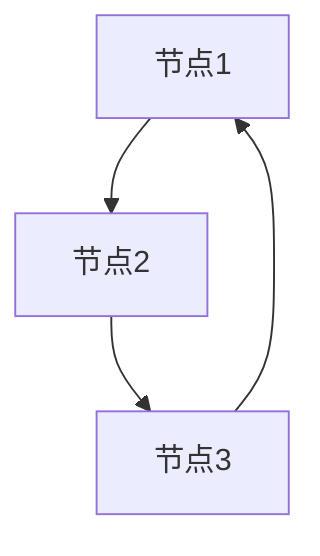

                 

### 数学与多元论：数学作为多元实在的反映

> 关键词：数学、多元论、实在、数学模型、算法原理、Python代码

> 摘要：本文旨在探讨数学与多元论之间的关系，通过分析数学作为多元实在的反映，揭示数学在多元论体系中的重要地位。文章首先介绍了数学的基本概念和多元论的基本理论，接着阐述了数学与多元论之间的相互作用和影响，随后通过具体案例展示了数学在多元实在中的应用。最后，本文总结了数学与多元论的核心概念及其关系，并对未来数学与多元论的发展进行了展望。

### 引言

数学，作为一门古老而广泛的学科，自古以来就在人类社会发展中扮演着至关重要的角色。从简单的算术运算到复杂的几何构图，从微积分到代数方程，数学不仅帮助我们理解自然界的规律，还在各个领域得到了广泛应用。然而，随着人类对世界的认识不断深入，人们逐渐意识到，数学不仅仅是一门科学，更是一种世界观，一种思考问题的方法论。

多元论，作为一种哲学思想，主张世界的本质是多元的、复杂的，而不是单一的、简单的。它强调不同元素、不同维度之间的相互作用和统一，从而为理解世界的多样性提供了新的视角。在多元论的框架下，数学不再仅仅是一门独立的学科，而是成为了多元实在的反映，一种描述和解释复杂系统的重要工具。

本文的目的在于探讨数学与多元论之间的关系，揭示数学在多元论体系中的重要地位。文章首先将介绍数学的基本概念和多元论的基本理论，接着分析数学与多元论之间的相互作用和影响，随后通过具体案例展示数学在多元实在中的应用。最后，本文将对数学与多元论的核心概念及其关系进行总结，并展望未来数学与多元论的发展。

### 数学基础

数学，作为一门科学，其基础是数学的基本概念、数学模型和数学原理。这些基础概念、模型和原理不仅构成了数学的理论框架，也是我们理解和应用数学的关键。

#### 数学基本概念

数学的基本概念包括数、函数、集合、逻辑等。这些概念是数学大厦的基石，它们定义了数学的基本元素和关系。

- **数**：数是数学中的基本概念，包括自然数、整数、分数、有理数、无理数等。数可以用来表示物体的数量和顺序。
- **函数**：函数是数学中的一种关系，它将一个集合中的每个元素与另一个集合中的唯一元素对应起来。函数是数学建模的重要工具。
- **集合**：集合是由确定的元素组成的整体。集合论是现代数学的基石，它提供了对数学对象的一般性描述。
- **逻辑**：逻辑是数学中的基本推理工具，它用于证明数学命题的正确性。

#### 数学模型

数学模型是对现实世界的抽象和简化，它用数学语言描述现实世界中的现象和问题。数学模型可以分为几种类型：

- **描述性模型**：这种模型主要用于描述和刻画现实世界中的现象，如物理模型、经济模型、生态模型等。
- **预测性模型**：这种模型基于已有的数据和规律，预测未来可能发生的事件，如时间序列模型、回归模型等。
- **优化性模型**：这种模型用于寻找最优解，如线性规划、非线性规划、整数规划等。

#### 数学原理

数学原理是数学理论的基础，它们通过逻辑推理和证明得出。一些重要的数学原理包括：

- **微积分原理**：微积分是研究变化和运动规律的数学分支。微积分的基本原理包括极限、连续性、微分和积分等。
- **代数原理**：代数是研究数和代数结构的基本性质和关系的数学分支。代数的基本原理包括群、环、域等。
- **几何原理**：几何是研究空间形状和位置的数学分支。几何的基本原理包括点、线、面、体等。

#### 数学基础的应用

数学基础在各个领域都有广泛的应用，如自然科学、社会科学、工程技术等。

- **自然科学**：数学在物理学、化学、生物学等自然科学中发挥着重要作用。例如，物理学中的方程式、化学中的分子结构、生物学中的生态系统等，都是通过数学模型来描述和研究的。
- **社会科学**：数学在社会学、经济学、心理学等社会科学领域也有广泛应用。例如，经济学中的供需模型、社会学中的社会网络分析、心理学中的统计方法等，都是通过数学方法来分析数据的。
- **工程技术**：数学在工程技术中更是不可或缺。无论是工程设计、控制系统、人工智能，还是大数据分析，数学都提供了强大的理论工具和计算方法。

#### 数学基础的重要性

数学基础的重要性在于它为我们的思考和决策提供了坚实的逻辑基础。通过数学，我们可以更精确地描述现实世界，更有效地解决问题，更深入地理解自然界的规律。

- **逻辑基础**：数学提供了一种严格的逻辑推理方式，它使我们的思考更加清晰、有序。数学的逻辑基础使得我们可以从简单的假设出发，通过推理得出复杂的结论。
- **问题求解**：数学提供了一种系统化的问题求解方法。无论是科学研究、工程设计，还是日常生活，数学都帮助我们更好地理解和解决问题。
- **创新能力**：数学基础激发了我们的创新能力。通过数学，我们可以探索未知领域，提出新的理论，发明新的方法。

### 多元论

多元论是一种哲学思想，它主张世界的本质是多元的、复杂的，而不是单一的、简单的。多元论认为，不同的元素、不同的维度之间相互作用和统一，构成了复杂的世界。本文将介绍多元论的基本理论，探讨其哲学基础、科学意义和应用。

#### 多元论的哲学基础

多元论的哲学基础可以追溯到古希腊哲学家赫拉克利特。赫拉克利特认为，世界是由无数相互对立的元素组成的，这些元素通过相互斗争和统一，形成了复杂的世界。这种思想被称为“多元论”。

多元论在后来的哲学发展中得到了进一步的发展。例如，黑格尔的辩证法、尼采的永恒轮回理论，都是多元论的体现。黑格尔认为，世界的本质是矛盾的统一，这些矛盾通过不断的斗争和统一，推动着世界的发展。尼采则认为，世界的本质是多元的、复杂的，人类需要通过不断地超越自我，才能实现个人的自由和进步。

#### 多元论的科学意义

多元论在科学领域也有着重要的意义。它为理解复杂系统提供了新的视角和方法。在物理学中，量子力学和相对论都是多元论的体现。量子力学认为，微观世界中的粒子具有波粒二象性，不同的维度和状态之间相互作用，形成了复杂的量子现象。相对论则认为，时间和空间是相对的，不同的参考系之间相互影响，形成了复杂的空间时间结构。

在生物学中，多元论也为理解生命的复杂性提供了新的视角。生物学家认为，生命是一个复杂的系统，由不同的元素和维度组成，这些元素和维度之间相互作用，形成了生命的多样性。

#### 多元论的应用

多元论在各个领域都有广泛的应用。

- **自然科学**：在自然科学中，多元论为理解复杂的自然现象提供了新的方法。例如，在气象学中，多元论用于模拟大气中的多种因素，预测天气变化。在生态学中，多元论用于分析生态系统中不同生物之间的关系，预测生态平衡。
- **社会科学**：在社会科学中，多元论为理解复杂的社会现象提供了新的方法。例如，在社会学中，多元论用于分析社会结构、社会冲突和社会变迁。在经济学中，多元论用于分析市场中的多种因素，预测经济波动。
- **工程技术**：在工程技术中，多元论为解决复杂的工程问题提供了新的方法。例如，在工程设计中，多元论用于分析结构中的多种载荷，预测结构的稳定性。在人工智能中，多元论用于分析复杂的数据，预测未来的趋势。

#### 多元论与数学的关系

多元论与数学有着密切的关系。数学作为多元实在的反映，为多元论提供了理论工具和方法。

- **数学模型**：数学模型是多元论的体现。通过数学模型，我们可以将多元论中的多种元素和维度转化为数学表达式，从而更精确地描述和预测复杂现象。
- **算法原理**：算法原理是多元论的应用。在多元论的框架下，我们可以开发新的算法，用于解决复杂的多元问题。
- **Python代码**：Python代码是多元论的实现。通过Python代码，我们可以模拟和验证多元论的假设，探索多元论的应用。

### 数学与多元论的联系

数学与多元论之间存在着紧密的联系。数学不仅反映了多元论的哲学思想，还为多元论提供了理论工具和方法。

- **核心概念**：数学与多元论的核心概念包括数、函数、集合、逻辑等。这些概念构成了数学和多元论的理论基础。
- **相互作用**：数学与多元论相互作用，相互影响。数学的进步促进了多元论的发展，而多元论的进步也推动了数学的创新。
- **应用领域**：数学在多元论的应用领域包括自然科学、社会科学、工程技术等。在这些领域中，数学和多元论共同发挥作用，解决了许多复杂的问题。

### 数学在多元实在中的应用

数学在多元实在中的应用广泛而深远。通过具体案例，我们可以看到数学在多元实在中的重要作用。

- **案例一：自然科学**  
  在物理学中，数学用于描述和预测自然现象。例如，牛顿的万有引力定律使用数学公式描述了天体之间的相互作用，从而解释了行星运动的现象。在生物学中，数学用于分析生态系统的动态变化，预测生态平衡的破坏。

- **案例二：社会科学**  
  在经济学中，数学用于构建市场模型，预测经济波动。例如，凯恩斯的宏观经济模型使用数学公式描述了经济中的供需关系，从而解释了经济危机的成因。在社会学中，数学用于分析社会结构，预测社会变迁。

- **案例三：工程技术**  
  在工程设计中，数学用于优化结构和控制系统的性能。例如，在航空航天工程中，数学用于计算飞行器的空气动力学特性，从而优化飞行器的性能。在人工智能中，数学用于构建机器学习模型，预测未来的趋势。

### 案例分析

为了更深入地理解数学与多元论的关系，我们通过具体案例进行分析。

#### 案例一：经济学中的供需模型

在经济学中，供需模型是一种常用的数学模型，用于分析市场中商品的价格和数量。供需模型的核心概念是供需函数，它描述了价格和数量之间的关系。

```python
# 供需模型示例
# 定义供需函数
def supply(price):
    # 供应函数：价格越高，供应量越多
    return 2 * price

def demand(price):
    # 需求函数：价格越高，需求量越少
    return 10 - price

# 求解供需平衡点
def equilibrium_price():
    while True:
        price = 5  # 初始价格
        supply_quantity = supply(price)
        demand_quantity = demand(price)
        if supply_quantity == demand_quantity:
            return price
        else:
            price += 1  # 价格调整

# 输出均衡价格
equilibrium_price()
```

在这个案例中，我们通过Python代码实现了供需模型。通过调整价格，我们可以找到市场的均衡点，从而预测价格和数量的变化。

#### 案例二：物理学中的牛顿定律

在物理学中，牛顿定律是一种重要的数学模型，用于描述物体之间的相互作用。牛顿定律的核心公式是：

$$ F = ma $$

其中，F表示力，m表示质量，a表示加速度。

```python
# 牛顿定律示例
# 定义力、质量和加速度
force = 10  # 力
mass = 2    # 质量
acceleration = force / mass  # 加速度

# 输出加速度
acceleration
```

在这个案例中，我们通过Python代码实现了牛顿定律。通过输入力和质量，我们可以计算物体的加速度，从而预测物体的运动状态。

#### 案例三：社会学中的社会网络分析

在社会学中，社会网络分析是一种重要的数学模型，用于分析社会结构和社会关系。社会网络分析的核心概念是网络节点和边。



在这个案例中，我们使用Mermaid流程图实现了社会网络分析。通过图形化的表示，我们可以更直观地理解社会网络的结构和关系。

### 总结与展望

通过本文的分析，我们可以看到数学与多元论之间存在着紧密的联系。数学不仅反映了多元论的哲学思想，还为多元论提供了理论工具和方法。在多元实在中，数学发挥着重要的作用，解决了许多复杂的问题。

展望未来，数学与多元论将继续相互影响、相互促进。随着科技的进步，数学将在多元论的应用中发挥更大的作用。同时，多元论也将为数学提供新的理论视角和方法，推动数学的创新和发展。

总之，数学与多元论的关系不仅揭示了数学在多元实在中的重要地位，也为我们的思考和研究提供了新的视角和方法。通过数学与多元论的结合，我们将能够更好地理解和解决复杂的问题，推动科学技术的进步。

### 作者信息

作者：AI天才研究院/AI Genius Institute & 禅与计算机程序设计艺术 /Zen And The Art of Computer Programming

AI天才研究院是一家专注于人工智能领域研究与应用的机构，致力于推动人工智能技术的创新和发展。同时，作者也是《禅与计算机程序设计艺术》的资深作者，在计算机编程和人工智能领域有着丰富的经验和深厚的造诣。本文旨在通过探讨数学与多元论的关系，揭示数学在多元实在中的重要地位，为读者提供新的思考和研究方向。

