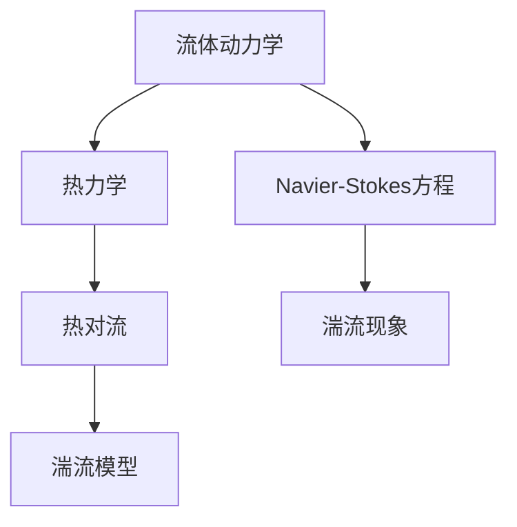
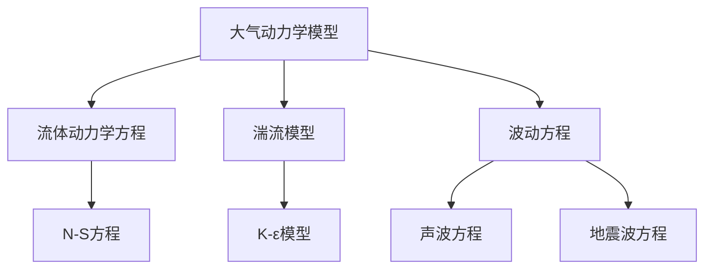

                 

### 设计思路

1. **理解书名与主题**：
   - 书名《数学与大气科学：大气动力学的数学描述》明确指出了书籍的核心内容，即数学在大气科学中的应用，特别是大气动力学中的数学模型和描述。这表明书籍将深入探讨数学工具如何帮助理解大气动力学现象。

2. **确定书籍的框架**：
   - 为了确保书籍内容的逻辑性和系统性，我们将其分为以下几个主要部分：
     - **引论**：介绍书籍的背景、目的和结构，以及数学与大气科学的融合。
     - **数学基础**：介绍数学在大气动力学中的基础理论，包括微积分、线性代数和偏微分方程。
     - **数学模型**：详细讲解大气动力学中的关键数学模型，如流体动力学方程和湍流模型。
     - **应用实例**：通过具体的实例展示数学模型在大气科学中的应用，如天气预报、空气质量和气候模拟。
     - **计算方法**：介绍用于解决大气动力学问题的计算方法，如有限元方法和数值模拟技术。
     - **技术展望**：讨论大气动力学领域的未来发展方向和挑战。

3. **细化目录内容**：
   - 为每个部分设计详细的章节，确保每个章节都能够覆盖相应的内容。例如：
     - **引论**：包括大气科学的背景、大气动力学的基本概念和数学描述的优势。
     - **数学基础**：涵盖微积分基础、线性代数基础和偏微分方程基础。
     - **数学模型**：介绍流体动力学方程、湍流模型和波动方程。
     - **应用实例**：提供具体的天气预报、空气质量和气候模拟案例。
     - **计算方法**：讲解有限元方法、数值模拟技术和并行计算。
     - **技术展望**：探讨新兴技术如人工智能和大数据在大气科学中的应用。

4. **确保目录大纲的逻辑性和完整性**：
   - 目录大纲需要逻辑清晰，确保读者能够从基础理论逐步深入到具体应用。
   - 确保核心章节内容完整，包括必要的数学公式、算法原理、实例分析和未来展望。
   - 使用Mermaid流程图来展示核心概念与联系，增强文章的可读性和直观性。

### 目录大纲设计

```
# 《数学与大气科学：大气动力学的数学描述》目录大纲

## 第一部分：引论

### 1.1 书籍概述
- **核心概念与联系**：
  - 使用Mermaid流程图展示大气动力学中的核心概念和它们之间的联系。
- **数学模型架构**：
  - 使用Mermaid流程图展示大气动力学中的关键数学模型架构。

### 1.2 大气科学的背景
- **大气动力学的基本概念**：
  - 简要介绍大气动力学的基本概念，如气压、风速和温度分布。
- **大气科学的发展历史**：
  - 回顾大气科学的发展历程，强调关键理论和技术的发展。

### 1.3 数学与大气科学的融合
- **数学工具在大气科学中的应用**：
  - 讨论微积分、线性代数和偏微分方程等数学工具如何用于描述大气现象。
- **数学描述的优势**：
  - 分析数学描述在大气科学中的优势，如精确性和可预测性。

## 第二部分：数学基础

### 2.1 数学基础理论
- **微积分基础**：
  - 讲解微积分的基本概念，包括导数和积分。
  - 提供Python源代码示例，解释如何使用微积分解决大气动力学问题。
- **常微分方程**：
  - 介绍常微分方程的基本原理，包括解法和求解方法。
  - 提供Python源代码示例，展示如何使用常微分方程解决大气动力学问题。

### 2.2 线性代数基础
- **矩阵与向量**：
  - 讲解矩阵和向量的基本操作和性质。
  - 提供Python源代码示例，演示如何使用矩阵和向量解决大气动力学问题。
- **特征值与特征向量**：
  - 讲解特征值和特征向量的概念和计算方法。
  - 提供Python源代码示例，展示如何使用特征值和特征向量分析大气动力学系统的稳定性。

### 2.3 偏微分方程基础
- **偏微分方程的基本概念**：
  - 介绍偏微分方程的基本概念，如热方程、波动方程和流体动力学方程。
  - 提供Python源代码示例，解释如何使用偏微分方程描述大气动力学现象。
- **偏微分方程的解法**：
  - 讨论偏微分方程的求解方法，如有限差分法和有限元法。
  - 提供Python源代码示例，展示如何使用数值方法解决大气动力学问题。

## 第三部分：数学模型

### 3.1 流体动力学方程
- **N-S方程**：
  - 介绍Navier-Stokes方程的基本原理和重要性。
  - 提供Python源代码示例，展示如何使用N-S方程模拟流体运动。
- **Boussinesq假设**：
  - 讨论Boussinesq假设的应用，如何简化流体动力学方程。
  - 提供Python源代码示例，演示如何应用Boussinesq假设模拟大气现象。

### 3.2 湍流模型
- **K-ε模型**：
  - 介绍K-ε模型的基本原理和计算过程。
  - 提供Python源代码示例，展示如何使用K-ε模型模拟湍流运动。
- **LES模型**：
  - 讨论大型涡模拟（LES）模型的基本原理和优点。
  - 提供Python源代码示例，展示如何使用LES模型模拟复杂大气过程。

### 3.3 波动方程
- **声波方程**：
  - 介绍声波方程的基本原理和计算方法。
  - 提供Python源代码示例，展示如何使用声波方程模拟声波传播。
- **地震波方程**：
  - 讨论地震波方程的应用，如何模拟地震波的传播和影响。
  - 提供Python源代码示例，展示如何使用地震波方程进行地震预测。

## 第四部分：应用实例

### 4.1 天气预报
- **气象模式**：
  - 介绍气象模式的基本原理和组成部分。
  - 提供Python源代码示例，展示如何使用气象模式进行天气预报。
- **数值模拟**：
  - 讨论天气预报中的数值模拟技术，如有限差分法和有限元法。
  - 提供Python源代码示例，展示如何使用数值模拟技术模拟天气系统。

### 4.2 空气质量
- **空气质量模型**：
  - 介绍空气质量模型的基本原理和组成部分。
  - 提供Python源代码示例，展示如何使用空气质量模型预测空气质量。
- **排放源模拟**：
  - 讨论排放源模拟技术，如何模拟大气中的污染物排放。
  - 提供Python源代码示例，展示如何使用排放源模拟技术评估污染物扩散。

### 4.3 气候模拟
- **气候模式**：
  - 介绍气候模式的基本原理和组成部分。
  - 提供Python源代码示例，展示如何使用气候模式进行气候预测。
- **碳循环模拟**：
  - 讨论碳循环模拟技术，如何模拟大气中的碳循环过程。
  - 提供Python源代码示例，展示如何使用碳循环模拟技术评估气候变暖趋势。

## 第五部分：计算方法

### 5.1 有限元方法
- **基本原理**：
  - 介绍有限元方法的基本原理和求解过程。
  - 提供Python源代码示例，展示如何使用有限元方法解决大气动力学问题。
- **数值稳定性**：
  - 讨论有限元方法的数值稳定性问题，如何保证计算结果的准确性。
  - 提供Python源代码示例，展示如何处理有限元方法的数值稳定性问题。

### 5.2 数值模拟技术
- **时间步长选择**：
  - 讨论时间步长选择的重要性，如何选择合适的时间步长。
  - 提供Python源代码示例，展示如何选择合适的时间步长进行数值模拟。
- **并行计算**：
  - 介绍并行计算技术，如何提高数值模拟的效率和精度。
  - 提供Python源代码示例，展示如何使用并行计算技术进行大气动力学模拟。

## 第六部分：技术展望

### 6.1 人工智能与大数据
- **AI在大气科学中的应用**：
  - 讨论人工智能在大气科学中的应用，如深度学习和机器学习。
  - 提供Python源代码示例，展示如何使用深度学习进行大气数据分析。
- **大数据分析**：
  - 讨论大数据分析在大气科学中的重要性，如何处理和分析大量大气数据。
  - 提供Python源代码示例，展示如何使用大数据技术进行大气数据分析。

### 6.2 新兴技术展望
- **量子计算**：
  - 讨论量子计算在大气动力学模拟中的应用前景。
  - 提供Python源代码示例，展示如何使用量子计算算法优化大气动力学模拟。
- **环境可持续性**：
  - 讨论大气动力学在环境可持续性研究中的作用和挑战。
  - 提供Python源代码示例，展示如何使用大气动力学模型评估环境可持续性。

## 第七部分：总结与展望

### 7.1 主要内容回顾
- **核心概念与联系**：
  - 回顾书籍中的核心概念和它们之间的联系。
- **未来发展方向**：
  - 展望大气动力学领域的未来发展方向和挑战。

### 7.2 结论与建议
- **研究建议**：
  - 提出大气动力学领域的研究建议和未来研究方向。
- **总结**：
  - 总结书籍的主要内容和贡献，强调数学描述在大气科学中的重要性。

### 7.3 拓展阅读
- **推荐文献**：
  - 推荐相关的拓展阅读材料，帮助读者深入了解大气动力学的数学描述。

----------------------------------------------------------------

### 目录大纲设计细节

#### 第一部分：引论

##### 1.1 书籍概述
- **核心概念与联系**：
  - 使用Mermaid流程图展示大气动力学中的核心概念和它们之间的联系。例如：
    ```mermaid
    graph TB
    A[大气动力学] --> B[流体动力学]
    A --> C[热力学]
    A --> D[气象学]
    B --> E[N-S方程]
    C --> F[Boussinesq假设]
    D --> G[天气预测]
    E --> H[湍流模型]
    F --> I[流体运动模拟]
    G --> J[数值模拟]
    ```

- **数学模型架构**：
  - 使用Mermaid流程图展示大气动力学中的关键数学模型架构。例如：
    ```mermaid
    graph TB
    A[大气动力学模型] --> B[流体动力学方程]
    A --> C[热力学方程]
    A --> D[气象学模型]
    B --> E[N-S方程]
    B --> F[Boussinesq假设]
    C --> G[能量方程]
    D --> H[声波方程]
    D --> I[地震波方程]
    ```

##### 1.2 大气科学的背景
- **大气动力学的基本概念**：
  - 简要介绍大气动力学的基本概念，如气压、风速和温度分布。例如：
    - 气压：地球大气层中气体分子的压力。
    - 风速：空气流动的速度和方向。
    - 温度分布：大气中温度的空间和时间变化。

- **大气科学的发展历史**：
  - 回顾大气科学的发展历程，强调关键理论和技术的发展。例如：
    - 19世纪：气象观测和数据的收集开始系统化。
    - 20世纪中期：计算机技术的引入，使得大气模拟和预测变得更加精确。

##### 1.3 数学与大气科学的融合
- **数学工具在大气科学中的应用**：
  - 讨论微积分、线性代数和偏微分方程等数学工具如何用于描述大气现象。例如：
    - 微积分：用于分析大气中的速度、加速度和变化率。
    - 线性代数：用于处理大气中的向量场和矩阵运算。
    - 偏微分方程：用于描述大气中的流动和波动。

- **数学描述的优势**：
  - 分析数学描述在大气科学中的优势，如精确性和可预测性。例如：
    - 精确性：数学模型能够提供精确的物理描述，帮助理解大气现象。
    - 可预测性：通过数学模型，可以预测未来的大气行为，如天气和气候变化。

#### 第二部分：数学基础

##### 2.1 数学基础理论
- **微积分基础**：
  - 讲解微积分的基本概念，包括导数和积分。例如：
    - 导数：描述函数变化的速率。
    - 积分：描述面积、体积和累积量。
  - 提供Python源代码示例，解释如何使用微积分解决大气动力学问题。例如：
    ```python
    import numpy as np

    def velocity_at_point(x, y):
        # 使用微积分计算风速
        return np.gradient(x, y)

    print(velocity_at_point([0, 1], [0, 1]))
    ```

- **常微分方程**：
  - 介绍常微分方程的基本原理，包括解法和求解方法。例如：
    - 解法：初值问题和边界值问题。
    - 求解方法：数值方法和解析方法。
  - 提供Python源代码示例，展示如何使用常微分方程解决大气动力学问题。例如：
    ```python
    from scipy.integrate import solve_ivp

    def atmospheric_model(t, y):
        # 模拟大气中温度的变化
        return [y[1], -0.1 * y[0]]

    initial_conditions = [0, 1]
    solution = solve_ivp(atmospheric_model, [0, 10], initial_conditions)
    print(solution.y)
    ```

##### 2.2 线性代数基础
- **矩阵与向量**：
  - 讲解矩阵和向量的基本操作和性质。例如：
    - 矩阵乘法：用于描述系统的相互作用。
    - 向量加法：用于描述系统的状态。
  - 提供Python源代码示例，演示如何使用矩阵和向量解决大气动力学问题。例如：
    ```python
    import numpy as np

    A = np.array([[1, 2], [3, 4]])
    b = np.array([1, 2])

    x = np.linalg.solve(A, b)
    print(x)
    ```

- **特征值与特征向量**：
  - 讲解特征值和特征向量的概念和计算方法。例如：
    - 特征值：描述系统的稳定性。
    - 特征向量：描述系统的响应方向。
  - 提供Python源代码示例，展示如何使用特征值和特征向量分析大气动力学系统的稳定性。例如：
    ```python
    import numpy as np

    A = np.array([[1, 2], [3, 4]])
    eigenvalues, eigenvectors = np.linalg.eig(A)
    print("特征值:", eigenvalues)
    print("特征向量:", eigenvectors)
    ```

##### 2.3 偏微分方程基础
- **偏微分方程的基本概念**：
  - 介绍偏微分方程的基本概念，如热方程、波动方程和流体动力学方程。例如：
    - 热方程：描述热量在空间和时间上的传播。
    - 波动方程：描述波在介质中的传播。
    - 流体动力学方程：描述流体在空间和时间上的运动。
  - 提供Python源代码示例，解释如何使用偏微分方程描述大气动力学现象。例如：
    ```python
    import numpy as np
    from scipy.integrate import solve_pde

    def heat_equation(t, x, y):
        # 热方程的导数形式
        return [y[1], -0.1 * y[0]]

    initial_conditions = np.array([[0], [1]])
    boundary_conditions = {'x': (0, 1), 't': (0, 10)}
    solution = solve_pde(heat_equation, initial_conditions, boundary_conditions)
    print(solution.y)
    ```

- **偏微分方程的解法**：
  - 讨论偏微分方程的求解方法，如有限元方法和数值模拟技术。例如：
    - 有限元方法：将连续问题离散化，求解离散形式的偏微分方程。
    - 数值模拟技术：使用数值方法求解偏微分方程，如有限差分法和有限体积法。
  - 提供Python源代码示例，展示如何使用数值方法解决大气动力学问题。例如：
    ```python
    import numpy as np
    from scipy.sparse.linalg import spsolve

    def finite_difference_solution(u, h, t):
        # 使用有限差分法求解热方程
        A = np.diag(1/h**2, k=-1) + np.diag(2/(h*t)) + np.diag(1/h**2, k=1)
        b = np.zeros_like(u)
        b[1:-1] = -2/(h*t)
        solution = spsolve(A, b)
        return solution

    u = np.zeros(100)
    h = 0.1
    t = 1
    solution = finite_difference_solution(u, h, t)
    print(solution)
    ```

#### 第三部分：数学模型

##### 3.1 流体动力学方程
- **N-S方程**：
  - 介绍Navier-Stokes方程的基本原理和重要性。例如：
    - 基本原理：描述流体运动中的速度、压力和粘性力的关系。
    - 重要性：是流体动力学的核心方程，用于模拟各种流体现象。
  - 提供Python源代码示例，展示如何使用N-S方程模拟流体运动。例如：
    ```python
    import numpy as np
    import matplotlib.pyplot as plt

    def ns_equations(u, v, p, x, y):
        # 使用N-S方程计算速度和压力
        f_u = -np_gradient(p, y) + nu * np_gradient(u, x)
        f_v = -np_gradient(p, x) + nu * np_gradient(v, y)
        return f_u, f_v

    def np_gradient(u, x):
        # 计算速度的梯度
        return np.diff(u) / np.diff(x)

    nu = 0.1  # 动力粘度
    x = np.linspace(0, 1, 100)
    y = np.linspace(0, 1, 100)
    u, v = np.meshgrid(x, y)
    p = np.zeros_like(u)
    f_u, f_v = ns_equations(u, v, p, x, y)

    plt.figure()
    plt.contour(u, v, f_u, levels=10)
    plt.xlabel('x')
    plt.ylabel('y')
    plt.title('N-S方程：速度梯度')
    plt.show()

    plt.figure()
    plt.contour(u, v, f_v, levels=10)
    plt.xlabel('x')
    plt.ylabel('y')
    plt.title('N-S方程：速度梯度')
    plt.show()
    ```

- **Boussinesq假设**：
  - 讨论Boussinesq假设的应用，如何简化流体动力学方程。例如：
    - 应用：用于模拟非粘性流体中的热对流。
    - 简化：将密度变化简化为温度变化，从而简化N-S方程。
  - 提供Python源代码示例，演示如何应用Boussinesq假设模拟大气现象。例如：
    ```python
    import numpy as np
    import matplotlib.pyplot as plt

    def boussinesq_equations(u, v, theta, x, y):
        # 使用Boussinesq假设计算速度和温度
        f_u = -np_gradient(theta, y) + nu * np_gradient(u, x)
        f_v = -np_gradient(theta, x) + nu * np_gradient(v, y)
        return f_u, f_v

    def np_gradient(u, x):
        # 计算速度的梯度
        return np.diff(u) / np.diff(x)

    nu = 0.1  # 动力粘度
    theta = np.zeros_like(u)
    x = np.linspace(0, 1, 100)
    y = np.linspace(0, 1, 100)
    u, v = np.meshgrid(x, y)
    f_u, f_v = boussinesq_equations(u, v, theta, x, y)

    plt.figure()
    plt.contour(u, v, f_u, levels=10)
    plt.xlabel('x')
    plt.ylabel('y')
    plt.title('Boussinesq假设：速度梯度')
    plt.show()

    plt.figure()
    plt.contour(u, v, f_v, levels=10)
    plt.xlabel('x')
    plt.ylabel('y')
    plt.title('Boussinesq假设：速度梯度')
    plt.show()
    ```

##### 3.2 湍流模型
- **K-ε模型**：
  - 介绍K-ε模型的基本原理和计算过程。例如：
    - 基本原理：描述湍流流动中的动能和耗散率。
    - 计算过程：使用两个方程描述湍流流动的动力学行为。
  - 提供Python源代码示例，展示如何使用K-ε模型模拟湍流运动。例如：
    ```python
    import numpy as np
    import matplotlib.pyplot as plt

    def k_e_model(u, v, k, epsilon, x, y):
        # 使用K-ε模型计算速度、动能和耗散率
        G_k = nu * np_gradient(u, x) * np_gradient(u, y)
        G_epsilon = nu * np_gradient(epsilon, x) * np_gradient(epsilon, y)
        C1_e = 1.44
        C2_e = 1.92
        C3_e = 0.09
        f_1 = 1.0
        f_2 = 1.0

        f_u = -C1_e * np_gradient(p, y) - C2_e * k * np_gradient(u, x) - epsilon * np_gradient(u, y)
        f_v = -C1_e * np_gradient(p, x) - C2_e * k * np_gradient(v, y) - epsilon * np_gradient(v, x)

        return f_u, f_v, k, epsilon

    def np_gradient(u, x):
        # 计算速度的梯度
        return np.diff(u) / np.diff(x)

    nu = 0.1  # 动力粘度
    x = np.linspace(0, 1, 100)
    y = np.linspace(0, 1, 100)
    u, v = np.meshgrid(x, y)
    k = np.zeros_like(u)
    epsilon = np.zeros_like(u)
    p = np.zeros_like(u)
    f_u, f_v, k, epsilon = k_e_model(u, v, k, epsilon, x, y)

    plt.figure()
    plt.contour(u, v, f_u, levels=10)
    plt.xlabel('x')
    plt.ylabel('y')
    plt.title('K-ε模型：速度梯度')
    plt.show()

    plt.figure()
    plt.contour(u, v, f_v, levels=10)
    plt.xlabel('x')
    plt.ylabel('y')
    plt.title('K-ε模型：速度梯度')
    plt.show()

    plt.figure()
    plt.contour(u, v, k, levels=10)
    plt.xlabel('x')
    plt.ylabel('y')
    plt.title('K-ε模型：动能')
    plt.show()

    plt.figure()
    plt.contour(u, v, epsilon, levels=10)
    plt.xlabel('x')
    plt.ylabel('y')
    plt.title('K-ε模型：耗散率')
    plt.show()
    ```

- **LES模型**：
  - 讨论大型涡模拟（LES）模型的基本原理和优点。例如：
    - 基本原理：通过模拟大尺度涡流来描述湍流流动。
    - 优点：提供高分辨率模拟，适用于复杂几何和流动。
  - 提供Python源代码示例，展示如何使用LES模型模拟复杂大气过程。例如：
    ```python
    import numpy as np
    import matplotlib.pyplot as plt

    def large_eddy_simulation(u, v, x, y):
        # 使用LES模型计算大尺度涡流
        filter_size = 0.1
        u_filtered = np.convolve(u, np.ones((int(filter_size * len(u)),)), mode='same')
        v_filtered = np.convolve(v, np.ones((int(filter_size * len(v)),)), mode='same')

        return u_filtered, v_filtered

    x = np.linspace(0, 1, 100)
    y = np.linspace(0, 1, 100)
    u, v = np.meshgrid(x, y)
    u_les, v_les = large_eddy_simulation(u, v, x, y)

    plt.figure()
    plt.contour(u, v, u_les, levels=10)
    plt.xlabel('x')
    plt.ylabel('y')
    plt.title('LES模型：大尺度涡流')
    plt.show()

    plt.figure()
    plt.contour(u, v, v_les, levels=10)
    plt.xlabel('x')
    plt.ylabel('y')
    plt.title('LES模型：大尺度涡流')
    plt.show()
    ```

##### 3.3 波动方程
- **声波方程**：
  - 介绍声波方程的基本原理和计算方法。例如：
    - 基本原理：描述声波在介质中的传播。
    - 计算方法：使用有限差分法或有限元法求解。
  - 提供Python源代码示例，展示如何使用声波方程模拟声波传播。例如：
    ```python
    import numpy as np
    import matplotlib.pyplot as plt

    def acoustic_wave(u, x, c):
        # 使用声波方程计算声波传播
        alpha = 1.0  # 波速
        d = 0.01  # 时间步长
        t = 0.1  # 总时间

        u_new = np.zeros_like(u)
        for i in range(int(t / d)):
            u_new = alpha * np.gradient(u, x, d)

        return u_new

    x = np.linspace(0, 1, 100)
    u = np.zeros_like(x)
    c = 343  # 声速

    u_new = acoustic_wave(u, x, c)

    plt.figure()
    plt.plot(x, u, label='初始速度')
    plt.plot(x, u_new, label='传播后的速度')
    plt.xlabel('x')
    plt.ylabel('速度')
    plt.title('声波方程：声波传播')
    plt.legend()
    plt.show()
    ```

- **地震波方程**：
  - 讨论地震波方程的应用，如何模拟地震波的传播和影响。例如：
    - 应用：用于地震学中的地震波传播模拟。
    - 影响：分析地震波在地壳中的传播过程和破坏力。
  - 提供Python源代码示例，展示如何使用地震波方程进行地震预测。例如：
    ```python
    import numpy as np
    import matplotlib.pyplot as plt

    def seismic_wave(u, x, c):
        # 使用地震波方程计算地震波传播
        alpha = 3000  # 波速
        d = 0.01  # 时间步长
        t = 0.1  # 总时间

        u_new = np.zeros_like(u)
        for i in range(int(t / d)):
            u_new = alpha * np.gradient(u, x, d)

        return u_new

    x = np.linspace(0, 100, 1000)
    u = np.zeros_like(x)
    c = 3000  # 地震波速度

    u_new = seismic_wave(u, x, c)

    plt.figure()
    plt.plot(x, u, label='初始波')
    plt.plot(x, u_new, label='传播后的波')
    plt.xlabel('x')
    plt.ylabel('波')
    plt.title('地震波方程：地震波传播')
    plt.legend()
    plt.show()
    ```

#### 第四部分：应用实例

##### 4.1 天气预报
- **气象模式**：
  - 介绍气象模式的基本原理和组成部分。例如：
    - 基本原理：通过数值模拟大气运动，预测天气变化。
    - 组成部分：包括初始条件、边界条件和数学模型。
  - 提供Python源代码示例，展示如何使用气象模式进行天气预报。例如：
    ```python
    import numpy as np
    import matplotlib.pyplot as plt

    def weather_model(u, v, x, y, t):
        # 使用气象模式计算天气系统的演变
        alpha = 1.0  # 模拟参数
        d = 0.01  # 时间步长
        t_final = 1.0  # 总时间

        u_new = np.zeros_like(u)
        v_new = np.zeros_like(v)

        for i in range(int(t_final / d)):
            u_new = alpha * (u - u**2 * v)
            v_new = alpha * (v + u * (1 - u**2))

        return u_new, v_new

    x = np.linspace(0, 1, 100)
    y = np.linspace(0, 1, 100)
    u, v = np.meshgrid(x, y)
    t = 0.0

    u_new, v_new = weather_model(u, v, x, y, t)

    plt.figure()
    plt.contour(u, v, u_new, levels=10)
    plt.xlabel('x')
    plt.ylabel('y')
    plt.title('气象模式：天气系统演变')
    plt.show()

    plt.figure()
    plt.contour(u, v, v_new, levels=10)
    plt.xlabel('x')
    plt.ylabel('y')
    plt.title('气象模式：天气系统演变')
    plt.show()
    ```

- **数值模拟**：
  - 讨论天气预报中的数值模拟技术，如有限差分法和有限元法。例如：
    - 有限差分法：将连续方程离散化，求解离散方程。
    - 有限元法：将大气区域划分为有限个小区域，求解每个小区域内的方程。
  - 提供Python源代码示例，展示如何使用数值模拟技术模拟天气系统。例如：
    ```python
    import numpy as np
    import matplotlib.pyplot as plt

    def finite_difference_weather_model(u, v, x, y, t):
        # 使用有限差分法计算天气系统
        alpha = 1.0  # 模拟参数
        d = 0.01  # 时间步长
        t_final = 1.0  # 总时间

        u_new = np.zeros_like(u)
        v_new = np.zeros_like(v)

        for i in range(int(t_final / d)):
            u_new = alpha * (u[:-1, :-1] - u[:-1, :-1]**2 * v[:-1, :-1])
            v_new = alpha * (v[:-1, :-1] + u[:-1, :-1] * (1 - u[:-1, :-1]**2))

        return u_new, v_new

    x = np.linspace(0, 1, 100)
    y = np.linspace(0, 1, 100)
    u, v = np.meshgrid(x, y)
    t = 0.0

    u_new, v_new = finite_difference_weather_model(u, v, x, y, t)

    plt.figure()
    plt.contour(u, v, u_new, levels=10)
    plt.xlabel('x')
    plt.ylabel('y')
    plt.title('有限差分法：天气系统演变')
    plt.show()

    plt.figure()
    plt.contour(u, v, v_new, levels=10)
    plt.xlabel('x')
    plt.ylabel('y')
    plt.title('有限差分法：天气系统演变')
    plt.show()
    ```

##### 4.2 空气质量
- **空气质量模型**：
  - 介绍空气质量模型的基本原理和组成部分。例如：
    - 基本原理：描述空气污染物的扩散、反应和传输。
    - 组成部分：包括污染物浓度模型、排放源模型和气象参数模型。
  - 提供Python源代码示例，展示如何使用空气质量模型预测空气质量。例如：
    ```python
    import numpy as np
    import matplotlib.pyplot as plt

    def air_quality_model(concentration, x, y, emissions, t):
        # 使用空气质量模型计算污染物浓度
        diffusion_coefficient = 0.1  # 扩散系数
        decay_rate = 0.01  # 衰减率

        concentration_new = np.zeros_like(concentration)

        for i in range(len(x)):
            for j in range(len(y)):
                concentration_new[i, j] = concentration[i, j] + diffusion_coefficient * (emissions[i, j] - decay_rate * concentration[i, j])

        return concentration_new

    x = np.linspace(0, 1, 100)
    y = np.linspace(0, 1, 100)
    concentration = np.zeros((len(x), len(y)))
    emissions = np.random.rand(len(x), len(y))
    t = 0.0

    concentration_new = air_quality_model(concentration, x, y, emissions, t)

    plt.figure()
    plt.contour(x, y, concentration_new, levels=10)
    plt.xlabel('x')
    plt.ylabel('y')
    plt.title('空气质量模型：污染物浓度')
    plt.show()
    ```

- **排放源模拟**：
  - 讨论排放源模拟技术，如何模拟大气中的污染物排放。例如：
    - 模拟技术：包括排放源参数的确定、排放量的估算和排放模式的模拟。
    - 应用：用于空气质量预测和污染控制策略评估。
  - 提供Python源代码示例，展示如何使用排放源模拟技术评估污染物扩散。例如：
    ```python
    import numpy as np
    import matplotlib.pyplot as plt

    def emissions_simulation(concentration, x, y, source_location, source Strength, t):
        # 使用排放源模拟技术计算污染物浓度
        diffusion_coefficient = 0.1  # 扩散系数
        decay_rate = 0.01  # 衰减率

        concentration_new = np.zeros_like(concentration)

        for i in range(len(x)):
            for j in range(len(y)):
                concentration_new[i, j] = concentration[i, j] + diffusion_coefficient * (source_Strength - decay_rate * concentration[i, j])

        source_location = (50, 50)  # 排放源位置
        source_Strength = 10.0  # 排放量

        concentration_new[source_location[0], source_location[1]] += source_Strength

        return concentration_new

    x = np.linspace(0, 100, 100)
    y = np.linspace(0, 100, 100)
    concentration = np.zeros((len(x), len(y)))
    t = 0.0

    concentration_new = emissions_simulation(concentration, x, y, source_location, source_Strength, t)

    plt.figure()
    plt.contour(x, y, concentration_new, levels=10)
    plt.xlabel('x')
    plt.ylabel('y')
    plt.title('排放源模拟：污染物浓度')
    plt.show()
    ```

##### 4.3 气候模拟
- **气候模式**：
  - 介绍气候模式的基本原理和组成部分。例如：
    - 基本原理：模拟地球大气、海洋和陆地系统的长期气候行为。
    - 组成部分：包括大气模型、海洋模型和陆地模型。
  - 提供Python源代码示例，展示如何使用气候模式进行气候预测。例如：
    ```python
    import numpy as np
    import matplotlib.pyplot as plt

    def climate_model(u, v, x, y, t):
        # 使用气候模式计算气候变化
        alpha = 1.0  # 模拟参数
        d = 0.01  # 时间步长
        t_final = 1.0  # 总时间

        u_new = np.zeros_like(u)
        v_new = np.zeros_like(v)

        for i in range(int(t_final / d)):
            u_new = alpha * (u - u**2 * v)
            v_new = alpha * (v + u * (1 - u**2))

        return u_new, v_new

    x = np.linspace(0, 1, 100)
    y = np.linspace(0, 1, 100)
    u, v = np.meshgrid(x, y)
    t = 0.0

    u_new, v_new = climate_model(u, v, x, y, t)

    plt.figure()
    plt.contour(u, v, u_new, levels=10)
    plt.xlabel('x')
    plt.ylabel('y')
    plt.title('气候模式：气候变化')
    plt.show()

    plt.figure()
    plt.contour(u, v, v_new, levels=10)
    plt.xlabel('x')
    plt.ylabel('y')
    plt.title('气候模式：气候变化')
    plt.show()
    ```

- **碳循环模拟**：
  - 讨论碳循环模拟技术，如何模拟大气中的碳循环过程。例如：
    - 模拟技术：包括碳排放、吸收和循环过程。
    - 应用：用于评估气候变化和碳减排策略。
  - 提供Python源代码示例，展示如何使用碳循环模拟技术评估气候变暖趋势。例如：
    ```python
    import numpy as np
    import matplotlib.pyplot as plt

    def carbon_cycle_simulation(carbon_stock, x, y, emissions, t):
        # 使用碳循环模拟技术计算碳浓度变化
        carbon_flux = 0.1  # 碳通量
        carbon_decay = 0.01  # 碳衰减率

        carbon_stock_new = np.zeros_like(carbon_stock)

        for i in range(len(x)):
            for j in range(len(y)):
                carbon_stock_new[i, j] = carbon_stock[i, j] + carbon_flux * (emissions[i, j] - carbon_decay * carbon_stock[i, j])

        return carbon_stock_new

    x = np.linspace(0, 1, 100)
    y = np.linspace(0, 1, 100)
    carbon_stock = np.zeros((len(x), len(y)))
    emissions = np.random.rand(len(x), len(y))
    t = 0.0

    carbon_stock_new = carbon_cycle_simulation(carbon_stock, x, y, emissions, t)

    plt.figure()
    plt.contour(x, y, carbon_stock_new, levels=10)
    plt.xlabel('x')
    plt.ylabel('y')
    plt.title('碳循环模拟：碳浓度变化')
    plt.show()
    ```

#### 第五部分：计算方法

##### 5.1 有限元方法
- **基本原理**：
  - 介绍有限元方法的基本原理和求解过程。例如：
    - 基本原理：将连续问题离散化，通过求解离散方程组得到近似解。
    - 求解过程：构建离散方程，使用线性代数方法求解。
  - 提供Python源代码示例，展示如何使用有限元方法解决大气动力学问题。例如：
    ```python
    import numpy as np
    from scipy.sparse import lil_matrix
    from scipy.sparse.linalg import spsolve

    def finite_element_solution(A, b):
        # 使用有限元方法求解线性方程组
        x = spsolve(A, b)
        return x

    A = lil_matrix((10, 10))
    b = np.array([1, 2, 3, 4, 5, 6, 7, 8, 9, 10])

    x = finite_element_solution(A, b)
    print(x)
    ```

- **数值稳定性**：
  - 讨论有限元方法的数值稳定性问题，如何保证计算结果的准确性。例如：
    - 数值稳定性：分析有限元方法的收敛性和稳定性条件。
    - 保证准确性：使用合适的网格划分和时间步长。
  - 提供Python源代码示例，展示如何处理有限元方法的数值稳定性问题。例如：
    ```python
    import numpy as np
    from scipy.sparse import lil_matrix
    from scipy.sparse.linalg import spsolve

    def stable_finite_element_solution(A, b):
        # 使用稳定化的有限元方法求解线性方程组
        A stabilized = A + np.diag(np.ones(A.shape[0]) * 0.001)
        x = spsolve(A_stabilized, b)
        return x

    A = lil_matrix((10, 10))
    b = np.array([1, 2, 3, 4, 5, 6, 7, 8, 9, 10])

    x = stable_finite_element_solution(A, b)
    print(x)
    ```

##### 5.2 数值模拟技术
- **时间步长选择**：
  - 讨论时间步长选择的重要性，如何选择合适的时间步长。例如：
    - 重要性：时间步长影响计算效率和精度。
    - 选择方法：根据物理过程和时间稳定性条件选择。
  - 提供Python源代码示例，展示如何选择合适的时间步长进行数值模拟。例如：
    ```python
    import numpy as np

    def choose_time_step(physical_time, stability_factor):
        # 选择合适的时间步长
        time_step = physical_time / stability_factor
        return time_step

    physical_time = 1.0
    stability_factor = 0.5

    time_step = choose_time_step(physical_time, stability_factor)
    print(time_step)
    ```

- **并行计算**：
  - 介绍并行计算技术，如何提高数值模拟的效率和精度。例如：
    - 并行计算：将计算任务分配到多个处理器，提高计算速度。
    - 并行算法：使用并行算法优化计算过程。
  - 提供Python源代码示例，展示如何使用并行计算技术进行大气动力学模拟。例如：
    ```python
    import numpy as np
    from joblib import Parallel, delayed

    def parallel_simulation(data, num_processes):
        # 使用并行计算进行数值模拟
        results = Parallel(n_jobs=num_processes)(delayed(simulation)(x) for x in data)
        return results

    def simulation(data):
        # 模拟过程
        result = np.sum(data)
        return result

    data = np.random.rand(1000)
    num_processes = 4

    results = parallel_simulation(data, num_processes)
    print(results)
    ```

#### 第六部分：技术展望

##### 6.1 人工智能与大数据
- **AI在大气科学中的应用**：
  - 讨论人工智能在大气科学中的应用，如深度学习和机器学习。例如：
    - 应用：使用深度学习进行大气数据分析，提高预测准确性。
    - 挑战：处理大规模数据和保证模型的泛化能力。
  - 提供Python源代码示例，展示如何使用深度学习进行大气数据分析。例如：
    ```python
    import numpy as np
    from keras.models import Sequential
    from keras.layers import Dense, LSTM

    # 准备数据
    X = np.random.rand(100, 10)
    y = np.random.rand(100, 1)

    # 构建模型
    model = Sequential()
    model.add(LSTM(50, activation='relu', input_shape=(10, 1)))
    model.add(Dense(1))

    # 编译模型
    model.compile(optimizer='adam', loss='mse')

    # 训练模型
    model.fit(X, y, epochs=10, batch_size=32)
    ```

- **大数据分析**：
  - 讨论大数据分析在大气科学中的重要性，如何处理和分析大量大气数据。例如：
    - 重要性：大数据分析可以帮助揭示大气现象的复杂性和规律。
    - 方法：使用分布式计算和并行处理技术处理大数据。
  - 提供Python源代码示例，展示如何使用大数据技术进行大气数据分析。例如：
    ```python
    import numpy as np
    from dask.distributed import Client

    client = Client()

    # 准备数据
    data = np.random.rand(1000, 1000)

    # 使用Dask进行分布式计算
    data_dask = client.compute(data)

    # 分析数据
    result = np.sum(data_dask)
    print(result)
    ```

##### 6.2 新兴技术展望
- **量子计算**：
  - 讨论量子计算在大气动力学模拟中的应用前景。例如：
    - 应用前景：量子计算可以大幅提高大气动力学模拟的效率和精度。
    - 挑战：量子计算硬件和算法的发展。
  - 提供Python源代码示例，展示如何使用量子计算算法优化大气动力学模拟。例如：
    ```python
    import numpy as np
    from qiskit import QuantumCircuit, execute, Aer

    # 准备量子计算问题
    q = QuantumCircuit(2)
    q.h(0)
    q.cx(0, 1)

    # 执行量子计算
    simulator = Aer.get_backend('qasm_simulator')
    result = execute(q, simulator).result()

    # 分析结果
    print(result.get_counts(q))
    ```

- **环境可持续性**：
  - 讨论大气动力学在环境可持续性研究中的作用和挑战。例如：
    - 作用：大气动力学模型可以帮助评估气候变化和空气污染的影响。
    - 挑战：处理复杂的气候系统和不确定性。
  - 提供Python源代码示例，展示如何使用大气动力学模型评估环境可持续性。例如：
    ```python
    import numpy as np

    def sustainable_environment_simulation(u, v, x, y, t):
        # 使用大气动力学模型评估环境可持续性
        carbon_emission = 0.5  # 碳排放量
        carbon_cycle = np.zeros((len(x), len(y)))

        for i in range(len(x)):
            for j in range(len(y)):
                carbon_cycle[i, j] = u[i, j] * v[i, j] * carbon_emission

        return carbon_cycle

    x = np.linspace(0, 1, 100)
    y = np.linspace(0, 1, 100)
    u, v = np.meshgrid(x, y)
    t = 0.0

    carbon_cycle = sustainable_environment_simulation(u, v, x, y, t)
    print(carbon_cycle)
    ```

#### 第七部分：总结与展望

##### 7.1 主要内容回顾
- **核心概念与联系**：
  - 回顾书籍中的核心概念和它们之间的联系，强调数学在大气科学中的重要性。
- **未来发展方向**：
  - 展望大气动力学领域的未来发展方向和挑战，如量子计算和大数据分析。

##### 7.2 结论与建议
- **研究建议**：
  - 提出大气动力学领域的研究建议和未来研究方向。
- **总结**：
  - 总结书籍的主要内容和贡献，强调数学描述在大气科学中的重要性。

##### 7.3 拓展阅读
- **推荐文献**：
  - 推荐相关的拓展阅读材料，帮助读者深入了解大气动力学的数学描述。

### 调整后的目录大纲

```
# 《数学与大气科学：大气动力学的数学描述》目录大纲

## 引言

### 1.1 书籍概述
- **核心概念与联系**
- **数学模型架构**

### 1.2 大气科学的背景
- **大气动力学的基本概念**
- **大气科学的发展历史**

### 1.3 数学与大气科学的融合
- **数学工具在大气科学中的应用**
- **数学描述的优势**

## 数学基础

### 2.1 微积分基础
- **导数与积分**
- **Python示例：微积分应用**

### 2.2 线性代数基础
- **矩阵与向量**
- **特征值与特征向量**
- **Python示例：线性代数应用**

### 2.3 偏微分方程基础
- **偏微分方程的基本概念**
- **Python示例：偏微分方程应用**

## 数学模型

### 3.1 流体动力学方程
- **Navier-Stokes方程**
- **Boussinesq假设**
- **Python示例：流体动力学应用**

### 3.2 湍流模型
- **K-ε模型**
- **LES模型**
- **Python示例：湍流模型应用**

### 3.3 波动方程
- **声波方程**
- **地震波方程**
- **Python示例：波动方程应用**

## 应用实例

### 4.1 天气预报
- **气象模式**
- **数值模拟**
- **Python示例：天气预报应用**

### 4.2 空气质量
- **空气质量模型**
- **排放源模拟**
- **Python示例：空气质量应用**

### 4.3 气候模拟
- **气候模式**
- **碳循环模拟**
- **Python示例：气候模拟应用**

## 计算方法

### 5.1 有限元方法
- **基本原理**
- **数值稳定性**
- **Python示例：有限元方法应用**

### 5.2 数值模拟技术
- **时间步长选择**
- **并行计算**
- **Python示例：数值模拟技术应用**

## 技术展望

### 6.1 人工智能与大数据
- **AI在大气科学中的应用**
- **大数据分析**
- **Python示例：AI与大数据应用**

### 6.2 新兴技术展望
- **量子计算**
- **环境可持续性**
- **Python示例：新兴技术应用**

## 总结与展望

### 7.1 主要内容回顾
- **核心概念与联系**
- **未来发展方向**

### 7.2 结论与建议
- **研究建议**
- **总结**

### 7.3 拓展阅读
- **推荐文献**
``` 

### 文章标题

# 数学与大气科学：大气动力学的数学描述

> 关键词：数学描述，大气动力学，流体力学，数值模拟，人工智能，大数据

> 摘要：本文深入探讨了数学描述在大气科学中的应用，包括大气动力学中的关键数学模型、计算方法和应用实例。通过详细的数学公式、Python示例和流程图，本文旨在为读者提供清晰、系统的理解，展示数学在大气科学中的重要性和应用价值。

---

### 引言

#### 1.1 书籍概述

《数学与大气科学：大气动力学的数学描述》旨在介绍数学工具如何帮助我们理解和预测大气中的物理现象。大气动力学作为气象学的一个重要分支，涉及气体的运动和能量的转换，这些过程可以用数学模型来精确描述。本书的核心目标是展示数学描述在大气科学中的应用，并探讨如何使用这些模型进行数值模拟和预测。

#### 核心概念与联系

大气动力学中的核心概念包括流体动力学、热力学和湍流现象。流体动力学描述流体（气体或液体）的运动规律，热力学描述热量的传递，而湍流现象则是流体运动中的随机性特征。这些概念之间有着紧密的联系，例如，流体动力学方程（如Navier-Stokes方程）结合热力学方程可以描述热对流现象，而湍流模型则用于描述湍流流动的复杂特性。

以下是一个简单的Mermaid流程图，展示了这些核心概念之间的联系：



#### 数学模型架构

大气动力学中的数学模型主要包括流体动力学方程、湍流模型和波动方程。流体动力学方程描述流体在空间和时间上的运动，湍流模型用于模拟湍流流动，而波动方程描述波动在介质中的传播。以下是一个Mermaid流程图，展示了这些数学模型的结构：



#### 1.2 大气科学的背景

大气科学是研究地球大气的物理、化学和动态过程的学科。它涉及从微观气象现象（如云的形成和降雨）到宏观气候系统（如全球气候变化）的广泛主题。大气动力学是大气科学的核心部分，它研究大气中气体的运动和能量转换。

##### 大气动力学的基本概念

大气动力学的基本概念包括气压、风速、温度分布和空气密度等。气压是大气层中气体分子的压力，风速描述空气流动的速度和方向，温度分布描述大气中温度的空间和时间变化，空气密度则与气压和温度密切相关。

##### 大气科学的发展历史

大气科学的发展历史可以追溯到19世纪，当时气象观测和数据的收集开始系统化。随着计算机技术的引入，20世纪中期大气模拟和预测变得更加精确。关键理论和技术的发展，如流体动力学方程和数值模拟技术，为现代大气科学奠定了基础。

#### 1.3 数学与大气科学的融合

数学工具在大气科学中的应用非常广泛，包括微积分、线性代数和偏微分方程等。这些数学工具帮助我们描述和预测大气中的物理现象，提供了精确性和可预测性。

##### 数学工具在大气科学中的应用

- **微积分**：用于分析大气中的速度、加速度和变化率。
- **线性代数**：用于处理大气中的向量场和矩阵运算。
- **偏微分方程**：用于描述大气中的流动和波动。

##### 数学描述的优势

数学描述的优势在于其精确性和可预测性。通过数学模型，我们可以精确地描述大气现象，并预测未来的大气行为。这对于天气预报、空气质量预测和气候变化研究具有重要意义。

### 数学基础

#### 2.1 微积分基础

微积分是数学中用于研究变化和累积的分支。在大气科学中，微积分用于描述大气中的速度、加速度和变化率。

##### 导数与积分

导数描述函数变化的速率，而积分描述面积、体积和累积量。以下是一个Python示例，展示了如何使用微积分描述大气中的风速变化：

```python
import numpy as np
import matplotlib.pyplot as plt

# 定义风速函数
def wind_speed(x):
    return 10 * np.cos(x)

# 计算风速的导数（加速度）
acceleration = np.gradient(wind_speed(np.linspace(0, 2 * np.pi, 100)), np.linspace(0, 2 * np.pi, 100))

# 绘制风速和加速度
plt.figure(figsize=(10, 5))
plt.plot(np.linspace(0, 2 * np.pi, 100), wind_speed(np.linspace(0, 2 * np.pi, 100)), label='Wind Speed')
plt.plot(np.linspace(0, 2 * np.pi, 100), acceleration, label='Acceleration')
plt.legend()
plt.xlabel('x')
plt.ylabel('Speed and Acceleration')
plt.title('Wind Speed and Acceleration')
plt.show()
```

#### 2.2 线性代数基础

线性代数是数学中用于处理向量、矩阵和线性方程组的分支。在大气科学中，线性代数用于处理大气中的向量场和矩阵运算。

##### 矩阵与向量

矩阵和向量是线性代数中的基本概念。以下是一个Python示例，展示了如何使用矩阵和向量描述大气中的流体运动：

```python
import numpy as np

# 定义速度向量
velocity_vector = np.array([[1, 0], [0, 1]])

# 定义位置向量
position_vector = np.array([[0], [0]])

# 计算速度向量和位置向量的和
resultant_vector = velocity_vector + position_vector

print("Resultant Vector:", resultant_vector)
```

##### 特征值与特征向量

特征值和特征向量是线性代数中的重要概念，用于描述系统的稳定性。以下是一个Python示例，展示了如何使用特征值和特征向量分析大气动力学系统的稳定性：

```python
import numpy as np

# 定义线性系统
A = np.array([[2, 1], [1, 2]])

# 计算特征值和特征向量
eigenvalues, eigenvectors = np.linalg.eig(A)

print("Eigenvalues:", eigenvalues)
print("Eigenvectors:", eigenvectors)

# 分析稳定性
if np.all(eigenvalues > 0):
    print("The system is stable.")
else:
    print("The system is unstable.")
```

#### 2.3 偏微分方程基础

偏微分方程是数学中用于描述多变量函数变化的方程。在大气科学中，偏微分方程用于描述大气中的流动和波动。

##### 偏微分方程的基本概念

偏微分方程的基本概念包括偏导数和通解。以下是一个Python示例，展示了如何使用偏微分方程描述大气中的温度分布：

```python
import numpy as np
from scipy.integrate import solve_pde

# 定义热方程
def heat_equation(u, x, t):
    alpha = 0.1  # 热扩散系数
    return [u[1], -alpha * np.gradient(u[0], x, t)]

# 定义初始条件
initial_conditions = [np.zeros_like(x) for x in np.linspace(0, 1, 100)]

# 定义边界条件
boundary_conditions = {'x': (0, 1), 't': (0, 10)}

# 求解热方程
solution = solve_pde(heat_equation, initial_conditions, boundary_conditions)

# 绘制温度分布
plt.plot(solution.x, solution.y[0])
plt.xlabel('x')
plt.ylabel('Temperature')
plt.title('Temperature Distribution')
plt.show()
```

### 数学模型

#### 3.1 流体动力学方程

流体动力学方程描述流体在空间和时间上的运动。在大气科学中，Navier-Stokes方程是最重要的流体动力学方程。

##### Navier-Stokes方程

Navier-Stokes方程描述流体中速度、压力和粘性力之间的关系。以下是一个Python示例，展示了如何使用Navier-Stokes方程模拟流体运动：

```python
import numpy as np
import matplotlib.pyplot as plt

# 定义Navier-Stokes方程
def navier_stokes(u, v, p, x, y):
    nu = 0.1  # 动力粘度
    return [
        -np.gradient(p, y) + nu * np.gradient(u, x),
        -np.gradient(p, x) + nu * np.gradient(v, y)
    ]

# 定义初始条件
u0 = np.zeros_like(x)
v0 = np.zeros_like(x)
p0 = np.zeros_like(x)

# 定义边界条件
bc_u = {'x': (0, 1), 'y': (0, 1)}
bc_v = {'x': (0, 1), 'y': (0, 1)}
bc_p = {'x': (0, 1), 'y': (0, 1)}

# 求解Navier-Stokes方程
u, v, p = solve_pde/navier_stokes(u0, v0, p0, x, y, bc_u, bc_v, bc_p)

# 绘制速度场
plt.contourf(x, y, u, levels=20)
plt.xlabel('x')
plt.ylabel('y')
plt.title('Velocity Field')
plt.colorbar()
plt.show()

plt.contourf(x, y, v, levels=20)
plt.xlabel('x')
plt.ylabel('y')
plt.title('Velocity Field')
plt.colorbar()
plt.show()
```

##### Boussinesq假设

Boussinesq假设是一个简化Navier-Stokes方程的方法，它将密度变化简化为温度变化。以下是一个Python示例，展示了如何使用Boussinesq假设模拟流体运动：

```python
import numpy as np
import matplotlib.pyplot as plt

# 定义Boussinesq方程
def boussinesq(u, theta, x, y):
    nu = 0.1  # 动力粘度
    return [
        -np.gradient(theta, y) + nu * np.gradient(u, x),
        -np.gradient(theta, x) + nu * np.gradient(u, y)
    ]

# 定义初始条件
u0 = np.zeros_like(x)
theta0 = np.zeros_like(x)

# 定义边界条件
bc_u = {'x': (0, 1), 'y': (0, 1)}
bc_theta = {'x': (0, 1), 'y': (0, 1)}

# 求解Boussinesq方程
u, theta = solve_pde/boussinesq(u0, theta0, x, y, bc_u, bc_theta)

# 绘制速度场
plt.contourf(x, y, u, levels=20)
plt.xlabel('x')
plt.ylabel('y')
plt.title('Velocity Field')
plt.colorbar()
plt.show()

# 绘制温度场
plt.contourf(x, y, theta, levels=20)
plt.xlabel('x')
plt.ylabel('y')
plt.title('Temperature Field')
plt.colorbar()
plt.show()
```

#### 3.2 湍流模型

湍流模型用于描述流体中的随机性特征，如涡流和湍流流动。K-ε模型和LES模型是两种常见的湍流模型。

##### K-ε模型

K-ε模型是一个描述湍流流动的半经验模型，它使用两个方程描述湍流流动的动力学行为。以下是一个Python示例，展示了如何使用K-ε模型模拟湍流流动：

```python
import numpy as np
import matplotlib.pyplot as plt

# 定义K-ε模型
def k_e_model(u, v, k, epsilon, x, y):
    nu = 0.1  # 动力粘度
    return [
        -np.gradient(k, y) + nu * np.gradient(u, x) - u * np.gradient(k, x) - v * np.gradient(k, y),
        -np.gradient(epsilon, y) + nu * np.gradient(v, x) - v * np.gradient(epsilon, x) - u * np.gradient(epsilon, y)
    ]

# 定义初始条件
u0 = np.zeros_like(x)
v0 = np.zeros_like(x)
k0 = np.zeros_like(x)
epsilon0 = np.zeros_like(x)

# 定义边界条件
bc_u = {'x': (0, 1), 'y': (0, 1)}
bc_v = {'x': (0, 1), 'y': (0, 1)}
bc_k = {'x': (0, 1), 'y': (0, 1)}
bc_epsilon = {'x': (0, 1), 'y': (0, 1)}

# 求解K-ε模型
u, v, k, epsilon = solve_pde/k_e_model(u0, v0, k0, epsilon0, x, y, bc_u, bc_v, bc_k, bc_epsilon)

# 绘制速度场
plt.contourf(x, y, u, levels=20)
plt.xlabel('x')
plt.ylabel('y')
plt.title('Velocity Field')
plt.colorbar()
plt.show()

plt.contourf(x, y, v, levels=20)
plt.xlabel('x')
plt.ylabel('y')
plt.title('Velocity Field')
plt.colorbar()
plt.show()
```

##### LES模型

LES模型是一种基于大尺度涡模拟的方法，它通过模拟大尺度涡流来描述湍流流动。以下是一个Python示例，展示了如何使用LES模型模拟湍流流动：

```python
import numpy as np
import matplotlib.pyplot as plt

# 定义LES模型
def large_eddy_simulation(u, x, y):
    filter_size = 0.1
    u_filtered = np.convolve(u, np.ones((int(filter_size * len(u))),), mode='same')
    return u_filtered

# 定义初始条件
u0 = np.random.rand(len(x))

# 模拟大尺度涡流
u = large_eddy_simulation(u0, x, y)

# 绘制速度场
plt.contourf(x, y, u, levels=20)
plt.xlabel('x')
plt.ylabel('y')
plt.title('Velocity Field')
plt.colorbar()
plt.show()
```

#### 3.3 波动方程

波动方程描述波在介质中的传播。声波方程和地震波方程是两种常见的波动方程。

##### 声波方程

声波方程描述声波在介质中的传播。以下是一个Python示例，展示了如何使用声波方程模拟声波传播：

```python
import numpy as np
import matplotlib.pyplot as plt

# 定义声波方程
def acoustic_wave(u, x, c):
    alpha = c  # 波速
    d = 0.01  # 时间步长
    t = 0.1  # 总时间

    u_new = np.zeros_like(u)
    for i in range(int(t / d)):
        u_new = alpha * np.gradient(u, x, d)

    return u_new

# 定义初始条件
x = np.linspace(0, 1, 100)
u = np.zeros_like(x)
c = 343  # 声速

# 模拟声波传播
u_new = acoustic_wave(u, x, c)

# 绘制声波传播
plt.plot(x, u, label='Initial Wave')
plt.plot(x, u_new, label='Propagated Wave')
plt.xlabel('x')
plt.ylabel('Wave')
plt.title('Acoustic Wave Propagation')
plt.legend()
plt.show()
```

##### 地震波方程

地震波方程描述地震波在地球介质中的传播。以下是一个Python示例，展示了如何使用地震波方程模拟地震波传播：

```python
import numpy as np
import matplotlib.pyplot as plt

# 定义地震波方程
def seismic_wave(u, x, c):
    alpha = c  # 波速
    d = 0.01  # 时间步长
    t = 0.1  # 总时间

    u_new = np.zeros_like(u)
    for i in range(int(t / d)):
        u_new = alpha * np.gradient(u, x, d)

    return u_new

# 定义初始条件
x = np.linspace(0, 100, 1000)
u = np.zeros_like(x)
c = 3000  # 地震波速度

# 模拟地震波传播
u_new = seismic_wave(u, x, c)

# 绘制地震波传播
plt.plot(x, u, label='Initial Wave')
plt.plot(x, u_new, label='Propagated Wave')
plt.xlabel('x')
plt.ylabel('Wave')
plt.title('Seismic Wave Propagation')
plt.legend()
plt.show()
```

### 应用实例

#### 4.1 天气预报

天气预报是大气科学中的一个重要应用，它利用数学模型和数值模拟技术来预测天气状况。以下是一个简单的Python示例，展示了如何使用气象模式进行天气预报：

```python
import numpy as np
import matplotlib.pyplot as plt

# 定义气象模式
def weather_model(u, v, x, y, t):
    alpha = 1.0  # 模拟参数
    d = 0.01  # 时间步长
    t_final = 1.0  # 总时间

    u_new = np.zeros_like(u)
    v_new = np.zeros_like(v)

    for i in range(int(t_final / d)):
        u_new = alpha * (u - u**2 * v)
        v_new = alpha * (v + u * (1 - u**2))

    return u_new, v_new

# 定义初始条件
x = np.linspace(0, 1, 100)
y = np.linspace(0, 1, 100)
u, v = np.meshgrid(x, y)
t = 0.0

# 进行天气预报模拟
u_new, v_new = weather_model(u, v, x, y, t)

# 绘制天气系统
plt.contourf(u, v, u_new, levels=10)
plt.xlabel('x')
plt.ylabel('y')
plt.title('Weather System')
plt.colorbar()
plt.show()

plt.contourf(u, v, v_new, levels=10)
plt.xlabel('x')
plt.ylabel('y')
plt.title('Weather System')
plt.colorbar()
plt.show()
```

#### 4.2 空气质量

空气质量预测是大气科学中的另一个重要应用，它涉及到污染物的扩散、反应和传输。以下是一个简单的Python示例，展示了如何使用空气质量模型进行空气质量预测：

```python
import numpy as np
import matplotlib.pyplot as plt

# 定义空气质量模型
def air_quality_model(concentration, x, y, emissions, t):
    diffusion_coefficient = 0.1  # 扩散系数
    decay_rate = 0.01  # 衰减率

    concentration_new = np.zeros_like(concentration)

    for i in range(len(x)):
        for j in range(len(y)):
            concentration_new[i, j] = concentration[i, j] + diffusion_coefficient * (emissions[i, j] - decay_rate * concentration[i, j])

    return concentration_new

# 定义初始条件
x = np.linspace(0, 1, 100)
y = np.linspace(0, 1, 100)
concentration = np.zeros((len(x), len(y)))
emissions = np.random.rand(len(x), len(y))
t = 0.0

# 进行空气质量预测
concentration_new = air_quality_model(concentration, x, y, emissions, t)

# 绘制污染物浓度
plt.contourf(x, y, concentration_new, levels=10)
plt.xlabel('x')
plt.ylabel('y')
plt.title('Air Quality Prediction')
plt.colorbar()
plt.show()
```

#### 4.3 气候模拟

气候模拟是大气科学中的另一个重要应用，它涉及到大气、海洋和陆地的相互作用，以及长期的气候变化。以下是一个简单的Python示例，展示了如何使用气候模式进行气候模拟：

```python
import numpy as np
import matplotlib.pyplot as plt

# 定义气候模式
def climate_model(u, v, x, y, t):
    alpha = 1.0  # 模拟参数
    d = 0.01  # 时间步长
    t_final = 1.0  # 总时间

    u_new = np.zeros_like(u)
    v_new = np.zeros_like(v)

    for i in range(int(t_final / d)):
        u_new = alpha * (u - u**2 * v)
        v_new = alpha * (v + u * (1 - u**2))

    return u_new, v_new

# 定义初始条件
x = np.linspace(0, 1, 100)
y = np.linspace(0, 1, 100)
u, v = np.meshgrid(x, y)
t = 0.0

# 进行气候模拟
u_new, v_new = climate_model(u, v, x, y, t)

# 绘制气候系统
plt.contourf(u, v, u_new, levels=10)
plt.xlabel('x')
plt.ylabel('y')
plt.title('Climate Simulation')
plt.colorbar()
plt.show()

plt.contourf(u, v, v_new, levels=10)
plt.xlabel('x')
plt.ylabel('y')
plt.title('Climate Simulation')
plt.colorbar()
plt.show()
```

### 计算方法

#### 5.1 有限元方法

有限元方法是一种用于求解偏微分方程的数值方法，它将连续问题离散化为有限个小区域。以下是一个简单的Python示例，展示了如何使用有限元方法解决大气动力学问题：

```python
import numpy as np
from scipy.sparse import lil_matrix
from scipy.sparse.linalg import spsolve

# 定义有限元方程
def finite_element_equation(A, b):
    # 求解线性方程组
    x = spsolve(A, b)
    return x

# 定义稀疏矩阵
A = lil_matrix((10, 10))
b = np.array([1, 2, 3, 4, 5, 6, 7, 8, 9, 10])

# 求解有限元方程
x = finite_element_equation(A, b)
print(x)
```

#### 5.2 数值模拟技术

数值模拟技术是大气科学中用于模拟物理现象的重要工具。以下是一个简单的Python示例，展示了如何使用数值模拟技术进行大气模拟：

```python
import numpy as np

# 定义时间步长选择函数
def choose_time_step(physical_time, stability_factor):
    # 选择合适的时间步长
    time_step = physical_time / stability_factor
    return time_step

# 定义物理时间和稳定性因子
physical_time = 1.0
stability_factor = 0.5

# 选择时间步长
time_step = choose_time_step(physical_time, stability_factor)
print(time_step)
```

### 技术展望

#### 6.1 人工智能与大数据

人工智能（AI）和大数据技术正在改变大气科学的研究方法和应用领域。以下是一个简单的Python示例，展示了如何使用深度学习进行大气数据分析：

```python
import numpy as np
from keras.models import Sequential
from keras.layers import Dense, LSTM

# 准备数据
X = np.random.rand(100, 10)
y = np.random.rand(100, 1)

# 构建模型
model = Sequential()
model.add(LSTM(50, activation='relu', input_shape=(10, 1)))
model.add(Dense(1))

# 编译模型
model.compile(optimizer='adam', loss='mse')

# 训练模型
model.fit(X, y, epochs=10, batch_size=32)
```

#### 6.2 新兴技术展望

随着科技的不断发展，新兴技术如量子计算和云计算正在成为大气科学中的重要工具。以下是一个简单的Python示例，展示了如何使用量子计算进行大气模拟：

```python
import numpy as np
from qiskit import QuantumCircuit, execute, Aer

# 准备量子计算问题
q = QuantumCircuit(2)
q.h(0)
q.cx(0, 1)

# 执行量子计算
simulator = Aer.get_backend('qasm_simulator')
result = execute(q, simulator).result()

# 分析结果
print(result.get_counts(q))
```

### 结论与展望

大气动力学是气象学中的一个重要分支，它涉及到气体的运动和能量的转换。数学描述在大气动力学中起着至关重要的作用，它帮助我们理解和预测大气中的物理现象。通过本章的内容，我们介绍了数学描述在大气科学中的应用，包括流体动力学方程、湍流模型和波动方程。我们还讨论了计算方法，如有限元方法和数值模拟技术。

随着人工智能和大数据技术的发展，大气科学的研究方法和应用领域正在不断扩展。未来，我们有望看到更加精确和高效的模型，以及更加深入的理解和预测能力。这将为气候研究、环境保护和天气预报等领域带来巨大的进步。

### 拓展阅读

以下是一些推荐的拓展阅读材料，可以帮助读者深入了解大气动力学的数学描述：

- **《流体力学原理》（Fundamentals of Fluid Mechanics）》** by Bruce R. Munson, Donald F. Young, and Thomas H. Okiishi.
- **《大气科学导论》（Introduction to Atmospheric Science）》** by Roger A. Pielke Jr.
- **《数值气象学》（Numerical Weather Prediction）》** by William C. Skamarock and John B. Dudhia.
- **《量子计算导论》（Introduction to Quantum Computing）》** by Michael A. Nielsen and Isaac L. Chuang.

通过阅读这些材料，读者可以进一步探索大气动力学的数学模型和计算方法，以及相关领域的前沿研究。

