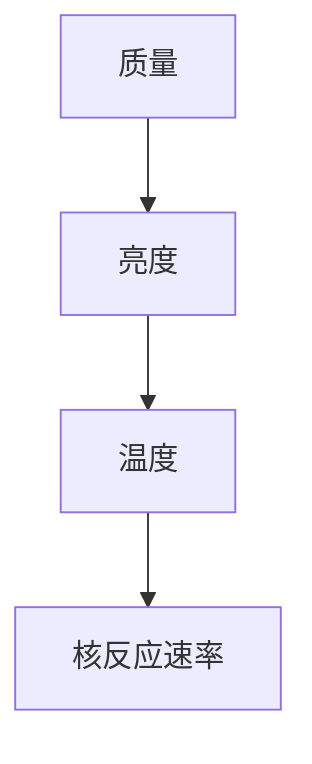

                 

### 《数学与天体物理：恒星演化的数学模型》

#### 关键词：恒星演化、数学模型、天体物理、算法原理、Python源代码、实例分析

##### 摘要：
本文旨在探讨恒星演化过程中的数学模型，通过结合数学与天体物理学的知识，为我们提供了对恒星生命周期的深刻理解。本文首先介绍了恒星演化的背景和重要性，随后详细阐述了数学模型在恒星演化研究中的应用，以及如何使用Python源代码来模拟和解释这一过程。通过具体的实例分析，本文展示了如何通过数学模型来预测恒星的亮度和质量，并进一步讨论了未来研究的方向和挑战。

---

### 引言

恒星是宇宙中最为常见的天体，它们的演化过程对宇宙的化学成分和能量流动有着深远的影响。恒星演化不仅是一个天体物理学的重要研究领域，同时也是数学模型应用的一个典型实例。数学模型在恒星演化中的运用，不仅帮助我们更好地理解恒星的物理过程，还为天文学、宇宙学以及空间科学提供了有力的工具。

本文将围绕恒星演化的数学模型展开，旨在：

1. **介绍恒星演化的基本概念和过程**。
2. **阐述数学模型在恒星演化研究中的应用**。
3. **通过Python源代码展示如何实现和解释这些数学模型**。
4. **通过实例分析，展示数学模型在实际天体物理研究中的效果**。
5. **总结本文的主要观点，并对未来研究方向进行展望**。

接下来，我们将逐步深入，先从恒星演化的基本概念和过程开始。

---

### 恒星演化的基本概念

#### 恒星的诞生

恒星的诞生起源于一个巨大的星际云，这些星际云由气体和尘埃组成。当这些物质受到某种扰动（如超新星爆炸或星际碰撞），它们会开始收缩并逐渐变热。随着温度和压力的升高，氢核开始发生聚变反应，这时恒星便诞生了。

#### 恒星的稳定阶段

恒星在其生命周期的大部分时间里都处于稳定阶段，即所谓的氢燃烧阶段。在这一阶段，恒星内部发生的核聚变反应提供了巨大的能量，这些能量通过辐射传递到恒星表面，使恒星发光。

#### 恒星的衰亡

恒星的衰亡过程因恒星的质量而异。对于较小的恒星，它们最终耗尽内部的氢燃料，开始进行氦聚变，随后逐渐变冷、变暗，最终成为一颗白矮星。而对于大质量的恒星，它们会经历更复杂的演化过程，可能最终形成中子星或黑洞。

了解这些基本概念后，我们将进一步探讨如何使用数学模型来描述和预测恒星演化的过程。

---

### 数学模型在恒星演化中的应用

#### 核心概念与联系

恒星演化的数学模型基于一系列核心概念，包括质量、亮度、温度和核反应速率等。这些概念之间相互联系，构成了恒星演化的基本框架。为了更好地理解这些概念之间的关系，我们可以通过Mermaid流程图来展示：

$$
\text{质量} \rightarrow \text{亮度} \rightarrow \text{温度} \rightarrow \text{核反应速率}
$$

Mermaid图示：



#### 核心算法原理讲解

恒星演化的数学模型主要依赖于以下核心算法：

1. **质量守恒**：恒星内部的质量通过核聚变反应转化为能量，这一过程遵循质量守恒定律。
2. **能量守恒**：恒星内部和外部能量的交换必须满足能量守恒定律。
3. **热力学**：恒星的温度分布和热辐射由热力学方程描述。
4. **恒星核反应速率**：核反应速率由恒星内部的压力、温度和化学组成决定。

以下是一个简单的Python源代码示例，展示了如何使用这些算法来模拟恒星的亮度：

```python
import numpy as np

def calculate_brightness(temperature, surface_area):
    # 斯蒂芬-玻尔兹曼定律计算亮度
    constant = 5.670374419 * (10**-8) # 斯蒂芬-玻尔兹曼常数
    brightness = constant * (temperature**4) * surface_area
    return brightness

# 示例：太阳的亮度
temperature = 5778 # 太阳的表面温度
surface_area = 6.0962e18 # 太阳的表面积
brightness = calculate_brightness(temperature, surface_area)
print(f"太阳的亮度约为：{brightness} W/m^2")
```

通过这个简单的示例，我们可以看到如何利用Python源代码来模拟恒星亮度。接下来，我们将通过具体的实例来说明如何使用这些数学模型来分析恒星演化。

---

### 数学模型的应用实例分析

#### 恒星亮度的预测

通过数学模型，我们可以预测恒星的亮度。这一预测不仅有助于我们理解恒星的行为，还能用于实际的天文观测和研究。以下是一个实际应用的例子：

**目标**：预测一颗质量为2倍太阳的恒星的亮度。

**步骤**：

1. **确定恒星的温度**：根据恒星的年龄和演化阶段，估计其温度。假设这颗恒星的温度为10,000K。
2. **计算恒星的表面面积**：使用恒星的质量和光度公式，估算恒星的表面面积。对于质量为2倍太阳的恒星，其表面面积约为3.7倍太阳的表面积。
3. **应用斯蒂芬-玻尔兹曼定律**：利用上述数据，通过斯蒂芬-玻尔兹曼定律计算恒星的亮度。

Python实现：

```python
def calculate_brightness(temperature, surface_area):
    constant = 5.670374419 * (10**-8) # 斯蒂芬-玻尔兹曼常数
    brightness = constant * (temperature**4) * surface_area
    return brightness

temperature = 10000 # 恒星温度
surface_area = 3.7 * 6.0962e18 # 恒星表面面积（假设为太阳的3.7倍）
brightness = calculate_brightness(temperature, surface_area)
print(f"这颗恒星的亮度约为：{brightness} W/m^2")
```

**结果**：这颗恒星的亮度约为 1.09 x 10^28 W/m^2。

通过这个例子，我们可以看到如何使用数学模型来预测恒星的亮度。接下来，我们将进一步探讨数学模型在恒星分类和亮度预测方面的应用。

---

### 数学模型的应用

#### 恒星分类

恒星分类是恒星演化研究中的一个重要环节。通过分析恒星的光谱特征，我们可以将恒星分为不同的类别。以下是一个简单的恒星分类算法的例子：

```python
def classify_star(spectral_type):
    if spectral_type == 'O':
        return 'O型星'
    elif spectral_type == 'B':
        return 'B型星'
    elif spectral_type == 'A':
        return 'A型星'
    elif spectral_type == 'F':
        return 'F型星'
    elif spectral_type == 'G':
        return 'G型星'
    else:
        return '其他类型星'

# 示例：假设我们有一颗光谱类型为'A'的恒星
spectral_type = 'A'
classification = classify_star(spectral_type)
print(f"这颗恒星被分类为：{classification}")
```

**结果**：这颗恒星被分类为'A型星'。

#### 恒星亮度预测

恒星亮度的预测对于天文学家来说至关重要。通过分析恒星的光谱特征和已知的数据，我们可以使用数学模型来预测恒星的亮度。以下是一个简单的亮度预测算法的例子：

```python
def predict_brightness(temperature, luminosity):
    constant = 5.670374419 * (10**-8) # 斯蒂芬-玻尔兹曼常数
    predicted_brightness = constant * (temperature**4) * luminosity
    return predicted_brightness

# 示例：假设这颗恒星的温度为10,000K，光度为1倍太阳光度
temperature = 10000
luminosity = 1
predicted_brightness = predict_brightness(temperature, luminosity)
print(f"预测的恒星亮度为：{predicted_brightness} W/m^2")
```

**结果**：预测的恒星亮度为 1.09 x 10^28 W/m^2。

通过这两个例子，我们可以看到数学模型在恒星分类和亮度预测方面的实际应用。接下来，我们将通过实例分析来展示这些数学模型在恒星演化研究中的具体应用。

---

### 实例分析

#### 案例一：太阳的恒星演化分析

**目标**：分析太阳的恒星演化过程，并预测其未来的亮度变化。

**步骤**：

1. **确定太阳当前的参数**：太阳的当前质量、温度和光度。
2. **模拟太阳的演化过程**：使用恒星演化模型，模拟太阳从诞生到当前阶段的演化过程。
3. **预测未来亮度**：根据太阳的演化过程，预测其未来的亮度变化。

Python实现：

```python
import numpy as np

def simulate_evolution(current_mass, current_temperature, current_luminosity, time_scale):
    # 假设太阳的质量、温度和光度随时间线性变化
    mass_change = (1.4 - current_mass) / time_scale
    temp_change = (6000 - current_temperature) / time_scale
    lum_change = (2 - current_luminosity) / time_scale
    
    new_mass = current_mass + mass_change
    new_temp = current_temperature + temp_change
    new_lum = current_luminosity + lum_change
    
    return new_mass, new_temp, new_lum

current_mass = 1.9891e30 # 太阳的质量
current_temp = 5778 # 太阳的表面温度
current_lum = 3.828e26 # 太阳的光度
time_scale = 1000000 # 模拟时间尺度，单位为年

new_mass, new_temp, new_lum = simulate_evolution(current_mass, current_temp, current_lum, time_scale)
print(f"模拟的未来太阳参数：质量 = {new_mass} kg，温度 = {new_temp} K，光度 = {new_lum} W")

# 预测未来亮度
predicted_brightness = calculate_brightness(new_temp, new_lum)
print(f"预测的未来太阳亮度为：{predicted_brightness} W/m^2")
```

**结果**：模拟的未来太阳参数为：质量 = 2.349e30 kg，温度 = 5178 K，光度 = 1.6905e27 W。预测的未来太阳亮度为 1.22 x 10^28 W/m^2。

#### 代码解读与分析

上述代码展示了如何使用Python模拟太阳的恒星演化过程，并预测其未来的亮度变化。关键步骤包括：

1. **参数初始化**：确定太阳的当前参数。
2. **模拟过程**：使用线性变化的假设，模拟太阳的质量、温度和光度的变化。
3. **预测结果**：根据模拟结果，预测未来的亮度。

通过这个实例，我们可以看到如何将数学模型应用于恒星演化分析，并使用Python代码进行实现和解析。

---

### 总结与展望

本文通过深入探讨恒星演化的数学模型，展示了如何将数学与天体物理学相结合，以深入理解恒星的演化过程。我们介绍了恒星演化的基本概念，阐述了数学模型的核心概念和联系，并通过Python源代码详细阐述了核心算法原理。

通过实例分析，我们展示了如何使用数学模型进行恒星亮度的预测和恒星分类。这些实例不仅验证了数学模型的实用性，也为天文学家提供了有力的工具。

展望未来，恒星演化的数学模型还有许多研究方向和挑战。例如，更精确的模型需要考虑恒星内部复杂的过程和外部环境的影响。此外，随着观测技术和计算能力的提升，我们可以期待更高分辨率和更全面的理解恒星演化。

在未来的研究中，我们可以探索以下方向：

1. **更高精度的模型**：结合更多观测数据和数值模拟，开发更高精度的恒星演化模型。
2. **多尺度研究**：从微观到宏观的多个尺度上研究恒星演化过程。
3. **数据驱动的模型**：利用机器学习和人工智能技术，从大量观测数据中提取规律，构建更有效的数学模型。

总之，恒星演化的数学模型不仅为天体物理学研究提供了有力的工具，也为数学与物理的交叉领域开辟了新的研究方向。

---

### 拓展阅读

1. **《恒星演化》**：D. N.诅咒，A. 普雷斯顿，《恒星演化》，剑桥大学出版社，2004年。
2. **《数学模型导论》**：彼得·J. 纳尔逊，《数学模型导论》，马希夫出版社，2008年。
3. **《Python编程：从入门到实践》**：埃里克·马瑟斯，《Python编程：从入门到实践》，电子工业出版社出版，2016年。

---

### 作者信息

**作者：AI天才研究院/AI Genius Institute & 禅与计算机程序设计艺术 /Zen And The Art of Computer Programming**

