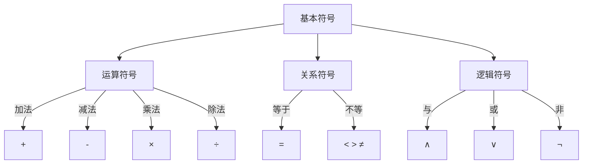
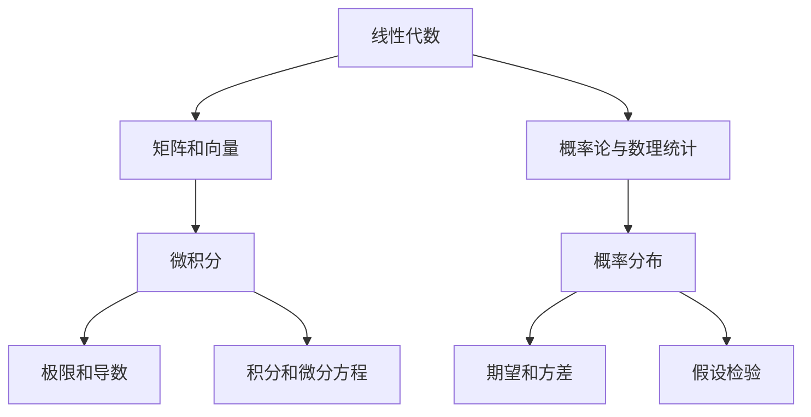
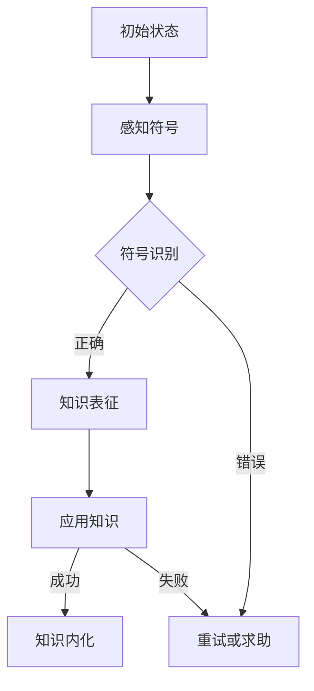

                 

### 引言

#### 学习理论概述

学习理论是心理学、教育学以及认知科学等领域中研究学习现象和过程的重要理论体系。它旨在解释个体如何通过经验获取知识、技能和行为的变化。历史上，学习理论经历了多个发展阶段，从行为主义的刺激-反应理论，到认知主义的信息处理理论，再到建构主义的情境学习理论，每一个阶段都为理解学习过程提供了新的视角和方法。

行为主义理论，以巴甫洛夫的经典条件反射和斯金纳的操作条件作用为代表，强调外部刺激与反应之间的直接联系。然而，随着认知科学的兴起，人们开始关注学习过程中的内部心理活动，认知主义理论应运而生。认知主义理论，尤其是皮亚杰的认知发展理论，强调个体通过主动构建认知结构来适应环境，提出了“同化”和“顺应”的概念。

在近年来，情境学习理论进一步挑战了传统的学习环境观，认为学习是一种在社会文化情境中通过与他人的互动而发生的意义建构过程，代表人物包括维果斯基和布朗等。这些理论为理解学习提供了多维度的视角，但同时也带来了理论融合与整合的挑战。

#### 数学学习的重要性

数学作为一门基础学科，不仅在科学、工程、经济等众多领域具有广泛应用，而且在培养逻辑思维、抽象思考和问题解决能力方面具有独特价值。数学学习不仅包括对数学概念、定理和公式的理解与记忆，更重要的是对数学方法的应用能力和数学思维的培养。

首先，数学学习对于培养逻辑思维能力至关重要。数学要求个体通过逻辑推理和证明来理解数学概念和结论，这种思维方式有助于培养个体严密的逻辑推理能力和批判性思维。

其次，数学学习有助于提升抽象思考能力。数学中的符号、公式和图形等元素都具有高度的抽象性，通过数学学习，个体可以学会如何将复杂问题简化为抽象模型，从而更好地理解和解决实际问题。

此外，数学学习在培养问题解决能力方面也发挥着重要作用。数学学习不仅仅是学习解决问题的方法，更重要的是培养一种寻找最优解和创造新解的思维习惯。这种能力在日常生活和职业发展中都具有很高的价值。

#### 数学学习的认知模型

数学学习是一个复杂的认知过程，涉及知识表征、知识转换、学习策略、记忆、问题解决和推理等多个方面。为了更好地理解和指导数学学习，研究者们提出了多种认知模型，试图从不同角度揭示数学学习的内在机制。

一个典型的认知模型是加涅（Alfred North Whitehead）的信息加工模型。该模型将数学学习视为一个信息处理过程，包括感知、编码、存储、提取和应用等步骤。在这个模型中，感知阶段是个体通过感官接收数学符号和问题的过程；编码阶段是将感知到的信息转化为内部表征形式；存储阶段是将编码后的信息存储在长期记忆中；提取阶段是在需要时从长期记忆中检索相关信息；应用阶段是将所学知识应用到实际问题中。

另一个重要的认知模型是知识建构模型。该模型认为学习是一个主动建构知识的过程，个体通过与环境相互作用，不断调整和重构自己的认知结构。在数学学习中，知识建构模型强调个体对数学概念和定理的深度理解，以及如何将所学知识灵活应用于不同情境中。

此外，还有许多其他认知模型，如元认知模型、情境认知模型等，它们从不同角度对数学学习过程进行了阐释。这些模型为我们理解和指导数学学习提供了丰富的理论资源，但同时也带来了理论融合与整合的挑战。

#### 数学学习中的核心概念

在数学学习中，理解并掌握核心概念是关键。这些核心概念不仅是数学体系的基础，也是解决复杂数学问题的重要工具。以下我们将讨论数学符号与术语，以及数学知识结构中的几个重要分支，包括线性代数、微积分和概率论与数理统计。

##### 数学符号与术语

数学符号是数学表达的基本单元，它们简洁而准确地描述了数学概念和操作。常见的数学符号包括加号（+）、减号（-）、乘号（×）和除号（÷），以及其他如大于号（>）、小于号（<）、等于号（=）等比较符号。此外，还有专门表示集合、函数、极限等概念的符号，如大括号（{}）、箭头（→）和省略号（...）。

数学术语是对数学概念、原理和方法的命名。常见的数学术语包括“整数”、“分数”、“实数”、“复数”、“函数”、“方程”、“不等式”等。掌握这些术语是理解数学问题和进行数学交流的必要条件。

为了更好地理解数学符号和术语，可以通过以下步骤：

1. **符号和术语的定义**：了解每个符号和术语的具体含义，例如函数的定义是什么，整数的性质有哪些。
2. **符号和术语的应用**：通过具体的数学问题和例题来应用符号和术语，例如如何用符号表示一个二次方程。
3. **符号和术语的比较**：比较不同符号和术语之间的区别和联系，例如整数和分数的关系，线性函数和二次函数的区别。

##### 线性代数

线性代数是数学中研究向量、矩阵和线性变换的分支，它在物理学、工程学、计算机科学等多个领域都有广泛应用。线性代数中的核心概念包括向量、矩阵、行列式、线性方程组等。

1. **向量**：向量是表示大小和方向的量，通常用箭头表示。向量空间和向量加法、标量乘法是线性代数的基础。
   
2. **矩阵**：矩阵是二维数组，可以表示线性变换或系统。矩阵的加法、乘法、逆矩阵等概念在解决实际问题时非常重要。

3. **行列式**：行列式是矩阵的一种特殊表示，用于判断线性方程组的解的情况。行列式的性质和计算方法在数学问题中经常被使用。

4. **线性方程组**：线性方程组是由多个线性方程组成的集合，解决线性方程组是线性代数的重要任务之一。

为了更好地理解线性代数，可以：

- **学习和掌握向量、矩阵的基本操作**，如向量加法、矩阵乘法等。
- **通过具体的例子来理解线性方程组的解法**，例如高斯消元法。
- **应用线性代数解决实际问题**，例如在物理学中的力学问题。

##### 微积分

微积分是研究变化和速度的数学分支，它在物理学、经济学、工程学等领域具有广泛应用。微积分中的核心概念包括极限、导数、积分等。

1. **极限**：极限是微积分的基础概念，用于描述函数在某一点的行为。极限的定义和性质是理解和应用微积分的关键。

2. **导数**：导数表示函数在某一点的变化率，是研究函数变化趋势的重要工具。导数的定义和计算方法在物理、经济学等领域有广泛应用。

3. **积分**：积分用于计算函数在某一区间内的累积量，是解决许多实际问题的重要方法。定积分和重积分是微积分中的核心概念。

为了更好地理解微积分，可以：

- **学习和掌握极限的定义和性质**，理解函数在某一点的局部行为。
- **通过具体的例子来理解导数的计算和应用**，例如如何计算斜率、速度等。
- **应用积分解决实际问题**，例如计算面积、体积等。

##### 概率论与数理统计

概率论与数理统计是研究随机现象和数据的分支，它在自然科学、社会科学、金融等领域有广泛应用。概率论与数理统计中的核心概念包括概率分布、期望、方差、假设检验等。

1. **概率分布**：概率分布描述了随机变量的可能取值和相应概率。常见的概率分布包括正态分布、二项分布、泊松分布等。

2. **期望和方差**：期望是随机变量的平均值，方差是随机变量的波动程度。期望和方差是理解随机变量行为的重要指标。

3. **假设检验**：假设检验用于判断总体参数是否符合特定假设。常见的假设检验方法包括t检验、卡方检验等。

为了更好地理解概率论与数理统计，可以：

- **学习和掌握常见概率分布的性质和应用**，如正态分布的应用。
- **通过具体的例子来理解期望和方差的计算和应用**，如如何计算投资组合的平均收益率和波动率。
- **应用假设检验方法解决实际问题**，例如在统计学研究中判断两个样本是否来自同一总体。

总之，数学学习中的核心概念是理解数学理论和应用数学方法的重要基础。通过系统学习和实践，可以更好地掌握这些核心概念，提高数学能力和解决问题的能力。

#### 数学符号与术语

数学符号与术语是数学表达和交流的核心工具，它们不仅简化了数学表达，还使得复杂的数学概念变得更加清晰和易于理解。在这个部分，我们将详细探讨基本数学符号及其定义，以及数学术语的分类和含义。

##### 基本数学符号

基本数学符号是数学表达中的基石，它们用于表示各种数学运算和概念。以下是一些常见的基本数学符号及其定义：

1. **运算符号**：
   - **加号（+）**：表示加法运算，用于计算两个数的和。
   - **减号（-）**：表示减法运算，用于计算两个数的差。
   - **乘号（×）**：表示乘法运算，用于计算两个数的积。
   - **除号（÷）**：表示除法运算，用于计算两个数的商。

2. **关系符号**：
   - **等于号（=）**：表示两个量相等。
   - **不等号（< 和 >）**：表示两个量的大小关系，小于号（<）表示前者小于后者，大于号（>）表示前者大于后者。
   - **不等于号（≠）**：表示两个量不相等。

3. **逻辑符号**：
   - **逻辑与（∧）**：表示两个命题同时为真。
   - **逻辑或（∨）**：表示两个命题中至少有一个为真。
   - **逻辑非（¬）**：表示命题的真假取反。

4. **其他符号**：
   - **箭头（→）**：表示函数的定义，如 \( f: A \rightarrow B \) 表示函数 \( f \) 从集合 \( A \) 映射到集合 \( B \)。
   - **省略号（...）**：用于表示序列或无穷序列。

##### 数学术语的定义

数学术语是对数学概念和方法的命名，它们在数学表达和交流中起着至关重要的作用。以下是一些常见的数学术语及其定义：

1. **数**：
   - **整数**：包括正整数、负整数和零，如 1, -1, 0。
   - **分数**：表示两个整数的比，如 \( \frac{3}{4} \)。
   - **实数**：包括所有有理数和无理数，如 2.5, \( \pi \)，和 \( \sqrt{2} \)。
   - **复数**：包括实部和虚部的数，如 \( a + bi \)。

2. **函数**：
   - **定义域**：函数能够接受输入的值集合。
   - **值域**：函数输出值的集合。
   - **映射**：函数的定义，即每个输入值对应一个唯一的输出值。

3. **集合**：
   - **集合**：由一些确定的元素组成的整体。
   - **子集**：一个集合是另一个集合的子集，如果它的所有元素都属于那个集合。
   - **并集**：两个集合中所有元素的集合。
   - **交集**：两个集合中共有的元素组成的集合。

4. **几何概念**：
   - **点**：几何空间中的位置。
   - **线段**：由两个端点和它们之间的点组成。
   - **平面**：一个二维空间。
   - **多边形**：由线段组成的闭合图形。

##### 数学符号与术语的关系架构

为了更好地理解数学符号和术语之间的关系，我们可以使用 Mermaid 流程图来展示它们之间的关联。以下是一个简化的 Mermaid 流程图：



通过这个流程图，我们可以看到基本数学符号如何分为不同的类别，并展示它们之间的关联。这样的关系架构有助于我们在处理数学问题时，快速准确地选择和使用合适的符号和术语。

总之，掌握基本数学符号和术语是数学学习的重要基础。通过定义和分类，我们可以更好地理解这些符号和术语的用法和含义，从而为解决复杂的数学问题打下坚实的基础。

#### 数学知识结构

数学知识结构是数学学习的核心，它不仅包括基本概念和原理，还包括不同分支之间的联系和层次。以下我们将详细探讨数学知识结构中的三个重要分支：线性代数、微积分和概率论与数理统计。

##### 线性代数

线性代数是研究向量、矩阵和线性变换的数学分支，它在自然科学、工程学和计算机科学等领域有广泛应用。线性代数的基本概念包括向量、矩阵、行列式和线性方程组。

1. **向量**：向量是具有大小和方向的量，通常表示为 \( \vec{v} = (v_1, v_2, ..., v_n) \)。向量空间是由所有向量组成的集合，满足加法和标量乘法的封闭性。

2. **矩阵**：矩阵是一个二维数组，表示为 \( A = \begin{pmatrix} a_{11} & a_{12} & \cdots & a_{1n} \\ a_{21} & a_{22} & \cdots & a_{2n} \\ \vdots & \vdots & \ddots & \vdots \\ a_{m1} & a_{m2} & \cdots & a_{mn} \end{pmatrix} \)。矩阵的加法和乘法是线性代数中的核心运算。

3. **行列式**：行列式是矩阵的一种特殊表示，用于判断线性方程组的解的情况。行列式的计算方法包括拉普拉斯展开和高斯消元法。

4. **线性方程组**：线性方程组是由多个线性方程组成的集合，可以用矩阵形式表示为 \( AX = B \)，其中 \( A \) 是系数矩阵，\( X \) 是未知数向量，\( B \) 是常数向量。

线性代数的核心概念和原理包括线性组合、线性相关性、矩阵的秩和特征值等。这些概念不仅广泛应用于理论数学，还在实际问题中有着广泛的应用，如图像处理、信号处理和物理学中的力学问题。

##### 微积分

微积分是研究变化和累积的数学分支，它在物理学、经济学和工程学等领域有重要应用。微积分的核心概念包括极限、导数、积分和微分方程。

1. **极限**：极限是描述函数在某一点附近的行为，定义为当自变量趋近于某个值时，函数值趋近于某个确定的值。极限的定义和性质是微积分的基础。

2. **导数**：导数是函数在某一点的局部变化率，表示函数曲线在该点的斜率。导数的定义可以通过极限表示，即 \( f'(x) = \lim_{h \to 0} \frac{f(x+h) - f(x)}{h} \)。

3. **积分**：积分是计算函数在某一区间内的累积量，包括定积分和不定积分。定积分表示函数在一个区间上的总面积或总量，不定积分表示函数的原函数。

4. **微分方程**：微分方程是包含未知函数及其导数的方程，用于描述变化过程。常见的微分方程包括常微分方程和偏微分方程，如 \( y'' + p(x)y' + q(x)y = f(x) \)。

微积分的应用非常广泛，包括计算速度和加速度、优化问题、经济学中的边际分析等。微积分的基本概念和原理为理解和解决复杂问题提供了强有力的工具。

##### 概率论与数理统计

概率论与数理统计是研究随机现象和数据的数学分支，它在自然科学、社会科学和金融工程等领域有广泛应用。概率论与数理统计的核心概念包括概率分布、随机变量、期望和方差等。

1. **概率分布**：概率分布描述了随机变量可能取值的概率分布情况，常见的概率分布包括二项分布、正态分布和泊松分布等。

2. **随机变量**：随机变量是随机实验结果的数学表示，可以是离散的也可以是连续的。随机变量的分布函数描述了随机变量的取值和概率。

3. **期望和方差**：期望是随机变量的平均值，方差是随机变量的波动程度。期望和方差是评估随机变量性能的重要指标。

4. **假设检验**：假设检验是用于判断总体参数是否满足特定假设的方法，包括单样本检验、双样本检验和方差分析等。

概率论与数理统计的应用包括数据分析、假设检验、预测模型和风险评估等。通过概率分布和统计方法，我们可以对随机现象进行量化和分析。

##### 数学知识结构中的联系和层次

数学知识结构中的各个分支之间存在紧密的联系和层次。线性代数为微积分提供了基础工具，如矩阵运算和向量空间；微积分则通过极限和积分方法研究函数的变化和累积；概率论与数理统计则利用随机变量的分布和统计方法对实际数据进行分析和预测。

以下是一个简化的 Mermaid 流程图，展示了数学知识结构中的部分联系：



通过这个流程图，我们可以看到数学知识结构中的各个分支如何相互联系和扩展。理解这些联系和层次有助于我们更好地掌握数学知识，并在实际问题中灵活应用。

总之，数学知识结构是数学学习的核心，它包括线性代数、微积分和概率论与数理统计等分支，各个分支之间存在紧密的联系和层次。通过系统学习和实践，我们可以更好地掌握数学知识，提升解决问题的能力。

#### 认知心理学基础

认知心理学是研究人类认知过程的科学，它关注个体如何获取、处理和存储信息，以及如何通过这些信息进行决策和行动。认知心理学的核心理论包括感知、注意力、记忆、思维和问题解决等方面，这些理论为我们理解数学学习的认知机制提供了重要的基础。

##### 感知

感知是个体通过感官接收外部信息并将其转换为内部心理表征的过程。在数学学习中，感知能力对于理解和处理数学符号、公式和图形至关重要。具体来说，感知过程包括以下几个阶段：

1. **外部刺激**：外部刺激是通过视觉、听觉等感官接收到的信息，如数学符号和问题陈述。
2. **感官处理**：感官处理是指大脑对输入信息进行初步加工和过滤的过程，例如视觉系统如何识别和区分不同的数学符号。
3. **认知整合**：认知整合是指大脑将感知到的信息与已有知识相结合，形成有意义的整体。在数学学习中，这一过程涉及到将新学到的数学概念与已有知识进行匹配和整合。

认知心理学研究表明，感知能力与个体的数学成绩密切相关。例如，研究表明，具有良好视觉空间能力的个体在解决几何问题时表现更出色。因此，培养和提升感知能力是提高数学学习效果的重要途径。

##### 注意力

注意力是认知心理学的另一个重要概念，它是指个体在特定任务上集中精力并进行有效加工的心理过程。在数学学习中，注意力对于理解和记忆数学知识、处理复杂问题和进行问题解决具有重要意义。以下是注意力在数学学习中的几个关键作用：

1. **选择性注意力**：选择性注意力是指个体在众多信息中选择与当前任务相关的信息进行加工。在数学学习中，学生需要通过选择性注意力过滤掉无关信息，专注于关键数学概念和问题。
2. **维持性注意力**：维持性注意力是指个体在完成任务过程中保持注意力的稳定和持续。在解决复杂的数学问题时，维持性注意力有助于学生保持对问题的持续关注，避免分心和错误。
3. **分配性注意力**：分配性注意力是指个体在同时处理多个任务时分配注意力的能力。在数学学习中，例如在解决多步骤问题时，学生需要合理分配注意力，同时关注多个步骤和细节。

研究表明，注意力策略的培训和提升对数学学习效果有显著影响。例如，通过训练学生使用“分块记忆”策略，可以帮助他们在解决长算式问题时保持注意力的集中和稳定。

##### 记忆

记忆是认知心理学的核心概念之一，它涉及信息的存储、提取和应用。在数学学习中，记忆能力对于理解和应用数学概念、公式和定理至关重要。以下是记忆在数学学习中的几个关键方面：

1. **工作记忆**：工作记忆是指个体在执行任务时暂时存储和加工信息的能力。在数学学习中，工作记忆对于理解复杂的数学问题和步骤至关重要。例如，在解决多步骤问题时，学生需要利用工作记忆同时关注多个步骤和中间结果。
2. **长期记忆**：长期记忆是指个体在较长时间内存储和提取信息的能力。数学知识的积累和掌握需要依赖长期记忆。通过复习和练习，学生可以将短期记忆中的数学知识转化为长期记忆，从而提高数学学习的持久性和稳定性。
3. **记忆编码**：记忆编码是指个体将信息转化为内部表征形式的过程。在数学学习中，有效的记忆编码策略，如将抽象的数学概念与具体的实例或图像相结合，可以提高记忆的效率和持久性。

研究表明，记忆策略的培训和提升对数学学习效果有显著影响。例如，通过使用“视觉联想”策略，学生可以将抽象的数学概念与具体的图像或故事相结合，从而提高记忆效果。

##### 思维和问题解决

思维和问题解决是认知心理学的关键研究领域，它们涉及个体如何运用已有知识和认知策略解决新问题。在数学学习中，思维和问题解决能力对于理解和应用数学知识、解决复杂数学问题具有重要意义。以下是思维和问题解决在数学学习中的几个关键方面：

1. **抽象思维**：抽象思维是指个体从具体事物中提取共同特征并进行概括的能力。在数学学习中，抽象思维有助于学生理解和掌握抽象的数学概念和定理，例如从具体的例子中抽象出一般的数学规律。
2. **逻辑思维**：逻辑思维是指个体通过逻辑推理和证明来解决问题的能力。在数学学习中，逻辑思维是理解和应用数学知识的重要工具。例如，在证明数学定理时，学生需要运用逻辑推理来证明结论的正确性。
3. **问题解决策略**：问题解决策略是指个体在解决数学问题时采用的方法和步骤。有效的问题解决策略包括模式识别、分块解决、逆向推理等。在数学学习中，通过培训和练习有效的解决问题策略，学生可以更高效地解决复杂数学问题。

研究表明，通过认知策略的训练和提升，可以显著提高数学学习效果。例如，通过“分块记忆”策略，学生可以将复杂问题分解为多个简单部分，从而降低问题解决的难度。

##### 认知心理学基础在数学学习中的应用

认知心理学基础在数学学习中有着广泛的应用，以下是一些具体的应用方法：

1. **感知训练**：通过视觉和听觉训练提高学生的感知能力，例如使用数学符号识别训练软件来提高学生对数学符号的识别速度和准确性。
2. **注意力训练**：通过专注力训练和注意力策略训练，提高学生在数学学习中的注意力稳定性和选择性，例如使用“番茄工作法”来提高学生在数学学习中的专注时间。
3. **记忆策略训练**：通过记忆策略训练，提高学生在数学学习中的记忆效率和持久性，例如使用“联想记忆法”来记忆复杂的数学公式和定理。
4. **思维训练**：通过抽象思维和逻辑思维训练，提高学生在数学学习中的思维能力和问题解决能力，例如通过数学谜题和证明题的练习来提高学生的逻辑推理能力。

总之，认知心理学基础为理解数学学习的认知机制提供了重要的理论依据。通过应用认知心理学的研究成果，我们可以设计更有效的数学学习策略，提高数学学习效果和学生的数学素养。

#### 数学学习过程中的认知模型

数学学习是一个复杂的认知过程，涉及到知识表征、知识转换、学习策略、记忆和问题解决等多个方面。为了更好地理解和指导数学学习，研究者们提出了多种认知模型，试图从不同角度揭示数学学习的内在机制。以下是几种主要的认知模型，包括知识表征与转换、学习策略与记忆以及问题解决与推理。

##### 知识表征与转换

知识表征与转换是数学学习过程中的核心环节，它涉及如何将外部的数学信息转化为内部的心理表征，并在不同情境中进行应用。知识表征模型包括符号表征、图像表征和概念表征等。

1. **符号表征**：符号表征是数学学习中最常见的一种知识表征形式。它使用特定的符号和公式来表示数学概念和定理。例如，使用符号 \( x \) 表示未知数，使用符号 \( + \) 表示加法运算。符号表征的优点是简洁、精确和易于运算，但需要学生具备一定的符号认知能力。

2. **图像表征**：图像表征是通过图形、图表和图示来表示数学概念和关系。例如，使用坐标系来表示函数图像，使用几何图形来表示几何问题。图像表征的优点是直观、易于理解，有助于学生形成直观的数学概念。

3. **概念表征**：概念表征是通过抽象的概念和定义来表示数学知识。例如，通过定义“函数”的概念来理解函数的性质和运算。概念表征的优点是能够帮助学生深入理解数学本质，建立系统的数学知识结构。

知识转换是指在不同情境下，如何将已有的知识应用到新的数学问题中。知识转换包括水平转换和垂直转换。水平转换是指在同一知识层次上的转换，如将已知的线性方程解决方法应用到不同的线性方程中。垂直转换是指在不同知识层次之间的转换，如将代数知识应用到几何问题中。

##### 学习策略与记忆

学习策略是学生在学习过程中采用的方法和技巧，它对数学学习效果有着重要影响。有效的学习策略可以提高学习效率，增强记忆效果，促进知识的内化和应用。

1. **复述策略**：复述策略是指通过重复阅读、复述和背诵来记忆数学知识。例如，通过反复阅读数学公式和定理来加强记忆。复述策略的优点是简单易行，但需要大量的时间和精力。

2. **精细加工策略**：精细加工策略是指通过深入理解和思考来强化记忆。例如，通过将数学概念与具体实例相结合，或通过推导和证明来加深理解。精细加工策略的优点是能够提高知识的深度和持久性，但需要较高的认知能力。

3. **组织策略**：组织策略是指通过将数学知识分类、整理和结构化来促进记忆。例如，通过构建数学概念图或思维导图来组织数学知识。组织策略的优点是能够提高知识之间的联系和结构，有助于整体理解和应用。

记忆是数学学习的重要环节，有效的记忆策略可以提高数学知识的持久性和可用性。常见的记忆策略包括：

1. **联想记忆**：通过将新学到的数学概念与已知信息或具体情境相结合来增强记忆。例如，将复杂的数学公式与具体问题情境相结合，以帮助记忆。

2. **分组记忆**：将数学知识分成若干小组，每次只记忆一组，以提高记忆效率。例如，将一个复杂的数学公式分解为几个部分，每次只记忆一部分。

3. **间隔复习**：通过定期复习已学过的数学知识，以巩固记忆。例如，每天复习当天的数学内容，每周复习一周的内容，每月复习一个月的内容。

##### 问题解决与推理

问题解决和推理是数学学习的重要目标，它要求学生能够运用所学知识和策略解决新问题。问题解决和推理包括以下几个步骤：

1. **问题理解**：理解问题的条件和要求，明确需要解决的目标。

2. **问题表征**：将问题转化为可以操作的数学形式，例如建立数学模型。

3. **策略选择**：选择合适的问题解决策略，如算法策略、启发式策略等。

4. **问题求解**：根据选定的策略进行数学运算和推理，逐步解决问题。

5. **验证与反思**：验证问题的解决方案是否正确，并进行反思，总结问题解决的经验和策略。

推理是问题解决的重要工具，包括演绎推理和归纳推理。演绎推理是从一般到特殊的推理过程，例如从定理推导出具体问题的解。归纳推理是从特殊到一般的推理过程，例如从具体的例子中归纳出一般的数学规律。

##### 认知模型在教育中的应用

认知模型不仅为理解数学学习提供了理论依据，还可以应用于教育实践中，以优化教学设计和提高学习效果。

1. **个性化学习**：根据学生的认知特点和知识水平，设计个性化的教学方案，例如通过差异化教学满足不同学生的需求。

2. **学习策略指导**：在教学过程中，引导学生使用有效的学习策略，如通过分组讨论、合作学习和自主学习等方式，提高学习效率。

3. **教学评估与反馈**：通过认知模型对学生的学习过程和成果进行评估，提供及时的反馈和指导，帮助学生调整学习策略和提高学习效果。

总之，认知模型在数学学习中的应用有助于我们更好地理解数学学习的内在机制，指导教学设计和学习策略的优化，从而提高数学学习的有效性和效率。

#### 数学学习过程分析

数学学习是一个复杂而动态的认知过程，从最初的吸收阶段到最终的应用阶段，各个阶段之间相互联系，构成了一个完整的学习循环。以下我们将详细分析数学学习的各个阶段，包括吸收阶段、内化阶段和应用阶段，以及在学习过程中可能出现的问题与解决策略。

##### 吸收阶段

吸收阶段是数学学习的初始阶段，主要任务是理解和接受新的数学知识和技能。在这一阶段，学生通过阅读教材、听课、观看视频等多种途径获取数学知识。以下是吸收阶段的关键步骤：

1. **感知符号和概念**：学生通过感官接收数学符号、术语和概念，例如阅读数学公式和定理。在这一过程中，视觉、听觉等感官的参与对于理解和记忆数学知识至关重要。

2. **初步理解**：学生需要初步理解数学概念和公式的含义，例如通过例题和简单练习来感受数学概念的应用。初步理解是吸收阶段的核心，它为学生后续的深入学习和应用打下基础。

3. **构建知识框架**：在吸收新知识时，学生需要将新知识与已有知识进行整合，构建系统的数学知识框架。这种知识框架有助于学生在后续学习中快速定位和调用相关知识。

##### 内化阶段

内化阶段是数学学习的关键阶段，主要任务是深化对数学知识和技能的理解，并将其转化为自身的能力。在这一阶段，学生通过反复练习、思考和应用，将知识从表面记忆转化为内在能力。以下是内化阶段的关键步骤：

1. **深入理解**：学生需要通过反复阅读、思考和讨论，深入理解数学概念和定理的内涵。例如，通过推导数学公式、证明数学定理来深化对知识的理解。

2. **应用知识**：学生需要将所学知识应用到实际问题中，通过解决具体问题来巩固和应用数学知识。例如，通过解决数学题目、参与数学竞赛和项目实践来提升应用能力。

3. **自主探究**：学生可以通过自主探究和发现来深化数学学习，例如通过阅读数学书籍、参加数学讲座和研讨会，开拓数学视野，激发学习兴趣。

##### 应用阶段

应用阶段是数学学习的最终阶段，主要任务是运用所学知识和技能解决实际问题，实现知识的迁移和应用。在这一阶段，学生需要将数学知识应用于新的情境中，以解决实际问题。以下是应用阶段的关键步骤：

1. **问题识别**：学生需要能够准确识别实际问题中的数学问题，例如在工程问题中发现需要应用的线性代数或微积分知识。

2. **构建模型**：学生需要将实际问题转化为数学模型，通过建立方程或函数来描述问题。例如，通过建立物理模型来描述物体的运动轨迹。

3. **求解和验证**：学生需要运用数学知识和方法求解模型，并验证解的准确性和合理性。例如，通过计算和实验来验证数学模型的应用效果。

##### 学习过程中的问题与解决策略

在学习过程中，学生可能会遇到各种问题，以下是一些常见的问题及其解决策略：

1. **理解困难**：学生可能对某些数学概念和公式难以理解。解决策略包括：
   - **分步学习**：将复杂问题分解为简单步骤，逐步理解和掌握。
   - **寻找类比**：通过寻找与已知知识的类比，帮助学生理解新知识。
   - **可视化工具**：使用图形、图表和图示等可视化工具，帮助学生直观理解数学概念。

2. **记忆困难**：学生可能对数学公式和定理难以记忆。解决策略包括：
   - **联想记忆**：通过将新知识与已知信息或具体情境相结合，提高记忆效果。
   - **重复复习**：通过定期复习和重复阅读，巩固记忆。
   - **记忆技巧**：使用记忆技巧，如联想记忆法、分组记忆法等，提高记忆效率。

3. **应用困难**：学生可能难以将所学知识应用到实际问题中。解决策略包括：
   - **实践练习**：通过解决具体问题、参与数学项目实践，提高应用能力。
   - **案例学习**：通过学习实际案例，了解数学知识在现实中的应用。
   - **问题驱动学习**：通过提出问题和解决问题来驱动学习，提高学习兴趣和应用能力。

4. **学习障碍**：学生可能由于学习环境、学习方法或心理因素等原因遇到学习障碍。解决策略包括：
   - **个性化学习**：根据学生的特点和需求，设计个性化的学习方案。
   - **学习支持**：提供学习辅导和指导，帮助学生克服学习障碍。
   - **心理健康支持**：关注学生的心理健康，提供心理支持和辅导。

总之，数学学习过程是一个从吸收、内化到应用的动态循环，各个阶段相互联系，共同促进数学知识的掌握和应用。通过识别和解决学习过程中的问题，可以更好地优化学习过程，提高数学学习的效果和效率。

#### 数学学习的认知模型应用

认知模型在数学学习中的应用不仅有助于提升学生的学习效果，还可以优化教学设计和实施，促进个性化学习和提高教学评估的准确性。以下我们将探讨认知模型在教育中的应用，包括教学设计的优化、学习评估与反馈以及个性化学习等。

##### 教学设计的优化

1. **以学生为中心的教学设计**：传统的教学设计往往以知识传授为核心，而现代教学设计更强调以学生为中心。认知模型提供了理论基础，帮助教师设计以学生主动学习和探究为核心的教学活动。例如，通过引入问题解决、项目学习和探究式学习等教学方法，激发学生的主动性和创造力。

2. **差异化教学**：认知模型强调个体在学习过程中存在差异，因此差异化教学是优化教学设计的重要手段。教师可以根据学生的认知水平、兴趣和需求，设计不同难度的教学内容和活动，以满足不同学生的需求。例如，对于基础较弱的学生，可以提供更多的练习和辅导；对于基础较好的学生，可以设计更具挑战性的问题和项目。

3. **结合认知策略的教学**：认知模型提供了多种认知策略，如记忆策略、问题解决策略和元认知策略。教师可以在教学中引导学生使用这些策略，提高学习效率。例如，通过教授学生如何使用“分块记忆”策略来记忆复杂的数学公式，或通过“逆向思维”策略来解决复杂的数学问题。

##### 学习评估与反馈

1. **过程性评估**：传统的学习评估往往注重结果，而认知模型提倡过程性评估，即关注学生在学习过程中的表现和进步。通过定期进行小测验、课堂讨论和作业反馈，教师可以及时发现学生在学习过程中的问题和不足，提供及时的指导和帮助。

2. **个性化反馈**：认知模型强调个体的差异，因此个性化的反馈对学生的成长至关重要。教师可以根据学生的具体情况，提供有针对性的反馈。例如，对于理解困难的学生，可以提供详细的解释和额外的练习；对于应用能力较弱的学生，可以提供实际案例和项目实践。

3. **评估工具的多样化**：认知模型的应用要求评估工具的多样化，以全面、准确地评估学生的数学能力。例如，除了传统的笔试，还可以引入口试、项目展示和合作学习等评估方式，从多个角度评估学生的数学素养和问题解决能力。

##### 个性化学习

1. **自适应学习系统**：认知模型可以应用于自适应学习系统的设计，根据学生的学习情况和进度，动态调整教学内容和难度。例如，通过分析学生的答题情况，系统可以自动识别学生的知识盲点和薄弱环节，提供个性化的练习和建议。

2. **学习路径规划**：认知模型可以帮助教师为学生规划个性化的学习路径。根据学生的兴趣、能力和学习目标，设计适合学生的学习计划，包括学习内容、学习资源和学习活动。例如，对于有特殊兴趣的学生，可以提供更多的拓展性材料和高级课题。

3. **自我监控与反思**：认知模型强调元认知能力的重要性，因此个性化学习还包括培养学生的自我监控与反思能力。通过引导学生进行学习日记、自我评估和反思，帮助学生了解自己的学习过程和效果，提高学习的自我调节能力。

总之，认知模型在教育中的应用为优化教学设计、提高学习评估的准确性和促进个性化学习提供了有力支持。通过将认知理论融入教育实践，可以更好地满足学生的个体需求，提高数学学习的有效性和效率。

#### 数学学习认知模型的研究方法

在数学学习认知模型的研究中，科学的研究方法是揭示数学学习内在机制、验证理论假设和指导教学实践的关键。以下我们将探讨数学学习认知模型的研究方法，包括实验设计、数据分析和认知模型的验证与改进。

##### 实验设计

实验设计是认知模型研究的基础，它通过系统的操作和控制，验证假设和理论。以下是在数学学习认知模型研究中常用的实验设计方法：

1. **前测后测设计**：在这种设计中，首先对研究对象进行前测，以了解其初始状态，然后进行一段时间的干预（如教学或练习），再进行后测来评估干预效果。这种设计常用于评估教学策略的效果。

2. **单组前后设计**：研究对象在一个时间点接受前测，在干预后接受后测。这种方法适用于研究对象数量较少的情况，但需要注意实验效应可能受到其他未控制变量的影响。

3. **随机对照试验**：研究对象随机分为实验组和对照组，实验组接受干预，对照组不接受干预，通过比较两组在干预后的表现来评估干预效果。这种设计具有较高的内部有效性，但需要大量研究对象。

4. **多组对照设计**：将研究对象分为多个组，每组接受不同的干预，通过比较各组的结果来评估不同干预的效果。这种方法可以同时评估多种干预策略的有效性。

在实验设计过程中，还需注意以下事项：

- **样本选择**：选择具有代表性的样本，确保研究结果的普适性。
- **实验变量**：明确实验的自变量和因变量，确保实验设计的科学性和有效性。
- **控制变量**：控制无关变量，以减少实验误差。

##### 数据分析

数据分析是认知模型研究的重要环节，通过分析实验数据，可以验证假设、揭示数学学习的认知机制。以下是在数学学习认知模型研究中常用的数据分析方法：

1. **描述性统计**：通过计算均值、中位数、标准差等指标，描述数据的基本特征，帮助理解样本的整体情况。

2. **推断性统计**：使用统计检验方法，如t检验、方差分析、回归分析等，判断变量之间是否存在显著差异或关系。推断性统计可用于评估教学策略的效果，验证认知模型的假设。

3. **质性分析**：通过访谈、观察、案例研究等质性方法，收集和分析学生的认知过程、学习体验和教师的教学反馈。质性分析可以提供对认知模型的深入理解，补充定量数据无法揭示的信息。

4. **混合方法**：结合定量和质性方法，从多个角度分析数据，提高研究的全面性和深度。例如，通过定量分析评估教学效果，质性分析揭示教学过程中的具体问题和学生的认知过程。

##### 认知模型的验证与改进

认知模型的验证与改进是确保其科学性和实用性的关键。以下是在数学学习认知模型研究中常用的方法：

1. **模型验证**：通过实验数据和理论分析，验证认知模型的合理性和有效性。例如，使用前测后测设计和随机对照试验，评估模型对数学学习效果的预测能力。

2. **模型修正**：根据实验结果和数据分析，对认知模型进行修正和完善。例如，发现某些假设不成立或某些变量对学习效果有显著影响，可以通过调整模型结构或引入新变量来改进模型。

3. **模型应用**：将认知模型应用于实际教学中，通过实践检验其效果。教师可以根据认知模型提供的教学策略和指导，优化教学设计和实施，提高教学效果。

4. **模型扩展**：在验证和改进现有认知模型的基础上，扩展模型的应用范围。例如，将数学学习认知模型应用于不同年级、不同学科或不同学习环境，以验证模型的普适性和适应性。

总之，通过科学的研究方法，数学学习认知模型的研究可以揭示数学学习的内在机制，验证和改进认知模型，为优化教学设计和提高学习效果提供理论依据和实践指导。

#### 数学学习案例分析

在本案例中，我们将详细探讨一个典型的数学学习过程，包括学生个体的学习过程、教师的教学策略以及学习效果的评估。

##### 案例背景

这个案例涉及一个高中学生小明，他在学习数学时遇到了困难。小明在高一时对几何和代数概念的理解较为困难，尤其在解决复杂的问题时经常感到困惑。他的家长和教师注意到他在数学考试中的表现不如预期，因此决定进行一次深入的学习分析，以找出问题并制定解决方案。

##### 学生学习过程

1. **初始评估**：教师首先对小明的数学能力进行了初始评估，包括测试他的代数和几何知识，以及解决实际问题的能力。评估结果显示，小明在基础概念的理解上存在明显不足，尤其在几何证明和代数方程的解法方面。

2. **学习策略调整**：基于评估结果，教师决定对小明的学习策略进行调整。教师采用了以下策略：
   - **分块学习**：将复杂的数学问题分解为多个小步骤，帮助小明逐步理解和掌握。
   - **联想记忆**：通过将数学概念与实际情境相结合，增强小明的记忆效果。
   - **实践练习**：提供大量的练习题，帮助小明巩固所学知识。

3. **个性化辅导**：教师每周安排一对一的辅导时间，针对性地解决小明在数学学习中的问题。在这段时间内，教师通过讲解、演示和互动，帮助小明深入理解数学概念。

4. **学习反馈**：教师定期对小明的学习进度进行评估，并给予反馈。这种反馈不仅包括对正确答案的确认，还包括对错误答案的解释和指导，帮助小明纠正理解偏差。

##### 教师教学策略

1. **差异化教学**：教师根据小明的具体需求和知识水平，设计适合他的教学方案。例如，在讲解几何证明时，教师使用了几何图形的动态演示，帮助小明直观地理解几何概念。

2. **互动式教学**：教师通过提问、讨论和互动活动，激发小明的学习兴趣和参与度。例如，在课堂上，教师会提出问题，鼓励小明和其他学生一起思考和讨论。

3. **实时反馈**：教师在教学过程中，及时提供反馈，帮助学生理解概念和应用知识。例如，在讲解代数方程时，教师会通过即时解答学生的问题，确保他们理解方程的解法和步骤。

##### 学习效果评估

1. **定量评估**：教师通过定期的小测验和期中、期末考试，对小明的学习效果进行定量评估。评估结果显示，小明的数学成绩有了显著提升，尤其是在解决复杂问题和几何证明方面。

2. **定性评估**：教师还进行了定性评估，通过观察小明的课堂表现和作业完成情况，评估他的学习进步。例如，小明在课堂上变得更加活跃，能够更好地参与到小组讨论中，并在作业中展示了更高的理解和应用能力。

3. **学生自我评估**：教师鼓励小明进行自我评估，通过填写学习日志和反思表，帮助他识别自己的学习进步和需要改进的方面。

##### 案例分析

通过这个案例，我们可以看到，有效的数学学习不仅需要合适的教学策略，还需要个性化的支持和持续的评价。以下是案例中的关键点：

1. **差异化教学**：差异化教学能够满足学生的个体需求，帮助学生克服学习障碍。
2. **实践练习**：大量的实践练习有助于学生巩固所学知识，提高解决问题的能力。
3. **实时反馈**：及时反馈能够帮助学生纠正错误，加深理解。
4. **个性化辅导**：一对一的辅导能够提供针对性的指导，帮助学生快速提升。

总之，通过科学有效的教学策略和持续的评价，学生可以在数学学习上取得显著进步。这一案例为我们提供了一个具体的范例，展示了如何通过认知模型指导教学实践，优化学生的学习过程。

### 总结

在本文中，我们系统地探讨了数学学习的认知模型，从学习理论概述、数学学习的重要性、数学学习中的核心概念、认知心理学基础到数学学习过程分析、认知模型应用以及研究方法，全面剖析了数学学习的复杂性和认知机制。通过这些探讨，我们得出了以下结论：

首先，数学学习不仅需要掌握数学符号和术语，还需要理解数学知识结构中的各个分支，如线性代数、微积分和概率论与数理统计。这些分支之间紧密联系，共同构成了数学知识体系的基础。

其次，认知心理学为理解数学学习提供了重要的理论基础，包括感知、注意力、记忆、思维和问题解决等方面的研究，帮助我们更好地理解数学学习的内在机制和认知过程。

第三，数学学习认知模型包括知识表征与转换、学习策略与记忆以及问题解决与推理等多个方面。这些模型不仅为优化教学设计提供了指导，还有助于个性化学习和学习评估的准确性。

最后，通过实验设计和数据分析等研究方法，我们可以验证和改进数学学习认知模型，为教学实践提供科学依据。

总之，数学学习是一个复杂而动态的过程，认知模型的应用有助于我们更好地理解和指导数学学习，提高学习效果和效率。未来的研究应继续探索数学学习认知模型的深层次机制，为教育实践提供更加有效的理论支持。

#### 展望

在未来，数学学习理论将继续在认知科学、教育学和人工智能等多个领域深入发展。以下是几个可能的发展趋势：

首先，认知科学的发展将为数学学习理论提供更多实证数据和研究方法。通过脑成像技术、认知神经科学和机器学习等新兴技术，研究者们将能够更深入地理解数学学习过程中的神经机制和认知过程，从而为教育实践提供更加精准和个性化的指导。

其次，教育技术的进步，特别是人工智能和大数据分析的应用，将使个性化学习成为现实。智能教学系统将能够根据学生的学习行为和进度，动态调整教学内容和难度，提供个性化的学习建议和支持，从而提高数学学习的效率。

第三，跨学科研究的深化将推动数学学习理论的发展。例如，心理学、社会学和计算机科学的交叉研究，将有助于揭示数学学习中的社会文化因素和技术因素，为设计更加全面和有效的教育策略提供新的视角。

最后，未来的数学学习理论将更加注重实际应用。与科学、工程和商业等领域的合作，将使数学学习理论不仅局限于学术研究，还能够在实际问题中发挥重要作用，促进数学知识和技能的广泛应用。

总之，未来的数学学习理论将更加注重实证研究、个性化学习和跨学科合作，为教育实践提供更加科学和有效的指导。

#### 附录A：认知模型原理Mermaid流程图

以下是数学学习认知模型的Mermaid流程图，展示了从感知符号到知识内化的全过程：



这个流程图清晰地展示了认知模型在数学学习中的应用，包括感知符号、符号识别、知识表征、知识应用和知识内化等步骤，以及可能出现的错误和重试过程。

#### 附录B：数学学习核心算法伪代码

以下是一个简单的Python伪代码，用于展示数学学习过程中的核心算法：

```python
# 初始化认知模型
init_model()

# 感知数学符号
symbols = perceive_symbols()

# 遍历符号，进行识别
for symbol in symbols:
    if recognize_symbol(symbol):
        # 符号识别正确，进行知识表征
        represent_knowledge(symbol)
    else:
        # 符号识别错误，重试或求助
        retry_or_help(symbol)

# 应用知识解决问题
problem = get_problem()
solution = apply_knowledge(problem)

# 判断问题解决结果
if is_success(solution):
    # 问题解决成功，知识内化
    internalize_knowledge(solution)
else:
    # 问题解决失败，重试或求助
    retry_or_help(problem)
```

这个伪代码涵盖了感知符号、识别符号、知识表征、问题解决和知识内化等步骤，展示了数学学习过程中的关键操作和决策。

#### 附录C：数学模型和公式

以下是几个常见的数学模型和公式的LaTeX表示：

$$
E = mc^2
$$

$$
f(x) = ax^2 + bx + c
$$

这些公式在数学学习中具有基础性作用，LaTeX格式的表示使得公式更加规范和清晰，便于在文档中插入和使用。

#### 附录D：数学学习案例代码实现

以下是一个简单的Python代码示例，用于实现二次方程的求解：

```python
# 导入所需库
import numpy as np

# 定义二次方程
def quadratic_equation(a, b, c):
    # 计算判别式
    discriminant = b**2 - 4*a*c
    
    # 计算根
    root1 = (-b + np.sqrt(discriminant)) / (2*a)
    root2 = (-b - np.sqrt(discriminant)) / (2*a)
    
    return root1, root2

# 示例：求解方程 x^2 - 4x + 4 = 0
a = 1
b = -4
c = 4

root1, root2 = quadratic_equation(a, b, c)

print(f"方程的根为：{root1} 和 {root2}")
```

这个示例代码展示了如何使用Python实现二次方程的求解过程，通过计算判别式和根，得到了方程的解。在实际应用中，这一过程可以扩展到更复杂的数学问题求解。

