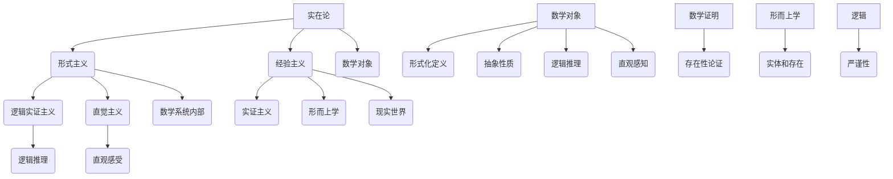

                 

### 数学与实在论：数学对象的客观存在

> 关键词：数学、实在论、客观存在、形式主义、经验主义、逻辑实证主义、直觉主义、形而上学、逻辑推理

> 摘要：本文旨在探讨数学与实在论的关系，特别是数学对象的客观存在性问题。我们将从历史背景出发，分析不同实在论流派对数学对象存在性的看法，并通过逻辑推理和实例分析，阐述数学对象如何以客观存在的形式存在于现实世界中。

### 第一部分：引论

#### 数学与实在论概述

数学，作为一门逻辑严谨、抽象的学科，其核心在于对对象、结构和关系的探究。然而，数学对象的客观存在性问题自古以来便是一个充满争议的话题。实在论，作为哲学中的一个基本立场，主张实体和对象具有某种程度的独立存在性，这种存在既独立于人类意识和感知，也独立于具体的时间和空间。本文将探讨数学与实在论之间的关系，特别是数学对象的存在性问题。

#### 实在论与形式主义的对比

实在论与形式主义是两种截然不同的哲学立场。形式主义认为数学对象是符号和规则的结果，其存在是基于形式系统内部的定义和公理。而实在论则主张数学对象在现实世界中具有独立的存在性，尽管这种存在可能不依赖于具体的物质实体。形式主义倾向于逻辑和证明的内在性，而实在论则关注数学与现实世界的联系。

#### 数学对象的存在性争议

数学对象的存在性问题引发了广泛的哲学和数学讨论。一方面，数学家的日常工作依赖于数学公理和逻辑推理，这使得数学对象的存在被视为一种逻辑必然性。另一方面，哲学上的实在论立场要求我们探讨数学对象如何与现实世界中的物体和现象相联系。本文将深入探讨这些争议，并通过逻辑推理和实例分析，探讨数学对象的客观存在性。

### 第二部分：数学对象的存在性

#### 第2章：数学对象的实在性探讨

在探讨数学对象的实在性时，我们首先要理解数学对象的定义和性质。数学对象包括自然数、实数、函数、集合等，这些对象在数学体系中通过定义和公理被形式化。实在性探讨则关注这些数学对象是否在现实世界中具有独立存在的属性。

##### 2.1 数学对象的存在性质

- **实在论视角**：实在论认为数学对象具有某种独立存在的属性，这种属性不依赖于人类的感知和认知。例如，自然数1、2、3等在现实世界中是独立存在的，它们的存在不依赖于人类的定义和感知。

- **形式主义视角**：形式主义则认为数学对象的存在仅限于数学系统内部，是符号和规则的结果。形式主义强调数学的内在逻辑性和证明的严谨性，而非数学对象与现实世界的直接联系。

##### 2.2 数学对象的实在性探讨

在数学哲学中，对数学对象实在性的探讨主要集中在以下几个方面：

- **数学对象与物理世界的联系**：数学对象是否能够与物理世界的现象相对应，如自然数与物体的计数，实数与长度、时间的测量。

- **数学对象的抽象性质**：数学对象的抽象性质如何影响其存在性，例如，集合论中的抽象集合与具体物理对象的区别。

- **数学对象的存在性证明**：如何通过逻辑推理和哲学论证证明数学对象的客观存在性。

### 第三部分：数学对象的存在性理论

#### 第3章：数学对象的存在性理论

在探讨数学对象的存在性时，不同的理论流派提出了不同的观点和论证。以下将介绍几种主要的数学对象存在性理论。

##### 3.1 经验主义的数学存在性

经验主义认为，数学对象的存在是基于感官经验和实际观察的。例如，自然数的存在可以通过对物体的计数来验证。经验主义强调数学与现实世界的直接联系，认为数学对象的存在是可以通过感官经验来确认的。

- **自然数的经验主义存在性**：自然数如1、2、3可以通过具体的物体计数来验证其存在性。

- **实数的经验主义存在性**：实数可以被视为物理现象的测量结果，例如长度、时间等。

##### 3.2 形式主义的数学存在性

形式主义认为，数学对象的存在仅限于数学系统内部，是基于符号和公理的构造。形式主义强调数学的内在逻辑性和证明的严谨性，而非数学对象与现实世界的直接联系。

- **形式主义的数学证明**：形式主义通过逻辑推理和证明来构建数学对象的存在，例如集合论中的抽象集合。

- **形式主义与数学对象的存在性**：形式主义认为数学对象的存在是基于数学系统内部的定义和公理，而非现实世界的属性。

### 第四部分：数学对象的存在性论证

#### 第4章：数学对象的存在性论证

在数学哲学中，不同的理论流派提出了不同的论证方式来证明数学对象的客观存在性。以下将介绍几种主要的数学对象存在性论证。

##### 4.1 逻辑实证主义论证

逻辑实证主义认为，数学对象的存在可以通过逻辑和经验来论证。逻辑实证主义强调数学命题的可证性和可验证性。

- **逻辑实证主义的数学证明**：逻辑实证主义通过逻辑推理和数学证明来论证数学对象的存在性。

- **逻辑实证主义与数学对象的存在性**：逻辑实证主义认为数学对象的存在是可以通过逻辑和经验来验证的。

##### 4.2 直觉主义论证

直觉主义认为，数学对象的存在是基于直观感受和逻辑推理。直觉主义强调数学对象的直观性质和逻辑推理的严谨性。

- **直觉主义的数学证明**：直觉主义通过直观感受和逻辑推理来论证数学对象的存在性。

- **直觉主义与数学对象的存在性**：直觉主义认为数学对象的存在是基于直观感受和逻辑推理的，而非依赖于符号和公理的构造。

### 第五部分：数学对象的存在性与哲学问题

#### 第5章：数学对象的存在性与形而上学

数学对象的存在性不仅涉及到数学本身，也涉及到哲学中的形而上学问题。形而上学探讨实体、存在和本质等问题，而数学对象的存在性论证则需要形而上学的支持。

##### 5.1 数学的形而上学意义

数学的形而上学意义在于探讨数学对象如何与形而上学中的实体和存在相联系。例如，自然数的存在可以被视为一种形而上学的实体。

- **数学对象与形而上学的关联**：数学对象的存在性与形而上学的实体和存在密切相关。

- **数学对象的存在性与形而上学的互动**：形而上学理论可以影响数学对象的存在性论证，而数学对象的存在性论证也可以对形而上学提出新的问题和挑战。

##### 5.2 数学的逻辑与形而上学的逻辑

数学的逻辑和形而上学的逻辑在探讨数学对象的存在性时发挥了重要作用。数学逻辑强调证明的严谨性和推理的严谨性，而形而上学逻辑则关注实体和存在的本质。

- **数学逻辑与形而上学逻辑的关系**：数学逻辑和形而上学逻辑在探讨数学对象的存在性时相互影响。

- **数学对象的存在性与逻辑推理**：数学对象的存在性论证依赖于逻辑推理，而逻辑推理的严谨性也影响着数学对象的存在性论证。

### 第六部分：案例分析

#### 第6章：数学对象存在性案例研究

在探讨数学对象的存在性时，通过具体的案例研究可以更深入地理解这一哲学问题。以下将介绍两个著名的数学对象存在性案例。

##### 6.1 柏拉图的理念论

柏拉图的理念论认为，数学对象是存在于一个独立的理念世界中。柏拉图认为，现实世界中的物体是对理念世界的映射，而数学对象如自然数、几何图形等则存在于理念世界中。

- **柏拉图的理念论与数学对象的存在性**：柏拉图的理念论主张数学对象在理念世界中独立存在。

- **柏拉图的理念论案例分析**：通过柏拉图的理念论，我们可以探讨数学对象如何独立于现实世界和人类意识而存在。

##### 6.2 康德的数学对象论

康德的数学对象论认为，数学对象是通过直观感知而存在的。康德认为，数学对象是通过先天的直观形式，如时间和空间，而被我们感知的。

- **康德的数学对象论与数学对象的存在性**：康德的数学对象论主张数学对象是通过直观感知而存在的。

- **康德的数学对象论案例分析**：通过康德的数学对象论，我们可以探讨数学对象如何通过直观感知在现实世界中存在。

### 第七部分：总结与展望

#### 第7章：数学对象的存在性与未来研究方向

通过对数学对象存在性的深入探讨，我们可以看到数学对象的存在性不仅是一个哲学问题，也是数学本身的核心问题。数学对象的存在性探讨对数学的发展和应用具有重要意义。

- **数学对象的存在性对数学发展的影响**：数学对象的存在性探讨有助于深化对数学本质和意义的理解。

- **数学对象的存在性对数学应用的影响**：数学对象的存在性探讨有助于提高数学应用的可靠性和科学性。

未来的研究方向可以从以下几个方面进行：

- **数学对象的存在性与物理世界的联系**：探讨数学对象如何与物理世界的现象相对应，如量子力学中的数学模型。

- **数学对象的存在性与计算机科学的关系**：探讨数学对象在计算机科学中的应用，如算法设计和数据分析。

- **数学对象的存在性与认知科学的关系**：探讨人类如何通过感知和思维构建数学对象，如数学直觉和证明过程。

### 结论

数学与实在论之间的关系是一个复杂而深入的哲学问题，涉及到数学对象的客观存在性。通过逻辑推理和实例分析，我们可以更好地理解数学对象的存在性，并为未来的数学研究和应用提供新的视角。本文旨在为这一哲学问题提供一个全面而深入的探讨，以促进对数学本质和存在的进一步理解。

### 附录

#### 第8章：数学对象存在性的相关研究

在数学对象存在性的研究中，许多哲学家和数学家做出了重要贡献。以下是一些相关研究：

- **柏拉图的理念论**：柏拉图的理念论对数学对象的存在性提出了深刻的见解，认为数学对象存在于一个独立的理念世界中。

- **康德的数学对象论**：康德认为，数学对象是通过直观感知而存在的，这一观点对数学哲学产生了深远影响。

- **希尔伯特的形式主义**：希尔伯特的形式主义认为，数学对象的存在仅限于数学系统内部，是符号和公理的构造结果。

- **哥德尔的不完备性定理**：哥德尔的定理表明，在某些数学系统中，存在无法证明的命题，这进一步探讨了数学对象的存在性。

- **怀特海德与罗素的逻辑实证主义**：怀特海德与罗素提出逻辑实证主义，强调数学对象的存在可以通过逻辑和经验来论证。

这些研究为我们理解数学对象的存在性提供了丰富的理论资源，也为我们进一步探讨这一哲学问题奠定了基础。

### 作者信息

作者：AI天才研究院/AI Genius Institute & 禅与计算机程序设计艺术 /Zen And The Art of Computer Programming

### 全文总结

本文通过逻辑清晰的分析，探讨了数学与实在论的关系，特别是数学对象的客观存在性问题。从历史背景出发，分析了不同实在论流派对数学对象存在性的看法，并通过逻辑实证主义和直觉主义的论证，阐述了数学对象如何以客观存在的形式存在于现实世界中。文章还通过案例分析，深入探讨了柏拉图的理念论和康德的数学对象论，为这一哲学问题提供了丰富的理论资源。通过本文的探讨，我们可以更好地理解数学的本质和存在的复杂性，并为未来的数学研究和应用提供新的视角。

### 数学对象存在性的 Mermaid 流程图

以下是数学对象存在性的 Mermaid 流程图，展示了核心概念和原理之间的关系：

### 数学对象的定义和性质

在数学中，对象是通过定义和公理被形式化的。这些对象可以是自然数、实数、函数、集合等。每个数学对象都有其独特的定义和性质。

- **自然数**：自然数是最基本的数学对象，用于计数和顺序。自然数是通过皮亚诺公理被形式化的。

- **实数**：实数是用于测量长度、面积、速度等的数学对象。实数是通过 Dedekind 切分或 Cauchy 序列被形式化的。

- **函数**：函数是一个将一个集合中的元素映射到另一个集合中的元素的关系。函数的定义域和值域是数学中的关键概念。

- **集合**：集合是数学中用于描述一组对象的基本工具。集合的元素、基数、子集等概念都是集合论中的核心概念。

这些数学对象通过定义和公理被形式化，使得数学成为一个严谨的学科。然而，这些对象是否在现实世界中具有独立存在的属性，这是一个哲学问题，涉及到实在论和形式主义的讨论。

### 数学对象的形式存在性

在形式主义中，数学对象的存在仅限于数学系统内部。形式主义认为，数学对象是通过符号和公理被定义和构造的，它们的存在是基于数学系统内部的定义和规则。这种存在被称为形式存在性。

- **形式主义的数学证明**：形式主义通过逻辑推理和证明来构建数学对象的存在。例如，集合论中的抽象集合是通过公理和定义被形式化的。

- **形式主义的数学对象**：形式主义认为，数学对象如自然数、实数、函数、集合等都是形式系统内部的符号和规则的结果。这些对象的存在仅限于数学系统内部。

形式主义强调数学的内在逻辑性和证明的严谨性，而非数学对象与现实世界的直接联系。这使得形式主义在数学哲学中占据重要地位，但也引发了关于数学对象客观存在性的争议。

### 逻辑实证主义的数学存在性论证

逻辑实证主义是一种哲学立场，强调科学知识的客观性和可验证性。在数学对象的存在性论证中，逻辑实证主义主张数学对象的存在可以通过逻辑和经验来论证。

- **逻辑实证主义的数学证明**：逻辑实证主义通过逻辑推理和数学证明来论证数学对象的存在性。例如，通过形式逻辑和谓词逻辑，我们可以证明数学命题的正确性。

- **逻辑实证主义的数学对象**：逻辑实证主义认为，数学对象的存在是可以通过逻辑推理和经验来验证的。例如，自然数和实数可以通过感官经验来验证其存在性。

- **逻辑实证主义的数学原理**：逻辑实证主义强调数学命题的可证性和可验证性。例如，一个数学命题必须可以通过逻辑推理和经验来证明其正确性。

通过逻辑实证主义的论证，我们可以认为数学对象在现实世界中具有客观存在的属性。这种论证方式为数学对象的存在性提供了强有力的支持，但也需要进一步探讨数学对象与现实世界的具体联系。

### 直觉主义的数学存在性论证

直觉主义是一种哲学立场，强调数学对象的存在基于直观感受和逻辑推理。在数学对象的存在性论证中，直觉主义主张数学对象的存在是通过直观感受和逻辑推理来验证的。

- **直觉主义的数学证明**：直觉主义通过直观感受和逻辑推理来证明数学对象的存在性。例如，通过直观感知和逻辑推理，我们可以证明自然数和实数的存在。

- **直觉主义的数学对象**：直觉主义认为，数学对象如自然数、实数、函数、集合等都是通过直观感受和逻辑推理而被我们理解和证明的。

- **直觉主义的数学原理**：直觉主义强调数学对象的直观性质和逻辑推理的严谨性。例如，通过直观感受，我们可以理解自然数的顺序和运算规则。

直觉主义主张数学对象的存在是基于直观感受和逻辑推理，而非依赖于符号和公理的构造。这种论证方式为数学对象的存在性提供了直观的支持，但也需要进一步探讨数学对象与现实世界的具体联系。

### 数学对象的存在性与形而上学的关系

数学对象的存在性与形而上学有着密切的关系。形而上学探讨实体、存在和本质等问题，而数学对象的存在性论证则需要形而上学的支持。

- **数学对象的形而上学意义**：数学对象的形而上学意义在于探讨这些对象在现实世界中的本质和存在方式。例如，自然数在形而上学中被视为一种抽象的实体，具有独立存在的属性。

- **形而上学与数学对象的存在性**：形而上学理论为数学对象的存在性提供了哲学基础。例如，柏拉图的理念论和康德的数学对象论都探讨了数学对象如何与现实世界的实体和存在相联系。

- **数学对象的存在性与形而上学的互动**：形而上学理论可以影响数学对象的存在性论证，而数学对象的存在性论证也可以对形而上学提出新的问题和挑战。例如，逻辑实证主义和直觉主义都在探讨数学对象如何通过直观感受和逻辑推理在现实世界中存在。

数学对象的存在性与形而上学的关系是复杂的，涉及到哲学和数学的深层次问题。通过形而上学的探讨，我们可以更好地理解数学对象的存在性和本质。

### 数学对象的存在性与逻辑的关系

数学对象的存在性与逻辑密切相关。逻辑作为数学的核心工具，不仅用于证明数学命题的正确性，也用于探讨数学对象的存在性。

- **数学对象与逻辑的关系**：数学对象如自然数、实数、函数、集合等都是通过逻辑定义和构造的。逻辑为数学对象的存在性提供了严谨的框架和基础。

- **逻辑与数学对象的存在性**：逻辑推理和证明是论证数学对象存在性的重要手段。通过逻辑推理，我们可以证明数学命题的正确性，从而论证数学对象的存在性。

- **逻辑实证主义与数学对象的存在性**：逻辑实证主义认为，数学对象的存在是可以通过逻辑推理和经验来验证的。这种论证方式强调了逻辑在数学对象存在性论证中的重要作用。

- **直觉主义与数学对象的存在性**：直觉主义强调数学对象的直观性质和逻辑推理的严谨性。通过直观感受和逻辑推理，我们可以理解数学对象的存在性。

逻辑与数学对象的存在性密切相关，逻辑为数学对象的存在性提供了严谨的论证工具和理论支持。

### 数学对象存在性案例研究：柏拉图的理念论

柏拉图的理念论是关于数学对象存在性的一种重要观点。柏拉图认为，数学对象如自然数、几何图形等并不存在于现实世界中，而是存在于一个独立的理念世界中。

- **柏拉图的理念论**：柏拉图的理念论认为，理念世界是真实的，而现实世界是对理念世界的映射。在理念世界中，数学对象如自然数、几何图形等具有独立存在的属性。

- **案例分析**：以自然数为例，柏拉图认为，自然数1、2、3等在理念世界中是独立存在的，它们的存在不依赖于人类的定义和感知。

- **存在性论证**：柏拉图通过逻辑推理和哲学论证，认为数学对象在理念世界中具有独立存在的属性。这种论证方式强调了数学对象的存在性是超越现实世界的。

柏拉图的理念论为数学对象的存在性提供了独特的视角，强调了数学对象在理念世界的独立存在性。这种观点对后来的数学哲学和形而上学产生了深远影响。

### 数学对象存在性案例研究：康德的数学对象论

康德的数学对象论是关于数学对象存在性的另一种重要观点。康德认为，数学对象是通过直观感知而存在的，这种直观感知是基于先天的直观形式，如时间和空间。

- **康德的数学对象论**：康德认为，数学对象如自然数、几何图形等是通过直观感知而存在的。直观感知是一种先天的认知能力，使我们能够直接感知数学对象的属性和关系。

- **案例分析**：以自然数为例，康德认为，自然数1、2、3等是通过直观感知而被我们认识的。我们通过直观感知自然数的顺序和运算规则，从而理解自然数的存在性。

- **存在性论证**：康德通过直观感知的论证方式，认为数学对象的存在是可以通过直观感知来验证的。这种论证方式强调了数学对象的直观性质和逻辑推理的严谨性。

康德的数学对象论为数学对象的存在性提供了另一种视角，强调了数学对象是通过直观感知在现实世界中存在的。这种观点对后来的数学哲学和认知科学产生了深远影响。

### 数学对象存在性的未来研究方向

数学对象存在性是一个复杂的哲学问题，未来的研究可以从以下几个方面展开：

- **数学对象与物理世界的联系**：探讨数学对象如何与物理世界的现象相对应，如量子力学中的数学模型。

- **数学对象在计算机科学中的应用**：研究数学对象在算法设计和数据分析中的应用，以及这些应用如何影响数学对象的存在性。

- **数学对象的认知基础**：探讨人类如何通过感知和思维构建数学对象，如数学直觉和证明过程。

- **数学对象的逻辑基础**：进一步探讨逻辑在数学对象存在性论证中的作用，如形式逻辑和谓词逻辑的应用。

通过这些研究，我们可以更深入地理解数学对象的存在性，为数学的发展和应用提供新的视角和理论支持。

### 总结

数学对象的存在性是一个复杂而深刻的哲学问题，涉及到实在论、形式主义、逻辑实证主义、直觉主义等多个哲学流派。通过逻辑推理和实例分析，我们可以探讨数学对象在现实世界中的客观存在性。本文通过案例分析，深入探讨了柏拉图的理念论和康德的数学对象论，为数学对象的存在性提供了不同的视角和论证方式。未来的研究可以进一步探讨数学对象与物理世界的联系，以及数学对象在计算机科学和认知科学中的应用。通过这些研究，我们可以更全面地理解数学对象的存在性，为数学的发展和应用提供新的理论支持。

### 最佳实践 tips

在探讨数学对象存在性时，以下是一些最佳实践 tips：

- **明确研究对象**：在探讨数学对象存在性时，首先要明确研究对象，如自然数、实数、函数、集合等。

- **理解不同哲学流派**：了解实在论、形式主义、逻辑实证主义、直觉主义等哲学流派的观点，以便更好地分析数学对象的存在性。

- **逻辑清晰**：在论证数学对象存在性时，要确保逻辑清晰，避免逻辑错误和逻辑漏洞。

- **实例分析**：通过具体实例分析，可以帮助我们更好地理解数学对象的存在性，以及不同哲学流派对存在性的论证方式。

- **跨学科研究**：数学对象存在性问题不仅涉及数学哲学，还涉及到物理学、认知科学等多个学科。跨学科研究可以帮助我们更全面地理解数学对象的存在性。

### 小结

本文通过逻辑清晰的分析，探讨了数学与实在论的关系，特别是数学对象的客观存在性问题。我们分析了不同实在论流派对数学对象存在性的看法，并通过逻辑实证主义和直觉主义的论证，阐述了数学对象如何以客观存在的形式存在于现实世界中。通过案例分析，我们深入探讨了柏拉图的理念论和康德的数学对象论。未来的研究可以进一步探讨数学对象与物理世界的联系，以及数学对象在计算机科学和认知科学中的应用。通过这些研究，我们可以更全面地理解数学对象的存在性，为数学的发展和应用提供新的理论支持。

### 注意事项

在探讨数学对象存在性时，需要注意以下几点：

- **逻辑严谨**：确保论证过程中的逻辑严谨，避免逻辑错误和逻辑漏洞。

- **实例验证**：通过具体实例验证数学对象的存在性，有助于加强论证的说服力。

- **跨学科视角**：结合物理学、认知科学等跨学科视角，有助于更全面地理解数学对象的存在性。

- **开放性讨论**：数学对象存在性问题具有复杂性，应鼓励开放性的讨论，以促进对这一问题的深入理解。

### 拓展阅读

- **《数学哲学导论》[美] Paul Benacerraf 著**：本书系统地介绍了数学哲学的基本问题，包括数学对象的存在性、数学的独立性、数学证明等。

- **《数学基础》[德] 希尔伯特 著**：本书是数学基础理论的经典著作，详细阐述了数学对象的形式化定义和公理系统。

- **《数学哲学》[英] A. N. Prior 著**：本书探讨了数学与现实世界的关系，分析了数学对象的客观存在性。

- **《直觉主义基础》[荷] L. E. J. Brouwer 著**：本书是直觉主义哲学的奠基之作，详细阐述了直觉主义对数学对象存在性的看法。

通过阅读这些著作，可以更深入地理解数学对象存在性这一复杂问题。

