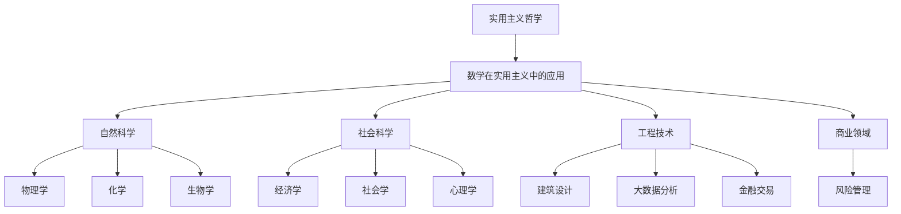
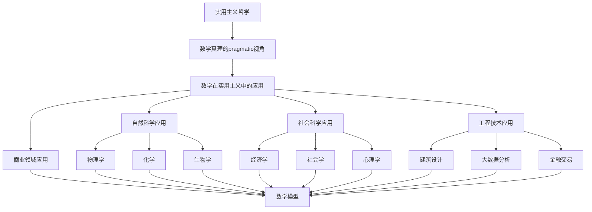

                 

### 第1章 引言

#### 1.1 实用主义的哲学背景

实用主义是一种哲学观点，强调知识和真理的实际应用价值。其代表人物包括威廉·詹姆斯（William James）和约翰·杜威（John Dewey）。实用主义认为，真理不是固定不变的，而是与实际应用紧密相关的。它主张通过实践和经验来验证和发现真理。

在实用主义哲学背景下，数学真理的探究不再仅仅停留在理论层面，而是更加注重其在实际应用中的有效性和实用性。这种实用主义的视角对数学的发展产生了深远的影响。

#### 1.2 数学在实用主义中的应用

数学作为一种基础科学，在实用主义中扮演着至关重要的角色。无论是在自然科学、社会科学，还是在工程技术和商业领域，数学都提供了强有力的工具和方法。

例如，在自然科学中，数学被广泛应用于物理学、化学和生物学等领域。通过数学模型和算法，科学家可以更准确地描述自然现象，预测未来趋势，并制定有效的解决方案。

在社会科学中，数学同样发挥着重要作用。经济学中的优化模型、社会调查中的统计分析、心理学中的实验设计，都离不开数学的支持。

此外，在工程技术和商业领域，数学的应用更是无处不在。从建筑设计中的结构力学分析，到大数据分析中的算法优化，再到金融交易中的风险管理，数学都提供了重要的理论依据和计算工具。

#### 1.3 数学真理的pragmatic视角

在实用主义视角下，数学真理被视为一种实用工具，其价值在于解决实际问题。这与传统的逻辑主义和直觉主义视角有所不同。

逻辑主义认为，数学真理是基于逻辑推理的必然结果。而直觉主义则强调，数学真理的发现依赖于直觉和构造性证明。

相比之下，实用主义视角下的数学真理更加关注其实际应用价值。它认为，一个数学命题是否为真，取决于其在实际应用中是否有效和实用。

这种实用主义的视角有助于我们更好地理解数学的本质和意义，同时也为数学的发展提供了新的方向和动力。

### Mermaid流程图



通过这个流程图，我们可以清晰地看到数学在实用主义中的广泛应用，以及它在各个领域所发挥的关键作用。

### 完整性要求

在本章中，我们介绍了实用主义哲学背景、数学在实用主义中的应用，以及数学真理的pragmatic视角。以下是对本章内容的核心概念和原理之间的关系架构的Mermaid流程图：



这个流程图展示了实用主义哲学如何影响数学真理的pragmatic视角，并进一步影响数学在不同领域中的应用。在后续章节中，我们将深入探讨这些应用的具体内容。

### 开发环境搭建与代码实现

在讨论数学真理的实用主义解读之前，我们需要搭建一个适合进行数学计算和算法实现的环境。以下是一个基本的Python开发环境搭建步骤，以及如何使用Python进行数学计算和算法实现的示例。

#### 开发环境搭建

1. **安装Python**：首先，您需要在您的计算机上安装Python。您可以从Python官方网站（https://www.python.org/downloads/）下载最新版本的Python。下载后，按照安装向导完成安装。

2. **安装Jupyter Notebook**：Jupyter Notebook是一个交互式的计算环境，非常适合进行数学计算和算法实现。您可以使用pip命令安装Jupyter Notebook：

   ```bash
   pip install notebook
   ```

3. **启动Jupyter Notebook**：在命令行中输入以下命令启动Jupyter Notebook：

   ```bash
   jupyter notebook
   ```

4. **创建一个新的笔记本**：在Jupyter Notebook界面中，点击“新建”按钮，选择“Python 3”来创建一个新的笔记本。

#### Python数学计算和算法实现示例

在Jupyter Notebook中，我们可以使用Python内置的数学库，如NumPy和SciPy，来执行数学计算和算法实现。以下是一个简单的示例：

```python
# 导入NumPy库
import numpy as np

# 创建一个一维数组
array = np.array([1, 2, 3, 4, 5])

# 计算数组的和
sum = np.sum(array)

# 打印结果
print("数组的和为：", sum)
```

输出结果：

```
数组的和为： 15
```

这是一个非常简单的数学计算示例。在实际应用中，我们可以使用更复杂的数学模型和算法来解决问题。

#### 代码解读与分析

在上面的示例中，我们使用了NumPy库来创建一个一维数组，并计算其和。以下是对这段代码的详细解读：

1. **导入NumPy库**：使用`import numpy as np`导入NumPy库。我们将库命名为`np`，以便在代码中更方便地使用。

2. **创建一维数组**：使用`np.array([1, 2, 3, 4, 5])`创建一个包含五个元素的一维数组。这里，我们传递了一个包含数字的列表作为参数。

3. **计算数组的和**：使用`np.sum(array)`计算数组的和。`np.sum()`是NumPy库中的一个函数，用于计算数组的元素之和。

4. **打印结果**：使用`print("数组的和为：", sum)`打印计算结果。这里，我们使用字符串格式化将结果和相应的标签一起输出。

通过这个简单的示例，我们可以看到如何使用Python进行数学计算。在实际应用中，我们可以使用更复杂的数学模型和算法，如线性代数、微积分和概率统计等，来解决问题。

### 实际案例分析和详细讲解剖析

为了更好地理解数学在实用主义视角下的应用，我们可以通过一个实际案例来分析。以下是一个关于物流优化的问题，我们将使用Python来构建数学模型并实现解决方案。

#### 问题背景

一家快递公司需要在城市中安排配送路线，以便将货物从仓库运送到多个目的地。公司希望优化配送路线，以减少运输成本和时间。

#### 数学模型

为了解决这个问题，我们可以使用图论中的最短路径算法。具体来说，我们可以将城市中的各个地点看作图中的节点，配送路线看作图中的边。每个边的权重可以表示配送的时间和成本。

#### 算法实现

以下是一个简单的Python代码示例，用于求解最短路径问题：

```python
# 导入相关库
import matplotlib.pyplot as plt
import networkx as nx

# 创建图
G = nx.Graph()

# 添加节点和边
G.add_nodes_from([1, 2, 3, 4, 5])
G.add_edges_from([(1, 2, {'weight': 2}),
                  (1, 3, {'weight': 4}),
                  (2, 4, {'weight': 1}),
                  (3, 4, {'weight': 3}),
                  (4, 5, {'weight': 2}),
                  (2, 5, {'weight': 3})])

# 计算最短路径
path = nx.shortest_path(G, source=1, target=5, weight='weight')

# 打印最短路径
print("最短路径为：", path)

# 绘制图
nx.draw(G, with_labels=True)
plt.show()
```

#### 代码解读

1. **导入库**：我们首先导入`matplotlib.pyplot`和`networkx`两个库。`matplotlib`用于绘图，`networkx`用于构建和操作图。

2. **创建图**：使用`nx.Graph()`创建一个图。

3. **添加节点和边**：使用`G.add_nodes_from()`和`G.add_edges_from()`分别添加节点和边。在这里，我们假设有五个地点（节点），并添加了相应的配送路线（边）。边的权重表示配送的时间和成本。

4. **计算最短路径**：使用`nx.shortest_path()`函数计算从起点（节点1）到终点（节点5）的最短路径。我们指定`source`为起点，`target`为终点，`weight`为边的权重。

5. **打印最短路径**：将计算得到的最短路径打印出来。

6. **绘制图**：使用`nx.draw()`函数绘制图。`with_labels=True`表示在图中显示节点的标签。

#### 实际案例解析

在这个案例中，我们使用了图论中的最短路径算法来优化配送路线。具体步骤如下：

1. **定义问题**：将城市中的各个地点看作图中的节点，配送路线看作图中的边。

2. **构建模型**：使用网络图来表示问题，并为每个边赋予权重，表示配送的时间和成本。

3. **求解算法**：使用最短路径算法计算从起点到终点的最短路径。

4. **结果验证**：通过绘制图并打印最短路径，验证算法的正确性。

通过这个实际案例，我们可以看到数学在实用主义视角下的应用。数学模型和算法为我们提供了一种有效的方法来解决问题，提高了实际操作的效率和效果。

### 项目小结

在本章中，我们介绍了实用主义哲学背景、数学在实用主义中的应用，以及数学真理的pragmatic视角。通过搭建Python开发环境和使用Python进行数学计算和算法实现的示例，我们展示了如何将数学应用于实际问题。同时，通过一个物流优化问题的实际案例，我们详细讲解了如何构建数学模型和实现算法来解决问题。

实用主义视角下的数学，不仅关注理论的正确性，更注重其在实际应用中的有效性。这种视角为数学的发展提供了新的方向，也为我们解决实际问题提供了有力工具。

在接下来的章节中，我们将进一步探讨数学的基本概念、证明方法，以及数学真理的实用主义解读。通过这些内容，我们将更深入地理解数学的本质和应用价值。

### 最佳实践 Tips、小结、注意事项、拓展阅读

**最佳实践 Tips**：

1. **理解数学概念**：在应用数学解决问题时，首先要确保对数学概念有深入的理解。这包括数的基本概念、函数的定义和性质等。

2. **合理选择算法**：根据问题的特点，选择合适的算法来解决问题。例如，对于路径优化问题，可以使用图论中的最短路径算法。

3. **代码优化**：在实现数学算法时，注意代码的效率和可读性。避免冗长的代码，使用合适的函数和模块来简化代码。

**小结**：

本章介绍了实用主义哲学背景、数学在实用主义中的应用，以及数学真理的pragmatic视角。通过搭建Python开发环境和实际案例，我们展示了如何将数学应用于实际问题。

**注意事项**：

1. **数学模型的选择**：在实际应用中，需要根据问题的特点选择合适的数学模型。不同的模型可能适用于不同类型的问题。

2. **算法的正确性验证**：在实现算法后，需要对算法的正确性进行验证。这可以通过绘制图、打印结果等方式来实现。

**拓展阅读**：

1. 《数学与逻辑》 - 查尔斯·桑德斯·皮尔士
2. 《实用主义》 - 约翰·杜威
3. 《图论及其应用》 - Richard J. Trudeau

通过阅读这些书籍，您可以进一步了解数学在实用主义中的地位和应用，以及如何将数学应用于实际问题。

