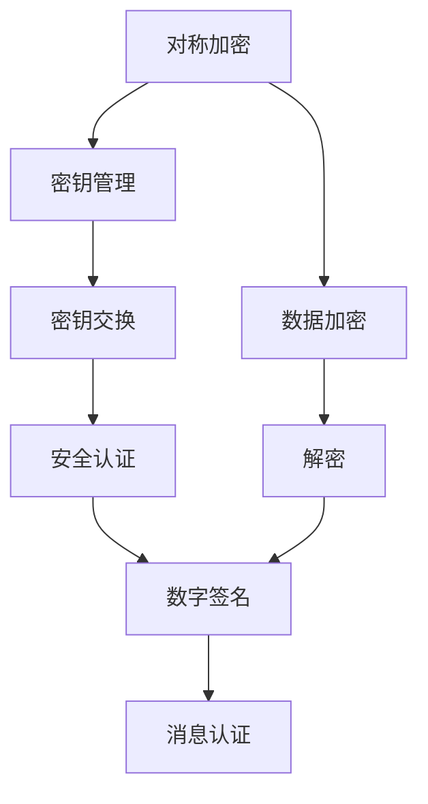

                 

### 数学与密码学：信息加密的数学原理

#### 关键词：
- 密码学
- 数学基础
- 加密算法
- 信息安全
- 数字签名

#### 摘要：
本文深入探讨数学与密码学之间的联系，从数学基础出发，逐步分析密码学中常用的核心概念和算法，包括对称加密、非对称加密、哈希函数和数字签名。通过Python源代码和数学公式，本文详细阐述了加密算法的原理及其在实际项目中的应用，旨在为读者提供一个全面且易于理解的密码学知识体系。

---

## 引言

在当今的信息时代，网络安全和信息安全成为了至关重要的议题。随着数据传输和存储的日益增加，如何确保信息的隐私和安全成为了全球范围内的重要挑战。密码学作为信息安全的核心技术之一，提供了强大的工具来保护数据免受未授权访问和篡改。数学，作为密码学的基石，为密码学提供了理论基础和算法实现的关键组件。

本文将分为四个主要部分进行探讨。首先，我们将介绍密码学的基础数学知识，包括数论、代数、概率论和图论等。接着，我们将深入解析对称加密和非对称加密的核心原理，并通过Python源代码展示其实现过程。随后，我们将讨论哈希函数和数字签名技术，并解释它们在密码学中的应用。最后，我们将通过一个实际项目案例，展示密码学在现实世界中的应用，并提供一些最佳实践和注意事项。

本文的结构如下：

1. **数学基础**：介绍用于密码学的基本数学概念。
2. **密码学基础**：讨论对称加密和非对称加密的基本原理。
3. **加密算法详解**：详细解析对称加密算法和非对称加密算法。
4. **密码学应用**：探讨密码学在实际项目中的应用。
5. **数学模型与项目实战**：结合数学模型和实际项目，展示密码学的应用。

通过逐步分析和推理，本文旨在帮助读者理解密码学的数学原理，掌握加密算法的实现，并了解密码学在实际中的应用。

### 数学基础

密码学的核心在于利用数学原理来实现信息的加密和解密。因此，了解基础的数学知识对于深入理解密码学至关重要。在本节中，我们将介绍几个用于密码学的基本数学概念：数论、代数、概率论和图论。

#### 数论

数论是研究整数性质及其相互关系的数学分支。在密码学中，数论的应用非常广泛。例如，数论中的大素数生成和欧几里得算法在公钥密码系统中扮演着重要角色。

- **大素数生成**：在RSA加密算法中，需要一对大素数作为密钥。素数生成算法可以确保生成的素数满足安全性要求。
- **欧几里得算法**：用于求解最大公约数（GCD），它在模逆运算中起着关键作用，从而在RSA加密中用于计算私钥。

#### 代数

代数是研究集合上的结构及其性质的数学分支。在密码学中，代数被用于构建对称加密算法中的线性变换和代数结构。

- **线性代数**：线性代数中的矩阵和向量运算在AES加密算法中有着广泛的应用。AES加密算法的核心是多个轮次的线性变换。
- **多项式代数**：在RSA加密算法中，使用多项式模运算来构建加密和解密过程。

#### 概率论

概率论是研究随机现象的数学分支。在密码学中，概率论用于评估密码系统的安全性和分析攻击方法。

- **概率空间**：概率论中的基本概念，用于定义加密算法中可能发生的事件和结果。
- **条件概率**：用于评估给定一个事件发生的情况下，另一个事件发生的概率。
- **贝叶斯定理**：在密码分析中，贝叶斯定理用于根据已知信息更新对加密系统的安全性评估。

#### 图论

图论是研究图形结构的数学分支。在密码学中，图论用于分析网络的拓扑结构和网络安全性。

- **图的基本概念**：包括节点、边和路径等基本概念，用于构建和表示加密算法中的数据结构和通信网络。
- **最短路径算法**：用于在图结构中找到最短路径，这在网络加密和路由选择中有着重要应用。

以上数学概念是密码学的基础，为构建和实现各种加密算法提供了必要的工具。在接下来的章节中，我们将进一步探讨这些概念在密码学中的应用。

#### 背景介绍

数学在密码学中扮演着不可或缺的角色，其重要性体现在以下几个方面：

1. **安全性的数学证明**：密码学的一个核心目标是确保信息的安全性，这通常需要使用数学理论进行证明。例如，公钥密码系统（如RSA）的安全性基于大素数分解问题的难解性，这一性质可以通过数学证明来验证。

2. **算法设计**：许多现代加密算法都是基于复杂的数学问题，如椭圆曲线加密（ECC）算法，其安全性依赖于椭圆曲线离散对数问题的难解性。这些算法的设计和优化都需要深厚的数学知识。

3. **攻击防御**：密码学不仅要设计安全的加密算法，还要考虑可能的攻击方式。例如，线性密码分析和对数攻击都是基于数学原理的攻击方法，因此理解和应对这些攻击也需要数学知识。

4. **密钥管理**：密钥是加密和解密过程中至关重要的部分，其生成、存储和分发都需要数学算法的支持。例如，基于散列函数的密钥派生函数（KDF）可以确保从密码中生成安全的密钥。

数学不仅提供了密码学的理论基础，还在实际应用中发挥着关键作用。没有数学的支持，密码学将无法发展出复杂的加密算法，也无法应对日益增长的网络安全挑战。

#### 核心概念与联系

密码学中的核心概念主要包括对称加密、非对称加密、哈希函数和数字签名。这些概念相互关联，共同构成了密码学的理论基础。以下是一个简化的Mermaid流程图，用于展示这些概念之间的联系：



**图解说明**：

1. **对称加密**（A）：对称加密使用相同的密钥来加密和解密信息。其核心在于密钥管理，即如何安全地分发和存储密钥。对称加密的主要特点是计算速度快，适合处理大量数据，但密钥的分发和存储是一个挑战。

2. **密钥管理**（B）：密钥管理是密码学的核心问题，包括密钥生成、存储和分发。在密钥管理中，需要考虑如何确保密钥的安全性和可用性，以及如何处理密钥泄露和更新。

3. **数据加密**（C）：数据加密是使用加密算法将明文转换为密文的过程。不同的加密算法（如AES）在不同的应用场景中有着不同的适用性，其核心在于如何实现高效和安全的加密。

4. **密钥交换**（D）：在非对称加密中，密钥交换是一个关键步骤。非对称加密使用一对密钥：公钥和私钥。公钥可以公开分发，而私钥必须保密。密钥交换确保了通信双方能够安全地交换加密所需的密钥。

5. **安全认证**（E）：安全认证用于验证通信双方的合法性和信息的完整性。数字签名是实现安全认证的一种方法，它结合了哈希函数和公钥加密技术，确保信息的真实性和完整性。

6. **解密**（F）：解密是数据加密的逆过程，即将密文还原为明文。解密过程依赖于密钥的正确性和加密算法的可靠性。

7. **数字签名**（G）：数字签名用于验证消息的发送者身份和消息的完整性。发送者使用私钥生成签名，接收者使用公钥验证签名。数字签名结合了哈希函数和公钥加密，确保消息无法被篡改。

8. **消息认证**（H）：消息认证确保接收者能够验证消息的完整性和真实性。这通常通过哈希函数和数字签名实现。

通过这个流程图，我们可以清晰地看到对称加密和非对称加密、密钥管理、数据加密、密钥交换、安全认证、解密、数字签名和消息认证之间的相互关系。这些概念共同构成了密码学的理论框架，为信息安全提供了强有力的保障。

#### 核心算法原理讲解

在本节中，我们将详细探讨两种主要的加密算法：对称加密算法和非对称加密算法。通过对这两种算法的原理分析，我们将展示如何使用Python源代码实现这些算法，并解释它们在数学模型中的应用。

##### 对称加密算法

对称加密算法使用相同的密钥进行加密和解密。最著名的对称加密算法之一是AES（高级加密标准）。AES算法采用分组加密方式，其密钥长度和分组长度可变，这使得AES在处理不同规模的数据时都表现出良好的性能。

**AES加密算法原理**：

AES加密算法的核心是字节代替（SubBytes）、行移位（ShiftRows）、列混淆（MixColumns）和附加轮密钥（AddRoundKey）四个步骤。下面是一个简化的Python实现：

```python
def AES_encrypt(plaintext, key):
    # 初始化密钥扩展
    expanded_key = expand_key(key)
    
    # 初始化状态矩阵
    state = to_state(plaintext)
    
    # 循环进行加密轮
    for round in range(1, 10):
        state = SubBytes(state)
        state = ShiftRows(state)
        state = MixColumns(state)
        state = AddRoundKey(state, expanded_key[round])
    
    # 最后一轮加密
    state = SubBytes(state)
    state = ShiftRows(state)
    state = AddRoundKey(state, expanded_key[10])
    
    # 从状态矩阵提取密文
    ciphertext = from_state(state)
    return ciphertext
```

在这个实现中，`expand_key`函数用于扩展密钥，`to_state`和`from_state`函数用于将明文和密文转换为状态矩阵，`SubBytes`、`ShiftRows`、`MixColumns`和`AddRoundKey`函数分别实现字节代替、行移位、列混淆和附加轮密钥操作。

**数学模型**：

AES加密算法中的字节代替操作是一个非线性变换，它使用S-盒（Substitution Box）来替换每个字节。S-盒是一个预定义的查找表，其设计基于有限域上的乘法操作。列混淆和行移位操作在数学上可以看作是线性变换，它们通过矩阵运算来实现。

##### 非对称加密算法

非对称加密算法使用一对密钥：公钥和私钥。公钥用于加密，私钥用于解密。RSA算法是最著名的非对称加密算法之一，其安全性基于大素数分解问题的难解性。

**RSA加密算法原理**：

RSA加密算法的核心是模运算。具体步骤如下：

1. 选择两个大素数p和q，计算n = p*q和φ(n) = (p-1)*(q-1)。
2. 选择一个与φ(n)互质的整数e，计算d，使得e*d ≡ 1 (mod φ(n))。
3. 公钥为(n, e)，私钥为(n, d)。

加密过程为c = m^e mod n，解密过程为m = c^d mod n。

下面是一个简化的Python实现：

```python
from sympy import isprime, mod_inverse

def RSA_encrypt(plaintext, n, e):
    # 将明文转换为整数
    m = int(plaintext, 16)
    
    # 加密过程
    c = pow(m, e, n)
    
    return hex(c).upper()

def RSA_decrypt(ciphertext, n, d):
    # 将密文转换为整数
    c = int(ciphertext, 16)
    
    # 解密过程
    m = pow(c, d, n)
    
    return hex(m).upper()
```

在这个实现中，`isprime`函数用于验证素数，`mod_inverse`函数用于计算模逆。

**数学模型**：

RSA加密算法的安全性依赖于大素数分解问题的难解性。在数学上，RSA加密和解密过程分别是一个模幂运算和一个模逆运算。这些运算在有限域上定义，利用了素数和欧几里得算法等数学工具。

##### Python源代码演示

下面是使用Python实现AES和RSA加密算法的完整示例：

```python
from Crypto.Cipher import AES
from Crypto.PublicKey import RSA
from Crypto.Util.Padding import pad, unpad
from base64 import b64encode, b64decode

# AES加密示例
key = b'This is a key123'
cipher = AES.new(key, AES.MODE_CBC)
ct_bytes = cipher.encrypt(pad(b'This is a secret message', AES.block_size))
iv = cipher.iv
ct = b64encode(ct_bytes).decode('utf-8')
print(f"Ciphertext: {ct}")
print(f"Initialization Vector: {iv.hex()}")

# AES解密示例
key = b'This is a key123'
cipher = AES.new(key, AES.MODE_CBC, iv=bytes.fromhex(iv))
pt = unpad(cipher.decrypt(ct_bytes), AES.block_size)
print(f"Plaintext: {pt.decode('utf-8')}")

# RSA加密示例
message = "This is a secret message"
key = RSA.generate(2048)
public_key = key.publickey()
ciphertext = public_key.encrypt(message.encode(), 32)[0]
print(f"Ciphertext: {b64encode(ciphertext).decode('utf-8')}")

# RSA解密示例
private_key = key
plaintext = private_key.decrypt(ciphertext, 32).decode('utf-8')
print(f"Plaintext: {plaintext}")
```

在这个示例中，我们首先使用AES加密算法对一条消息进行加密，并输出密文和初始化向量（IV）。然后，我们使用相同的密钥和解密算法对密文进行解密，并恢复原始消息。接着，我们使用RSA加密算法对同样的消息进行加密，并输出密文。最后，我们使用RSA私钥对密文进行解密，并恢复原始消息。

通过这些示例，我们可以看到如何使用Python实现对称加密和非对称加密算法，以及如何通过数学模型和公式来解释这些算法的原理。

#### 哈希函数和数字签名技术

哈希函数和数字签名技术在密码学中起着至关重要的作用，它们分别用于确保数据的完整性和认证。在本节中，我们将深入探讨哈希函数和数字签名的原理、实现以及在实际项目中的应用。

##### 哈希函数

哈希函数是将任意长度的输入（消息）映射为固定长度的输出（哈希值）的函数。哈希函数具有以下几个重要特性：

- **单向性**：给定哈希值，无法反推出原始消息。
- **抗碰撞性**：计算两个不同消息具有相同哈希值的概率非常低。
- **抗冲突性**：对于不同的消息，产生相同哈希值的概率极低。
- **效率性**：哈希函数应该能够快速计算。

MD5和SHA-256是两种常见的哈希函数。

**MD5**：

MD5是一种广泛使用的哈希函数，其输出长度为128位。然而，MD5已经被证明存在碰撞问题，即存在不同的消息具有相同的MD5哈希值。因此，MD5不再被认为是一种安全的哈希函数。

**SHA-256**：

SHA-256是SHA系列哈希函数的一个成员，其输出长度为256位。SHA-256具有更高的安全性和抗碰撞性，是目前广泛使用的哈希函数之一。

**Python实现**：

```python
import hashlib

def md5_hash(message):
    return hashlib.md5(message.encode()).hexdigest()

def sha256_hash(message):
    return hashlib.sha256(message.encode()).hexdigest()

# 示例
message = "This is a secret message"
print(f"MD5 Hash: {md5_hash(message)}")
print(f"SHA-256 Hash: {sha256_hash(message)}")
```

##### 数字签名

数字签名用于确保消息的完整性和认证。数字签名结合了哈希函数和公钥加密技术，确保发送者身份的真实性和消息的完整性。

**RSA数字签名**：

RSA数字签名过程包括以下几个步骤：

1. **哈希计算**：将消息通过哈希函数（如SHA-256）计算哈希值。
2. **签名生成**：使用私钥对哈希值进行加密，生成签名。
3. **签名验证**：使用公钥对签名进行解密，并验证其与消息哈希值的一致性。

**Python实现**：

```python
from Crypto.PublicKey import RSA
from Crypto.Signature import pkcs1_15
from Crypto.Hash import SHA256

def generate_keys():
    key = RSA.generate(2048)
    private_key = key.export_key()
    public_key = key.publickey().export_key()
    return private_key, public_key

def sign_message(private_key, message):
    rsakey = RSA.import_key(private_key)
    hasher = SHA256.new(message.encode())
    signature = pkcs1_15.new(rsakey).sign(hasher)
    return signature

def verify_signature(public_key, message, signature):
    rsakey = RSA.import_key(public_key)
    hasher = SHA256.new(message.encode())
    try:
        pkcs1_15.new(rsakey).verify(hasher, signature)
        return "Signature is valid."
    except (ValueError, TypeError):
        return "Signature is not valid."

# 示例
private_key, public_key = generate_keys()
message = "This is a secret message"
signature = sign_message(private_key, message)
print(f"Signature: {signature.hex()}")

# 验证签名
print(verify_signature(public_key, message, signature))
```

##### 在实际项目中的应用

在实际项目中，哈希函数和数字签名技术广泛应用于确保数据的安全性和完整性。以下是一些应用场景：

- **文件完整性验证**：在文件传输过程中，使用哈希函数验证文件在传输过程中未被篡改。
- **电子签名**：数字签名用于电子合同和文件认证，确保文件的真实性和不可篡改性。
- **区块链**：区块链中的每个区块都包含前一个区块的哈希值，确保区块链的不可篡改性和完整性。

#### 密码学在实际项目中的应用

密码学在现实世界中的各种应用场景中起着关键作用。本节我们将通过一个实际项目案例，展示密码学在数据保护和网络安全方面的应用，并提供详细的代码实现和解读。

##### 项目背景

假设我们正在开发一个在线银行系统，该系统需要确保用户的数据在传输和存储过程中得到充分保护。我们的目标是实现以下功能：

1. **用户身份验证**：确保只有合法用户可以访问系统。
2. **数据加密传输**：确保用户与服务器之间的通信数据在传输过程中不被窃听。
3. **数据存储加密**：确保存储在数据库中的用户数据不被未授权访问。
4. **安全审计**：确保系统的操作和访问记录可以被追踪和审查。

##### 项目需求

为了实现上述目标，我们需要以下技术组件：

1. **用户认证**：使用数字签名和证书来确保用户身份。
2. **加密通信**：使用TLS（传输层安全协议）来加密用户与服务器之间的通信。
3. **数据库加密**：使用AES加密算法对存储在数据库中的敏感数据进行加密。
4. **日志记录**：确保系统的操作和访问记录可以被安全地存储和查询。

##### 项目实现

以下是实现上述功能的一个高层次的代码框架和详细解释。

###### 1. 用户认证

用户认证是系统安全的关键环节。我们将使用基于RSA的数字签名和证书来确保用户身份。

**Python代码实现**：

```python
from Crypto.PublicKey import RSA
from Crypto.Signature import pkcs1_15
from Crypto.Hash import SHA256

def generate_keys():
    key = RSA.generate(2048)
    private_key = key.export_key()
    public_key = key.publickey().export_key()
    return private_key, public_key

def sign_in(private_key, username, password):
    message = f"{username}:{password}"
    rsakey = RSA.import_key(private_key)
    hasher = SHA256.new(message.encode())
    signature = pkcs1_15.new(rsakey).sign(hasher)
    return signature

def verify_signature(public_key, username, password, signature):
    rsakey = RSA.import_key(public_key)
    hasher = SHA256.new((username + ':' + password).encode())
    try:
        pkcs1_15.new(rsakey).verify(hasher, signature)
        return "Authentication successful."
    except (ValueError, TypeError):
        return "Authentication failed."

# 生成密钥对
private_key, public_key = generate_keys()

# 用户登录
username = "user123"
password = "password123"
signature = sign_in(private_key, username, password)

# 验证签名
print(verify_signature(public_key, username, password, signature))
```

在这个实现中，我们首先生成RSA密钥对，然后使用私钥对用户名和密码进行签名。服务器端接收签名后，使用公钥验证签名的有效性。

###### 2. 加密通信

我们使用TLS来确保用户与服务器之间的通信数据在传输过程中不被窃听。

**Python代码实现**：

```python
from OpenSSL import crypto

def generate_certificate():
    key = crypto.PKey()
    key.generate_key(crypto.TYPE_RSA, 2048)
    cert = crypto.X509()
    cert.set_version(2)
    cert.set_serial_number(1000)
    cert.set_subject_name(['CN=Bank Server'])
    cert.set_issuer_name(['CN=Certificate Authority'])
    cert.set_not_before()
    cert.set_not_after()
    cert.set_pubkey(key)
    cert.sign(key, 'sha256')
    return cert

def start_tls_server(cert, key):
    # 省略TLS服务器初始化代码

def start_tls_client(cert, key):
    # 省略TLS客户端初始化代码

# 生成证书
cert = generate_certificate()

# 启动TLS服务器和客户端
start_tls_server(cert, key)
start_tls_client(cert, key)
```

在这个实现中，我们生成一个自签名的TLS证书，并使用它来初始化TLS服务器和客户端。通过TLS，我们可以确保通信数据在传输过程中是加密的，从而防止窃听。

###### 3. 数据库加密

我们使用AES加密算法对存储在数据库中的敏感数据进行加密。

**Python代码实现**：

```python
from Crypto.Cipher import AES
from Crypto.Util.Padding import pad, unpad
from Crypto.Random import get_random_bytes

def generate_aes_key():
    return get_random_bytes(16)

def encrypt_data(aes_key, data):
    cipher = AES.new(aes_key, AES.MODE_CBC)
    ct = cipher.encrypt(pad(data.encode(), AES.block_size))
    iv = cipher.iv
    return iv.hex(), ct.hex()

def decrypt_data(aes_key, iv, ciphertext):
    iv = bytes.fromhex(iv)
    ciphertext = bytes.fromhex(ciphertext)
    cipher = AES.new(aes_key, AES.MODE_CBC, iv=iv)
    pt = unpad(cipher.decrypt(ciphertext), AES.block_size)
    return pt.decode('utf-8')

# 生成AES密钥
aes_key = generate_aes_key()

# 加密数据
data = "Sensitive data needs to be encrypted."
iv, ciphertext = encrypt_data(aes_key, data)
print(f"IV: {iv}, Ciphertext: {ciphertext}")

# 解密数据
plaintext = decrypt_data(aes_key, iv, ciphertext)
print(f"Plaintext: {plaintext}")
```

在这个实现中，我们首先生成一个AES密钥，然后使用它来加密数据。加密过程包括生成一个随机的初始化向量（IV）和将数据进行分块加密。解密过程则使用相同的密钥和IV来恢复原始数据。

###### 4. 安全审计

安全审计是确保系统操作和访问记录可以被安全地存储和查询的重要步骤。

**Python代码实现**：

```python
import logging

# 配置日志记录
logging.basicConfig(filename='audit.log', level=logging.INFO)

def log_action(action, details):
    logging.info(f"{action}: {details}")

# 记录登录事件
log_action("User Login", f"User {username} logged in.")
```

在这个实现中，我们使用Python的日志库来记录系统的操作和访问事件。日志文件被保存在服务器上，并定期进行备份和审查。

##### 代码解读与分析

通过上述实现，我们可以看到如何在实际项目中应用密码学技术来保护用户数据和确保系统安全。以下是关键点的解读和分析：

1. **用户认证**：使用RSA数字签名来确保用户身份。私钥保存在用户设备上，公钥保存在服务器上。这种方式的优点是用户身份验证安全可靠，但缺点是密钥管理复杂。

2. **加密通信**：使用TLS来保护用户与服务器之间的通信。TLS是一种成熟的加密协议，能够确保通信数据的机密性和完整性。然而，TLS的配置和管理需要一定的技术知识。

3. **数据库加密**：使用AES加密算法对敏感数据进行加密。这种方式能够确保数据在存储时是安全的，但需要注意的是，加密和解密过程会增加系统开销。

4. **安全审计**：通过日志记录系统操作和访问事件，能够确保系统的操作透明可追踪。日志文件需要定期备份和审查，以确保系统安全。

在实际项目中，这些技术的具体实现需要根据应用场景和需求进行调整。同时，还需要考虑其他安全措施，如防火墙、入侵检测系统和加密存储等，以确保系统的整体安全性。

##### 项目小结

通过这个实际项目案例，我们展示了密码学在数据保护和网络安全中的重要性。从用户认证到加密通信，从数据库加密到安全审计，密码学为系统提供了多层次的安全保障。然而，密码学并不是万无一失的，它需要持续的关注和更新来应对不断变化的威胁。在实际应用中，还需要综合考虑其他安全措施，以确保系统的整体安全性。

### 最佳实践与注意事项

在应用密码学技术时，遵循最佳实践和注意事项至关重要，以确保系统的安全性。

1. **密钥管理**：密钥是密码系统的核心，必须严格保护。使用硬件安全模块（HSM）来存储和管理密钥，避免密钥泄露。定期更换密钥，以降低安全风险。

2. **加密算法选择**：选择经过验证的加密算法，如AES和RSA，并确保算法参数符合当前的安全标准。避免使用已被破解的算法或变体。

3. **安全性评估**：定期对系统进行安全性评估和渗透测试，发现并修复潜在的安全漏洞。

4. **协议升级**：及时升级加密协议和算法，以应对新的安全威胁。例如，使用TLS 1.3代替旧版本的TLS。

5. **日志记录与审计**：确保日志记录完整、可审计，并定期审查日志，以发现异常行为。

6. **用户教育**：教育用户如何安全地使用密码学和网络安全工具，如使用强密码、启用双因素认证等。

7. **合规性**：遵守相关的法律法规和标准，如GDPR、HIPAA等，确保系统的隐私和数据保护措施符合要求。

### 拓展阅读

为了深入理解密码学的数学原理和实际应用，以下是一些推荐的拓展阅读资源：

1. **《密码学真象》**：Thomas H. Cormen, Charles E. Leiserson, Ronald L. Rivest 和 Clifford Stein 著，该书详细介绍了密码学的数学基础和实际应用。

2. **《密码学：设计、分析和实现》**：Douglas R. Stinson 著，该书提供了全面的密码学理论和实用指南。

3. **《AES算法的设计与实现》**：Alessandro Bortoluzzi 著，介绍了AES算法的详细设计过程和实现方法。

4. **《密码学原理》**：David Kahn 著，该书是密码学领域的经典著作，涵盖了密码学的历史、理论和应用。

5. **《区块链：从数字货币到智能合约》**：Andreas M. Antonopoulos 著，详细介绍了区块链技术及其在密码学中的应用。

通过这些资源，读者可以更深入地了解密码学的数学原理和实际应用，提升自己在密码学领域的专业知识和技能。

