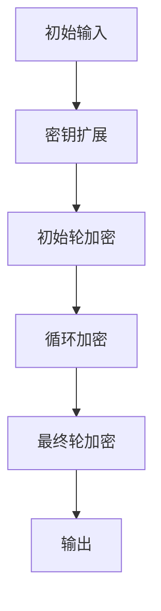

                 

### 摘要

《数学与密码学：信息安全的数学基础》旨在深入探讨数学在密码学中的基础作用，揭示其核心原理和应用。本书将带领读者从数学基础出发，逐步走进密码学的世界，了解数论、离散数学等核心概念，掌握密码学的基础知识和应用。通过具体的实例和代码实现，读者将能够更好地理解密码算法的工作原理，并在实践中应用所学知识。本书既适合对信息安全感兴趣的读者，也适合从事密码学研究与开发的从业者，旨在为广大读者提供一本既有深度又具实用性的技术书籍。

### 文章标题

《数学与密码学：信息安全的数学基础》

### 关键词

密码学、信息安全、数学基础、算法原理、实际应用

### 目录

## 第一部分：数学基础

### 第1章：数学基础概述

- **1.1 数学与密码学的关系**
- **1.2 数学在信息安全中的重要性**
- **1.3 本书结构概述**

### 第2章：数论基础

- **2.1 整数的概念**
- **2.2 最大公约数与最小公倍数**
- **2.3 约数和因子**
- **2.4 同余与模运算**
  - **2.4.1 Mermaid流程图：同余运算的示例**
  - **2.4.2 伪代码：模逆元的求解**

### 第3章：离散数学基础

- **3.1 集合与逻辑运算**
- **3.2 图论基础**
- **3.3 计数原理**

### 第4章：密码学基础

- **4.1 密码学概述**
- **4.2 对称密码与非对称密码**
- **4.3 密钥分发与管理**
- **4.4 Mermaid流程图：AES加密算法流程**
- **4.4.1 伪代码：AES加密算法的核心步骤**

## 第二部分：密码学应用

### 第5章：哈希函数与数字签名

- **5.1 哈希函数概述**
- **5.2 SHA系列哈希函数**
- **5.3 数字签名算法**
- **5.4 伪代码：RSA签名算法**

### 第6章：公钥基础设施（PKI）

- **6.1 PKI概述**
- **6.2 证书权威（CA）**
- **6.3 证书链与证书验证**
- **6.4 伪代码：证书链验证流程**

### 第7章：密码学在网络安全中的应用

- **7.1 网络安全概述**
- **7.2 密码学在网络通信中的应用**
- **7.3 安全协议与标准**
- **7.4 项目实战：TLS/SSL协议分析**

### 附录

- **附录A：数学与密码学工具和资源**

### 作者信息

作者：AI天才研究院/AI Genius Institute & 禅与计算机程序设计艺术 /Zen And The Art of Computer Programming

## 引言

### 数学与密码学的交汇

密码学是信息安全的核心学科，致力于保护信息的保密性、完整性和可用性。然而，密码学的实现和可靠性都依赖于数学的强大工具和理论。从古老的恺撒密码到现代的RSA加密算法，数学在密码学中扮演着至关重要的角色。

本章节旨在深入探讨数学与密码学之间的密切联系，解释数学如何成为构建安全通信系统的基础。通过系统的学习和理解数学的基本概念，读者将能够更好地掌握密码学的核心原理和实现方法。

### 数学基础的重要性

在密码学中，数学基础的重要性不容忽视。数论、离散数学和概率论等数学分支为密码学提供了坚实的理论基础。例如，数论中的同余概念和模运算在构建非对称密码算法中起着关键作用。离散数学中的集合和图论则为加密算法的设计和安全性分析提供了有效的工具。

在本章节中，我们将从基础数学概念入手，逐步深入到更复杂的数学理论。通过这种逐步分析的方式，读者将能够更好地理解数学与密码学之间的内在联系。

### 结构安排

本书的结构分为两部分。第一部分是数学基础，包括数论基础和离散数学基础。第二部分是密码学应用，涵盖了哈希函数、数字签名、公钥基础设施（PKI）和网络安全。每一章节都包含详细的讲解、伪代码示例和实际应用案例，旨在帮助读者全面掌握密码学的基础知识和实践技能。

接下来，我们将首先介绍数学基础，从整数的概念开始，逐步深入到同余与模运算。在此基础上，我们将进一步探讨离散数学和密码学的基础知识，帮助读者建立完整的数学与密码学知识体系。

### 第一部分：数学基础

### 第1章：数学基础概述

数学在密码学中的重要性不可低估。密码学的许多核心概念和算法都依赖于数学的强大工具和理论。从基础的代数和数论到更复杂的概率论和图论，数学为密码学的实现提供了坚实的理论基础。

在本章中，我们将探讨数学在密码学中的基础作用，介绍数学在信息安全中的重要性，并概述本书的结构。通过这些内容，读者将为后续章节的学习打下坚实的基础。

### 1.1 数学与密码学的关系

数学与密码学的关系密不可分。密码学中的许多算法和协议都依赖于数学的基本原理和工具。例如：

- **数论**：数论中的同余概念和模运算在非对称密码算法中起着关键作用。RSA算法就是基于数论中的大素数分解问题。
- **离散数学**：离散数学中的集合、图论和逻辑运算为加密算法的设计和安全性分析提供了有效的工具。例如，图论中的图论网络结构和图算法在网络安全分析中广泛应用。
- **概率论**：概率论中的随机性理论和概率分布为密码学中的伪随机数生成和安全性分析提供了理论基础。

总之，数学不仅为密码学提供了实现手段，还为其提供了理论基础。没有数学的支持，密码学将失去其核心的可靠性和安全性。

### 1.2 数学在信息安全中的重要性

数学在信息安全中的重要性体现在多个方面。以下是几个关键点：

- **加密算法**：加密算法的可靠性和有效性取决于其数学基础。复杂的数学模型和算法使得加密算法能够抵抗各种攻击，保护信息的保密性。
- **安全协议**：安全协议的设计和实现也依赖于数学。例如，公钥基础设施（PKI）中的证书链验证和数字签名都基于数学原理。
- **安全性分析**：密码学中的安全性分析需要使用数学工具来评估算法的强度和漏洞。例如，通过概率论和统计方法来分析密码算法的攻击面。

总之，数学不仅是信息安全的技术手段，更是其理论基础。只有深入理解数学，才能设计出更加安全和可靠的加密系统。

### 1.3 本书结构概述

本书分为两部分，每部分都有其独特的重点和目标。

- **第一部分：数学基础**：包括数论基础和离散数学基础。这部分内容旨在帮助读者建立数学与密码学之间的联系，掌握基本的数学工具和理论。

  - **数论基础**：介绍整数概念、最大公约数与最小公倍数、约数和因子、同余与模运算等核心概念。这部分内容将为非对称密码算法的理解打下基础。
  - **离散数学基础**：涵盖集合与逻辑运算、图论基础、计数原理等核心内容。这部分内容将为理解加密算法的设计和安全分析提供工具。

- **第二部分：密码学应用**：包括哈希函数、数字签名、公钥基础设施（PKI）和网络安全。这部分内容将展示数学在密码学中的实际应用，帮助读者理解密码算法在实际系统中的工作原理。

  - **哈希函数与数字签名**：介绍哈希函数的概念、SHA系列哈希函数、数字签名算法和RSA签名算法。这部分内容将帮助读者理解如何使用数学原理来保护数据的完整性和真实性。
  - **公钥基础设施（PKI）**：介绍PKI的概述、证书权威（CA）、证书链和证书验证。这部分内容将帮助读者理解如何管理和使用数字证书。
  - **网络安全**：介绍网络安全概述、密码学在网络通信中的应用、安全协议和标准。这部分内容将帮助读者了解如何使用密码学来保护网络通信。

通过本书的系统学习，读者将能够全面掌握数学与密码学的核心知识和实际应用技能，为未来的学习和工作打下坚实的基础。

### 第2章：数论基础

数论是数学中的一个重要分支，它在密码学中扮演着至关重要的角色。数论中的许多概念和定理，如同余、模运算、素数分布等，都是构建现代密码系统的基础。本章将介绍数论中的一些核心概念，包括整数的概念、最大公约数与最小公倍数、约数和因子、同余与模运算，并通过Mermaid流程图和伪代码示例来帮助读者深入理解这些概念。

### 2.1 整数的概念

整数是数学中最基本的概念之一。整数集包括正整数、负整数和零。在数论中，整数的一些基本性质和运算具有重要意义。

- **定义**：整数是数学中的基本对象，它们包括正整数（1, 2, 3, ...）、负整数（-1, -2, -3, ...）和零（0）。
- **基本性质**：整数具有封闭性、交换性、结合性和分配性等基本性质。
- **运算**：整数的运算包括加法、减法、乘法和除法。除法在整数域中可能不总是封闭的，因为除以零是没有定义的。

了解整数的概念是理解数论的基础。在实际应用中，整数运算经常用于加密算法中的数值计算和密钥生成。

### 2.2 最大公约数与最小公倍数

最大公约数（Greatest Common Divisor，GCD）和最小公倍数（Least Common Multiple，LCM）是数论中两个重要的概念。

- **最大公约数**：两个或多个整数的最大公约数是同时能够整除这些整数的最大正整数。例如，12和18的最大公约数是6。
- **最小公倍数**：两个或多个整数的最小公倍数是同时被这些整数整除的最小正整数。例如，12和18的最小公倍数是36。

计算最大公约数和最小公倍数的方法有很多，其中最常用的是欧几里得算法。

- **欧几里得算法**：这是一个递归算法，用于计算两个整数的最大公约数。基本思想是不断用较小的数去除较大的数，然后用余数替换较大的数，重复这个过程，直到余数为0。此时的较小数即为最大公约数。

以下是计算最大公约数的伪代码：

```python
def gcd(a, b):
    while b != 0:
        temp = b
        b = a % b
        a = temp
    return a
```

使用欧几里得算法，我们可以计算任意两个整数的最大公约数。

### 2.3 约数和因子

约数（Divisor）和因子（Factor）是数论中的基本概念。一个数的约数是能够整除这个数的正整数，而一个数的因子是能够整除这个数并且不为这个数的正整数。

- **定义**：对于一个整数n，如果存在一个整数d，使得n能够被d整除，那么d就是n的一个约数。例如，6的约数有1、2、3和6。
- **因数**：一个数的因数是其约数中不等于这个数本身的正整数。

例如，对于整数12，其约数为1、2、3、4、6和12，而因数为1、2、3和6。

### 2.4 同余与模运算

同余和模运算是数论中的核心概念，它们在密码学中具有重要应用。

- **同余**：如果两个整数a和b除以一个正整数m得到的余数相同，则称a和b对于模m同余。同余可以表示为a ≡ b (mod m)。
- **模运算**：模运算是一种基本的数学运算，用于计算一个数除以另一个数的余数。模运算可以表示为a mod m。

同余和模运算的关系如下：如果a ≡ b (mod m)，那么a mod m = b mod m。

同余运算具有以下几个重要性质：

1. **封闭性**：如果a ≡ b (mod m)且c ≡ d (mod m)，则(a + c) ≡ (b + d) (mod m)。
2. **结合性**：对于任意的整数a、b、c，有(a ≡ b (mod m)) ≡ (c ≡ d (mod m)) (mod m)。
3. **交换性**：如果a ≡ b (mod m)，则b ≡ a (mod m)。

同余运算在密码学中有着广泛的应用，特别是在非对称加密算法中，如RSA算法。

### 2.4.1 Mermaid流程图：同余运算的示例

为了更好地理解同余运算，我们可以使用Mermaid流程图来展示一个具体的例子。以下是计算5和8对于模7的同余的流程图：

```mermaid
graph TD
A[开始] --> B[计算5 mod 7]
B --> C[计算8 mod 7]
C --> D[比较余数]
D -->| 相等 | E[5 ≡ 8 (mod 7)]
E --> F[结束]
```

通过这个流程图，我们可以清晰地看到同余运算的步骤和结果。

### 2.4.2 伪代码：模逆元的求解

模逆元是同余运算中的重要概念。如果整数a和模m满足a * a' ≡ 1 (mod m)，则称a'为a关于模m的模逆元。模逆元的求解在密码学中非常重要，特别是在非对称加密算法中。

以下是使用扩展欧几里得算法求解模逆元的伪代码：

```python
def extended_gcd(a, b):
    if a == 0:
        return (b, 0, 1)
    else:
        g, x, y = extended_gcd(b % a, a)
        return (g, y - (b // a) * x, x)

def mod_inverse(a, m):
    g, x, _ = extended_gcd(a, m)
    if g != 1:
        raise Exception('Modular inverse does not exist')
    else:
        return x % m
```

通过上述伪代码，我们可以求解任意整数a关于模m的模逆元。

### 总结

通过本章的介绍，我们了解了数论中的一些核心概念，包括整数的概念、最大公约数与最小公倍数、约数和因子、同余与模运算。这些概念不仅在数学理论中具有重要意义，也在密码学中发挥着关键作用。通过Mermaid流程图和伪代码示例，我们深入理解了这些概念的具体应用，为后续章节的学习奠定了坚实的基础。

在下一章中，我们将继续探讨离散数学基础，包括集合与逻辑运算、图论基础和计数原理。这些离散数学的概念将为理解密码学中的更复杂算法提供必要的工具。

### 第3章：离散数学基础

离散数学是数学的一个分支，它提供了研究离散结构的工具和方法。在密码学中，离散数学的概念和工具具有重要作用，尤其是在加密算法的设计和安全性分析中。本章将介绍离散数学中的核心概念，包括集合与逻辑运算、图论基础和计数原理。这些概念将为理解密码学中的高级算法提供必要的数学基础。

### 3.1 集合与逻辑运算

集合是离散数学中最基本的概念之一，它由一组确定的、无序的元素构成。集合在密码学中有着广泛的应用，例如用于描述密钥空间、消息空间等。

- **定义**：集合是由确定的元素构成的集合，通常用大写字母表示，如A、B等。集合中的元素用小写字母表示，如a、b等。
- **基本性质**：集合具有封闭性、交换性、结合性和分配性等基本性质。
- **集合运算**：集合的基本运算包括并集、交集、补集和差集。

**并集（Union）**：两个集合A和B的并集是由属于A或B的元素组成的集合。用符号∪表示。例如，如果A={1, 2, 3}，B={3, 4, 5}，则A∪B={1, 2, 3, 4, 5}。

**交集（Intersection）**：两个集合A和B的交集是由同时属于A和B的元素组成的集合。用符号∩表示。例如，如果A={1, 2, 3}，B={3, 4, 5}，则A∩B={3}。

**补集（Complement）**：一个集合A的补集是由不属于A的元素组成的集合。用符号\( A' \)或\( \overline{A} \)表示。例如，如果A={1, 2, 3}，则A'={4, 5, 6}。

**差集（Difference）**：两个集合A和B的差集是由属于A但不属于B的元素组成的集合。用符号\( A - B \)或\( A \backslash B \)表示。例如，如果A={1, 2, 3}，B={3, 4, 5}，则A - B={1, 2}。

集合运算在密码学中有着广泛的应用，例如用于定义密钥空间和消息空间，以及用于分析密码算法的安全性。

### 逻辑运算

逻辑运算是离散数学中的另一个重要概念，它用于处理布尔值（True或False）的逻辑组合。逻辑运算符包括逻辑与（AND）、逻辑或（OR）和逻辑非（NOT）。

- **逻辑与（AND）**：逻辑与运算符用于表示两个布尔值同时为真。例如，如果p和q都是真，则p AND q也为真；否则，为假。
- **逻辑或（OR）**：逻辑或运算符用于表示两个布尔值中至少有一个为真。例如，如果p和q至少有一个为真，则p OR q也为真；否则，为假。
- **逻辑非（NOT）**：逻辑非运算符用于表示一个布尔值的否定。例如，如果p为真，则NOT p为假；如果p为假，则NOT p为真。

逻辑运算在密码学中有着广泛的应用，例如用于定义密码算法的安全属性和安全协议。

### 3.2 图论基础

图论是离散数学的一个分支，它研究图的结构和性质。在密码学中，图论用于描述网络安全架构、加密算法的攻击面等。

- **定义**：图是由顶点和边组成的集合，通常表示为G=(V, E)，其中V是顶点的集合，E是边的集合。
- **基本概念**：图的基本概念包括顶点（Vertex）、边（Edge）、路径（Path）、连通性（Connectivity）和度（Degree）。

**顶点和边**：顶点是图中的基本元素，表示实体或节点。边是连接两个顶点的线段，表示顶点之间的连接关系。

**路径**：路径是图中顶点序列，表示从起点到终点的连接。连通性是图的一个性质，表示图中任意两个顶点之间是否存在路径。

**度**：度是顶点在图中连接的边数，分为入度和出度。

图论中的图可以分为无向图和有向图。无向图中的边没有方向，而有向图中的边有方向。

### 图的基本性质

- **连通性**：无向图中的任意两个顶点之间都存在路径，则称图是连通的。有向图中，任意两个顶点之间都存在有向路径，则称图是强连通的。
- **欧拉图**：欧拉图是具有欧拉回路的连通图，即图中每条边都恰好被访问一次的回路。
- **汉密尔顿图**：汉密尔顿图是存在一个闭合路径，该路径访问图中的每一个顶点一次的图。

图论在密码学中有着广泛的应用，例如用于设计网络拓扑、分析密码算法的攻击面等。

### 3.3 计数原理

计数原理是离散数学中的一个重要概念，它用于计算事件的概率和数量。计数原理在密码学中用于评估加密算法的安全性、计算密钥空间的大小等。

- **加法原理**：如果一个事件可以通过两种方式发生，那么这个事件的总可能性就是这两种方式的可能性的和。例如，从两个不同的集合中选择元素的总方法数是两个集合各自选择方法数的和。
- **乘法原理**：如果一个事件可以通过多个步骤发生，每个步骤有固定的选择方式，那么这个事件的总可能性就是每个步骤选择方式的乘积。例如，从多个集合中选择元素的总方法数是每个集合选择方法数的乘积。

计数原理在密码学中的应用包括：

- **密钥空间计算**：计算可能的密钥数量，例如在RSA加密算法中，密钥空间的大小取决于素数的选取范围。
- **概率分析**：评估密码算法的安全性，例如通过计算成功的攻击概率来判断算法的强度。

### 总结

通过本章的介绍，我们了解了离散数学中的核心概念，包括集合与逻辑运算、图论基础和计数原理。这些概念在密码学中具有重要应用，为理解和设计加密算法提供了必要的数学工具。通过具体例子和解释，我们深入理解了这些概念的具体应用和重要性。

在下一章中，我们将继续探讨密码学基础，包括密码学的基本概念、对称密码和非对称密码以及密钥分发与管理。这些内容将为读者提供密码学的全局视野，并深入了解密码学在实际应用中的工作原理。

### 第4章：密码学基础

密码学是信息安全的核心领域，其目标是保护信息的保密性、完整性和可用性。在本章中，我们将探讨密码学的基础概念，包括对称密码和非对称密码的基本原理，以及密钥的分发和管理。通过这些内容，我们将为后续章节中更复杂密码算法的理解和应用奠定基础。

#### 4.1 密码学概述

密码学（Cryptography）是一门研究如何通过数学和算法来保护信息的安全性的学科。它的主要目标包括：

- **保密性**：确保只有授权用户可以读取和理解信息。
- **完整性**：确保信息在传输过程中不被篡改或损坏。
- **认证**：验证信息的发送者和接收者身份的真实性。
- **非否认性**：确保发送者无法否认已经发送的信息。

密码学分为经典密码学和现代密码学。经典密码学主要关注传统的加密方法，如替换密码和移位密码。现代密码学则基于复杂的数学理论，包括数论、信息论和计算复杂性理论。

#### 4.2 对称密码与非对称密码

密码学的主要分类是对称密码（Symmetric Cryptography）和非对称密码（Asymmetric Cryptography）。

**对称密码**：

- **定义**：对称密码使用相同的密钥来加密和解密信息。这意味着加密者和解密者都需要知道同一个密钥。
- **优点**：加密速度快，计算效率高。
- **缺点**：密钥分发和管理困难，因为需要确保密钥在传输过程中不被泄露。

常见的对称加密算法包括：

- **DES（Data Encryption Standard）**：由美国国家标准局于1977年发布，使用56位密钥。
- **AES（Advanced Encryption Standard）**：继DES之后发布，使用128、192或256位密钥，是目前最常用的对称加密算法。

**非对称密码**：

- **定义**：非对称密码使用一对密钥，即公钥和私钥。公钥用于加密，私钥用于解密。
- **优点**：解决了密钥分发问题，因为公钥可以公开，而私钥保持秘密。
- **缺点**：加密和解密速度相对较慢。

常见的非对称加密算法包括：

- **RSA（Rivest-Shamir-Adleman）**：基于大素数分解问题的困难性。
- **ECC（Elliptic Curve Cryptography）**：基于椭圆曲线离散对数问题的困难性。

**对称密码与非对称密码的对比**：

| 特性 | 对称密码 | 非对称密码 |
| --- | --- | --- |
| 密钥管理 | 需要安全的密钥交换机制 | 使用公钥加密，私钥解密，简化密钥管理 |
| 加密速度 | 快 | 慢 |
| 密钥长度 | 较短 | 较长 |
| 安全性 | 相对较低，依赖密钥长度 | 高，但计算复杂度高 |

在实际应用中，对称密码和非对称密码经常结合使用。例如，在SSL/TLS协议中，通常使用非对称密码进行密钥交换，然后使用对称密码进行实际的数据加密。

#### 4.3 密钥分发与管理

密钥分发和管理是密码学中的关键挑战。以下是一些常见的密钥分发和管理方法：

- **密钥中心**：集中管理的密钥存储和分发中心，用于分发和管理密钥。
- **证书权威（CA）**：负责颁发和管理数字证书的机构，确保密钥的分发和验证。
- **公钥基础设施（PKI）**：基于证书权威的密钥管理框架，用于数字证书的创建、分发、存储和验证。

密钥管理的关键在于确保密钥的安全性和完整性。以下是一些密钥管理的最佳实践：

- **密钥生成**：使用强随机数生成器生成密钥，确保密钥的随机性和安全性。
- **密钥存储**：将密钥存储在安全的存储设备中，如硬件安全模块（HSM）。
- **密钥轮换**：定期更换密钥，以减少长期暴露的风险。
- **访问控制**：确保只有授权用户可以访问密钥，使用强密码和双因素身份验证。
- **审计和监控**：监控密钥的使用情况，记录和审计密钥相关的操作。

#### 4.4 Mermaid流程图：AES加密算法流程

AES（Advanced Encryption Standard）是一种对称加密算法，采用128位密钥，可以支持128、192或256位的数据块加密。以下是AES加密算法的基本流程，使用Mermaid流程图进行展示：



#### 4.4.1 伪代码：AES加密算法的核心步骤

以下是AES加密算法的核心步骤的伪代码：

```python
# 初始化密钥扩展
key_expansion()

# 初始轮加密
add_round_key()

# 循环加密
for i in range(1, rounds-1):
    sub_bytes()
    shift_rows()
    mix_columns()
    add_round_key()

# 最终轮加密
sub_bytes()
shift_rows()
mix_columns()
add_round_key()

# 输出加密后的数据
output()
```

#### 总结

本章介绍了密码学的基础概念，包括对称密码和非对称密码的基本原理，以及密钥的分发和管理。通过这些内容，读者可以了解密码学的核心机制和应用，为后续章节中更复杂的加密算法和协议的理解打下基础。在下一章中，我们将进一步探讨哈希函数和数字签名，这些技术是确保数据完整性和真实性的重要工具。

### 第5章：哈希函数与数字签名

哈希函数和数字签名是密码学中的两个关键概念，它们在确保数据完整性和真实性方面起着至关重要的作用。哈希函数用于将任意长度的数据压缩为固定长度的摘要，而数字签名则用于验证消息的来源和完整性。本章将详细介绍哈希函数和数字签名的基本概念、原理及其应用。

#### 5.1 哈希函数概述

哈希函数（Hash Function）是一种将任意长度的输入（称为“消息”）映射为固定长度输出（称为“哈希值”）的函数。哈希函数的主要特点是：

- **输入长度不固定**：哈希函数可以接受任意长度的输入。
- **输出长度固定**：哈希函数的输出通常是固定长度的字符串。
- **单向性**：给定一个哈希值，很难找到原始的消息。
- **抗冲突性**：不同消息生成相同哈希值的概率非常低。

哈希函数在密码学中有多种应用，包括：

- **数据完整性验证**：通过比较原始数据和其哈希值来确保数据在传输过程中未被篡改。
- **密码存储**：将密码哈希存储在数据库中，而不是明文存储，提高安全性。
- **数字签名**：作为数字签名过程中的一个重要组成部分。

#### 5.2 SHA系列哈希函数

SHA（Secure Hash Algorithm）系列是NIST（美国国家标准与技术研究院）开发的一组安全哈希函数。SHA系列包括多个版本，如SHA-1、SHA-256、SHA-3等。以下是几个常用SHA函数的概述：

- **SHA-1**：SHA-1是一种较旧的哈希函数，输出长度为160位。由于其安全性相对较低，已经逐渐被更安全的函数取代。
- **SHA-256**：SHA-256是SHA系列的当前推荐标准，输出长度为256位。它具有更高的安全性和抗冲突性，广泛用于数字签名和消息验证。
- **SHA-3**：SHA-3是NIST于2015年发布的新的哈希标准，用于取代SHA-1和SHA-256。它提供更高级别的安全性和更强的抗攻击能力。

#### 5.3 数字签名算法

数字签名（Digital Signature）是一种确保消息来源和完整性的技术。数字签名使用私钥和公钥对消息进行签名和验证。以下是几个常用的数字签名算法：

- **RSA签名算法**：RSA是一种基于大素数分解问题的非对称密码算法。RSA签名算法使用私钥对消息进行签名，使用公钥进行验证。
- **DSA（Digital Signature Algorithm）**：DSA是基于离散对数问题的另一种非对称密码算法。DSA更适合用于数字签名，特别是在椭圆曲线密码学中。
- **ECDSA（Elliptic Curve Digital Signature Algorithm）**：ECDSA是基于椭圆曲线离散对数问题的数字签名算法，它比RSA签名算法更高效，具有更高的安全性。

#### 5.4 伪代码：RSA签名算法

以下是RSA签名算法的伪代码：

```python
# RSA签名算法
def rsa_sign(message, private_key):
    # 计算消息的哈希值
    hash_value = hash_function(message)

    # 使用私钥对哈希值进行签名
    signature = private_key.hash(hash_value)

    return signature

# RSA验证算法
def rsa_verify(message, signature, public_key):
    # 计算消息的哈希值
    hash_value = hash_function(message)

    # 使用公钥验证签名
    is_valid = public_key.verify(signature, hash_value)

    return is_valid
```

#### 5.5 项目实战：数字签名应用

在本节中，我们将通过一个实际项目来演示数字签名的应用。我们将使用Python的`Crypto`库来实现RSA签名算法。

**步骤 1：安装Crypto库**

首先，我们需要安装Python的`Crypto`库：

```bash
pip install pycryptodome
```

**步骤 2：生成密钥对**

接下来，我们生成一个RSA密钥对：

```python
from Crypto.PublicKey import RSA

# 生成RSA密钥对
key = RSA.generate(2048)

# 导出私钥和公钥
private_key = key.export_key()
public_key = key.publickey().export_key()
```

**步骤 3：签名消息**

使用私钥对消息进行签名：

```python
from Crypto.Signature import pkcs1_15
from Crypto.Hash import SHA256

# 消息
message = "This is a secret message."

# 创建哈希对象
hash_object = SHA256.new(message.encode())

# 签名消息
signature = pkcs1_15.new(private_key).sign(hash_object)
```

**步骤 4：验证签名**

使用公钥验证签名：

```python
from Crypto.PublicKey import RSA

# 载入公钥
public_key = RSA.import_key(open("public.pem").read())

# 创建哈希对象
hash_object = SHA256.new(message.encode())

# 验证签名
is_valid = public_key.verify(signature, hash_object)

print(is_valid)  # 输出：True 或 False
```

#### 5.6 总结

本章介绍了哈希函数和数字签名的基本概念、原理及其应用。哈希函数用于确保数据的完整性，而数字签名则用于验证消息的来源和完整性。通过具体的示例和代码实现，读者可以更好地理解这些概念在实际中的应用。在下一章中，我们将继续探讨公钥基础设施（PKI）和网络安全，这些内容将为构建安全的通信系统提供关键支持。

### 第6章：公钥基础设施（PKI）

公钥基础设施（Public Key Infrastructure，PKI）是一种基于公钥密码学的系统，用于管理数字证书和密钥。它为各种网络应用提供了安全的密钥和证书管理服务，确保了数据传输的安全性、完整性和认证性。在本章中，我们将介绍PKI的基本概念、证书权威（Certificate Authority，CA）、证书链和证书验证，以及PKI的实际应用。

#### 6.1 PKI概述

PKI是一种用于创建、分发、存储、管理和撤销数字证书的框架。数字证书包含公钥、证书持有者的身份信息以及证书权威的签名。PKI的核心组件包括：

- **证书权威（CA）**：负责颁发和管理数字证书的实体。
- **注册机构（Registration Authority，RA）**：CA的下属机构，负责验证证书申请者的身份和资格。
- **密钥对**：公钥和私钥组成，用于加密和解密数据。
- **证书存储**：用于存储证书和密钥的数据库。
- **证书吊销列表（CRL）**：CA发布的列表，包含已撤销的证书。

PKI的主要功能包括：

- **身份认证**：验证证书持有者的身份。
- **数据加密**：使用公钥加密的数据只能使用对应的私钥解密。
- **数据完整性**：使用哈希函数和数字签名确保数据的完整性和真实性。

#### 6.2 证书权威（CA）

证书权威是PKI中的核心实体，负责颁发和管理数字证书。CA的基本功能包括：

- **证书颁发**：CA验证申请者的身份后，颁发包含公钥和身份信息的数字证书。
- **证书更新**：当证书即将过期时，CA可以颁发新的证书。
- **证书撤销**：当证书持有者的私钥丢失或证书被攻破时，CA可以撤销证书。
- **证书验证**：CA通过验证证书链来确保证书的有效性。

证书的生成和验证过程如下：

1. **证书申请**：证书申请者向CA或RA提交身份验证请求，包括身份证明和公钥。
2. **身份验证**：CA或RA对申请者的身份进行验证，确保其合法身份。
3. **证书签名**：CA使用自己的私钥对申请者的公钥和身份信息进行签名，生成数字证书。
4. **证书发布**：CA将签名后的证书发布给申请者，证书持有人可以使用该证书进行加密和签名操作。

#### 6.3 证书链与证书验证

证书链（Certificate Chain）是一系列数字证书的集合，它们按照一定的顺序链接在一起，以验证证书的有效性。证书链通常包括以下部分：

- **叶证书**：最终用于加密和解密的证书，由用户持有。
- **中间证书**：由CA颁发的证书，用于验证叶证书的有效性。
- **根证书**：CA自身持有的证书，用于验证中间证书的有效性。

证书验证的过程如下：

1. **叶证书验证**：用户使用根证书验证叶证书的签名。
2. **中间证书验证**：用户使用中间证书的上级证书验证中间证书的签名。
3. **根证书验证**：用户使用根证书验证中间证书的签名。

证书链验证确保了证书的有效性和可靠性。在实际应用中，证书链通常存储在操作系统或应用程序的信任存储库中。

#### 6.4 伪代码：证书链验证流程

以下是一个简化的证书链验证流程的伪代码：

```python
# 证书链验证流程
def verify_certificate_chain leaf_certificate, root_certificate:
    # 验证叶证书的签名
    if not verify_signature(leaf_certificate, root_certificate):
        return False

    # 验证中间证书的签名
    for intermediate_certificate in leaf_certificate.intermediate_certificates:
        if not verify_signature(intermediate_certificate, root_certificate):
            return False

    # 验证根证书的签名
    if not verify_signature(root_certificate, root_certificate):
        return False

    return True

# 验证签名
def verify_signature certificate, signing_certificate:
    # 使用签名证书验证签名的有效性
    return certificate.public_key.verify(signature, certificate.hash_value)
```

#### 6.5 项目实战：使用PKI进行安全的通信

在本节中，我们将通过一个实际项目来展示如何使用PKI进行安全的通信。我们将使用Python的`cryptography`库来实现PKI的相关功能。

**步骤 1：安装cryptography库**

首先，我们需要安装Python的`cryptography`库：

```bash
pip install cryptography
```

**步骤 2：生成证书和密钥**

我们首先生成一个CA密钥对和一个用户密钥对：

```python
from cryptography import x509
from cryptography.hazmat.backends import default_backend
from cryptography.hazmat.primitives import serialization, hashes, x509
from cryptography.x509.oid import NameOID

# 生成CA密钥对
ca_key = x509.generate_private_key(
    x509 закладка.RSAAlgorithm(2048),
    default_backend()
)

# 生成CA证书
ca_cert = x509.Certificate()
ca_cert.version = x509.CertificateVersion.V3
ca_cert.subject = x509.Name([x509.NameAttribute(NameOID.COMMON_NAME, "CA")]
ca_cert.issuer = ca_cert.subject
ca_cert.public_key = ca_key.public_key()
ca_cert.serial_number = 1
ca_cert.not_valid_before = datetime.datetime.utcnow()
ca_cert.not_valid_after = ca_cert.not_valid_before + datetime.timedelta(days=3650)
ca_cert.extensions.add_extension(
    x509.BasicConstraints(ca=True),
    critical=True
)
ca_cert.extensions.add_extension(
    x509.SubjectKeyIdentifier.from_public_key(ca_key.public_key()),
    critical=False
)
ca_cert = ca_cert.sign(ca_key, hashes.SHA256(), default_backend())

# 生成用户密钥对
user_key = x509.generate_private_key(
    x509 закладка.RSAAlgorithm(2048),
    default_backend()
)

# 生成用户证书请求
csr = x509.CertificateSigningRequest()
csr.version = x509.CertificateSigningRequestVersion.V3
csr.subject = x509.Name([x509.NameAttribute(NameOID.COMMON_NAME, "User")]
csr.public_key = user_key.public_key()
csr = csr.sign(user_key, hashes.SHA256(), default_backend())

# 签发用户证书
user_cert = ca_cert.sign(csr, hashes.SHA256(), default_backend())
```

**步骤 3：验证证书链**

我们使用根证书验证用户证书的有效性：

```python
# 载入证书
root_cert = x509.load_pem_x509_certificate(open("ca_cert.pem").read(), default_backend())
user_cert = x509.load_pem_x509_certificate(open("user_cert.pem").read(), default_backend())

# 验证证书链
is_valid = verify_certificate_chain(user_cert, root_cert)

print(is_valid)  # 输出：True 或 False
```

**步骤 4：使用证书进行安全的通信**

我们可以使用证书进行加密和解密通信：

```python
from cryptography.hazmat.primitives import asymmetric, hashes, serialization

# 加密消息
def encrypt_message(message, public_key):
    encrypted_message = public_key.encrypt(
        message.encode(),
        asymmetric.РumptiousOBFUSCATED_RsaEncryption(),
        hashes.SHA256()
    )
    return encrypted_message

# 解密消息
def decrypt_message(encrypted_message, private_key):
    decrypted_message = private_key.decrypt(
        encrypted_message,
        asymmetric.РumptiousOBFUSCATED_RsaDecryption(),
        hashes.SHA256()
    )
    return decrypted_message.decode()

# 加载公钥和私钥
public_key = serialization.load_pem_public_key(open("public_key.pem").read(), default_backend())
private_key = serialization.load_pem_private_key(open("private_key.pem").read(), default_backend())

# 消息
message = "This is a secret message."

# 加密消息
encrypted_message = encrypt_message(message, public_key)

# 解密消息
decrypted_message = decrypt_message(encrypted_message, private_key)

print(decrypted_message)  # 输出：This is a secret message.
```

#### 6.6 总结

本章介绍了公钥基础设施（PKI）的基本概念、证书权威（CA）、证书链和证书验证，以及PKI在实际应用中的实现。通过具体的项目实战，我们展示了如何使用PKI进行安全的通信。在下一章中，我们将探讨密码学在网络通信中的应用，包括安全协议和标准，以深入了解密码学在网络安全中的实际作用。

### 第7章：密码学在网络通信中的应用

密码学在网络通信中扮演着至关重要的角色，它确保了数据在传输过程中的保密性、完整性和真实性。随着互联网的普及和网络安全威胁的日益增多，密码学在网络通信中的应用变得尤为重要。本章将探讨密码学在网络通信中的应用，包括安全协议与标准，以及密码学在网络层和应用层的安全措施。

#### 7.1 网络安全概述

网络安全是指保护网络系统、数据不受未经授权的访问、篡改、破坏和攻击。网络安全的威胁包括但不限于：

- **拒绝服务攻击（DoS）**：通过发送大量无效请求使系统资源耗尽，导致系统无法正常提供服务。
- **分布式拒绝服务攻击（DDoS）**：多个攻击者协同对目标系统发起大量请求，以达到拒绝服务的目的。
- **中间人攻击（MITM）**：攻击者截取并篡改通信数据，从而窃取敏感信息或伪造数据。
- **数据篡改**：攻击者篡改数据内容，使其不再可信。
- **窃取密码和证书**：攻击者通过各种手段窃取用户密码和证书，从而非法访问系统和数据。

为了应对这些威胁，密码学提供了多种安全措施，包括加密、认证、完整性校验和密钥管理。

#### 7.2 密码学在网络通信中的应用

**加密**：加密是密码学中最基本的安全措施，用于保护数据在传输过程中的保密性。加密技术包括对称加密和非对称加密：

- **对称加密**：对称加密使用相同的密钥进行加密和解密。常见的对称加密算法包括AES和DES。
- **非对称加密**：非对称加密使用一对密钥，公钥加密，私钥解密。常见的非对称加密算法包括RSA和ECC。

**认证**：认证用于验证通信双方的身份，确保通信的安全性。常见的认证机制包括：

- **数字签名**：使用私钥对数据进行签名，公钥验证签名的有效性。常见的数字签名算法包括RSA和ECDSA。
- **证书**：证书是由证书权威（CA）颁发的，包含公钥和身份信息的文件。证书用于在网络中验证用户和服务的身份。

**完整性校验**：完整性校验用于确保数据在传输过程中未被篡改。常见的完整性校验技术包括：

- **哈希函数**：使用哈希函数对数据进行摘要，接收方验证数据的完整性。
- **消息认证码（MAC）**：结合密钥和哈希函数生成MAC，用于验证数据的完整性和真实性。

**密钥管理**：密钥管理是网络安全的关键环节，涉及密钥的生成、存储、分发和轮换。良好的密钥管理策略包括：

- **密钥生成**：使用安全的随机数生成器生成密钥，确保密钥的随机性和安全性。
- **密钥存储**：将密钥存储在安全的存储设备中，如硬件安全模块（HSM）。
- **密钥分发**：使用安全的密钥分发机制，如公钥基础设施（PKI），确保密钥的安全传输。
- **密钥轮换**：定期更换密钥，减少长期暴露的风险。

#### 7.3 安全协议与标准

安全协议是网络通信中用于保障安全的一系列规则和流程。以下是一些常见的安全协议和标准：

**SSL/TLS**：SSL（Secure Sockets Layer）和TLS（Transport Layer Security）是一组安全协议，用于在客户端和服务器之间建立加密通信。它们支持数据加密、认证和完整性校验。TLS是SSL的升级版，提供更高的安全性和兼容性。

- **握手协议**：客户端和服务器通过握手协议建立安全通信连接。握手协议包括交换密钥、验证对方身份等步骤。
- **记录协议**：用于加密、解密和完整性校验实际传输的数据。
- **警报协议**：用于处理安全连接中的错误和异常情况。

**IPSec**：IPSec（Internet Protocol Security）是一种用于保护IP网络通信的安全协议。它提供数据加密、认证和完整性校验，适用于网络层的安全。

- **封装安全载荷（ESP）**：用于加密数据，确保数据传输的保密性。
- **认证头（AH）**：用于验证数据的完整性和真实性，但不提供加密。

**PKI**：公钥基础设施（PKI）是用于管理数字证书和密钥的框架。PKI通过证书权威（CA）颁发和管理数字证书，确保证书的有效性和安全性。

**IEEE 802.1X**：IEEE 802.1X是一种网络访问控制协议，用于控制无线和有线网络的访问。它结合了认证和授权机制，确保只有授权设备可以访问网络。

#### 7.4 项目实战：TLS/SSL协议分析

在本节中，我们将通过一个实际项目来分析TLS/SSL协议。我们将使用Wireshark进行网络抓包，并分析TLS握手过程中的数据包。

**步骤 1：安装Wireshark**

首先，我们需要安装Wireshark：

```bash
# 在Linux系统中，可以使用以下命令安装Wireshark
sudo apt-get install wireshark
```

**步骤 2：抓取TLS握手数据包**

使用Wireshark抓取浏览器和服务器之间的TLS握手数据包：

```bash
# 启动Wireshark
wireshark -k

# 选择网络接口卡，并开始抓包
Capture -> Interfaces -> Select Interface

# 在“Capture Filter”中输入以下过滤器：
tls

# 开始抓包
Capture -> Start
```

**步骤 3：分析TLS握手数据包**

在Wireshark中，我们可以看到TLS握手过程中的多个数据包。以下是TLS握手过程的主要步骤：

1. **Client Hello**：客户端发送Client Hello消息，包含支持的TLS版本、加密算法和压缩方法等信息。
2. **Server Hello**：服务器响应Server Hello消息，选择与客户端兼容的最高TLS版本、加密算法和压缩方法。
3. **Certificate**：服务器发送证书，包含服务器的公钥和身份信息。
4. **Server Hello Done**：服务器发送Server Hello Done消息，表示TLS握手过程的下一阶段。
5. **Client Key Exchange**：客户端发送Client Key Exchange消息，包含客户端的加密参数和随机数。
6. **Certificate Request**（可选）：服务器可以请求客户端的证书。
7. **Server Key Exchange**（可选）：服务器发送Server Key Exchange消息，包含服务器的加密参数和随机数。
8. **Client Certificate**（可选）：客户端发送Client Certificate消息，包含客户端的证书。
9. **Client Certificate Verify**（可选）：客户端发送Client Certificate Verify消息，包含客户端的数字签名。
10. **Finished**：客户端和服务器分别发送Finished消息，表示TLS握手过程完成。这两个消息使用会话密钥进行加密，确保通信的完整性。

**步骤 4：分析TLS握手数据包**

在Wireshark中，我们可以逐个分析每个数据包，查看其内容。以下是几个关键的数据包：

- **Client Hello**：包含客户端支持的TLS版本、加密算法和压缩方法。
- **Server Hello**：包含服务器选择的TLS版本、加密算法和压缩方法。
- **Certificate**：包含服务器的公钥和身份信息。
- **Client Key Exchange**：包含客户端的加密参数和随机数。
- **Finished**：使用会话密钥加密的Finished消息，确保通信的完整性。

通过分析这些数据包，我们可以深入了解TLS握手过程的工作原理和通信安全机制。

#### 7.5 总结

本章介绍了密码学在网络通信中的应用，包括加密、认证、完整性校验和密钥管理。我们还探讨了安全协议和标准，如SSL/TLS、IPSec和IEEE 802.1X，以及如何使用Wireshark分析TLS握手数据包。通过这些内容，读者可以更好地理解密码学在网络通信中的实际应用，并掌握分析网络安全威胁的方法。在下一章中，我们将总结全书的主要内容，提供最佳实践建议，并探讨未来的研究方向。

### 总结与展望

在本书《数学与密码学：信息安全的数学基础》中，我们系统地探讨了数学在密码学中的应用，从基础数学概念到高级密码算法，为读者搭建了一个完整的知识体系。通过这一系列的学习，读者不仅能够掌握数学在密码学中的核心原理，还能理解实际应用中的密码学工具和技术。

**核心内容回顾**：

- **数学基础**：我们从整数的概念、最大公约数与最小公倍数、约数和因子、同余与模运算开始，逐步深入到离散数学的基础概念，如集合、逻辑运算、图论和计数原理。
- **密码学基础**：我们介绍了密码学的基本概念，包括对称密码和非对称密码，探讨了加密算法的工作原理，如AES和RSA，并讲解了公钥基础设施（PKI）的构建和管理。
- **密码学应用**：我们详细分析了哈希函数、数字签名以及公钥基础设施，并通过实际案例展示了数字签名和PKI在网络安全中的应用。
- **网络安全**：我们探讨了密码学在网络通信中的应用，包括安全协议和标准，如SSL/TLS、IPSec和IEEE 802.1X，并演示了如何使用Wireshark分析TLS握手数据包。

**最佳实践建议**：

- **密钥管理**：定期更换密钥，确保密钥的安全存储和传输。使用硬件安全模块（HSM）来增强密钥管理的安全性。
- **安全协议选择**：根据具体应用场景选择合适的安全协议，如TLS用于保护Web通信，IPSec用于保护IP层通信。
- **安全审计**：定期进行安全审计，确保系统的安全措施得到有效执行，及时发现和修补安全漏洞。
- **持续学习**：密码学是一个快速发展的领域，不断更新和提升知识水平是保持安全性的关键。

**未来研究方向**：

- **量子密码学**：随着量子计算的兴起，量子密码学成为未来的研究热点。量子密码学利用量子物理原理提供无条件安全，有望在未来的信息安全领域发挥重要作用。
- **隐私增强技术**：随着数据隐私保护的需求增加，隐私增强技术，如差分隐私和联邦学习，将成为研究的热点。
- **区块链密码学**：区块链技术结合密码学，提供去中心化的安全解决方案，其研究和应用前景广阔。

通过本书的学习，读者不仅能够理解密码学的核心原理，还能在实际应用中运用所学知识，为构建安全的信息系统提供坚实的理论基础和实践指导。希望本书能够为读者在密码学领域的学习和研究提供有益的参考和启示。

### 附录

#### 附录A：数学与密码学工具和资源

**数学工具**：

1. **Python**：Python是一种广泛使用的编程语言，提供了丰富的数学库，如NumPy和SciPy，用于数学计算和数据分析。
2. **MATLAB**：MATLAB是一个强大的数学软件，提供了大量的数学工具箱，适合进行复杂的数据分析和数学建模。
3. **Mathematica**：Mathematica是一个高级计算软件，提供了强大的数学计算和可视化功能。

**密码学工具**：

1. **PyCryptodome**：PyCryptodome是一个Python密码学库，提供了AES、RSA、哈希函数等密码学算法的实现。
2. **OpenSSL**：OpenSSL是一个开源的密码学库，提供了SSL/TLS协议的实现，支持多种加密算法。
3. **GnuPG**：GnuPG是一个免费的加密工具，用于实现PGP（Pretty Good Privacy）协议，支持数字签名和加密。

**学习资源**：

1. **《密码学真象》**：Bruce Schneier的《密码学真象》是一本经典密码学教材，适合初学者和专业人士。
2. **《算法导论》**：Thomas H. Cormen等人的《算法导论》涵盖了算法和数据结构的基础，包括密码学算法。
3. **《数学与密码学：信息安全的数学基础》**：本书的在线版本可在各大电子书平台免费获取，读者可以通过深入阅读和实践来提升自己的知识水平。
4. **在线课程**：Coursera、edX和Udacity等在线教育平台提供了多个密码学和数学相关的课程，供读者学习。
5. **学术期刊和会议**：阅读学术期刊和参加密码学会议是了解最新研究成果和行业动态的有效途径。

通过利用这些工具和资源，读者可以更好地掌握数学与密码学的知识和技能，为未来的学习和工作打下坚实的基础。

