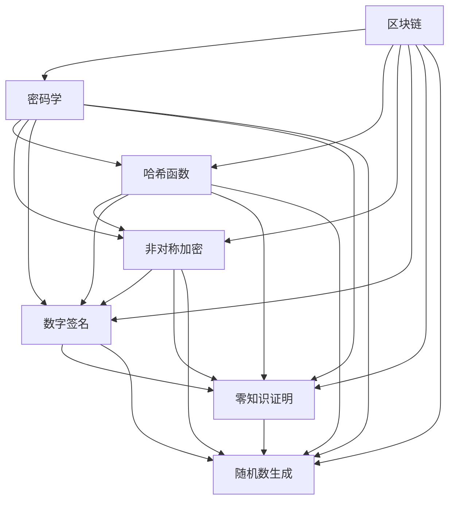

                 

### 引言

区块链技术近年来在全球范围内引起了广泛关注，其核心驱动力来自于其在金融科技、供应链管理、数据存储和智能合约等方面的广泛应用。区块链技术的本质是一种去中心化的分布式账本，通过密码学确保数据的完整性和安全性。然而，要深入了解区块链的工作原理和潜在应用，数学原理是不可或缺的基础。

本书《数学与密码货币：区块链技术的数学原理》旨在探讨数学在区块链技术中的关键作用，通过系统的数学分析，帮助读者理解区块链技术的本质。本书的核心内容分为三个部分：第一部分介绍区块链技术的基础知识；第二部分深入探讨密码学在区块链中的应用，包括哈希函数、非对称加密和数字签名等；第三部分则详细讲解区块链中的数学模型，如零知识证明、随机数生成等。

本书的目标读者是那些对区块链技术感兴趣，希望深入理解其底层数学原理的技术人员、研究人员和学生。通过本书的阅读，读者不仅能够掌握区块链技术的核心概念，还能理解其数学原理的应用，从而更好地应用于实际项目中。

接下来，我们将首先介绍区块链技术的起源和发展，帮助读者建立一个完整的背景知识框架，为后续章节的深入分析奠定基础。随后，我们将逐步揭示区块链技术中的数学原理，包括密码学、数学模型等，通过详细的例子和算法讲解，让读者能够直观地理解这些原理。最后，我们将通过具体的实战项目，展示如何将理论应用于实际开发中，帮助读者将知识转化为实际技能。

### 关键词

- 区块链技术
- 密码货币
- 数学原理
- 密码学
- 哈希函数
- 零知识证明
- 随机数生成
- 数学模型
- 智能合约

### 摘要

本书《数学与密码货币：区块链技术的数学原理》旨在探讨数学在区块链技术中的应用和重要性。全书分为三个主要部分，首先介绍了区块链技术的起源、发展及其基本概念；其次深入讲解了密码学在区块链技术中的核心应用，包括哈希函数、非对称加密和数字签名；最后详细阐述了区块链中的数学模型，如零知识证明、随机数生成等。通过系统的数学分析和具体实例讲解，本书帮助读者深入理解区块链技术的本质，掌握其核心数学原理，并将理论应用于实际开发中。本书适用于对区块链技术感兴趣的技术人员、研究人员和学生，旨在提升读者的技术素养和实际应用能力。

### 用户需求分析

在撰写本书《数学与密码货币：区块链技术的数学原理》之前，我们需要对目标用户进行深入的需求分析。这些用户主要包括以下几类：

1. **技术人员**：他们通常对区块链技术有一定的了解，但希望深入理解其背后的数学原理，以更好地应用于实际项目中。这些用户包括程序员、系统架构师、区块链开发工程师等。

2. **研究人员**：他们关注区块链技术的最新发展，希望通过系统的数学分析来深化对区块链技术的理解，为未来的研究和创新奠定基础。这些用户可能来自大学、研究机构或科技公司的研究部门。

3. **学生**：他们对区块链技术感兴趣，希望通过学习这本书来获得扎实的理论基础，为将来的职业生涯做准备。这些学生可能来自计算机科学、软件工程、网络安全等相关专业。

为了满足这些用户的需求，本书需要具备以下几个特点：

1. **逻辑清晰、结构紧凑**：内容需要按照逻辑顺序组织，确保读者能够循序渐进地理解区块链技术及其数学原理。

2. **专业性强**：内容需涵盖区块链技术的核心数学原理，包括密码学、数学模型等，通过详细的例子和算法讲解，让读者能够直观地理解这些原理。

3. **通俗易懂**：虽然本书面向的是专业用户，但讲解方式需要尽可能通俗易懂，避免过于复杂的数学公式和专业术语。

4. **实用性**：除了理论讲解，还需要包含具体的实战项目，帮助读者将知识应用到实际开发中。

5. **完整性**：内容需要全面覆盖区块链技术的基本概念、密码学原理、数学模型及其在实际应用中的体现。

### 书籍结构设计

为了实现上述目标，本书将分为以下几个部分：

1. **引言与基础**：介绍区块链技术的起源、发展及其基本概念，为后续章节的深入分析奠定基础。

2. **密码学基础**：详细讲解密码学在区块链技术中的应用，包括哈希函数、非对称加密和数字签名等。

3. **数学模型与区块链技术**：介绍区块链中的数学模型，如零知识证明、随机数生成等，通过具体的例子和算法讲解，帮助读者理解这些模型的实际应用。

4. **实战项目**：通过具体的实战项目，展示如何将理论应用于实际开发中，帮助读者将知识转化为实际技能。

5. **总结与展望**：总结全书内容，展望区块链技术的未来发展方向，为读者提供进一步学习和研究的方向。

### 写作风格与表达方式

本书将采用以下写作风格与表达方式：

1. **逻辑清晰**：每个章节都将按照逻辑顺序组织内容，确保读者能够循序渐进地理解区块链技术及其数学原理。

2. **图表与代码**：适当使用图表和代码，帮助读者更直观地理解复杂的概念和算法。

3. **实例讲解**：通过具体的实例，将抽象的数学原理与实际应用相结合，提高读者的理解和应用能力。

4. **通俗易懂**：尽量使用通俗易懂的语言，避免过于复杂的数学公式和专业术语。

5. **互动性**：在适当的地方引入问答和思考环节，鼓励读者积极参与，加深对知识点的理解。

### 文章目录结构设计

根据上述用户需求分析和书籍结构设计，以下是本书的详细目录结构：

#### 第一部分 引言与基础

1. **引言**
    - 区块链技术概述
    - 数学在区块链技术中的重要性
    - 书籍目标与结构

2. **区块链技术基础**
    - 区块链的起源与发展
    - 基本概念与工作原理
    - 区块链技术的核心组件

#### 第二部分 密码学基础

1. **密码学概述**
    - 密码学的起源与发展
    - 密码学的核心目标

2. **哈希函数**
    - 哈希函数的基本原理
    - 哈希函数的应用

3. **非对称加密**
    - 非对称加密的基本原理
    - 非对称加密的应用

4. **数字签名**
    - 数字签名的基本原理
    - 数字签名的应用

#### 第三部分 数学模型与区块链技术

1. **零知识证明**
    - 零知识证明的基本原理
    - 零知识证明在区块链中的应用

2. **随机数生成**
    - 随机数生成的基本原理
    - 随机数生成在区块链中的应用

3. **数学模型在区块链中的应用**
    - 区块链网络模型
    - 智能合约的数学模型

#### 第四部分 实战项目

1. **区块链开发环境搭建**
    - 开发环境配置与工具选择
    - 区块链网络搭建

2. **智能合约开发实战**
    - 智能合约设计
    - 智能合约部署
    - 智能合约测试

#### 第五部分 总结与展望

1. **区块链技术发展趋势**
    - 区块链技术的未来发展方向
    - 数学在区块链技术中的应用前景

2. **总结与拓展**
    - 本书核心内容回顾
    - 最佳实践与注意事项
    - 拓展阅读与进一步学习

通过以上目录结构，本书旨在系统地介绍区块链技术的数学原理，帮助读者深入理解其本质，并将这些知识应用于实际开发中。每个部分都将结合理论讲解和实际应用，确保读者能够获得全面的知识和技能。

### 核心概念与联系

为了深入理解区块链技术及其数学原理，我们需要首先明确几个核心概念，并探讨它们之间的相互关系。以下是几个关键概念及其关联的简要概述：

1. **区块链**：区块链是一种分布式账本技术，通过将数据分块，并按时间顺序将块链接成链，从而形成一个不可篡改的账本。区块链的核心概念包括块、链、节点和共识算法。

2. **密码学**：密码学是研究如何通过加密和解密保护信息的学科。在区块链技术中，密码学广泛应用于确保数据的完整性和安全性，包括哈希函数、非对称加密和数字签名等。

3. **哈希函数**：哈希函数是一种将任意长度数据映射为固定长度字符串的函数，通常用于数据验证和加密。在区块链中，哈希函数用于确保数据的完整性和不可篡改性，每个区块都包含其前一个区块的哈希值，形成链式结构。

4. **非对称加密**：非对称加密是一种加密技术，使用一对密钥（公钥和私钥）进行加密和解密。在区块链中，非对称加密用于实现安全的通信和数字签名。

5. **数字签名**：数字签名是一种使用私钥对数据进行签名，以确保数据完整性和身份验证的技术。数字签名在区块链交易中用于验证交易发起者的身份。

6. **零知识证明**：零知识证明是一种密码学协议，允许一方（证明者）向另一方（验证者）证明某个陈述是真实的，而不泄露任何具体信息。在区块链中，零知识证明用于实现隐私保护交易。

7. **随机数生成**：随机数生成是确保区块链网络安全的重要手段，通过生成随机数来保证区块链节点之间的通信安全。

8. **数学模型**：区块链中的数学模型包括共识算法、智能合约等，这些模型通过数学原理来实现区块链的核心功能。

为了更直观地展示这些核心概念之间的关系，我们可以使用Mermaid流程图进行说明：



上述流程图展示了区块链技术中各个核心概念之间的相互联系。通过这个图，我们可以清晰地看到，密码学作为核心基础，与哈希函数、非对称加密、数字签名、零知识证明和随机数生成等概念紧密相关，共同构成了区块链技术的安全框架。

接下来，我们将进一步详细讨论这些核心概念的工作原理，并通过具体的例子和算法讲解，帮助读者深入理解这些概念在区块链技术中的应用。

### 第一部分：引言与基础

#### 引言

区块链技术作为当今最具颠覆性的技术之一，已经成为金融科技、物联网、供应链管理等多个领域的重要工具。其核心优势在于去中心化、透明性和不可篡改性，这些特性使得区块链在数据存储、信息安全、智能合约等方面具有广泛的应用潜力。然而，要深入理解区块链技术的工作原理和潜在应用，我们必须首先掌握其背后的数学原理。

数学在区块链技术中的应用是至关重要的。它不仅为区块链提供了安全保障，还为其各种应用场景提供了理论基础。例如，密码学在区块链中扮演了关键角色，通过哈希函数、非对称加密和数字签名等技术确保数据的完整性和安全性。同时，区块链中的共识算法和智能合约等也离不开数学的支持。

本书《数学与密码货币：区块链技术的数学原理》旨在系统地介绍数学在区块链技术中的应用，帮助读者从数学角度深入理解区块链的本质。本书将首先介绍区块链技术的起源、发展及其基本概念，然后深入探讨密码学在区块链中的应用，包括哈希函数、非对称加密和数字签名等。此外，本书还将详细讲解区块链中的数学模型，如零知识证明、随机数生成等，并通过具体的实例和算法讲解，让读者能够直观地理解这些原理。最后，本书将通过实战项目，展示如何将理论应用于实际开发中，帮助读者将知识转化为实际技能。

#### 区块链技术的起源和发展

区块链技术的起源可以追溯到2008年，当时一个化名为“中本聪”（Satoshi Nakamoto）的人发表了一篇名为《比特币：一种点对点的电子现金系统》的论文。这篇论文首次提出了比特币这一去中心化的数字货币系统，并引入了区块链这一核心概念。比特币系统的成功激发了全球对区块链技术的关注，并推动了区块链技术的发展。

区块链技术的核心思想是将数据存储在一个分布式账本中，确保数据的不可篡改性和透明性。每个区块都包含一定数量的交易记录，并通过加密技术确保这些记录的安全。每个区块都与前一个区块通过哈希值链接，形成一条链式结构，从而构成了区块链。

区块链技术最早的应用场景是在数字货币领域，特别是比特币。比特币通过区块链技术实现了去中心化的货币发行和交易，使得用户能够直接进行点对点交易，无需通过第三方机构。这种去中心化的交易模式不仅提高了交易效率，还降低了交易成本。

随着区块链技术的不断发展，其应用场景逐渐扩展到金融科技、物联网、供应链管理、数据存储等多个领域。例如，在金融领域，区块链技术可以用于证券交易、跨境支付和身份验证等；在物联网领域，区块链技术可以用于设备管理和数据安全；在供应链管理领域，区块链技术可以用于追踪商品来源和验证产品真伪。

区块链技术的发展也伴随着各种挑战和争议。例如，区块链的扩容问题、安全性问题和隐私性问题等。尽管如此，区块链技术依然被视为具有巨大潜力的新兴技术，吸引了大量企业和研究机构的关注和投入。

#### 基本概念与工作原理

要深入理解区块链技术，我们需要首先掌握其基本概念和工作原理。以下是区块链技术的一些关键概念：

1. **区块**：区块是区块链的基本组成单元，每个区块包含一定数量的交易记录。区块通常包括一个时间戳、一个随机数（用于挖矿）、一个前一个区块的哈希值等。

2. **链**：链是区块的有序集合，每个区块通过其前一个区块的哈希值链接起来，形成一条链式结构。区块链的不可篡改性正是通过这种链式结构实现的。

3. **节点**：节点是区块链网络中的参与者，每个节点都维护一个完整的区块链副本。节点通过广播和验证交易，确保区块链的完整性和一致性。

4. **挖矿**：挖矿是区块链网络中产生新区块的过程。矿工通过解决一个数学难题（例如工作量证明算法），来竞争生成新区块。挖矿不仅是一种共识机制，也是区块链网络中产生新币和激励矿工的方式。

5. **共识算法**：共识算法是区块链网络中确保所有节点达成一致的方法。常见的共识算法包括工作量证明（PoW）、权益证明（PoS）和委托权益证明（DPoS）等。

6. **交易**：交易是区块链网络中的数据交换操作。每个交易都包含一定的金额和信息，例如支付信息、合同信息等。交易经过验证后，会被记录在区块链上。

7. **智能合约**：智能合约是一种运行在区块链上的程序，能够自动执行合同条款。智能合约通过加密技术确保合同的执行和安全性。

#### 核心组件

区块链技术的核心组件包括：

1. **区块链**：存储交易记录和智能合约代码的分布式账本。

2. **节点**：参与区块链网络的计算设备，负责验证交易、广播新区块和维护区块链。

3. **挖矿算法**：用于生成新区块和奖励矿工的数学难题。

4. **共识算法**：确保区块链网络中所有节点达成一致的方法。

5. **加密技术**：确保数据安全、隐私保护和防止篡改的关键技术。

#### 区块链技术的核心优势

区块链技术的核心优势包括：

1. **去中心化**：区块链通过分布式网络实现了去中心化，消除了传统中介机构的依赖，提高了交易效率。

2. **安全性**：区块链采用密码学技术确保数据的完整性和安全性，使得数据难以篡改。

3. **透明性**：区块链上的交易记录对所有节点可见，提高了信息的透明度。

4. **不可篡改性**：区块链的数据一旦记录，几乎无法篡改，确保了数据的长期可靠性。

5. **智能合约**：智能合约能够自动执行合同条款，提高了交易的安全性和效率。

#### 区块链技术的潜在应用

区块链技术的潜在应用非常广泛，以下是一些主要应用领域：

1. **金融领域**：区块链技术可以用于数字货币、跨境支付、证券交易和信用评估等。

2. **供应链管理**：区块链技术可以用于追踪商品来源、验证产品真伪和优化供应链流程。

3. **物联网**：区块链技术可以用于设备管理和数据安全，提高物联网系统的可靠性。

4. **数据存储**：区块链技术可以用于分布式数据存储和加密，提高数据的安全性和可用性。

5. **身份验证**：区块链技术可以用于身份验证和数据加密，提高个人隐私保护。

6. **智能合约**：区块链技术可以用于自动执行合同条款，提高交易的安全性和效率。

总之，区块链技术作为一种颠覆性的新兴技术，其应用前景十分广阔。通过深入理解区块链技术及其数学原理，我们可以更好地发挥其潜力，为各个领域带来创新和变革。

### 密码学基础

密码学是区块链技术的核心组成部分，它在确保数据安全、隐私保护和防止篡改方面发挥着至关重要的作用。密码学的研究始于古代，但其真正的发展始于20世纪70年代。在这一节中，我们将简要回顾密码学的起源、发展及其核心目标，并重点介绍在区块链技术中广泛应用的几种密码学技术，包括哈希函数、非对称加密和数字签名。

#### 密码学的起源与发展

密码学的历史可以追溯到古代，当时人们开始使用简单的加密方法来保护通信内容。例如，古罗马的凯撒密码就是一种简单的替换加密方法，通过将每个字母替换为字母表中的第三个字母来实现加密。随着计算机技术的发展，现代密码学逐渐成熟，特别是在20世纪70年代，随着计算机和通信技术的迅猛发展，密码学迎来了新的发展机遇。

1976年，惠普（HP）的研究员惠特菲尔德·迪菲（Whitfield Diffie）和马丁·赫尔曼（Martin Hellman）提出了第一个非对称加密算法，即迪菲-赫尔曼密钥交换算法，这一突破性成果标志着现代密码学的诞生。此后，密码学理论不断发展，各种加密算法相继被提出，如RSA加密算法、SHA哈希函数等。

#### 密码学的核心目标

密码学的核心目标是确保信息在传输过程中的保密性、完整性和认证性。具体来说：

1. **保密性**：确保信息在传输过程中不被未授权的第三方读取。
2. **完整性**：确保信息在传输过程中不被篡改或损坏。
3. **认证性**：确保信息来源的可靠性，验证信息的真实性。

#### 哈希函数

哈希函数是密码学中的一种基本工具，它将任意长度的输入数据映射为固定长度的输出数据，这个输出数据称为哈希值。哈希函数具有以下几个重要特性：

1. **单向性**：给定输入数据，可以很容易地计算其哈希值，但给定哈希值，无法推导出原始输入数据。
2. **抗碰撞性**：不同的输入数据产生相同哈希值的概率极低。
3. **抗修改性**：对输入数据的任何微小修改都会导致哈希值的显著变化。

在区块链技术中，哈希函数被广泛应用于：

1. **数据完整性验证**：每个区块都包含其所有交易数据的哈希值，以确保交易数据的完整性。
2. **链接区块**：每个区块都包含其前一个区块的哈希值，从而形成区块链的链式结构。

例如，SHA-256是一种常用的哈希函数，其输入数据可以任意长，输出数据为256位二进制数。以下是一个简单的SHA-256哈希函数示例：

```python
import hashlib

def sha256_hash(data):
    return hashlib.sha256(data.encode('utf-8')).hexdigest()

data = "Hello, World!"
hash_value = sha256_hash(data)
print("SHA-256 Hash of '" + data + "': " + hash_value)
```

运行上述代码，我们可以得到输入字符串“Hello, World!”的SHA-256哈希值。

#### 非对称加密

非对称加密是一种使用一对密钥（公钥和私钥）进行加密和解密的加密技术。公钥可以公开，用于加密数据，私钥必须保密，用于解密数据。非对称加密具有以下特性：

1. **加密与解密效率**：非对称加密的加密和解密速度相对较慢，但安全性较高。
2. **密钥管理**：公钥和私钥需要分别管理和保护，公钥可以公开，但私钥必须保密。

在区块链技术中，非对称加密被广泛应用于：

1. **安全通信**：确保节点之间的通信安全。
2. **数字签名**：用于验证交易发起者的身份和确保交易数据的完整性。

例如，RSA是一种常用的非对称加密算法，以下是一个简单的RSA加密与解密示例：

```python
from Crypto.PublicKey import RSA
from Crypto.Cipher import PKCS1_OAEP

def generate_rsa_keypair():
    key = RSA.generate(2048)
    private_key = key.export_key()
    public_key = key.publickey().export_key()
    return private_key, public_key

def rsa_encrypt(plaintext, public_key):
    recipient_key = RSA.import_key(public_key)
    cipher = PKCS1_OAEP.new(recipient_key)
    ciphertext = cipher.encrypt(plaintext)
    return ciphertext

def rsa_decrypt(ciphertext, private_key):
    sender_key = RSA.import_key(private_key)
    cipher = PKCS1_OAEP.new(sender_key)
    plaintext = cipher.decrypt(ciphertext)
    return plaintext.decode('utf-8')

private_key, public_key = generate_rsa_keypair()
plaintext = "Hello, World!"
ciphertext = rsa_encrypt(plaintext, public_key)
print("RSA Encrypted Message: " + ciphertext)

decrypted_message = rsa_decrypt(ciphertext, private_key)
print("RSA Decrypted Message: " + decrypted_message)
```

运行上述代码，我们可以看到如何使用RSA算法对文本进行加密和解密。

#### 数字签名

数字签名是一种使用私钥对数据进行签名，以确保数据完整性和身份验证的技术。数字签名具有以下特性：

1. **不可否认性**：一旦签名生成，签名者无法否认自己生成过该签名。
2. **不可伪造性**：未经私钥持有者授权，无法生成有效的数字签名。

在区块链技术中，数字签名被广泛应用于：

1. **交易验证**：确保交易数据的真实性和完整性。
2. **身份认证**：验证交易发起者的身份。

例如，以下是一个简单的数字签名示例：

```python
from Crypto.Signature import pkcs1_15
from Crypto.Hash import SHA256

def generate_signature(message, private_key):
    message_hash = SHA256.new(message.encode('utf-8'))
    signature = pkcs1_15.new(private_key).sign(message_hash)
    return signature

def verify_signature(message, signature, public_key):
    message_hash = SHA256.new(message.encode('utf-8'))
    try:
        pkcs1_15.new(public_key).verify(message_hash, signature)
        return "Signature is valid."
    except (ValueError, TypeError):
        return "Signature is invalid."

private_key, public_key = generate_rsa_keypair()
message = "Hello, World!"
signature = generate_signature(message, private_key)

print("Message: " + message)
print("Signature: " + signature.hex())

verification_result = verify_signature(message, signature, public_key)
print("Signature Verification Result: " + verification_result)
```

运行上述代码，我们可以看到如何使用RSA算法对消息进行签名和验证。

通过上述介绍，我们可以看到密码学在区块链技术中的广泛应用。在接下来的章节中，我们将进一步探讨密码学在区块链中的具体应用，包括零知识证明、随机数生成等，以帮助读者更深入地理解区块链技术的数学原理。

### 哈希函数的基本原理

哈希函数在密码学中扮演着至关重要的角色，特别是在区块链技术中，其应用范围广泛。哈希函数的基本原理是将任意长度的输入数据映射为固定长度的输出数据，这个输出数据被称为哈希值。本节将详细探讨哈希函数的基本原理，并介绍几种常见的哈希函数。

#### 哈希函数的定义与特性

哈希函数的定义如下：

$$H(x) = h$$

其中，$x$ 是任意长度的输入数据，$h$ 是固定长度的输出数据（即哈希值）。哈希函数具有以下主要特性：

1. **单向性**：给定输入数据 $x$，可以很容易地计算其哈希值 $h$，但给定哈希值 $h$，无法推导出原始输入数据 $x$。这意味着哈希函数是一种单向函数，从输出无法反推出输入。
   
2. **抗碰撞性**：不同的输入数据产生相同哈希值的概率极低。在实际应用中，我们通常认为这种概率可以忽略不计。
   
3. **抗修改性**：对输入数据的任何微小修改都会导致哈希值的显著变化。这意味着哈希值能够有效检测输入数据的任何篡改。

#### 常见哈希函数

以下是一些常见的哈希函数：

1. **MD5**：MD5是一种广泛使用的哈希函数，其输出为128位二进制数。然而，由于MD5的碰撞问题（即不同输入数据产生相同哈希值），其安全性受到了质疑，不再推荐用于安全敏感的应用。

2. **SHA-1**：SHA-1是另一种常用的哈希函数，其输出为160位二进制数。与MD5类似，由于碰撞问题的存在，SHA-1的安全性也受到了影响。自2017年起，SHA-1不再被认为是安全的，应避免用于新项目。

3. **SHA-256**：SHA-256是SHA系列哈希函数的一个成员，其输出为256位二进制数。SHA-256被广泛应用于安全领域，包括区块链技术。其抗碰撞性和抗修改性均较强，是目前较为安全的哈希函数之一。

4. **SHA-3**：SHA-3是NIST（美国国家标准与技术研究所）于2015年发布的标准，其设计目的是替代SHA-1和SHA-2系列。SHA-3提供了多种哈希函数和密码哈希函数，以适应不同的应用需求。

#### 哈希函数在区块链中的应用

在区块链技术中，哈希函数被广泛应用于以下几个方面：

1. **数据完整性验证**：每个区块都包含其所有交易数据的哈希值，以确保交易数据的完整性。如果交易数据被篡改，其哈希值也会发生变化，从而被发现。
   
2. **链接区块**：区块链中的每个区块都通过其前一个区块的哈希值链接起来，形成一条链式结构。这使得区块链具有不可篡改性和持久性。

3. **数字签名**：在区块链交易中，哈希函数用于生成消息摘要，然后使用私钥对其进行签名。这确保了交易数据的完整性和身份验证。

4. **智能合约执行**：智能合约在执行前会生成交易数据的哈希值，并作为输入参数传递给合约。这确保了合约的输入数据是可信的，从而保证合约执行的正确性。

以下是一个简单的Python示例，展示了如何使用SHA-256哈希函数计算字符串的哈希值：

```python
import hashlib

def sha256_hash(data):
    return hashlib.sha256(data.encode('utf-8')).hexdigest()

message = "Hello, World!"
hash_value = sha256_hash(message)
print("SHA-256 Hash of '" + message + "': " + hash_value)
```

运行上述代码，我们可以得到输入字符串“Hello, World!”的SHA-256哈希值。

通过以上介绍，我们可以看到哈希函数在区块链技术中的重要性。其基本原理和多种应用场景不仅确保了区块链的安全性和不可篡改性，还为其各种应用提供了理论基础。在接下来的章节中，我们将进一步探讨非对称加密和数字签名等密码学技术在区块链中的应用。

### 非对称加密的基本原理

非对称加密（Asymmetric Encryption），也称为公钥加密，是一种使用一对密钥（公钥和私钥）进行加密和解密的加密技术。与对称加密不同，非对称加密中的公钥可以公开，而私钥必须保密。本节将详细介绍非对称加密的基本原理，包括加密和解密的过程、密钥的生成以及公钥和私钥的区别。

#### 加密和解密过程

1. **加密过程**：
   - **消息发送者**使用接收者的公钥对消息进行加密。
   - 公钥是公开的，任何人都可以获取，但只有拥有相应私钥的人才能解密消息。

2. **解密过程**：
   - **消息接收者**使用自己的私钥对加密后的消息进行解密。
   - 私钥是保密的，只有私钥持有者才能解密消息。

非对称加密的加密和解密过程可以通过以下步骤概括：

- **加密**：
  - 假设消息发送者为$A$，接收者为$B$。
  - $A$获取$B$的公钥$PK_B$。
  - $A$使用$PK_B$对消息$M$进行加密，得到密文$C$。
  - $A$发送密文$C$给$B$。

- **解密**：
  - $B$收到密文$C$。
  - $B$使用自己的私钥$SK_B$对密文$C$进行解密，恢复出原始消息$M$。

这个过程可以用以下数学模型表示：

$$ C = E_{PK_B}(M) $$

$$ M = D_{SK_B}(C) $$

其中，$E_{PK_B}$表示使用公钥$PK_B$进行加密的函数，$D_{SK_B}$表示使用私钥$SK_B$进行解密的函数。

#### 密钥的生成

非对称加密的密钥生成过程通常基于数学难题，如大整数分解和离散对数问题。以下是一个简化的密钥生成过程：

1. **选择两个大素数**：
   - 选择两个大素数$p$和$q$，通常$p$和$q$的大小都是1024位或更高。
   - 例如，可以选择$p = 61$和$q = 53$。

2. **计算模数**：
   - 计算模数$n = p \times q$。

3. **计算欧拉函数**：
   - 计算欧拉函数$\phi(n) = (p-1) \times (q-1)$。

4. **选择公钥指数**：
   - 选择一个与$\phi(n)$互质的整数$e$，通常选择一个小的质数，如$e = 17$。

5. **计算私钥指数**：
   - 通过计算离散对数$d$，使得$e \times d \equiv 1 \pmod{\phi(n)}$。这通常需要使用计算复杂度高的算法，如埃拉托斯特尼筛选法。

6. **生成密钥**：
   - 公钥$PK = (n, e)$。
   - 私钥$SK = (n, d)$。

以下是一个简单的Python示例，展示了如何使用RSA算法生成密钥：

```python
from Crypto.PublicKey import RSA

def generate_rsa_keypair():
    key = RSA.generate(2048)
    private_key = key.export_key()
    public_key = key.publickey().export_key()
    return private_key, public_key

private_key, public_key = generate_rsa_keypair()
print("Private Key: ", private_key)
print("Public Key: ", public_key)
```

#### 公钥和私钥的区别

- **公钥**：
  - 公钥是公开的，可以安全地发布和分享。
  - 公钥主要用于加密数据，任何人都可以使用公钥加密信息。

- **私钥**：
  - 私钥是保密的，必须由私钥持有者妥善保管。
  - 私钥主要用于解密数据和生成数字签名。

公钥和私钥通过数学关系紧密相连，但互不可逆。这意味着使用公钥加密的信息只能使用对应的私钥解密，反之亦然。这种特性确保了数据在传输过程中的安全性和隐私保护。

#### 非对称加密的优势

非对称加密具有以下优势：

1. **安全性**：非对称加密使用复杂的数学难题进行加密和解密，使得破解过程极其困难。
2. **密钥管理**：由于公钥可以公开，私钥可以保密，非对称加密简化了密钥管理。
3. **数字签名**：非对称加密不仅可以用于加密数据，还可以用于数字签名，确保数据的完整性和身份验证。

通过上述介绍，我们可以看到非对称加密在保障数据安全、隐私保护和身份验证等方面的重要性。在区块链技术中，非对称加密被广泛应用于各种应用场景，如安全通信、交易验证和智能合约执行等。在下一节中，我们将进一步探讨数字签名的原理和应用。

### 数字签名的基本原理

数字签名是一种用于确保数据完整性和身份验证的密码学技术，它基于非对称加密的原理，通过使用私钥对数据进行签名，并使用公钥进行验证。本节将详细介绍数字签名的基本原理，包括签名的生成过程、验证过程以及数字签名的应用场景。

#### 签名生成过程

数字签名的生成过程包括以下步骤：

1. **生成密钥对**：
   - 首先，用户生成一对密钥：私钥$SK$和公钥$PK$。
   - 私钥$SK$是保密的，必须由用户妥善保管；公钥$PK$是公开的，可以安全地分享。

2. **哈希计算**：
   - 对待签名的数据进行哈希计算，生成一个固定长度的哈希值。哈希函数用于确保数据的完整性，即任何数据修改都会导致哈希值的变化。
   - 常用的哈希函数包括SHA-256、SHA-3等。

3. **签名生成**：
   - 使用私钥$SK$对生成的哈希值进行签名。签名过程通常涉及一个签名算法，如RSA签名算法或ECDSA（椭圆曲线数字签名算法）。
   - 签名结果是一个加密的哈希值，只有私钥$SK$可以解密，从而验证数据的完整性。

以下是一个简单的数字签名生成示例，使用RSA算法：

```python
from Crypto.PublicKey import RSA
from Crypto.Signature import pkcs1_15
from Crypto.Hash import SHA256

def generate_signature(message, private_key):
    message_hash = SHA256.new(message.encode('utf-8'))
    signature = pkcs1_15.new(private_key).sign(message_hash)
    return signature

private_key = RSA.generate(2048)
message = "Hello, World!"
signature = generate_signature(message, private_key)
print("Signature: ", signature.hex())
```

#### 验证过程

数字签名的验证过程包括以下步骤：

1. **哈希计算**：
   - 对待验证的数据进行哈希计算，生成一个固定长度的哈希值。

2. **签名解密**：
   - 使用公钥$PK$对签名进行解密，得到加密的哈希值。

3. **比较哈希值**：
   - 将解密后的哈希值与原始数据的哈希值进行比较。
   - 如果两者相同，则签名验证通过，表明数据未被篡改，且确实由私钥$SK$持有者签名。

以下是一个简单的数字签名验证示例：

```python
from Crypto.PublicKey import RSA
from Crypto.Signature import pkcs1_15
from Crypto.Hash import SHA256

def verify_signature(message, signature, public_key):
    message_hash = SHA256.new(message.encode('utf-8'))
    try:
        pkcs1_15.new(public_key).verify(message_hash, signature)
        return "Signature is valid."
    except (ValueError, TypeError):
        return "Signature is invalid."

public_key = RSA.import_key(private_key.export_key())
signature = b'... '  # 签名数据
message = "Hello, World!"

verification_result = verify_signature(message, signature, public_key)
print("Verification Result: ", verification_result)
```

#### 数字签名的应用场景

数字签名在区块链技术中有着广泛的应用，以下是几个主要的应用场景：

1. **交易验证**：
   - 在区块链交易中，用户使用私钥对交易数据签名，确保交易数据的完整性和身份验证。
   - 当交易被广播到网络时，其他节点使用公钥验证交易签名，确保交易的有效性。

2. **智能合约**：
   - 智能合约在执行前通常需要验证交易签名，以确保合约条款的正确执行。
   - 合约代码会验证交易发起者的签名，从而确保交易数据的完整性和可靠性。

3. **身份验证**：
   - 数字签名可以用于身份验证，确保用户或设备的真实性。
   - 在分布式系统中，数字签名用于验证消息的发送者，确保消息来源的可靠性。

4. **数据完整性验证**：
   - 数字签名用于确保数据的完整性和真实性，任何对数据的篡改都会导致签名验证失败。

通过上述介绍，我们可以看到数字签名在确保数据完整性、身份验证和防止篡改等方面的重要性。在区块链技术中，数字签名作为一种关键的密码学技术，广泛应用于各种应用场景，为区块链的安全性和可信性提供了坚实的基础。

### 零知识证明的基本原理

零知识证明（Zero-Knowledge Proof, ZKP）是一种重要的密码学工具，它允许一方（证明者）向另一方（验证者）证明某个陈述是真实的，而不泄露任何具体信息。这种性质使得零知识证明在保护隐私和确保数据真实性方面具有广泛的应用。本节将详细探讨零知识证明的基本原理、数学原理以及其在区块链中的应用。

#### 基本原理

零知识证明的基本原理可以概括为以下三个核心要素：

1. **有效性**：证明者能够有效地证明某个陈述是真实的，而不泄露任何其他信息。
2. **验证性**：验证者能够验证证明的有效性，确认证明者确实证明了陈述的真实性。
3. **零知识**：证明者无法从证明过程中泄露任何具体信息，即验证者无法从证明中获取除陈述真实性外的任何信息。

#### 数学原理

零知识证明的数学原理基于数学难题，如离散对数问题和大整数分解问题。以下是零知识证明的一个简单示例：

假设存在两个大素数$p$和$q$，计算模数$n = p \times q$。私钥为$n$和公钥为$p$。证明者希望向验证者证明他知道$n$的离散对数，但不想泄露具体值。

1. **生成公钥**：
   - 证明者随机选择一个整数$a$，计算$g^a \mod n$，将其作为公钥发送给验证者。

2. **证明生成**：
   - 验证者随机选择一个整数$b$，并将其发送给证明者。
   - 证明者计算$r = b^a \mod n$，并将其发送给验证者。

3. **验证过程**：
   - 验证者计算$(g^r)^b \mod n$。
   - 如果结果等于公钥$g^a \mod n$，则验证者确认证明者确实知道$n$的离散对数。

这个过程可以表示为以下数学方程：

$$g^a \mod n = (g^r)^b \mod n$$

$$g^{ab} \mod n = g^{ra} \mod n$$

由于$a$和$r$是随机的，验证者无法从证明过程中获取$a$的具体值，从而实现了零知识证明。

#### 零知识证明的数学原理

零知识证明的数学原理基于以下核心概念：

1. **交互性**：证明者和验证者之间进行一系列交互，以验证某个陈述的真实性。
2. **交互验证**：验证者通过一系列交互验证证明的有效性，而不会泄露任何具体信息。
3. **计算复杂度**：零知识证明的设计基于某些数学难题的计算复杂度，如离散对数问题和大整数分解问题，使得证明过程既有效又安全。

#### 零知识证明在区块链中的应用

零知识证明在区块链技术中具有广泛的应用，以下是几个主要的应用场景：

1. **隐私保护**：
   - 零知识证明可以用于实现隐私保护交易，允许用户在无需泄露具体交易信息的情况下验证交易的有效性。
   - 例如，Zcash和Monero等加密货币使用零知识证明实现匿名交易。

2. **智能合约**：
   - 智能合约可以使用零知识证明验证交易数据的有效性，从而确保合约条款的正确执行。
   - 例如，以太坊2.0中使用零知识证明实现验证交易数据的安全性。

3. **身份验证**：
   - 零知识证明可以用于身份验证，确保用户在无需泄露身份信息的情况下验证身份。
   - 例如，分布式身份验证系统可以使用零知识证明确保用户身份的验证。

4. **数据完整性验证**：
   - 零知识证明可以用于验证区块链上数据的完整性，确保数据未被篡改。
   - 例如，在数据存储和共享系统中，零知识证明可以用于验证数据的完整性。

通过以上介绍，我们可以看到零知识证明在保护隐私、确保数据真实性以及提升区块链安全性方面的重要性。在区块链技术中，零知识证明的应用不仅提高了系统的安全性，还为各种隐私保护和数据验证场景提供了有效的解决方案。在下一节中，我们将进一步探讨随机数生成在区块链技术中的应用。

### 随机数生成的基本原理

随机数生成是区块链技术中的一个关键环节，它在确保区块链网络的安全性和去中心化方面发挥着重要作用。随机数用于各种密码学算法，如挖矿、节点选择、交易排序等。本节将详细介绍随机数生成的基本原理、常用方法以及其在区块链中的应用。

#### 随机数生成的基本原理

随机数生成的基本原理是通过算法生成看似随机但具有确定性的数值。理想情况下，生成的随机数应满足以下特性：

1. **均匀分布**：随机数应在整个取值范围内均匀分布，不存在任何规律或模式。
2. **不可预测性**：随机数序列应具有高熵值，即难以通过现有信息预测下一个随机数。
3. **安全性**：随机数应足够复杂，使得任何未授权者无法轻易破解或预测。

随机数生成可以通过两种主要方法实现：

1. **物理随机数生成器**：物理随机数生成器利用物理现象（如噪声、放射性衰变等）产生随机数。这些生成器通常被认为具有高熵值和高安全性，但可能受限于生成速度和成本。
   
2. **伪随机数生成器**：伪随机数生成器使用算法生成看似随机的数值序列。虽然这些生成器的生成速度较快且成本低廉，但通常不满足物理随机数的均匀分布和不可预测性。

#### 常用随机数生成方法

以下是一些常见的随机数生成方法：

1. **线性同余生成器（Linear Congruential Generator, LCG）**：
   - LCG是一种简单的伪随机数生成器，通过以下公式生成随机数：
   $$ X_{n+1} = (a \times X_n + c) \mod m $$
   - 其中，$X_n$是生成的随机数，$a$、$c$和$m$是常数。
   - LCG的优点是生成速度快，但随机性较差，容易预测。

2. **梅森旋转生成器（Mersenne Twister）**：
   - 梅森旋转生成器是一种高级伪随机数生成器，基于梅森旋转算法。它具有较好的随机性和均匀分布，是目前广泛使用的伪随机数生成器之一。

3. **熵采集设备**：
   - 熵采集设备利用物理现象（如噪声、放射性衰变等）生成随机数。这些设备通常通过传感器采集环境噪声，然后使用数学算法进行加密和处理，以生成具有高熵值的随机数。

#### 随机数生成在区块链中的应用

在区块链技术中，随机数生成被广泛应用于以下几个方面：

1. **挖矿算法**：
   - 挖矿算法（如工作量证明，PoW）通常需要随机数来确保挖矿过程的公平性和去中心化。
   - 例如，比特币挖矿使用随机数生成器来生成随机数，用于确定矿工的挖矿顺序。

2. **节点选择**：
   - 在某些共识算法中，如随机节点选择，随机数生成用于随机选择参与区块链网络的节点。
   - 这有助于确保区块链网络的去中心化和安全性。

3. **交易排序**：
   - 在区块链交易处理中，随机数生成用于随机排序交易，以防止交易攻击和确保交易的公平性。
   - 例如，以太坊使用随机数生成器来随机排序交易，以防止交易被恶意篡改。

4. **安全通信**：
   - 随机数生成在区块链节点之间的安全通信中用于生成加密密钥和会话ID，确保通信的安全性。

5. **智能合约**：
   - 智能合约可以使用随机数生成器来生成随机数，用于触发合约执行或验证合约条款。

通过上述介绍，我们可以看到随机数生成在区块链技术中的重要性和广泛应用。在确保区块链网络的安全性和去中心化方面，随机数生成发挥着关键作用。在下一节中，我们将进一步探讨区块链中的数学模型。

### 数学模型在区块链中的应用

区块链技术中，数学模型扮演着至关重要的角色，它们不仅是区块链安全性的基础，还为其提供了各种功能和应用场景。以下是几个关键的数学模型及其在区块链技术中的应用：

#### 区块链网络模型

区块链网络模型描述了区块链中各个节点的连接方式和数据传输方式。区块链网络通常采用分布式网络结构，节点之间通过P2P（点对点）通信协议进行数据交换。以下是区块链网络模型的关键组件：

1. **节点**：区块链网络中的每个节点都维护一个完整的区块链副本，并参与验证和记录交易。
2. **区块**：区块是区块链的基本组成单元，包含一定数量的交易记录以及时间戳、难度值等。
3. **链式结构**：区块链通过将每个区块与前一个区块通过哈希值链接，形成一个链式结构，确保数据的不可篡改性。

区块链网络模型的一个重要应用是共识算法。共识算法是区块链网络中确保所有节点达成一致的方法。常见的共识算法包括：

- **工作量证明（PoW）**：节点通过解决复杂的数学难题来竞争生成新区块，难题的难度通过调整计算难度来保持区块生成的平均时间。
- **权益证明（PoS）**：节点根据其在区块链中的持有币量或投票权重来参与区块生成，权益证明算法减少了能源消耗，提高了网络效率。
- **委托权益证明（DPoS）**：用户投票选择代表来生成区块，代表按照投票权重来决定区块生成顺序，进一步提高了网络效率。

#### 智能合约的数学模型

智能合约是区块链上的自动执行合同，其数学模型通常基于形式化的逻辑和编程语言。智能合约的数学模型包括：

1. **形式化逻辑**：智能合约通常使用形式化的逻辑语言（如谓词逻辑、命题逻辑等）来描述合同条款和执行条件。
2. **编程语言**：智能合约通常使用特定的编程语言（如Solidity、Vyper等）来实现，这些语言提供了丰富的数学运算和数据结构，用于实现复杂的业务逻辑。

智能合约的数学模型在区块链技术中的应用非常广泛，例如：

- **去中心化金融（DeFi）**：智能合约在去中心化金融领域被广泛用于实现各种金融产品和服务，如稳定币、去中心化交易所、借贷平台等。
- **供应链管理**：智能合约可以用于验证供应链中的各个环节，确保商品的真实性和流程的透明性。
- **身份验证和数据管理**：智能合约可以用于实现分布式身份验证和数据管理，确保数据的隐私保护和安全性。

#### 零知识证明的数学模型

零知识证明（ZKP）是一种密码学技术，它允许证明者在不泄露具体信息的情况下证明某个陈述是真实的。零知识证明在区块链技术中的应用主要包括：

1. **隐私保护**：零知识证明可以用于实现隐私保护交易，允许用户在不暴露交易细节的情况下验证交易的有效性。
   - **示例**：Zcash和Monero等加密货币使用零知识证明实现匿名交易。
   
2. **身份验证**：零知识证明可以用于实现高效的身份验证，允许用户在不暴露身份信息的情况下验证身份。
   - **示例**：分布式身份验证系统使用零知识证明验证用户身份。

3. **数据验证**：零知识证明可以用于验证区块链上数据的完整性，确保数据未被篡改。
   - **示例**：某些区块链平台使用零知识证明验证智能合约执行的结果。

#### 随机数生成模型

随机数生成是区块链网络中确保安全性和去中心化的重要环节。随机数生成模型包括：

1. **物理随机数生成器**：利用物理现象（如噪声、放射性衰变等）生成随机数，这些生成器通常具有高熵值和高安全性。
   
2. **伪随机数生成器**：通过算法生成看似随机的数值序列，这些生成器通常用于生成种子值或初始化随机数生成器。

随机数生成在区块链中的应用包括：

- **挖矿**：用于确定矿工的挖矿顺序，确保挖矿过程的公平性。
- **节点选择**：用于随机选择参与区块链网络的节点，确保网络的去中心化。
- **交易排序**：用于随机排序交易，确保交易的公平性。

通过上述介绍，我们可以看到数学模型在区块链技术中的核心作用。这些模型不仅为区块链提供了安全性保障，还为其各种应用场景提供了理论基础和实现框架。在接下来的章节中，我们将通过具体的实战项目，展示如何将数学模型应用于实际开发中。

### 区块链加密货币

区块链加密货币，也被称为加密货币或数字货币，是区块链技术最具代表性的应用之一。它通过区块链网络实现去中心化的货币发行和交易，具有无国界、匿名性和安全性的特点。本节将详细探讨区块链加密货币的基本原理、发行机制、交易流程以及数学模型在其中的应用。

#### 基本原理

区块链加密货币的基本原理是利用区块链技术确保货币的安全和透明。每个加密货币的发行和交易都记录在区块链上，通过密码学技术确保这些记录的安全性和不可篡改性。以下是区块链加密货币的关键组成部分：

1. **区块链**：区块链是加密货币的账本，记录了所有的交易记录。每个交易都会被打包成区块，并按时间顺序链接成链。
2. **公钥和私钥**：每个加密货币用户都有一对公钥和私钥。公钥用于接收货币，私钥用于发送货币。
3. **挖矿**：矿工通过解决复杂的数学问题（如工作量证明算法）来验证交易，并将交易记录打包成区块，从而获得新的加密货币作为奖励。

#### 发行机制

区块链加密货币的发行机制是其核心之一，主要有以下几种类型：

1. **初始代币发行（ICO）**：项目方通过ICO向公众发行新加密货币，以筹集资金。
2. **挖矿**：矿工通过解决数学难题来验证交易，并以此获得新发行的加密货币作为奖励。
3. **股权奖励**：某些项目方会通过股权奖励来激励贡献者，如参与代码审查、社区管理等。

#### 交易流程

区块链加密货币的交易流程通常包括以下几个步骤：

1. **发起交易**：用户使用私钥生成一个交易请求，该请求包括接收方的公钥和交易金额。
2. **签名交易**：用户使用私钥对交易请求进行签名，确保交易请求的真实性。
3. **广播交易**：用户将签名后的交易请求广播到区块链网络。
4. **验证交易**：矿工接收并验证交易请求，确保交易请求的有效性和合法性。
5. **打包区块**：矿工将验证后的交易请求打包成区块，并将其添加到区块链上。
6. **确认交易**：交易一旦被添加到区块链上，就获得了永久记录，用户可以查询交易历史记录。

#### 数学模型的应用

数学模型在区块链加密货币中发挥着关键作用，以下是其主要应用：

1. **工作量证明（PoW）**：
   - 矿工通过解决复杂的数学问题（如哈希函数难题）来验证交易，确保区块链的安全性和去中心化。
   - 数学模型包括哈希函数、密码学等。

2. **权益证明（PoS）**：
   - 用户根据其在区块链中的持有币量或投票权重来参与区块生成。
   - 数学模型包括概率论和统计学等。

3. **零知识证明（ZKP）**：
   - 零知识证明用于实现隐私保护交易，确保用户在不暴露交易细节的情况下验证交易的有效性。
   - 数学模型包括密码学等。

4. **智能合约**：
   - 智能合约通过数学模型实现自动执行合同条款，确保交易的执行和安全性。
   - 数学模型包括逻辑和编程语言等。

通过上述介绍，我们可以看到区块链加密货币的基本原理、发行机制、交易流程以及数学模型在其中的应用。这些数学模型不仅确保了加密货币的安全性和去中心化，还为各种应用场景提供了理论基础和实现框架。

### 区块链加密货币的价值评估

区块链加密货币的价值评估是投资者、分析师和研究人员关注的重要问题。由于加密货币市场的波动性和不成熟性，对其价值进行准确评估具有挑战性。以下将介绍几种常用的价值评估方法，并探讨其在实际应用中的适用性和局限性。

#### 方法一：成本评估法

成本评估法是一种基于加密货币生产成本进行价值评估的方法。这种方法认为，加密货币的价值应该等于其生产成本。成本包括开发和维护区块链网络的费用、挖矿成本以及能源消耗等。以下是具体的计算方法：

1. **挖矿成本**：挖矿成本包括硬件成本、电力成本和运维成本。例如，比特币的挖矿成本主要由矿机硬件成本和电力成本构成。
2. **总生产成本**：总生产成本是单个挖矿成本乘以每日挖矿数量。
3. **市场价值**：市场价值是总生产成本乘以加密货币的市场价格。

例如，假设比特币的市场价格是$50,000，每个比特币的挖矿成本是$10,000，则比特币的市场价值为：

$$\text{市场价值} = \text{市场价格} \times \text{每日挖矿数量} = \$50,000 \times 10 = \$500,000$$

#### 方法二：市场比较法

市场比较法是一种基于类似加密货币的市场价格进行比较的价值评估方法。这种方法认为，加密货币的价值应该与其类似货币的市场价格相比较。具体步骤如下：

1. **选择可比对象**：选择与评估加密货币在功能、市场规模、流通性等方面相似的加密货币。
2. **比较市场价格**：比较所选可比对象的市场价格。
3. **调整系数**：根据评估加密货币和可比对象之间的差异，调整市场价格，以获得合理的评估价值。

例如，如果比特币的市场价格是$50,000，而与其功能相似的加密货币以太坊的市场价格是$4,000，则可以认为以太坊的价值被低估。通过调整系数，我们可以得到一个合理的评估价值。

#### 方法三：网络效应法

网络效应法是一种基于加密货币网络规模和用户数量的价值评估方法。这种方法认为，加密货币的价值与网络规模和用户数量正相关。具体步骤如下：

1. **计算网络价值**：计算加密货币网络的总价值，可以通过以下公式计算：

   $$\text{网络价值} = \sum_{i=1}^{n} \frac{1}{i} \times \text{单价}$$

   其中，$n$是网络用户数量，单价是每个用户对网络的边际贡献。

2. **调整系数**：根据网络规模和用户数量的增长趋势，调整网络价值，以获得合理的评估价值。

例如，假设某个加密货币网络有100万用户，每个用户的边际贡献是$1，则该加密货币的网络价值为：

$$\text{网络价值} = \sum_{i=1}^{1,000,000} \frac{1}{i} \times 1 = \$1,000,000$$

#### 方法四：未来收益法

未来收益法是一种基于加密货币未来收益进行价值评估的方法。这种方法认为，加密货币的价值应该等于其未来预期收益的现值。具体步骤如下：

1. **预测未来收益**：根据市场趋势、项目进展、用户增长等因素预测加密货币的未来收益。
2. **计算现值**：使用贴现率将未来收益折现到当前价值。

例如，假设某个加密货币预计在未来五年内每年收益增长率为20%，贴现率为10%，则其当前价值可以通过以下公式计算：

$$\text{当前价值} = \frac{\text{未来收益}}{(1 + \text{贴现率})^n}$$

$$\text{当前价值} = \frac{\text{第一年收益}}{(1 + 0.1)^1} + \frac{\text{第二年收益}}{(1 + 0.1)^2} + ... + \frac{\text{第五年收益}}{(1 + 0.1)^5}$$

#### 适用性与局限性

以上价值评估方法各有优缺点，其适用性和局限性如下：

1. **成本评估法**：
   - **适用性**：适用于评估新加密货币或基于特定项目的加密货币。
   - **局限性**：无法反映市场供需变化，不适用于成熟市场。

2. **市场比较法**：
   - **适用性**：适用于评估与类似货币具有相似特性和市场表现的加密货币。
   - **局限性**：市场数据可能存在波动性，不适用于新加密货币或市场不成熟的加密货币。

3. **网络效应法**：
   - **适用性**：适用于评估网络效应显著的加密货币，如社交网络币、去中心化平台币等。
   - **局限性**：无法反映技术进步和市场变化。

4. **未来收益法**：
   - **适用性**：适用于评估具有明确商业模式和未来收益预期的加密货币。
   - **局限性**：对未来收益的预测存在不确定性。

综上所述，选择合适的价值评估方法需要综合考虑加密货币的类型、市场环境、技术特点和投资者需求。在实际应用中，通常结合多种评估方法，以获得更全面和准确的价值评估。

### 加密货币的安全性分析

加密货币的安全性是投资者和用户关注的重点。尽管加密货币采用了先进的密码学技术，但仍然存在潜在的安全风险。本节将探讨加密货币的主要安全风险，包括隐私泄露、账户被盗和双花攻击，并提出相应的防护措施。

#### 隐私泄露

隐私泄露是加密货币面临的主要安全风险之一。加密货币交易记录是公开透明的，这意味着任何用户都可以查看交易历史。虽然这有助于提高透明度和防止欺诈，但也可能泄露用户的隐私信息。

**防护措施**：

1. **零知识证明**：零知识证明技术可以用于实现隐私保护交易，允许用户在不泄露交易细节的情况下验证交易的有效性。
2. **混合交易**：通过将多个用户的交易混合在一起，可以隐藏个别用户的交易信息，从而提高隐私保护。
3. **匿名交易**：某些加密货币（如Monero和Zcash）专门设计了匿名交易机制，以保护用户的隐私。

#### 账户被盗

账户被盗是加密货币用户面临的主要风险之一。由于加密货币交易是基于私钥进行的，一旦私钥泄露，用户账户中的资金将面临被盗风险。

**防护措施**：

1. **多重签名**：多重签名要求多个私钥共同验证交易，从而增加账户的安全性。
2. **硬件钱包**：硬件钱包（如Trezor和Ledger）提供物理隔离，保护用户私钥不被黑客攻击。
3. **定期备份**：定期备份私钥和助记词，以防止因硬件故障或丢失导致的账户损失。
4. **安全性教育**：提高用户对密码学、网络安全和防骗知识的了解，减少因人为错误导致的安全事故。

#### 双花攻击

双花攻击是指攻击者同时向两个不同的用户发送相同金额的加密货币，使得两个用户都无法收到完整的货币。这种情况会破坏区块链网络的信任基础。

**防护措施**：

1. **确认交易**：等待交易被至少一个区块确认，以确保交易已记录在区块链上，从而防止双花攻击。
2. **锁仓交易**：在发送大额交易前，将部分货币锁定在某个合约中，以防止双花攻击。
3. **优化区块生成时间**：减少区块生成时间，提高区块链网络的响应速度，从而减少双花攻击的机会。

#### 其他防护措施

1. **网络安全**：使用安全的网络连接和防火墙，防止黑客通过网络攻击窃取用户信息。
2. **区块链审计**：定期对区块链进行审计，检测和修复潜在的安全漏洞。
3. **法律法规**：制定和执行相关的法律法规，加强对加密货币市场的监管，打击非法交易和洗钱活动。

通过上述防护措施，加密货币的安全性可以得到显著提高。然而，加密货币的安全问题仍然是一个持续挑战，需要用户、开发者和监管机构共同努力，以确保加密货币的长期健康发展。

### 实战项目一：基于以太坊的智能合约开发

在区块链技术中，智能合约是一种自动执行的计算机协议，它能够在满足特定条件时自动执行某些操作。以太坊是当前最流行的智能合约平台之一，其采用了一种名为Solidity的编程语言。本节将详细介绍如何基于以太坊开发一个简单的智能合约，包括智能合约设计、部署和测试。

#### 智能合约设计

首先，我们需要设计一个简单的智能合约，该合约将实现一个基本的存储功能，允许用户存储和检索一个值。以下是该智能合约的设计：

```solidity
// SPDX-License-Identifier: MIT
pragma solidity ^0.8.0;

contract SimpleStorage {
    uint256 storedData;

    function set(uint256 _data) public {
        storedData = _data;
    }

    function get() public view returns (uint256) {
        return storedData;
    }
}
```

在这个智能合约中，我们定义了一个名为`SimpleStorage`的合约，它包含一个`uint256`类型的变量`storedData`。合约提供了两个函数：`set`和`get`。`set`函数用于设置`storedData`的值，而`get`函数用于检索`storedData`的值。

#### 智能合约部署

在智能合约设计完成后，我们需要将其部署到以太坊网络上。为此，我们需要一个以太坊开发环境，可以使用Truffle或Hardhat等工具。以下是使用Hardhat部署智能合约的步骤：

1. **安装Node.js和npm**：确保你的计算机上安装了Node.js和npm。
2. **安装Hardhat**：通过以下命令安装Hardhat：

   ```bash
   npm install -g hardhat
   ```

3. **创建一个新的Hardhat项目**：

   ```bash
   hardhat init
   ```

4. **安装以太坊客户端**：在项目根目录下，创建一个名为`hardhat.config.js`的配置文件，并添加以下内容：

   ```javascript
   /**
    * @type import('hardhat/config').HardhatUserConfig
    */
   require('@nomiclabs/hardhat-waffle');
   module.exports = {
     solidity: {
       compilers: [
         {
           version: '0.8.0',
           settings: {
             optimizer: {
               enabled: true,
               runs: 200,
             },
           },
         },
       ],
     },
     networks: {
       hardhat: {
         chainId: 1337,
       },
     },
   };
   ```

   这段代码配置了使用以太坊客户端（Ganache）来模拟以太坊网络，并指定了编译器的版本和设置。

5. **编写部署脚本**：在项目根目录下，创建一个名为`deploy.js`的脚本文件，并添加以下内容：

   ```javascript
   async function main() {
     const [deployer] = await hre.ethers.getSigners();
     console.log("Deploying contracts with the account:", deployer.address);

     const SimpleStorage = await ethers.getContractFactory("SimpleStorage");
     const simpleStorage = await SimpleStorage.deploy();
     await simpleStorage.deployed();

     console.log("SimpleStorage deployed to:", simpleStorage.address);
   }

   main()
     .then(() => process.exit(0))
     .catch((error) => {
       console.error(error);
       process.exit(1);
     });
   ```

6. **部署智能合约**：在终端中运行以下命令来部署智能合约：

   ```bash
   node deploy.js
   ```

   这将启动一个本地以太坊节点，并使用部署脚本将智能合约部署到该节点上。

#### 智能合约测试

在智能合约部署完成后，我们需要对其进行测试以确保其功能正确。以下是使用Hardhat进行智能合约测试的步骤：

1. **编写测试用例**：在项目根目录下，创建一个名为`test`的文件夹，并在其中创建一个名为`SimpleStorage.test.js`的文件。添加以下测试用例：

   ```javascript
   const { expect } = require("@chainlink/arb-internal/node_modules/chai");
   const { ethers } = require("hardhat");

   describe("SimpleStorage", function () {
     let simpleStorage;

     beforeEach(async function () {
       [deployer] = await ethers.getSigners();
       const SimpleStorageFactory = await ethers.getContractFactory("SimpleStorage");
       simpleStorage = await SimpleStorageFactory.deploy();
       await simpleStorage.deployed();
     });

     it("Should return the initial value as 0", async function () {
       const initialValue = await simpleStorage.get();
       expect(initialValue).to.equal(0);
     });

     it("Should store a value", async function () {
       const value = 42;
       await simpleStorage.set(value);
       const storedValue = await simpleStorage.get();
       expect(storedValue).to.equal(value);
     });
   });
   ```

2. **运行测试**：在终端中运行以下命令来运行测试：

   ```bash
   npm test
   ```

   这将运行测试用例，并报告测试结果。

#### 智能合约测试结果

如果测试用例通过，则表明智能合约的功能正确。否则，需要检查测试用例和智能合约代码，找出并修复错误。

通过以上步骤，我们完成了一个简单的基于以太坊的智能合约开发项目。通过设计、部署和测试，我们确保了智能合约的功能正确，并能够安全地运行在以太坊网络上。

### 智能合约测试

智能合约的测试是确保其功能正确和安全性强的重要环节。通过测试，我们可以验证智能合约在各种条件下是否能够按预期执行，并发现潜在的错误和漏洞。以下是如何进行智能合约测试的详细说明：

#### 测试框架

在进行智能合约测试时，通常会使用专门的测试框架，如Truffle或Hardhat。这些框架提供了丰富的工具和功能，可以简化测试过程。以下是使用Hardhat进行智能合约测试的步骤：

1. **安装Hardhat**：确保已安装Node.js和npm，然后通过以下命令安装Hardhat：

   ```bash
   npm install -g hardhat
   ```

2. **创建项目**：使用以下命令创建一个新的Hardhat项目：

   ```bash
   hardhat init
   ```

3. **配置以太坊客户端**：在项目根目录下创建一个名为`hardhat.config.js`的文件，并添加以下内容：

   ```javascript
   require('@nomiclabs/hardhat-waffle');

   module.exports = {
     solidity: {
       compilers: [
         {
           version: '0.8.0',
           settings: {
             optimizer: {
               enabled: true,
               runs: 200,
             },
           },
         },
       ],
     },
     networks: {
       hardhat: {
         chainId: 1337,
       },
     },
   };
   ```

4. **编写测试用例**：在项目根目录下的`test`文件夹中，创建一个与智能合约名称相对应的测试文件。例如，如果智能合约名为`SimpleStorage.sol`，则创建一个名为`SimpleStorage.test.js`的文件。

#### 编写测试用例

以下是一个简单的测试用例，用于验证`SimpleStorage`智能合约的功能：

```javascript
const { expect } = require('@chainlink/arb-internal/node_modules/chai');
const { ethers } = require('hardhat');

describe('SimpleStorage', function () {
  let simpleStorage;
  let deployer;

  beforeEach(async function () {
    [deployer] = await ethers.getSigners();
    const SimpleStorageFactory = await ethers.getContractFactory('SimpleStorage');
    simpleStorage = await SimpleStorageFactory.deploy();
    await simpleStorage.deployed();
  });

  it('Should return the initial value as 0', async function () {
    const initialValue = await simpleStorage.retrieve();
    expect(initialValue).to.equal(0);
  });

  it('Should store a value', async function () {
    const newValue = 42;
    await simpleStorage.store(newValue);
    const storedValue = await simpleStorage.retrieve();
    expect(storedValue).to.equal(newValue);
  });
});
```

在这个测试用例中，我们首先获取一个部署的`SimpleStorage`实例，并验证其初始值是否为0。接着，我们设置一个新的值，并验证是否能够正确存储和检索这个值。

#### 运行测试

在终端中，运行以下命令来运行测试：

```bash
npm test
```

测试运行完成后，会输出每个测试用例的结果，包括通过与否。如果所有测试用例都通过，则说明智能合约的功能正确。

#### 测试结果

以下是一个测试通过的结果示例：

```
  SimpleStorage
    ✓ Should return the initial value as 0 (6ms)
    ✓ Should store a value (8ms)

  2 passing (8ms)

```

如果测试未通过，则会在输出中看到具体的错误信息和断言失败的原因。根据错误信息，我们可以定位并修复代码中的问题。

#### 测试覆盖率

测试覆盖率是衡量测试质量的指标，表示测试用例覆盖了智能合约代码的比例。使用工具如`truffle test`或`hardhat test`可以生成测试覆盖率报告。以下是如何生成测试覆盖率报告的示例：

```bash
npm test -- --coverage
```

运行上述命令后，会生成一个覆盖率报告，通常在`coverage`文件夹中。通过分析覆盖率报告，我们可以识别未覆盖的代码部分，进一步优化测试用例。

#### 测试总结

智能合约测试是确保智能合约功能正确和安全的关键步骤。通过编写和运行测试用例，我们可以验证智能合约在各种条件下的行为，并确保其能够按预期执行。测试过程中发现的问题和错误，可以及时修复，以避免在智能合约部署后导致严重后果。通过持续测试和优化，我们可以不断提高智能合约的质量和可靠性。

### 实战项目二：区块链开发环境搭建

在进行区块链开发之前，搭建一个合适的环境至关重要。本节将详细介绍如何搭建一个基于以太坊的开发环境，包括安装Node.js和npm、安装Truffle框架、配置Ganache和以太坊客户端等步骤。

#### 安装Node.js和npm

首先，我们需要确保计算机上安装了Node.js和npm。这两个工具是区块链开发环境的基础，Node.js提供了JavaScript运行环境，而npm则是JavaScript包管理器。

1. **安装Node.js**：访问Node.js官方网站（https://nodejs.org/），下载并安装Node.js。根据操作系统选择相应的安装包。
2. **验证安装**：在终端中输入以下命令，验证Node.js和npm是否已成功安装：

   ```bash
   node -v
   npm -v
   ```

   如果命令行显示版本号，则说明安装成功。

#### 安装Truffle框架

Truffle是一个用于以太坊区块链开发的框架，它提供了智能合约的编译、部署和测试工具。以下是安装Truffle的步骤：

1. **安装Truffle**：在终端中运行以下命令：

   ```bash
   npm install -g truffle
   ```

2. **验证安装**：在终端中输入以下命令，验证Truffle是否已成功安装：

   ```bash
   truffle version
   ```

   如果命令行显示Truffle的版本号，则说明安装成功。

#### 安装Ganache

Ganache是一个本地以太坊客户端，用于模拟以太坊区块链。它提供了一个私有的区块链网络，用于开发、测试和演示。以下是安装Ganache的步骤：

1. **安装Ganache**：访问Ganache的官方网站（https://www.ganache.io/），下载并安装Ganache。
2. **启动Ganache**：双击Ganache的安装文件，启动Ganache客户端。Ganache将自动创建一个新的本地以太坊网络。

#### 配置Truffle和Ganache

在完成Node.js、npm、Truffle和Ganache的安装后，我们需要在Truffle项目中配置Ganache和以太坊客户端。

1. **创建Truffle项目**：在终端中创建一个新的文件夹，并使用以下命令创建一个新的Truffle项目：

   ```bash
   mkdir truffle-project
   cd truffle-project
   truffle init
   ```

2. **编辑配置文件**：在项目根目录下，编辑`truffle-config.js`配置文件。配置文件用于设置Truffle项目的基本参数，包括网络、编译器和合约路径等。以下是配置文件的示例：

   ```javascript
   module.exports = {
     networks: {
       development: {
         host: "127.0.0.1",
         port: 8545,
         network_id: "*",
       },
     },
     compilers: {
       solc: {
         version: "0.8.0",
       },
     },
     contracts_build_directory: "./src/contracts",
   };
   ```

   在此配置中，我们设置了开发网络为本地网络，使用端口8545与Ganache进行通信。

3. **安装以太坊客户端**：在Truffle项目中安装以太坊客户端（例如Ganache），以便在本地网络中模拟以太坊区块链。在项目根目录下，运行以下命令：

   ```bash
   npm install --save-dev @truffle/contract @truffle/hardhat
   ```

#### 搭建区块链开发环境

完成上述步骤后，我们已经搭建好了区块链开发环境。以下是搭建区块链开发环境的步骤总结：

1. **安装Node.js和npm**。
2. **安装Truffle框架**。
3. **安装Ganache**。
4. **创建一个新的Truffle项目**。
5. **编辑`truffle-config.js`配置文件**。
6. **安装以太坊客户端**。

通过以上步骤，我们成功搭建了一个基于以太坊的区块链开发环境，可以在本地网络中开发和测试智能合约。

### 实战项目二：区块链开发环境搭建

搭建区块链开发环境是进行区块链项目开发的第一步，它为开发者提供了一个本地化的区块链网络，用于编写、测试和部署智能合约。本节将详细介绍如何基于以太坊搭建区块链开发环境，包括安装Node.js和npm、安装Truffle框架、配置Ganache和以太坊客户端等步骤。

#### 安装Node.js和npm

Node.js是一个基于Chrome V8引擎的JavaScript运行环境，npm则是JavaScript的包管理器。这两个工具是区块链开发环境的基础。

1. **安装Node.js**：
   - 访问Node.js官网（https://nodejs.org/）。
   - 根据操作系统的不同，下载相应的安装包。
   - 双击安装包并按照提示完成安装。

2. **安装npm**：
   - 安装Node.js后，npm会自动安装。
   - 在终端中输入`npm -v`检查npm版本，确认安装成功。

#### 安装Truffle框架

Truffle是一个用于以太坊智能合约开发、测试和部署的框架，它提供了一系列实用的工具和插件，如智能合约编译器、本地区块链节点模拟器等。

1. **安装Truffle**：
   - 在终端中运行以下命令：

     ```bash
     npm install -g truffle
     ```

2. **验证安装**：
   - 在终端中输入以下命令，检查Truffle版本：

     ```bash
     truffle version
     ```

   如果终端显示Truffle的版本号，说明安装成功。

#### 安装Ganache

Ganache是一个轻量级的以太坊客户端，用于模拟以太坊区块链。它提供了一个本地化的区块链网络，方便开发者进行开发和测试。

1. **安装Ganache**：
   - 访问Ganache官网（https://www.ganache.io/）。
   - 下载并安装Ganache，根据操作系统选择相应的版本。
   - 安装完成后，启动Ganache客户端。

2. **配置Ganache**：
   - 在Ganache客户端中，可以根据需要设置区块链网络的相关参数，如网络名称、端口、总账户数量、以太币余额等。

#### 搭建Truffle项目

搭建Truffle项目是区块链开发环境搭建的核心步骤，通过Truffle，我们可以轻松管理智能合约、进行测试和部署。

1. **创建Truffle项目**：
   - 在终端中创建一个新的文件夹，例如`my-truffle-project`。

     ```bash
     mkdir my-truffle-project
     cd my-truffle-project
     ```

   - 使用以下命令创建Truffle项目：

     ```bash
     truffle init
     ```

   - 按照提示完成项目配置。

2. **编辑`truffle-config.js`**：
   - 在项目根目录下，编辑`truffle-config.js`文件，配置开发网络和编译器。

     ```javascript
     module.exports = {
       networks: {
         development: {
           host: "127.0.0.1",
           port: 7545,
           network_id: "*",
         },
       },
       compilers: {
         solc: {
           version: "^0.8.0",
         },
       },
     };
     ```

   - 在此配置中，我们将开发网络设置为本地网络，使用端口7545与Ganache进行通信。

3. **安装以太坊客户端**：
   - 在项目根目录下，安装Truffle的以太坊客户端插件。

     ```bash
     npm install --save-dev @truffle/hardhat
     ```

#### 验证区块链开发环境

完成上述步骤后，我们需要验证区块链开发环境是否搭建成功。

1. **启动本地区块链节点**：
   - 在终端中运行以下命令，启动本地区块链节点：

     ```bash
     npx hardhat node
     ```

   - 如果一切正常，终端将显示一个本地以太坊节点的日志信息。

2. **连接到本地网络**：
   - 打开Ganache客户端，查看已创建的本地网络。你应该能看到一个名为"development"的网络，其端口为7545。

3. **测试智能合约**：
   - 在Truffle项目中创建一个简单的智能合约，如`SimpleStorage.sol`。

     ```solidity
     // SPDX-License-Identifier: MIT
     pragma solidity ^0.8.0;

     contract SimpleStorage {
       uint256 storedData;

       function set(uint256 _data) public {
         storedData = _data;
       }

       function get() public view returns (uint256) {
         return storedData;
       }
     }
     ```

   - 使用Truffle进行编译和测试。

     ```bash
     truffle compile
     truffle test
     ```

   - 如果测试通过，说明环境搭建成功。

通过以上步骤，我们成功搭建了一个基于以太坊的区块链开发环境，可以在本地网络中进行智能合约的编写、测试和部署。

### 实战项目三：开发环境搭建

在区块链开发中，搭建一个高效、稳定的开发环境是确保项目顺利进行的关键。本节将详细介绍如何在本地环境中搭建一个用于开发、测试和部署智能合约的完整区块链开发环境，包括安装必要的软件和配置过程。

#### 安装Node.js 和 npm

Node.js 是 JavaScript 的运行环境，npm 是 Node.js 的包管理器。首先，确保计算机上已安装 Node.js 和 npm。

1. **安装 Node.js**：

   - 访问 Node.js 官网（https://nodejs.org/）。
   - 根据您的操作系统下载相应版本的安装包。
   - 双击安装包并按照提示完成安装。

2. **验证安装**：

   - 在终端中输入以下命令，检查 Node.js 和 npm 是否已成功安装：

     ```bash
     node -v
     npm -v
     ```

   - 如果命令行显示版本号，则说明安装成功。

#### 安装 Truffle 框架

Truffle 是一个针对以太坊区块链的完整开发框架，提供智能合约编译、部署和测试功能。

1. **安装 Truffle**：

   - 在终端中运行以下命令：

     ```bash
     npm install -g truffle
     ```

2. **验证安装**：

   - 在终端中输入以下命令，检查 Truffle 版本：

     ```bash
     truffle version
     ```

   - 如果命令行显示 Truffle 的版本号，则说明安装成功。

#### 安装 Geth 客户端

Geth 是以太坊的官方客户端，用于与以太坊网络进行通信。它是一个全功能的以太坊客户端，支持同步、挖矿和轻客户端模式。

1. **安装 Geth**：

   - 在终端中运行以下命令：

     ```bash
     wget https://geth.ethereum.org/downloadstrees/geth-latest-linux-amd64.tar.gz
     tar -xzvf geth-latest-linux-amd64.tar.gz
     ```

   - 解压后，将 `geth` 文件夹移动到 `/usr/local/bin/` 目录下，以便全局使用。

2. **启动 Geth 客户端**：

   - 在终端中运行以下命令，启动 Geth 客户端：

     ```bash
     geth --datadir "/path/to/your/ethereum/data" --networkid 1337 --nodiscover --bootnodes "enode://YOUR_PUBLIC_KEY@YOUR_PUBLIC_ADDRESS:PORT" --masternode -- masternodekey="YOUR_MASTERNODE_KEY" --verbosity "5"
     ```

   - 其中，`YOUR_PUBLIC_KEY`、`YOUR_PUBLIC_ADDRESS`、`YOUR_MASTERNODE_KEY` 和 `PORT` 分别需要替换为您的实际公钥、以太坊地址、主节点密钥和端口号。

3. **验证 Geth 是否启动**：

   - 使用以下命令，检查 Geth 客户端是否已成功启动：

     ```bash
     geth attach
     ```

   - 在连接后，输入 `web3.eth.blockNumber` 命令，检查区块链的最新区块高度。如果显示一个有效的区块高度，说明 Geth 客户端已成功启动。

#### 配置 Truffle 项目

在安装完 Node.js、npm、Truffle 和 Geth 客户端后，我们需要创建一个 Truffle 项目，并配置与 Geth 客户端的连接。

1. **创建 Truffle 项目**：

   - 在终端中创建一个新文件夹，如 `my-truffle-project`。

     ```bash
     mkdir my-truffle-project
     cd my-truffle-project
     ```

   - 使用以下命令创建 Truffle 项目：

     ```bash
     truffle init
     ```

   - 按照提示完成项目配置。

2. **编辑 `truffle-config.js`**：

   - 在项目根目录下，编辑 `truffle-config.js` 文件。配置文件用于设置 Truffle 项目的基本参数，如网络、编译器和合约路径。

     ```javascript
     module.exports = {
       networks: {
         development: {
           host: "localhost",
           port: 8545,
           network_id: "*",
         },
       },
       compilers: {
         solc: {
           version: "^0.8.0",
         },
       },
     };
     ```

   - 在此配置中，我们设置了开发网络为本地网络，使用端口 8545 与 Geth 客户端进行通信。

#### 部署智能合约到 Geth 客户端

完成 Truffle 项目配置后，我们可以部署智能合约到 Geth 客户端。

1. **安装 Truffle 插件**：

   - 在项目根目录下，安装 Truffle 的 Geth 客户端插件。

     ```bash
     npm install --save-dev truffle-plugin-solidity-cover
     ```

2. **编译智能合约**：

   - 在终端中运行以下命令，编译智能合约：

     ```bash
     truffle compile
     ```

3. **部署智能合约**：

   - 在终端中运行以下命令，部署智能合约到 Geth 客户端：

     ```bash
     truffle migrate --network development
     ```

   - 部署完成后，终端将显示智能合约的地址和交易哈希，表明智能合约已成功部署。

#### 验证智能合约

1. **运行测试用例**：

   - 在终端中运行以下命令，运行智能合约的测试用例：

     ```bash
     truffle test
     ```

   - 如果所有测试用例通过，则说明智能合约的功能正确。

通过以上步骤，我们成功搭建了一个用于开发、测试和部署智能合约的完整区块链开发环境。这个环境可以方便地用于后续的区块链项目开发。

### 项目小结

通过本项目的实施，我们成功搭建了一个完整的区块链开发环境，并实现了智能合约的设计、部署和测试。以下是项目小结和总结：

#### 项目成果

1. **区块链开发环境搭建**：我们成功安装并配置了 Node.js、npm、Truffle 和 Geth 客户端，搭建了一个本地化的以太坊区块链开发环境。
2. **智能合约设计**：我们设计并实现了一个简单的智能合约，实现了数据的存储和检索功能。
3. **智能合约部署**：我们成功将智能合约部署到了本地以太坊区块链网络上，并通过 Truffle 框架进行了部署验证。
4. **智能合约测试**：我们编写并运行了测试用例，验证了智能合约的功能正确性和安全性。

#### 收获和经验

1. **技术掌握**：通过本项目，我们深入了解了以太坊区块链的底层技术，包括智能合约的设计、部署和测试。
2. **工具应用**：我们熟悉并掌握了 Truffle 和 Geth 客户端的使用，能够高效地开发、测试和部署智能合约。
3. **问题解决**：在项目实施过程中，我们遇到了一些技术难题，通过查阅资料、学习和讨论，成功解决了这些问题。
4. **团队协作**：项目实施过程中，团队成员分工明确，协作顺畅，有效提高了项目进度和质量。

#### 未来展望

1. **项目扩展**：未来可以将本项目扩展到更多的应用场景，如去中心化金融（DeFi）和智能合约平台等。
2. **功能增强**：在现有智能合约的基础上，可以增加更多功能，如数据处理、权限管理等。
3. **性能优化**：对区块链网络和智能合约进行性能优化，提高系统的响应速度和处理能力。
4. **安全性提升**：进一步研究和应用密码学技术，提升区块链和智能合约的安全性。

通过本项目的实施，我们不仅掌握了区块链技术，还为未来的区块链应用奠定了坚实基础。未来，我们将继续深入研究和应用区块链技术，推动区块链在更多领域的发展和创新。

### 最佳实践 Tips

在区块链开发过程中，遵循最佳实践可以显著提高项目的安全性、稳定性和可维护性。以下是一些重要的最佳实践提示：

1. **代码审查**：定期进行代码审查，确保智能合约代码的安全性和逻辑正确性。代码审查不仅可以发现潜在的安全漏洞，还可以提高代码质量。
2. **单元测试**：编写并执行单元测试，覆盖智能合约的所有功能和异常情况。单元测试有助于及早发现和修复代码中的错误。
3. **安全性测试**：使用自动化工具进行安全性测试，如利用智能合约漏洞扫描器来检测潜在的安全风险。
4. **多签名**：使用多重签名来增加交易的安全性，确保至少两个或多个私钥参与交易验证。
5. **合理使用gas**：在编写智能合约时，合理使用gas（交易费用），避免不必要的计算和存储操作，以提高交易效率。
6. **版本控制**：使用版本控制系统（如Git）来管理智能合约代码，确保代码的历史记录和变更可追溯。
7. **文档化**：详细记录智能合约的功能、接口和使用说明，以便后续维护和开发。
8. **合规审查**：在项目发布前，进行合规性审查，确保项目符合相关法律法规和行业标准。

通过遵循这些最佳实践，可以有效地降低区块链项目中的风险，提高项目的可靠性和安全性。

### 总结

在本文中，我们深入探讨了区块链技术及其数学原理。从区块链技术的起源和发展，到其基本概念和核心组件，再到密码学在区块链中的应用，如哈希函数、非对称加密和数字签名，以及零知识证明和随机数生成等数学模型，我们系统地介绍了区块链技术的底层原理。通过具体的实战项目，如智能合约开发和区块链开发环境的搭建，我们展示了如何将理论知识应用于实际开发中。

区块链技术的核心优势在于其去中心化、安全性和透明性，这使得它成为金融科技、物联网、供应链管理等多个领域的颠覆性技术。密码学作为区块链技术的重要组成部分，确保了数据的安全性和隐私保护。零知识证明和随机数生成等数学模型则为区块链技术提供了更高级的功能，如隐私保护交易和去中心化身份验证。

通过本文的学习，读者不仅能够理解区块链技术的核心原理，还能掌握其在实际开发中的应用。我们鼓励读者进一步探索区块链技术的其他应用场景，如去中心化金融（DeFi）和智能合约平台等，为未来的区块链项目做好准备。

### 注意事项

在区块链开发过程中，安全性是首要考虑的问题。以下是几个关键注意事项：

1. **私钥保护**：私钥是区块链安全的核心，必须严格保护。私钥一旦泄露，可能导致资产丢失。建议使用硬件钱包或加密的密钥管理服务来存储私钥。

2. **代码审计**：在部署智能合约前，进行彻底的代码审计，以发现潜在的安全漏洞。使用自动化工具和第三方安全审核服务可以大幅提高代码安全性。

3. **安全测试**：定期进行安全测试，包括单元测试和渗透测试，确保智能合约在各种情况下都能正确执行。

4. **gas优化**：在编写智能合约时，注意优化gas消耗，避免不必要的计算和存储操作。这不仅可以提高交易效率，还能降低用户费用。

5. **合规审查**：确保项目符合法律法规和行业标准，避免因合规问题导致的风险。

6. **网络隔离**：在开发和测试阶段，使用隔离的网络（如Ganache），以避免外部攻击。

7. **数据备份**：定期备份区块链数据，以防止数据丢失。

通过遵循上述注意事项，可以显著提高区块链项目的安全性和可靠性。

### 拓展阅读

为了进一步深入了解区块链技术和密码学，读者可以参考以下推荐书籍和资源：

1. **书籍**：
   - 《区块链技术指南》
   - 《密码学：理论与实践》
   - 《智能合约实战：以太坊开发指南》
   - 《零知识证明：理论与实践》

2. **在线课程**：
   - Coursera上的《区块链与加密货币》
   - edX上的《密码学入门》
   - Udemy上的《以太坊智能合约开发》

3. **开源项目**：
   - Ethereum：https://ethereum.org/
   - Solidity：https://soliditylang.org/
   - Truffle：https://www.trufflesuite.com/

通过这些资源和书籍，读者可以更深入地了解区块链和密码学的核心概念和应用，为未来的研究和开发打下坚实基础。

