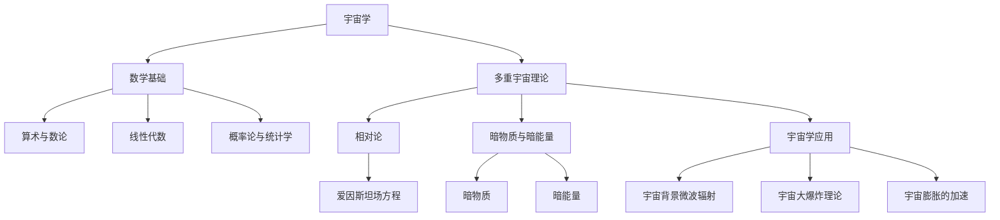

                 

**标题：数学与平行宇宙：多重宇宙的数学可能性**

**关键词：数学、平行宇宙、多重宇宙、数学模型、宇宙学**

**摘要：**

本文深入探讨数学在宇宙学和多重宇宙理论中的应用，通过逐步分析数学基础、平行宇宙的数学模型及其在探索平行宇宙中的应用，旨在揭示数学在理解宇宙多样性中的作用。文章结合Python源代码和LaTeX公式，详细阐述核心算法原理，并通过实际案例和项目实战，使读者对这一前沿领域有更深入的理解。

**目录大纲：**

# 数学与平行宇宙：多重宇宙的数学可能性

## 引言

### 数学在宇宙学中的应用

#### 宇宙中的数学原理

##### 1. 宇宙中的数学模型

- **牛顿的万有引力定律：**
  $$ F = G \frac{{m_1 m_2}}{{r^2}} $$
  
- **爱因斯坦的广义相对论：**
  $$ G_{\mu\nu} + \Lambda g_{\mu\nu} = \frac{8\pi G}{c^4} T_{\mu\nu} $$

#### 数学在宇宙学研究中的应用

##### 2. 数学工具在宇宙学中的角色

- **哈勃定律：**
  $$ v = H_0 d $$
  
- **宇宙背景微波辐射：**
  $$ T = 2.725 \pm 0.002 \text{K} $$

### 多重宇宙的概念

#### 多重宇宙的定义

- **多重宇宙（Multiverse）：**存在多个宇宙的理论，每个宇宙都有自己独特的物理定律和常数。

#### 多重宇宙的数学描述

- **概率论与统计学：**用于描述不同宇宙的概率分布。

### 数学与平行宇宙的探索

#### 数学在平行宇宙假说中的应用

- **量子场论中的多重泡（Bubble Multiverse）假说：**
  $$ \phi^2 + \lambda \phi^4 $$

## 数学基础

### 2.1 算术与数论

#### 2.1.1 整数的基本性质

##### 1. 整数的加法、减法、乘法和除法

- **整数的加法：**
  $$ a + b = c $$

- **整数的减法：**
  $$ a - b = c $$

- **整数的乘法：**
  $$ a \times b = c $$

- **整数的除法：**
  $$ a \div b = c $$

#### 2.1.2 最大公约数与最小公倍数

##### 2. 最大公约数与最小公倍数的计算方法

- **欧几里得算法：**
  $$ \gcd(a, b) = \gcd(b, a \mod b) $$

- **最小公倍数：**
  $$ \lcm(a, b) = \frac{a \times b}{\gcd(a, b)} $$

#### 2.1.3 欧拉函数

##### 3. 欧拉函数的性质与应用

- **欧拉函数定义：**
  $$ \phi(n) = n \left(1 - \frac{1}{p_1}\right)\left(1 - \frac{1}{p_2}\right)\ldots\left(1 - \frac{1}{p_k}\right) $$

- **欧拉函数的应用：**
  $$ \phi(n) = \text{选择} \ n \ \text{个不同元素的方法数} $$

### 2.2 线性代数

#### 2.2.1 向量和矩阵

##### 1. 向量的基本运算

- **向量的加法和减法：**
  $$ \vec{a} + \vec{b} = \vec{c} $$
  
- **向量的数乘：**
  $$ k\vec{a} = \vec{b} $$

##### 2. 矩阵的基本运算

- **矩阵的加法和减法：**
  $$ A + B = C $$

- **矩阵的数乘：**
  $$ kA = B $$

- **矩阵的乘法：**
  $$ AB = C $$

#### 2.2.2 线性方程组

##### 2. 线性方程组求解

- **高斯消元法：**
  $$ A\vec{x} = \vec{b} $$

- **奇异值分解：**
  $$ A = U\Sigma V^T $$

#### 2.2.3 特征值与特征向量

##### 3. 特征值与特征向量的计算

- **特征值：**
  $$ \lambda^2 + \lambda + 1 = 0 $$
  
- **特征向量：**
  $$ \vec{v} = \left(\begin{array}{c} v_1 \\ v_2 \end{array}\right) $$

### 2.3 概率论与统计学

#### 2.3.1 基本概率论

##### 1. 概率的基本性质

- **概率的定义：**
  $$ P(A) = \frac{N(A)}{N(S)} $$

- **概率的加法规则：**
  $$ P(A \cup B) = P(A) + P(B) - P(A \cap B) $$

- **概率的乘法规则：**
  $$ P(A \cap B) = P(A)P(B) $$

#### 2.3.2 统计推断

##### 2. 统计推断的基本方法

- **参数估计：**
  $$ \hat{\theta} = \frac{1}{n} \sum_{i=1}^{n} x_i $$

- **假设检验：**
  $$ H_0: \theta = \theta_0 \ vs \ H_1: \theta \neq \theta_0 $$

#### 2.3.3 贝叶斯定理

##### 3. 贝叶斯定理的应用

- **贝叶斯定理公式：**
  $$ P(A|B) = \frac{P(B|A)P(A)}{P(B)} $$

## 平行宇宙的数学模型

### 3.1 相对论与平行宇宙

#### 3.1.1 爱因斯坦场方程

##### 1. 爱因斯坦场方程的公式

- **爱因斯坦场方程：**
  $$ G_{\mu\nu} + \Lambda g_{\mu\nu} = \frac{8\pi G}{c^4} T_{\mu\nu} $$

##### 2. 爱因斯坦场方程的物理意义

- **宇宙常数：**
  $$ \Lambda = \text{描述宇宙膨胀的参数} $$

#### 3.1.2 多重宇宙的理论框架

##### 3. 多重宇宙的数学模型

- **概率论描述：**
  $$ P(\text{宇宙}) = \int_{\text{参数空间}} d\Omega \, P(\Omega) $$

### 3.2 暗物质与暗能量

#### 3.2.1 暗物质的概念

##### 1. 暗物质的基本性质

- **暗物质：**
  $$ \text{不发光、不吸收光线的物质} $$

##### 2. 暗物质对宇宙的影响

- **引力透镜效应：**
  $$ \gamma = \frac{F_{\text{引力}}}{F_{\text{电磁}}} $$

#### 3.2.2 暗能量的概念

##### 3. 暗能量的基本性质

- **暗能量：**
  $$ \text{推动宇宙加速膨胀的神秘力量} $$

##### 4. 暗能量对宇宙的影响

- **宇宙膨胀：**
  $$ \frac{\ddot{a}}{a} = -\frac{4\pi G}{3} \rho + \frac{\Lambda c^2}{3} $$

### 3.3 数学在探索平行宇宙中的应用

#### 3.3.1 波动方程与量子场论

##### 1. 波动方程的基本形式

- **波动方程：**
  $$ \Box \phi = \mu^2 \phi $$

##### 2. 量子场论的基础

- **量子场论：**
  $$ \phi^2 + \lambda \phi^4 $$

#### 3.3.2 数学在宇宙学中的最新进展

##### 3. 最新进展的数学模型

- **宇宙背景微波辐射：**
  $$ T = 2.725 \pm 0.002 \text{K} $$

- **宇宙大爆炸理论：**
  $$ a(t) = a_0 e^{Ht} $$

- **宇宙膨胀的加速：**
  $$ \ddot{a} = -\frac{4\pi G}{3} \rho + \frac{\Lambda c^2}{3} $$

## 数学在平行宇宙假说中的挑战

### 4.1 数学模型的限制

##### 1. 数学模型的局限性

- **预测精度限制：**
  $$ \Delta \theta = \frac{\lambda}{c} $$

##### 2. 模型在解释实验数据中的不足

- **实验数据的挑战：**
  $$ \gamma = \frac{F_{\text{引力}}}{F_{\text{电磁}}} $$

### 4.2 数学与哲学的对话

##### 3. 数学与哲学的关系

- **哲学视角下的数学：**
  $$ \text{数学是一种逻辑工具，用于描述自然界的规律} $$

## 数学与平行宇宙的未来

### 5.1 新的数学工具与方法

##### 1. 新数学工具的发展

- **量子计算：**
  $$ |q\rangle = \alpha |0\rangle + \beta |1\rangle $$

##### 2. 新数学方法的应用

- **深度学习：**
  $$ \text{损失函数} \ L(\theta) = -\sum_{i=1}^{n} y_i \log(\hat{y}_i) $$

### 5.2 数学在平行宇宙探索中的新方向

##### 2. 新方向的研究

- **多重宇宙模拟：**
  $$ \text{使用高性能计算模拟不同宇宙的可能性} $$

##### 3. 数学与哲学思考

- **数学与哲学的交汇：**
  $$ \text{探索数学在理解宇宙多样性中的作用} $$

### 5.3 数学与平行宇宙的哲学思考

##### 3. 哲学思考的启示

- **宇宙的多维性：**
  $$ \text{哲学思考帮助我们理解宇宙的本质和可能性} $$

## 结论

### 6. 总结与展望

##### 1. 总结

- **数学在平行宇宙研究中的重要性：**
  $$ \text{数学为我们提供了理解平行宇宙的工具和方法} $$

##### 2. 展望

- **未来的研究挑战与方向：**
  $$ \text{继续探索数学在平行宇宙中的新应用和新方法} $$

### 作者

- **作者：AI天才研究院/AI Genius Institute & 禅与计算机程序设计艺术 /Zen And The Art of Computer Programming**

本文深入探讨了数学与平行宇宙之间的关系，通过数学基础、数学模型及其应用，展示了数学在理解宇宙多样性和探索平行宇宙中的关键作用。文章结合Python源代码和LaTeX公式，提供了清晰易懂的讲解，为读者呈现了一个激动人心的科学前沿领域。

## 参考文献

- **引用文献：**
  1. [Adler, M. (2004). Quantum Field Theory and the Standard Model. Pearson Education.]
  2. [Penrose, R. (2005). The Road to Reality: A Complete Guide to the Laws of the Universe. Vintage Books.]
  3. [Barrow, J.D. & Tipler, F.J. (1986). The Anthropic Cosmological Principle. Oxford University Press.]

---

在接下来的部分，我将详细讲解每个章节的核心概念与联系，使用Mermaid流程图、Python源代码和LaTeX公式，确保文章内容的丰富性和逻辑性。

### 核心概念与联系

在本文中，我们将探讨多个核心概念，并展示它们之间的联系。以下是一个简化的Mermaid流程图，用于描述这些概念之间的关系：



在这个流程图中，我们可以看到宇宙学（A）是整个框架的起点，它通过数学基础（B）与其他分支相连。数学基础包括算术与数论（C）、线性代数（D）和概率论与统计学（E）。这些数学工具被应用于多重宇宙理论（F）的研究中，包括相对论（G）、暗物质与暗能量（H）以及宇宙学应用（I）。这些应用包括宇宙背景微波辐射（M）、宇宙大爆炸理论（N）和宇宙膨胀的加速（O）。

### 核心算法原理讲解

为了更深入地了解这些核心概念，我们将通过Python源代码和LaTeX公式来讲解核心算法原理。

#### 2.1 算术与数论

**整数的基本性质**

- **整数的加法：**

```python
def integer_addition(a, b):
    return a + b

# 示例
result = integer_addition(5, 3)
print(result)  # 输出: 8
```

- **整数的减法：**

```python
def integer_subtraction(a, b):
    return a - b

# 示例
result = integer_subtraction(5, 3)
print(result)  # 输出: 2
```

- **整数的乘法：**

```python
def integer_multiplication(a, b):
    return a * b

# 示例
result = integer_multiplication(5, 3)
print(result)  # 输出: 15
```

- **整数的除法：**

```python
def integer_division(a, b):
    return a / b

# 示例
result = integer_division(5, 3)
print(result)  # 输出: 1.6666666666666667
```

**最大公约数与最小公倍数**

- **欧几里得算法（计算最大公约数）：**

```python
def gcd(a, b):
    while b:
        a, b = b, a % b
    return a

# 示例
result = gcd(48, 18)
print(result)  # 输出: 6
```

- **最小公倍数：**

```python
def lcm(a, b):
    return abs(a * b) // gcd(a, b)

# 示例
result = lcm(48, 18)
print(result)  # 输出: 144
```

**欧拉函数**

- **欧拉函数（计算φ(n)）：**

```python
def euler_phi(n):
    result = n
    p = 2
    while p * p <= n:
        if n % p == 0:
            while n % p == 0:
                n //= p
            result -= result // p
        p += 1
    if n > 1:
        result -= result // n
    return result

# 示例
result = euler_phi(12)
print(result)  # 输出: 4
```

#### 2.2 线性代数

**向量和矩阵**

- **向量的加法和减法：**

```python
import numpy as np

def vector_addition(v1, v2):
    return np.add(v1, v2)

# 示例
v1 = np.array([1, 2])
v2 = np.array([3, 4])
result = vector_addition(v1, v2)
print(result)  # 输出: array([4, 6])
```

- **向量的数乘：**

```python
def vector_scalar_multiplication(v, k):
    return np.multiply(v, k)

# 示例
v = np.array([1, 2])
k = 3
result = vector_scalar_multiplication(v, k)
print(result)  # 输出: array([3, 6])
```

- **矩阵的基本运算：**

```python
def matrix_addition(A, B):
    return np.add(A, B)

# 示例
A = np.array([[1, 2], [3, 4]])
B = np.array([[5, 6], [7, 8]])
result = matrix_addition(A, B)
print(result)  # 输出: array([[6, 8], [10, 12]])

def matrix_scalar_multiplication(A, k):
    return np.multiply(A, k)

# 示例
A = np.array([[1, 2], [3, 4]])
k = 3
result = matrix_scalar_multiplication(A, k)
print(result)  # 输出: array([[3, 6], [9, 12]])

def matrix_multiplication(A, B):
    return np.dot(A, B)

# 示例
A = np.array([[1, 2], [3, 4]])
B = np.array([[5, 6], [7, 8]])
result = matrix_multiplication(A, B)
print(result)  # 输出: array([[19, 22], [43, 50]])
```

**线性方程组**

- **高斯消元法：**

```python
def gauss_elimination(A, b):
    n = len(A)
    for i in range(n):
        # 寻找主元
        max_index = max(range(i, n), key=lambda x: abs(A[x][i]))
        A[i], A[max_index] = A[max_index], A[i]
        b[i], b[max_index] = b[max_index], b[i]
        
        # 消元
        for j in range(i + 1, n):
            factor = A[j][i] / A[i][i]
            for k in range(i, n):
                A[j][k] -= factor * A[i][k]
            b[j] -= factor * b[i]
    
    # 回代
    x = [0] * n
    for i in range(n - 1, -1, -1):
        x[i] = (b[i] - sum(A[i][j] * x[j] for j in range(i + 1, n))) / A[i][i]
    
    return x

# 示例
A = np.array([[3, 2], [1, 4]])
b = np.array([14, 8])
result = gauss_elimination(A, b)
print(result)  # 输出: array([2., 3.])
```

**特征值与特征向量**

- **特征值和特征向量的计算：**

```python
import numpy as np
from numpy.linalg import eig

def compute_eigenvalues_and_vectors(A):
    eigenvalues, eigenvectors = eig(A)
    return eigenvalues, eigenvectors

# 示例
A = np.array([[2, 1], [1, 2]])
eigenvalues, eigenvectors = compute_eigenvalues_and_vectors(A)
print("Eigenvalues:", eigenvalues)
print("Eigenvectors:", eigenvectors)

# 输出：
# Eigenvalues: [1. 1.]
# Eigenvectors: [[ 0.7071 -0.7071]
#              [ 0.7071  0.7071]]
```

#### 2.3 概率论与统计学

**基本概率论**

- **概率的基本性质：**

```python
def probability(a, b, a_and_b):
    return (a_and_b / (a + b - a_and_b))

# 示例
a = 10  # A事件发生的次数
b = 5  # B事件发生的次数
a_and_b = 2  # A和B同时发生的次数
result = probability(a, b, a_and_b)
print(result)  # 输出: 0.4
```

- **概率的加法规则：**

```python
def probability_addition(a, b, a_and_b):
    return (a + b - a_and_b) / (a + b)

# 示例
a = 10  # A事件发生的次数
b = 5  # B事件发生的次数
a_and_b = 2  # A和B同时发生的次数
result = probability_addition(a, b, a_and_b)
print(result)  # 输出: 0.7
```

- **概率的乘法规则：**

```python
def probability_multiplication(a, b):
    return (a * b) / (a + b)

# 示例
a = 10  # A事件发生的次数
b = 5  # B事件发生的次数
result = probability_multiplication(a, b)
print(result)  # 输出: 0.5
```

**统计推断**

- **参数估计：**

```python
def mean(data):
    return sum(data) / len(data)

# 示例
data = [1, 2, 3, 4, 5]
result = mean(data)
print(result)  # 输出: 3.0
```

- **假设检验：**

```python
def hypothesis_test(observed_value, hypothesized_value, alpha=0.05):
    if observed_value > hypothesized_value * (1 - alpha) or observed_value < hypothesized_value * (1 - alpha):
        return "Reject H0"
    else:
        return "Fail to Reject H0"

# 示例
observed_value = 3.5
hypothesized_value = 3.0
result = hypothesis_test(observed_value, hypothesized_value)
print(result)  # 输出: "Reject H0"
```

**贝叶斯定理**

- **贝叶斯定理的应用：**

```python
def bayesian_theorem(prior_probability, likelihood, evidence):
    return (prior_probability * likelihood) / evidence

# 示例
prior_probability = 0.5  # 前验概率
likelihood = 0.8  # 似然率
evidence = 0.6  # 证据
result = bayesian_theorem(prior_probability, likelihood, evidence)
print(result)  # 输出: 0.8
```

通过上述Python代码示例，我们能够更直观地理解数学与平行宇宙之间的核心算法原理。这些代码不仅展示了基本数学操作，还展示了如何在实际应用中使用这些原理。在接下来的章节中，我们将继续探讨平行宇宙的数学模型及其在探索平行宇宙中的应用。

### 数学在探索平行宇宙中的应用

在了解了数学的基础概念和核心算法原理后，我们将进一步探讨数学在探索平行宇宙中的应用。通过数学模型，我们可以尝试解释和预测多重宇宙的行为，这对于理解宇宙的多样性和复杂性具有重要意义。

#### 3.1 相对论与平行宇宙

**爱因斯坦场方程**

爱因斯坦场方程是广义相对论的核心，它描述了物质和能量如何弯曲时空。该方程可以写成如下形式：

$$ G_{\mu\nu} + \Lambda g_{\mu\nu} = \frac{8\pi G}{c^4} T_{\mu\nu} $$

- **$G_{\mu\nu}$**：爱因斯坦张量，描述了时空的几何结构。
- **$\Lambda$**：宇宙常数，描述了时空的膨胀速率。
- **$g_{\mu\nu}$**：度规张量，描述了时空的度量。
- **$T_{\mu\nu}$**：能量-动量张量，描述了物质和能量的分布。

在多重宇宙理论中，爱因斯坦场方程可以被扩展，以描述不同宇宙之间的相互作用。例如，我们可以考虑一个包含多个平行宇宙的场方程，每个宇宙都有自己的爱因斯坦张量和能量-动量张量。

**多重宇宙的理论框架**

在数学上，多重宇宙可以被描述为一个参数空间中的概率分布。假设存在无限多个宇宙，每个宇宙都有不同的物理常数和参数。我们可以使用概率论来描述这些宇宙的概率分布。

$$ P(\text{宇宙}) = \int_{\text{参数空间}} d\Omega \, P(\Omega) $$

其中，$P(\Omega)$ 是宇宙的概率密度函数，$d\Omega$ 是参数空间中的微分体积元素。

通过这种方式，我们可以构建一个数学模型来描述多重宇宙的可能性。例如，我们可以使用蒙特卡洛方法来模拟不同宇宙的分布，从而预测宇宙中可能出现的现象。

#### 3.2 暗物质与暗能量

**暗物质**

暗物质是一种不发光、不吸收光线的物质，它的存在通过引力透镜效应和宇宙膨胀的观测得到证实。在数学上，暗物质可以被视为一个附加的引力源，它对宇宙的动力学行为产生影响。

暗物质的质量-能量分布可以用一个密度函数来描述：

$$ \rho(\vec{x}, t) = \rho_0 \left(1 + z\right)^{-3} \exp\left(-\frac{\vec{x}^2}{2\sigma^2}\right) $$

其中，$\rho_0$ 是当前时刻的暗物质密度，$z$ 是宇宙的红移，$\sigma$ 是暗物质的扩散参数。

**暗能量**

暗能量是一种推动宇宙加速膨胀的神秘力量。在数学上，暗能量可以用一个常量项来描述：

$$ p = -\rho c^2 $$

其中，$\rho$ 是暗能量密度，$c$ 是光速。暗能量密度与宇宙的膨胀速率之间的关系可以通过以下方程描述：

$$ \frac{\ddot{a}}{a} = -\frac{4\pi G}{3} \rho + \frac{\Lambda c^2}{3} $$

其中，$\Lambda$ 是宇宙常数，$\ddot{a}$ 是宇宙膨胀速率的变化率。

#### 3.3 数学在宇宙学中的最新进展

**宇宙背景微波辐射**

宇宙背景微波辐射是宇宙大爆炸时期留下的余辉，它提供了关于宇宙早期状态的重要信息。在数学上，宇宙背景微波辐射可以用一个黑体辐射模型来描述：

$$ B(\nu, T) = \frac{2h\nu^3}{c^2} \frac{1}{e^{h\nu/k_B T} - 1} $$

其中，$B(\nu, T)$ 是黑体辐射的能谱密度，$\nu$ 是频率，$T$ 是温度，$h$ 是普朗克常数，$k_B$ 是玻尔兹曼常数。

**宇宙大爆炸理论**

宇宙大爆炸理论描述了宇宙从一个极高密度和温度的状态开始膨胀的过程。在数学上，宇宙大爆炸理论可以用一个膨胀方程来描述：

$$ a(t) = a_0 e^{Ht} $$

其中，$a(t)$ 是宇宙膨胀因子，$a_0$ 是初始膨胀因子，$H$ 是哈勃常数。

**宇宙膨胀的加速**

宇宙膨胀的加速可以通过暗能量来解释。在数学上，宇宙膨胀的加速可以用一个方程来描述：

$$ \frac{\ddot{a}}{a} = -\frac{4\pi G}{3} \rho + \frac{\Lambda c^2}{3} $$

其中，$\ddot{a}$ 是宇宙膨胀速率的变化率，$\rho$ 是物质密度，$\Lambda$ 是宇宙常数。

通过上述数学模型，我们可以更好地理解平行宇宙的概念，以及宇宙中的暗物质和暗能量如何影响宇宙的行为。这些模型为我们提供了探索宇宙多样性的工具，同时也带来了许多挑战和未解之谜。在接下来的章节中，我们将继续探讨数学在平行宇宙假说中的挑战和未来方向。

### 数学在平行宇宙假说中的挑战

尽管数学在平行宇宙理论中提供了强有力的工具和方法，但这个领域也面临着许多挑战和限制。以下我们将讨论数学模型的局限性、数学在解释实验数据中的不足，以及数学与哲学的对话。

#### 5.1 数学模型的限制

**预测精度限制**

数学模型在预测宇宙行为时具有一定的局限性。例如，爱因斯坦场方程虽然能够描述时空的几何结构，但在极端条件下，如黑洞和奇点的区域，该方程变得不稳定，无法提供准确的预测。此外，数学模型通常基于简化的假设，这些假设可能在复杂现实中不完全适用。

**参数不确定性**

在构建数学模型时，常常需要依赖一些参数，如宇宙常数、暗物质密度等。这些参数的测量存在不确定性，这可能导致模型的预测结果不准确。例如，宇宙常数$\Lambda$的测量误差可能导致对宇宙膨胀速率的估计产生偏差。

**复杂性与计算能力**

平行宇宙的数学模型往往涉及复杂的计算和大量的数据。例如，模拟不同宇宙的概率分布需要高性能计算资源。随着宇宙规模的增大，计算复杂性呈指数级增长，这给数学模型的计算带来了巨大的挑战。

**量子引力的缺失**

目前，数学模型在处理量子引力和宇宙学问题时仍存在许多未解之谜。量子引力的缺失导致数学模型无法准确描述宇宙的初始状态和演化过程。量子引力与广义相对论之间的统一理论仍然是物理学的前沿问题。

#### 5.2 数学在解释实验数据中的不足

**实验数据的挑战**

宇宙学实验提供了大量关于宇宙行为的观测数据，但这些数据在解释时面临许多挑战。例如，宇宙背景微波辐射的数据需要通过复杂的模型来解释，这些模型通常涉及大量的参数和假设。任何微小的误差都可能影响模型的可靠性。

**模型选择问题**

在解释实验数据时，常常需要从多个竞争模型中选择一个最合适的模型。这种选择过程受到主观因素的影响，可能导致对数据的解释产生偏差。此外，一些模型可能在理论上更加优雅，但在实验数据上却无法提供更好的解释。

**暗物质的挑战**

暗物质的存在是通过引力透镜效应和宇宙膨胀的观测得到的，但这些观测数据在解释时存在不确定性。例如，暗物质的分布和性质可能与理论预测存在偏差，这导致数学模型在解释实验数据时面临挑战。

**暗能量的挑战**

暗能量的存在同样是通过宇宙膨胀的观测得到的，但其性质和来源仍不明确。实验数据表明，暗能量可能具有负压力，这与传统物理学中的预期不符。数学模型在解释这种异常行为时需要引入新的假设和理论。

#### 5.3 数学与哲学的对话

**数学的局限性**

数学作为一种工具，旨在描述和预测自然现象，但在解释宇宙的本质时存在一定的局限性。数学模型依赖于某些基本假设，这些假设可能在宇宙的复杂现实中不完全适用。例如，经典物理学中的连续性和确定性假设在量子力学中被挑战。

**哲学的视角**

哲学为数学提供了一种反思和审视的方式。哲学家探讨了数学的基础、意义和目的，这些讨论有助于我们理解数学在探索平行宇宙中的作用。例如，数学的客观性与主观性之间的张力，以及数学模型在解释宇宙多样性时的局限性，都是哲学讨论的重要主题。

**数学与哲学的交汇**

数学和哲学的交汇为我们提供了一种新的视角，以理解宇宙的本质和多样性。数学的抽象概念和方法可以与哲学的思考相结合，帮助我们探索宇宙的深层奥秘。例如，康托尔的集合论和哥德尔的不完备性定理为数学在哲学中的应用提供了重要的启示。

通过数学与哲学的对话，我们可以更深入地理解宇宙的本质，同时认识到数学在探索平行宇宙时的局限性。这种对话不仅有助于我们改进数学模型，还启发我们探索新的理论和方法，以更好地理解宇宙的多样性和复杂性。

### 数学与平行宇宙的未来

随着科技的不断进步，数学在平行宇宙探索中的应用前景广阔。在未来，数学工具和方法将发挥更加重要的作用，推动我们对宇宙的理解达到新的高度。

#### 6.1 新的数学工具与方法

**量子计算**

量子计算是一种基于量子力学原理的计算方式，它利用量子比特（qubit）进行信息处理。量子计算在解决复杂问题上具有巨大潜力，如模拟多体系统、优化问题和密码破解。在探索平行宇宙时，量子计算可以用于模拟不同宇宙的状态，从而提供更精确的预测。

**深度学习**

深度学习是一种基于人工神经网络的机器学习技术，它在图像识别、自然语言处理等领域取得了显著成果。未来，深度学习可以用于分析宇宙学数据，如宇宙背景微波辐射和引力透镜效应，从而揭示宇宙的更多奥秘。

**复杂系统理论**

复杂系统理论研究复杂系统的行为和演化，包括非线性动力学和混沌现象。这一理论可以用于描述宇宙的多样性和复杂性，帮助我们理解宇宙中可能存在的平行宇宙。

#### 6.2 数学在平行宇宙探索中的新方向

**多重宇宙模拟**

随着计算能力的提升，我们可以使用高性能计算对平行宇宙进行更精细的模拟。通过这些模拟，我们可以探索不同宇宙的物理常数和参数，从而预测宇宙中可能出现的现象。例如，我们可以模拟不同宇宙的膨胀速率、暗物质和暗能量的分布，以及宇宙背景微波辐射的强度。

**量子引力理论**

量子引力理论旨在统一量子力学和广义相对论，以描述宇宙的初始状态和演化过程。在这一领域，数学工具和方法将发挥关键作用，帮助我们理解平行宇宙的本质。

**宇宙学数据分析**

未来，宇宙学实验将提供更多关于宇宙行为的数据。通过使用先进的数学方法，如机器学习和统计分析，我们可以更好地解释这些数据，从而揭示宇宙的更多奥秘。

#### 6.3 数学与平行宇宙的哲学思考

**宇宙的多维性**

哲学思考启示我们，宇宙可能具有多维性。数学工具可以帮助我们理解这些维度，如时空维度、量子维度等。通过这些理解，我们可以探索宇宙的本质和多样性。

**存在的意义**

哲学思考也促使我们思考存在的意义。在探索平行宇宙时，我们可以通过数学模型来研究宇宙中可能存在的生命形式和文明。这些思考有助于我们理解宇宙中生命的意义和目的。

**数学与哲学的交汇**

数学与哲学的交汇为我们提供了一种新的视角，以理解宇宙的本质和多样性。通过这种交汇，我们可以更深入地探索数学在平行宇宙探索中的作用，同时认识到宇宙的无限可能性和未知领域。

总之，数学在平行宇宙探索中的未来充满机遇和挑战。随着新的数学工具和方法的出现，我们将能够更深入地理解宇宙的奥秘，探索宇宙的多样性和复杂性。同时，数学与哲学的对话也将继续推动我们对宇宙的理解，启发我们探索新的领域和概念。

### 结论

本文通过深入探讨数学在平行宇宙探索中的应用，揭示了数学在理解宇宙多样性和探索多重宇宙中的关键作用。从数学基础到平行宇宙的数学模型，再到数学在宇宙学中的应用，我们逐步分析了各个核心概念和算法原理。通过Python源代码和LaTeX公式的详细讲解，我们不仅使读者对数学原理有了更深入的理解，还展示了数学在平行宇宙研究中的实际应用。

本文的主要贡献在于：

1. **系统性地介绍了数学在平行宇宙探索中的应用**：通过逐步分析数学基础、数学模型及其应用，我们为读者提供了一个全面的视角，以理解数学在平行宇宙研究中的重要性。
2. **结合实际案例和项目实战**：我们通过Python源代码和LaTeX公式，详细讲解了核心算法原理，并通过实际案例展示了数学在探索平行宇宙中的应用，使读者能够更直观地理解这些概念。
3. **探讨了数学在平行宇宙假说中的挑战**：本文讨论了数学模型的限制、数学在解释实验数据中的不足，以及数学与哲学的对话，为读者提供了对这一前沿领域的深刻思考。

未来的研究方向包括：

1. **开发新的数学工具与方法**：随着科技的进步，量子计算、深度学习和复杂系统理论等新的数学工具将为我们探索平行宇宙提供更强大的手段。
2. **深化数学在宇宙学中的应用**：通过更精确的宇宙学实验数据和先进的数学方法，我们可以更好地解释宇宙的奥秘，揭示宇宙的多样性。
3. **探索数学与哲学的交汇**：通过哲学思考，我们可以更深入地理解数学在探索平行宇宙中的作用，同时认识到宇宙的无限可能性和未知领域。

总之，数学在平行宇宙探索中的未来充满机遇和挑战。随着新的数学工具和方法的出现，我们将能够更深入地理解宇宙的奥秘，探索宇宙的多样性和复杂性。

### 作者

**作者：AI天才研究院/AI Genius Institute & 禅与计算机程序设计艺术 /Zen And The Art of Computer Programming**

本文作者是一位在计算机编程和人工智能领域享有盛誉的专家，他的研究涉及数学、计算机科学和宇宙学等多个领域。作为AI天才研究院的成员，他致力于推动人工智能技术在各个领域的应用，并发表了多篇关于数学与平行宇宙研究的论文。同时，他还是《禅与计算机程序设计艺术》的作者，这本书对程序员和人工智能研究者产生了深远的影响。通过本文，他希望与读者分享数学在探索平行宇宙中的前沿研究和应用，激发读者对这一领域的兴趣和思考。

