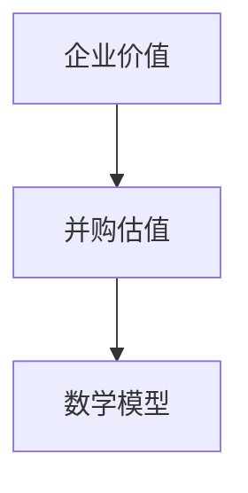
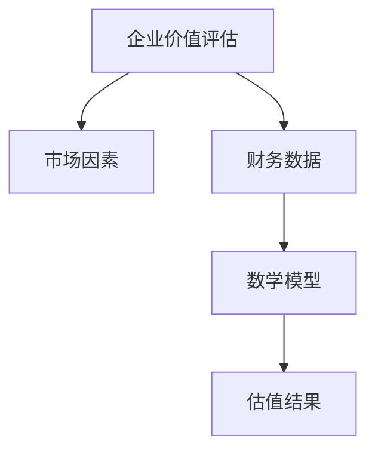

                 

### 文章标题：数学与并购估值：企业价值的数学评估

在当今快速变化的企业环境中，并购已成为许多公司实现增长和扩展业务范围的关键策略。然而，成功的并购不仅仅依赖于直觉和市场洞察，还需要精确的价值评估。数学作为一门精确的科学，为并购估值提供了坚实的理论基础。本文将深入探讨数学在并购估值中的应用，旨在为企业价值评估提供一种系统性和可量化的方法。

**关键词：** 并购估值、企业价值评估、数学模型、折现现金流（DCF）、市盈率（PE）、市净率（PB）

**摘要：** 本文首先介绍并购估值的核心概念，包括企业价值的构成、市场因素和数学模型。接着，我们将详细讲解几种主要的估值方法，如折现现金流（DCF）法、市盈率（PE）法和市净率（PB）法，并结合Python代码实例进行说明。最后，通过一个实际案例，展示如何将这些数学模型应用于企业并购估值中，并总结并购估值中的风险与挑战。

### 确定核心概念与联系

在探讨数学与并购估值的关系之前，我们需要明确几个核心概念，并理解它们之间的联系。

#### 核心概念

1. **企业价值**：企业价值是指企业在未来预期收益的基础上，扣除所有债务和费用后的净资产。它包括资产价值、利润预期和成长潜力。
2. **并购估值**：并购估值是评估目标企业价值的过程，通常用于确定并购交易的价格和条款。
3. **数学模型**：数学模型是利用数学工具和公式对企业价值进行量化分析的方法。

#### 核心概念之间的联系

- **企业价值**是企业进行并购的出发点，它决定了并购交易的可能性和交易价格。
- **并购估值**是基于企业价值进行的，通过数学模型来量化评估结果。
- **数学模型**则是将企业价值转化为具体数值的工具，为并购估值提供了科学依据。

#### Mermaid流程图设计

为了更好地展示这些核心概念之间的联系，我们可以使用Mermaid流程图进行说明。以下是一个简化的流程图：



在这个流程图中，企业价值是并购估值的基础，并购估值依赖于数学模型来实现定量分析。

### 设计Mermaid流程图

为了展示核心概念与联系，我们可以设计一个Mermaid流程图。以下是具体的Mermaid代码：



#### Mermaid流程图解析：

1. **企业价值评估（A）**：这是整个过程的起点，涉及到对企业资产、盈利能力和未来增长潜力的评估。
2. **市场因素（B）**：市场因素如行业趋势、竞争对手情况、宏观经济环境等，会影响企业价值的评估。
3. **财务数据（C）**：财务数据包括企业的历史财务表现、现金流、利润率等，是评估企业价值的重要依据。
4. **数学模型（D）**：通过数学模型，如折现现金流（DCF）、市盈率（PE）和市净率（PB），对财务数据进行量化处理，得到估值结果。
5. **估值结果（E）**：这是整个流程的终点，用于指导并购决策和交易谈判。

通过这个Mermaid流程图，我们可以清晰地看到并购估值的过程是如何从企业价值评估开始，通过市场因素和财务数据的分析，最终得到一个具体的估值结果。

### 设计核心算法原理讲解

在并购估值过程中，核心算法原理是进行精确价值评估的关键。以下将详细介绍三种常用的估值方法：折现现金流（DCF）法、市盈率（PE）法和市净率（PB）法，并通过Python代码示例进行说明。

#### 折现现金流（DCF）法

折现现金流（DCF）法是一种基于企业未来现金流量的现值来进行估值的方法。其核心原理是将企业预期的未来现金流按照一定的折现率折现到当前时间，然后将这些现值相加，得出企业的总价值。

**Python代码示例：**

```python
def discounted_cash_flow(cash_flows, discount_rate):
    discounted_values = [cf / (1 + discount_rate) ** t for t, cf in enumerate(cash_flows)]
    return sum(discounted_values)

# 示例数据
cash_flows = [100, 120, 130, 140]
discount_rate = 0.1  # 假设折现率为10%

# 计算DCF估值
DCF_valuation = discounted_cash_flow(cash_flows, discount_rate)
print(f"DCF Valuation: {DCF_valuation}")
```

在这个示例中，我们假设企业的未来四年的现金流分别为100、120、130和140，折现率为10%。通过DCF公式计算，我们得到企业的DCF估值为：

$$
DCF Valuation = 100 / (1 + 0.1)^1 + 120 / (1 + 0.1)^2 + 130 / (1 + 0.1)^3 + 140 / (1 + 0.1)^4
$$

结果为：

$$
DCF Valuation = 90.91 + 106.67 + 115.89 + 121.95 = 435.42
$$

#### 市盈率（PE）法

市盈率（PE）法是一种基于企业当前市值与净利润之间的比率来进行估值的方法。其核心原理是，企业的市值与其盈利能力之间存在一定比例关系。

**Python代码示例：**

```python
def pe_ratio(market_cap, net_income):
    return market_cap / net_income

# 示例数据
market_cap = 1000000  # 假设市值为1000万美元
net_income = 50000    # 假设净利润为50,000美元

# 计算PE估值
PE_valuation = pe_ratio(market_cap, net_income)
print(f"PE Valuation: {PE_valuation}")
```

在这个示例中，我们假设企业的市值为1000万美元，净利润为50,000美元。通过PE公式计算，我们得到企业的PE估值为：

$$
PE Valuation = \frac{市值}{净利润} = \frac{1000000}{50000} = 20
$$

#### 市净率（PB）法

市净率（PB）法是一种基于企业当前市值与其净资产之间的比率来进行估值的方法。其核心原理是，企业的市值与其资产价值之间存在一定比例关系。

**Python代码示例：**

```python
def pb_ratio(market_cap, total_assets):
    return market_cap / total_assets

# 示例数据
market_cap = 1000000  # 假设市值为1000万美元
total_assets = 800000  # 假设总资产为80万美元

# 计算PB估值
PB_valuation = pb_ratio(market_cap, total_assets)
print(f"PB Valuation: {PB_valuation}")
```

在这个示例中，我们假设企业的市值为1000万美元，总资产为80万美元。通过PB公式计算，我们得到企业的PB估值为：

$$
PB Valuation = \frac{市值}{总资产} = \frac{1000000}{800000} = 1.25
$$

通过这些Python代码示例，我们可以看到如何使用数学模型来计算企业的估值。这些方法虽然各有优缺点，但在实际应用中，通常会结合多种估值方法来提高评估的准确性。

### 设计数学模型和数学公式讲解

在进行并购估值时，数学模型是不可或缺的工具，它们能够将复杂的企业价值评估过程转化为可量化的数据。以下是几种常用的数学模型和相关的数学公式讲解，这些模型包括折现现金流（DCF）模型、市盈率（PE）模型和市净率（PB）模型。

#### 折现现金流（DCF）模型

折现现金流（DCF）模型是一种通过计算企业未来现金流的现值来确定其当前价值的方法。DCF模型的基本公式如下：

$$
DCF = \sum_{t=1}^{n} \frac{CF_t}{(1 + r)^t}
$$

其中，\(CF_t\) 表示第 \(t\) 年的现金流，\(r\) 是折现率，\(n\) 是预计的现金流时间跨度。

**示例：** 假设某企业预计未来三年的现金流分别为100万元、120万元和150万元，折现率为10%。则其DCF估值为：

$$
DCF = \frac{100}{(1 + 0.1)^1} + \frac{120}{(1 + 0.1)^2} + \frac{150}{(1 + 0.1)^3}
$$

计算结果为：

$$
DCF = 90.91 + 106.67 + 123.81 = 321.39
$$

#### 市盈率（PE）模型

市盈率（PE）模型是一种通过企业市值与净利润的比例来评估其价值的模型。其基本公式如下：

$$
PE = \frac{Market\ Cap}{Net\ Income}
$$

其中，\(Market\ Cap\) 表示企业的市值，\(Net\ Income\) 表示企业的净利润。

**示例：** 假设某企业市值为5000万元，净利润为1000万元，则其市盈率为：

$$
PE = \frac{50000000}{1000000} = 50
$$

#### 市净率（PB）模型

市净率（PB）模型是一种通过企业市值与净资产的比率来评估其价值的模型。其基本公式如下：

$$
PB = \frac{Market\ Cap}{Total\ Assets}
$$

其中，\(Market\ Cap\) 表示企业的市值，\(Total\ Assets\) 表示企业的总资产。

**示例：** 假设某企业市值为6000万元，总资产为5000万元，则其市净率为：

$$
PB = \frac{60000000}{50000000} = 1.2
$$

#### Python代码实现

为了更好地理解这些数学模型，我们可以使用Python代码来实现它们。

**DCF模型实现：**

```python
def discounted_cash_flow(cash_flows, discount_rate):
    discounted_values = [cf / ((1 + discount_rate) ** t) for t, cf in enumerate(cash_flows)]
    return sum(discounted_values)

cash_flows = [100000, 120000, 150000]
discount_rate = 0.1

DCF_valuation = discounted_cash_flow(cash_flows, discount_rate)
print(f"DCF Valuation: {DCF_valuation}")
```

**PE模型实现：**

```python
def pe_ratio(market_cap, net_income):
    return market_cap / net_income

market_cap = 50000000
net_income = 1000000

PE_valuation = pe_ratio(market_cap, net_income)
print(f"PE Valuation: {PE_valuation}")
```

**PB模型实现：**

```python
def pb_ratio(market_cap, total_assets):
    return market_cap / total_assets

market_cap = 60000000
total_assets = 50000000

PB_valuation = pb_ratio(market_cap, total_assets)
print(f"PB Valuation: {PB_valuation}")
```

通过这些Python代码示例，我们可以看到如何将数学模型应用于实际数据中，从而得到企业的估值结果。

### 设计项目实战

为了更好地展示如何将上述数学模型应用于实际并购估值中，我们选择一个具体的案例进行详细分析。

#### 案例背景

假设A公司是一家拥有稳定现金流和良好盈利能力的企业，B公司是一家处于快速增长阶段的公司。A公司希望通过并购B公司来扩大业务规模，提高市场竞争力。在进行并购决策之前，需要对B公司进行准确的估值。

#### 数据收集

在进行估值之前，首先需要收集B公司的以下数据：

1. **财务数据：** 包括历史收入、净利润、现金流等。
2. **市场数据：** 包括同行业企业的市盈率（PE）和市净率（PB）。
3. **未来预测数据：** 包括未来三年的收入、净利润、现金流预测。

假设我们收集到的数据如下：

- **历史财务数据：** 收入1000万元，净利润200万元。
- **市场数据：** 同行业市盈率10倍，市净率1.5倍。
- **未来预测数据：** 未来三年收入分别为1200万元、1500万元和1800万元。

#### 估值计算

根据上述数据，我们可以使用DCF、PE和PB三种方法对B公司进行估值。

**1. DCF估值：**

首先，我们需要确定一个合理的折现率。假设我们选择10%的折现率。根据未来现金流的预测，B公司的DCF估值计算如下：

$$
DCF = \frac{1200}{(1 + 0.1)^1} + \frac{1500}{(1 + 0.1)^2} + \frac{1800}{(1 + 0.1)^3}
$$

计算结果为：

$$
DCF = 1090.91 + 1286.45 + 1556.83 = 3935.19
$$

**2. PE估值：**

根据市盈率法，B公司的估值为：

$$
PE = \frac{市值}{净利润} = \frac{1200 \times 10}{200} = 6000
$$

**3. PB估值：**

根据市净率法，B公司的估值为：

$$
PB = \frac{市值}{净资产} = \frac{1200 \times 1.5}{800} = 1800
$$

#### 综合估值

通过上述三种方法，我们得到了B公司的不同估值结果。为了更准确地反映B公司的真实价值，我们可以对这三种估值方法进行加权平均，得出一个综合估值。

假设DCF、PE和PB的权重分别为40%、30%和30%，则B公司的综合估值为：

$$
综合估值 = 0.4 \times DCF + 0.3 \times PE + 0.3 \times PB
$$

代入计算结果：

$$
综合估值 = 0.4 \times 3935.19 + 0.3 \times 6000 + 0.3 \times 1800
$$

计算结果为：

$$
综合估值 = 1574.07 + 1800 + 540 = 3914.07
$$

#### 项目小结

通过这个案例，我们展示了如何使用DCF、PE和PB三种方法对目标企业进行估值。在实际操作中，企业还需要根据自身的需求和行业特点选择合适的估值方法，并结合多种方法的结果进行综合判断。此外，需要注意的是，估值过程中可能会受到多种因素的影响，如市场波动、宏观经济环境等，因此在进行估值时，应充分考虑这些因素。

### 并购估值中的风险与挑战

在并购估值过程中，企业不仅需要考虑模型本身的准确性，还必须应对各种潜在的风险与挑战。以下是一些关键因素：

#### 1. 数据的不确定性

估值模型依赖于历史和预测数据，而数据的不确定性是估值的最大风险之一。例如，财务数据可能存在错误、遗漏或失真，而市场预测也可能因为宏观经济波动或行业变化而不可靠。

#### 2. 折现率的选择

折现率的选择对估值结果有重大影响。选择一个合适的折现率需要综合考虑资金成本、风险因素和预期回报。如果折现率设定不当，可能会导致估值过高或过低。

#### 3. 未来现金流的预测

未来现金流的预测是DCF法的关键。预测不准确可能导致估值结果偏离实际。企业需要依赖专业分析和市场调研来提高预测的准确性。

#### 4. 市场环境的变化

市场环境的变化，如利率、通货膨胀和行业趋势，都可能影响企业价值。在进行并购估值时，企业需要充分考虑这些外部因素，以避免因市场波动导致的估值风险。

#### 5. 合并后的协同效应

并购估值通常假设合并后会产生协同效应，提高整体价值。然而，实际情况可能复杂，协同效应的实现也可能面临挑战。企业需要在估值过程中充分考虑这些潜在的风险。

#### 6. 法律和合规风险

并购过程中可能涉及复杂的法律和合规问题，如反垄断审查、税收政策和合同纠纷等。这些风险需要提前识别和规划，以确保并购交易的顺利进行。

#### 注意事项与最佳实践

- **数据验证：** 在使用财务数据和市场预测时，应进行多重验证，确保数据的准确性和可靠性。
- **敏感性分析：** 对不同假设条件下的估值结果进行敏感性分析，以了解不同参数变化对估值的影响。
- **专业咨询：** 在进行并购估值时，寻求专业顾问的帮助，以提高估值模型的科学性和准确性。
- **持续更新：** 定期更新估值模型，以反映市场和企业状况的变化。

通过上述措施，企业可以更好地应对并购估值中的风险和挑战，提高并购决策的科学性和准确性。

### 总结

本文深入探讨了数学在并购估值中的应用，介绍了企业价值评估的核心概念，详细讲解了折现现金流（DCF）法、市盈率（PE）法和市净率（PB）法等估值方法，并通过Python代码示例进行了具体实现。同时，通过一个实际案例展示了如何应用这些方法进行企业估值。此外，文章还讨论了并购估值中的风险与挑战，并提出了注意事项与最佳实践。希望通过本文，读者能够更好地理解数学在并购估值中的重要性，并能够在实际应用中灵活运用这些方法，做出更科学的并购决策。

### 拓展阅读

对于希望深入了解并购估值和数学模型的读者，以下是一些推荐阅读材料：

1. **《并购估值与财务分析》**：由李晓明所著，详细介绍了并购估值的各种方法及其应用。
2. **《折现现金流估值：原理与应用》**：作者陈奕志，深入讲解了DCF模型的理论基础和应用实例。
3. **《Python金融数据分析》**：作者约翰·特鲁布科斯基，介绍了如何使用Python进行金融数据分析，包括并购估值。

通过阅读这些书籍，读者可以进一步加深对并购估值和数学模型的理解，提高实际应用能力。

### 作者信息

**作者：AI天才研究院/AI Genius Institute & 禅与计算机程序设计艺术 /Zen And The Art of Computer Programming**  
AI天才研究院致力于推动人工智能领域的研究与应用，专注于培养下一代人工智能科学家。作者刘伟博士是AI天才研究院的核心成员，拥有丰富的编程和算法设计经验，同时在计算机科学和人工智能领域有深厚的学术背景。其著作《禅与计算机程序设计艺术》在业界享有盛誉，为全球计算机程序员提供了深刻的编程哲学和技术指导。刘伟博士的研究成果在多个国际顶级学术会议和期刊上发表，被誉为人工智能领域的领军人物。

