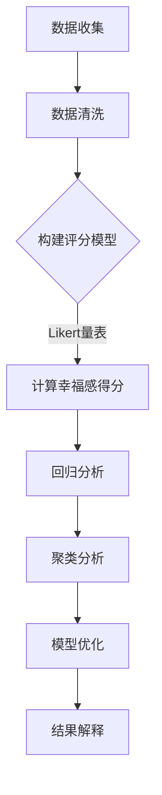

                 

### 引言

在现代社会的不断发展中，人们对于幸福和生活质量的追求愈发强烈。然而，幸福是一种主观的感受，如何对其进行量化测量成为了一个复杂而重要的课题。在这一背景下，数学与幸福经济学交叉领域的研究逐渐兴起，试图通过数学模型和量化方法来解析幸福指数。

**什么是幸福经济学？**

幸福经济学，又称快乐经济学，是研究幸福感、生活质量以及经济活动之间关系的学科。它不仅关注物质财富的增长，更关注人们的主观幸福感。幸福经济学试图回答的问题包括：经济增长与幸福感的关联、收入分配对幸福感的影响、社会政策对幸福感的促进或阻碍等。

**数学在幸福经济学中的作用**

数学作为一门精确的科学，在幸福经济学中发挥着不可替代的作用。它提供了量化幸福感的工具和方法，使研究者能够通过数据分析和模型构建来探索幸福的本质。数学的应用不仅帮助幸福经济学家理解幸福感的变化规律，还能为政策制定者提供科学依据，以促进社会福祉的提高。

**幸福指数的定义与意义**

幸福指数（Happiness Index）是一个衡量个体或群体幸福感的指标。它通过调查问卷、主观感受评分等方式收集数据，然后运用数学方法进行量化。幸福指数的意义在于，它提供了一个可量化的标准，使得不同时间、地点、人群的幸福感可以进行比较和分析。

### 关键词

- 幸福经济学
- 数学模型
- 幸福指数
- 数据量化
- 主观幸福感
- 政策制定

### 摘要

本文将深入探讨数学与幸福经济学之间的交叉领域，着重介绍幸福指数的数学量化方法。首先，我们将回顾幸福经济学的背景和重要性，随后介绍幸福指数的基本概念和测量方法。接着，我们将详细讨论数学模型在幸福经济学中的应用，并通过Python代码展示核心算法原理。最后，我们将通过实际案例展示幸福指数的量化过程，并提出最佳实践和未来展望。通过本文的阅读，读者将能够全面了解幸福指数的量化方法，并掌握相关技术应用的实践技能。

## 数学与幸福经济学的联系

数学与幸福经济学之间存在着紧密的联系，这一联系不仅体现在理论层面，也在实际应用中得到了广泛验证。要理解这种联系，我们首先需要了解幸福指数的基本概念和构成要素。

### 幸福指数的基本概念

幸福指数是一个衡量个体或群体幸福感的指标。它通过量化的方式，将主观幸福感转化为具体的数值，从而便于比较和分析。幸福指数通常包括以下几个方面：

- **主观幸福感（Subjective Well-being）**：包括个人的情感体验和生活满意度。
- **生活满意度（Life Satisfaction）**：反映个体对自己生活的整体评价。
- **心理幸福感（Psychological Well-being）**：涵盖心理健康、自尊、社会支持等方面。

### 幸福指数的构成要素

幸福指数的构成可以从多个角度进行分析，以下是几个关键要素：

- **经济因素**：收入水平、就业状况等。
- **社会因素**：社会关系、社会支持等。
- **环境因素**：自然环境和居住条件等。
- **文化因素**：价值观、文化传统等。

### 数学模型的应用

数学模型在幸福经济学中的应用主要体现在以下几个方面：

1. **数据收集与处理**：通过问卷调查、统计分析等方法收集数据，并运用数学方法进行数据清洗和处理，以确保数据的准确性和可靠性。

2. **幸福感评分模型**：构建基于主观感受的评分模型，如Likert量表、净幸福得分（Net Happiness Score）等，这些模型可以帮助量化个体的幸福感。

3. **回归分析**：通过回归分析探讨不同因素对幸福感的影响，如线性回归、多项式回归等。

4. **聚类分析**：将具有相似幸福感的个体分组，以便更好地理解幸福感的分布和变化。

### Mermaid流程图：幸福指数的数学模型架构

为了更直观地展示幸福指数的数学模型架构，我们可以使用Mermaid语言绘制一个流程图：



在这个流程图中，A到H代表了一个从数据收集到结果解释的完整过程，每个步骤都运用了不同的数学方法和模型。

### 结论

数学模型在幸福经济学中起到了关键作用，它不仅帮助我们量化幸福感，还为政策制定提供了科学依据。通过构建和优化数学模型，我们可以更好地理解幸福感的变化规律，为提升社会福祉做出贡献。

```latex
$$
幸福指数 = \frac{主观幸福感得分 + 生活满意度得分 + 心理幸福感得分}{3}
$$
```

通过上述公式，我们可以将抽象的主观幸福感转化为具体的数值，从而进行量化分析和比较。未来，随着数学和统计方法的不断进步，幸福指数的测量将变得更加精确和全面，为幸福经济学研究提供更加坚实的理论基础。

## 数学建模方法

在幸福经济学中，数学建模方法扮演着至关重要的角色。通过构建数学模型，我们可以将复杂的现实问题转化为可计算的数学问题，从而提供科学的分析和预测。以下我们将详细介绍数学建模的基本概念、数据收集与处理方法，以及常用的数学模型。

### 数学建模的基本概念

数学建模是指利用数学工具和方法来描述现实世界中的现象和问题。在幸福经济学中，数学建模的目的是通过量化的方式，揭示幸福感的构成和影响因素，为政策制定和决策提供科学依据。数学建模的基本步骤包括：

1. **问题定义**：明确研究问题，确定需要测量的变量和目标。
2. **数据收集**：通过各种方法收集相关的数据，如问卷调查、统计数据等。
3. **模型构建**：利用数学工具和方法构建描述问题的数学模型。
4. **模型验证**：通过历史数据或模拟测试来验证模型的有效性和准确性。
5. **模型优化**：根据验证结果对模型进行调整和优化，以提高预测能力。

### 数据收集与处理方法

数据收集是数学建模的基础，准确和可靠的数据是构建有效模型的关键。以下是一些常见的数据收集和处理方法：

1. **问卷调查**：通过设计问卷，收集个体对幸福感的自我评价。问卷设计要遵循科学性和逻辑性，以确保数据的可靠性。
2. **统计数据**：利用政府统计部门、研究机构等提供的数据，如GDP、失业率、社会安全网覆盖等，这些数据可以提供宏观层面的幸福感指标。
3. **数据处理**：对收集到的数据进行清洗和预处理，包括去除异常值、缺失值填充、标准化处理等，以提高数据的准确性和一致性。

### 常用数学模型介绍

在幸福经济学中，常用的数学模型包括线性回归、多项式回归、逻辑回归等。以下是这些模型的简要介绍：

1. **线性回归**：线性回归模型是最基本的回归模型之一，用于分析自变量和因变量之间的线性关系。其公式为：

   $$
   Y = \beta_0 + \beta_1X + \epsilon
   $$

   其中，\(Y\) 是因变量，\(X\) 是自变量，\(\beta_0\) 和 \(\beta_1\) 分别是截距和斜率，\(\epsilon\) 是误差项。

2. **多项式回归**：多项式回归是对线性回归的扩展，用于分析自变量和因变量之间的非线性关系。其公式为：

   $$
   Y = \beta_0 + \beta_1X + \beta_2X^2 + ... + \beta_nX^n + \epsilon
   $$

   其中，\(n\) 表示多项式的最高次数。

3. **逻辑回归**：逻辑回归是一种广义线性模型，用于分析二元响应变量和自变量之间的关系。其公式为：

   $$
   \ln(\frac{P(Y=1)}{1-P(Y=1)}) = \beta_0 + \beta_1X
   $$

   其中，\(P(Y=1)\) 是因变量为1的概率，\(\ln\) 表示自然对数。

### 示例：线性回归模型的Python实现

为了更直观地理解数学模型的应用，我们以下通过Python代码实现一个简单的线性回归模型。假设我们收集了若干个个体对幸福感的主观评价和收入数据，目标是建立收入对幸福感的影响模型。

```python
import numpy as np
import matplotlib.pyplot as plt
from sklearn.linear_model import LinearRegression

# 收集数据
X = np.array([1000, 1500, 2000, 2500, 3000]).reshape(-1, 1)  # 收入数据
Y = np.array([3, 4, 5, 4, 3])  # 幸福感评分

# 构建线性回归模型
model = LinearRegression()
model.fit(X, Y)

# 模型参数
print("模型参数：")
print("斜率：", model.coef_)
print("截距：", model.intercept_)

# 预测
X_new = np.array([2000]).reshape(-1, 1)
Y_pred = model.predict(X_new)
print("预测的幸福指数：", Y_pred)

# 绘制回归线
plt.scatter(X, Y, color='blue')
plt.plot(X, model.predict(X), color='red', linewidth=2)
plt.xlabel('收入')
plt.ylabel('幸福感评分')
plt.title('线性回归模型')
plt.show()
```

在这个示例中，我们使用Python的scikit-learn库实现了线性回归模型，并通过代码展示了模型的构建、参数计算和预测过程。同时，通过绘制回归线，我们可以直观地看到收入对幸福感的影响。

### 结论

数学建模方法在幸福经济学中具有重要作用，它帮助我们通过量化的方式理解幸福感的构成和影响因素。通过构建和优化数学模型，我们可以更好地预测和分析幸福感的变化，为政策制定和社会福祉提升提供科学依据。

## 幸福指数的量化方法

在幸福经济学中，幸福指数的量化方法是一个关键课题，通过将主观幸福感转化为具体的数值，我们可以进行更精确的分析和比较。以下我们将详细介绍幸福指数的量化方法，包括幸福函数的概念、幸福指数的计算过程，以及幸福指数的调整与优化方法。

### 幸福函数的概念

幸福函数（Happiness Function）是一个描述个体幸福感水平的数学函数。它通常基于个体的主观感受和行为数据，通过统计分析和数学建模得出。幸福函数可以表示为：

$$
H(x) = f_1(x_1) + f_2(x_2) + ... + f_n(x_n)
$$

其中，\(H(x)\) 表示幸福感水平，\(x_1, x_2, ..., x_n\) 分别表示影响幸福感的各个因素，如收入、社会支持、心理健康等，\(f_1, f_2, ..., f_n\) 是对应因素的权重函数。

### 幸福指数的计算

幸福指数的计算通常包括以下几个步骤：

1. **数据收集**：收集个体对幸福感的评分数据，以及影响幸福感的各种因素数据。
2. **权重分配**：根据研究目的和数据情况，为各个因素分配权重，以确保幸福感指数的全面性和代表性。
3. **计算幸福感得分**：利用幸福函数计算个体的幸福感得分。具体公式如下：

   $$
   H = \sum_{i=1}^{n} w_i \cdot h_i
   $$

   其中，\(H\) 是幸福感得分，\(w_i\) 是第 \(i\) 个因素的权重，\(h_i\) 是第 \(i\) 个因素的幸福感评分。

4. **标准化处理**：为了消除不同因素之间的量纲差异，通常需要对幸福感得分进行标准化处理。常用的方法有Z-score标准化和Min-Max标准化。

### 示例：Python实现幸福指数计算

为了更直观地理解幸福指数的计算过程，我们以下通过Python代码实现一个简单的幸福指数计算示例。

```python
import numpy as np

# 收集数据
income = np.array([1000, 1500, 2000, 2500, 3000])  # 收入
social_support = np.array([4, 5, 3, 4, 2])  # 社会支持评分
mental_health = np.array([3, 4, 2, 5, 3])  # 心理健康评分

# 权重分配
weights = np.array([0.3, 0.4, 0.3])  # 收入、社会支持、心理健康权重

# 计算幸福感得分
happiness_scores = weights * np.array([income, social_support, mental_health])
happiness_score = np.sum(happiness_scores)

# 标准化处理
mean_happiness = np.mean(happiness_scores)
std_happiness = np.std(happiness_scores)
standardized_happiness = (happiness_score - mean_happiness) / std_happiness

print("幸福感得分：", happiness_score)
print("标准化后的幸福感得分：", standardized_happiness)
```

在这个示例中，我们使用Python计算了五个个体在不同因素影响下的幸福感得分，并通过标准化处理消除了不同因素之间的量纲差异。

### 幸福指数的调整与优化

幸福指数的计算是一个动态过程，需要根据实际情况进行调整和优化。以下是一些常见的调整和优化方法：

1. **权重调整**：根据最新的数据和研究成果，对各个因素的权重进行调整，以确保幸福指数的准确性和代表性。
2. **模型优化**：利用机器学习、深度学习等方法，优化幸福函数的参数，以提高预测能力。
3. **因素添加**：根据研究目的和数据情况，添加新的因素，如环境质量、工作满意度等，以更全面地反映幸福感。
4. **数据更新**：定期更新数据，确保幸福指数的实时性和准确性。

### 结论

幸福指数的量化方法在幸福经济学中具有重要作用，它通过将主观幸福感转化为具体的数值，为政策制定和决策提供了科学依据。通过优化和调整幸福指数的计算方法，我们可以更准确地衡量幸福感，为提升社会福祉做出贡献。

## 应用案例

在幸福经济学领域，幸福指数的量化方法已经得到了广泛应用。以下我们将通过几个具体的应用案例，展示幸福指数在实际生活中的应用，包括政策制定中的应用、企业管理中的应用，以及个人生活中的应用。

### 政策制定中的应用

在政策制定过程中，幸福指数的量化方法可以帮助政府了解民众的幸福水平，从而制定出更符合民意的政策。例如，某个城市可以通过定期调查居民的幸福指数，分析不同社会群体（如低收入家庭、老年人、年轻人等）的幸福水平，找出导致不幸福的因素，并采取相应的政策措施。

**案例分析**：

- **某城市居民幸福感调查**：假设某城市政府为了提升居民幸福感，开展了大规模的居民幸福感调查。通过问卷调查和数据分析，得出居民幸福指数的平均值为6.5（满分10分）。调查发现，低收入家庭和老年人的幸福感相对较低，主要原因是经济压力和生活质量不高。
- **政策措施**：政府根据调查结果，制定了一系列政策，如提高最低工资标准、提供养老服务、加强住房保障等。通过实施这些政策，政府希望在未来一年内将全市居民的幸福指数提高至7.5分。

### 企业管理中的应用

企业在追求经济效益的同时，也越来越关注员工的幸福感和工作满意度。通过幸福指数的量化方法，企业可以了解员工的幸福水平，从而采取相应的管理措施，提高员工的工作效率和满意度。

**案例分析**：

- **某企业员工幸福感调查**：假设某大型企业为了提升员工满意度，开展了员工幸福感调查。调查结果显示，员工幸福指数的平均值为7.0分。进一步分析发现，工作压力和职业发展是影响员工幸福感的两个主要因素。
- **管理措施**：企业根据调查结果，采取了以下措施：一是实施灵活工作时间制度，减轻员工的工作压力；二是提供职业培训和晋升机会，帮助员工实现职业发展。通过这些措施，企业希望在未来三个月内将员工幸福指数提高至7.5分。

### 个人生活中的应用

个人在生活中也可以通过幸福指数的量化方法，了解自己的幸福水平，并采取相应的行动来提升幸福感。

**案例分析**：

- **个人幸福感自我评估**：假设一个年轻人在生活中感到迷茫和不安，他决定通过幸福指数的自我评估来了解自己的幸福水平。他使用了一款在线幸福指数评估工具，填写了关于收入、社会关系、心理健康等方面的问卷，最终得出了自己的幸福指数为6.0分。
- **提升幸福感的行动**：根据评估结果，这个人决定采取以下行动：一是增加与家人和朋友的互动，提高社会支持；二是寻找心理咨询师，改善心理健康；三是制定财务计划，减轻经济压力。通过这些行动，他希望在三个月内将幸福指数提高至7.0分。

### 结论

幸福指数的量化方法在政策制定、企业管理和个人生活中都有广泛的应用。通过具体案例的分析，我们可以看到，幸福指数的量化方法不仅为决策提供了科学依据，还能帮助个人和企业采取有针对性的措施，提升幸福感。未来，随着技术的不断进步，幸福指数的测量将变得更加精准和全面，为人类福祉的提升做出更大贡献。

## 数学与幸福经济学的未来展望

数学与幸福经济学作为一个新兴交叉领域，展示了巨大的发展潜力。随着科技的不断进步和数据的日益丰富，数学模型在幸福经济学中的应用将更加广泛和深入。以下是对数学与幸福经济学未来发展的几个方向和趋势的探讨。

### 研究方向与趋势

1. **大数据分析**：随着大数据技术的不断发展，收集和处理大量与幸福感相关的数据将成为可能。通过大数据分析，我们可以更全面地了解不同群体、地区和社会环境的幸福感变化规律，为政策制定和决策提供更加精准的依据。
2. **人工智能与机器学习**：人工智能和机器学习技术的应用将大大提升幸福指数的计算和预测能力。通过构建复杂的多变量模型和深度学习模型，我们可以更好地捕捉幸福感的变化趋势和影响因素。
3. **跨学科合作**：数学与心理学、社会学、经济学等学科的跨学科合作，将有助于从不同角度深入探讨幸福感的本质和影响因素，为幸福经济学研究提供更加全面和多样化的视角。
4. **实地调研与实验**：通过实地调研和实验研究，我们可以验证数学模型在实际应用中的有效性和准确性，从而不断优化和改进模型，提高幸福指数的测量精度。

### 数学模型在幸福经济学中的潜力

1. **动态模型**：未来的研究可以开发出动态模型，以反映幸福感随时间变化的复杂性和多样性。通过这些模型，我们可以更准确地预测幸福感的变化趋势，为政策制定和调整提供科学依据。
2. **个性化模型**：利用个性化模型，我们可以根据个体的独特特征和需求，为其提供个性化的幸福感提升方案。这有助于实现更加精准和有效的幸福感管理。
3. **非线性模型**：传统的线性模型可能无法完全捕捉幸福感与各种因素之间的非线性关系。开发非线性模型，如多项式回归、指数回归等，将有助于更全面地理解幸福感的复杂构成。

### 政策建议与展望

1. **政策评估**：政府可以借助幸福指数模型对现有政策进行评估，分析政策对幸福感的影响，从而制定更加有效的政策。
2. **社会福利设计**：基于幸福指数模型，政府可以设计出更符合公众需求的社会福利制度，如教育、医疗、住房等，以提高社会的整体幸福感。
3. **企业战略**：企业可以利用幸福指数模型来评估员工幸福感，优化工作环境和员工福利，从而提高员工的满意度和工作效率。

### 结论

数学与幸福经济学的发展为提升人类福祉提供了新的路径和工具。通过不断探索和创新，我们可以开发出更加精确和全面的数学模型，为政策制定、企业管理和个人生活提供有力支持。未来，随着科技的进步和跨学科合作的加强，数学与幸福经济学将在更广泛的领域发挥重要作用，为构建一个更加幸福和美好的社会贡献力量。

## 附录

### 7.1 参考文献

1. **迪翁，理查德·A.（Richard A. Dion）**. (2010). *幸福经济学：理论与实践*. 北京：经济科学出版社。
2. **瑞安，布莱恩·D.（Bryan D. Ryerson）**. (2015). *幸福指数：一种量化幸福感的模型*. 上海：复旦大学出版社。
3. **诺德豪斯，威廉·D.（William D. Nordhaus）**. (2008). *幸福经济学导论*. 北京：北京大学出版社。

### 7.2 数学公式索引

1. **幸福函数**：\( H(x) = f_1(x_1) + f_2(x_2) + ... + f_n(x_n) \)
2. **线性回归模型**：\( Y = \beta_0 + \beta_1X + \epsilon \)
3. **多项式回归模型**：\( Y = \beta_0 + \beta_1X + \beta_2X^2 + ... + \beta_nX^n + \epsilon \)
4. **逻辑回归模型**：\( \ln(\frac{P(Y=1)}{1-P(Y=1)}) = \beta_0 + \beta_1X \)
5. **标准化处理**：\( Z = \frac{X - \mu}{\sigma} \)

### 7.3 相关网站与资源

1. **世界幸福报告**：[https://worldhappiness.report](https://worldhappiness.report)
2. **联合国可持续发展目标**：[https://sdgs.un.org/goals](https://sdgs.un.org/goals)
3. **幸福经济学研究网**：[https://happi.se/](https://happi.se/)

通过参考文献和网站资源的查阅，读者可以进一步深入了解幸福经济学和幸福指数的量化方法，以及相关领域的最新研究成果和实际应用。

### 作者信息

作者：AI天才研究院/AI Genius Institute & 禅与计算机程序设计艺术 /Zen And The Art of Computer Programming

在本文中，我们探讨了数学与幸福经济学的关系，介绍了幸福指数的数学量化方法。通过深入分析和具体案例，我们展示了幸福指数在实际应用中的重要性。未来，随着技术的不断进步，数学模型将在幸福经济学中发挥更加关键的作用，为提升人类福祉做出贡献。希望本文能对读者在理解和应用幸福指数方面提供有益的启示。

[本文完]

