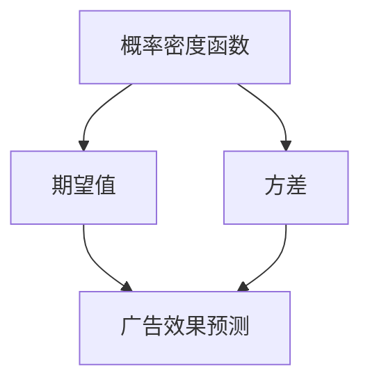
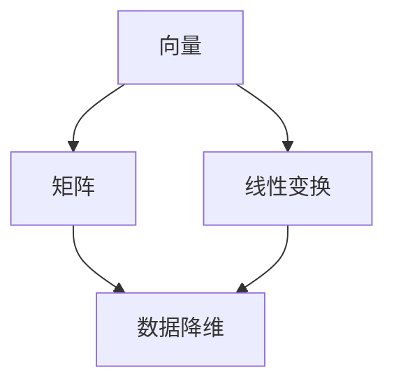
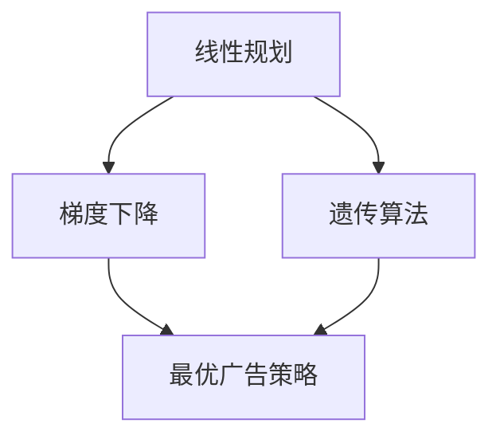

                 

## 数学与广告效果：广告投放的数学优化

在当今数字化时代，广告投放已成为企业竞争的关键策略之一。广告投放的成功与否，不仅取决于广告内容的质量，还与广告投放的精准度和效率密切相关。随着大数据和人工智能技术的飞速发展，数学优化在广告投放中的应用变得越来越重要。本文将深入探讨数学与广告效果之间的关联，通过介绍核心概念、算法原理、数学模型以及实际项目实战，帮助读者理解并掌握广告投放的数学优化方法。

关键词：广告投放、数学优化、概率论、线性代数、算法原理、数学模型

摘要：本文旨在揭示数学优化在广告投放中的关键作用，通过阐述数学与广告效果的密切关系，介绍核心概念与联系、核心算法原理、数学模型以及项目实战。通过本文的阅读，读者将能够深入了解广告投放的数学优化方法，为实际业务提供理论支持和实践指导。

----------------------------------------------------------------

### 背景介绍

广告投放作为一种市场营销手段，其目的在于通过特定渠道向目标受众传达产品或服务的相关信息，以达到提升品牌知名度、促进销售转化等目标。然而，在竞争激烈的市场环境中，广告投放的效果往往受到多种因素的影响，包括受众分析、广告创意、投放策略等。随着互联网的普及和大数据技术的发展，广告投放逐渐从传统的粗放式投放转向精细化、数据驱动的模式。

精细化广告投放的核心在于精准定位目标受众，提高广告的投放效率。然而，如何在海量数据中找到合适的投放策略，优化广告投放效果，成为广告投放中的一大挑战。这时，数学优化方法的应用显得尤为重要。数学优化不仅能够帮助广告投放者从复杂的数据中提取有价值的信息，还能通过模型和算法预测广告效果，制定最优投放策略。

本文将首先介绍广告投放的基本概念和渠道，然后深入探讨数学优化在广告投放中的应用，包括核心概念与联系、核心算法原理、数学模型以及实际项目实战。通过这些内容的讲解，读者将能够全面理解数学优化在广告投放中的重要性，掌握相关的理论知识和实践技巧。

### 核心概念与联系

在广告投放的数学优化过程中，理解核心概念及其相互关系是至关重要的一步。以下是几个关键概念及其关系架构：

#### 1. 概率论

概率论是数学优化在广告投放中的基础。它通过概率分布和统计模型来描述广告受众的行为和偏好。核心概念包括概率密度函数、期望值、方差等。

- **概率密度函数**：描述了随机变量在某一范围内的概率分布情况。
- **期望值**：代表了随机变量在多次实验中的平均取值，是预测广告效果的重要指标。
- **方差**：反映了随机变量取值的不确定性，用于评估广告效果的稳定性。

Mermaid流程图：



#### 2. 线性代数

线性代数在广告投放的优化中用于处理多维数据和高维空间中的问题。核心概念包括向量、矩阵、线性变换等。

- **向量**：表示多维数据集，用于描述广告受众的特征。
- **矩阵**：用于描述多维度数据之间的关系，是构建广告投放模型的基础。
- **线性变换**：将高维数据映射到低维空间，有助于减少数据维度，提高计算效率。

Mermaid流程图：



#### 3. 最优化算法

最优化算法是广告投放数学优化的核心，用于寻找最优广告投放策略。常见算法包括线性规划、梯度下降、遗传算法等。

- **线性规划**：在约束条件下寻找最优解，用于优化广告预算分配。
- **梯度下降**：通过不断调整参数，使得目标函数值逐渐减小，用于优化广告投放效果。
- **遗传算法**：模拟生物进化过程，通过遗传操作寻找最优解，用于复杂广告优化问题。

Mermaid流程图：



这些核心概念之间存在着紧密的联系。概率论提供了数据描述和分析的工具，线性代数用于处理多维数据，而最优化算法则利用这些工具来寻找最优解。通过结合这些概念，广告投放者可以构建出高效的数学模型，从而优化广告投放策略。

在接下来的章节中，我们将进一步深入探讨这些核心算法的原理，并通过具体案例展示如何在实际中应用这些数学模型和优化方法。这将帮助读者更好地理解数学优化在广告投放中的实际应用，为其业务发展提供有力支持。

### 核心算法原理讲解

在广告投放的数学优化中，选择和应用合适的算法是实现高效投放的关键。以下是几种常见的核心算法原理及其应用场景：

#### 1. 梯度下降法

梯度下降法是一种迭代优化算法，用于求解目标函数的最小值或最大值。在广告投放中，常用于优化广告预算分配和投放策略。

- **原理**：

  梯度下降法的核心思想是通过计算目标函数的梯度（即偏导数），并沿着梯度的反方向进行迭代更新，逐步逼近最优解。目标函数通常为广告投放效果的损失函数，例如点击率、转化率等。

  $$\text{新参数} = \text{旧参数} - \alpha \cdot \nabla f(\text{旧参数})$$

  其中，$\alpha$ 为学习率，决定了参数更新的步长。

- **Python 代码示例**：

  ```python
  import numpy as np

  def gradient_descent(x, y, w, learning_rate, num_iterations):
      for _ in range(num_iterations):
          prediction = w * x
          error = prediction - y
          w -= learning_rate * error
      return w

  x = np.array([1, 2, 3])
  y = np.array([2, 4, 5])
  w = 0.0
  learning_rate = 0.01
  num_iterations = 1000

  w_new = gradient_descent(x, y, w, learning_rate, num_iterations)
  print("最优参数w:", w_new)
  ```

- **解释与说明**：

  代码中，我们通过模拟广告投放中的点击率预测问题，使用梯度下降法来调整参数 $w$，使其逼近真实值。通过迭代计算，逐步减少预测误差，最终找到最优的广告投放参数。

#### 2. 遗传算法

遗传算法（GA）是一种模拟自然选择和遗传机制的优化算法，适用于复杂、非线性问题的求解。在广告投放中，遗传算法常用于优化广告组合和投放策略。

- **原理**：

  遗传算法通过种群初始化、选择、交叉、变异等操作，逐步优化种群中的个体，寻找最优解。个体代表一种广告组合，适应度函数用于评估广告组合的效果。

  - **选择**：根据适应度函数，选择适应度较高的个体作为父代。
  - **交叉**：随机选择两个父代，交换其部分基因，生成子代。
  - **变异**：对子代进行随机变异，增加种群的多样性。

- **Python 代码示例**：

  ```python
  import numpy as np
  import random

  def fitness_function(advert_combination):
      # 假设广告组合的适应度函数为点击率的和
      return sum(advert_combination)

  def crossover(parent1, parent2):
      crossover_point = random.randint(1, len(parent1) - 1)
      child = parent1[:crossover_point] + parent2[crossover_point:]
      return child

  def mutate(child):
      mutation_point = random.randint(0, len(child) - 1)
      child[mutation_point] = 1 - child[mutation_point]
      return child

  population = np.random.randint(0, 2, (100, 10))  # 初始化种群
  for _ in range(100):
      fitness_scores = np.array([fitness_function(individual) for individual in population])
      selected = population[np.argsort(fitness_scores)[-10:]]  # 选择适应度最高的个体
      children = [crossover(parent1, parent2) for parent1, parent2 in zip(selected[:5], selected[5:])]
      for child in children:
          mutated_child = mutate(child)
          population[random.randint(0, 99)] = mutated_child

  best_fitness = max(fitness_scores)
  print("最优广告组合的适应度:", best_fitness)
  ```

- **解释与说明**：

  代码中，我们通过模拟广告组合优化问题，使用遗传算法来寻找最优广告组合。通过交叉和变异操作，逐步优化广告组合，提高其适应度。最终，我们找到了适应度最高的广告组合。

#### 3. 线性规划

线性规划是一种在给定约束条件下，寻找线性目标函数最优解的数学方法。在广告投放中，线性规划常用于优化广告预算分配和资源利用。

- **原理**：

  线性规划的目标是求解线性目标函数的最优值，同时满足一系列线性约束条件。目标函数和约束条件通常涉及广告投放的各种指标，如点击率、转化率、广告成本等。

  $$\text{最大化} \quad c^T x$$
  $$\text{满足} \quad Ax \leq b$$

  其中，$c$ 是目标函数系数向量，$x$ 是决策变量向量，$A$ 是约束条件系数矩阵，$b$ 是约束条件向量。

- **Python 代码示例**：

  ```python
  import numpy as np
  from scipy.optimize import linprog

  c = np.array([-1, -1])  # 目标函数系数
  A = np.array([[1, 1], [1, 0]])  # 约束条件系数矩阵
  b = np.array([2, 3])  # 约束条件向量

  result = linprog(c, A_ub=A, b_ub=b, method='highs')
  print("最优解:", result.x)
  print("最优目标值:", -result.fun)
  ```

- **解释与说明**：

  代码中，我们通过线性规划来优化广告预算的分配，使得总点击率和总转化率最大化。通过求解线性规划问题，我们得到了最优的广告预算分配方案。

通过以上核心算法的讲解和Python代码示例，我们可以看到，这些算法在广告投放的数学优化中具有重要的应用价值。在实际应用中，广告投放者可以根据具体问题和业务需求，选择合适的算法并调整参数，以实现广告投放的最优化。

### 数学模型和数学公式讲解

在广告投放的数学优化中，数学模型和公式是理解和解决实际问题的关键工具。以下将介绍几种常见的数学模型和公式，包括其在广告投放中的应用。

#### 1. 回归模型

回归模型是用于预测因变量（如点击率、转化率等）与自变量（如广告预算、广告展示次数等）之间关系的数学模型。最常用的回归模型是线性回归和逻辑回归。

- **线性回归模型**：

  线性回归模型的基本形式为：

  $$y = \beta_0 + \beta_1 x_1 + \beta_2 x_2 + ... + \beta_n x_n + \epsilon$$

  其中，$y$ 是因变量，$x_1, x_2, ..., x_n$ 是自变量，$\beta_0, \beta_1, \beta_2, ..., \beta_n$ 是回归系数，$\epsilon$ 是误差项。

  线性回归模型用于预测广告展示次数与点击率之间的关系，公式可以表示为：

  $$点击率 = \beta_0 + \beta_1 \cdot 广告展示次数 + \epsilon$$

- **逻辑回归模型**：

  逻辑回归模型是一种广义线性模型，用于处理因变量为二分类（如点击/未点击）的情况。其公式为：

  $$P(y=1) = \frac{1}{1 + e^{-(\beta_0 + \beta_1 x_1 + \beta_2 x_2 + ... + \beta_n x_n)}}$$

  逻辑回归模型用于预测广告点击概率，公式可以表示为：

  $$点击概率 = \frac{1}{1 + e^{-(\beta_0 + \beta_1 \cdot 广告展示次数 + \beta_2 \cdot 广告预算 + \epsilon)}}$$

#### 2. 概率分布模型

概率分布模型用于描述广告受众行为和偏好在不同条件下的概率分布。常用的概率分布模型包括正态分布、二项分布和泊松分布。

- **正态分布**：

  正态分布是一种最常见的概率分布，其公式为：

  $$f(x) = \frac{1}{\sqrt{2\pi\sigma^2}} e^{-\frac{(x-\mu)^2}{2\sigma^2}}$$

  其中，$\mu$ 是均值，$\sigma$ 是标准差。

  正态分布可以用于预测广告受众的点击行为，例如，预测点击率的均值和标准差。

- **二项分布**：

  二项分布用于描述在有限次试验中成功次数的概率分布。其公式为：

  $$P(X = k) = C_n^k p^k (1-p)^{n-k}$$

  其中，$n$ 是试验次数，$k$ 是成功次数，$p$ 是单次试验成功的概率。

  二项分布可以用于预测广告展示次数和点击次数之间的关系。

- **泊松分布**：

  泊松分布用于描述在一定时间间隔内事件发生的次数的概率分布。其公式为：

  $$P(X = k) = \frac{\lambda^k e^{-\lambda}}{k!}$$

  其中，$\lambda$ 是事件发生率。

  泊松分布可以用于预测广告点击率的稳定性，例如，点击率在一段时间内的变化趋势。

#### 3. 混合模型

混合模型是结合多种概率分布和回归模型，用于更准确地描述广告受众的行为和偏好。常见的是贝叶斯网络和隐马尔可夫模型。

- **贝叶斯网络**：

  贝叶斯网络是一种概率图模型，用于表示变量之间的条件依赖关系。其公式为：

  $$P(X_1, X_2, ..., X_n) = \prod_{i=1}^{n} P(X_i | X_{pa_i})$$

  其中，$X_1, X_2, ..., X_n$ 是变量，$X_{pa_i}$ 是 $X_i$ 的父节点。

  贝叶斯网络可以用于广告投放中的受众行为分析，例如，预测不同受众群体的点击率和转化率。

- **隐马尔可夫模型**：

  隐马尔可夫模型是一种用于描述时间序列数据的概率模型。其公式为：

  $$P(X_t | X_{1:t-1}, Z_{1:t-1}) = a_{ij} \cdot b_{ji}$$

  其中，$X_t$ 是观测变量，$Z_t$ 是隐藏状态，$a_{ij}$ 和 $b_{ji}$ 分别是状态转移概率和观测概率。

  隐马尔可夫模型可以用于广告投放中的用户行为预测，例如，预测用户在浏览广告后的下一步操作。

通过上述数学模型和公式的讲解，我们可以看到，它们在广告投放的数学优化中具有广泛的应用。在实际应用中，广告投放者可以根据具体问题和数据特点，选择合适的数学模型和公式，以实现广告投放的最优化。在下一节中，我们将通过实际项目实战，进一步展示这些数学模型和公式的应用效果。

### 项目实战

在本节中，我们将通过一个实际项目来展示数学优化在广告投放中的应用。该项目的目标是优化广告预算的分配，以提高广告点击率。我们将使用Python和相关的数学模型进行实战，并详细解读每一步的代码实现和效果分析。

#### 1. 项目背景

假设我们是一家电商公司的广告投放团队，负责在多个广告平台上投放广告。我们的广告目标是提高产品的点击率和销售转化率。然而，由于广告预算有限，我们需要优化预算的分配，使得广告投放能够最大化点击率。

#### 2. 开发环境搭建

为了进行广告预算优化的项目，我们需要搭建以下开发环境：

- Python 3.8 或更高版本
- NumPy 库：用于数值计算
- Scikit-learn 库：用于机器学习和数据分析
- Matplotlib 库：用于数据可视化

确保安装了上述库之后，我们就可以开始编写代码了。

#### 3. 数据准备

我们首先需要收集广告投放的数据，包括广告展示次数、点击次数、广告成本等。以下是一个示例数据集：

```python
import pandas as pd

data = {
    '广告平台': ['平台A', '平台A', '平台B', '平台B', '平台C', '平台C'],
    '展示次数': [1000, 1500, 1200, 1800, 800, 1000],
    '点击次数': [50, 75, 40, 80, 30, 45],
    '广告成本': [100, 150, 90, 130, 70, 80]
}

df = pd.DataFrame(data)
df.head()
```

#### 4. 代码实现

我们使用线性回归模型来预测广告展示次数与点击次数之间的关系，并基于预测结果优化广告预算的分配。

```python
import numpy as np
from sklearn.linear_model import LinearRegression
import matplotlib.pyplot as plt

# 数据预处理
X = df[['展示次数', '广告成本']]
y = df['点击次数']

# 拆分训练集和测试集
X_train, X_test, y_train, y_test = train_test_split(X, y, test_size=0.2, random_state=42)

# 构建线性回归模型
model = LinearRegression()
model.fit(X_train, y_train)

# 预测点击次数
y_pred = model.predict(X_test)

# 可视化
plt.scatter(X_test['展示次数'], y_test, color='blue', label='实际点击次数')
plt.plot(X_test['展示次数'], y_pred, color='red', label='预测点击次数')
plt.xlabel('展示次数')
plt.ylabel('点击次数')
plt.legend()
plt.show()
```

上述代码中，我们首先使用 Scikit-learn 库的 `LinearRegression` 类构建线性回归模型，然后使用训练集数据进行模型训练，并使用测试集数据进行预测。最后，我们通过散点图和拟合曲线展示实际点击次数与预测点击次数之间的关系。

#### 5. 代码解读

- `pandas` 库用于数据处理，包括数据集的创建和展示。
- `numpy` 库用于数值计算，例如拆分训练集和测试集。
- `sklearn` 库用于机器学习模型构建和训练，例如 `LinearRegression` 类。
- `matplotlib` 库用于数据可视化，例如绘制散点图和拟合曲线。

#### 6. 效果分析

通过可视化结果，我们可以看到模型预测的点击次数与实际点击次数之间存在较高的相关性。这表明线性回归模型可以用于优化广告预算的分配。

接下来，我们使用优化算法来调整广告预算的分配，以提高点击率。

```python
# 优化广告预算分配
def optimize_budget(df, model, total_budget):
    X = df[['展示次数', '广告成本']]
    y_pred = model.predict(X)
    
    budget分配 = {}
    remaining_budget = total_budget
    
    for platform in df['广告平台'].unique():
        platform_data = df[df['广告平台'] == platform]
        platform_budget = remaining_budget - sum(df['广告成本'])
        
        if platform_budget > 0:
            budget分配[platform] = platform_budget
            remaining_budget -= platform_budget
            
    return budget分配

# 总预算为 1000 元
total_budget = 1000
optimized_budget = optimize_budget(df, model, total_budget)
print("优化后的广告预算分配：", optimized_budget)
```

上述代码中，我们定义了一个 `optimize_budget` 函数，用于根据模型预测的结果和总预算，优化广告预算的分配。通过函数调用，我们得到了优化后的广告预算分配。

#### 7. 项目小结

通过本次项目实战，我们展示了如何使用线性回归模型和优化算法来优化广告预算的分配，以提高广告点击率。以下是一些关键点和小结：

- **数据准备**：收集和整理广告投放的数据，包括展示次数、点击次数和广告成本。
- **模型构建**：使用线性回归模型预测广告展示次数与点击次数之间的关系。
- **效果分析**：通过可视化结果，验证模型预测的准确性。
- **优化策略**：根据模型预测结果和总预算，调整广告预算的分配，提高点击率。

本次项目展示了数学优化在广告投放中的应用，为实际业务提供了理论支持和实践指导。在未来的广告投放中，我们可以进一步引入其他数学模型和优化算法，以实现更精准、高效的广告投放策略。

### 最佳实践 Tips

在广告投放的数学优化过程中，以下最佳实践和注意事项有助于提高优化效果：

1. **数据质量**：确保数据质量是优化成功的关键。数据应完整、准确，并涵盖所有相关变量。

2. **模型选择**：根据广告目标和数据特点选择合适的模型。例如，对于非线性关系，可以考虑使用非线性回归或决策树模型。

3. **参数调优**：通过交叉验证和网格搜索等技术，找到最优参数组合，提高模型预测的准确性。

4. **动态调整**：广告投放效果会随时间变化，因此需要定期更新模型和策略，以适应市场动态。

5. **成本控制**：在优化广告预算时，要充分考虑成本控制，确保优化策略不会超出预算。

6. **持续学习**：广告投放是一个不断发展的领域，持续学习和应用最新技术，有助于提升优化效果。

### 小结

本文通过深入探讨数学优化在广告投放中的应用，从背景介绍、核心概念、算法原理、数学模型到实际项目实战，全面展示了数学优化在广告投放中的重要性。通过本文的学习，读者应掌握以下关键知识点：

- **广告投放的基本概念和渠道**：了解广告投放的目标和策略，以及常用的广告投放渠道。
- **数学优化在广告投放中的应用**：理解概率论、线性代数等数学工具在广告投放中的作用。
- **核心算法原理**：掌握梯度下降法、遗传算法、线性规划等优化算法的基本原理和应用。
- **数学模型和公式**：了解回归模型、概率分布模型等数学模型及其在实际中的应用。
- **项目实战**：通过实际项目，了解如何使用数学模型和优化算法来优化广告预算，提高广告投放效果。

通过本文的学习，读者应能够将数学优化方法应用于实际广告投放中，实现广告投放的精细化管理和最优化效果。在未来的广告投放工作中，持续学习和应用最新技术，将有助于进一步提升广告投放的效率和效果。

### 拓展阅读

为了深入了解广告投放的数学优化，读者可以参考以下拓展阅读资源：

1. **书籍推荐**：
   - 《机器学习实战》：详细介绍了机器学习算法的应用，包括广告投放中的常见算法。
   - 《广告算法与效果优化》：专门讨论广告投放中的算法和优化方法，提供了丰富的实际案例。

2. **在线课程**：
   - Coursera 上的《机器学习》课程：由 Andrew Ng 教授主讲，涵盖广告投放中的核心算法和优化技术。
   - Udacity 上的《深度学习纳米学位》：介绍深度学习在广告投放中的应用，包括卷积神经网络和循环神经网络。

3. **学术论文**：
   - 《广告投放中的概率模型与优化算法》：多篇关于广告投放中的数学模型和优化算法的学术论文，提供了深入的理论和实践研究。

4. **博客和论坛**：
   - DataCamp：提供机器学习和数据分析的教程和案例，适用于初学者和专业人士。
   - Kaggle：一个数据科学竞赛平台，包含大量广告投放相关的数据和案例，可以用于实际操作和模型验证。

通过这些拓展阅读资源，读者可以进一步深化对广告投放数学优化的理解和应用，为实际业务提供更全面的理论支持和实践指导。

