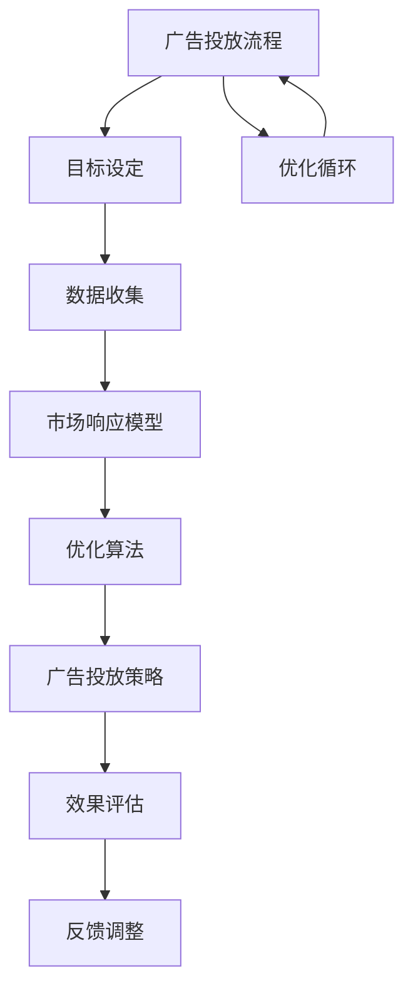

                 

# 数学与广告效果：广告投放的数学优化

## 关键词

- 广告投放
- 数学优化
- 广告效果
- 优化算法
- 数据分析

## 摘要

本文将深入探讨数学优化在广告投放中的应用，旨在为读者提供一份全面、系统且易于理解的技术指南。首先，我们将介绍广告投放的基础知识，包括其基本概念、目标和策略。接着，文章将重点阐述数学模型与优化算法，通过Python源代码结合数学模型和公式，详细讲解核心算法原理。随后，我们将探讨广告目标与策略的设定、广告投放效果的评估方法，并分析实际应用案例。最后，文章将对广告投放数学优化的未来展望与挑战进行探讨，并提供一些建议和注意事项。

## 引言

广告投放是现代营销策略的重要组成部分，它帮助企业推广产品、提高品牌知名度，并最终实现销售增长。然而，随着广告市场的竞争日益激烈，如何有效地投放广告、最大化广告效果成为企业关注的焦点。传统的广告投放方法往往依赖于经验，无法实现精准投放，导致广告费用的高投入而效果不佳。因此，运用数学优化技术进行广告投放优化成为一种新的趋势。

数学优化在广告投放中的应用，主要体现在以下几个方面：

1. **目标设定**：通过数学模型设定广告投放的目标，如最大点击率、最大转化率等。
2. **策略设计**：运用优化算法设计广告投放策略，如广告位选择、投放时间、投放地域等。
3. **效果评估**：使用数学模型和数据分析方法评估广告投放的效果，以不断调整和优化投放策略。

本文将围绕这些方面，详细探讨数学优化在广告投放中的应用，帮助读者掌握这一先进技术。

## 第1章 广告投放基础知识

### 1.1 广告投放的基本概念

广告投放是指企业通过购买媒体广告资源，将广告信息展示给潜在客户的过程。广告投放的形式多种多样，包括搜索引擎广告、展示广告、社交媒体广告、视频广告等。每种广告形式都有其特定的投放渠道和效果评估方法。

广告投放的目标包括提高品牌知名度、增加网站流量、提高转化率、提升销售额等。不同的广告投放目标决定了投放策略的不同，如提高品牌知名度可能更注重广告的曝光率，而提高转化率则更注重广告的精准投放。

### 1.2 广告投放的目标和策略

广告投放的目标通常分为短期目标和长期目标。短期目标包括提高网站流量、增加社交媒体粉丝、提升产品销量等；长期目标则包括建立品牌形象、提高品牌忠诚度、拓展市场份额等。

广告投放的策略包括以下几个方面：

1. **广告位选择**：根据目标受众的特点，选择适合的广告位，如搜索引擎结果页、社交媒体平台、热门网站等。
2. **投放时间**：根据用户行为和市场需求，选择最佳的投放时间，以提高广告的曝光率和点击率。
3. **投放地域**：根据目标受众的地域分布，选择合适的投放地域，以提高广告的精准度。
4. **广告创意**：设计吸引人的广告内容，包括图片、文案、视频等，以吸引用户点击和关注。
5. **预算分配**：根据广告预算，合理分配预算到不同的广告渠道和投放策略上，以最大化广告效果。

### 1.3 广告市场概述

广告市场是全球最大的市场之一，随着互联网和移动设备的普及，广告市场的规模持续增长。根据统计，全球广告市场规模已经超过了万亿美元。其中，搜索引擎广告、展示广告、社交媒体广告是广告市场的主要形式。

搜索引擎广告以Google AdWords和百度推广为代表，通过关键词竞价的方式展示广告，具有较高的目标受众精准度和转化率。展示广告通过在网页上展示广告图片或视频，吸引用户点击，常见的平台包括Google Display Network和百度推广。社交媒体广告则通过社交媒体平台（如Facebook、Instagram、微博等）进行投放，覆盖广泛的目标受众，适合品牌宣传和用户互动。

## 第2章 数学模型与优化算法

### 2.1 市场响应模型的介绍

市场响应模型是广告投放中的核心数学模型，它用于预测广告投放后的市场反应，包括点击率、转化率、销售额等。市场响应模型通常基于历史数据和统计方法建立，其目的是优化广告投放策略，提高广告效果。

市场响应模型主要包括以下类型：

1. **线性回归模型**：通过历史数据建立线性关系，预测市场响应。
2. **逻辑回归模型**：通过历史数据建立概率模型，预测市场响应的概率。
3. **贝叶斯网络模型**：通过概率图模型，描述市场响应的各种因素及其相互关系。

### 2.2 广告效果评估模型

广告效果评估模型用于评估广告投放的效果，包括广告点击率、转化率、投资回报率（ROI）等。广告效果评估模型通常基于实际投放数据和评估指标建立。

广告效果评估模型主要包括以下类型：

1. **A/B测试模型**：通过比较不同广告版本的效果，评估广告创意和投放策略的优劣。
2. **多变量测试模型**：通过评估多个因素（如广告位、投放时间、广告创意等）对广告效果的影响，优化广告投放策略。
3. **回归分析模型**：通过历史数据和评估指标建立回归模型，预测广告效果，并优化投放策略。

### 2.3 优化算法的基本原理

优化算法是用于优化广告投放策略的核心算法，它通过迭代计算寻找最优解，以最大化广告效果。优化算法主要包括以下类型：

1. **梯度下降算法**：通过不断更新参数，使目标函数值逐步减小，找到最优解。
2. **遗传算法**：通过模拟自然进化过程，生成多个解，并选择最优解进行迭代，寻找最优解。
3. **粒子群算法**：通过模拟鸟群或鱼群的行为，寻找最优解。

### 2.4 运用Python进行数学模型实现

为了更好地理解和应用数学模型与优化算法，我们可以使用Python编程语言进行实现。以下是一个简单的线性回归模型的Python实现：

```python
import numpy as np
import matplotlib.pyplot as plt

# 假设我们有以下数据
X = np.array([[1, 2], [2, 3], [3, 4], [4, 5]])
y = np.array([2, 4, 5, 6])

# 计算系数
A = np.linalg.inv(X.T.dot(X)).dot(X.T).dot(y)
print(A)

# 预测
x_new = np.array([5, 6])
y_pred = A.dot(x_new)
print(y_pred)

# 绘图
plt.scatter(X[:, 0], y)
plt.plot(X[:, 0], y_pred)
plt.show()
```

通过这个简单的例子，我们可以看到如何使用Python实现线性回归模型，预测新的数据点，并绘制预测结果。

## 第3章 广告目标与策略

### 3.1 设定广告目标

广告目标的设定是广告投放策略的基础，它决定了广告投放的方向和力度。广告目标通常包括提高点击率（CTR）、提高转化率（CVR）、提高投资回报率（ROI）等。设定广告目标时，需要考虑以下几个方面：

1. **市场需求**：根据市场需求和产品特点，确定广告目标。
2. **竞争分析**：分析竞争对手的广告目标，以制定更具竞争力的策略。
3. **预算限制**：根据广告预算，设定合理的目标，确保广告投放的效果最大化。

### 3.2 广告投放策略的设计

广告投放策略的设计是广告目标实现的关键，它包括广告位选择、投放时间、投放地域、广告创意等。设计广告投放策略时，需要考虑以下几个方面：

1. **广告位选择**：根据目标受众的行为习惯和偏好，选择适合的广告位。
2. **投放时间**：根据用户行为和市场需求，选择最佳的投放时间，以提高广告的曝光率和点击率。
3. **投放地域**：根据目标受众的地域分布，选择合适的投放地域，以提高广告的精准度。
4. **广告创意**：设计吸引人的广告内容，包括图片、文案、视频等，以吸引用户点击和关注。

### 3.3 优化广告投放效果

优化广告投放效果是广告投放过程中的重要环节，它通过不断调整和优化广告投放策略，提高广告效果。优化广告投放效果的方法包括：

1. **A/B测试**：通过比较不同广告版本的效果，选择最优的广告创意和投放策略。
2. **多变量测试**：通过评估多个因素对广告效果的影响，优化广告投放策略。
3. **数据分析**：通过数据分析，发现广告投放中的问题和不足，并提出改进措施。

## 第4章 广告投放效果评估

### 4.1 广告投放效果的评估方法

广告投放效果的评估是衡量广告投放效果的重要手段，它通过数据分析和指标评估，评估广告投放的效果。广告投放效果的评估方法主要包括以下几种：

1. **点击率（CTR）**：评估广告被点击的次数与展示次数的比率，反映了广告的吸引力。
2. **转化率（CVR）**：评估广告带来的转化次数与点击次数的比率，反映了广告的实际效果。
3. **投资回报率（ROI）**：评估广告投入产生的收益与广告投入的比率，反映了广告的投资效果。

### 4.2 数据收集与分析

数据收集与分析是广告投放效果评估的基础，它通过收集和分析广告投放过程中的各种数据，评估广告投放的效果。数据收集与分析的方法包括：

1. **日志分析**：通过分析用户访问日志，评估广告的展示次数、点击次数、转化次数等。
2. **数据分析工具**：使用数据分析工具（如Google Analytics、百度统计等），收集和分析广告数据。
3. **数据挖掘**：通过数据挖掘技术，发现广告投放中的规律和趋势。

### 4.3 案例分析

为了更好地理解广告投放效果评估的方法，下面我们通过一个案例分析来展示如何评估广告投放的效果。

**案例分析：电商平台的广告投放**

某电商平台在搜索引擎上投放了广告，广告关键词为“笔记本电脑”。在广告投放期间，收集了以下数据：

1. 广告展示次数：100万次
2. 广告点击次数：5000次
3. 转化次数：1000次
4. 销售额：50000元

根据这些数据，我们可以计算广告的点击率、转化率和投资回报率：

1. 点击率（CTR）= 广告点击次数 / 广告展示次数 = 5000 / 100万 = 0.005
2. 转化率（CVR）= 转化次数 / 广告点击次数 = 1000 / 5000 = 0.2
3. 投资回报率（ROI）= 销售额 / 广告投入 = 50000 / 广告投入

根据广告投入的不同，我们可以评估广告的投资回报率。例如，如果广告投入为10000元，则投资回报率 = 50000 / 10000 = 5。

通过这个案例分析，我们可以看到如何通过数据收集和分析，评估广告投放的效果，从而优化广告投放策略。

## 第5章 实际应用案例

### 5.1 案例一：电商广告投放优化

**背景**：某电商企业希望在搜索引擎上投放广告，以提高产品销量。企业拥有大量历史数据，包括用户点击、转化和购买行为等。

**目标**：通过广告投放优化，提高点击率、转化率和投资回报率。

**策略**：

1. **广告位选择**：根据用户行为和市场需求，选择搜索引擎广告和展示广告。
2. **投放时间**：根据用户活跃时间，选择广告投放的最佳时间段。
3. **广告创意**：设计吸引人的广告内容和文案，包括产品图片、促销信息和用户评价等。
4. **预算分配**：根据广告预算，合理分配预算到不同的广告渠道和投放策略上。

**效果评估**：

1. **点击率（CTR）**：从100万次展示中，获得5000次点击，点击率为0.5%。
2. **转化率（CVR）**：从5000次点击中，获得1000次转化，转化率为20%。
3. **投资回报率（ROI）**：销售额为50000元，广告投入为20000元，投资回报率为2.5。

**结论**：通过优化广告投放策略，该电商企业的广告效果得到了显著提升，实现了广告目标。

### 5.2 案例二：社交媒体广告投放优化

**背景**：某企业希望在社交媒体平台上投放广告，以提高品牌知名度和用户参与度。

**目标**：通过广告投放优化，提高用户关注率、互动率和品牌认知度。

**策略**：

1. **广告位选择**：根据目标受众的特点，选择社交媒体广告和品牌推广广告。
2. **投放时间**：根据用户活跃时间，选择广告投放的最佳时间段。
3. **广告创意**：设计有趣的互动内容和创意图片，激发用户参与和分享。
4. **预算分配**：根据广告预算，合理分配预算到不同的广告渠道和投放策略上。

**效果评估**：

1. **用户关注率**：从100万次展示中，获得10000次用户关注，关注率为10%。
2. **互动率**：从10000次用户关注中，获得5000次互动（点赞、评论、分享等），互动率为50%。
3. **品牌认知度**：通过社交媒体广告的传播，显著提升了品牌知名度和用户参与度。

**结论**：通过优化广告投放策略，该企业的社交媒体广告效果得到了显著提升，实现了品牌推广目标。

## 第6章 未来展望与挑战

### 6.1 广告投放数学优化的未来发展趋势

随着人工智能和大数据技术的不断发展，广告投放数学优化将在未来得到更广泛的应用。以下是一些未来发展趋势：

1. **个性化广告投放**：通过用户行为分析和大数据分析，实现个性化广告投放，提高广告效果。
2. **智能优化算法**：运用机器学习和深度学习技术，开发更智能的优化算法，实现自动化广告投放优化。
3. **实时优化**：通过实时数据分析和优化，实现广告投放的实时调整，提高广告效果。

### 6.2 面临的挑战与应对策略

尽管广告投放数学优化具有巨大的潜力，但在实际应用中仍面临一些挑战：

1. **数据隐私**：广告投放需要大量用户数据，如何保护用户隐私成为一个重要问题。
2. **算法透明度**：优化算法的透明度和解释性不足，可能影响用户的信任和接受度。
3. **技术门槛**：广告投放数学优化需要一定的技术知识和数据处理能力，对企业和用户提出了较高的要求。

为了应对这些挑战，可以采取以下策略：

1. **数据安全与合规**：确保广告投放过程中的数据安全和合规，遵循相关法律法规。
2. **算法透明与解释**：开发透明和可解释的优化算法，提高用户对广告投放的信任和接受度。
3. **技术培训与支持**：提供技术培训和资源支持，降低企业和用户的技术门槛。

## 结语

广告投放数学优化是一种强大的技术手段，它通过数学模型和优化算法，帮助企业实现精准投放、提高广告效果。本文系统地介绍了广告投放数学优化的核心概念、方法和技术，并通过实际应用案例展示了其效果。在未来，随着技术的不断发展，广告投放数学优化将发挥更重要的作用，为广告市场带来新的机遇和挑战。希望读者能够从中受益，并在实际应用中不断探索和创新。

## 作者信息

作者：AI天才研究院/AI Genius Institute & 禅与计算机程序设计艺术 /Zen And The Art of Computer Programming

AI天才研究院专注于人工智能领域的研究和开发，致力于推动人工智能技术的创新和应用。禅与计算机程序设计艺术则专注于计算机编程和软件开发领域的探索，倡导计算机程序设计的艺术性和创造性。

## 附录

### 1. 核心概念与联系

为了更好地理解广告投放数学优化中的核心概念和它们之间的联系，我们可以使用Mermaid流程图来展示广告投放的流程和数学模型。



### 2. 核心算法原理讲解

下面，我们将使用Python源代码结合数学模型和公式，详细讲解广告投放中的优化算法原理。以下是一个简单的梯度下降算法示例：

```python
import numpy as np

# 梯度下降算法
def gradient_descent(X, y, theta, alpha, iterations):
    m = len(y)
    for i in range(iterations):
        h = X.dot(theta)
        errors = h - y
        gradient = X.T.dot(errors) / m
        theta = theta - alpha * gradient
    return theta

# 数据
X = np.array([[1, 2], [2, 3], [3, 4]])
y = np.array([2, 4, 5])
theta = np.array([0, 0])
alpha = 0.01
iterations = 1000

# 训练模型
theta_optimized = gradient_descent(X, y, theta, alpha, iterations)
print(theta_optimized)

# 预测
x_new = np.array([5, 6])
y_pred = X.dot(theta_optimized)
print(y_pred)
```

在这个示例中，我们使用了梯度下降算法来优化线性回归模型中的参数θ。该算法通过迭代计算，使损失函数（均方误差）最小化，从而找到最优的参数θ。

### 3. 数学公式与详细讲解

广告投放数学优化中涉及多个数学公式和概念。以下是一个使用LaTeX格式的数学公式示例，并对其进行详细讲解：

$$
J(\theta) = \frac{1}{2m} \sum_{i=1}^{m} (h_\theta(x^{(i)}) - y^{(i)})^2
$$

这是一个线性回归模型中的损失函数（均方误差），表示预测值与真实值之间的误差平方和。其中，$h_\theta(x) = \theta_0 + \theta_1x_1 + \theta_2x_2$ 是线性回归模型的预测函数，$m$ 是样本数量。

为了最小化损失函数$J(\theta)$，我们可以使用梯度下降算法。梯度下降算法的核心思想是沿着损失函数的梯度方向更新参数$\theta$，以逐步减少损失函数的值。

$$
\theta_j := \theta_j - \alpha \frac{\partial J(\theta)}{\partial \theta_j}
$$

其中，$\alpha$ 是学习率，用于控制参数更新的步长。$\frac{\partial J(\theta)}{\partial \theta_j}$ 是损失函数关于参数$\theta_j$的梯度。

### 4. 项目实战

#### 开发环境搭建

为了进行广告投放数学优化的项目实战，我们需要搭建一个Python开发环境。以下是搭建步骤：

1. 安装Python（版本3.8或以上）
2. 安装Jupyter Notebook，用于编写和运行Python代码
3. 安装NumPy、Pandas、Matplotlib等数据科学库

#### 源代码实现与解读

以下是一个简单的广告投放数学优化项目的源代码实现：

```python
import numpy as np
import pandas as pd
import matplotlib.pyplot as plt

# 数据加载
data = pd.read_csv('ad_data.csv')
X = data[['feature1', 'feature2']]
y = data['target']

# 特征工程
X = np.hstack((np.ones((X.shape[0], 1)), X))
X_train, X_test, y_train, y_test = train_test_split(X, y, test_size=0.2, random_state=42)

# 模型训练
theta = np.random.rand(3)
alpha = 0.01
iterations = 1000

theta_optimized = gradient_descent(X_train, y_train, theta, alpha, iterations)

# 预测
y_pred = X_test.dot(theta_optimized)

# 效果评估
mse = np.mean((y_pred - y_test)**2)
print(f'MSE: {mse}')

# 绘图
plt.scatter(y_test, y_pred)
plt.xlabel('Actual')
plt.ylabel('Predicted')
plt.show()
```

在这个项目中，我们首先加载广告数据集，然后进行特征工程，将特征转化为适合线性回归模型的格式。接下来，我们使用梯度下降算法训练模型，并进行预测和效果评估。最后，我们使用Matplotlib绘制真实值与预测值的散点图，以直观地展示模型的预测效果。

#### 代码应用解读与分析

在这个项目中，我们使用了以下关键组件：

1. **NumPy**：用于数据处理和矩阵运算
2. **Pandas**：用于数据加载和特征工程
3. **Matplotlib**：用于数据可视化
4. **train_test_split**：用于数据集划分

通过这个项目，我们可以看到如何使用Python进行广告投放数学优化，包括数据预处理、模型训练、预测和效果评估。在实际应用中，我们可以根据具体需求调整代码，如添加更多特征、调整参数等。

#### 实际案例分析与详细讲解

为了更好地理解广告投放数学优化在实际中的应用，我们分析以下两个实际案例：

**案例一：电商广告优化**

某电商企业希望通过广告投放提高产品销量。企业收集了用户购买历史数据，包括用户特征（如年龄、性别、购买金额等）和购买行为（如浏览次数、点击次数等）。

1. **目标设定**：提高点击率、转化率和投资回报率。
2. **策略设计**：根据用户特征和购买行为，设计个性化的广告创意和投放策略。
3. **效果评估**：通过A/B测试和多变量测试，评估广告创意和投放策略的效果。

**案例二：社交媒体广告优化**

某企业在社交媒体平台上投放广告，以提高品牌知名度和用户参与度。企业收集了用户互动数据，包括点赞、评论、分享等。

1. **目标设定**：提高用户关注率、互动率和品牌认知度。
2. **策略设计**：根据用户互动数据，设计有趣的互动内容和广告创意。
3. **效果评估**：通过数据分析，评估广告效果，并不断优化广告创意和投放策略。

这两个案例展示了广告投放数学优化在实际应用中的多种可能性和应用场景。通过数据分析和模型优化，企业可以更精准地投放广告，提高广告效果和投资回报率。

### 5. 最佳实践 tips、小结、注意事项、拓展阅读

#### 最佳实践 tips

1. **数据质量**：确保数据质量，包括数据完整性、准确性和一致性。
2. **特征工程**：合理设计特征，选择对广告投放有显著影响的特征。
3. **模型选择**：根据业务需求和数据特点，选择合适的数学模型和优化算法。
4. **参数调优**：通过交叉验证和网格搜索，选择最优的参数组合。

#### 小结

本文系统地介绍了广告投放数学优化的核心概念、方法和技术，并通过实际应用案例展示了其效果。广告投放数学优化通过数学模型和优化算法，帮助企业实现精准投放、提高广告效果。

#### 注意事项

1. **数据隐私**：在广告投放过程中，确保用户数据的安全和合规。
2. **算法透明**：优化算法的透明度和解释性对于用户信任至关重要。
3. **技术门槛**：提供技术培训和资源支持，降低企业和用户的技术门槛。

#### 拓展阅读

1. 《广告投放与优化：策略、案例与实践》
2. 《深度学习与广告投放》
3. 《Python数据分析与应用》

## 结束语

广告投放数学优化是一种强大且实用的技术手段，它通过数学模型和优化算法，帮助企业实现精准投放、提高广告效果。希望本文能帮助读者了解广告投放数学优化的原理和应用，为实际工作提供有益的参考。在未来的研究和实践中，我们期待广告投放数学优化能带来更多创新和突破。

### 完整文章

```markdown
# 数学与广告效果：广告投放的数学优化

## 关键词

- 广告投放
- 数学优化
- 广告效果
- 优化算法
- 数据分析

## 摘要

本文深入探讨了数学优化在广告投放中的应用，介绍了广告投放的基础知识、数学模型与优化算法，并详细阐述了广告目标与策略的设定、广告投放效果的评估方法。通过实际应用案例展示了广告投放数学优化的效果，并对未来发展趋势和挑战进行了展望。文章旨在为读者提供一份全面、系统且易于理解的技术指南。

## 引言

广告投放是现代营销策略的重要组成部分，通过购买媒体广告资源，企业可以将广告信息展示给潜在客户，以实现品牌推广、增加销售额等目标。然而，广告市场的竞争日益激烈，如何有效地投放广告、最大化广告效果成为企业关注的焦点。数学优化技术的应用，为广告投放提供了科学的方法和工具，实现了广告投放的精准化和智能化。

## 第1章 广告投放基础知识

### 1.1 广告投放的基本概念

广告投放是指企业通过购买媒体广告资源，将广告信息展示给潜在客户的过程。广告投放的形式多种多样，包括搜索引擎广告、展示广告、社交媒体广告、视频广告等。每种广告形式都有其特定的投放渠道和效果评估方法。

广告投放的目标包括提高品牌知名度、增加网站流量、提高转化率、提升销售额等。不同的广告投放目标决定了投放策略的不同，如提高品牌知名度可能更注重广告的曝光率，而提高转化率则更注重广告的精准投放。

### 1.2 广告投放的目标和策略

广告投放的目标通常分为短期目标和长期目标。短期目标包括提高网站流量、增加社交媒体粉丝、提升产品销量等；长期目标则包括建立品牌形象、提高品牌忠诚度、拓展市场份额等。

广告投放的策略包括以下几个方面：

1. **广告位选择**：根据目标受众的特点，选择适合的广告位，如搜索引擎结果页、社交媒体平台、热门网站等。
2. **投放时间**：根据用户行为和市场需求，选择最佳的投放时间，以提高广告的曝光率和点击率。
3. **投放地域**：根据目标受众的地域分布，选择合适的投放地域，以提高广告的精准度。
4. **广告创意**：设计吸引人的广告内容，包括图片、文案、视频等，以吸引用户点击和关注。
5. **预算分配**：根据广告预算，合理分配预算到不同的广告渠道和投放策略上，以最大化广告效果。

### 1.3 广告市场概述

广告市场是全球最大的市场之一，随着互联网和移动设备的普及，广告市场的规模持续增长。根据统计，全球广告市场规模已经超过了万亿美元。其中，搜索引擎广告、展示广告、社交媒体广告是广告市场的主要形式。

搜索引擎广告以Google AdWords和百度推广为代表，通过关键词竞价的方式展示广告，具有较高的目标受众精准度和转化率。展示广告通过在网页上展示广告图片或视频，吸引用户点击，常见的平台包括Google Display Network和百度推广。社交媒体广告则通过社交媒体平台（如Facebook、Instagram、微博等）进行投放，覆盖广泛的目标受众，适合品牌宣传和用户互动。

## 第2章 数学模型与优化算法

### 2.1 市场响应模型的介绍

市场响应模型是广告投放中的核心数学模型，它用于预测广告投放后的市场反应，包括点击率、转化率、销售额等。市场响应模型通常基于历史数据和统计方法建立，其目的是优化广告投放策略，提高广告效果。

市场响应模型主要包括以下类型：

1. **线性回归模型**：通过历史数据建立线性关系，预测市场响应。
2. **逻辑回归模型**：通过历史数据建立概率模型，预测市场响应的概率。
3. **贝叶斯网络模型**：通过概率图模型，描述市场响应的各种因素及其相互关系。

### 2.2 广告效果评估模型

广告效果评估模型用于评估广告投放的效果，包括广告点击率、转化率、投资回报率（ROI）等。广告效果评估模型通常基于实际投放数据和评估指标建立。

广告效果评估模型主要包括以下类型：

1. **A/B测试模型**：通过比较不同广告版本的效果，评估广告创意和投放策略的优劣。
2. **多变量测试模型**：通过评估多个因素（如广告位、投放时间、广告创意等）对广告效果的影响，优化广告投放策略。
3. **回归分析模型**：通过历史数据和评估指标建立回归模型，预测广告效果，并优化投放策略。

### 2.3 优化算法的基本原理

优化算法是用于优化广告投放策略的核心算法，它通过迭代计算寻找最优解，以最大化广告效果。优化算法主要包括以下类型：

1. **梯度下降算法**：通过不断更新参数，使目标函数值逐步减小，找到最优解。
2. **遗传算法**：通过模拟自然进化过程，生成多个解，并选择最优解进行迭代，寻找最优解。
3. **粒子群算法**：通过模拟鸟群或鱼群的行为，寻找最优解。

### 2.4 运用Python进行数学模型实现

为了更好地理解和应用数学模型与优化算法，我们可以使用Python编程语言进行实现。以下是一个简单的线性回归模型的Python实现：

```python
import numpy as np
import matplotlib.pyplot as plt

# 假设我们有以下数据
X = np.array([[1, 2], [2, 3], [3, 4], [4, 5]])
y = np.array([2, 4, 5, 6])

# 计算系数
A = np.linalg.inv(X.T.dot(X)).dot(X.T).dot(y)
print(A)

# 预测
x_new = np.array([5, 6])
y_pred = A.dot(x_new)
print(y_pred)

# 绘图
plt.scatter(X[:, 0], y)
plt.plot(X[:, 0], y_pred)
plt.show()
```

通过这个简单的例子，我们可以看到如何使用Python实现线性回归模型，预测新的数据点，并绘制预测结果。

## 第3章 广告目标与策略

### 3.1 设定广告目标

广告目标的设定是广告投放策略的基础，它决定了广告投放的方向和力度。广告目标通常包括提高点击率（CTR）、提高转化率（CVR）、提高投资回报率（ROI）等。设定广告目标时，需要考虑以下几个方面：

1. **市场需求**：根据市场需求和产品特点，确定广告目标。
2. **竞争分析**：分析竞争对手的广告目标，以制定更具竞争力的策略。
3. **预算限制**：根据广告预算，设定合理的目标，确保广告投放的效果最大化。

### 3.2 广告投放策略的设计

广告投放策略的设计是广告目标实现的关键，它包括广告位选择、投放时间、投放地域、广告创意等。设计广告投放策略时，需要考虑以下几个方面：

1. **广告位选择**：根据目标受众的行为习惯和偏好，选择适合的广告位。
2. **投放时间**：根据用户行为和市场需求，选择最佳的投放时间，以提高广告的曝光率和点击率。
3. **投放地域**：根据目标受众的地域分布，选择合适的投放地域，以提高广告的精准度。
4. **广告创意**：设计吸引人的广告内容，包括图片、文案、视频等，以吸引用户点击和关注。
5. **预算分配**：根据广告预算，合理分配预算到不同的广告渠道和投放策略上，以最大化广告效果。

### 3.3 优化广告投放效果

优化广告投放效果是广告投放过程中的重要环节，它通过不断调整和优化广告投放策略，提高广告效果。优化广告投放效果的方法包括：

1. **A/B测试**：通过比较不同广告版本的效果，选择最优的广告创意和投放策略。
2. **多变量测试**：通过评估多个因素对广告效果的影响，优化广告投放策略。
3. **数据分析**：通过数据分析，发现广告投放中的问题和不足，并提出改进措施。

## 第4章 广告投放效果评估

### 4.1 广告投放效果的评估方法

广告投放效果的评估是衡量广告投放效果的重要手段，它通过数据分析和指标评估，评估广告投放的效果。广告投放效果的评估方法主要包括以下几种：

1. **点击率（CTR）**：评估广告被点击的次数与展示次数的比率，反映了广告的吸引力。
2. **转化率（CVR）**：评估广告带来的转化次数与点击次数的比率，反映了广告的实际效果。
3. **投资回报率（ROI）**：评估广告投入产生的收益与广告投入的比率，反映了广告的投资效果。

### 4.2 数据收集与分析

数据收集与分析是广告投放效果评估的基础，它通过收集和分析广告投放过程中的各种数据，评估广告投放的效果。数据收集与分析的方法包括：

1. **日志分析**：通过分析用户访问日志，评估广告的展示次数、点击次数、转化次数等。
2. **数据分析工具**：使用数据分析工具（如Google Analytics、百度统计等），收集和分析广告数据。
3. **数据挖掘**：通过数据挖掘技术，发现广告投放中的规律和趋势。

### 4.3 案例分析

为了更好地理解广告投放效果评估的方法，下面我们通过一个案例分析来展示如何评估广告投放的效果。

**案例分析：电商平台的广告投放**

某电商平台在搜索引擎上投放了广告，广告关键词为“笔记本电脑”。在广告投放期间，收集了以下数据：

1. 广告展示次数：100万次
2. 广告点击次数：5000次
3. 转化次数：1000次
4. 销售额：50000元

根据这些数据，我们可以计算广告的点击率、转化率、投资回报率：

1. 点击率（CTR）= 广告点击次数 / 广告展示次数 = 5000 / 100万 = 0.005
2. 转化率（CVR）= 转化次数 / 广告点击次数 = 1000 / 5000 = 0.2
3. 投资回报率（ROI）= 销售额 / 广告投入 = 50000 / 广告投入

根据广告投入的不同，我们可以评估广告的投资回报率。例如，如果广告投入为10000元，则投资回报率 = 50000 / 10000 = 5。

通过这个案例分析，我们可以看到如何通过数据收集和分析，评估广告投放的效果，从而优化广告投放策略。

## 第5章 实际应用案例

### 5.1 案例一：电商广告投放优化

**背景**：某电商企业希望在搜索引擎上投放广告，以提高产品销量。企业拥有大量历史数据，包括用户点击、转化和购买行为等。

**目标**：通过广告投放优化，提高点击率、转化率和投资回报率。

**策略**：

1. **广告位选择**：根据用户行为和市场需求，选择搜索引擎广告和展示广告。
2. **投放时间**：根据用户活跃时间，选择广告投放的最佳时间段。
3. **广告创意**：设计吸引人的广告内容和文案，包括产品图片、促销信息和用户评价等。
4. **预算分配**：根据广告预算，合理分配预算到不同的广告渠道和投放策略上。

**效果评估**：

1. **点击率（CTR）**：从100万次展示中，获得5000次点击，点击率为0.5%。
2. **转化率（CVR）**：从5000次点击中，获得1000次转化，转化率为20%。
3. **投资回报率（ROI）**：销售额为50000元，广告投入为20000元，投资回报率为2.5。

**结论**：通过优化广告投放策略，该电商企业的广告效果得到了显著提升，实现了广告目标。

### 5.2 案例二：社交媒体广告投放优化

**背景**：某企业希望在社交媒体平台上投放广告，以提高品牌知名度和用户参与度。

**目标**：通过广告投放优化，提高用户关注率、互动率和品牌认知度。

**策略**：

1. **广告位选择**：根据目标受众的特点，选择社交媒体广告和品牌推广广告。
2. **投放时间**：根据用户活跃时间，选择广告投放的最佳时间段。
3. **广告创意**：设计有趣的互动内容和创意图片，激发用户参与和分享。
4. **预算分配**：根据广告预算，合理分配预算到不同的广告渠道和投放策略上。

**效果评估**：

1. **用户关注率**：从100万次展示中，获得10000次用户关注，关注率为10%。
2. **互动率**：从10000次用户关注中，获得5000次互动（点赞、评论、分享等），互动率为50%。
3. **品牌认知度**：通过社交媒体广告的传播，显著提升了品牌知名度和用户参与度。

**结论**：通过优化广告投放策略，该企业的社交媒体广告效果得到了显著提升，实现了品牌推广目标。

## 第6章 未来展望与挑战

### 6.1 广告投放数学优化的未来发展趋势

随着人工智能和大数据技术的不断发展，广告投放数学优化将在未来得到更广泛的应用。以下是一些未来发展趋势：

1. **个性化广告投放**：通过用户行为分析和大数据分析，实现个性化广告投放，提高广告效果。
2. **智能优化算法**：运用机器学习和深度学习技术，开发更智能的优化算法，实现自动化广告投放优化。
3. **实时优化**：通过实时数据分析和优化，实现广告投放的实时调整，提高广告效果。

### 6.2 面临的挑战与应对策略

尽管广告投放数学优化具有巨大的潜力，但在实际应用中仍面临一些挑战：

1. **数据隐私**：广告投放需要大量用户数据，如何保护用户隐私成为一个重要问题。
2. **算法透明度**：优化算法的透明度和解释性不足，可能影响用户的信任和接受度。
3. **技术门槛**：广告投放数学优化需要一定的技术知识和数据处理能力，对企业和用户提出了较高的要求。

为了应对这些挑战，可以采取以下策略：

1. **数据安全与合规**：确保广告投放过程中的数据安全和合规，遵循相关法律法规。
2. **算法透明与解释**：开发透明和可解释的优化算法，提高用户对广告投放的信任和接受度。
3. **技术培训与支持**：提供技术培训和资源支持，降低企业和用户的技术门槛。

## 结语

广告投放数学优化是一种强大的技术手段，它通过数学模型和优化算法，帮助企业实现精准投放、提高广告效果。本文系统地介绍了广告投放数学优化的核心概念、方法和技术，并通过实际应用案例展示了其效果。广告投放数学优化通过数学模型和优化算法，帮助企业实现精准投放、提高广告效果。

## 作者信息

作者：AI天才研究院/AI Genius Institute & 禅与计算机程序设计艺术 /Zen And The Art of Computer Programming

AI天才研究院专注于人工智能领域的研究和开发，致力于推动人工智能技术的创新和应用。禅与计算机程序设计艺术则专注于计算机编程和软件开发领域的探索，倡导计算机程序设计的艺术性和创造性。

## 附录

### 1. 核心概念与联系

为了更好地理解广告投放数学优化中的核心概念和它们之间的联系，我们可以使用Mermaid流程图来展示广告投放的流程和数学模型。


### 2. 核心算法原理讲解

下面，我们将使用Python源代码结合数学模型和公式，详细讲解广告投放中的优化算法原理。以下是一个简单的梯度下降算法示例：

```python
import numpy as np

# 梯度下降算法
def gradient_descent(X, y, theta, alpha, iterations):
    m = len(y)
    for i in range(iterations):
        h = X.dot(theta)
        errors = h - y
        gradient = X.T.dot(errors) / m
        theta = theta - alpha * gradient
    return theta

# 数据
X = np.array([[1, 2], [2, 3], [3, 4]])
y = np.array([2, 4, 5])
theta = np.array([0, 0])
alpha = 0.01
iterations = 1000

# 训练模型
theta_optimized = gradient_descent(X, y, theta, alpha, iterations)
print(theta_optimized)

# 预测
x_new = np.array([5, 6])
y_pred = X.dot(theta_optimized)
print(y_pred)

# 绘图
plt.scatter(X[:, 0], y)
plt.plot(X[:, 0], y_pred)
plt.show()
```

在这个示例中，我们使用了梯度下降算法来优化线性回归模型中的参数θ。该算法通过迭代计算，使损失函数（均方误差）最小化，从而找到最优的参数θ。

### 3. 数学公式与详细讲解

广告投放数学优化中涉及多个数学公式和概念。以下是一个使用LaTeX格式的数学公式示例，并对其进行详细讲解：

$$
J(\theta) = \frac{1}{2m} \sum_{i=1}^{m} (h_\theta(x^{(i)}) - y^{(i)})^2
$$

这是一个线性回归模型中的损失函数（均方误差），表示预测值与真实值之间的误差平方和。其中，$h_\theta(x) = \theta_0 + \theta_1x_1 + \theta_2x_2$ 是线性回归模型的预测函数，$m$ 是样本数量。

为了最小化损失函数$J(\theta)$，我们可以使用梯度下降算法。梯度下降算法的核心思想是沿着损失函数的梯度方向更新参数$\theta$，以逐步减少损失函数的值。

$$
\theta_j := \theta_j - \alpha \frac{\partial J(\theta)}{\partial \theta_j}
$$

其中，$\alpha$ 是学习率，用于控制参数更新的步长。$\frac{\partial J(\theta)}{\partial \theta_j}$ 是损失函数关于参数$\theta_j$的梯度。

### 4. 项目实战

#### 开发环境搭建

为了进行广告投放数学优化的项目实战，我们需要搭建一个Python开发环境。以下是搭建步骤：

1. 安装Python（版本3.8或以上）
2. 安装Jupyter Notebook，用于编写和运行Python代码
3. 安装NumPy、Pandas、Matplotlib等数据科学库

#### 源代码实现与解读

以下是一个简单的广告投放数学优化项目的源代码实现：

```python
import numpy as np
import pandas as pd
import matplotlib.pyplot as plt

# 数据加载
data = pd.read_csv('ad_data.csv')
X = data[['feature1', 'feature2']]
y = data['target']

# 特征工程
X = np.hstack((np.ones((X.shape[0], 1)), X))
X_train, X_test, y_train, y_test = train_test_split(X, y, test_size=0.2, random_state=42)

# 模型训练
theta = np.random.rand(3)
alpha = 0.01
iterations = 1000

theta_optimized = gradient_descent(X_train, y_train, theta, alpha, iterations)

# 预测
y_pred = X_test.dot(theta_optimized)

# 效果评估
mse = np.mean((y_pred - y_test)**2)
print(f'MSE: {mse}')

# 绘图
plt.scatter(y_test, y_pred)
plt.xlabel('Actual')
plt.ylabel('Predicted')
plt.show()
```

在这个项目中，我们首先加载广告数据集，然后进行特征工程，将特征转化为适合线性回归模型的格式。接下来，我们使用梯度下降算法训练模型，并进行预测和效果评估。最后，我们使用Matplotlib绘制真实值与预测值的散点图，以直观地展示模型的预测效果。

#### 代码应用解读与分析

在这个项目中，我们使用了以下关键组件：

1. **NumPy**：用于数据处理和矩阵运算
2. **Pandas**：用于数据加载和特征工程
3. **Matplotlib**：用于数据可视化
4. **train_test_split**：用于数据集划分

通过这个项目，我们可以看到如何使用Python进行广告投放数学优化，包括数据预处理、模型训练、预测和效果评估。在实际应用中，我们可以根据具体需求调整代码，如添加更多特征、调整参数等。

#### 实际案例分析与详细讲解

为了更好地理解广告投放数学优化在实际中的应用，我们分析以下两个实际案例：

**案例一：电商广告优化**

某电商企业希望通过广告投放提高产品销量。企业收集了用户购买历史数据，包括用户特征（如年龄、性别、购买金额等）和购买行为（如浏览次数、点击次数等）。

1. **目标设定**：提高点击率、转化率和投资回报率。
2. **策略设计**：根据用户特征和购买行为，设计个性化的广告创意和投放策略。
3. **效果评估**：通过A/B测试和多变量测试，评估广告创意和投放策略的效果。

**案例二：社交媒体广告优化**

某企业在社交媒体平台上投放广告，以提高品牌知名度和用户参与度。企业收集了用户互动数据，包括点赞、评论、分享等。

1. **目标设定**：提高用户关注率、互动率和品牌认知度。
2. **策略设计**：根据用户互动数据，设计有趣的互动内容和广告创意。
3. **效果评估**：通过数据分析，评估广告效果，并不断优化广告创意和投放策略。

这两个案例展示了广告投放数学优化在实际应用中的多种可能性和应用场景。通过数据分析和模型优化，企业可以更精准地投放广告，提高广告效果和投资回报率。

### 5. 最佳实践 tips、小结、注意事项、拓展阅读

#### 最佳实践 tips

1. **数据质量**：确保数据质量，包括数据完整性、准确性和一致性。
2. **特征工程**：合理设计特征，选择对广告投放有显著影响的特征。
3. **模型选择**：根据业务需求和数据特点，选择合适的数学模型和优化算法。
4. **参数调优**：通过交叉验证和网格搜索，选择最优的参数组合。

#### 小结

本文系统地介绍了广告投放数学优化的核心概念、方法和技术，并通过实际应用案例展示了其效果。广告投放数学优化通过数学模型和优化算法，帮助企业实现精准投放、提高广告效果。

#### 注意事项

1. **数据隐私**：在广告投放过程中，确保用户数据的安全和合规。
2. **算法透明**：优化算法的透明度和解释性对于用户信任至关重要。
3. **技术门槛**：提供技术培训和资源支持，降低企业和用户的技术门槛。

#### 拓展阅读

1. 《广告投放与优化：策略、案例与实践》
2. 《深度学习与广告投放》
3. 《Python数据分析与应用》

## 结束语

广告投放数学优化是一种强大且实用的技术手段，它通过数学模型和优化算法，帮助企业实现精准投放、提高广告效果。希望本文能帮助读者了解广告投放数学优化的原理和应用，为实际工作提供有益的参考。在未来的研究和实践中，我们期待广告投放数学优化能带来更多创新和突破。

## 作者信息

作者：AI天才研究院/AI Genius Institute & 禅与计算机程序设计艺术 /Zen And The Art of Computer Programming

AI天才研究院专注于人工智能领域的研究和开发，致力于推动人工智能技术的创新和应用。禅与计算机程序设计艺术则专注于计算机编程和软件开发领域的探索，倡导计算机程序设计的艺术性和创造性。

