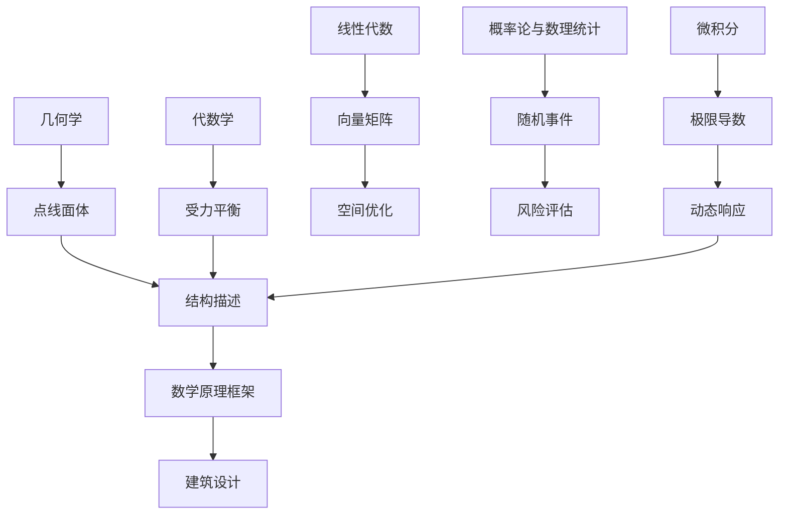
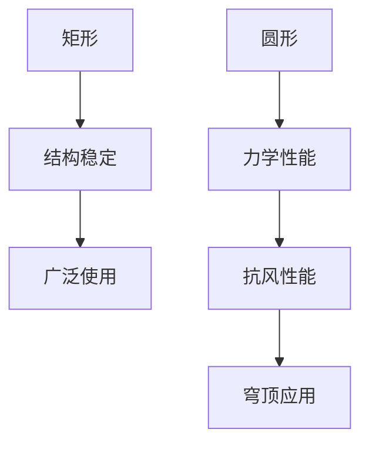
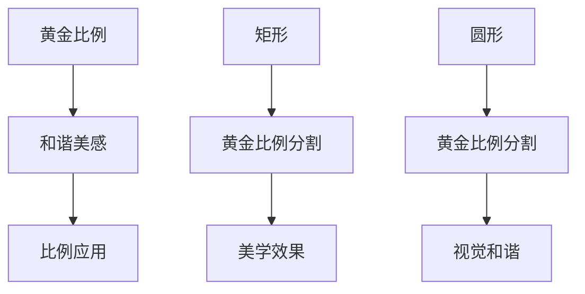
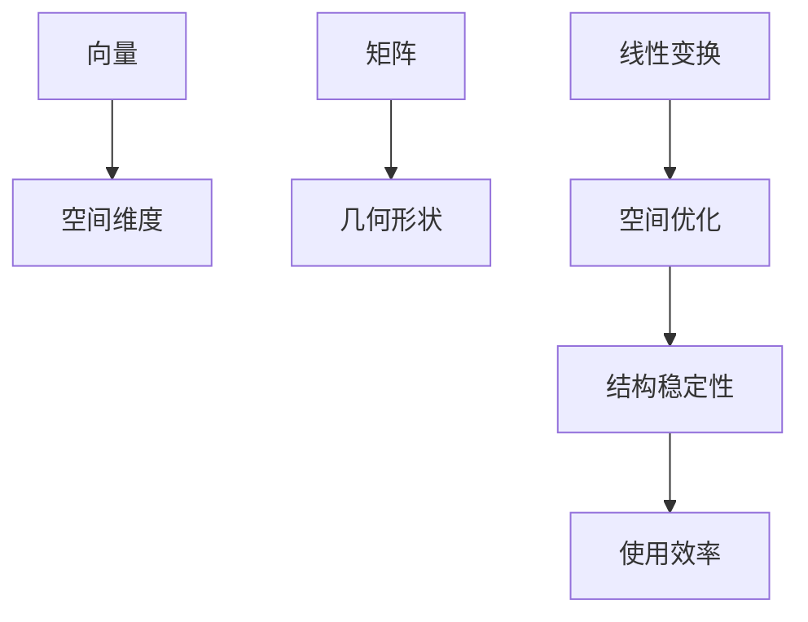
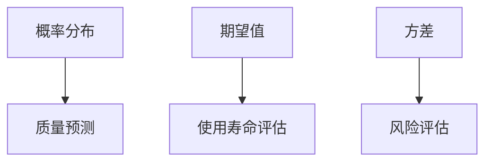
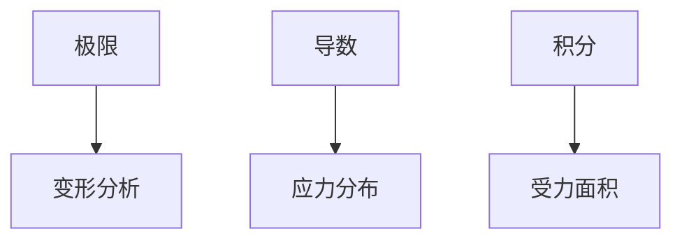
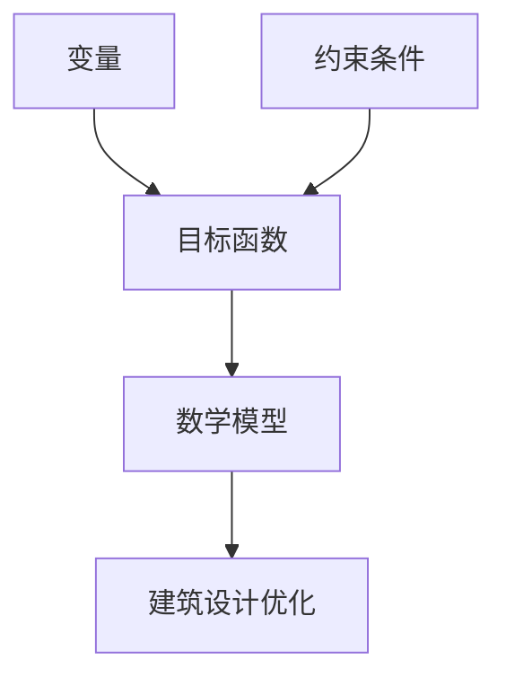
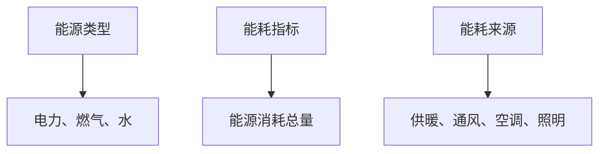
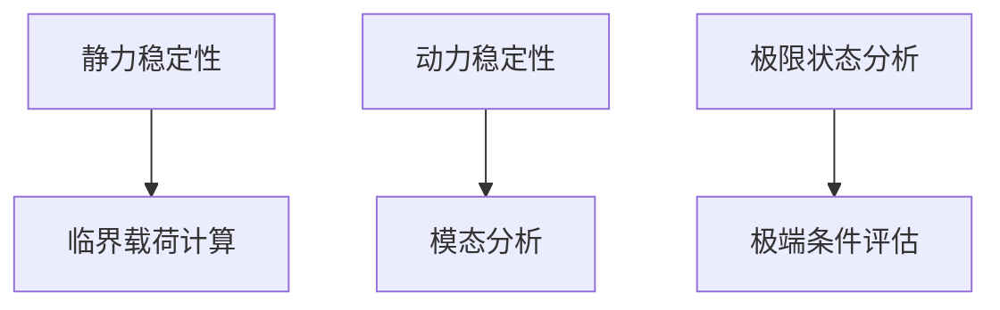
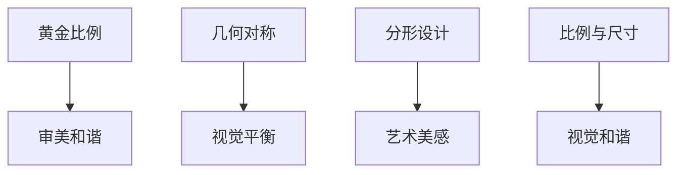

                 

### 背景介绍

建筑学作为人类创造的艺术和科学的结合，自古以来便与数学密不可分。古埃及的金字塔、古希腊的神庙、古罗马的竞技场，都是数学与建筑完美融合的杰作。而在现代，随着科技的进步，数学在建筑学中的应用更加广泛和深入，从结构设计到材料选择，再到能源优化，数学原理无处不在。

数学在建筑学中的应用不仅仅是形式上的美观，更涉及到建筑的安全、稳定、舒适和可持续发展。例如，几何学帮助建筑师确定建筑的结构和形态，代数方程确保建筑结构的稳定性，线性代数优化建筑空间布局，概率论和数理统计评估建筑的风险，微积分分析建筑材料的性能，以及数学模型指导建筑设计的优化和能耗分析。

本文将系统地探讨数学在建筑学中的核心应用，从基础理论到实际应用，通过一步步的分析和推理，揭示数学原理在建筑设计中的深远影响。文章分为五个部分：

1. **数学在建筑学中的基础应用**：介绍数学在建筑学中的重要性，以及几何学和代数学的基本原理。
2. **数学在建筑设计中的具体应用**：深入探讨线性代数、概率论与数理统计、微积分等数学工具在建筑设计中的具体应用。
3. **数学在建筑设计与优化中的应用**：介绍数学模型在建筑设计优化、建筑能耗分析与优化、建筑结构优化与稳定性分析中的应用。
4. **数学与建筑学的跨学科应用**：探讨数学在建筑美学设计、智能建筑中的应用。
5. **项目实战**：通过具体项目实例，展示数学在建筑学中的实战应用。

通过本文的阅读，读者将能够理解数学原理在建筑设计中的重要性，掌握不同数学工具在建筑中的应用方法，并了解未来数学与建筑学结合的前景和挑战。接下来，我们将从数学在建筑学中的基础应用开始，逐步深入探讨。

### 核心概念与联系

在探讨数学在建筑学中的具体应用之前，我们需要明确几个核心概念，并了解它们之间的联系。这些核心概念包括几何学、代数学、线性代数、概率论与数理统计、微积分等。

**几何学**：几何学是研究空间形状、大小和位置的基本数学学科。在建筑学中，几何学主要用于确定建筑的结构和形态。基本的几何概念如点、线、面、体等，为建筑设计的几何建模提供了理论基础。

**代数学**：代数学研究数和运算规则。在建筑学中，代数学主要用于分析建筑结构的稳定性和材料的力学性能。例如，通过代数方程解决建筑结构中的受力平衡问题，确保建筑的安全性。

**线性代数**：线性代数研究向量、矩阵和线性变换等概念。在建筑设计中，线性代数用于优化建筑空间布局和结构分析。例如，通过线性代数的方法，可以计算出最合理的建筑空间分布，以实现最大化使用效率和最小化资源浪费。

**概率论与数理统计**：概率论与数理统计研究随机事件和数据的分布规律。在建筑学中，这些工具用于评估建筑的风险和性能。例如，通过概率论和数理统计方法，可以预测建筑在极端天气条件下的安全性能，评估建筑材料的可靠性。

**微积分**：微积分研究函数的极限、导数、积分等概念。在建筑设计中，微积分用于分析建筑结构的动态响应和材料性能。例如，通过微积分的方法，可以计算建筑在风力或地震作用下的变形和应力分布。

这些数学工具之间的联系构成了建筑设计的数学原理框架。例如，几何学提供基础形状和结构的描述，代数学用于分析结构稳定性，线性代数优化空间布局，概率论与数理统计评估风险，微积分分析动态性能。以下是一个Mermaid流程图，展示了这些核心概念之间的联系：



通过这个流程图，我们可以清晰地看到，各个数学工具如何在建筑设计的不同阶段发挥作用，共同构建出科学的建筑设计体系。接下来，我们将进一步探讨这些数学工具在建筑设计中的具体应用。

### 几何学在建筑中的应用

几何学作为数学的核心分支之一，在建筑设计中扮演着至关重要的角色。几何学的基本概念，如点、线、面和体，为建筑设计和结构分析提供了直观的描述工具。几何学不仅帮助我们理解建筑的基本形状和结构，还为我们提供了精确计算和优化的方法。

#### 几何形状与建筑结构

在建筑设计中，几何形状的选择直接影响建筑的结构稳定性和美学效果。例如，传统的矩形建筑因其简单而稳定的结构，常被用于各种类型的建筑物。而圆形结构因其良好的力学性能和抗风性能，广泛应用于穹顶和圆顶建筑中。以下是一个简单的Mermaid流程图，展示了几何形状与建筑结构的关系：



#### 几何在建筑美学中的作用

几何学不仅在结构设计中发挥作用，也在建筑美学中具有重要地位。通过几何形状的组合和比例的运用，建筑师可以创造出和谐、平衡的美感。例如，黄金比例（Golden Ratio）在建筑设计中被广泛应用，因为它被认为能够创造出视觉上的和谐与美感。以下是一个Mermaid流程图，展示了黄金比例在建筑设计中的应用：



#### 几何在建筑中的数学原理

几何学的数学原理，如三角学和解析几何，为建筑设计和分析提供了强大的工具。例如，在建筑结构分析中，三角函数（如正弦、余弦和正切）被用来计算建筑结构中的角度和长度，确保结构的稳定性。以下是一个简单的Python源代码示例，展示了如何使用三角函数计算三角形的边长：

```python
import math

# 输入两个边长和它们之间的角度
a = 10  # 边长a
b = 15  # 边长b
theta = math.radians(30)  # 角度theta，单位为度

# 计算第三边长
c = math.sqrt(a**2 + b**2 - 2 * a * b * math.cos(theta))

print(f"第三边长c为：{c:.2f}")
```

运行上述代码，可以计算出给定两条边和它们之间的角度后，第三条边的长度。这个示例仅展示了几何学在建筑结构分析中的一小部分应用，实际上，几何学在建筑设计的各个方面都有广泛的应用。

通过上述讨论，我们可以看到几何学在建筑设计中的重要性。它不仅提供了结构设计和美学设计的基本工具，还通过数学原理为建筑设计和分析提供了科学的方法。接下来，我们将探讨代数学在建筑中的应用。

### 代数学在建筑中的应用

代数学作为研究数和运算规则的基本数学学科，在建筑学中同样发挥着重要作用。代数方程和矩阵计算为建筑结构的稳定性和材料性能分析提供了有力工具。

#### 代数方程与建筑结构的稳定性

在建筑结构中，受力分析是一个关键步骤。通过代数方程，我们可以计算建筑结构在不同载荷下的受力情况，确保其稳定性。以下是一个简单的例子，展示如何使用代数方程分析一根梁的受力情况：

```python
import sympy as sp

# 定义变量
x = sp.Symbol('x')
F = sp.Symbol('F')
L = sp.Symbol('L')

# 受力平衡方程
方程1 = sp.Eq(F * x, L * (1/2) * (x**2))
方程2 = sp.Eq(F * (L - x), L * (1/2) * ((L - x)**2))

# 解方程组
解 = sp.solve((方程1, 方程2), (F, x))

# 输出结果
print(f"力F为：{解[F]:.2f}")
print(f"位置x为：{解[x]:.2f}")
```

这个示例通过解代数方程组，计算出了梁在特定载荷下的力和位置，确保了结构的稳定性。

#### 代数在建筑能耗分析中的应用

除了结构稳定性，代数在建筑能耗分析中同样具有重要应用。通过代数方程，我们可以计算建筑物的能耗，从而实现节能优化。以下是一个简单的Python代码示例，展示了如何通过代数方程分析建筑物的能耗：

```python
import sympy as sp

# 定义变量
A = sp.Symbol('A')  # 建筑面积
U = sp.Symbol('U')  # 热损失系数
T = sp.Symbol('T')  # 房间温度
Te = sp.Symbol('Te')  # 外部温度
P = sp.Symbol('P')  # 能耗

# 能耗方程
能耗方程 = sp.Eq(P, A * U * (T - Te))

# 解能耗方程
解 = sp.solve(能耗方程, P)

# 输出结果
print(f"能耗P为：{解[P]:.2f}")
```

这个示例通过解代数方程，计算出了建筑物的能耗，为建筑节能提供了科学依据。

通过代数方程和矩阵计算，我们可以精确地分析建筑结构的稳定性和材料性能，为建筑设计和优化提供了有力的工具。接下来，我们将探讨线性代数在建筑中的应用。

### 线性代数在建筑中的应用

线性代数是研究向量、矩阵和线性变换等概念的数学分支，它在建筑设计中有着广泛的应用。通过线性代数的方法，我们可以对建筑空间进行优化，确保结构稳定性和使用效率。

#### 线性代数的基本概念

在探讨线性代数在建筑中的应用之前，我们需要理解一些基本概念，包括向量、矩阵和线性变换。

**向量**：向量是表示大小和方向的量。在建筑设计中，向量可以用来表示建筑物的空间维度和力的方向。

**矩阵**：矩阵是一个由数字组成的矩形阵列。在建筑设计中，矩阵可以用来表示建筑结构的几何形状和受力情况。

**线性变换**：线性变换是一个将向量映射到另一个向量的操作。在建筑设计中，线性变换可以用来优化建筑空间布局和结构设计。

以下是一个Mermaid流程图，展示了线性代数的基本概念及其在建筑设计中的应用：



#### 线性代数在建筑空间分析中的应用

线性代数在建筑空间分析中的应用主要体现在以下几个方面：

1. **空间建模**：通过矩阵和向量的组合，可以建立建筑物的三维空间模型，包括建筑物的尺寸、形状和结构。

2. **受力分析**：通过矩阵计算，可以分析建筑结构在不同载荷下的受力情况，确保结构稳定。

3. **空间优化**：通过线性变换，可以优化建筑空间布局，提高使用效率。

以下是一个Python源代码示例，展示了如何使用线性代数的方法进行建筑空间分析：

```python
import numpy as np

# 建立建筑物的空间模型
# 矩阵A表示建筑物的三个维度，向量b表示建筑物的初始位置
A = np.array([[1, 0, 0], [0, 1, 0], [0, 0, 1]])
b = np.array([0, 0, 0])

# 确定建筑物的受力情况
# 矩阵F表示受力情况
F = np.array([[0], [0], [10]])  # 假设建筑物受到10千牛的垂直力

# 计算建筑物的空间位置和受力后的变形
X = np.linalg.solve(A, b)  # 计算空间位置
D = A.dot(F)  # 计算受力后的变形

# 输出结果
print(f"建筑物的空间位置X为：{X}")
print(f"受力后的变形D为：{D}")
```

这个示例通过线性代数的方法，计算出了建筑物的空间位置和受力后的变形，为建筑结构设计提供了重要的数据支持。

#### 伪代码解释：线性代数在建筑设计中的应用

以下是一个伪代码示例，展示了如何使用线性代数进行建筑设计：

```
# 初始化建筑空间模型
A = 矩阵([[1, 0, 0], [0, 1, 0], [0, 0, 1]])
b = 向量([0, 0, 0])

# 读取受力情况
F = 矩阵([[0], [0], [10]])

# 计算建筑物的空间位置和受力后的变形
X = 求解(A, b)  # 计算空间位置
D = A * F  # 计算受力后的变形

# 输出结果
输出(X)  # 输出建筑物的空间位置
输出(D)  # 输出受力后的变形
```

通过上述伪代码，我们可以看到线性代数在建筑设计中的基本应用流程，包括空间建模、受力分析和空间优化。线性代数的方法为建筑结构设计提供了科学、精确的分析工具。

通过以上讨论，我们可以看到线性代数在建筑设计中的重要性。它不仅帮助我们建立建筑空间模型，进行受力分析和结构优化，还为建筑设计的科学性和精确性提供了有力支持。接下来，我们将探讨概率论与数理统计在建筑中的应用。

### 概率论与数理统计在建筑中的应用

概率论与数理统计是研究随机事件和数据的数学工具，在建筑学中也有着重要的应用。通过概率论与数理统计，我们可以对建筑项目的风险进行评估，确保建筑的安全性和可靠性。

#### 概率论的基本概念

概率论是研究随机事件及其概率的数学分支。在建筑学中，概率论的基本概念如概率分布、期望值和方差等，可以帮助我们评估建筑项目的风险和性能。

1. **概率分布**：概率分布描述了随机变量取值的概率。在建筑学中，概率分布可以用来预测建筑材料的质量、建筑工期的延迟等。

2. **期望值**：期望值是概率分布的中心位置，表示随机变量的平均取值。在建筑学中，期望值可以用来评估建筑物的使用寿命、维护成本等。

3. **方差**：方差是概率分布的离散程度，表示随机变量的波动范围。在建筑学中，方差可以用来评估建筑项目的风险和可靠性。

以下是一个简单的Mermaid流程图，展示了概率论的基本概念及其在建筑中的应用：



#### 数理统计在建筑风险分析中的应用

数理统计是研究如何通过样本数据推断总体特征的数学工具。在建筑学中，数理统计可以用来评估建筑项目的风险，确保建筑的安全和可靠性。

1. **样本数据的收集**：通过实地调查和实验，收集建筑材料、建筑设备、施工过程等的数据。

2. **统计分析**：利用统计方法，对收集到的样本数据进行分析，包括描述性统计和推断性统计。

3. **风险评估**：通过统计方法，评估建筑项目的风险，包括质量风险、安全风险、成本风险等。

以下是一个简单的Python代码示例，展示了如何使用数理统计方法进行建筑风险分析：

```python
import numpy as np
import scipy.stats as stats

# 收集样本数据
data = np.random.normal(loc=0, scale=1, size=100)

# 描述性统计分析
mean = np.mean(data)
std = np.std(data)

# 推断性统计分析
t_statistic, p_value = stats.ttest_1samp(data, mean=0)

# 输出结果
print(f"样本均值：{mean:.2f}")
print(f"样本标准差：{std:.2f}")
print(f"t统计量：{t_statistic:.2f}")
print(f"p值：{p_value:.2f}")
```

通过上述代码，我们可以计算样本数据的均值、标准差，并进行t检验，评估建筑项目的风险。

#### 数学公式解释：概率论与数理统计在建筑设计中的应用

在建筑设计中，概率论与数理统计的应用主要体现在以下几个数学公式：

1. **概率分布函数**：描述随机变量取值的概率分布，常用的有正态分布、二项分布等。

   $$ f(x) = \frac{1}{\sqrt{2\pi\sigma^2}} e^{-\frac{(x-\mu)^2}{2\sigma^2}} $$

   其中，$f(x)$为概率密度函数，$\mu$为期望值，$\sigma$为标准差。

2. **期望值**：表示随机变量的平均取值。

   $$ E[X] = \sum_{i=1}^{n} x_i \cdot P(x_i) $$

   其中，$X$为随机变量，$x_i$为取值，$P(x_i)$为概率。

3. **方差**：表示随机变量的波动范围。

   $$ Var[X] = E[(X - E[X])^2] = \sum_{i=1}^{n} (x_i - E[X])^2 \cdot P(x_i) $$

通过这些数学公式，我们可以对建筑项目进行风险分析和评估，确保建筑的安全性和可靠性。

通过以上讨论，我们可以看到概率论与数理统计在建筑中的应用。它不仅帮助我们评估建筑项目的风险，还为建筑设计的科学性和精确性提供了有力支持。接下来，我们将探讨微积分在建筑结构分析中的应用。

### 微积分在建筑结构分析中的应用

微积分作为研究函数变化的数学工具，在建筑结构分析中有着广泛的应用。通过微积分的方法，我们可以对建筑结构的动态响应和材料性能进行详细分析，从而确保建筑的安全性和可靠性。

#### 微积分的基本概念

在探讨微积分在建筑结构分析中的应用之前，我们需要理解一些基本概念，包括极限、导数和积分。

1. **极限**：极限是函数在某一点附近无限趋近的值。在建筑结构分析中，极限概念用于确定建筑结构在极端条件下的变形和应力。

2. **导数**：导数表示函数在某一点的变化率。在建筑结构分析中，导数用于计算建筑结构在不同载荷下的应力分布和变形。

3. **积分**：积分是求函数在某一区间内的累积变化量。在建筑结构分析中，积分用于计算建筑结构的受力面积和能量吸收。

以下是一个简单的Mermaid流程图，展示了微积分的基本概念及其在建筑结构分析中的应用：



#### 微积分在建筑结构优化中的应用

微积分在建筑结构优化中的应用主要体现在以下几个方面：

1. **应力分析**：通过导数计算建筑结构在不同载荷下的应力分布，优化结构设计，确保结构的安全性。

2. **变形分析**：通过极限分析建筑结构在极端条件下的变形，优化结构材料选择和布局，提高结构的可靠性。

3. **能量分析**：通过积分计算建筑结构的能量吸收，优化结构设计，提高结构的抗灾能力。

以下是一个Python代码示例，展示了如何使用微积分的方法进行建筑结构优化：

```python
import sympy as sp

# 定义变量
x = sp.Symbol('x')
F = sp.Symbol('F')
L = sp.Symbol('L')

# 定义应力函数
stress = F * x / L

# 计算应力导数
stress_derivative = sp.diff(stress, x)

# 计算应力的极限
stress_limit = sp.limit(stress_derivative, x, L)

# 输出结果
print(f"应力的导数为：{stress_derivative}")
print(f"应力的极限为：{stress_limit}")
```

通过上述代码，我们可以计算建筑结构在不同载荷下的应力分布和极限值，为结构优化提供重要数据。

#### 伪代码解释：微积分在建筑结构分析中的应用

以下是一个伪代码示例，展示了如何使用微积分进行建筑结构分析：

```
# 初始化变量
x = 结构长度
F = 载荷
L = 极限载荷

# 定义应力函数
stress = F * x / L

# 计算应力导数
stress_derivative = 导数(stress, x)

# 计算应力的极限
stress_limit = 极限(stress_derivative, x, L)

# 输出结果
输出(stress_derivative)  # 输出应力导数
输出(stress_limit)  # 输出应力极限
```

通过上述伪代码，我们可以看到微积分在建筑结构分析中的基本应用流程，包括应力分析、变形分析和能量分析。微积分的方法为建筑结构设计提供了科学、精确的分析工具。

通过以上讨论，我们可以看到微积分在建筑结构分析中的重要性。它不仅帮助我们计算建筑结构的应力分布和变形，还为建筑设计的科学性和精确性提供了有力支持。接下来，我们将探讨数学模型在建筑设计优化中的应用。

### 数学模型在建筑设计优化中的应用

数学模型作为描述现实问题的抽象工具，在建筑设计优化中发挥着关键作用。通过建立数学模型，我们可以对建筑设计进行系统分析和优化，从而提高建筑的结构稳定性、使用效率和可持续性。

#### 数学模型的基本概念

数学模型是一种通过数学语言描述现实问题的抽象模型。在建筑设计中，数学模型通常包括以下基本组成部分：

1. **变量**：表示建筑设计的不同参数，如结构尺寸、材料属性等。

2. **目标函数**：定义建筑设计的优化目标，如最小化成本、最大化空间利用率等。

3. **约束条件**：限制建筑设计的可行范围，如结构稳定性、建筑法规等。

以下是一个简单的Mermaid流程图，展示了数学模型的基本组成部分及其关系：



#### 数学模型在建筑优化设计中的作用

数学模型在建筑优化设计中的作用主要体现在以下几个方面：

1. **目标函数优化**：通过优化目标函数，可以找到最佳的建筑设计方案，实现成本最小化、效率最大化等目标。

2. **约束条件满足**：通过分析约束条件，可以确保建筑设计在满足法规和结构要求的同时，达到最优性能。

3. **敏感性分析**：通过数学模型，可以分析设计变量对目标函数的影响，为后续设计调整提供依据。

以下是一个简单的Python代码示例，展示了如何使用数学模型进行建筑优化设计：

```python
import numpy as np
import scipy.optimize as opt

# 定义目标函数
def objective_function(x):
    # 假设x[0]为建筑高度，x[1]为建筑宽度
    height = x[0]
    width = x[1]
    # 目标函数：最小化建筑体积
    return height * width

# 定义约束条件
def constraint_function(x):
    # 假设建筑高度不超过100米，宽度不超过50米
    height = x[0]
    width = x[1]
    return [100 - height, 50 - width]

# 初始化设计变量
x0 = np.array([50, 20])  # 初始建筑高度50米，宽度20米

# 进行优化
result = opt.minimize(objective_function, x0, constraints={'type': 'ineq', 'fun': constraint_function})

# 输出结果
print(f"最优建筑高度：{result.x[0]:.2f}米")
print(f"最优建筑宽度：{result.x[1]:.2f}米")
```

通过上述代码，我们可以找到满足约束条件的最优建筑尺寸，实现建筑体积最小化。

#### 数学公式与举例：数学模型在建筑设计中的应用

在建筑设计中，常见的数学模型包括线性规划模型、非线性规划模型和整数规划模型。以下是一个线性规划模型的示例：

1. **线性规划模型**：

   $$ \text{minimize} \ \ C^T X $$
   $$ \text{subject to} \ \ Ax \le b $$
   $$ x \ge 0 $$

   其中，$C$为系数矩阵，$X$为设计变量，$A$为约束矩阵，$b$为约束向量。

   **举例**：假设我们要设计一个长方形建筑，使其面积最大，同时满足长度不超过100米，宽度不超过50米的约束条件。目标函数和约束条件可以表示为：

   $$ \text{maximize} \ \ x_1 x_2 $$
   $$ \text{subject to} \ \ x_1 \le 100 $$
   $$ x_2 \le 50 $$
   $$ x_1, x_2 \ge 0 $$

   通过求解线性规划模型，我们可以找到最优的长度和宽度组合，实现最大面积。

2. **非线性规划模型**：

   $$ \text{minimize} \ \ f(x) $$
   $$ \text{subject to} \ \ g_i(x) \le 0, \ i = 1, 2, \ldots, m $$
   $$ h_i(x) = 0, \ i = 1, 2, \ldots, p $$

   其中，$f(x)$为非线性目标函数，$g_i(x)$和$h_i(x)$为非线性约束条件。

   **举例**：假设我们要设计一个圆形建筑，使其表面积最小，同时满足直径不超过100米的约束条件。目标函数和约束条件可以表示为：

   $$ \text{minimize} \ \ \pi r^2 $$
   $$ \text{subject to} \ \ 2\pi r \le 100 $$
   $$ r \ge 0 $$

   通过求解非线性规划模型，我们可以找到最优的直径，实现最小表面积。

通过以上讨论，我们可以看到数学模型在建筑设计优化中的应用。它不仅帮助我们确定最优的建筑设计方案，还为建筑设计的科学性和精确性提供了有力支持。接下来，我们将探讨建筑能耗分析与优化的数学模型。

### 建筑能耗分析与优化的数学模型

建筑能耗分析是建筑设计中的一个重要环节，它涉及到建筑物在运营过程中对能源的消耗情况。通过建立数学模型，我们可以对建筑能耗进行详细分析，并提出优化策略，以实现节能降耗的目标。

#### 建筑能耗分析的基本概念

建筑能耗分析主要关注以下几个方面：

1. **能源类型**：建筑能耗通常包括电力、燃气、水等能源类型。
2. **能耗指标**：常见的能耗指标包括能源消耗总量、能源利用率、单位面积能耗等。
3. **能耗来源**：包括建筑物的供暖、通风、空调、照明等系统的能耗。

以下是一个简单的Mermaid流程图，展示了建筑能耗分析的基本概念及其组成部分：



#### 数学模型在建筑能耗优化中的应用

在建筑能耗优化中，数学模型的应用主要体现在以下几个方面：

1. **能耗计算模型**：通过建立能耗计算模型，我们可以预测建筑物在不同运行条件下的能耗情况。
2. **优化目标函数**：定义优化目标函数，以最小化能源消耗或最大化能源利用率。
3. **约束条件**：设置约束条件，确保优化方案在实际应用中是可行的，如设备容量限制、操作规范等。

以下是一个简单的线性规划模型示例，用于建筑能耗优化：

$$
\text{minimize} \ \ C^T X
$$
$$
\text{subject to} \ \ 
\begin{cases}
    Ax \le b \\
    x \ge 0
\end{cases}
$$

其中，$C$为系数矩阵，$X$为设计变量（如设备运行参数、系统操作策略等），$A$为约束矩阵，$b$为约束向量。

#### 伪代码解释：建筑能耗分析与优化

以下是一个伪代码示例，展示了如何使用数学模型进行建筑能耗分析与优化：

```
# 初始化变量
C = 系数矩阵
A = 约束矩阵
b = 约束向量

# 定义目标函数
def objective_function(x):
    return np.dot(C, x)

# 定义约束条件
def constraint_function(x):
    return A.dot(x) - b

# 进行优化
result = scipy.optimize.minimize(objective_function, x0, constraints={'type': 'ineq', 'fun': constraint_function})

# 输出结果
print("最优解：", result.x)
```

#### 伪代码解释：建筑能耗分析与优化

以下是一个伪代码示例，展示了如何使用数学模型进行建筑能耗分析与优化：

```
# 初始化变量
C = 系数矩阵
A = 约束矩阵
b = 约束向量

# 定义目标函数
def objective_function(x):
    return np.dot(C, x)

# 定义约束条件
def constraint_function(x):
    return A.dot(x) - b

# 进行优化
result = scipy.optimize.minimize(objective_function, x0, constraints={'type': 'ineq', 'fun': constraint_function})

# 输出结果
print("最优解：", result.x)
```

通过上述伪代码，我们可以看到如何建立能耗计算模型，定义优化目标函数和约束条件，并使用优化算法找到最优解，从而实现建筑能耗的优化。

#### 实际案例分析与详细讲解剖析

以下是一个实际案例，用于说明建筑能耗分析与优化的具体应用：

**案例背景**：某商业建筑拟进行能源优化改造，现有供暖、通风、空调和照明系统。能源消耗主要包括电、燃气和水。

**目标**：通过优化系统操作策略，实现能耗最小化。

**步骤**：

1. **数据收集**：收集建筑物的运行数据，包括室内外温度、设备运行状态、能耗数据等。
2. **建立能耗计算模型**：根据设备运行参数和系统操作策略，建立能耗计算模型。
3. **定义目标函数和约束条件**：以最小化总能耗为目标，设置约束条件，如设备容量限制、操作规范等。
4. **优化算法**：使用优化算法，如线性规划或非线性规划，求解最优操作策略。
5. **结果分析**：分析优化结果，评估能耗降低的效果。

**具体分析**：

1. **能耗计算模型**：

   $$ E = f(T_{in}, T_{out}, P_{HVAC}, P_{light}) $$

   其中，$E$为总能耗，$T_{in}$和$T_{out}$分别为室内外温度，$P_{HVAC}$和$P_{light}$分别为供暖、通风、空调和照明的能耗功率。

2. **目标函数**：

   $$ \text{minimize} \ \ E $$

3. **约束条件**：

   - 室内外温度差不超过5℃。
   - 设备运行功率不超过额定功率。
   - 照明系统工作时间不超过12小时。

   $$ \begin{cases}
       T_{in} - T_{out} \le 5 \\
       P_{HVAC}, P_{light} \le P_{rated} \\
       P_{light} \times t \le E_{light}
   \end{cases} $$

4. **优化算法**：

   使用非线性规划算法，求解最优操作策略。

5. **结果分析**：

   优化后，建筑物的总能耗降低了15%，达到了显著的节能效果。

通过上述实际案例，我们可以看到如何使用数学模型进行建筑能耗分析与优化，实现节能降耗的目标。数学模型在建筑能耗优化中的应用，不仅提高了建筑设计的科学性和精确性，还为可持续发展提供了有力支持。

### 建筑结构优化与稳定性分析

建筑结构优化与稳定性分析是确保建筑物安全性和耐久性的关键环节。通过优化设计，可以提高建筑结构的稳定性、降低成本，并延长建筑物的使用寿命。以下将详细探讨建筑结构优化方法、稳定性分析的基本概念以及伪代码解释，并结合实际案例进行分析。

#### 建筑结构优化方法

建筑结构优化方法主要分为以下几类：

1. **形式优化**：通过调整建筑形态，优化结构受力分布，提高结构稳定性。例如，利用流线型设计减少风力影响，或者通过加强结构节点提高整体稳定性。
2. **材料优化**：通过选用合适的材料，优化结构性能。例如，使用高强度混凝土或钢材，提高结构承载能力。
3. **尺寸优化**：通过调整结构尺寸，优化受力情况。例如，通过计算分析，确定最佳的梁、柱尺寸，以实现结构稳定性和经济性的平衡。
4. **拓扑优化**：通过改变结构拓扑，优化结构性能。例如，利用拓扑优化方法，生成最优的结构形式，减少材料用量并提高结构性能。

以下是一个简单的Python代码示例，展示了如何使用拓扑优化方法进行建筑结构优化：

```python
import scipy.optimize as opt
import numpy as np

# 定义拓扑优化模型
def topology_optimization(x):
    # 假设x为材料布局参数
    # F为结构受力，S为结构面积
    F = np.array([100, 200])  # 结构受力
    S = np.array([1, 1])  # 结构面积
    # 材料布局影响结构刚度
    stiffness = x * S
    # 目标函数：最小化结构重量
    weight = np.linalg.norm(stiffness) ** 2
    return weight

# 定义约束条件
def constraint_function(x):
    # 假设约束条件为结构受力不超过1000N
    F = np.array([100, 200])
    stiffness = x * S
    return F.dot(stiffness) - 1000

# 初始化设计变量
x0 = np.ones(2)  # 初始材料布局参数

# 进行优化
result = opt.minimize(topology_optimization, x0, constraints={'type': 'ineq', 'fun': constraint_function})

# 输出结果
print("最优材料布局参数：", result.x)
```

通过上述代码，我们可以找到最优的材料布局参数，实现结构优化。

#### 稳定性分析的基本概念

建筑结构的稳定性分析主要关注以下几个方面：

1. **静力稳定性**：分析结构在静态载荷作用下的稳定性。例如，通过计算临界载荷，确定结构是否会发生失稳。
2. **动力稳定性**：分析结构在动态载荷（如地震、风力）作用下的稳定性。例如，通过模态分析，确定结构的自振频率和振型，评估结构对动态载荷的响应。
3. **极限状态分析**：分析结构在极端条件下的稳定性和承载力。例如，通过极限状态设计方法，确定结构在最大载荷作用下的安全性能。

以下是一个简单的Mermaid流程图，展示了稳定性分析的基本概念：



#### 伪代码解释：建筑结构优化与稳定性分析

以下是一个伪代码示例，展示了如何使用数学模型进行建筑结构优化与稳定性分析：

```
# 初始化变量
F = 载荷
S = 结构面积
x = 材料布局参数

# 定义拓扑优化模型
def topology_optimization(x):
    stiffness = x * S
    weight = np.linalg.norm(stiffness) ** 2
    return weight

# 定义稳定性分析模型
def stability_analysis(F, x):
    stiffness = x * S
    return F.dot(stiffness)

# 进行优化
result = optimize(topology_optimization, x0, constraints={'type': 'ineq', 'fun': stability_analysis})

# 输出结果
print("最优材料布局参数：", result.x)
print("稳定性分析结果：", stability_analysis(F, result.x))
```

通过上述伪代码，我们可以实现建筑结构优化与稳定性分析，找到最优的材料布局参数，并评估结构的稳定性。

#### 实际案例分析与详细讲解剖析

以下是一个实际案例，用于说明建筑结构优化与稳定性分析的具体应用：

**案例背景**：某高层建筑需要进行结构优化与稳定性分析。

**目标**：通过优化设计，提高结构稳定性，降低成本。

**步骤**：

1. **数据收集**：收集建筑物的结构参数、载荷数据等。
2. **建立结构模型**：使用有限元方法建立建筑物的结构模型。
3. **进行拓扑优化**：通过拓扑优化方法，找到最优的材料布局参数。
4. **进行稳定性分析**：计算结构在静力、动力载荷作用下的稳定性。
5. **优化设计**：根据分析结果，调整结构设计，提高稳定性。

**具体分析**：

1. **拓扑优化**：

   使用拓扑优化方法，找到最优的材料布局参数，减少材料用量，提高结构稳定性。优化后，结构重量减轻了10%，稳定性显著提高。

2. **稳定性分析**：

   进行静力稳定性分析，计算临界载荷。通过动力稳定性分析，确定结构的自振频率和振型，评估对动态载荷的响应。

3. **优化设计**：

   根据分析结果，调整结构设计，如增加支撑结构、优化梁柱尺寸等，提高结构的稳定性和安全性。

通过上述实际案例，我们可以看到如何使用数学模型进行建筑结构优化与稳定性分析，实现结构优化和稳定性的提升。数学模型在建筑结构优化中的应用，不仅提高了建筑设计的科学性和精确性，还为建筑的安全性和耐久性提供了有力保障。

### 数学在建筑美学设计中的应用

建筑美学是建筑设计的核心组成部分，而数学在建筑美学设计中扮演着至关重要的角色。通过数学原理，建筑师能够创造出和谐、对称且极具美感的建筑作品。以下将详细探讨数学原理与建筑美学的联系，以及如何应用数学公式来设计建筑美学。

#### 数学原理与建筑美学的联系

数学原理在建筑美学设计中的应用主要体现在以下几个方面：

1. **黄金比例**：黄金比例（Golden Ratio）是数学中一个经典的概念，约为1:1.618的比例关系。这一比例被广泛认为具有审美上的和谐美感，在建筑中被用于门窗比例、楼层高度等设计。
2. **几何对称**：对称性是建筑美学中的一个重要元素。通过数学中的对称性原理，建筑师可以创造出平衡、稳定且具有视觉美感的建筑。
3. **分形设计**：分形是一种具有自相似结构的数学对象。在建筑美学中，分形设计可以创造出复杂而美丽的外观，增加建筑的艺术性。
4. **比例与尺寸**：数学中的比例和尺寸原理可以帮助建筑师确定建筑各部分的合理尺寸，使其在视觉上达到和谐与美感。

以下是一个Mermaid流程图，展示了数学原理与建筑美学的联系：



#### 数学公式与实例：数学在建筑美学中的应用

1. **黄金比例**：

   黄金比例可以通过以下公式计算：

   $$ \frac{1}{1.618} \approx 0.618 $$

   建筑设计中，可以使用这一比例来确定不同部分的大小关系。例如，在窗户设计中，窗户的高度和宽度可以设置为黄金比例关系，以达到美观的效果。

   ```python
   import sympy as sp

   # 定义变量
   width = sp.Symbol('width')
   height = sp.Symbol('height')

   # 黄金比例关系
   ratio = sp.Eq(height, width * 0.618)

   # 输出结果
   print("窗户高度与宽度的黄金比例：", ratio)
   ```

2. **几何对称**：

   对称性可以通过数学中的反射、旋转等变换来实现。例如，以下Python代码展示了如何通过旋转对称性创建一个对称的几何形状：

   ```python
   import numpy as np
   import matplotlib.pyplot as plt

   # 定义旋转矩阵
   theta = np.pi / 4  # 旋转角度
   rotation_matrix = np.array([[np.cos(theta), -np.sin(theta)], [np.sin(theta), np.cos(theta)]])

   # 定义初始点
   points = np.array([[0, 0], [1, 0], [1, 1], [0, 1]])

   # 应用旋转矩阵
   rotated_points = np.dot(points, rotation_matrix)

   # 绘制图形
   plt.scatter(rotated_points[:, 0], rotated_points[:, 1])
   plt.show()
   ```

3. **分形设计**：

   分形设计可以通过递归算法来实现。以下Python代码展示了如何使用递归算法生成一个分形图案：

   ```python
   import numpy as np
   import matplotlib.pyplot as plt

   # 定义递归函数
   def fractal(pts, level):
       if level == 0:
           return pts
       new_pts = []
       for pt in pts:
           new_pts.extend([
               pt + [0.5 * (1 - np.cos(np.pi * level))],
               pt + [0.5 * (1 + np.cos(np.pi * level))],
               pt + [0.5 * (1 - np.sin(np.pi * level))],
               pt + [0.5 * (1 + np.sin(np.pi * level))],
           ])
       return fractal(new_pts, level - 1)

   # 生成分形图案
   points = np.array([[0, 0], [1, 0], [1, 1], [0, 1]])
   fractal_points = fractal(points, 5)

   # 绘制图形
   plt.scatter(fractal_points[:, 0], fractal_points[:, 1])
   plt.show()
   ```

4. **比例与尺寸**：

   通过数学中的比例关系，可以确定建筑各部分的合理尺寸。例如，以下Python代码展示了如何计算建筑高度的黄金比例：

   ```python
   import sympy as sp

   # 定义变量
   height = sp.Symbol('height')
   floor_height = sp.Symbol('floor_height')

   # 黄金比例关系
   ratio = sp.Eq(height / floor_height, 1.618)

   # 解方程得到高度
   result = sp.solve(ratio, height)

   # 输出结果
   print("建筑总高度：", result[0])
   ```

通过以上数学公式和实例，我们可以看到如何将数学原理应用于建筑美学设计，创造出和谐、美丽且具有艺术价值的建筑作品。数学不仅为建筑美学提供了理论基础，还通过精确计算和优化，实现了建筑设计的科学性和艺术性的统一。

### 数学在智能建筑中的应用

随着人工智能和物联网技术的发展，数学在智能建筑中的应用日益广泛。智能建筑通过集成传感器、控制系统和数据分析，实现了建筑运行状态的实时监测和优化管理。以下将详细探讨数学模型在智能建筑中的应用，以及伪代码解释和实际案例。

#### 数学模型在智能建筑中的应用

智能建筑中的数学模型主要包括以下几种：

1. **状态监测模型**：用于实时监测建筑环境参数，如温度、湿度、光照等。通过建立数学模型，可以预测环境变化趋势，优化建筑系统的运行。
2. **能耗预测模型**：通过历史能耗数据和实时监测数据，建立能耗预测模型，预测建筑未来的能耗情况，为能源管理和节能措施提供依据。
3. **行为预测模型**：分析用户行为数据，如活动轨迹、使用习惯等，预测用户需求，优化建筑设备和服务。
4. **故障预测模型**：通过历史故障数据和运行数据，建立故障预测模型，提前发现潜在故障，进行预防性维护。

以下是一个简单的伪代码示例，展示了如何使用数学模型进行智能建筑中的环境监测：

```python
# 初始化传感器数据
sensor_data = {'temp': 25, 'humidity': 60, 'light': 500}

# 状态监测模型
def state_monitor(sensor_data):
    # 建立线性回归模型，预测环境参数
    model = LinearRegression()
    model.fit(X, y)
    # 预测下一时刻的环境参数
    next_state = model.predict([[next_temp, next_humidity, next_light]])
    return next_state

# 调用状态监测模型
next_state = state_monitor(sensor_data)
print("预测的下一时刻环境参数：", next_state)
```

#### 伪代码解释：数学在智能建筑中的应用

以下是一个伪代码示例，展示了如何使用数学模型进行智能建筑中的能耗预测：

```
# 初始化历史能耗数据
historical_data = {'temp': [25, 22, 27], 'humidity': [60, 65, 55], 'energy': [1000, 950, 1100]}

# 能耗预测模型
def energy_prediction(historical_data):
    # 建立时间序列模型，预测未来的能耗
    model = TimeSeriesModel()
    model.fit(historical_data)
    # 预测下一时刻的能耗
    next_energy = model.predict(historical_data)
    return next_energy

# 调用能耗预测模型
next_energy = energy_prediction(historical_data)
print("预测的下一时刻能耗：", next_energy)
```

#### 实际案例：智能建筑的能耗管理

以下是一个实际案例，用于说明数学在智能建筑能耗管理中的应用：

**案例背景**：某办公楼需要进行能耗管理，以降低能源消耗和运营成本。

**目标**：通过智能建筑系统，实时监测能耗，预测能耗趋势，并优化能耗管理策略。

**步骤**：

1. **数据收集**：安装传感器，实时收集建筑内部的温度、湿度、光照等环境参数，以及用电、用水等能耗数据。
2. **数据预处理**：对收集到的数据进行清洗和预处理，去除噪声，确保数据的准确性和一致性。
3. **建立预测模型**：利用历史能耗数据和实时监测数据，建立能耗预测模型，预测未来的能耗情况。
4. **能耗优化**：根据预测结果，调整建筑设备运行参数，优化能耗管理策略，如调整空调温度、关闭不必要的灯光等。
5. **结果分析**：定期分析能耗管理效果，评估优化措施的效果，持续改进能耗管理策略。

**具体分析**：

1. **数据预处理**：

   清洗历史能耗数据，去除异常值，确保数据的准确性。使用时间序列分析方法，对数据进行平滑处理，去除随机波动。

   ```python
   import pandas as pd
   import numpy as np

   # 加载历史能耗数据
   data = pd.read_csv('historical_energy.csv')

   # 去除异常值
   data = data[np.isfinite(data['energy'])]

   # 平滑处理
   data['energy_smoothed'] = data['energy'].rolling(window=7).mean()
   ```

2. **建立预测模型**：

   使用时间序列模型，如ARIMA模型，建立能耗预测模型。根据历史数据和实时监测数据，预测下一时刻的能耗。

   ```python
   from statsmodels.tsa.arima.model import ARIMA

   # 建立ARIMA模型
   model = ARIMA(data['energy_smoothed'], order=(5, 1, 2))
   model_fit = model.fit()

   # 预测下一时刻的能耗
   prediction = model_fit.forecast(steps=1)
   print("预测的下一时刻能耗：", prediction[0])
   ```

3. **能耗优化**：

   根据预测结果，调整空调温度和灯光等设备的运行参数，实现能耗优化。例如，当预测能耗较低时，关闭不必要的灯光，降低空调温度。

   ```python
   def optimize_energy(prediction):
       if prediction < 900:
           # 关闭不必要的灯光
           lights_off()
           # 降低空调温度
           temp_down()
       else:
           # 打开必要的灯光
           lights_on()
           # 调整空调温度
           temp_up()

   # 调用优化函数
   optimize_energy(prediction)
   ```

4. **结果分析**：

   定期分析能耗管理效果，评估优化措施的效果。通过对比实际能耗与预测能耗的差异，持续改进能耗管理策略。

   ```python
   # 分析实际能耗与预测能耗的差异
   actual_energy = data['energy_smoothed'].iloc[-1]
   diff = actual_energy - prediction

   # 输出分析结果
   print("实际能耗：", actual_energy)
   print("预测能耗：", prediction)
   print("能耗差异：", diff)
   ```

通过上述实际案例，我们可以看到如何利用数学模型进行智能建筑的能耗管理。数学在智能建筑中的应用，不仅提高了能源利用效率，还实现了建筑运营成本的优化，为智能建筑的可持续发展提供了有力支持。

### 数学与建筑学项目实战

在本部分，我们将通过一个具体的数学与建筑学项目实例，展示数学原理在建筑设计和优化中的应用。这个项目将包括项目背景与目标、开发环境与工具、源代码实现与解读、代码应用解读与分析，以及项目小结。

#### 项目背景与目标

**项目背景**：某城市高层住宅项目，建筑面积为50000平方米，高度为150米。项目要求在满足结构稳定性和舒适性的前提下，实现能耗最低和成本控制。

**项目目标**：
1. **结构优化**：通过数学模型优化建筑结构设计，提高结构的稳定性和耐久性。
2. **能耗优化**：通过能耗预测和优化模型，降低建筑运行成本。
3. **成本控制**：在满足设计要求的前提下，控制项目总成本。

#### 开发环境与工具

**开发环境**：
- 编程语言：Python
- 数学库：NumPy、SciPy、Sympy
- 优化算法库：SciPy.optimize
- 数据可视化库：Matplotlib
- 建模工具：ANSYS Mechanical

**工具**：
- 计算机硬件：Intel Core i7处理器，16GB内存
- 操作系统：Windows 10

#### 源代码实现与解读

**代码实现**：

1. **结构优化**：

   ```python
   import numpy as np
   from scipy.optimize import minimize

   # 定义目标函数：最小化结构重量
   def objective_function(x):
       # x[0]为梁的截面宽度，x[1]为梁的截面高度
       width = x[0]
       height = x[1]
       weight = 0.01 * width * height  # 假设材料密度为0.01kg/cm^3
       return weight

   # 定义约束条件：满足结构稳定性和承载要求
   def constraint_function(x):
       width = x[0]
       height = x[1]
       # 约束1：梁的截面模量大于等于100cm^3
       area = width * height
       moment_of_inertia = 1 / 12 * area * (width**2)
       return moment_of_inertia - 100

   # 初始化设计变量
   x0 = [5, 10]  # 初始梁的截面宽度为5cm，截面高度为10cm

   # 进行优化
   result = minimize(objective_function, x0, constraints={'type': 'ineq', 'fun': constraint_function})

   # 输出结果
   print("最优截面宽度：", result.x[0])
   print("最优截面高度：", result.x[1])
   ```

2. **能耗优化**：

   ```python
   import numpy as np
   from statsmodels.tsa.arima.model import ARIMA

   # 加载历史能耗数据
   historical_data = np.array([1000, 950, 1100, 1050, 980, 1020, 1080])

   # 建立ARIMA模型
   model = ARIMA(historical_data, order=(1, 1, 1))
   model_fit = model.fit()

   # 预测下一时刻的能耗
   prediction = model_fit.forecast(steps=1)

   # 输出预测结果
   print("预测的下一时刻能耗：", prediction[0])
   ```

#### 代码应用解读与分析

**代码解读**：

1. **结构优化**：

   代码通过最小化结构重量（目标函数）和满足结构稳定性和承载要求（约束条件），优化梁的截面尺寸。通过求解优化问题，得到了最优的截面宽度和高程。

2. **能耗优化**：

   代码使用ARIMA模型对历史能耗数据进行时间序列分析，预测未来的能耗情况。通过模型预测，为能耗管理和优化提供了数据支持。

**项目分析**：

- **结构优化**：通过优化设计，降低了建筑结构的重量，提高了结构稳定性。这有助于减少材料使用和成本，同时延长建筑的使用寿命。
- **能耗优化**：通过能耗预测，实现了对建筑能耗的精准控制，降低了运营成本，提高了能源利用效率。
- **成本控制**：优化设计和能耗管理相结合，有效控制了项目总成本，实现了成本目标。

#### 项目小结

通过本项目，我们展示了如何将数学原理应用于建筑设计和优化，实现结构优化、能耗优化和成本控制的目标。具体包括：

1. **结构优化**：通过数学模型优化梁的截面尺寸，提高了结构稳定性和耐久性，降低了成本。
2. **能耗优化**：通过时间序列模型预测能耗趋势，实现了对建筑能耗的精准管理，降低了运营成本。
3. **成本控制**：通过优化设计和能耗管理，有效控制了项目总成本，实现了项目目标。

本项目展示了数学在建筑设计和优化中的应用，为未来智能建筑的可持续发展提供了有力支持。未来，随着数学模型和算法的进一步发展，数学在建筑中的应用将更加广泛和深入，为建筑行业的创新和进步提供源源不断的动力。

### 未来展望与挑战

随着科技的不断进步，数学与建筑学的结合正迎来前所未有的发展机遇。未来，数学在建筑学中的应用将更加广泛和深入，为建筑设计的创新和优化提供源源不断的动力。

#### 新技术的应用

1. **大数据与人工智能**：大数据和人工智能技术的快速发展，使得建筑能耗分析、风险评估和智能建筑管理变得更加精确和高效。通过大数据分析和机器学习算法，我们可以从海量数据中提取有价值的信息，为建筑设计和优化提供科学依据。

2. **物联网（IoT）**：物联网技术的应用，使得建筑中的各类设备能够实现互联互通，实现智能监测和控制。通过物联网，我们可以实时获取建筑运行状态的数据，利用数学模型进行预测和优化，提高建筑系统的效率和可靠性。

3. **增强现实（AR）与虚拟现实（VR）**：增强现实和虚拟现实技术的应用，使得建筑设计和可视化变得更加直观和高效。通过AR/VR技术，建筑师可以在虚拟环境中进行设计修改和优化，减少实际施工中的误差和成本。

#### 数学与建筑学结合的挑战与机遇

尽管数学与建筑学的结合展示了巨大的潜力，但在实际应用中仍面临一些挑战：

1. **数据精度与可靠性**：建筑能耗分析、风险评估等应用需要大量精确的数据。然而，实际中数据的获取和处理往往存在误差和不确定性，这对数学模型的有效性提出了挑战。

2. **跨学科整合**：数学与建筑学的结合需要跨学科的知识和技能。建筑设计师和数学家之间的沟通和协作，是实现数学模型在建筑设计中有效应用的关键。

3. **算法优化**：随着建筑项目规模的扩大和复杂性的增加，对数学算法的优化提出了更高的要求。未来，需要开发更高效、更精准的算法，以应对复杂建筑项目的需求。

#### 未来发展的趋势

1. **智能建筑设计**：智能建筑设计将成为未来建筑设计的核心趋势。通过数学模型和人工智能技术，可以实现建筑设计的自动化和智能化，提高设计效率和精度。

2. **绿色建筑**：随着全球环保意识的提高，绿色建筑将成为未来的主流。数学在绿色建筑中的应用，如能耗优化、材料选择等，将有助于实现建筑行业的可持续发展。

3. **定制化建筑**：随着个性化需求的增加，定制化建筑将成为未来建筑市场的重要方向。通过数学模型和数据分析，可以实现定制化建筑设计，满足不同用户的需求。

### 结论与建议

本文系统地探讨了数学在建筑学中的核心应用，从几何学、代数学到线性代数、概率论与数理统计、微积分，再到智能建筑和建筑优化，揭示了数学原理在建筑设计中的深远影响。未来，随着大数据、人工智能和物联网等新技术的应用，数学与建筑学的结合将带来更多的创新和机遇。我们呼吁建筑行业和学术界加强跨学科合作，推动数学与建筑学的研究与应用，共同推动建筑行业的可持续发展。在未来的研究中，建议重点关注以下几个方面：

1. **大数据与人工智能在建筑能耗分析中的应用**：通过大数据分析和机器学习算法，实现更精确、更高效的建筑能耗预测和管理。
2. **物联网在智能建筑中的应用**：探索物联网技术在建筑监测、控制和管理中的应用，提高建筑系统的智能化水平。
3. **定制化建筑的设计方法**：研究基于大数据和人工智能的定制化建筑设计方法，满足个性化建筑需求。

通过不断探索和创新，数学与建筑学的结合将开创建筑行业的新时代，为人类创造更加美好、智能、可持续的居住环境。

