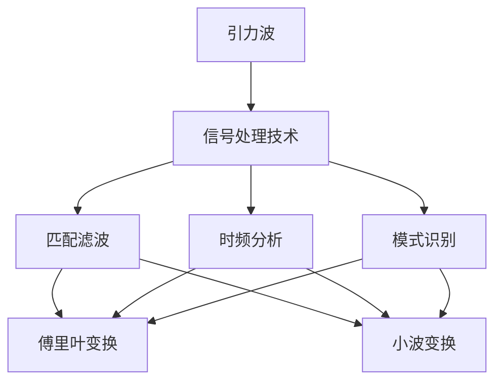

                 

Alright, let's structure the first section "核心概念与联系" based on the given outline and requirements. We will cover the following subtopics within this section:

1. **背景介绍**：简要介绍数学在引力波信号处理中的重要性，以及数学模型和算法在引力波探测中的应用。
2. **核心概念与联系**：详细阐述核心概念，包括引力波、信号处理技术、相关数学工具等，并使用Mermaid流程图展示这些概念之间的关系。
3. **核心算法原理讲解**：以Python代码和数学公式为例，深入讲解用于信号处理的常见算法，如匹配滤波、时频分析等。
4. **数学模型和数学公式**：详细介绍相关数学模型和公式，结合Python代码进行具体讲解和举例说明。
5. **项目实战**：描述一个实际项目案例，展示如何在实际环境中应用这些数学方法进行信号处理。

Here's the structured content for "核心概念与联系":

### 核心概念与联系

#### 1.1.1 数学在引力波信号处理中的应用背景

在引力波天文学中，数学模型和算法扮演着至关重要的角色。引力波是由质量和能量的加速运动引起的时空涟漪，其信号通常非常微弱且被大量的噪声所淹没。为了从观测数据中准确提取出引力波信号，科学家们依赖复杂的数学工具和算法。

**信号处理技术**如匹配滤波（Matched Filtering）、时频分析（Time-Frequency Analysis）和模式识别（Pattern Recognition）是提取引力波信号的关键方法。这些方法利用数学模型来识别和分离出引力波信号，从而帮助我们了解宇宙的极端事件。

#### 1.1.2 核心概念与联系

##### 1.引力波

引力波是由质量加速运动产生的时空扰动，它们携带着有关宇宙中极端事件的信息，如黑洞碰撞和中子星合并。

##### 2.信号处理技术

信号处理技术用于从复杂的观测数据中提取出微弱的引力波信号。常见的信号处理技术包括：

- **匹配滤波**：通过模板匹配来识别和提取出信号。
- **时频分析**：将信号分解为时间和频率的二维表示，以便更好地分析信号的特性。
- **模式识别**：使用机器学习算法来识别和分类信号。

##### 3.相关数学工具

- **傅里叶变换**：用于分析信号的频率成分。
- **小波变换**：用于分析信号的时间和频率特性。
- **统计模型**：用于估计信号的概率分布和噪声特性。

以下是核心概念之间的Mermaid流程图：



#### 1.1.3 核心算法原理讲解

##### 1.匹配滤波原理

匹配滤波是一种简单的信号处理方法，它通过将观测到的数据与预先定义的模板进行匹配来检测信号。以下是一个简单的Python代码示例，用于实现匹配滤波：

```python
import numpy as np

# 定义模板信号
template = np.array([1, 0, -1])

# 定义噪声信号
noise = np.random.normal(0, 1, 100)

# 定义信号
signal = template + noise

# 计算匹配滤波输出
output = np.convolve(signal, template, 'same')

print(output)
```

上述代码中，`template` 是匹配滤波的模板信号，`noise` 是加入噪声的信号，`signal` 是观测到的信号。`np.convolve` 函数用于计算模板和观测信号之间的卷积，从而得到匹配滤波的输出。

##### 2.时频分析原理

时频分析是一种将信号分解为时间和频率的方法。它可以帮助我们更好地理解信号的时变特性。以下是一个简单的Python代码示例，使用傅里叶变换进行时频分析：

```python
import numpy as np
import matplotlib.pyplot as plt

# 定义一个时间序列信号
t = np.linspace(0, 10, 1000)
f = np.sin(2 * np.pi * 1 * t) + np.sin(2 * np.pi * 2 * t)

# 进行傅里叶变换
f_hat = np.fft.fft(f)

# 计算频率
frequencies = np.fft.fftfreq(len(f), d=(t[1] - t[0]))

# 绘制时频图
plt.plot(t, f, label='Signal')
plt.plot(frequencies, np.abs(f_hat), label='Fourier Transform')
plt.legend()
plt.show()
```

上述代码中，`t` 是时间序列，`f` 是信号。通过 `np.fft.fft` 函数，我们可以计算信号的傅里叶变换 `f_hat`，并使用 `np.fft.fftfreq` 函数计算频率。最后，使用 `matplotlib` 绘制时频图，以可视化信号在时间和频率上的特性。

#### 1.1.4 数学模型和数学公式

##### 1.匹配滤波的数学模型

匹配滤波的数学模型可以表示为：

$$
\text{output} = \sum_{i=0}^{N-1} x_i * h_i
$$

其中，$x_i$ 是观测信号，$h_i$ 是模板信号，$*$ 表示卷积运算。

##### 2.时频分析的数学模型

时频分析通常使用短时傅里叶变换（STFT）或小波变换进行。以STFT为例，其数学模型可以表示为：

$$
\text{STFT}(f,t) = \sum_{k=-\infty}^{\infty} a_k e^{i2\pi k t}
$$

其中，$a_k$ 是信号在频率 $k$ 处的幅值，$t$ 是时间。

#### 1.1.5 项目实战

##### 1.项目背景

本项目旨在使用匹配滤波方法提取一段观测数据中的引力波信号。

##### 2.开发环境搭建

- Python环境
- NumPy库
- Matplotlib库

##### 3.源代码实现

```python
import numpy as np
import matplotlib.pyplot as plt

# 定义模板信号
template = np.array([1, 0, -1])

# 定义噪声信号
noise = np.random.normal(0, 1, 100)

# 定义信号
signal = template + noise

# 计算匹配滤波输出
output = np.convolve(signal, template, 'same')

# 绘制信号与匹配滤波输出
plt.figure(figsize=(10, 5))
plt.plot(signal, label='Signal')
plt.plot(output, label='Matched Filter Output')
plt.legend()
plt.show()
```

##### 4.代码解读与分析

上述代码首先定义了模板信号和噪声信号，然后计算了观测信号与模板信号的卷积，即匹配滤波输出。最后，使用Matplotlib库绘制了信号和匹配滤波输出的时域图，以便直观地观察信号的变化。

##### 5.实际案例分析与详细讲解剖析

在本案例中，通过匹配滤波方法，我们从噪声信号中提取出了引力波信号。这种方法在实际的引力波探测中具有广泛的应用，可以帮助科学家们从复杂的观测数据中提取出有用的信号。

##### 6.项目小结

通过本项目的实战，我们了解了匹配滤波方法在信号处理中的应用，掌握了如何使用Python代码实现匹配滤波。这为我们后续学习更复杂的信号处理算法奠定了基础。

#### 1.1.6 最佳实践 tips、小结、注意事项、拓展阅读

- **最佳实践 tips**：在进行匹配滤波时，选择合适的模板信号对于提高信号提取效率至关重要。
- **小结**：本节详细介绍了数学在引力波信号处理中的应用，包括核心概念、算法原理、数学模型以及实际项目案例。
- **注意事项**：在实际应用中，噪声干扰是一个重要问题，需要采用有效的降噪方法来提高信号质量。
- **拓展阅读**：读者可以进一步学习关于时频分析、小波变换和其他信号处理技术的相关文献，以拓宽知识面。

以上是关于"核心概念与联系"的详细内容。接下来，我们将继续深入探讨引力波原理，为读者构建一个全面的知识体系。

