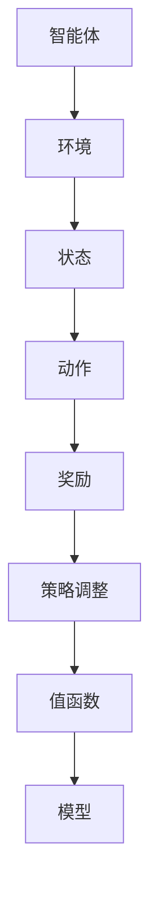

                 

### 第一部分：强化学习基础理论

强化学习（Reinforcement Learning，简称RL）是机器学习中的一个重要分支，它通过智能体与环境的交互，不断学习最优策略，以实现特定目标。与监督学习和无监督学习不同，强化学习更强调学习过程中的动态性和适应性。本章我们将介绍强化学习的基本概念、主要组成部分以及与监督学习、无监督学习的区别。

#### 强化学习的基本概念

强化学习的主要目标是使智能体（agent）在某一环境中通过不断试错，学会采取最优动作（action），以最大化累积奖励（reward）。在这个过程中，智能体会经历四个核心要素：状态（state）、动作（action）、奖励（reward）和策略（policy）。

- **状态（State）**：描述智能体当前所处的环境状态。
- **动作（Action）**：智能体可以采取的行为或决策。
- **奖励（Reward）**：环境对智能体动作的即时反馈，用于评估动作的好坏。
- **策略（Policy）**：智能体根据当前状态选择动作的规则或方法。

强化学习的核心目标是通过这些交互，智能体能够学习到一种最优策略，使其在给定环境中实现长期最大化奖励。

#### 强化学习与监督学习、无监督学习的比较

强化学习与监督学习和无监督学习有以下几点区别：

- **数据获取方式**：  
  - **监督学习**：需要大量标注好的数据，用于训练模型，然后通过这些模型来预测新的数据。
  - **无监督学习**：不依赖于标注数据，通过学习数据分布来提取有用信息。
  - **强化学习**：通过与环境的交互来学习，不需要大量的标注数据。

- **学习目标**：  
  - **监督学习**：目标是使模型预测与真实标签尽可能接近。
  - **无监督学习**：目标是发现数据中的潜在结构或分布。
  - **强化学习**：目标是学会最优策略，以最大化长期累积奖励。

- **适用场景**：  
  - **监督学习**：适用于有明确标签的数据，如分类、回归任务。
  - **无监督学习**：适用于数据探索、聚类等任务。
  - **强化学习**：适用于决策问题，如游戏、机器人控制、自动驾驶等。

#### 强化学习的基本架构

强化学习的基本架构通常包括以下几个部分：

1. **智能体（Agent）**：执行动作，接收环境反馈，并调整策略。
2. **环境（Environment）**：提供状态和奖励，与智能体进行交互。
3. **策略（Policy）**：智能体根据当前状态选择动作的规则。
4. **值函数（Value Function）**：用于评估状态或策略的好坏。
5. **模型（Model）**：预测环境状态转移和奖励的数学模型。

图1展示了强化学习的基本架构。在这个架构中，智能体根据当前状态选择动作，执行动作后获得环境反馈，并通过策略调整来优化自身性能。

通过这个架构，我们可以看到强化学习是一个动态调整的过程，智能体通过不断的交互和策略优化，逐渐学习到最优行为。

#### 小结

在本章中，我们介绍了强化学习的基本概念和主要组成部分，并与监督学习和无监督学习进行了比较。通过了解强化学习的基本架构，我们可以更好地理解智能体在复杂环境中的决策过程。在下一章中，我们将深入探讨马尔可夫决策过程（MDP），为理解强化学习的数学基础打下基础。

#### 推荐阅读

- Sutton, R. S., & Barto, A. G. (2018). 《强化学习：原理与案例》(Reinforcement Learning: An Introduction).
- Russell, S., & Norvig, P. (2020). 《人工智能：一种现代的方法》(Artificial Intelligence: A Modern Approach).

### 关键词

- 强化学习
- 智能体
- 策略
- 奖励
- 马尔可夫决策过程
- 监督学习
- 无监督学习

### 摘要

本章介绍了强化学习的基本概念和主要组成部分，包括状态、动作、奖励和策略等核心要素。通过比较强化学习与监督学习和无监督学习的区别，我们展示了强化学习在动态决策问题中的应用优势。同时，我们简要介绍了强化学习的基本架构，为后续讨论马尔可夫决策过程和强化学习算法奠定了基础。

