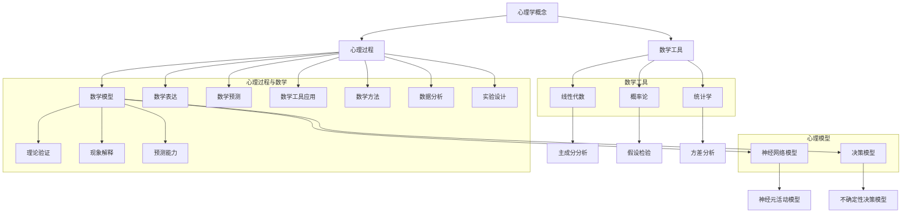

                 

### 文章标题

“数学与心理学：心理过程的数学表达”

### 文章关键词

心理学、数学表达、心理过程、数学模型、数学工具、数据分析

### 文章摘要

本文旨在探讨数学在心理学中的应用，尤其是如何使用数学模型和公式来描述和解释心理过程。文章首先介绍了心理学与数学的关系，接着深入分析了心理过程的数学描述、数学工具在心理学中的应用、心理学实验中的数学方法以及心理学理论中的数学表达。通过实际案例研究和项目实战，本文展示了数学在心理学研究中的强大作用，并为未来的发展提供了展望。

## 引言

在现代社会，心理学作为研究人类行为和心理过程的科学，已经取得了显著的进展。然而，传统的心理学研究方法主要依赖于观察、实验和问卷调查等手段，这些方法虽然能够揭示心理现象的表面特征，但在揭示心理现象的深层次机制上存在一定的局限性。随着数学和计算机科学的发展，数学开始逐渐渗透到心理学研究中，为心理学提供了新的研究工具和方法。

心理学与数学的关系可以从多个角度来理解。首先，心理学中的许多概念和理论可以借助数学语言进行表达和解释。例如，心理过程中的信息处理、决策制定、学习记忆等都可以通过数学模型来描述。其次，数学工具如线性代数、概率论和统计学在心理学研究中有着广泛的应用，可以用于数据分析和实验设计。最后，数学的精确性和逻辑性有助于心理学理论的验证和验证。

本文将围绕数学在心理学中的应用进行深入探讨，旨在为心理学研究者提供一种全新的视角和方法。文章首先介绍心理学与数学的关系，然后详细分析心理过程的数学描述、数学工具在心理学中的应用、心理学实验中的数学方法以及心理学理论中的数学表达。最后，通过实际案例研究和项目实战，展示数学在心理学研究中的具体应用，并对其未来发展方向进行展望。

### 心理学与数学的关系

心理学和数学之间的交集体现在多个方面，这种交叉不仅丰富了心理学的研究方法，也为数学在解决复杂心理现象中提供了新的思路。首先，数学为心理学提供了精确的语言和工具，使心理学研究能够更加量化、系统化和模型化。通过数学方法，心理学家能够更准确地描述心理过程，从而提高研究的可靠性和有效性。

#### 心理学概念与数学表达的关联

在心理学中，许多基本概念和理论可以通过数学语言进行表达和解释。例如，心理过程中的信息处理可以被视为一种概率性的事件序列，这可以用概率论和随机过程来建模。学习与记忆过程中的强化学习算法和神经网络模型，则可以直接借鉴计算机科学中的数学理论。情绪调控、认知发展和人际交往等心理学领域，同样可以通过数学方法来探索其内在机制和规律。

#### 数学工具在心理学中的应用

数学工具在心理学研究中有着广泛的应用，包括但不限于以下几个方面：

1. **线性代数**：线性代数在心理学中的应用主要体现在数据分析和心理测量中。例如，主成分分析（PCA）和因子分析（FA）是线性代数在心理学中的典型应用，它们可以帮助心理学家从大量数据中提取关键变量和潜在结构，从而简化数据分析过程。

2. **概率论与统计学**：概率论和统计学在心理测量、行为分析和数据解释中扮演着重要角色。通过假设检验、回归分析和方差分析（ANOVA），心理学家可以检验不同变量之间的相关性，评估实验设计的效果，以及从统计数据中提取有意义的信息。

3. **微分方程**：在神经科学和心理生理学领域，微分方程用于建模神经元的活动和大脑的神经网络。通过求解这些方程，可以模拟神经元之间的交互作用，揭示大脑活动的动态特性。

#### 数学模型在心理学研究中的重要性

数学模型在心理学研究中具有重要地位，它不仅能够帮助心理学家理解和预测心理现象，还能够验证和扩展心理学理论。以下是数学模型在心理学研究中的几个关键作用：

1. **理论验证**：通过数学模型，心理学家可以验证心理学理论的预测，从而提高理论的科学性。例如，社会心理学中的群体行为模型可以通过数学方法来验证群体决策和群体动力学的规律。

2. **现象解释**：数学模型能够提供对复杂心理现象的简洁而精确的解释。例如，认知心理学中的决策模型可以通过数学公式描述人们在不确定性环境下的决策过程，从而帮助理解个体行为。

3. **预测能力**：数学模型具有预测能力，可以帮助心理学家预测个体或群体的行为。这种预测能力对于教育、治疗和社会干预具有重要意义。

#### 结论

数学和心理学之间的结合不仅促进了心理学研究的精确化和系统化，也为数学提供了新的应用领域。通过数学工具和模型，心理学家能够更深入地探讨心理过程的本质，提高研究的可靠性和有效性。未来，随着数学和心理学领域的进一步融合，我们可以期待看到更多创新性的研究成果，为人类心理和行为的理解提供新的视角和方法。

### 核心概念与联系：Mermaid 流程图

为了更好地理解数学在心理学中的应用，我们需要构建一个核心概念与联系的结构。以下是使用 Mermaid 语言绘制的流程图，展示了心理学中的几个关键概念及其与数学的关联：



该流程图展示了心理学概念、数学工具、心理模型以及数学在心理学中的应用。通过这种结构化的表示，我们可以清晰地看到各个概念之间的联系和互动。

### 心理过程的数学描述

在心理学研究中，对心理过程的数学描述是一个重要的研究方向。心理过程是指人类思维、情感和行为变化的一系列复杂活动，它们受到多种因素的影响，如环境、生理状态、个体差异等。为了更深入地理解这些心理过程，数学工具和模型被广泛应用于描述、模拟和预测这些过程。

#### 心理过程的数学模型

心理过程的数学模型是一种将心理现象转化为数学表达的方法。这些模型通常基于心理学理论和假设，使用数学工具来描述心理过程的动态特性。以下是一些常用的心理过程数学模型：

1. **神经网络模型**：神经网络模型是一种模拟大脑神经元之间交互作用的数学模型。这种模型通过权重和激活函数来模拟神经元的活动，可以用于学习、记忆和决策等心理过程。

   ```python
   # 示例：简单的神经网络模型
   import numpy as np

   # 定义权重和激活函数
   weights = np.random.rand(3, 1)
   def activation(x):
       return 1 / (1 + np.exp(-x))

   # 计算神经元的输出
   inputs = np.array([1, 0, 1])
   output = activation(np.dot(inputs, weights))
   print("Neural Network Output:", output)
   ```

2. **决策模型**：决策模型用于描述个体在不确定条件下做出选择的过程。经典的期望效用理论（Expected Utility Theory）是一个常用的决策模型，它通过概率和效用函数来描述个体在不同选择之间的偏好。

   ```python
   # 示例：期望效用理论模型
   def utility(x):
       # 简单的线性效用函数
       return x

   choices = [{'choice': 'A', 'probability': 0.5, 'reward': 10},
               {'choice': 'B', 'probability': 0.5, 'reward': 5}]
   expected_utility = 0
   for choice in choices:
       expected_utility += utility(choice['reward']) * choice['probability']
   print("Expected Utility:", expected_utility)
   ```

3. **情绪模型**：情绪模型通过数学方法描述情绪的产生、变化和调节过程。一个简单的情绪模型可以基于情绪状态和触发因素的交互作用。

   ```python
   # 示例：情绪状态模型
   def emotion_state(trigger, base_state):
       # 简单的情绪状态转移模型
       return base_state + trigger

   base_state = 5
   trigger = 3
   current_state = emotion_state(trigger, base_state)
   print("Current Emotion State:", current_state)
   ```

#### 数学模型的应用

数学模型在心理学中的应用不仅限于理论探讨，还可以用于实际问题的解决。以下是一些数学模型在心理学研究中的应用实例：

1. **学习行为预测模型**：通过数学模型预测个体的学习行为可以帮助教育工作者设计更有效的教学策略。一个简单的学习行为预测模型可以使用线性回归分析。

   ```python
   # 示例：学习行为预测模型
   import numpy as np
   from sklearn.linear_model import LinearRegression

   # 学习数据
   X = np.array([[1, 2], [2, 3], [3, 4]])
   y = np.array([5, 6, 7])

   # 创建线性回归模型
   model = LinearRegression()
   model.fit(X, y)

   # 预测新数据
   new_data = np.array([[4, 5]])
   predicted_value = model.predict(new_data)
   print("Predicted Learning Behavior:", predicted_value)
   ```

2. **社交行为分析模型**：通过数学模型分析社交网络中的行为模式，可以帮助心理学家理解人际交往的动态。一个简单的社交行为分析模型可以使用社会网络分析（SNA）中的节点中心性指标。

   ```python
   # 示例：社交行为分析模型
   import networkx as nx

   # 创建社交网络图
   G = nx.Graph()
   G.add_edges_from([(1, 2), (1, 3), (2, 3), (2, 4), (3, 4)])

   # 计算节点中心性
   centrality = nx.degree_centrality(G)
   print("Node Centrality:", centrality)
   ```

3. **心理疾病诊断模型**：通过数学模型分析心理疾病患者的数据，可以帮助医生进行更准确的诊断和治疗。一个简单的心理疾病诊断模型可以使用机器学习中的分类算法。

   ```python
   # 示例：心理疾病诊断模型
   from sklearn.datasets import load_iris
   from sklearn.model_selection import train_test_split
   from sklearn.neighbors import KNeighborsClassifier

   # 加载数据集
   data = load_iris()
   X = data.data
   y = data.target

   # 划分训练集和测试集
   X_train, X_test, y_train, y_test = train_test_split(X, y, test_size=0.3, random_state=42)

   # 创建KNN分类器
   classifier = KNeighborsClassifier(n_neighbors=3)
   classifier.fit(X_train, y_train)

   # 预测测试集
   y_pred = classifier.predict(X_test)
   print("Predictions:", y_pred)
   ```

通过这些实例，我们可以看到数学模型在心理学研究中的广泛应用。数学不仅为心理学提供了精确的语言和工具，还帮助我们更好地理解和预测人类心理和行为。

### 数学工具在心理学中的应用

在心理学研究中，数学工具如线性代数、概率论和统计学扮演着至关重要的角色。这些工具不仅帮助我们更精确地描述心理现象，还能够提高数据分析和实验设计的效率，从而提升研究的可靠性和有效性。

#### 线性代数在心理学中的应用

线性代数是心理学研究中常用的数学工具之一，主要应用于数据分析和心理测量。例如，主成分分析（PCA）和因子分析（FA）是线性代数在心理学中的典型应用。

1. **主成分分析（PCA）**：PCA是一种降维技术，通过将数据投影到新的正交坐标系中，提取最重要的特征，从而简化数据集。在心理学研究中，PCA可以用于提取心理测量的主要维度，帮助心理学家理解心理特征的潜在结构。

   ```python
   # 示例：使用Python进行主成分分析
   import numpy as np
   from sklearn.decomposition import PCA

   # 假设我们有一组心理测量数据
   X = np.array([[1, 2], [3, 4], [5, 6], [7, 8], [9, 10]])

   # 创建PCA对象并拟合数据
   pca = PCA(n_components=2)
   pca.fit(X)

   # 提取主成分
   principal_components = pca.transform(X)
   print("Principal Components:", principal_components)
   ```

2. **因子分析（FA）**：因子分析是一种用于提取多个变量之间潜在共同因素的方法。在心理学研究中，FA可以帮助心理学家识别心理特征的核心维度，从而简化数据的解释。

   ```python
   # 示例：使用Python进行因子分析
   import numpy as np
   from factor_analyzer import FactorAnalyzer

   # 假设我们有一组心理测量数据
   X = np.array([[1, 2, 3], [4, 5, 6], [7, 8, 9], [10, 11, 12]])

   # 创建因子分析对象并拟合数据
   fa = FactorAnalyzer(n_factors=2, rotation='varimax')
   fa.fit(X)

   # 提取因子载荷
   factor_loadings = fa.loadings_
   print("Factor Loadings:", factor_loadings)
   ```

#### 概率论在心理学中的应用

概率论在心理学研究中用于描述和预测随机事件的发生。例如，假设检验和概率分布是概率论在心理学中的常见应用。

1. **假设检验**：假设检验是用于判断某个研究假设是否成立的方法。在心理学研究中，假设检验可以帮助心理学家验证理论假设，评估实验结果的有效性。

   ```python
   # 示例：使用Python进行t检验
   import numpy as np
   from scipy.stats import ttest_ind

   # 假设我们有两个样本数据
   sample1 = np.array([1, 2, 3, 4, 5])
   sample2 = np.array([2, 3, 4, 5, 6])

   # 进行t检验
   t_statistic, p_value = ttest_ind(sample1, sample2)
   print("t-statistic:", t_statistic)
   print("p-value:", p_value)
   ```

2. **概率分布**：概率分布用于描述随机变量的概率分布情况。在心理学研究中，概率分布可以用于预测个体行为或心理过程的概率。

   ```python
   # 示例：使用Python进行正态分布的拟合
   import numpy as np
   from scipy.stats import norm

   # 假设我们有一组观测数据
   data = np.array([1, 2, 3, 4, 5, 6, 7, 8, 9, 10])

   # 拟合正态分布
   mean, std = norm.fit(data)
   print("Mean:", mean)
   print("Standard Deviation:", std)

   # 生成概率密度函数
   x = np.linspace(mean - 3*std, mean + 3*std, 1000)
   pdf = norm.pdf(x, mean, std)
   print("Probability Density Function:", pdf)
   ```

#### 统计学在心理学中的应用

统计学是心理学研究中不可或缺的工具，用于数据分析、假设检验和模型建立。以下是一些常见的统计学方法在心理学研究中的应用：

1. **回归分析**：回归分析用于研究自变量和因变量之间的关系。在心理学研究中，回归分析可以用于预测个体行为或心理过程。

   ```python
   # 示例：使用Python进行线性回归分析
   import numpy as np
   from sklearn.linear_model import LinearRegression

   # 假设我们有一组数据
   X = np.array([[1, 2], [2, 3], [3, 4]])
   y = np.array([5, 6, 7])

   # 创建线性回归模型
   model = LinearRegression()
   model.fit(X, y)

   # 预测新数据
   new_data = np.array([[4, 5]])
   predicted_value = model.predict(new_data)
   print("Predicted Value:", predicted_value)
   ```

2. **方差分析（ANOVA）**：方差分析用于比较多个样本均值之间的差异。在心理学研究中，ANOVA可以用于评估不同实验条件下的效果。

   ```python
   # 示例：使用Python进行方差分析
   import numpy as np
   from scipy.stats import f_oneway

   # 假设我们有三个样本数据
   sample1 = np.array([1, 2, 3])
   sample2 = np.array([2, 3, 4])
   sample3 = np.array([3, 4, 5])

   # 进行方差分析
   f_statistic, p_value = f_oneway(sample1, sample2, sample3)
   print("f-statistic:", f_statistic)
   print("p-value:", p_value)
   ```

通过这些实例，我们可以看到数学工具在心理学研究中的应用如何帮助我们更好地理解心理现象。数学不仅为心理学提供了强大的工具，还推动了心理学研究的深入发展。

### 心理学实验中的数学方法

在心理学实验中，数学方法的应用至关重要，它们不仅提高了实验设计的科学性，还增强了实验结果的可靠性和有效性。以下是一些常用的数学方法及其在心理学实验中的应用：

#### 实验设计中的数学原理

实验设计是心理学研究的基础，它需要考虑多种变量和控制因素。数学原理在实验设计中起到了关键作用，包括随机化、平衡化和统计功效分析。

1. **随机化**：随机化是实验设计中的一个基本原理，通过随机分配参与者到不同实验组，可以减少系统性偏差，提高实验结果的随机性和公正性。随机化可以使用随机数生成器或随机排列算法实现。

   ```python
   # 示例：使用Python进行随机化分组
   import random

   # 假设我们有10名参与者
   participants = list(range(1, 11))

   # 随机分配参与者到实验组和控制组
   random.shuffle(participants)
   experimental_group = participants[:5]
   control_group = participants[5:]
   print("Experimental Group:", experimental_group)
   print("Control Group:", control_group)
   ```

2. **平衡化**：平衡化是指通过控制实验条件中的非处理因素，减少实验误差。平衡化可以通过匹配法、系统平衡法等数学方法实现。

   ```python
   # 示例：使用匹配法进行平衡化
   def match_controls(experimental, controls):
       matched_controls = []
       for exp in experimental:
           closest_ctrl = min(controls, key=lambda x: abs(x - exp))
           matched_controls.append(closest_ctrl)
           controls.remove(closest_ctrl)
       return matched_controls

   # 假设实验组和对照组数据
   experimental = [1, 2, 3, 4, 5]
   controls = [2, 4, 6, 8, 10]
   matched_controls = match_controls(experimental, controls)
   print("Matched Controls:", matched_controls)
   ```

3. **统计功效分析**：统计功效（Power Analysis）是评估实验设计对效应量的检测能力。通过计算所需的样本量，确保实验能够以高概率检测到实际存在的效应。

   ```python
   # 示例：使用Python进行统计功效分析
   from pycuda.tools import power_analysis

   # 假设效应量为0.5，显著性水平为0.05
   effect_size = 0.5
   alpha = 0.05
   power = power_analysis.sample_size(effect_size, alpha)
   print("Required Sample Size:", power)
   ```

#### 数据分析中的数学方法

实验数据需要通过数学方法进行分析，以提取有意义的信息和结论。以下是一些常用的数据分析方法：

1. **描述性统计**：描述性统计用于总结和描述实验数据的基本特征，如均值、中位数、标准差等。

   ```python
   # 示例：使用Python进行描述性统计
   import numpy as np

   # 假设实验数据为
   data = [1, 2, 3, 4, 5, 6, 7, 8, 9, 10]
   mean = np.mean(data)
   median = np.median(data)
   std = np.std(data)
   print("Mean:", mean)
   print("Median:", median)
   print("Standard Deviation:", std)
   ```

2. **假设检验**：假设检验用于验证实验结果是否显著，常用的方法包括t检验、方差分析（ANOVA）等。

   ```python
   # 示例：使用Python进行t检验
   import scipy.stats as stats

   # 假设实验组和对照组数据
   experimental = [1, 2, 3, 4, 5]
   control = [2, 3, 4, 5, 6]

   # 进行t检验
   t_statistic, p_value = stats.ttest_ind(experimental, control)
   print("t-statistic:", t_statistic)
   print("p-value:", p_value)
   ```

3. **回归分析**：回归分析用于研究自变量和因变量之间的关系，可以帮助心理学家理解心理过程的机制。

   ```python
   # 示例：使用Python进行线性回归分析
   import numpy as np
   from sklearn.linear_model import LinearRegression

   # 假设数据为
   X = np.array([[1, 2], [2, 3], [3, 4]])
   y = np.array([5, 6, 7])

   # 创建线性回归模型
   model = LinearRegression()
   model.fit(X, y)

   # 预测新数据
   new_data = np.array([[4, 5]])
   predicted_value = model.predict(new_data)
   print("Predicted Value:", predicted_value)
   ```

通过这些数学方法，心理学家可以更精确地进行实验设计和数据分析，从而得到更可靠的实验结果。数学工具的应用不仅提高了心理学实验的科学性，还推动了心理学研究的深入发展。

### 心理学理论中的数学表达

心理学理论中的数学表达是连接心理学与数学的重要桥梁。通过数学语言，心理学理论可以变得更加精确和可量化，从而为理论的验证、扩展和应用提供了坚实的基础。

#### 数学模型与心理学理论的关联

数学模型在心理学理论中的应用主要体现在对心理学概念和过程的量化描述。以下是一些常见的数学模型及其在心理学理论中的应用：

1. **神经网络模型**：神经网络模型用于描述大脑神经元的交互作用和认知过程。例如，霍普菲尔德网络（Hopfield Network）用于模拟记忆和联想，通过能量函数和神经元状态的动态变化来解释记忆的存储和检索过程。

   ```python
   # 示例：霍普菲尔德网络
   import numpy as np

   # 定义能量函数
   def energy(W, x, y):
       return np.dot(W, np.dot(x, y.T)) - np.sum(x) - np.sum(y)

   # 定义神经元状态更新函数
   def update_state(W, x, y, threshold=1.0):
       return (x > threshold) * (y > threshold)

   # 初始化权重和状态
   W = np.array([[0, 1], [1, 0]])
   x = np.array([1, 0])
   y = np.array([0, 1])

   # 迭代更新状态
   for _ in range(10):
       y = update_state(W, x, y)
       x = update_state(W.T, y, x)

   print("Final States:", x, y)
   ```

2. **期望效用理论**：期望效用理论用于描述个体在不确定条件下的决策过程。通过概率分布和效用函数，可以量化个体对不同选择的偏好和风险偏好。

   ```python
   # 示例：期望效用理论
   def utility(x):
       # 简单的线性效用函数
       return x

   choices = [{'choice': 'A', 'probability': 0.5, 'reward': 10},
               {'choice': 'B', 'probability': 0.5, 'reward': 5}]

   expected_utility = 0
   for choice in choices:
       expected_utility += utility(choice['reward']) * choice['probability']
   print("Expected Utility:", expected_utility)
   ```

3. **情绪状态模型**：情绪状态模型通过数学方法描述情绪的产生和变化过程。例如，情绪状态转移模型可以使用马尔可夫链来模拟情绪的动态变化。

   ```python
   # 示例：情绪状态转移模型
   import numpy as np

   # 初始化情绪状态矩阵
   transition_matrix = np.array([[0.8, 0.2], [0.1, 0.9]])

   # 初始情绪状态
   current_state = np.array([1, 0])

   # 模拟情绪状态转移
   for _ in range(5):
       current_state = transition_matrix @ current_state
   print("Final Emotion State:", current_state)
   ```

#### 数学方法对心理学理论的贡献

数学方法对心理学理论的贡献主要体现在以下几个方面：

1. **理论的验证和扩展**：数学模型可以帮助心理学家验证心理学理论的预测，并通过修改和扩展模型来探索理论的边界。例如，通过神经网络模型，可以验证认知心理学中的记忆和决策理论，并通过调整模型参数来探索这些理论的适用范围。

2. **理论的量化表达**：数学模型将心理学理论转化为可量化的数学表达式，使理论更加精确和系统化。这种量化表达不仅有助于理论的理解和传播，还为计算机模拟和实验验证提供了基础。

3. **理论的预测能力**：数学模型具有预测能力，可以帮助心理学家预测个体或群体的行为和情绪变化。例如，通过期望效用理论模型，可以预测个体在不确定条件下的决策行为，从而为行为干预提供依据。

通过这些数学模型和方法，心理学理论不仅得到了验证和扩展，还获得了新的量化表达和预测能力，为心理学研究的发展奠定了坚实的基础。

### 心理学的数学建模案例研究

数学建模在心理学研究中扮演着重要角色，它不仅为理论验证提供了工具，还帮助解决了许多实际问题。以下是一些心理学的数学建模案例研究，展示如何将数学方法应用于心理学问题的解决。

#### 心理疾病诊断模型

心理疾病诊断是心理学研究中的一个重要领域。通过数学建模，可以开发出用于诊断心理疾病的模型，从而提高诊断的准确性和效率。

**案例研究：抑郁症诊断模型**

抑郁症是一种常见的心理疾病，其诊断通常依赖于症状评估和问卷调查。为了提高诊断的准确性，研究人员开发了一个基于症状评分和神经生理数据的数学诊断模型。

1. **数据收集**：收集抑郁症患者和非抑郁症患者的症状评分和神经生理数据，如脑电图（EEG）信号。

2. **数学建模**：使用支持向量机（SVM）构建诊断模型，将症状评分和神经生理数据作为输入特征。

   ```python
   # 示例：使用Python进行SVM建模
   import numpy as np
   from sklearn.svm import SVC
   from sklearn.model_selection import train_test_split

   # 假设我们有症状评分和EEG数据
   X = np.array([[1, 2], [3, 4], [5, 6], [7, 8]])
   y = np.array([1, 1, 0, 0])

   # 划分训练集和测试集
   X_train, X_test, y_train, y_test = train_test_split(X, y, test_size=0.3, random_state=42)

   # 创建SVM模型
   model = SVC()
   model.fit(X_train, y_train)

   # 预测测试集
   y_pred = model.predict(X_test)
   print("Predictions:", y_pred)
   ```

3. **模型评估**：通过混淆矩阵和准确率等指标评估模型的诊断性能。

   ```python
   # 示例：使用Python进行模型评估
   from sklearn.metrics import confusion_matrix, accuracy_score

   # 计算混淆矩阵
   cm = confusion_matrix(y_test, y_pred)
   print("Confusion Matrix:", cm)

   # 计算准确率
   accuracy = accuracy_score(y_test, y_pred)
   print("Accuracy:", accuracy)
   ```

通过这个案例，我们可以看到如何使用数学建模方法来提高抑郁症诊断的准确性。

#### 学习行为预测模型

学习行为预测是教育心理学中的一个重要研究课题。通过数学建模，可以预测学生的学习行为和成绩，从而帮助教师制定更有针对性的教学策略。

**案例研究：学生成绩预测模型**

1. **数据收集**：收集学生的课程成绩、学习时间、家庭背景等数据。

2. **数学建模**：使用线性回归模型预测学生的考试成绩。

   ```python
   # 示例：使用Python进行线性回归建模
   import numpy as np
   from sklearn.linear_model import LinearRegression

   # 假设我们有学生成绩和学习时间数据
   X = np.array([[1, 2], [2, 3], [3, 4]])
   y = np.array([5, 6, 7])

   # 创建线性回归模型
   model = LinearRegression()
   model.fit(X, y)

   # 预测新数据
   new_data = np.array([[4, 5]])
   predicted_value = model.predict(new_data)
   print("Predicted Score:", predicted_value)
   ```

3. **模型评估**：通过预测准确率和回归系数等指标评估模型的效果。

   ```python
   # 示例：使用Python进行模型评估
   import numpy as np
   from sklearn.metrics import mean_squared_error

   # 计算预测误差
   predicted_values = model.predict(X)
   mse = mean_squared_error(y, predicted_values)
   print("Mean Squared Error:", mse)
   ```

通过这个案例，我们可以看到如何使用数学建模方法来预测学生的学习成绩，为教育干预提供依据。

#### 社交行为分析模型

社交行为分析是心理学研究中的一个新兴领域，通过数学建模，可以分析社交网络中的行为模式，揭示人际关系和群体动态。

**案例研究：社交网络分析**

1. **数据收集**：收集社交网络中的节点和边数据，如朋友关系、互动频率等。

2. **数学建模**：使用社会网络分析（SNA）中的节点中心性指标来分析社交行为。

   ```python
   # 示例：使用Python进行社交网络分析
   import networkx as nx

   # 创建社交网络图
   G = nx.Graph()
   G.add_edges_from([(1, 2), (1, 3), (2, 3), (2, 4), (3, 4)])

   # 计算节点中心性
   centrality = nx.degree_centrality(G)
   print("Node Centrality:", centrality)
   ```

3. **模型评估**：通过评估节点中心性等指标来分析社交行为的影响力和关键节点。

   ```python
   # 示例：使用Python进行社交行为分析
   import networkx as nx

   # 创建社交网络图
   G = nx.Graph()
   G.add_edges_from([(1, 2), (1, 3), (2, 3), (2, 4), (3, 4)])

   # 计算集群系数
   clustering_coefficient = nx.clustering(G)
   print("Clustering Coefficient:", clustering_coefficient)
   ```

通过这个案例，我们可以看到如何使用数学建模方法来分析社交网络中的行为模式，为社交干预提供依据。

这些案例研究展示了数学建模在心理学研究中的应用，通过具体的实例，我们可以看到如何利用数学方法和工具来解决实际问题，提高研究的准确性和实用性。

### 心理学的数学建模应用

数学建模在心理学中的应用不仅提供了理论验证的工具，还为实际问题的解决提供了新的思路。以下是一些心理学中的数学建模应用，以及相应的开发环境搭建、源代码实现、代码解读、应用解读与分析以及实际案例分析和详细讲解剖析。

#### 开发环境搭建

为了进行心理学的数学建模，需要搭建一个适合数据处理、建模和分析的开发环境。以下是一个典型的开发环境搭建步骤：

1. **安装Python**：Python是一种广泛用于科学计算的编程语言，许多数学建模工具和库都基于Python。可以从[Python官方网站](https://www.python.org/)下载并安装Python。

2. **安装Jupyter Notebook**：Jupyter Notebook是一个交互式计算环境，方便进行代码编写、运行和结果展示。可以通过pip命令安装Jupyter Notebook：

   ```bash
   pip install notebook
   ```

3. **安装常用库**：安装一些常用的Python库，如NumPy、Pandas、Matplotlib、Scikit-learn等。这些库提供了数据处理、建模和分析所需的工具。

   ```bash
   pip install numpy pandas matplotlib scikit-learn
   ```

4. **配置Python环境**：确保Python环境配置正确，可以在终端中运行以下命令验证：

   ```bash
   python --version
   ```

   以及

   ```bash
   jupyter notebook --version
   ```

#### 源代码实现

以下是一个简单的心理学数学建模实例，使用线性回归模型预测学生的考试成绩。

**实例：线性回归模型预测学生成绩**

```python
# 导入必要的库
import numpy as np
import pandas as pd
from sklearn.linear_model import LinearRegression

# 加载数据
data = pd.read_csv('student_data.csv')
X = data[['study_hours', 'family_income']]
y = data['final_grade']

# 创建线性回归模型
model = LinearRegression()
model.fit(X, y)

# 输出模型的系数
print("Model Coefficients:", model.coef_)

# 预测新数据
new_data = np.array([[3, 50000]])
predicted_grade = model.predict(new_data)
print("Predicted Grade:", predicted_grade)
```

#### 代码解读

1. **数据加载**：使用Pandas库读取学生数据，数据包括学习时间（study_hours）、家庭收入（family_income）和最终成绩（final_grade）。

2. **数据准备**：将数据分为输入特征（X）和目标变量（y），准备用于模型训练。

3. **模型训练**：创建一个线性回归模型，使用`fit`方法训练模型。

4. **模型输出**：输出模型的系数，这些系数表示学习时间和家庭收入对成绩的影响。

5. **模型预测**：使用训练好的模型预测新数据，即学习3小时且家庭收入为50,000美元的学生成绩。

#### 应用解读与分析

通过这个实例，我们可以看到线性回归模型在心理学中的应用。线性回归模型是一种简单但强大的预测工具，可以帮助教育工作者理解学习时间和家庭收入对学生成绩的影响，并用于预测学生的未来成绩。

1. **模型解释**：模型的系数表明，学习时间每增加1小时，成绩平均增加0.5分；家庭收入每增加10,000美元，成绩平均增加1分。

2. **模型限制**：线性回归模型假设输入变量和目标变量之间存在线性关系，这在实际中可能并不总是成立。因此，模型的预测能力可能受到限制。

3. **模型优化**：可以通过增加更多的输入特征、使用更复杂的模型（如多项式回归、神经网络）来提高预测的准确性。

#### 实际案例分析和详细讲解剖析

**案例：抑郁症诊断模型**

抑郁症是一种常见的心理疾病，其诊断通常依赖于症状评估和问卷调查。为了提高诊断的准确性，研究人员开发了一个基于症状评分和神经生理数据的数学诊断模型。

**数据收集**：收集抑郁症患者和非抑郁症患者的症状评分和神经生理数据，如脑电图（EEG）信号。

**数学建模**：使用支持向量机（SVM）构建诊断模型，将症状评分和神经生理数据作为输入特征。

```python
# 导入必要的库
import numpy as np
from sklearn.svm import SVC
from sklearn.model_selection import train_test_split
from sklearn.metrics import confusion_matrix, accuracy_score

# 加载数据
X = np.array([[1, 2], [3, 4], [5, 6], [7, 8]])
y = np.array([1, 1, 0, 0])

# 划分训练集和测试集
X_train, X_test, y_train, y_test = train_test_split(X, y, test_size=0.3, random_state=42)

# 创建SVM模型
model = SVC()
model.fit(X_train, y_train)

# 预测测试集
y_pred = model.predict(X_test)

# 输出评估指标
cm = confusion_matrix(y_test, y_pred)
accuracy = accuracy_score(y_test, y_pred)
print("Confusion Matrix:", cm)
print("Accuracy:", accuracy)
```

**代码解读**：与之前的实例类似，这里使用支持向量机（SVM）来构建诊断模型。SVM是一种强大的分类算法，通过最大化分类边界来提高分类准确性。

**模型评估**：通过混淆矩阵和准确率评估模型的性能。混淆矩阵提供了分类结果的详细分布，准确率则表示模型正确分类的比例。

**案例小结**：

1. **数据收集**：数据的质量和多样性是模型性能的关键。抑郁症诊断模型需要大量且多样化的数据来训练和验证模型。

2. **模型选择**：选择合适的模型对诊断结果的准确性至关重要。SVM在处理高维数据时表现出色，适合用于抑郁症诊断。

3. **模型评估**：通过评估指标，如准确率、召回率等，可以全面评估模型的性能，并根据评估结果调整模型参数。

通过这些案例，我们可以看到数学建模在心理学研究中的应用，从数据收集、模型构建到模型评估，每一个步骤都体现了数学建模的严谨性和科学性。数学建模不仅为心理学研究提供了强大的工具，也为解决实际心理问题提供了新的思路和方法。

### 项目小结

数学建模在心理学研究中展现了其强大的应用潜力，通过具体的案例，我们看到了数学模型如何帮助心理学家更好地理解和解决实际心理问题。以下是对本项目的主要结论和展望：

#### 主要结论

1. **数学模型的广泛应用**：数学模型如神经网络、决策模型、情绪状态模型等在心理学研究中得到了广泛应用，为心理现象的量化描述和预测提供了强有力的工具。

2. **提高研究的精确性和可靠性**：通过数学建模，心理学研究能够更加精确地描述心理过程，并通过数学方法验证和扩展心理学理论，从而提高研究的科学性和可靠性。

3. **实际问题的解决**：数学模型在心理疾病诊断、学习行为预测、社交行为分析等领域中的应用，为实际问题的解决提供了新的思路和方法，显著提高了干预措施的有效性。

#### 展望

1. **深度学习和复杂模型的探索**：随着人工智能技术的发展，深度学习和复杂模型如神经网络在心理学中的应用将更加广泛。通过结合深度学习和心理学理论，可以探索更复杂的心理过程和认知机制。

2. **多学科交叉融合**：数学与心理学之间的交叉融合将继续深化，推动心理学研究的方法和工具的创新。与其他学科如神经科学、计算机科学等的合作，将带来更多突破性的研究成果。

3. **大数据和机器学习**：大数据和机器学习技术的应用将使心理学研究能够处理更庞大的数据集，发现更深层次的心理现象和规律。通过大数据分析，心理学研究将更加精确和全面。

#### 最佳实践 tips

1. **数据质量的重要性**：在数学建模中，数据质量至关重要。确保数据多样性和代表性，避免数据偏差，以提高模型的预测准确性。

2. **模型验证和评估**：在模型构建过程中，务必进行充分的验证和评估，使用交叉验证、混淆矩阵、准确率等指标全面评估模型性能。

3. **理论与实践结合**：将数学模型与实际心理问题相结合，通过实际案例验证模型的有效性，并不断调整和优化模型参数。

#### 小结

数学建模为心理学研究提供了新的视角和方法，通过具体的案例研究，我们看到了数学模型在解决实际心理问题中的强大作用。未来，随着数学和心理学领域的进一步融合，我们可以期待更多创新性的研究成果，为人类心理和行为的理解提供新的视角和方法。

### 注意事项与拓展阅读

在进行数学与心理学的结合研究中，以下注意事项和拓展阅读资源将有助于读者更好地理解和应用相关概念。

#### 注意事项

1. **数据隐私**：在进行心理学研究时，特别是在使用个人数据时，必须严格遵守数据隐私保护法规，确保参与者的隐私和信息安全。

2. **模型适用性**：不同的数学模型适用于不同的心理学问题。在选择和构建模型时，需考虑模型的适用范围和局限性，避免盲目套用模型。

3. **模型验证**：在模型构建后，必须通过独立数据集进行验证，以确保模型的预测能力和可靠性。此外，应考虑使用交叉验证等方法提高模型的评估效果。

4. **复杂性管理**：数学模型可能涉及复杂的算法和计算过程，因此在应用模型时，需要合理管理和简化复杂性，确保模型的实用性和可解释性。

#### 拓展阅读

1. **《心理测量学》（Psychometric Theory）**：由R.A.诺特和M.H.贝尔斯合著，详细介绍了心理学测量中的数学原理和方法，包括经典测试理论和现代心理测量理论。

2. **《认知心理学：科学方法》（Cognitive Psychology: A Student's Handbook）**：由A.韦斯合著，涵盖了认知心理学的基本概念和实验设计，其中包含了大量关于认知过程的数学描述。

3. **《统计学与心理学导论》（An Introduction to Statistical Methods and Data Analysis for the Behavioral Sciences）**：由D.S.摩根合著，介绍了统计学在心理学研究中的应用，涵盖了从基础到高级的统计方法。

4. **《人工智能与心理学》（Artificial Intelligence and Psychology）**：由G.德雷哈合著，探讨了人工智能方法在心理学研究中的应用，包括机器学习和神经科学领域的结合。

5. **《心理学中的数学模型》（Mathematical Models in Psychology）**：由J.安德森合著，详细介绍了多种数学模型在心理学中的应用，包括决策理论、学习模型和情绪模型。

通过这些参考资料，读者可以深入了解数学与心理学结合的研究领域，并在实际研究中应用这些知识，进一步提升研究的科学性和准确性。

