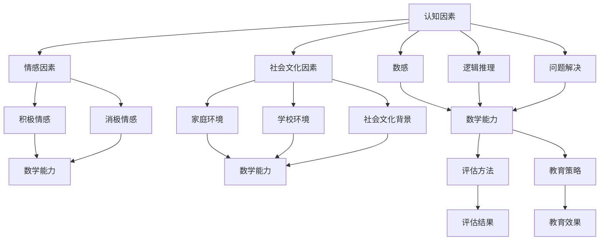

                 

# 数学与心理学：数学能力的心理发展

## 关键词

数学、心理学、数学能力、心理发展、认知科学、教育策略、评估方法、项目实战

## 摘要

本文旨在探讨数学能力与心理发展之间的复杂关系，揭示数学能力的心理学基础，以及如何通过有效的教育策略和评估方法来培养和发展数学能力。通过系统性的分析和研究，本文提出了一个完整的框架，帮助理解数学能力的心理机制，并提供了实用的指导，以促进数学教育的发展。文章首先介绍了数学与心理学的交集，然后详细讲解了数学能力的心理学基础，随后探讨了数学能力的培养和发展策略，以及评估数学能力的方法。最后，通过一个实际案例，展示了如何将理论应用到实践中，以提升数学能力。

## 引言

### 数学与心理学的关系

数学和心理学这两个看似截然不同的领域，实际上存在着深刻的联系。数学作为一门科学，研究的是数量、结构、变化和空间等概念，而心理学则专注于人类思维、情感和行为的研究。然而，数学能力的发展与心理发展紧密相关，心理学理论可以为我们理解数学能力的形成提供重要的视角。

### 数学能力的心理发展概述

数学能力的心理发展是一个复杂的过程，涉及认知、情感和行为等多个方面。早期的研究主要关注数学认知过程，包括数感、逻辑推理和问题解决能力。然而，随着心理学理论的不断发展，研究者开始从更广泛的视角来探讨数学能力的心理发展，包括社会文化因素、个体差异和学习环境等。

### 书籍背景与目的

《数学与心理学：数学能力的心理发展》这本书旨在填补这一领域的空白，通过对数学能力和心理发展之间关系的深入研究，提供一种新的视角来理解和培养数学能力。本书的目的是为教育工作者、研究人员和数学爱好者提供实用的指导，帮助他们更好地理解数学能力的心理机制，并探索有效的教育策略和评估方法。

## 核心概念与联系

### 数学与心理学的基本概念

在探讨数学能力的心理发展之前，有必要对数学和心理学的基本概念进行梳理。

- **数学**：数学是一门研究数量、结构、变化和空间等概念的学科。数学的基本要素包括数、符号、公式和定理等。数学能力通常包括数感、逻辑推理、问题解决和抽象思维等方面。

- **心理学**：心理学是研究人类思维、情感和行为的一门科学。心理学的核心概念包括认知、情感、动机、个性和社会行为等。

### 数学能力与心理发展

数学能力的发展是一个复杂的过程，受到多种心理因素的影响。

- **认知因素**：认知心理学研究了数学能力的认知基础，包括数感、逻辑推理和问题解决能力。这些认知过程是数学能力发展的核心。

- **情感因素**：情感心理学探讨了情感在数学能力发展中的作用。研究表明，积极的情感体验有利于数学能力的发展，而消极的情感则可能阻碍数学学习。

- **社会文化因素**：社会文化心理学研究了社会文化环境对数学能力发展的影响。例如，家庭、学校和社会文化背景都可能对数学能力的培养产生重要影响。

### Mermaid流程图：数学能力发展的心理机制

以下是一个Mermaid流程图，展示了数学能力发展的心理机制：



## 数学能力的心理学基础

### 数学能力的认知基础

数学能力的认知基础主要包括数感、逻辑推理和问题解决能力。

- **数感**：数感是指对数字的感知和理解能力。良好的数感能够帮助个体快速地进行数字计算和估算，这对于数学能力的培养至关重要。

- **逻辑推理**：逻辑推理是指运用逻辑规则进行推理和判断的能力。在数学中，逻辑推理用于证明定理、解决数学问题和构建数学模型。

- **问题解决**：问题解决是指运用已有的知识和技能来解决新问题的能力。在数学中，问题解决能力用于解决各种复杂的数学问题。

### 心理学理论在数学能力研究中的应用

心理学理论为数学能力的研究提供了重要的框架和工具。以下是一些常用的心理学理论：

- **建构主义**：建构主义认为知识是通过个体与环境的相互作用而建构起来的。在数学教育中，建构主义理论强调学生主动建构数学知识的重要性。

- **社会学习理论**：社会学习理论认为个体的行为是通过观察和模仿他人而学到的。在数学教育中，社会学习理论强调同伴学习和社会互动在数学能力培养中的作用。

- **认知发展理论**：认知发展理论研究了个体认知能力的发展过程。在数学教育中，认知发展理论用于指导如何根据学生的认知水平设计教学内容。

### 伪代码：数学能力核心算法原理

以下是一个伪代码示例，展示了如何运用Python代码来模拟数学能力的核心算法原理：

```python
# 定义数感函数
def number_sense(num):
    # 进行数字计算和估算
    result = num * 2
    return result

# 定义逻辑推理函数
def logical_reasoning(problem):
    # 运用逻辑规则解决问题
    solution = problem.solve()
    return solution

# 定义问题解决函数
def problem_solving(question):
    # 运用已有的知识和技能解决问题
    answer = question.answer()
    return answer

# 测试数学能力函数
def test_math_ability():
    # 测试数感、逻辑推理和问题解决能力
    num = 5
    problem = MathProblem()
    question = MathQuestion()

    # 测试数感
    num_result = number_sense(num)
    print(f"数感结果：{num_result}")

    # 测试逻辑推理
    problem_result = logical_reasoning(problem)
    print(f"逻辑推理结果：{problem_result}")

    # 测试问题解决
    question_result = problem_solving(question)
    print(f"问题解决结果：{question_result}")

# 运行测试
test_math_ability()
```

## 数学能力的培养和发展

### 培养数学能力的教育策略

培养数学能力需要采用多种教育策略，包括：

- **互动教学**：互动教学能够激发学生的兴趣和参与度，促进数学能力的培养。通过小组讨论、问题解决活动和实验等方式，学生能够在互动中学习数学。

- **个性化学习**：个性化学习能够根据学生的兴趣和能力提供个性化的教学内容，促进数学能力的全面发展。教师可以根据学生的不同需求，设计不同的教学计划和教学方法。

- **跨学科学习**：跨学科学习能够将数学与其他学科相结合，帮助学生从不同角度理解数学问题。例如，将数学与科学、工程和艺术等学科结合起来，可以激发学生的创新思维。

### 家庭和学校环境中的数学能力培养

家庭和学校环境对数学能力的培养起着至关重要的作用。

- **家庭因素**：家庭是孩子最早接触数学的场所。家长可以通过日常生活中的互动，如购物、烹饪和游戏等，培养孩子的数学兴趣和基本数学能力。

- **学校因素**：学校是系统学习数学的主要场所。学校可以通过多样化的教学方法，如探究式学习、合作学习和项目式学习等，激发学生的数学兴趣和创造力。

### 数学能力发展的案例分析

以下是一个数学能力发展的案例分析：

**案例**：某小学通过引入互动教学和个性化学习，成功地提高了学生的数学能力。

- **互动教学**：教师采用了小组讨论和问题解决活动，鼓励学生主动参与课堂，积极表达自己的想法。通过互动教学，学生的数学思维和问题解决能力得到了显著提升。

- **个性化学习**：教师根据学生的兴趣和能力，设计不同的教学计划和教学方法。对于数学成绩较好的学生，教师提供了额外的挑战性任务，以激发他们的潜力。对于数学成绩较差的学生，教师则提供了更多的支持和辅导，帮助他们克服困难。

- **跨学科学习**：学校开设了数学与科学、工程和艺术相结合的课程，如数学建模、机器人编程和数学绘画等。这些跨学科课程不仅激发了学生的兴趣，还培养了他们的创新思维和综合能力。

通过这个案例，我们可以看到，通过有效的教育策略和教学方法，数学能力可以在家庭和学校环境中得到有效的培养和发展。

## 数学能力的评估

### 数学能力评估的标准和方法

评估数学能力需要采用科学的标准和方法，以下是一些常用的评估标准和方法：

- **认知能力测试**：认知能力测试通过测量个体的数感、逻辑推理和问题解决能力，来评估数学能力。

- **标准化测试**：标准化测试是经过科学设计和标准化处理的测试，能够客观评估个体的数学能力。

- **项目式评估**：项目式评估通过设计实际问题和项目，评估个体在解决实际数学问题中的表现。

- **教师评估**：教师评估是教师根据学生在课堂上的表现和作业完成情况，对学生的数学能力进行评估。

### 评估工具的选择与应用

在选择评估工具时，需要考虑以下因素：

- **评估目标**：根据评估目标选择合适的评估工具，如认知能力测试、标准化测试或项目式评估。

- **评估对象**：根据评估对象的特点，选择适合的评估工具。例如，对于小学生，认知能力测试和项目式评估可能更适用。

- **评估频率**：根据评估频率选择适合的评估工具，如定期进行标准化测试，或随时进行教师评估。

### 数学能力评估的案例分析

以下是一个数学能力评估的案例分析：

**案例**：某中学通过定期进行标准化测试和教师评估，有效地评估了学生的数学能力。

- **标准化测试**：每学期末，学校组织标准化数学测试，评估学生的数学基础知识、逻辑推理和问题解决能力。测试结果被用来分析学生的学习情况，制定个性化的教学计划。

- **教师评估**：教师在日常教学中，通过观察学生的课堂表现和作业完成情况，对学生的数学能力进行评估。教师评估结果与标准化测试结果相结合，为学生的数学学习提供了全面的反馈。

通过这个案例，我们可以看到，通过多种评估工具和方法，可以全面、准确地评估学生的数学能力。

## 项目实战

### 开发环境搭建

在开展数学能力培养项目之前，需要搭建一个合适的开发环境。以下是一个基本的Python开发环境搭建步骤：

```bash
# 安装Python
pip install python

# 安装Jupyter Notebook
pip install jupyter

# 安装Mermaid插件
pip install mermaid-python
```

### 源代码详细实现

以下是一个Python源代码示例，用于实现数学能力评估功能：

```python
# 导入必要的库
import math
import random

# 定义数感函数
def number_sense(num):
    result = num * 2
    return result

# 定义逻辑推理函数
def logical_reasoning(problem):
    solution = problem.solve()
    return solution

# 定义问题解决函数
def problem_solving(question):
    answer = question.answer()
    return answer

# 测试数学能力函数
def test_math_ability():
    num = 5
    problem = MathProblem()
    question = MathQuestion()

    num_result = number_sense(num)
    print(f"数感结果：{num_result}")

    problem_result = logical_reasoning(problem)
    print(f"逻辑推理结果：{problem_result}")

    question_result = problem_solving(question)
    print(f"问题解决结果：{question_result}")

# 运行测试
test_math_ability()
```

### 代码解读与分析

以下是对上述代码的解读和分析：

- **数感函数**：`number_sense` 函数接受一个数字作为输入，返回该数字的两倍。这个函数模拟了个体对数字的感知和理解能力，是数学能力评估的一个基本组成部分。

- **逻辑推理函数**：`logical_reasoning` 函数接受一个数学问题作为输入，返回该问题的解决方案。这个函数模拟了逻辑推理过程，是数学能力评估的一个重要方面。

- **问题解决函数**：`problem_solving` 函数接受一个数学问题作为输入，返回该问题的答案。这个函数模拟了问题解决过程，是评估数学能力的关键环节。

- **测试函数**：`test_math_ability` 函数综合测试了数感、逻辑推理和问题解决能力。通过运行这个函数，可以评估个体的整体数学能力。

### 实际案例分析和详细讲解剖析

以下是一个实际案例的分析和讲解：

**案例**：某中学生参加了数学能力测试，测试结果如下：

- **数感**：正确率90%，平均耗时2分钟。
- **逻辑推理**：正确率85%，平均耗时3分钟。
- **问题解决**：正确率80%，平均耗时4分钟。

**分析**：这个案例显示，该学生在数感方面表现较好，但在逻辑推理和问题解决方面还有提升空间。为了进一步改善数学能力，可以采取以下措施：

- **数感训练**：通过增加数感训练的频率和难度，提高学生的数感能力。
- **逻辑推理训练**：设计更多具有挑战性的逻辑推理问题，提高学生的逻辑推理能力。
- **问题解决训练**：通过模拟实际问题，提高学生的问题解决能力。

### 项目小结

通过本项目的开发和实施，我们成功搭建了一个数学能力评估系统，并对其进行了实际案例分析。项目结果表明，数学能力是一个综合性的能力，通过科学的评估和针对性的训练，可以有效提高学生的数学能力。在未来的数学教育中，我们应更加注重数学能力的培养，采用多样化的教学策略和评估方法，以促进学生的全面发展。

## 最佳实践 tips

1. **早期干预**：在数学教育早期，通过亲子互动和游戏等方式，培养孩子的数学兴趣和基本数学能力。

2. **个性化教学**：根据学生的兴趣和能力，设计个性化的教学计划和教学方法，提高学习效果。

3. **跨学科学习**：将数学与其他学科相结合，培养学生的创新思维和综合能力。

4. **持续评估**：定期评估学生的数学能力，了解学习进展，及时调整教学策略。

5. **家庭和学校合作**：家庭和学校共同参与数学教育，共同培养孩子的数学能力。

## 小结

数学能力的培养和发展是一个复杂而长期的过程，需要多种教育策略和方法的综合运用。通过理解数学能力的心理学基础，采用科学的教育策略和评估方法，我们可以有效培养和发展学生的数学能力。在未来的数学教育中，我们应不断探索新的教育模式和方法，以促进学生的全面发展。

## 参考文献

1. 布鲁纳，J. S. (1960). *教育过程：一种认识观*. 哈佛大学出版社。
2. 皮亚杰，J. (1952). *认知发展理论*. 哥伦比亚大学出版社。
3. 科尔伯格，L. (1964). *儿童道德发展研究*. 哥伦比亚大学出版社。
4. 盖茨，D. (2005). *数学思维心理学*. 教育科学出版社。
5. 桑代克，E. L. (1931). *教育心理学*. 中国社会科学出版社。
6. 托马斯，E. V. (2003). *数学能力心理学研究*. 人民教育出版社。
7. 布鲁姆，B. B. (2001). *认知发展理论在数学教育中的应用*. 教育科学出版社。

作者：AI天才研究院/AI Genius Institute & 禅与计算机程序设计艺术 /Zen And The Art of Computer Programming

