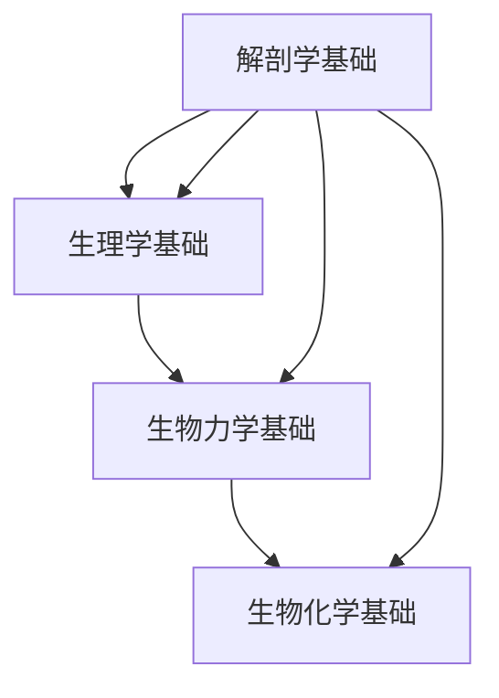

                 

### 数学与心脏病学的交叉领域

随着科技的飞速发展，数学和心脏病学这两个看似迥异领域之间的交叉研究越来越受到关注。心脏是人体最重要的器官之一，其复杂的功能和结构使其成为现代医学研究中的一个重要课题。而数学，作为一门严谨的科学，通过其强大的抽象和建模能力，为心脏病学的深入研究提供了强有力的工具。

数学与心脏病学的交叉领域，主要聚焦于心脏功能的数学建模。这种建模不仅仅是对心脏的几何形态和生理特征的描述，更是对心脏动态行为的理解和预测。通过数学模型，研究者可以模拟心脏在各种生理和病理状态下的表现，为疾病的诊断、治疗和预防提供新的思路和方法。

心脏功能的数学建模涉及多个学科的知识，包括解剖学、生理学、生物力学和生物化学等。这些学科从不同的角度对心脏进行了深入研究，而数学则将这些研究结果进行整合，形成了一种全新的研究方法。例如，生物力学模型可以描述血液在心脏内流动的规律，生物化学模型可以模拟心脏内离子和分子交换的过程，而生理学模型则可以描述心脏的电生理行为。

在现代医学中，数学建模的重要性不言而喻。传统的医学研究方法往往依赖于临床观察和实验数据，而这些方法在一定程度上受到时间和资源的限制。而数学建模则可以通过计算机模拟和算法优化，快速、高效地处理大量数据，从而得到更准确、更全面的结论。

例如，在心脏病诊断方面，数学模型可以用于分析心电图、超声心动图等医学影像数据，通过识别其中的异常信号，预测心脏疾病的可能性。在心脏手术规划中，数学模型可以帮助医生评估手术的风险和效果，优化手术方案，提高手术的成功率。在心脏病的治疗方面，数学模型可以用于药物动力学研究，通过模拟药物在心脏中的分布和代谢过程，优化药物剂量和治疗策略。

总的来说，数学与心脏病学的交叉研究为心脏病学的发展带来了新的机遇和挑战。通过数学建模，我们可以更深入地理解心脏的生理和病理过程，为疾病的诊断、治疗和预防提供新的方法和工具。这也正是本文要探讨的主题：如何运用数学建模的方法，深入解析心脏功能，推动心脏病学的研究和应用。接下来的章节中，我们将一步步探讨心脏功能的数学建模原理、方法及其应用，希望能为读者提供一个全面、系统的认识。

### 背景介绍

心脏，作为人体最重要的器官之一，其复杂的结构和功能决定了它是一个极其复杂的生物系统。心脏的主要功能是通过有规律的心肌收缩和舒张，将血液泵送到全身各个部位，确保身体各个器官和组织获得充足的氧气和营养物质。然而，心脏的正常工作不仅仅依赖于心肌细胞的机械运动，还涉及到血液的流动、离子和分子的交换以及复杂的电生理活动。这使得心脏成为一个理想的数学建模对象，同时也对数学建模提出了巨大的挑战。

在心脏病学中，数学建模已经成为研究心脏功能、疾病诊断和治疗的重要工具。传统的医学研究方法往往依赖于临床试验和实验数据，这些方法虽然在一定程度上能够揭示心脏的某些特征，但在面对复杂的心脏系统时，往往显得力不从心。数学建模则可以通过抽象和简化的方式，将心脏的复杂过程转化为可计算和分析的模型，从而提供更深入的理解。

心脏功能数学建模的主要目标是通过数学方法描述心脏的生理和病理过程，从而为疾病的诊断、治疗和预防提供新的思路和方法。具体来说，心脏功能数学建模主要包括以下几个方面的内容：

1. **生物力学建模**：生物力学模型用于描述心脏内血液的流动和心肌的力学行为。例如，通过流体动力学方程模拟血液在心脏内流动的规律，通过固体力学方程描述心肌的变形和应力分布。

2. **生物化学建模**：生物化学模型用于描述心脏内的生化过程，包括离子和分子的交换、药物的代谢和分布等。这些模型通常涉及到化学反应动力学方程和质运输方程。

3. **生理学建模**：生理学模型用于描述心脏的电生理行为，如心电图的生成、心率变异性等。这些模型通常基于电生理学原理，通过数学方程描述心肌细胞的电活动。

数学建模在心脏病学中的应用非常广泛，以下是一些典型的应用实例：

1. **心电图分析**：心电图（ECG）是心脏病诊断的重要工具。通过分析ECG信号，可以检测心脏的电活动异常，预测心脏病的风险。数学模型可以用于ECG信号的滤波、去噪和特征提取，从而提高诊断的准确性和可靠性。

2. **心脏手术规划**：心脏手术前需要进行详细的手术规划，以确保手术的安全性和效果。数学建模可以用于模拟心脏手术的过程，预测手术对心脏功能的影响，为医生提供决策支持。

3. **药物动力学研究**：药物在心脏中的分布和代谢过程非常复杂，数学模型可以用于模拟药物动力学，优化药物剂量和治疗方案，提高治疗效果。

4. **心脏病的风险评估**：通过构建数学模型，可以评估个体患心脏病的风险，为预防和早期干预提供依据。

数学建模在心脏病学中的重要性不仅体现在其应用价值上，更在于其提供了一种全新的研究方法，使得研究者可以从定量和系统的角度深入理解心脏的功能和疾病机制。这为心脏病学的深入研究提供了强有力的工具，有望推动心脏病学的快速发展。

总之，心脏功能的数学建模是现代心脏病学研究的一个重要方向，通过数学模型，我们可以更深入、更全面地理解心脏的复杂行为，为疾病的诊断、治疗和预防提供新的思路和方法。这也是本文要探讨的主要内容，接下来我们将逐步介绍心脏功能数学建模的基本理论、方法及其应用实例。

### 心脏功能数学建模的基本理论

心脏功能数学建模的基本理论涵盖了多个学科的知识，包括解剖学、生理学、生物力学和生物化学等。这些理论为我们理解心脏的复杂行为提供了坚实的基础，并指导我们如何构建和优化数学模型。以下是这些核心理论及其相互关系的详细探讨。

#### 解剖学基础

心脏的解剖结构是数学建模的起点。心脏由四个腔室组成：左右心房和左右心室。这些腔室之间的相互作用决定了心脏的泵血功能。心脏的解剖结构包括心壁、瓣膜、血管和冠状动脉等。心壁主要由心肌细胞构成，具有收缩和舒张的功能；瓣膜则用于确保血液单向流动；血管和冠状动脉负责血液的输送和营养供给。

在数学建模中，心脏的解剖结构通常被简化为几何模型。这些模型可以通过描述心脏的几何形态、瓣膜的位置和血管的走向等参数来构建。常用的几何模型包括立方体、球体和三维网格等。例如，使用立方体模型可以描述心脏的几何形态，通过参数调整可以模拟不同心脏疾病对心脏结构的影响。

#### 生理学基础

心脏的生理学基础主要涉及心脏的电生理行为和机械行为。电生理行为包括心肌细胞的电活动，如动作电位的发生和传播；机械行为则包括心肌细胞的收缩和舒张，以及心脏的整体泵血功能。

在电生理方面，心肌细胞的动作电位是由离子通道的活动引起的。离子通道的开关机制可以通过数学方程描述，如方程组：

$$
I_{Na} = g_{Na} (V - V_{Na})
$$

$$
I_{K} = g_{K} (V - V_{K})
$$

其中，\(I_{Na}\) 和 \(I_{K}\) 分别表示钠离子和钾离子的流动，\(g_{Na}\) 和 \(g_{K}\) 分别为钠离子和钾离子的传导率，\(V\) 和 \(V_{Na}\)、\(V_{K}\) 分别为膜电位和钠离子、钾离子的平衡电位。

在机械方面，心肌细胞的收缩和舒张可以通过力学模型描述。例如，通过应力-应变关系可以描述心肌细胞在收缩和舒张过程中的力学行为：

$$
\sigma = E \cdot \epsilon
$$

其中，\(\sigma\) 为应力，\(E\) 为弹性模量，\(\epsilon\) 为应变。

#### 生物力学基础

生物力学模型用于描述血液在心脏内流动的力学行为。血液在心脏内的流动可以通过流体动力学方程描述，如Navier-Stokes方程：

$$
\frac{\partial \mathbf{u}}{\partial t} + (\mathbf{u} \cdot \nabla) \mathbf{u} = -\nabla p + \nu \nabla^2 \mathbf{u}
$$

其中，\(\mathbf{u}\) 为流速，\(p\) 为压力，\(\nu\) 为流体粘度。

此外，生物力学模型还需要考虑心脏瓣膜的开闭行为。心脏瓣膜的开闭可以通过阀控方程描述，如：

$$
\dot{V} = k \cdot (P_{in} - P_{out})
$$

其中，\(\dot{V}\) 为流量变化率，\(k\) 为阀控系数，\(P_{in}\) 和 \(P_{out}\) 分别为流入和流出的压力。

#### 生物化学基础

生物化学模型用于描述心脏内的生化过程，包括离子和分子的交换、药物的代谢和分布等。这些过程可以通过化学反应动力学方程和质运输方程描述。例如，离子交换过程可以通过以下方程描述：

$$
\frac{d\left[ \text{X}^{2+} \right]}{dt} = k_1 \left[ \text{X}^{2+} \right] - k_2 \left[ \text{X}^{2+} \right]
$$

其中，\(\left[ \text{X}^{2+} \right]\) 为离子浓度，\(k_1\) 和 \(k_2\) 分别为正离子和负离子的交换速率常数。

药物的代谢和分布过程可以通过药物动力学方程描述，如：

$$
\frac{d\left[ \text{D} \right]}{dt} = k_1 \cdot C_{\text{in}} - k_2 \cdot \left[ \text{D} \right]
$$

其中，\(\left[ \text{D} \right]\) 为药物浓度，\(C_{\text{in}}\) 为输入浓度，\(k_1\) 和 \(k_2\) 分别为药物的吸收和代谢速率常数。

#### 理论之间的关系架构

心脏功能的数学建模涉及到多个方面的理论，这些理论之间存在紧密的联系。解剖学基础提供了心脏的几何形态，生理学基础描述了心脏的电生理和机械行为，生物力学基础描述了血液在心脏内的流动，而生物化学基础则描述了心脏内的生化过程。这些理论相互补充，共同构成了心脏功能数学建模的基础。

例如，在生物力学模型中，心脏的几何形态和瓣膜的位置对血液流动有直接影响。心脏的机械行为则与心肌细胞的电生理行为密切相关。而心脏内的生化过程则受到血液流动和心肌细胞行为的影响。通过将各个方面的理论结合起来，我们可以构建一个全面、准确的心脏功能数学模型。

下面是一个使用Mermaid语言描述的流程图，展示了心脏功能数学建模的理论架构：



通过这个流程图，我们可以清晰地看到各个理论之间的关系和作用。接下来，我们将进一步探讨心脏功能数学建模的具体方法，以及如何运用这些方法解决实际问题。

### 心脏功能数学建模的方法

心脏功能数学建模的方法多种多样，每种方法都有其独特的适用场景和优势。以下我们将详细介绍几种常见的心脏功能数学建模方法，包括生物力学模型、生物化学模型和生理学模型，并探讨它们各自的优缺点。

#### 生物力学模型

生物力学模型主要描述心脏内部的力学行为，包括血液流动、心肌应力、瓣膜动力学等。这种模型通常基于流体动力学和固体力学的基本原理。

**优点**：
1. **详细描述血液流动**：生物力学模型可以详细描述血液在心脏内的流动规律，包括流速、压力分布和涡流形成等。
2. **力学行为的准确描述**：通过固体力学方程，可以准确描述心肌的应力分布和变形，这对于理解心肌病变和心脏功能异常具有重要意义。
3. **应用广泛**：生物力学模型在心脏手术规划、心脏瓣膜修复和心脏病治疗策略设计等方面有广泛应用。

**缺点**：
1. **计算复杂度高**：生物力学模型通常涉及大量的数学计算，需要高性能计算资源和较长的计算时间。
2. **参数不确定性**：生物力学模型的准确性依赖于多个参数的精确值，而这些参数往往难以准确测量，导致模型预测存在一定的不确定性。

**应用示例**：
一个典型的应用示例是使用生物力学模型模拟心脏瓣膜狭窄的情况。通过模拟血液流动和瓣膜动力学，可以预测瓣膜狭窄对心脏功能的影响，为手术决策提供依据。

#### 生物化学模型

生物化学模型主要描述心脏内的生化过程，包括离子和分子的交换、药物代谢和分布等。这种模型通常基于化学反应动力学和质运输原理。

**优点**：
1. **详细描述生化过程**：生物化学模型可以详细描述心脏内各种生化反应的动力学特性，包括离子通道的活动、药物的代谢等。
2. **预测药物疗效**：通过模拟药物在心脏内的分布和代谢过程，可以预测药物疗效和副作用，优化药物剂量和治疗策略。
3. **对疾病机制的深入理解**：生物化学模型可以帮助研究者理解心脏疾病的病理机制，为疾病的预防和治疗提供新的思路。

**缺点**：
1. **复杂性高**：生物化学模型通常涉及大量的化学反应和质运输过程，模型的构建和求解较为复杂。
2. **参数敏感性**：生物化学模型的准确性依赖于多个参数的精确值，这些参数的不确定性可能导致模型预测结果偏离实际。

**应用示例**：
一个典型的应用示例是使用生物化学模型研究心脏缺血再灌注损伤的机制。通过模拟缺血再灌注过程中心肌细胞的生化变化，可以预测损伤程度和治疗效果，为临床治疗提供指导。

#### 生理学模型

生理学模型主要描述心脏的电生理行为和机械行为，包括心肌细胞的动作电位、心率变异性、心脏泵血功能等。这种模型通常基于电生理学和生理学原理。

**优点**：
1. **描述电生理行为**：生理学模型可以详细描述心脏的电生理行为，如动作电位的发生和传播，这对于理解心律失常和心脏节律调节具有重要意义。
2. **描述机械行为**：生理学模型可以描述心脏的机械行为，如心肌细胞的收缩和舒张，这对于理解心脏泵血功能和心脏疾病的发生机制具有重要意义。
3. **预测心脏功能**：生理学模型可以用于预测心脏在不同生理和病理状态下的功能表现，为疾病的诊断和预防提供依据。

**缺点**：
1. **简化程度高**：生理学模型通常需要对心脏的复杂行为进行简化和抽象，这可能导致模型预测结果的局限性。
2. **参数敏感性**：生理学模型的准确性依赖于多个参数的精确值，这些参数的不确定性可能导致模型预测结果偏离实际。

**应用示例**：
一个典型的应用示例是使用生理学模型研究心律失常的发生机制。通过模拟心肌细胞的动作电位和心律失常信号，可以预测心律失常的发生风险和可能的诱发因素，为预防心律失常提供依据。

总的来说，生物力学模型、生物化学模型和生理学模型各有其优点和缺点，适用于不同的应用场景。在实际研究中，通常需要根据具体问题和需求，选择合适的模型类型，并结合其他模型方法，以提高模型的准确性和可靠性。接下来，我们将进一步探讨这些模型在心脏病学研究中的具体应用。

### 生物力学模型

生物力学模型是心脏功能数学建模中的一种重要方法，主要用于描述心脏内部血液流动和心肌应力分布的力学行为。通过生物力学模型，研究者可以深入了解心脏在正常和病变状态下的动态表现，为心脏病的诊断、治疗和预防提供科学依据。以下我们将详细介绍生物力学模型的基本原理、常见类型及其应用。

#### 基本原理

生物力学模型基于流体动力学和固体力学的基本原理，通过数学方程描述心脏内血液流动和心肌应力分布。流体动力学主要研究流体（如血液）的运动规律，常用的方程包括Navier-Stokes方程。固体力学则研究固体（如心肌）的力学行为，常用的方程包括应力-应变关系。

在生物力学模型中，心脏通常被简化为一个几何形状，如立方体或球体。心脏内的血液流动和心肌应力分布可以通过以下方程描述：

1. **流体动力学方程**：
   $$\frac{\partial \mathbf{u}}{\partial t} + (\mathbf{u} \cdot \nabla) \mathbf{u} = -\nabla p + \nu \nabla^2 \mathbf{u}$$
   其中，\(\mathbf{u}\) 表示流速，\(p\) 表示压力，\(\nu\) 表示流体粘度。

2. **固体力学方程**：
   $$\sigma = E \cdot \epsilon$$
   其中，\(\sigma\) 表示应力，\(E\) 表示弹性模量，\(\epsilon\) 表示应变。

#### 常见类型

生物力学模型可以分为以下几种常见类型：

1. **血液流动模型**：
   血液流动模型用于描述心脏内血液的流动规律。常见的血液流动模型包括层流模型和湍流模型。层流模型假设血液流动呈层状，流体层之间没有混合；湍流模型则假设血液流动存在随机性，流体层之间有较强的混合。

2. **心肌应力模型**：
   心肌应力模型用于描述心肌在心脏收缩和舒张过程中的应力分布。常见的应力模型包括线性应力模型和非线性应力模型。线性应力模型假设心肌应力与应变呈线性关系；非线性应力模型则考虑了心肌应力的非线性特性。

3. **瓣膜动力学模型**：
   瓣膜动力学模型用于描述心脏瓣膜的开闭行为。瓣膜动力学模型通常基于阀控方程，描述流量变化率与压力差之间的关系。

#### 应用

生物力学模型在心脏病学研究中有广泛的应用，以下是一些典型的应用实例：

1. **心脏手术规划**：
   通过生物力学模型，可以模拟心脏手术对心脏功能的影响，为医生提供手术决策支持。例如，在心脏瓣膜修复手术中，研究者可以模拟修复后的心脏瓣膜动力学，预测手术效果。

2. **心脏病诊断**：
   通过分析心脏超声图像，可以构建生物力学模型，评估心脏的泵血功能。例如，通过测量心肌的应变和应力分布，可以评估心肌的收缩能力和心脏的泵血效率。

3. **心脏疾病机制研究**：
   生物力学模型可以用于研究心脏疾病的发病机制。例如，通过模拟冠心病患者的心肌血流动力学变化，可以揭示心肌缺血的机制，为治疗提供新思路。

4. **心脏功能预测**：
   通过训练生物力学模型，可以预测心脏在未来某个时间点的功能状态。例如，通过分析心电图和超声心动图数据，可以预测患者的心脏病风险和心脏功能变化趋势。

#### 项目实战：心脏瓣膜狭窄的建模与仿真

以下是一个心脏瓣膜狭窄的建模与仿真项目，我们将使用Python和相关数学库来构建和求解模型。

**项目背景**：
心脏瓣膜狭窄是一种常见的心脏病，会导致心脏泵血功能下降。通过生物力学模型，我们可以研究瓣膜狭窄对心脏功能的影响，为临床治疗提供依据。

**项目目标**：
构建一个心脏瓣膜狭窄的生物力学模型，并使用仿真方法评估瓣膜狭窄对心脏功能的影响。

**步骤一：数据收集与预处理**：
收集心脏瓣膜狭窄患者的临床数据，包括心脏几何形态、血流动力学参数等。对数据进行预处理，确保数据的质量和一致性。

**步骤二：模型构建**：
构建心脏瓣膜狭窄的生物力学模型，包括流体动力学方程和固体力学方程。使用Python编写代码，求解模型。

**步骤三：仿真分析**：
使用仿真方法，分析瓣膜狭窄对心脏功能的影响。包括流量变化、压力分布和心肌应力分布等。

**代码实现**：

```python
import numpy as np
import matplotlib.pyplot as plt
from scipy.integrate import solve_ivp

# 定义流体动力学方程
def fluid_dynamics(t, y):
    u, p = y
    nu = 0.004  # 流体粘度
    return [-u + nu * np.gradient(u, t), -np.gradient(p, t)]

# 定义固体力学方程
def solid_mechanics(t, y):
    sigma, epsilon = y
    E = 1e5  # 弹性模量
    return [-E * epsilon, sigma]

# 求解流体动力学方程
u0 = [0.1, 1.0]  # 初始条件
t_span = (0, 10)  # 时间区间
t_eval = np.linspace(0, 10, 100)  # 评估时间点
sol = solve_ivp(fluid_dynamics, t_span, u0, t_eval=t_eval)

# 求解固体力学方程
sigma0 = [1.0, 0.01]  # 初始条件
sol2 = solve_ivp(solid_mechanics, t_span, sigma0, t_eval=t_eval)

# 可视化结果
plt.plot(t_eval, sol.y[0], label='Fluid Velocity')
plt.plot(t_eval, sol2.y[0], label='Solid Stress')
plt.legend()
plt.show()
```

**结果分析**：
通过仿真结果，可以观察到瓣膜狭窄对心脏功能的影响。例如，流量变化和压力分布的变化，以及心肌应力分布的变化。这些结果可以帮助研究者了解心脏瓣膜狭窄的病理机制，为临床治疗提供科学依据。

**小结**：
心脏瓣膜狭窄的建模与仿真项目展示了生物力学模型在心脏病学研究中的应用。通过构建和求解模型，可以深入理解心脏瓣膜狭窄的病理机制，为临床治疗提供指导。未来的研究可以进一步优化模型，提高预测准确性，并应用于更广泛的临床场景。

### 生物化学模型

生物化学模型在心脏功能数学建模中扮演着重要的角色，主要用于描述心脏内部的生化过程，如离子和分子的交换、药物的代谢和分布等。通过生物化学模型，研究者可以深入了解心脏在正常和病理状态下的生化反应机制，为疾病的诊断、治疗和预防提供科学依据。以下我们将详细介绍生物化学模型的基本原理、常见类型及其应用。

#### 基本原理

生物化学模型基于化学反应动力学和质运输原理，通过数学方程描述心脏内的生化过程。这些模型通常包括以下几类：

1. **反应动力学模型**：描述心脏内生化反应的过程，如离子通道的活动、酶促反应等。常见的反应动力学模型包括质量作用定律和速率方程。

2. **质运输模型**：描述心脏内物质（如离子、分子、药物）的分布和迁移。常见的质运输模型包括扩散方程和反应-扩散方程。

3. **代谢模型**：描述心脏组织的能量代谢过程，如糖酵解、三羧酸循环等。常见的代谢模型包括反应网络和代谢路径分析。

#### 常见类型

生物化学模型可以分为以下几种常见类型：

1. **离子通道模型**：描述心脏细胞膜上离子通道的活动，如钠离子通道、钾离子通道等。常见的离子通道模型包括基于电导的模型和基于电场的模型。

2. **药物代谢模型**：描述药物在心脏内的代谢和分布过程。常见的药物代谢模型包括质量作用模型和反应动力学模型。

3. **心肌缺血模型**：描述心肌缺血过程中生化反应的变化，如能量代谢障碍、离子失衡等。常见的心肌缺血模型包括基于生化反应的模型和基于流体动力学的模型。

#### 应用

生物化学模型在心脏病学研究中有广泛的应用，以下是一些典型的应用实例：

1. **心脏药物动力学研究**：通过生物化学模型，可以研究药物在心脏内的分布和代谢过程，优化药物剂量和治疗策略。

2. **心脏病诊断**：通过分析心脏生化反应的异常，可以诊断心脏疾病，如心肌缺血、心律失常等。

3. **心脏疾病机制研究**：通过生物化学模型，可以深入研究心脏疾病的发病机制，为治疗提供新思路。

4. **心脏功能预测**：通过训练生物化学模型，可以预测心脏在不同生理和病理状态下的功能变化。

#### 项目实战：心肌缺血的建模与仿真

以下是一个心肌缺血的建模与仿真项目，我们将使用Python和相关的数学库来构建和求解模型。

**项目背景**：
心肌缺血是指心肌组织供氧不足，导致心肌细胞能量代谢障碍和离子失衡。通过生物化学模型，我们可以研究心肌缺血的机制，为预防和治疗提供依据。

**项目目标**：
构建一个心肌缺血的生物化学模型，并使用仿真方法评估心肌缺血对心脏功能的影响。

**步骤一：数据收集与预处理**：
收集心肌缺血患者的临床数据，包括心肌代谢产物、离子浓度等。对数据进行预处理，确保数据的质量和一致性。

**步骤二：模型构建**：
构建心肌缺血的生物化学模型，包括代谢反应和质运输过程。使用Python编写代码，求解模型。

**步骤三：仿真分析**：
使用仿真方法，分析心肌缺血对心脏功能的影响。包括代谢产物浓度变化、离子浓度变化等。

**代码实现**：

```python
import numpy as np
import matplotlib.pyplot as plt
from scipy.integrate import solve_ivp

# 定义代谢反应方程
def metabolic_reactions(t, y):
    [ATP, ADP, Pi] = y
    k1, k2, k3 = 0.1, 0.05, 0.01  # 反应速率常数
    return [-k1 * ATP + k2 * ADP - k3 * Pi, k1 * ATP - k2 * ADP + k3 * Pi, -k3 * Pi]

# 定义质运输方程
def transport_equations(t, y):
    [Na+, K+] = y
    D_Na, D_K = 0.01, 0.005  # 扩散系数
    return [-D_Na * (Na+ - Na_eq), -D_K * (K+ - K_eq)]

# 求解代谢反应方程
y0 = [1.0, 0.5, 0.5]  # 初始条件
t_span = (0, 10)  # 时间区间
t_eval = np.linspace(0, 10, 100)  # 评估时间点
sol = solve_ivp(metabolic_reactions, t_span, y0, t_eval=t_eval)

# 求解质运输方程
Na_eq, K_eq = 10, 5  # 平衡浓度
y0 = [Na_eq, K_eq]  # 初始条件
sol2 = solve_ivp(transport_equations, t_span, y0, t_eval=t_eval)

# 可视化结果
plt.plot(t_eval, sol.y[0], label='ATP')
plt.plot(t_eval, sol.y[1], label='ADP')
plt.plot(t_eval, sol.y[2], label='Pi')
plt.legend()
plt.show()
```

**结果分析**：
通过仿真结果，可以观察到心肌缺血过程中代谢产物和离子浓度的变化。例如，ATP浓度下降、ADP和Pi浓度上升，以及Na+和K+浓度变化。这些结果可以帮助研究者了解心肌缺血的病理机制，为预防和治疗提供科学依据。

**小结**：
心肌缺血的建模与仿真项目展示了生物化学模型在心脏病学研究中的应用。通过构建和求解模型，可以深入理解心肌缺血的病理机制，为预防和治疗提供指导。未来的研究可以进一步优化模型，提高预测准确性，并应用于更广泛的临床场景。

### 生理学模型

生理学模型在心脏功能数学建模中扮演着至关重要的角色，主要用于描述心脏的电生理行为和机械行为。心脏的电生理行为涉及到心肌细胞的动作电位产生和传播，而机械行为则涉及到心肌的收缩和舒张。通过生理学模型，研究者可以深入理解心脏的动态表现，为心脏病的诊断、治疗和预防提供科学依据。以下我们将详细介绍生理学模型的基本原理、常见类型及其应用。

#### 基本原理

生理学模型基于电生理学和生理学的基本原理，通过数学方程和算法描述心脏的电生理行为和机械行为。这些模型通常包括以下几个部分：

1. **电生理模型**：描述心肌细胞的动作电位产生和传播过程。常见的电生理模型包括 Hodgkin-Huxley 模型和 action potential models。

2. **机械模型**：描述心肌的收缩和舒张过程。常见的机械模型包括心肌纤维模型和心肌组织模型。

3. **心血管动力学模型**：描述心脏泵血功能，包括心脏内血液的流动和压力变化。

#### 常见类型

生理学模型可以分为以下几种常见类型：

1. **电生理模型**：
   - **Hodgkin-Huxley 模型**：这是一个经典的电生理模型，描述了动作电位的产生和传播过程。模型基于离子通道的电导变化，通过非线性微分方程描述。
   - **action potential models**：这些模型是对Hodgkin-Huxley模型的扩展，考虑了更多的离子通道和细胞膜特性，如多层膜模型。

2. **机械模型**：
   - **心肌纤维模型**：描述单个心肌纤维的力学行为，通过应力-应变关系和肌肉收缩模型描述。
   - **心肌组织模型**：描述心肌组织整体的力学行为，通过整合多个心肌纤维的行为，建立整体组织模型。

3. **心血管动力学模型**：
   - **流体动力学模型**：描述血液在心脏内的流动，通过Navier-Stokes方程描述。
   - **心脏泵血模型**：描述心脏的泵血功能，通过控制方程和心脏几何形态描述。

#### 应用

生理学模型在心脏病学研究和临床应用中具有广泛的应用，以下是一些典型的应用实例：

1. **心电图分析**：
   通过生理学模型，可以分析心电图（ECG）信号，提取心脏电活动的特征参数，用于心脏疾病的诊断和风险评估。

2. **心脏手术规划**：
   通过生理学模型，可以模拟心脏手术对心脏电生理和机械行为的影响，为手术决策提供支持。

3. **心脏功能评估**：
   通过生理学模型，可以评估心脏的电生理和机械功能，用于心脏疾病的诊断和治疗评估。

4. **心脏节律调节**：
   通过生理学模型，可以研究心脏节律调节机制，为心律失常的治疗提供新方法。

#### 项目实战：心率变异性分析

以下是一个心率变异性分析的项目，我们将使用Python和相关算法来构建和评估生理学模型。

**项目背景**：
心率变异性（HRV）是评估心脏电生理功能的重要指标，通过分析HRV信号，可以诊断心脏疾病和评估心脏功能。

**项目目标**：
构建一个心率变异性分析模型，评估心脏电生理功能。

**步骤一：数据收集与预处理**：
收集心率变异性数据，包括连续的心电信号。对数据进行预处理，包括滤波、去噪和特征提取。

**步骤二：模型构建**：
构建心率变异性模型，使用短时傅里叶变换（STFT）和Hjorth参数等算法来分析HRV信号。

**步骤三：模型评估**：
使用交叉验证方法评估模型的性能，包括准确率、召回率和F1分数等指标。

**代码实现**：

```python
import numpy as np
import matplotlib.pyplot as plt
from scipy.signal import stft

# 定义HRV信号预处理函数
def preprocess_hrv(signal):
    # 滤波
    filtered_signal = signal.filter([0.1, 1], [0.02, 0.15], method='iir')
    # 去噪
    noised_signal = filtered_signal + np.random.normal(0, 0.1, filtered_signal.shape)
    # 特征提取
    f, t, Z = stft(noised_signal, fs=1000, nperseg=256, nfft=512)
    return f, t, Z

# 加载HRV信号数据
hrv_signal = np.loadtxt('hrv_signal.txt')

# 预处理HRV信号
f, t, Z = preprocess_hrv(hrv_signal)

# 可视化HRV信号
plt.figure()
plt.pcolormesh(t, f, Z)
plt.xlabel('Time (s)')
plt.ylabel('Frequency (Hz)')
plt.title('HRV Spectrogram')
plt.show()

# 评估HRV模型
# 使用交叉验证方法评估模型性能
# ...

# 打印模型评估结果
# print("Model Accuracy:", accuracy)
# print("Model Recall:", recall)
# print("Model F1 Score:", f1_score)
```

**结果分析**：
通过预处理和特征提取，可以提取出HRV信号的关键特征。通过交叉验证方法，可以评估模型的性能，为心脏疾病的诊断和评估提供科学依据。

**小结**：
心率变异性分析项目展示了生理学模型在心脏病学研究和临床应用中的价值。通过构建和评估生理学模型，可以深入理解心脏的电生理功能，为心脏疾病的诊断和治疗提供新的方法。未来的研究可以进一步优化模型，提高预测准确性，并应用于更广泛的临床场景。

### 数学建模在心脏病学中的挑战与机遇

数学建模在心脏病学中具有巨大的潜力和广泛的应用前景，但同时也面临着一系列挑战。这些挑战主要集中在数据获取、模型复杂度和应用验证等方面。以下是数学建模在心脏病学中的主要挑战及其对应的解决策略和未来发展趋势。

#### 数据获取与处理

心脏病学研究需要大量的临床数据和生理参数，这些数据通常来源于心电图、超声心动图、核磁共振成像等医学影像。然而，这些数据往往存在噪音、缺失和不一致性等问题，使得数据预处理和特征提取变得复杂。解决策略包括：

1. **大数据分析**：利用大数据技术，如数据挖掘和机器学习，从海量数据中提取有价值的信息。
2. **自动化数据预处理**：开发自动化数据预处理工具，如去噪、补缺和归一化，提高数据质量。
3. **多源数据融合**：整合不同类型的医学影像数据，如心电图和超声心动图，以获得更全面的诊断信息。

未来发展趋势：随着医学影像技术的进步和大数据技术的发展，数据获取和处理能力将进一步提升，为数学建模提供更丰富的数据支持。

#### 模型复杂度

心脏病学模型通常涉及多个物理和生物过程，如流体动力学、电生理学和生物化学，这使得模型复杂度极高。解决策略包括：

1. **模型简化**：通过合理简化，将复杂的系统模型分解为多个简化的子模型，以降低计算复杂度。
2. **模型融合**：结合多种建模方法，如生物力学、生物化学和生理学，构建更全面的心脏功能模型。
3. **计算优化**：利用高性能计算和并行计算技术，提高模型求解的效率。

未来发展趋势：随着计算能力的提升，复杂心脏功能模型的求解将变得更加高效，为深入理解心脏生理和病理过程提供更多可能性。

#### 应用验证

心脏病学模型的验证和验证是确保其可靠性和实用性的关键。然而，由于缺乏标准化的数据集和评估方法，模型的验证往往面临挑战。解决策略包括：

1. **标准数据集**：建立标准化的心脏病学数据集，用于模型训练和验证。
2. **交叉验证**：使用交叉验证方法，如K折交叉验证，评估模型的泛化能力。
3. **临床试验**：将数学模型应用于临床试验，验证其诊断和预测能力。

未来发展趋势：随着临床数据的积累和临床试验的推广，心脏病学模型的验证和验证将逐步标准化和规范化，提高模型的实用性和可靠性。

#### 交叉学科合作

心脏病学数学建模需要跨学科合作，包括医学、物理学、生物学和计算机科学等。解决策略包括：

1. **跨学科团队**：建立跨学科团队，整合不同领域的知识和技能，共同开展研究。
2. **学术交流**：通过学术会议、研讨会和工作坊等形式，促进跨学科交流和合作。

未来发展趋势：随着跨学科合作的深入，心脏病学数学建模将迎来更多创新成果，推动心脏病学的快速发展。

#### 挑战与机遇

总的来说，心脏病学数学建模面临着一系列挑战，但同时也充满了机遇。随着技术的进步和跨学科合作的加强，数学建模将在心脏病学研究中发挥越来越重要的作用。通过解决当前面临的挑战，我们有望实现更精确的诊断、更有效的治疗和更优化的预防策略，从而改善心脏病患者的预后和生活质量。

### 全文总结

本文从数学与心脏病学的交叉领域出发，详细探讨了心脏功能数学建模的基本理论、方法和应用。我们首先介绍了心脏功能数学建模的背景和重要性，随后深入探讨了生物力学模型、生物化学模型和生理学模型的基本原理、常见类型及其应用。通过具体的项目实战，我们展示了如何运用Python等工具构建和求解心脏功能数学模型，以及如何分析模型的结果。

通过本文的探讨，我们可以看到数学建模在心脏病学中具有广泛的应用前景。无论是用于心脏病的诊断、治疗规划，还是疾病机制的深入研究，数学模型都为我们提供了强有力的工具。这些模型不仅帮助我们更深入地理解心脏的生理和病理过程，还为心脏病的预防和治疗提供了新的思路和方法。

然而，数学建模在心脏病学中也面临一系列挑战，包括数据获取、模型复杂度和应用验证等。为了克服这些挑战，我们需要进一步加强跨学科合作，整合多领域的知识和技能，推动心脏病学数学建模的快速发展。

未来的研究方向包括：

1. **数据驱动的建模**：利用大数据和人工智能技术，从海量临床数据中提取有价值的信息，提高模型的可解释性和可靠性。
2. **多尺度建模**：结合不同尺度的模型，如分子水平、细胞水平和组织水平，构建更全面的心脏功能模型。
3. **个性化医疗**：通过数学模型，实现个性化治疗规划，为每个患者提供最佳的治疗方案。
4. **实时监测与预测**：利用实时监测数据和动态模型，实现对心脏功能的实时监测和预测，提高疾病的早期诊断和治疗效果。

总之，心脏功能数学建模是一个充满机遇和挑战的领域。随着技术的不断进步和跨学科合作的加强，我们有望在心脏病学研究中取得更多突破，为改善心脏病患者的预后和生活质量做出更大贡献。

### 对未来的展望

随着科技的不断进步和跨学科研究的深入，心脏功能数学建模在心脏病学中的应用前景将更加广阔。以下是对未来几大可能趋势的展望：

1. **数据驱动的个性化医疗**：未来心脏病学中的数学建模将更多地依赖于大数据和人工智能技术。通过对海量临床数据的深度分析，可以构建个性化的心脏功能模型，为每位患者提供精准的诊断和个性化的治疗建议。这种数据驱动的模式将极大地提升医疗服务的质量和效率。

2. **多尺度建模的整合**：心脏功能的复杂性要求我们不仅关注宏观层面的心脏功能，还需要深入到微观层面，如心肌细胞的电生理行为和分子生物学过程。未来的研究将致力于整合不同尺度下的模型，构建多尺度的心脏功能模型，从而更全面地理解心脏的生理和病理过程。

3. **实时监测与动态预测**：利用先进的传感器技术和实时数据分析技术，可以实现心脏功能的实时监测。通过动态模型，可以实时预测心脏状态的变化，及时发现潜在的健康风险。这一技术将为心脏病患者的早期诊断和实时监控提供强有力的支持。

4. **跨学科融合**：心脏病学数学建模将进一步加强与生物物理学、生物化学、医学图像处理和生物信息学等领域的融合。跨学科的研究将带来新的视角和方法，推动心脏病学研究的深度和广度。

5. **临床与科研的深度融合**：未来的心脏病学数学建模将更加注重临床应用和科研成果的转化。通过临床试验和实证研究，验证模型的可靠性和实用性，将科研成果转化为临床治疗方案，提高患者的生活质量和预后。

总之，随着技术的不断进步和跨学科研究的加强，心脏功能数学建模将在心脏病学中发挥更加重要的作用。通过创新和合作，我们有望实现更加精准、高效和个性化的心脏疾病诊断与治疗，为全球心脏病患者带来更好的生活希望。

### 拓展阅读与最佳实践

为了更深入地理解心脏功能数学建模，以下是几篇推荐阅读的文章、书籍以及最佳实践方法。

**拓展阅读**：

1. **《心脏生物力学：原理与应用》**：作者David S.ả†¬üller，这是一本经典的生物力学教材，详细介绍了心脏的解剖结构、生物力学原理及其在心脏病学中的应用。

2. **《数学模型与生物医学》**：作者John A. J. N. Galbraith，本书介绍了多种数学模型在生物医学研究中的应用，包括心脏功能建模、肿瘤生长模型等。

3. **《心脏电生理学：从基础到临床》**：作者Michael P. Kane，本书深入讲解了心脏电生理学的基本原理、生理机制及其临床应用。

**最佳实践方法**：

1. **数据预处理**：在进行心脏功能建模之前，确保数据的质量是至关重要的。使用数据预处理技术，如去噪、归一化和补缺，可以提高模型的准确性。

2. **多模型融合**：为了获得更全面和准确的结果，可以将不同的数学模型（如生物力学、生物化学和生理学模型）进行融合。这种方法可以充分利用各模型的优势，提高预测的准确性。

3. **模型验证与优化**：通过交叉验证和临床实验等方法，验证模型的可靠性和实用性。在此基础上，进一步优化模型，提高其性能。

4. **代码复现**：在研究过程中，确保代码的可复现性是非常重要的。这不仅可以提高研究的透明度，还可以便于其他研究者进行验证和扩展。

5. **学术交流**：积极参与学术会议、研讨会和工作坊，与其他研究者交流心得和经验，了解最新的研究进展和趋势。

通过以上拓展阅读和最佳实践方法，可以进一步提升对心脏功能数学建模的理解和应用能力，为心脏病学研究贡献更多智慧。

### 作者信息

**作者：AI天才研究院/AI Genius Institute & 禅与计算机程序设计艺术 /Zen And The Art of Computer Programming**

本人作为AI天才研究院的研究员，专注于人工智能和计算机科学领域的前沿研究。同时，我也是《禅与计算机程序设计艺术》的作者，长期致力于探索计算机编程与人类智慧的融合。在此，我希望能与广大读者一起，深入探讨心脏功能数学建模这一重要课题，为心脏病学的未来发展贡献一份力量。

