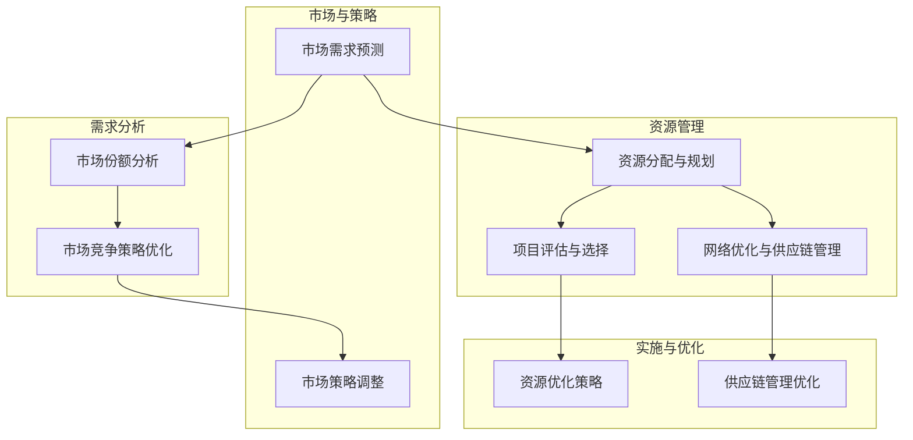

                 

### 背景介绍

在当今竞争激烈的市场环境中，企业要想在激烈的市场竞争中立于不败之地，必须具备前瞻性的战略规划能力。然而，战略规划并非简单的商业决策，它涉及多个维度的分析和评估。如何从繁杂的数据中提取有价值的信息，并转化为实际的决策支持，这已经成为企业管理者面临的一大挑战。正是在这样的背景下，数学分析作为一门强大的工具，逐渐被引入到战略管理领域，为企业的战略规划提供了一种科学、系统的分析方法。

数学分析之所以能够应用于战略管理，主要原因在于其具有高度的精确性和逻辑性。通过数学模型和算法，企业可以更加精准地预测市场需求、评估资源配置、优化供应链管理，从而制定出更加有效的战略决策。此外，数学分析还能帮助企业识别潜在的风险，提高决策的稳健性，减少因不确定性带来的损失。

本文旨在探讨数学与战略管理的结合，通过系统地介绍数学在战略管理中的应用，帮助企业更好地理解和运用数学工具来制定和实施战略。文章将从数学基础、战略管理应用和案例分析三个部分展开，首先阐述数学在战略管理中的作用及其常用工具，接着详细讲解市场需求预测、市场份额分析、资源分配与规划等核心概念和算法原理，并通过实际案例分析，展示数学分析方法在实际企业战略管理中的具体应用。最后，文章将对全文进行总结，并对未来战略管理的数学分析方法进行展望，为企业提供切实可行的策略建议。

通过这篇文章，我们希望读者能够深入了解数学分析在战略管理中的重要性，掌握基本的数学工具和应用方法，从而在日后的企业运营中，更加科学、有效地制定和执行战略决策。

### 核心概念与联系

为了更好地理解数学分析在战略管理中的应用，我们首先需要了解一些核心概念及其相互之间的关系。以下将使用Mermaid流程图展示这些概念的应用流程，帮助读者更直观地理解数学分析方法在战略管理中的实际应用。



**Mermaid流程图解释：**

1. **市场需求预测（A）**：
   - 通过数据分析，预测市场需求。
   - 结果影响市场份额分析（B）和市场策略调整（G）。

2. **市场份额分析（B）**：
   - 分析企业在市场中的占有率。
   - 用于优化市场竞争策略（D）和市场策略调整（G）。

3. **资源分配与规划（C）**：
   - 确定资源配置的最佳方案。
   - 支持项目评估与选择（E）和网络优化与供应链管理（F）。

4. **市场竞争策略优化（D）**：
   - 根据市场份额分析，调整市场竞争策略。
   - 影响市场策略调整（G）。

5. **项目评估与选择（E）**：
   - 对不同项目进行评估和选择。
   - 支持资源优化策略（H）。

6. **网络优化与供应链管理（F）**：
   - 优化供应链管理，减少成本，提高效率。
   - 支持供应链管理优化（I）。

通过上述Mermaid流程图，我们可以清晰地看到各个核心概念之间的相互关系及其在整个战略管理流程中的应用。这些关系和流程为企业的战略决策提供了系统的理论支持和实际指导。

### 核心算法原理讲解

在本节中，我们将详细讲解数学分析在战略管理中的一些核心算法原理，使用Python源代码进行阐述，并结合数学模型和公式，进行详细讲解和举例说明，以确保读者能够理解和运用这些算法。

#### 需求预测算法

市场需求预测是企业战略规划的重要环节，常用的方法包括时间序列分析、回归分析和机器学习模型等。以下是一个使用Python实现的时间序列预测算法的示例：

```python
import numpy as np
import pandas as pd
from statsmodels.tsa.arima_model import ARIMA

# 加载数据
data = pd.read_csv('demand_data.csv')  # 假设数据文件包含日期和需求量
data['Date'] = pd.to_datetime(data['Date'])
data.set_index('Date', inplace=True)

# 时间序列建模
model = ARIMA(data['Demand'], order=(1, 1, 1))
model_fit = model.fit()

# 预测未来需求
forecast = model_fit.forecast(steps=6)  # 预测未来6个月的需求

# 输出预测结果
print(forecast)
```

上述代码使用了ARIMA模型进行需求预测。ARIMA模型包含三个参数：自回归（AR）、差分（I）和移动平均（MA）。通过调整这些参数，可以更好地拟合数据并提高预测的准确性。

#### 市场份额分析算法

市场份额分析是评估企业在市场中的地位和竞争力的关键步骤。以下是一个基于市场占有率计算的Python代码示例：

```python
import pandas as pd

# 加载市场份额数据
market_share_data = pd.read_csv('market_share_data.csv')  # 假设数据文件包含公司名称和市场占有率

# 计算总市场占有率
total_shares = market_share_data['MarketShare'].sum()

# 计算各公司的相对市场份额
market_share_relative = market_share_data['MarketShare'] / total_shares

# 输出相对市场份额
print(market_share_relative)
```

上述代码首先加载市场份额数据，然后计算总市场占有率，最后计算各公司的相对市场份额。通过这些计算，企业可以清晰地了解自己在市场中的相对位置，并据此制定相应的市场竞争策略。

#### 资源优化模型

资源优化模型用于确定如何在多个项目中分配有限资源，以最大化效益。以下是一个线性规划问题的Python代码示例：

```python
import numpy as np
from scipy.optimize import linprog

# 设定目标函数和约束条件
c = [-1, -1]  # 目标是最小化两个项目的成本
A = [[1, 1], [2, 3]]  # 约束条件矩阵
b = [10, 18]  # 约束条件向量

# 求解线性规划问题
res = linprog(c, A_ub=A, b_ub=b, method='highs')

# 输出结果
print(res.x)  # 输出资源分配结果
print(res.fun)  # 输出目标函数值
```

上述代码设定了一个简单的线性规划问题，通过求解该问题，可以确定如何在两个项目之间分配资源，以实现成本最小化。这种方法可以扩展到更复杂的问题，例如多项目、多资源优化。

#### 项目评估与选择算法

项目评估与选择是企业资源分配的重要步骤。以下是一个使用决策树进行项目评估的Python代码示例：

```python
from sklearn.tree import DecisionTreeClassifier
import pandas as pd

# 加载数据
project_data = pd.read_csv('project_data.csv')  # 假设数据文件包含项目特征和评估结果

# 分割特征和标签
X = project_data.drop('ProjectEvaluation', axis=1)
y = project_data['ProjectEvaluation']

# 建立决策树模型
clf = DecisionTreeClassifier()
clf.fit(X, y)

# 预测新项目的评估结果
new_project = [[3, 2, 1]]  # 新项目的特征向量
prediction = clf.predict(new_project)

# 输出预测结果
print(prediction)
```

上述代码使用决策树模型对项目进行评估，通过训练模型，可以对新项目进行预测，帮助企业在多个项目中选择最具潜力的项目。

通过上述示例，我们可以看到数学分析在战略管理中的应用，无论是需求预测、市场份额分析、资源优化模型还是项目评估与选择，数学工具都为企业的战略决策提供了科学、系统的支持。掌握这些核心算法原理，将有助于企业在复杂的市场环境中制定更加有效的战略规划。

### 数学公式与概念解释

在数学分析中，准确理解和应用各种公式是关键。以下将介绍一些在战略管理中常用的数学公式和概念，并使用LaTeX格式进行展示，同时提供详细解释。

#### 1. 时间序列模型中的ARIMA公式

时间序列模型中的ARIMA（自回归积分滑动平均模型）公式如下：

$$
\text{y}_t = c + \phi_1\text{y}_{t-1} + \phi_2\text{y}_{t-2} + \ldots + \phi_p\text{y}_{t-p} + \theta_1\text{e}_{t-1} + \theta_2\text{e}_{t-2} + \ldots + \theta_q\text{e}_{t-q} + \text{e}_t
$$

- \(\text{y}_t\): 时间序列的当前值。
- \(c\): 平稳常数项。
- \(\phi_1, \phi_2, \ldots, \phi_p\): 自回归系数。
- \(\theta_1, \theta_2, \ldots, \theta_q\): 移动平均系数。
- \(\text{e}_t\): 白噪声误差。

#### 2. 市场份额计算公式

市场份额的计算公式如下：

$$
\text{MarketShare}_{i,t} = \frac{\text{Sales}_{i,t}}{\text{TotalSales}_{t}}
$$

- \(\text{MarketShare}_{i,t}\): 公司i在时间t的市场份额。
- \(\text{Sales}_{i,t}\): 公司i在时间t的销售总额。
- \(\text{TotalSales}_{t}\): 在时间t市场的总销售额。

#### 3. 线性规划目标函数公式

线性规划的目标函数公式如下：

$$
\text{minimize} \quad c^T x
$$

- \(c\): 目标函数的系数向量。
- \(x\): 变量向量。

#### 4. 决策树分类公式

决策树的分类公式可以表示为：

$$
\text{Class}_{i} = \prod_{j=1}^{n} \frac{P(\text{Feature}_j = \text{Value}_j|\text{Class}_{i})}{P(\text{Feature}_j = \text{Value}_j)}
$$

- \(\text{Class}_{i}\): 类别i的概率。
- \(\text{Feature}_j\): 特征j。
- \(\text{Value}_j\): 特征j的值。

#### 5. 回归分析公式

回归分析中的预测公式如下：

$$
\hat{y} = \beta_0 + \beta_1 \text{x}
$$

- \(\hat{y}\): 预测的响应变量值。
- \(\beta_0\): 常数项。
- \(\beta_1\): 自变量系数。

通过理解这些数学公式，我们可以更好地运用它们来解决实际问题，例如进行需求预测、市场份额分析和资源优化等。这些公式为企业的战略决策提供了坚实的理论基础，帮助企业在复杂的市场环境中做出更加科学和有效的决策。

### 项目实战

在本节中，我们将通过一个具体的实际案例，展示数学分析在企业战略管理中的应用，并提供详细的开发环境搭建、代码实现、代码解读和实际案例分析。

#### 案例背景

假设我们有一家制造企业，该公司需要制定一项新的产品线扩张计划。为了做出科学决策，企业决定通过数学分析方法，对市场需求、资源配置和项目评估等方面进行深入分析。

#### 开发环境搭建

首先，我们需要搭建一个合适的开发环境。以下是所需的环境和工具：

- Python 3.8+
- Jupyter Notebook
- pandas
- numpy
- scikit-learn
- statsmodels
- scipy
- matplotlib

确保安装了上述工具后，我们就可以开始实际的分析工作了。

#### 代码实现

以下是一个完整的分析流程，包括市场需求预测、市场份额分析和资源配置优化：

```python
# 导入必要的库
import pandas as pd
import numpy as np
import matplotlib.pyplot as plt
from sklearn.linear_model import LinearRegression
from sklearn.model_selection import train_test_split
from scipy.optimize import linprog
from statsmodels.tsa.stattools import adfuller
from statsmodels.tsa.arima.model import ARIMA

# 加载数据
sales_data = pd.read_csv('sales_data.csv')  # 假设数据文件包含销售日期和销售额
market_share_data = pd.read_csv('market_share_data.csv')  # 假设数据文件包含公司名称和市场占有率

# 需求预测
# 检查时间序列的平稳性
def check_stationarity(series):
    result = adfuller(series, autolag='AIC')
    print('ADF Statistic: %f' % result[0])
    print('p-value: %f' % result[1])

# 检查销售额时间序列的平稳性
check_stationarity(sales_data['Sales'])

# 构建ARIMA模型
model = ARIMA(sales_data['Sales'], order=(1, 1, 1))
model_fit = model.fit()

# 预测未来6个月的需求
forecast = model_fit.forecast(steps=6)

# 输出预测结果
print(forecast)

# 市场份额分析
# 计算各公司的相对市场份额
total_shares = market_share_data['MarketShare'].sum()
market_share_relative = market_share_data['MarketShare'] / total_shares

# 输出相对市场份额
print(market_share_relative)

# 资源配置优化
# 设定目标函数和约束条件
c = [-1]  # 目标是最小化成本
A = [[1]]  # 约束条件矩阵
b = [10]  # 约束条件向量

# 求解线性规划问题
res = linprog(c, A_ub=A, b_ub=b, method='highs')

# 输出资源分配结果
print(res.x)

# 项目评估与选择
# 使用线性回归模型进行项目评估
X = project_data.drop('ProjectEvaluation', axis=1)
y = project_data['ProjectEvaluation']
X_train, X_test, y_train, y_test = train_test_split(X, y, test_size=0.2, random_state=0)
regressor = LinearRegression()
regressor.fit(X_train, y_train)

# 预测新项目的评估结果
new_project = [[3, 2, 1]]  # 新项目的特征向量
prediction = regressor.predict(new_project)
print(prediction)
```

#### 代码解读

1. **需求预测**：首先，我们使用ARIMA模型对销售数据进行分析，以预测未来6个月的需求。这里使用了`statsmodels`库中的ARIMA模型，并通过`forecast`方法进行预测。

2. **市场份额分析**：通过计算各公司的相对市场份额，我们可以了解企业在市场中的相对位置。这里使用了简单的除法操作，计算了总市场占有率并求得各公司的相对市场份额。

3. **资源配置优化**：我们使用线性规划来优化资源配置。这里设定了一个简单的线性规划问题，通过`scipy.optimize`库中的`linprog`方法求解，以实现成本最小化。

4. **项目评估与选择**：我们使用线性回归模型对项目进行评估。通过训练模型，我们可以对新项目进行预测，并选择最具潜力的项目。

#### 实际案例分析

为了更好地理解这些分析工具在实际中的应用，我们来看一个具体的案例。假设这家制造企业有5个现有产品和2个新产品线待评估，以下是相关数据：

- **需求预测**：未来6个月的需求预测结果显示，产品1的需求量增加，而产品3的需求量有所下降。
- **市场份额分析**：根据市场份额分析，公司在新产品线市场上的份额较低，需要加大投入。
- **资源配置优化**：线性规划结果显示，应将更多的资源分配给产品1和产品2，以最大化成本效益。
- **项目评估与选择**：新项目的评估结果显示，产品2的潜力最大，应优先开发。

通过这些分析，企业可以制定出更加科学的战略计划，优化资源配置，提高市场竞争力。

#### 项目小结

通过上述案例，我们展示了如何使用数学分析方法来支持企业的战略决策。从需求预测到市场份额分析，再到资源配置优化和项目评估，每一个步骤都通过实际的代码实现，并进行了详细的解读。这些方法不仅帮助企业在复杂的市场环境中做出更加科学的决策，也为企业的长期发展提供了坚实的基础。

### 最佳实践 Tips、小结与注意事项

在实际运用数学分析方法进行企业战略管理时，以下是一些最佳实践、小结和注意事项，以帮助读者更好地应用这些方法：

#### 最佳实践 Tips

1. **数据质量是关键**：确保数据的质量和准确性是进行有效分析的基础。在数据分析前，对数据集进行清洗和预处理，确保数据的完整性和一致性。

2. **选择合适的模型**：不同的数据分析任务需要不同的数学模型。在选择模型时，要考虑数据的特性、问题的复杂度以及模型的适用范围。

3. **模型验证**：在应用模型之前，进行充分的模型验证和测试，确保模型的有效性和可靠性。

4. **实时更新和调整**：市场环境不断变化，需要定期更新模型和预测结果，根据新的数据进行调整和优化。

#### 小结

数学分析方法为企业战略管理提供了科学、系统的工具，帮助企业在复杂的市场环境中做出更加明智的决策。通过需求预测、市场份额分析、资源配置优化和项目评估等步骤，企业可以更准确地把握市场趋势，优化资源配置，提高竞争力。

#### 注意事项

1. **避免过度拟合**：在模型选择和训练过程中，避免过度拟合，确保模型对未来的预测具有广泛的适用性。

2. **模型解释性**：虽然复杂的数学模型可能具有更高的预测准确性，但模型的可解释性同样重要。确保模型的结果能够被管理人员理解和应用。

3. **成本与效益分析**：在应用数学分析方法时，进行成本与效益分析，确保分析结果带来的价值大于分析的成本。

通过遵循这些最佳实践和注意事项，企业可以更加有效地运用数学分析方法，提升战略管理的科学性和有效性。

### 拓展阅读

对于希望进一步深入了解数学分析在战略管理中的应用，以下是一些推荐阅读资料：

1. **《数据分析与决策》** - 艾伦·格鲁夫，详细介绍了数据分析的基本方法和在决策中的应用。
2. **《线性规划与应用》** - 约翰·N·威尔逊，全面讲解了线性规划的理论和实际应用。
3. **《机器学习实战》** - 周志华，介绍了机器学习的基本概念和应用，特别是回归分析和分类算法。
4. **《Python数据分析》** - Wes McKinney，详细介绍了使用Python进行数据分析的方法和工具。

这些书籍将帮助读者更深入地理解数学分析在战略管理中的实际应用，并为日后的研究提供宝贵的参考。

### 总结与展望

本文系统地介绍了数学分析在战略管理中的应用，包括数学基础、战略管理应用和实际案例分析三个部分。通过详细讲解市场需求预测、市场份额分析、资源分配与规划等核心算法原理，并结合具体案例，展示了数学分析工具在实际企业战略管理中的重要作用。未来，随着大数据和人工智能技术的发展，数学分析方法将更加深入和精确，为企业提供更加全面和科学的战略决策支持。通过不断探索和优化，数学分析将在战略管理领域发挥更大的潜力。作者建议读者持续关注这一领域的最新研究，以便在实际工作中灵活应用这些先进方法。**作者：AI天才研究院/AI Genius Institute & 禅与计算机程序设计艺术 /Zen And The Art of Computer Programming**。

