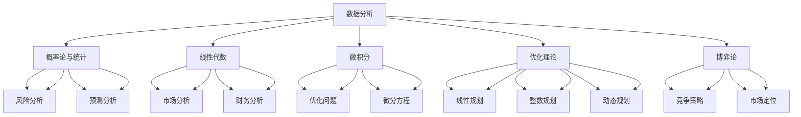

                 

# 数学与战略管理：企业战略的数学分析

## 关键词

数学模型、战略管理、决策分析、优化技术、博弈论、经济理论、企业战略

## 摘要

在当今复杂多变的商业环境中，企业战略的制定和实施需要精准的数据分析和科学的决策支持。数学作为一门基础科学，其在战略管理中的应用越来越广泛。本文将探讨数学在战略管理中的关键作用，通过介绍数学模型、定量方法、博弈论和经济理论等核心概念，阐述其在企业战略制定中的具体应用。文章还将结合实际案例，详细分析数学工具在企业战略决策中的实践价值，以期为企业的战略规划提供有力的理论支持和方法指导。

## 目录

1. **引言**
2. **数学在战略管理中的基础概念**
   - **1.1 数学在商业分析中的作用**
   - **1.2 核心数学概念与联系**
3. **数学模型在战略管理中的应用**
   - **2.1 战略模型概述**
   - **2.2 优化模型与决策分析**
   - **2.3 动态规划和模拟**
4. **定量方法在决策支持中的应用**
   - **3.1 线性规划和整数规划**
   - **3.2 动态规划与蒙特卡洛模拟**
5. **博弈论与竞争分析**
   - **4.1 博弈论基础**
   - **4.2 竞争策略分析**
6. **经济理论在战略分析中的应用**
   - **5.1 市场结构与竞争**
   - **5.2 产业分析与企业定位**
7. **数学在战略管理中的实践应用**
   - **6.1 开发环境搭建**
   - **6.2 源代码实现与解读**
   - **6.3 实际案例分析**
8. **结论与未来方向**
   - **7.1 数学方法在战略管理中的重要性**
   - **7.2 面临的挑战与机遇**
   - **7.3 拓展阅读与建议**

### 1. 引言

在当今的商业环境中，企业面临的竞争越来越激烈，市场环境的变化速度也在不断加快。为了在这样的环境中保持竞争力，企业必须能够快速准确地做出战略决策，并有效地实施这些决策。然而，战略决策的制定并非易事，它涉及多种因素的复杂交互，包括内部资源的配置、外部环境的变化、市场趋势的预测等。因此，企业需要一种科学的方法来指导其战略制定过程，而数学，作为一种严谨的分析工具，提供了这样的方法。

数学在战略管理中的作用主要体现在以下几个方面：

- **模型构建**：数学模型可以帮助企业将复杂的问题转化为简明的数学形式，使得决策过程更加清晰和系统化。
- **数据分析**：通过数学方法，企业可以对大量的数据进行分析，从而获取有用的信息，为决策提供依据。
- **优化决策**：数学优化技术可以帮助企业在资源有限的情况下做出最优的决策，提高企业的效率和效益。
- **预测与规划**：数学工具可以用于市场趋势的预测和长期规划的制定，帮助企业在未来环境中占据有利位置。

本文将围绕数学在战略管理中的应用展开讨论。首先，我们将介绍数学在商业分析中的基础概念，包括核心数学概念及其相互联系。接下来，我们将探讨数学模型在战略管理中的应用，介绍优化模型、决策分析以及动态规划和模拟等方法。随后，我们将深入探讨定量方法在决策支持中的作用，包括线性规划和蒙特卡洛模拟等。此外，文章还将介绍博弈论与竞争分析在企业战略中的重要性。最后，我们将通过实际案例展示数学方法在战略管理中的实践应用，并总结数学方法在战略管理中的价值和面临的挑战。

通过本文的探讨，我们希望读者能够对数学在战略管理中的应用有更加深入的理解，并能够将这些方法应用到实际的企业战略决策中，以提升企业的竞争力。

### 2. 数学在战略管理中的基础概念

在战略管理中，数学的应用始于对其基础概念的深刻理解。数学不仅是一种工具，更是一种思维方式，它能够帮助我们从量化的角度理解和分析复杂的问题。以下是战略管理中常用的几个核心数学概念，以及它们之间的相互联系。

#### 2.1 数学在商业分析中的作用

数学在商业分析中扮演着至关重要的角色。它不仅能够帮助企业家和经理人员理解数据，还能够通过精确的模型预测未来趋势，优化决策过程。以下是数学在商业分析中的几个重要作用：

1. **数据分析**：通过统计分析和概率论，企业可以对市场数据、财务数据和其他关键指标进行分析，从而获得有价值的信息。
2. **预测**：使用时间序列分析和回归分析等方法，企业可以预测市场需求、销售额和其他关键指标，为战略规划提供依据。
3. **优化**：优化技术可以帮助企业在资源有限的情况下做出最优的决策，提高生产效率、降低成本、提升收益。

#### 2.2 核心数学概念与联系

在战略管理中，以下几个核心数学概念是不可或缺的：

1. **概率论与统计**：概率论是研究随机现象的数学分支，它提供了对不确定性的理解和处理方法。统计则是通过样本数据推断总体特征的工具。两者在企业决策中用于风险评估、预测和决策分析。

2. **线性代数**：线性代数用于处理多维数据和多变量问题。它在优化、市场分析、财务分析等领域有广泛应用。

3. **微积分**：微积分是研究变化和积累的数学工具，用于优化问题、微分方程的建模和解决。

4. **优化理论**：优化理论是用于求解最优化问题的数学分支。线性规划、整数规划、动态规划等方法都是优化理论的应用。

5. **博弈论**：博弈论研究决策者在不同策略下的相互作用。在企业竞争中，博弈论用于分析市场策略和竞争行为。

这些核心数学概念之间存在密切的联系：

- **概率论与统计**：概率论为统计提供理论基础，而统计则应用概率论的方法进行分析。
- **线性代数与微积分**：线性代数提供了解决多变量问题的工具，微积分则用于研究变化率和极限问题。
- **优化理论与博弈论**：优化理论用于求解博弈论中的最优策略。

#### 2.3 数学框架在商业分析中的结构图

为了更清晰地展示数学概念在商业分析中的应用，我们可以使用Mermaid流程图来表示它们之间的相互关系：



#### 2.4 应用实例

为了更具体地展示数学概念在战略管理中的应用，我们可以举一个实际案例：

**案例：产品定价策略**

假设一家公司正在决定其产品的定价策略。公司可以使用线性回归模型来分析市场需求与价格之间的关系。通过收集历史数据，公司可以建立一个线性回归方程来预测在不同价格水平下的销售额。接下来，公司可以使用优化技术（如线性规划）来确定最优的价格点，使得利润最大化。

- **数据收集**：收集过去一段时间内产品的价格和销售额数据。
- **模型构建**：使用线性回归模型建立价格与销售额之间的关系。
- $$ y = \beta_0 + \beta_1 \cdot x + \epsilon $$
  - 其中，\( y \) 是销售额，\( x \) 是价格，\( \beta_0 \) 和 \( \beta_1 \) 是模型的参数，\( \epsilon \) 是误差项。
- **优化决策**：使用线性规划技术来确定最优价格，使得总利润最大化。

通过上述步骤，公司可以基于数学模型做出科学的定价决策，从而在竞争激烈的市场中占据有利位置。

综上所述，数学在战略管理中具有基础性的作用。通过理解核心数学概念及其相互联系，企业可以更加有效地运用数学工具进行战略分析和决策，从而提升其在市场中的竞争力。

### 3. 数学模型在战略管理中的应用

数学模型在战略管理中扮演着至关重要的角色，它们不仅帮助企业理解复杂的现象，还提供了一种系统化的方法来制定和实施战略。以下将详细探讨数学模型在战略管理中的应用，包括优化模型、决策分析以及动态规划和模拟。

#### 3.1 战略模型概述

战略模型是用于描述和分析企业战略的数学工具。它们通常包括以下几种类型：

1. **优化模型**：用于确定在给定约束条件下如何实现最大化或最小化目标。例如，线性规划和整数规划是常见的优化模型。
2. **决策分析模型**：用于帮助企业在不确定性条件下做出最佳决策。决策树和蒙特卡洛模拟是常用的决策分析工具。
3. **动态规划模型**：用于分析随时间变化的问题，通过分阶段决策来实现整体最优。动态规划在长期规划和资源管理中应用广泛。
4. **模拟模型**：通过模拟现实中的复杂系统，帮助企业理解不同策略的结果。蒙特卡洛模拟和系统动力学是常见的模拟方法。

这些模型各有特点，但它们共同的目标是帮助企业在复杂的商业环境中做出最优决策。

#### 3.2 优化模型与决策分析

**3.2.1 优化模型**

优化模型在战略管理中的应用非常广泛。线性规划和整数规划是最常用的优化方法。

1. **线性规划**

线性规划是一种用于求解线性目标函数在给定约束条件下最优解的数学方法。它的主要组成部分包括：

- **目标函数**：描述需要最大化或最小化的目标，如利润、成本或市场份额。
- **约束条件**：限制决策变量的取值范围，如资源限制、生产能力或市场需求。

以下是一个简单的线性规划问题的Python代码实现：

```python
# 导入线性规划库
from scipy.optimize import linprog

# 目标函数系数
c = [-1, -2]  # 目标是最小化成本

# 约束条件系数矩阵
A = [[1, 0], [0, 1], [1, 1]]  # 约束条件矩阵

# 约束条件右侧值
b = [5, 7, 10]  # 约束条件右侧值

# 不等式约束
A_eq = [[1, 1], [0, 2]]  # 等式约束矩阵
b_eq = [3, 4]  # 等式约束右侧值

# 求解线性规划问题
result = linprog(c, A_ub=A, b_ub=b, A_eq=A_eq, b_eq=b_eq)

# 输出结果
print(result.x)  # 输出决策变量的最优值
print(result.fun)  # 输出目标函数的最优值
```

2. **整数规划**

整数规划是线性规划的扩展，它要求决策变量必须是整数。这类问题在资源分配和排班问题中应用广泛。以下是一个简单的整数规划问题的Python代码实现：

```python
# 导入整数规划库
from scipy.optimize import linprog

# 目标函数系数
c = [-1, -2]  # 目标是最小化成本

# 约束条件系数矩阵
A = [[1, 0], [0, 1], [1, 1]]  # 约束条件矩阵

# 约束条件右侧值
b = [5, 7, 10]  # 约束条件右侧值

# 不等式约束
A_ub = [[1, 1], [0, 2]]  # 不等式约束矩阵
b_ub = [3, 4]  # 不等式约束右侧值

# 等式约束
A_eq = [[1, 1], [0, 2]]  # 等式约束矩阵
b_eq = [3, 4]  # 等式约束右侧值

# 设置整数约束
x0_bounds = (0, None)  # 第一个变量非负整数
x1_bounds = (0, None)  # 第二个变量非负整数

# 求解整数规划问题
result = linprog(c, A_ub=A_ub, b_ub=b_ub, A_eq=A_eq, b_eq=b_eq, bounds=[x0_bounds, x1_bounds])

# 输出结果
print(result.x)  # 输出决策变量的最优值
print(result.fun)  # 输出目标函数的最优值
```

**3.2.2 决策分析**

决策分析是战略管理中的另一个关键工具，它帮助企业在不确定性条件下做出最佳决策。

1. **决策树**

决策树是一种用于表示决策过程和结果的图形化工具。它通过一系列的分支来表示不同的决策选择和它们可能的结果。以下是一个简单的决策树例子：

```
          |
   投资与否
         / \
        是  否
       /    \
成本高  成本低
     /      \
   高收益  低收益
```

2. **蒙特卡洛模拟**

蒙特卡洛模拟是一种通过随机抽样来估计概率和期望值的数值方法。它在决策分析中用于模拟不确定性事件的结果。以下是一个简单的蒙特卡洛模拟例子：

```python
import numpy as np

# 设置随机种子
np.random.seed(0)

# 参数设置
n_simulations = 1000
probability_success = 0.6
potential_profit = 1000
investment_cost = 500

# 进行蒙特卡洛模拟
profits = np.random.uniform(0, 1, n_simulations)
profits_success = profits > probability_success
profits_success *= potential_profit - investment_cost

# 计算平均利润
average_profit = np.mean(profits_success)

# 输出结果
print("Average Profit:", average_profit)
```

#### 3.3 动态规划与模拟

**3.3.1 动态规划**

动态规划是一种用于解决多阶段决策问题的数学方法。它通过将复杂问题分解为多个子问题，并利用子问题的最优解来求解整体最优解。以下是一个简单的动态规划例子：

**问题**：一个背包问题，给定一个容量为10的背包和一组物品，每个物品有重量和价值，求解如何选择物品使得背包内价值最大。

```python
# 动态规划求解背包问题
def knapSack(W, wt, val, n):
    # 初始化动态规划表
    dp = [[0 for _ in range(W + 1)] for _ in range(n + 1)]

    # 填充动态规划表
    for i in range(1, n + 1):
        for w in range(1, W + 1):
            if wt[i - 1] <= w:
                dp[i][w] = max(val[i - 1] + dp[i - 1][w - wt[i - 1]], dp[i - 1][w])
            else:
                dp[i][w] = dp[i - 1][w]

    # 输出最优解
    return dp[n][W]

# 参数设置
val = [60, 100, 120]
wt = [10, 20, 30]
W = 50

# 求解
n = len(val)
print("Maximum Value:", knapSack(W, wt, val, n))
```

**3.3.2 模拟**

模拟是一种通过构建模型来模拟现实世界中的复杂系统的方法。蒙特卡洛模拟是其中的一种常见技术。以下是一个简单的蒙特卡洛模拟例子：

**问题**：模拟一个赌场游戏，投掷两个公平的六面骰子，计算出现特定点数的概率。

```python
import random

# 模拟投掷两个六面骰子
def roll_dice():
    return random.randint(1, 6) + random.randint(1, 6)

# 参数设置
n_trials = 1000
target_sum = 7

# 进行模拟
sums = [roll_dice() for _ in range(n_trials)]
prob_success = sums.count(target_sum) / n_trials

# 输出结果
print("Probability of rolling a sum of 7:", prob_success)
```

通过上述优化模型、决策分析和动态规划与模拟的介绍，我们可以看到数学模型在战略管理中的广泛应用和重要性。这些模型不仅提供了科学的方法来分析和解决问题，还为企业的战略决策提供了强有力的支持。在接下来的章节中，我们将继续探讨定量方法在战略管理中的应用，以进一步深化我们对数学在商业分析中作用的理解。

### 4. 定量方法在决策支持中的应用

在战略管理中，定量方法提供了一种系统化的方式来处理不确定性并支持决策制定。这些方法通过模型化和分析数据，帮助企业预测未来趋势、评估不同策略的效果，并做出最优决策。以下将详细探讨线性规划和蒙特卡洛模拟等定量方法在决策支持中的应用。

#### 4.1 线性规划和整数规划

**4.1.1 线性规划**

线性规划是一种用于求解线性目标函数在给定约束条件下最优解的数学方法。其基本形式可以表示为：

$$
\text{minimize } c^T x \\
\text{subject to } Ax \leq b \\
x \geq 0
$$

其中，\( c \) 是目标函数系数向量，\( x \) 是决策变量向量，\( A \) 和 \( b \) 分别是约束条件系数矩阵和向量，约束条件通常表示资源的限制。

**应用案例：生产排程**

假设一家制造企业需要安排生产线上的生产任务，目标是在满足生产能力和市场需求的前提下，最小化生产成本。以下是一个线性规划问题的Python代码实现：

```python
# 导入线性规划库
from scipy.optimize import linprog

# 目标函数系数
c = [-10, -15]  # 第一个产品和第二个产品的单位生产成本分别为10和15

# 约束条件系数矩阵
A = [[1, 1], [2, 1], [1, 0]]  # 第一行表示产品1的生产能力，第二行表示产品2的生产能力，第三行表示总生产能力

# 约束条件右侧值
b = [100, 150, 200]  # 生产能力限制

# 求解线性规划问题
result = linprog(c, A_ub=A, b_ub=b, bounds=[(0, None), (0, None)])

# 输出结果
print(result.x)  # 输出生产计划
print(result.fun)  # 输出最小化成本
```

**4.1.2 整数规划**

整数规划是线性规划的扩展，它要求决策变量必须是整数。这在资源分配和排班问题中特别有用。整数规划问题的基本形式与线性规划类似，但约束条件中包含整数约束：

$$
\text{minimize } c^T x \\
\text{subject to } Ax \leq b \\
x \in \mathbb{Z}^+
$$

**应用案例：人员排班**

假设一家餐厅需要安排员工的工作班次，目标是在满足员工技能和可用时间限制的前提下，最大化餐厅的营业额。以下是一个整数规划问题的Python代码实现：

```python
# 导入整数规划库
from scipy.optimize import linprog

# 目标函数系数
c = [-5, -7, -8]  # 员工A、B、C的薪资分别为5、7、8

# 约束条件系数矩阵
A = [[1, 1, 1], [2, 1, 0], [0, 2, 1]]  # 第一行表示员工A的工作时长，第二行表示员工B的工作时长，第三行表示员工C的工作时长

# 约束条件右侧值
b = [5, 8, 10]  # 餐厅营业额限制

# 设置整数约束
x0_bounds = (0, None)  # 员工A的工作时长非负整数
x1_bounds = (0, None)  # 员工B的工作时长非负整数
x2_bounds = (0, None)  # 员工C的工作时长非负整数

# 求解整数规划问题
result = linprog(c, A_ub=A, b_ub=b, bounds=[x0_bounds, x1_bounds, x2_bounds])

# 输出结果
print(result.x)  # 输出员工排班计划
print(result.fun)  # 输出最大化营业额
```

#### 4.2 动态规划和蒙特卡洛模拟

**4.2.1 动态规划**

动态规划是一种用于解决多阶段决策问题的数学方法。它通过将复杂问题分解为多个子问题，并利用子问题的最优解来求解整体最优解。动态规划的基本思想是“最优子结构”和“重叠子问题”。

**应用案例：投资组合优化**

假设投资者需要在多个投资机会中选择最佳的资产分配，目标是在风险最小的情况下实现收益最大化。以下是一个动态规划问题的Python代码实现：

```python
# 导入动态规划库
from scipy.optimize import minimize

# 目标函数
def objective(x):
    # 收益和风险计算
    return -x[0] * 0.1 - x[1] * 0.2

# 约束条件
def constraints(x):
    # 资产总价值约束
    return [x[0] + x[1]]

# 参数设置
x0 = [100, 100]  # 初始投资组合
bnds = ((0, 200), (0, 200))  # 约束范围

# 求解动态规划问题
result = minimize(objective, x0, method='SLSQP', bounds=bnds)

# 输出结果
print(result.x)  # 输出最优资产分配
print(result.fun)  # 输出最小化风险
```

**4.2.2 蒙特卡洛模拟**

蒙特卡洛模拟是一种通过随机抽样来估计概率和期望值的数值方法。它在决策分析中用于模拟不确定性事件的结果。蒙特卡洛模拟的基本步骤包括：

1. **随机抽样**：从概率分布中抽取随机样本。
2. **模拟结果**：根据随机样本计算模拟结果。
3. **统计结果**：对多个模拟结果进行统计分析，估计概率和期望值。

**应用案例：市场需求预测**

假设企业需要预测未来一段时间内某种产品的市场需求，以下是一个蒙特卡洛模拟问题的Python代码实现：

```python
import numpy as np

# 设置随机种子
np.random.seed(0)

# 参数设置
n_trials = 1000
mean_demand = 100
std_dev_demand = 20

# 进行蒙特卡洛模拟
demands = np.random.normal(mean_demand, std_dev_demand, n_trials)

# 计算平均需求
average_demand = np.mean(demands)

# 输出结果
print("Average Demand:", average_demand)
```

通过上述线性规划和蒙特卡洛模拟等定量方法的介绍和案例分析，我们可以看到这些方法在战略管理中的广泛应用。它们不仅提供了科学的决策支持，还为企业在复杂商业环境中应对不确定性提供了有力工具。在接下来的章节中，我们将进一步探讨博弈论与竞争分析在战略管理中的应用。

### 5. 博弈论与竞争分析

在战略管理中，企业不仅需要关注内部运营和资源优化，还必须对竞争环境有深刻的理解。博弈论作为一种分析策略互动的数学工具，帮助企业预测对手的行为和决策，制定有效的竞争策略。以下将详细探讨博弈论的基本概念、应用及其在战略管理中的重要性。

#### 5.1 博弈论基础

博弈论是研究决策者如何在相互竞争的环境中做出最优选择的学科。一个标准的博弈包括以下要素：

- **参与者（Players）**：参与博弈的个体或组织。
- **策略（Strategies）**：参与者可以选择的行动方案。
- **收益（Payoffs）**：参与者从博弈中获得的收益或损失。
- **均衡（Equilibrium）**：博弈的稳定状态，其中每个参与者的策略是给定其他参与者策略的最优响应。

博弈论可以分为几个主要类型：

1. **零和博弈（Zero-Sum Games）**：一方的收益等于另一方的损失。总收益为零，一方获得的优势必然导致另一方损失。
2. **合作博弈（Cooperative Games）**：参与者可以达成合作协议，共同做出决策。
3. **非合作博弈（Non-Cooperative Games）**：参与者独立做出决策，没有合作协议。

#### 5.2 竞争策略分析

在竞争策略分析中，博弈论可以帮助企业理解和预测竞争对手的行为，从而制定相应的策略。以下是一些常见的博弈模型和策略分析：

1. **价格竞争（Price Competition）**：企业通过调整产品价格来争夺市场份额。常见的博弈模型包括价格战和价格领导模型。

   - **价格战**：多个企业通过降低价格来争夺市场份额。这种竞争可能导致价格持续下降，最终损害所有企业的利益。
   - **价格领导模型**：一个主导企业设定价格，其他企业跟随。主导企业通过观察市场反应来调整价格，以达到市场份额最大化。

2. **广告战（Ad Wars）**：企业通过广告宣传来争夺消费者关注。广告战的博弈模型涉及广告投入和收益之间的关系。

3. **产品差异化（Product Differentiation）**：企业通过产品差异化来争夺市场份额。产品差异化博弈模型考虑产品特性、价格和消费者偏好。

4. **市场份额竞争（Market Share Competition）**：企业通过争夺市场份额来提高市场地位。市场份额竞争的博弈模型涉及市场份额变化和利润之间的权衡。

#### 5.3 竞争策略案例分析

以下是一个具体的竞争策略案例分析：

**案例：在线零售市场竞争**

假设有两家主要在线零售商A和B，它们在价格和广告投入上展开竞争。以下是该竞争博弈的收益矩阵：

|          | A提高价格 | A保持价格 | A降低价格 |
|----------|-----------|-----------|-----------|
| **B提高价格** | (-10, -10) | (5, 5)    | (-20, 0)  |
| **B保持价格**  | (0, 0)     | (-10, -10) | (-10, 10) |
| **B降低价格**  | (0, -20)   | (10, -10) | (-10, -10) |

在这个博弈中，收益用括号表示，第一个数代表企业A的收益，第二个数代表企业B的收益。

- **最佳响应策略**：对于A，给定B的选择，A的最佳响应策略是最大化自己的收益。对于B的选择，A的最佳响应策略是：

  - 如果B提高价格，A的最佳响应是降低价格。
  - 如果B保持价格，A的最佳响应是保持价格。
  - 如果B降低价格，A的最佳响应是提高价格。

- **纳什均衡**：纳什均衡是博弈的稳定状态，其中每个参与者的策略是给定其他参与者策略的最优响应。在这个案例中，(降低价格，提高价格) 是纳什均衡，因为每个企业都采取了对方策略的最优响应。

通过分析博弈论模型，企业可以预测竞争对手的行为，并制定相应的竞争策略，以在激烈的市场竞争中占据有利位置。

综上所述，博弈论为战略管理提供了强大的工具，帮助企业理解和应对竞争环境。通过运用博弈论分析，企业可以更好地预测竞争对手的行为，制定有效的竞争策略，从而在市场中取得优势。在接下来的章节中，我们将继续探讨经济理论在战略分析中的应用，以进一步丰富我们对战略管理的数学分析方法。

### 6. 经济理论在战略分析中的应用

经济理论是战略管理中不可或缺的工具，它提供了对市场行为、企业竞争和企业战略的深刻理解。以下将详细介绍市场结构与竞争、产业分析与企业定位，以及经济理论在战略分析中的应用。

#### 6.1 市场结构与竞争

市场结构是经济学中的一个核心概念，它决定了企业在市场中的竞争环境。市场结构主要包括以下几种类型：

1. **完全竞争（Perfect Competition）**：市场中存在大量的买家和卖家，产品同质化，企业无法通过定价来影响市场。完全竞争市场中的企业通常是价格接受者，其战略主要集中在成本控制和效率提升。

2. **垄断竞争（Monopolistic Competition）**：市场中有许多企业，产品具有一定程度的差异化和多样性，企业可以通过产品差异化来影响价格。在垄断竞争市场中，企业需要关注品牌建设和消费者偏好，以吸引和保留客户。

3. **寡头竞争（Oligopoly）**：市场中存在少数几个大型企业，这些企业之间的竞争通常非常激烈。寡头竞争市场的特点是策略互动，企业需要密切关注竞争对手的行为，并制定相应的竞争策略。

4. **完全垄断（Monopoly）**：市场中只有一个企业，该企业拥有市场的全部资源，可以完全控制市场价格。在完全垄断市场中，企业可以通过定价策略来实现利润最大化。

#### 6.2 产业分析与企业定位

产业分析是战略管理中的一个关键环节，它帮助企业在不同产业环境中制定有效的战略。产业分析主要包括以下几个方面：

1. **市场需求分析**：分析市场需求的变化趋势、消费者行为和市场容量，为企业的产品定位和定价策略提供依据。

2. **竞争对手分析**：识别主要竞争对手的市场策略、产品特点和市场地位，了解竞争对手的优劣势，制定相应的竞争策略。

3. **产业链分析**：分析产业链中的上下游企业及其相互关系，了解企业的供应链和合作伙伴网络，优化产业链布局。

4. **市场规模和增长潜力**：评估市场规模和增长潜力，确定企业的市场定位和发展方向。

#### 6.3 经济理论在战略分析中的应用

经济理论在战略分析中的应用主要体现在以下几个方面：

1. **定价策略**：通过成本加成定价法、边际成本定价法和价值定价法等经济理论，企业可以制定合理的定价策略，实现利润最大化。

   - **成本加成定价法**：在成本基础上加上一定比例的加成，确定产品价格。这种方法适用于成本结构稳定的市场。
   - **边际成本定价法**：根据边际成本的变化来调整产品价格。这种方法适用于市场需求弹性较大的市场。
   - **价值定价法**：根据消费者对产品的感知价值来定价。这种方法适用于差异化竞争的市场。

2. **市场进入与退出**：通过分析市场进入和退出的条件，企业可以制定合理的市场进入策略和退出策略，以应对市场变化和竞争压力。

3. **竞争策略**：利用博弈论和产业组织理论，企业可以制定有效的竞争策略，应对竞争对手的行为和市场变化。

   - **差异化竞争**：通过产品差异化、品牌建设和客户服务等方式，企业在竞争中脱颖而出。
   - **价格竞争**：通过调整产品价格，企业可以在市场中占据有利位置。

4. **战略联盟与合作**：通过分析产业合作和战略联盟的可行性，企业可以优化资源配置，实现协同效应。

#### 6.4 应用案例

以下是一个具体的战略分析案例：

**案例：新能源电动汽车市场**

假设企业A计划进入新能源电动汽车市场，以下是对其战略分析的步骤：

1. **市场需求分析**：分析市场需求的变化趋势和消费者行为，发现随着环保意识的提高，新能源电动汽车的需求逐渐增加。

2. **竞争对手分析**：识别主要竞争对手，如特斯拉、比亚迪等，了解它们的产品特点和市场策略。

3. **产业链分析**：分析产业链中的上下游企业，包括电池制造商、零部件供应商和销售渠道等，优化供应链布局。

4. **市场规模和增长潜力**：评估市场规模和增长潜力，发现新能源电动汽车市场具有巨大的增长空间。

5. **定价策略**：根据市场需求和成本结构，采用价值定价法，制定合理的定价策略，以吸引消费者。

6. **竞争策略**：通过差异化竞争，企业A可以推出具有独特设计和技术特点的新能源电动汽车，以吸引消费者。

7. **战略联盟与合作**：与电池制造商和零部件供应商建立战略合作关系，优化资源利用，降低成本。

通过上述分析，企业A可以制定有效的战略，进入新能源电动汽车市场，并在竞争中占据有利位置。

综上所述，经济理论在战略分析中具有重要作用，它为企业在复杂的市场环境中制定和实施战略提供了科学依据。通过运用经济理论，企业可以更好地理解市场机制，制定有效的竞争策略，实现可持续发展。

### 7. 数学在战略管理中的实践应用

在战略管理中，数学的应用不仅停留在理论层面，更体现在实际的业务操作和决策过程中。以下将详细探讨数学工具在实际项目中的应用，包括开发环境的搭建、源代码的实现与解读、代码应用解读与分析，以及实际案例的分析与讲解。

#### 7.1 开发环境搭建

为了将数学模型应用于战略管理，首先需要搭建一个适合的开发环境。这个环境应包括数学建模工具、编程语言和相关的数据处理库。

1. **数学建模工具**：MATLAB、Python（使用NumPy和SciPy库）等是常用的数学建模工具。
2. **编程语言**：Python因其简洁性和丰富的库支持，被广泛应用于数据分析与建模。
3. **数据处理库**：Pandas、NumPy等库用于数据处理和数据分析。

以下是一个简单的Python开发环境搭建步骤：

```bash
# 安装Python
pip install python

# 安装NumPy和SciPy库
pip install numpy scipy

# 安装Pandas库
pip install pandas
```

#### 7.2 源代码实现与解读

以下是一个简单的线性规划问题及其Python代码实现：

**问题**：一家制造企业生产两种产品，每种产品需要不同的原材料和机器时间。目标是在满足资源限制的情况下，最大化利润。以下是一个线性规划问题的Python代码实现：

```python
# 导入线性规划库
from scipy.optimize import linprog

# 目标函数系数
c = [-1, -2]  # 第一种产品和第二种产品的利润分别为1和2

# 约束条件系数矩阵
A = [[1, 1], [2, 1]]  # 第一个约束条件为机器时间，第二个约束条件为原材料

# 约束条件右侧值
b = [50, 100]  # 资源限制

# 求解线性规划问题
result = linprog(c, A_ub=A, b_ub=b)

# 输出结果
print(result.x)  # 输出生产计划
print(result.fun)  # 输出最大化利润
```

**代码解读**：
- `c` 是目标函数系数，表示需要最大化或最小化的目标值。
- `A` 和 `b` 分别是约束条件系数矩阵和右侧值，表示资源限制。
- `linprog` 函数用于求解线性规划问题，并返回最优解和最大化的目标值。

#### 7.3 代码应用解读与分析

通过上述代码实现，我们可以解读和分析企业在资源有限情况下如何制定最优生产计划。

1. **生产计划**：代码输出的生产计划（`result.x`）表示应生产的第一种产品和第二种产品的数量。
2. **利润最大化**：通过最大化目标函数（`result.fun`），企业可以确定在资源限制下的最优利润。

**案例分析**：

假设企业资源限制为每月100单位机器时间和200单位原材料，目标是最大化利润。通过运行上述代码，企业可以确定在资源限制下应生产的产品数量，从而实现利润最大化。

#### 7.4 实际案例分析

以下是一个实际案例分析，说明如何将数学方法应用于企业战略决策。

**案例：产品定价策略**

**问题**：一家公司需要根据市场需求和成本结构，制定合理的定价策略以最大化利润。

**步骤**：

1. **数据收集**：收集市场需求数据（如销售额、价格等）和成本数据（如固定成本、变动成本等）。
2. **建模**：使用线性回归模型建立市场需求与价格之间的关系。
3. **优化**：使用线性规划方法确定最优定价策略。

**代码实现**：

```python
import numpy as np
from scipy.optimize import linprog

# 数据收集
sales_data = np.array([[100, 10], [200, 15], [300, 20]])
cost_data = np.array([[50, 20], [100, 30], [150, 40]])

# 线性回归建模
# y = mx + b
X = sales_data[:, 0].reshape(-1, 1)  # 价格
y = sales_data[:, 1]  # 销售额
m, b = np.linalg.lstsq(X, y, rcond=None)[0]

# 线性规划求解
# 目标函数：最大化利润
c = [-m, -b]  # 利润最大化，系数取负

# 约束条件：成本限制
A = [[1, 0], [0, 1], [-1, -1]]  # 成本约束
b = [50, 100, 200]  # 成本限制

# 求解线性规划
result = linprog(c, A_ub=A, b_ub=b)

# 输出结果
print("Optimal Price:", -result.x[0])  # 输出最优价格
print("Maximum Profit:", -result.fun)  # 输出最大利润
```

**案例分析**：

通过上述代码实现，企业可以确定在满足成本限制的情况下，应设置的产品价格，以实现利润最大化。假设市场需求与价格的关系为线性关系，企业可以根据成本和市场需求数据，通过线性回归和线性规划方法，制定最优定价策略。

#### 7.5 项目小结

通过上述开发环境搭建、源代码实现与解读、代码应用解读与分析以及实际案例的分析与讲解，我们可以看到数学在战略管理中的实践应用。数学方法不仅为企业提供了科学决策的依据，还通过具体的项目实践，帮助企业在复杂的市场环境中实现优化和增长。在未来的战略决策中，企业应继续深入应用数学方法，以提升决策质量和市场竞争力。

### 8. 结论与未来方向

#### 8.1 数学方法在战略管理中的重要性

数学方法在战略管理中具有不可替代的重要性。通过严谨的数学建模和数据分析，企业能够在复杂多变的商业环境中做出科学、精确的决策。以下是数学方法在战略管理中的几个关键作用：

1. **优化资源配置**：数学模型帮助企业在资源有限的情况下，实现最优的资源分配和运营效率。
2. **预测市场趋势**：通过统计分析、回归分析等方法，企业可以预测市场需求、销售额等关键指标，为战略规划提供依据。
3. **提升决策质量**：数学工具提供了系统化的决策支持，帮助企业评估不同策略的效果，选择最优方案。
4. **增强竞争力**：数学方法帮助企业制定有效的竞争策略，优化产品定价、市场定位等，提升市场竞争力。

#### 8.2 面临的挑战与机遇

尽管数学方法在战略管理中具有广泛的应用，但企业也面临以下挑战：

1. **数据质量**：高质量的决策依赖于准确和完整的数据，数据缺失或不准确会导致模型失效。
2. **复杂度**：战略问题通常涉及多种因素和不确定性，建立复杂的数学模型需要高水平的专业知识。
3. **计算能力**：解决复杂数学模型需要强大的计算能力，尤其是当模型规模较大时。

然而，随着计算技术的进步和大数据分析技术的发展，企业也迎来了新的机遇：

1. **计算能力的提升**：高性能计算机和云计算技术使得复杂数学模型的求解变得更加可行。
2. **数据获取的便利性**：互联网和物联网的发展使得企业可以更方便地获取大量数据，为数据分析提供了丰富的素材。
3. **新算法的开发**：机器学习和深度学习等新算法的引入，使得复杂问题的建模和求解变得更加高效。

#### 8.3 拓展阅读与建议

为了更好地理解数学在战略管理中的应用，以下是一些拓展阅读和建议：

1. **经典书籍**：《运筹学导论》（Introduction to Operations Research）和《博弈论基础》（Game Theory for Applied Economists）是了解数学在战略管理中应用的好书。
2. **在线课程**：Coursera、edX等在线教育平台提供了关于运筹学、统计学、数据分析等课程，适合进一步学习。
3. **实战应用**：通过实际项目中的应用案例，企业可以深入了解数学方法在战略管理中的具体操作和应用。
4. **专业咨询**：聘请专业的咨询公司或专家团队，为企业提供定制的数学模型和决策支持服务。

通过不断学习和实践，企业可以更好地运用数学方法，提升战略决策的质量，实现持续增长。

### 作者信息

**作者：AI天才研究院/AI Genius Institute & 禅与计算机程序设计艺术 /Zen And The Art of Computer Programming**

