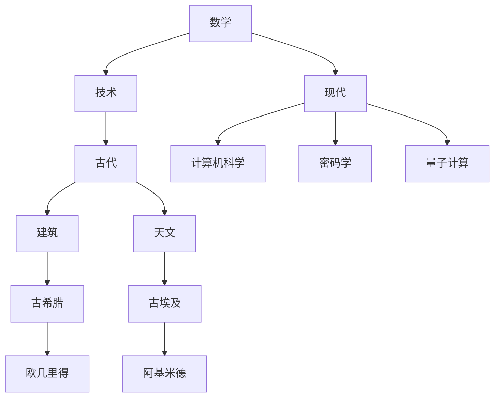

                 

# 数学与技术史：数学推动技术进步的历程

> 关键词：数学、技术进步、历史、算法、Python、数学模型、项目实战

> 摘要：本文将探讨数学如何推动技术进步的历史。从古代到现代，数学作为一种强大的工具，不断推动着技术的发展与革新。本文将按照历史脉络，介绍数学在不同时期对技术的贡献，并通过具体实例和算法原理，展现数学与技术之间的紧密联系。

## 引言

### 1.1 数学与技术的关系

数学与技术之间的关系可以追溯到古代。在古代，数学的发展与建筑、天文、测量等技术的需求密切相关。例如，古埃及和古希腊的数学成就，为当时的建筑和工程技术提供了重要的理论基础。随着历史的推移，数学逐渐成为技术进步的重要驱动力。

### 1.2 技术对数学的推动

同样，技术的进步也推动了数学的发展。例如，工业革命时期，工程数学的发展为机械制造提供了基础。20世纪，计算机的出现使数学方法得以广泛应用于各个领域，如密码学、数据分析等。

### 1.3 阅读指南

本文将分为七个章节，首先回顾数学与技术的历史，然后详细探讨数学在不同时期对技术的贡献。文章将以具体实例和算法原理为基础，结合Python代码和数学模型，深入讲解数学与技术之间的联系。读者可以通过本文了解到数学如何推动技术进步，并在实践中运用数学知识。

## 第1章 古代数学与技术

### 2.1 古埃及与古希腊数学

古埃及数学的起源可以追溯到公元前3000年左右。古埃及人使用一种简单的十进制系统，通过草纸记录数字和数学运算。在建筑和测量方面，古埃及人利用几何知识建造了宏伟的金字塔和神庙。例如，他们使用了勾股定理来测量斜边的长度。

古希腊数学则建立了更加严谨和系统的数学体系。古希腊数学家如欧几里得、阿基米德等人对数学的发展做出了重要贡献。欧几里得的《几何原本》是古希腊数学的经典著作，它奠定了几何学的基础。阿基米德则在数学分析、流体力学等领域取得了重大突破。

### 2.2 古代工程技术的数学基础

古代建筑与几何密不可分。例如，古罗马的水利工程和道路建设，利用了数学原理进行设计和施工。古代的测量技术也需要数学知识，如土地测量、天文测量等。

### 2.3 数学工具的发明

算盘的起源可以追溯到古代中国。算盘是一种简单的计算工具，通过珠子的移动进行计算。十进制系统的普及，使得数学运算更加简便和高效。另外，阿拉伯数字的传播也对数学的发展产生了深远影响。

## 第2章 中世纪数学与技术

### 3.1 伊斯兰世界的数学贡献

中世纪的伊斯兰世界是数学发展的重要中心。阿拉伯数学家如花拉子米、阿尔·哈里德等人在代数、三角学等领域取得了重大成就。代数的概念和符号系统，为后来的数学发展奠定了基础。三角学的进展为天文测量和航海提供了重要的工具。

### 3.2 中国的数学与天文学

中国古代的数学成就同样不容忽视。唐代的数学家如李淳风等人，编写了《算经十书》等重要著作。在数学应用方面，中国古代的天文学取得了显著进展。例如，唐代的《大衍历》利用数学模型进行天文计算，预测天文现象。

### 3.3 欧洲中世纪的数学

中世纪的欧洲数学发展相对缓慢。然而，随着印刷术的发明和传播，数学知识得以广泛传播。中世纪的欧洲数学家如费尔马、笛卡尔等人在数学领域取得了重要突破。例如，费尔马的定理为现代数学的数论研究奠定了基础。

## 第3章 近代数学与技术

### 4.1 工业革命与数学应用

工业革命是技术进步的重要里程碑。在这个时期，数学的应用得到了广泛推广。工程数学的发展为机械制造、建筑工程等领域提供了理论基础。例如，牛顿的力学定律和微积分方法，为机械设计提供了重要的工具。

### 4.2 纯数学的突破

19世纪是纯数学发展的重要时期。数学家如高斯、黎曼等人在数学领域取得了重大突破。高斯的《算术研究》奠定了现代数论的基础。黎曼的《论复变函数的理论》为复分析领域的发展做出了重要贡献。

### 4.3 技术对数学的影响

技术的进步推动了数学的发展。例如，数值分析的发展为数学计算提供了高效的算法。计算机的出现使得数学模型的应用得以扩展，如密码学、数据分析等领域。

## 第4章 现代数学与技术

### 5.1 计算机科学与数学

计算机科学与数学密不可分。计算机科学中的算法设计、数据结构、计算复杂性等领域，都依赖于数学原理。例如，图灵机理论为计算机科学提供了理论基础。算法分析与优化，需要运用数学分析方法。

### 5.2 信息时代的数学

信息时代是数学应用的重要领域。密码学、数据挖掘、机器学习等领域，都依赖于数学方法。例如，RSA算法是一种基于数论的加密算法。支持向量机（SVM）是一种基于线性代数的机器学习算法。

### 5.3 数学在新兴技术中的应用

新兴技术如量子计算、生物信息学等，也需要数学的支持。量子计算利用量子力学原理进行计算，需要复杂的数学模型。生物信息学则利用数学方法进行基因序列分析、蛋白质结构预测等。

## 第5章 数学与技术跨领域的创新

### 6.1 物理学中的数学应用

物理学是数学应用的重要领域。例如，爱因斯坦的相对论需要运用微积分和微分方程等数学工具。量子力学中的波函数、薛定谔方程等概念，都是数学的抽象表达。

### 6.2 经济学中的数学模型

经济学中的数学模型广泛应用于经济分析和预测。例如，期权定价模型、资产定价理论等，都是基于数学原理构建的。这些模型为金融市场的运作提供了重要的理论支持。

### 6.3 社会科学中的数学方法

社会科学中的数学方法，如人口统计学、经济模型等，也广泛应用于社会分析和预测。例如，人口模型可以预测人口增长、老龄化等社会问题。经济模型可以分析经济增长、通货膨胀等经济现象。

## 第6章 未来展望

### 7.1 数学在技术创新中的角色

未来，数学将继续在技术创新中发挥重要作用。随着技术的发展，数学方法将不断应用于新兴领域，如人工智能、量子计算等。数学将成为推动技术创新的关键力量。

### 7.2 数学教育的挑战与机遇

数学教育也面临着新的挑战和机遇。未来，数学教育将更加注重培养学生的创新能力和应用能力。数学课程将更加灵活和多样化，以适应不同学生的学习需求。

### 7.3 全球数学合作与交流

全球数学合作与交流将进一步加强。数学研究的前沿动态将更加开放和共享。国际数学联盟等组织将在数学发展中发挥更大的作用。

## 附录

### 附录A：数学与技术的联系流程图

### 附录B：参考书目与资源

- 《数学的历史》（作者：詹姆斯·R·格里菲斯）
- 《数学与哲学》（作者：理查德·蒙蒂菲奥里）
- 《计算机科学中的数学方法》（作者：唐纳德·E·克努特）
- 《数学之美》（作者：刘未鹏）
- [在线数学资源](https://www.khanacademy.org/math)

## 作者信息

作者：AI天才研究院/AI Genius Institute & 禅与计算机程序设计艺术 /Zen And The Art of Computer Programming

---

本文详细介绍了数学与技术史的发展，从古代到现代，数学作为一种强大的工具，不断推动着技术的进步。通过具体实例和算法原理，本文展现了数学与技术之间的紧密联系。在未来，数学将继续在技术创新中发挥重要作用，为人类社会的发展带来更多可能性。希望本文能激发读者对数学与技术的兴趣，进一步探索这一领域。作者信息如上所述。

