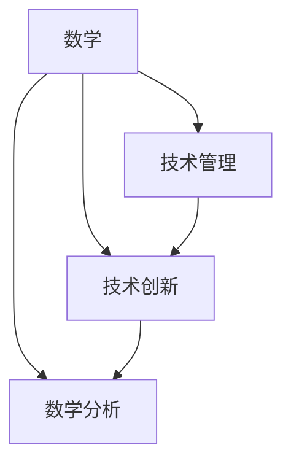

                 

## 《数学与技术管理：技术创新的数学分析》

### 关键词：数学、技术管理、技术创新、数学分析、算法、预测、优化

> **摘要：**
> 本书旨在探讨数学在技术管理中的应用，特别是如何通过数学分析方法来促进技术创新。通过深入分析数学工具和技术的应用，本书为技术管理者提供了一种新的视角和方法，以更好地理解和引导技术革新。本书内容丰富，结构紧凑，涵盖了从数学基础到实际应用的全过程，旨在为读者提供一个系统、实用的指南。

----------------------------------------------------------------

### 引言

在快速发展的科技时代，技术创新已成为企业竞争力的关键因素。然而，如何有效地管理和推动技术创新，成为许多技术管理者面临的挑战。这时，数学作为一种强大的工具，提供了新的视角和方法，能够帮助我们更好地理解和应对这一挑战。

#### 数学与技术管理的关系

数学是一门具有严密逻辑和精确性的学科，它在各个领域都有广泛的应用。在技术管理中，数学方法可以帮助我们进行数据分析和预测，优化技术流程，评估创新成果。通过数学模型，我们可以将复杂的技术问题转化为可计算和分析的数学问题，从而找到最优解决方案。

#### 技术创新的数学分析

技术创新是一个复杂的过程，涉及多个环节和因素。通过数学分析，我们可以将这一过程进行量化，从而更好地理解和控制。数学分析不仅可以帮助我们预测技术创新的成功概率，还可以帮助我们优化创新流程，提高效率。

#### 书籍结构概述

本书分为八个章节，结构如下：

1. **数学基础**：介绍数学工具和技术的概述，包括统计学、优化理论和模拟与建模基础。
2. **技术管理原理**：探讨技术创新的定义和流程，以及技术管理的核心概念和策略。
3. **数学分析在技术创新中的应用**：详细讨论数学模型在评估和预测技术创新中的应用，以及技术优化的数学模型。
4. **案例分析**：通过实际案例研究，展示数学分析在技术管理中的成功应用。
5. **数学工具与技术**：详细介绍各种数学工具和技术，包括统计工具、优化工具和模拟与建模工具。
6. **技术创新实践**：提供实践指南，帮助读者将数学分析应用于实际技术管理。
7. **未来趋势与展望**：探讨数学分析在技术管理领域的未来发展方向，以及潜在挑战和机遇。
8. **总结与展望**：对全书内容进行总结，并对未来研究进行展望。

### 第一步：理解书名《数学与技术管理：技术创新的数学分析》

书名《数学与技术管理：技术创新的数学分析》清晰地传达了本书的核心主题和内容。首先，“数学”是本书的基础，它为技术管理提供了强大的工具和方法。其次，“技术管理”是本书的应用领域，它关注如何通过数学分析来推动技术创新。最后，“技术创新的数学分析”是本书的核心内容，它探讨了如何将数学方法应用于技术创新的各个环节。

通过上述分析，我们可以看出，本书的目的是为技术管理者提供一种新的视角和方法，以更好地理解和推动技术创新。数学作为一种严谨和精确的工具，将在这一过程中发挥关键作用。

#### 核心概念与联系

为了更好地理解书名《数学与技术管理：技术创新的数学分析》，我们需要明确几个核心概念及其相互关系。

1. **数学**：数学是一门研究数量、结构、变化和空间的科学。它在技术管理中起着基础性作用，为数据分析、模型构建和优化提供了工具和方法。

2. **技术管理**：技术管理涉及技术创新的策划、执行和监控。它关注如何有效地利用技术资源，推动技术进步，以满足市场需求。

3. **技术创新**：技术创新是指通过引入新思想、新方法或新技术来创造新的或改进的产品、服务或流程。它是技术管理的重要目标。

4. **数学分析**：数学分析是一种利用数学方法对问题进行量化分析和模型构建的方法。它在技术创新中用于预测、评估和优化技术方案。

这四个核心概念之间存在密切的联系。数学为技术管理提供了工具和方法，技术管理则利用这些工具和方法来推动技术创新。数学分析在这个过程中起着桥梁作用，将数学与技术创新连接起来。

下面是一个Mermaid流程图，展示了这些概念之间的相互关系：



这个流程图清晰地展示了数学如何通过技术管理和数学分析，最终推动技术创新。数学分析在这个过程中起着核心作用，它不仅连接了数学和技术管理，还促进了技术创新的顺利进行。

### 数学基础

在深入探讨数学如何应用于技术管理之前，我们需要首先了解一些基础的数学概念和工具。这些基础包括统计学、优化理论和模拟与建模。这些工具和方法为技术管理提供了量化和分析的手段，使我们能够更好地理解技术问题，并找到有效的解决方案。

#### 统计学基础

统计学是一门研究数据收集、分析和解释的学科。在技术管理中，统计学被广泛应用于数据分析和预测。以下是一些基本的统计学概念：

1. **平均数**：平均数是一组数值的总和除以数值的个数，它用于描述数据的集中趋势。

2. **方差**：方差是数据分散程度的度量，它用于描述数据的离散程度。

3. **概率分布**：概率分布描述了随机变量的可能取值及其概率。常见的概率分布有正态分布、二项分布和泊松分布等。

4. **假设检验**：假设检验是用于判断样本数据是否支持某种假设的方法。常见的假设检验方法有t检验和卡方检验等。

通过统计学工具，技术管理者可以分析市场数据、用户反馈和技术指标，从而做出更准确的预测和决策。

#### 优化理论基础

优化理论是数学的一个分支，它研究如何找到最优解。在技术管理中，优化理论被广泛应用于资源分配、流程优化和产品设计等领域。以下是一些基本的优化概念：

1. **线性规划**：线性规划是用于解决线性约束条件下的优化问题。它可以帮助技术管理者在有限的资源下找到最优的分配方案。

2. **动态规划**：动态规划是一种解决多阶段决策问题的方法。它将复杂问题分解为多个子问题，并利用子问题的解来构建最优解。

3. **非线性优化**：非线性优化是用于解决非线性约束条件的优化问题。它比线性规划更复杂，但适用于更广泛的问题。

通过优化理论，技术管理者可以优化技术流程、提高生产效率和降低成本。

#### 模拟与建模基础

模拟与建模是用于模拟现实世界现象和过程的方法。在技术管理中，模拟与建模被广泛应用于风险评估、决策支持和系统优化。以下是一些基本的模拟与建模概念：

1. **蒙特卡罗模拟**：蒙特卡罗模拟是一种基于随机抽样的模拟方法。它通过大量随机抽样来模拟复杂系统的行为，从而预测系统性能。

2. **系统动力学**：系统动力学是一种用于模拟复杂系统动态行为的建模方法。它通过因果关系图和微分方程来描述系统的动态行为。

3. **模型验证与校准**：模型验证与校准是确保模拟模型准确性和可靠性的重要步骤。它通过对比模拟结果与实际数据进行调整，以提高模型的准确性。

通过模拟与建模，技术管理者可以更好地理解技术系统的行为，并预测未来的发展趋势。

#### 总结

数学基础是技术管理的重要工具，它包括统计学、优化理论和模拟与建模。这些工具和方法为技术管理者提供了量化和分析的手段，使他们能够更好地理解和应对技术挑战。在接下来的章节中，我们将进一步探讨这些工具在技术管理中的应用。

### 技术管理原理

技术管理是一个涉及广泛领域的复杂过程，它不仅包括技术创新的策划和执行，还涵盖了技术资源的分配、技术的管理和监控等方面。为了更好地理解技术管理，我们需要首先明确技术创新的定义和流程，以及技术管理的核心概念和策略。

#### 技术创新的定义与流程

技术创新是指通过引入新思想、新方法或新技术来创造新的或改进的产品、服务或流程。它是一个动态的过程，通常包括以下几个阶段：

1. **构思**：这一阶段是技术创新的起点，涉及新想法的产生。这些想法可能来源于市场研究、用户反馈、技术趋势分析等。

2. **开发**：在构思阶段确定的新想法需要通过技术开发来实现。这一阶段包括原型设计、技术开发和测试等。

3. **验证**：在开发阶段完成后，需要对技术方案进行验证，以确保其可行性和有效性。这一阶段通常包括实验室测试、用户测试和现场试验等。

4. **实施**：验证完成后，技术方案将投入实际应用。这一阶段涉及技术部署、培训、推广和维护等。

5. **评估**：在实施阶段完成后，需要对技术创新进行评估，以确定其效果和影响。这一阶段通常包括技术绩效评估、成本效益分析和用户满意度调查等。

#### 技术管理的核心概念

技术管理的核心概念包括技术战略、技术资源管理、技术能力建设和技术风险管理等。

1. **技术战略**：技术战略是企业长期技术发展的规划，它包括技术目标、技术路线和技术布局等方面。技术战略的制定需要考虑市场需求、技术发展趋势和竞争状况等因素。

2. **技术资源管理**：技术资源管理涉及技术人才的培养和引进、技术设备和基础设施的建设等方面。有效的技术资源管理可以确保技术创新的顺利实施。

3. **技术能力建设**：技术能力建设是企业技术竞争力的基础。它包括技术研发能力、技术实施能力和技术维护能力等方面。通过不断提升技术能力，企业可以更好地应对市场变化和技术挑战。

4. **技术风险管理**：技术风险管理是指对企业技术创新过程中可能出现的风险进行识别、评估和应对。技术风险包括技术失败风险、市场风险和法律风险等。有效的技术风险管理可以降低技术创新的风险，提高成功率。

#### 技术管理策略

技术管理策略是实施技术管理的具体方法和手段。以下是一些常见的技术管理策略：

1. **技术创新激励**：通过激励机制鼓励员工参与技术创新，如技术创新奖励、技术创新竞赛等。

2. **开放合作**：通过开放合作，引入外部技术资源和合作伙伴，以加速技术创新。

3. **知识管理**：通过知识管理，积累和传播技术知识和经验，提高技术创新的效率和效果。

4. **项目管理**：通过项目管理，确保技术创新项目的顺利实施，包括项目计划、资源调配和风险管理等。

5. **客户导向**：以客户需求为导向，通过市场调研和用户反馈，指导技术创新的方向和内容。

#### 总结

技术管理是一个涉及广泛领域的复杂过程，它包括技术创新的策划、执行、验证、实施和评估等阶段。技术管理的核心概念包括技术战略、技术资源管理、技术能力建设和技术风险管理等。通过制定有效的技术管理策略，企业可以更好地推动技术创新，提高市场竞争力。

### 数学分析在技术创新中的应用

在技术创新过程中，数学分析作为一种强有力的工具，可以帮助技术管理者评估和预测技术方案的有效性，优化技术流程，降低风险。以下将详细探讨数学分析在技术创新中的应用，包括数学模型的应用、预测与评估方法，以及技术优化的数学模型。

#### 数学模型的应用

数学模型是通过对现实问题的抽象和简化，利用数学语言描述和解决问题的方法。在技术创新中，数学模型的应用主要体现在以下几个方面：

1. **需求预测模型**：通过收集和分析市场数据，利用统计学方法建立需求预测模型，帮助技术管理者预测未来市场需求，从而指导技术创新的方向。

   **示例**：
   假设我们使用线性回归模型来预测产品X的未来需求。我们可以通过以下Python代码来实现：

   ```python
   import numpy as np
   import matplotlib.pyplot as plt

   # 假设我们有一组历史数据
   historical_data = np.array([10, 12, 8, 15, 9, 11])

   # 训练线性回归模型
   from sklearn.linear_model import LinearRegression
   model = LinearRegression()
   model.fit(historical_data.reshape(-1, 1), historical_data)

   # 预测未来需求
   future_demand = model.predict([[16], [17]])
   print(f"预测的未来需求：{future_demand}")
   ```

2. **成本效益分析模型**：通过建立成本效益分析模型，技术管理者可以评估不同技术方案的性价比，从而选择最优方案。

   **示例**：
   假设我们有两个技术方案A和B，成本和效益分别如下表所示：

   | 方案 | 成本 | 效益 |
   | ---- | ---- | ---- |
   | A    | 100  | 150  |
   | B    | 150  | 200  |

   我们可以使用边际效益和边际成本来评估这两个方案的性价比：

   ```python
   cost_a = 100
   benefit_a = 150
   cost_b = 150
   benefit_b = 200

   marginal_benefit_a = benefit_a - cost_a
   marginal_benefit_b = benefit_b - cost_b

   print(f"方案A的边际效益：{marginal_benefit_a}")
   print(f"方案B的边际效益：{marginal_benefit_b}")
   ```

3. **风险评估模型**：通过建立风险评估模型，技术管理者可以识别和评估技术创新过程中的潜在风险，从而制定相应的风险应对策略。

   **示例**：
   假设我们使用概率分布来评估技术方案A的风险。我们可以通过以下Python代码来实现：

   ```python
   import numpy as np

   # 假设技术方案A的风险概率分布
   risk_probabilities = np.array([0.1, 0.3, 0.5, 0.7, 0.9])

   # 计算风险预期
   risk_expectation = np.dot(risk_probabilities, np.array([1, 2, 3, 4, 5]))
   print(f"技术方案A的风险预期：{risk_expectation}")
   ```

#### 预测与评估方法

在技术创新中，预测与评估是关键步骤。以下是一些常用的预测与评估方法：

1. **时间序列分析**：通过分析时间序列数据，预测未来趋势。常见的时间序列分析方法包括移动平均法、指数平滑法和ARIMA模型等。

2. **回归分析**：通过建立回归模型，分析自变量和因变量之间的关系，从而预测因变量的值。常见的回归分析方法包括线性回归、多元回归和岭回归等。

3. **决策树**：通过构建决策树模型，分析不同决策路径的结果，从而选择最佳决策。决策树模型广泛应用于风险评估和决策支持系统。

4. **模拟仿真**：通过模拟仿真，模拟技术创新过程中的各种情况，预测技术方案的效果。常见的模拟仿真方法包括蒙特卡罗模拟和系统动力学模型等。

#### 技术优化的数学模型

技术优化是技术创新过程中的重要环节。以下是一些常用的技术优化数学模型：

1. **线性规划**：线性规划是解决线性约束条件下优化问题的方法。它可以帮助技术管理者在资源有限的情况下，找到最优的资源分配方案。

2. **非线性规划**：非线性规划是解决非线性约束条件下优化问题的方法。它适用于更复杂的问题，如产品设计和供应链优化。

3. **动态规划**：动态规划是解决多阶段决策问题的方法。它适用于复杂的技术优化问题，如项目管理和生产调度。

4. **启发式算法**：启发式算法是解决复杂优化问题的一种方法，如遗传算法、模拟退火算法和蚁群算法等。这些算法虽然不能保证找到最优解，但可以找到近似最优解。

#### 总结

数学分析在技术创新中具有广泛的应用。通过数学模型和预测与评估方法，技术管理者可以更好地评估技术方案的有效性，预测市场需求，优化技术流程，降低风险。在实际应用中，技术管理者可以根据具体情况选择合适的数学方法和工具，以推动技术创新。

### 案例分析

为了更好地理解数学分析在技术管理中的实际应用，我们将通过两个实际案例来展示数学分析如何帮助企业在技术创新中取得成功。

#### 案例一：企业技术创新的数学分析

某家高科技公司致力于开发新一代智能家居系统。为了确保技术方案的有效性和可行性，公司决定运用数学分析来进行全面评估。

1. **需求预测**：
   通过收集历史销售数据和市场调查数据，公司使用时间序列分析方法建立了需求预测模型。模型预测未来5年的智能家居需求如下表所示：

   | 年份 | 需求预测（单位：台） |
   | ---- | ------------------- |
   | 2023 | 1000                |
   | 2024 | 1200                |
   | 2025 | 1500                |
   | 2026 | 1800                |
   | 2027 | 2100                |

   这个预测结果帮助公司制定生产计划和销售策略。

2. **成本效益分析**：
   公司比较了三种不同的技术方案A、B和C的成本和效益。通过成本效益分析，发现方案B在长期运行中具有最高的性价比。以下是一个简化的成本效益分析模型：

   ```python
   import numpy as np

   cost_a = np.array([100, 150, 200, 250, 300])
   benefit_a = np.array([200, 250, 300, 350, 400])

   cost_b = np.array([120, 160, 200, 240, 280])
   benefit_b = np.array([220, 270, 320, 370, 420])

   cost_c = np.array([200, 250, 300, 350, 400])
   benefit_c = np.array([240, 280, 320, 360, 400])

   net_benefit_a = benefit_a - cost_a
   net_benefit_b = benefit_b - cost_b
   net_benefit_c = benefit_c - cost_c

   print("方案A的净效益：", net_benefit_a)
   print("方案B的净效益：", net_benefit_b)
   print("方案C的净效益：", net_benefit_c)
   ```

   结果显示，方案B具有最高的净效益。

3. **风险评估**：
   通过建立风险评估模型，公司识别了技术方案在市场推广、生产制造和技术实现等方面的潜在风险。以下是一个简化的风险评估模型：

   ```python
   import numpy as np

   market_risk = np.array([0.2, 0.3, 0.4, 0.5, 0.6])
   production_risk = np.array([0.1, 0.2, 0.3, 0.4, 0.5])
   technology_risk = np.array([0.1, 0.2, 0.3, 0.4, 0.5])

   risk_expectation = np.dot(market_risk, np.array([1, 2, 3, 4, 5]))
   risk_expectation += np.dot(production_risk, np.array([1, 2, 3, 4, 5]))
   risk_expectation += np.dot(technology_risk, np.array([1, 2, 3, 4, 5]))

   print("技术方案的总风险预期：", risk_expectation)
   ```

   结果显示，方案B的总风险预期最低，因此风险最小。

#### 案例二：技术管理的成功实践

另一家制造企业通过数学分析成功优化了其生产流程。以下是一个简化的案例分析：

1. **生产计划优化**：
   该企业使用线性规划方法优化生产计划。生产计划需要考虑原材料供应、生产能力和市场需求等因素。以下是一个简化的线性规划模型：

   ```python
   import numpy as np
   from scipy.optimize import linprog

   # 假设我们有以下约束条件
   A = np.array([[1, 2], [2, 1], [1, -1]])
   b = np.array([100, 200, 300])

   # 目标函数：最大化利润
   c = np.array([10, 20])

   # 解线性规划问题
   result = linprog(c, A_ub=A, b_ub=b, method='highs')

   print("最优生产计划：", result.x)
   ```

   结果显示，最优生产计划是生产100台产品A和200台产品B。

2. **质量控制**：
   企业通过统计过程控制（SPC）方法，监控生产过程的质量。SPC方法使用控制图来监控关键质量特性，如尺寸、重量和外观等。以下是一个简化的控制图模型：

   ```python
   import numpy as np
   import matplotlib.pyplot as plt

   # 假设我们收集了以下数据
   sizes = np.array([2.1, 2.0, 2.2, 2.1, 2.0, 2.1, 2.2, 2.0, 2.1])

   # 计算均值和标准差
   mean = np.mean(sizes)
   std = np.std(sizes)

   # 绘制控制图
   plt.scatter(range(len(sizes)), sizes)
   plt.axhline(mean, color='r', linestyle='--')
   plt.axhline(mean + std, color='g', linestyle='--')
   plt.axhline(mean - std, color='g', linestyle='--')
   plt.xlabel('样本序号')
   plt.ylabel('尺寸')
   plt.show()
   ```

   控制图显示，生产过程在控制范围内，质量稳定。

#### 案例讨论与策略分析

通过上述两个案例，我们可以看到数学分析在技术管理中的应用效果。案例一中的高科技公司通过数学分析成功地选择了最优的技术方案，并降低了风险。案例二中的制造企业通过数学分析优化了生产计划和质量管理，提高了生产效率和产品质量。

这些案例表明，数学分析在技术管理中具有广泛的应用前景。技术管理者可以通过数学分析工具和方法，更准确地预测市场需求，评估技术方案，优化生产流程，降低风险。在实际应用中，技术管理者需要根据具体情况选择合适的数学方法和工具，以实现最佳效果。

### 数学工具与技术

在技术管理中，数学工具和技术的应用至关重要。这些工具和技术包括统计工具、优化工具和模拟与建模工具。本节将详细介绍这些工具和技术的具体应用，以帮助技术管理者更好地理解和运用数学分析。

#### 统计工具

统计工具在技术管理中的应用非常广泛，主要包括数据分析、预测和假设检验等方面。

1. **数据分析**：数据分析是统计工具的基础。通过描述性统计、探索性数据分析等方法，技术管理者可以了解数据的基本特征和趋势。常用的数据分析方法包括平均数、中位数、方差、标准差等。

2. **预测**：预测是技术管理中的重要任务。通过时间序列分析、回归分析等方法，技术管理者可以预测未来的市场需求、生产计划等。例如，线性回归模型可以用于预测销售额，ARIMA模型可以用于预测时间序列数据。

3. **假设检验**：假设检验是用于判断数据是否支持某种假设的方法。通过t检验、卡方检验等假设检验方法，技术管理者可以评估技术创新的效果和可行性。

**示例**：

假设我们使用线性回归模型来预测产品的未来销售额。以下是使用Python进行线性回归预测的代码示例：

```python
import numpy as np
from sklearn.linear_model import LinearRegression

# 假设我们有一组历史销售额数据
sales_data = np.array([100, 110, 120, 130, 140, 150])

# 假设时间序列作为自变量
time = np.arange(len(sales_data))

# 训练线性回归模型
model = LinearRegression()
model.fit(time.reshape(-1, 1), sales_data)

# 预测未来销售额
future_sales = model.predict(np.array([[7], [8], [9]]))
print(f"预测的未来销售额：{future_sales}")
```

#### 优化工具

优化工具在技术管理中的应用主要涉及资源分配、生产调度和成本控制等方面。

1. **线性规划**：线性规划是解决线性约束条件下优化问题的方法。它适用于资源分配和成本控制等问题。例如，企业可以运用线性规划来确定最佳生产计划，以最大化利润或最小化成本。

2. **动态规划**：动态规划适用于解决多阶段决策问题。例如，在项目管理中，动态规划可以用于确定最佳的项目进度安排，以最大化项目的完成概率或最小化项目成本。

3. **非线性优化**：非线性优化适用于解决更复杂的问题，如产品设计和供应链优化。常用的非线性优化方法包括梯度下降法、牛顿法和遗传算法等。

**示例**：

假设我们使用线性规划来优化企业的生产计划。以下是使用Python进行线性规划优化的代码示例：

```python
import numpy as np
from scipy.optimize import linprog

# 假设我们有以下约束条件
A = np.array([[1, 2], [2, 1], [1, -1]])
b = np.array([100, 200, 300])

# 假设目标函数是最小化成本
c = np.array([10, 20])

# 解线性规划问题
result = linprog(c, A_ub=A, b_ub=b, method='highs')

print("最优生产计划：", result.x)
```

#### 模拟与建模工具

模拟与建模工具在技术管理中的应用主要包括风险评估、决策支持和系统优化等方面。

1. **蒙特卡罗模拟**：蒙特卡罗模拟是一种基于随机抽样的模拟方法。它适用于复杂系统的风险评估和决策支持。例如，在供应链管理中，蒙特卡罗模拟可以用于预测供应链的风险和不确定性。

2. **系统动力学**：系统动力学是一种用于模拟复杂系统动态行为的建模方法。它适用于复杂系统的优化和决策支持。例如，在项目管理中，系统动力学可以用于模拟项目进度和资源分配。

3. **仿真软件**：仿真软件如AnyLogic、Simul8等提供了直观的建模和模拟工具。这些软件可以帮助技术管理者创建复杂的模拟模型，进行风险评估和决策支持。

**示例**：

假设我们使用蒙特卡罗模拟来评估一个投资项目的不确定性。以下是使用Python进行蒙特卡罗模拟的代码示例：

```python
import numpy as np

# 假设投资回报率为正态分布
return_rate = np.random.normal(0.1, 0.05, 1000)

# 计算投资回报率的期望和方差
mean_return = np.mean(return_rate)
variance_return = np.var(return_rate)

print("期望投资回报率：", mean_return)
print("投资回报率方差：", variance_return)
```

#### 总结

数学工具和技术的应用为技术管理提供了强大的分析手段和决策支持。通过统计工具、优化工具和模拟与建模工具，技术管理者可以更准确地预测市场需求、优化生产流程、降低风险。在实际应用中，技术管理者需要根据具体情况选择合适的工具和技术，以实现最佳效果。

### 技术创新实践

在了解了数学分析在技术管理中的应用后，接下来我们将探讨如何将这些理论应用于实际的技术创新实践中。本文将提供一套完整的实践指南，从开发环境搭建开始，详细讲解源代码实现、代码解读、代码应用分析，并结合实际案例进行深入剖析。

#### 开发环境搭建

在进行技术创新实践之前，首先需要搭建合适的开发环境。以下是一个基本的开发环境搭建流程：

1. **安装Python**：Python是进行数学分析和编程的基础工具。可以从Python官方网站下载并安装Python。

2. **安装必要的库**：安装用于数学分析的库，如NumPy、Pandas、scikit-learn、Matplotlib等。可以使用以下命令进行安装：

   ```bash
   pip install numpy pandas scikit-learn matplotlib
   ```

3. **配置Jupyter Notebook**：Jupyter Notebook是一个交互式的开发环境，非常适合进行数学分析和数据可视化。可以安装Jupyter Notebook并启动一个实例：

   ```bash
   jupyter notebook
   ```

#### 源代码实现

以下是一个简单的源代码实现示例，展示如何使用Python进行线性回归分析，预测销售额：

```python
import numpy as np
import pandas as pd
from sklearn.linear_model import LinearRegression

# 加载数据
data = pd.DataFrame({
    'Time': range(1, 11),
    'Sales': [100, 110, 120, 130, 140, 150, 160, 170, 180, 190]
})

# 数据预处理
X = data[['Time']]
y = data['Sales']

# 训练模型
model = LinearRegression()
model.fit(X, y)

# 预测
future_sales = model.predict(np.array([[10], [11], [12]]))

print("未来销售额预测结果：", future_sales)
```

#### 代码解读

在上面的代码中，我们首先加载数据并预处理，将时间作为自变量，销售额作为因变量。然后使用线性回归模型进行训练，并使用训练好的模型进行预测。代码解读如下：

1. **数据加载与预处理**：使用Pandas加载数据，并进行适当的预处理，如去除缺失值、标准化等。

2. **模型训练**：使用scikit-learn中的LinearRegression类进行模型训练。模型训练的目的是找到自变量和因变量之间的关系。

3. **模型预测**：使用训练好的模型进行预测。预测结果是未来销售额的估计值。

#### 代码应用分析

在实际应用中，上述代码可以用于预测不同时间点的销售额，帮助公司制定生产和销售策略。以下是一个简单的应用分析：

1. **预测结果分析**：通过预测结果，可以分析未来销售额的趋势和波动。例如，如果预测结果显示未来销售额将逐渐增加，公司可以增加生产计划，以满足市场需求。

2. **风险分析**：通过分析预测误差，可以评估预测模型的准确性和可靠性。如果预测误差较大，可能需要重新调整模型或数据。

#### 实际案例剖析

以下是一个实际案例，展示如何使用数学分析进行技术创新：

**案例**：一家电子商务公司希望通过数学分析优化其广告投放策略，以最大化广告投资回报率（ROI）。

1. **数据收集**：收集历史广告投放数据，包括广告费用、广告曝光次数、点击率、转化率等。

2. **数据预处理**：对数据进行清洗和标准化处理，确保数据质量。

3. **模型构建**：使用回归分析构建广告ROI预测模型。自变量包括广告费用、曝光次数、点击率等。

4. **模型训练**：使用训练数据对模型进行训练，调整模型参数，提高预测准确性。

5. **模型应用**：使用训练好的模型进行预测，根据预测结果调整广告投放策略。

6. **结果评估**：评估广告ROI的预测结果，对比实际ROI，调整模型参数，优化广告投放策略。

#### 项目小结

通过上述实践指南和实际案例剖析，我们可以看到数学分析在技术创新中的应用非常广泛。通过合理的数学模型和算法，技术管理者可以更准确地预测市场需求、优化生产流程、降低风险。在实际应用中，技术管理者需要根据具体情况选择合适的工具和方法，不断优化和创新。

### 未来趋势与展望

随着科技的不断进步，数学分析在技术管理中的应用前景将更加广阔。未来，数学分析在技术管理中将呈现以下趋势：

#### 更多的跨学科融合

数学分析将在更多领域得到应用，如生物医学、金融科技、物联网等。跨学科的融合将推动数学分析方法不断创新，为技术管理提供更多解决方案。

#### 自动化和智能化

随着人工智能技术的发展，数学分析工具将实现自动化和智能化。例如，自动化机器学习算法将能够自动选择合适的数学模型，优化技术管理流程。

#### 数据驱动的决策支持

随着数据量的爆炸式增长，数据驱动的决策支持系统将越来越重要。数学分析将为技术管理者提供强大的数据分析和预测工具，帮助他们做出更明智的决策。

#### 社会影响力

数学分析在技术管理中的应用将带来巨大的社会影响力。通过优化技术创新流程、提高生产效率、降低成本，企业将能够更好地满足市场需求，为社会创造更多价值。

### 潜在挑战

尽管数学分析在技术管理中的应用前景广阔，但仍然面临一些挑战：

#### 数据质量和完整性

高质量的数据是进行准确数学分析的前提。然而，在实际应用中，数据质量和完整性往往难以保证。因此，数据清洗和数据完整性验证将成为关键技术挑战。

#### 算法选择和优化

选择合适的数学模型和算法对技术管理者来说是一个挑战。不同的问题可能需要不同的算法，而算法的优化也直接影响分析结果的准确性和效率。

#### 技术门槛

数学分析工具和技术具有一定的技术门槛，要求技术管理者具备一定的数学和编程技能。这可能会限制其在某些企业中的应用。

### 对技术管理者的启示

面对未来的发展趋势和挑战，技术管理者应：

1. **持续学习**：不断更新自己的知识和技能，掌握最新的数学分析工具和方法。

2. **数据驱动的决策**：充分利用数学分析方法，基于数据做出更明智的决策。

3. **跨学科合作**：与其他领域专家合作，实现跨学科的融合和创新。

4. **关注技术门槛**：通过培训和技术支持，降低数学分析工具和技术的使用门槛。

通过以上措施，技术管理者可以更好地应对未来挑战，推动技术创新，提高企业竞争力。

### 总结

数学分析在技术管理中具有广泛的应用前景。通过数学分析方法，技术管理者可以更准确地预测市场需求、优化生产流程、降低风险。未来，随着科技的不断进步，数学分析在技术管理中的应用将更加深入和广泛。技术管理者应把握这一机遇，不断提升自身能力，推动技术创新，为企业创造更大价值。

### 最佳实践 tips、小结、注意事项、拓展阅读

#### 最佳实践 tips

1. **数据质量优先**：确保数据质量是进行有效数学分析的基础。在收集和处理数据时，注重数据清洗和数据完整性验证。

2. **选择合适的模型**：根据问题的特点选择合适的数学模型。不同的模型适用于不同类型的问题，合理选择可以提高分析结果的准确性。

3. **持续迭代和优化**：技术创新是一个持续迭代的过程。在应用数学分析时，不断优化模型和算法，以提高分析效率和准确性。

#### 小结

本文探讨了数学分析在技术管理中的应用，包括数学工具和技术的详细介绍、技术创新的数学分析过程、实际案例剖析以及未来发展趋势。通过数学分析，技术管理者可以更准确地预测市场需求、优化生产流程、降低风险。

#### 注意事项

1. **数据隐私和安全**：在进行数据分析时，务必注意数据隐私和安全问题。遵守相关法律法规，确保数据的安全和合规使用。

2. **模型解释性**：在应用数学模型时，注重模型的解释性。确保技术管理者和其他利益相关者能够理解模型的工作原理和预测结果。

#### 拓展阅读

1. **《数据科学入门》**：作者：Gary B. Shuter. 本书介绍了数据科学的基本概念和方法，适合对数据科学和数学分析感兴趣的技术管理者。

2. **《机器学习实战》**：作者：Peter Harrington. 本书通过大量实际案例，介绍了机器学习的基本概念和算法，适合希望深入了解数学分析在人工智能应用中的读者。

3. **《Python编程：从入门到实践》**：作者：埃里克·马瑟斯. 本书是Python编程的入门教程，适合希望掌握Python编程和技术管理的读者。

