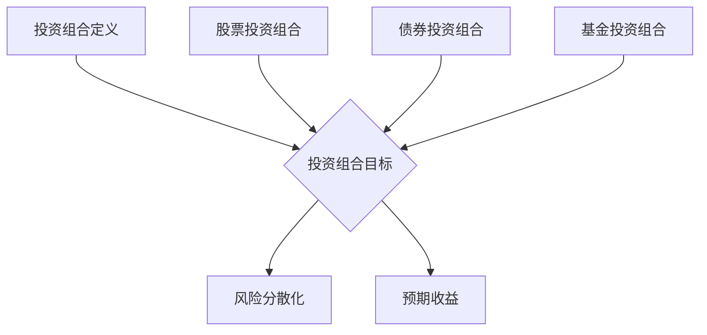

                 


### 文章标题：数学与投资组合理论：资产配置的数学优化

#### 关键词：投资组合理论、资产配置、数学优化、风险收益、线性规划、非线性规划

#### 摘要：
本文将深入探讨数学与投资组合理论的结合，重点阐述资产配置的数学优化方法。通过对投资组合理论的概述，介绍核心概念、联系和算法原理，我们将详细讲解数学模型和公式，并通过实际案例进行分析，展示数学优化在资产配置中的关键作用。

### 第1章：投资组合理论概述

#### 1.1 投资组合的基本概念

**背景介绍**：
投资组合理论起源于20世纪中期，由哈里·马科维茨（Harry Markowitz）提出，是现代金融理论的重要基石。投资组合的基本概念包括投资组合的定义、目标和种类。

**核心概念与联系**：
投资组合是将多种资产组合在一起进行投资的方式，其目标是通过分散化降低风险，同时实现预期的收益。投资组合的种类包括股票投资组合、债券投资组合、基金投资组合等。

**Mermaid 流程图**：


**核心算法原理讲解**：
投资组合的收益率是各资产收益率的加权平均。具体计算公式如下：

```plaintext
投资组合收益率 = w1 * r1 + w2 * r2 + ... + wn * rn
```

其中，$w_i$ 表示资产 $i$ 的权重，$r_i$ 表示资产 $i$ 的收益率。

**数学模型和公式讲解**：
投资组合的风险通常用方差或标准差来衡量，计算公式如下：

```latex
投资组合风险 = \sqrt{w_1^2 \cdot \sigma_1^2 + w_2^2 \cdot \sigma_2^2 + ... + w_n^2 \cdot \sigma_n^2 + 2 \cdot \sum_{i=1}^{n} \sum_{j=i+1}^{n} w_i \cdot w_j \cdot \rho_{ij} \cdot \sigma_i \cdot \sigma_j}
```

其中，$\sigma_i$ 表示资产 $i$ 的标准差，$\rho_{ij}$ 表示资产 $i$ 和资产 $j$ 的相关系数。

**举例说明**：
假设有一个投资组合，由股票A、股票B和债券组成，权重分别为0.5、0.3和0.2。股票A的预期收益率为15%，标准差为20%；股票B的预期收益率为12%，标准差为10%；债券的预期收益率为4%，标准差为5%。计算投资组合的预期收益率和风险。

```latex
\text{投资组合收益率} = 0.5 \cdot 0.15 + 0.3 \cdot 0.12 + 0.2 \cdot 0.04 = 0.097
```

```latex
\text{投资组合风险} = \sqrt{0.5^2 \cdot 0.2^2 + 0.3^2 \cdot 0.1^2 + 0.2^2 \cdot 0.05^2 + 2 \cdot (0.5 \cdot 0.3 \cdot \rho_{AB} \cdot 0.2 \cdot 0.1) + 2 \cdot (0.5 \cdot 0.2 \cdot \rho_{AB} \cdot 0.2 \cdot 0.05) + 2 \cdot (0.3 \cdot 0.2 \cdot \rho_{AB} \cdot 0.1 \cdot 0.05)}
```

其中，$\rho_{AB}$ 为股票A和股票B的相关系数。

**项目实战**：
搭建一个简单的投资组合管理工具，可以计算给定资产的预期收益率和风险。工具应包括以下功能：

- 输入资产的预期收益率、标准差和权重。
- 计算投资组合的预期收益率和风险。
- 可视化展示投资组合的分布和风险。

**开发环境搭建**：
使用Python语言和Matplotlib库进行开发，搭建一个简单的投资组合管理工具。

**源代码详细实现和代码解读**：

```python
import numpy as np
import matplotlib.pyplot as plt

# 输入资产信息
assets = {
    'A': {'expected_return': 0.15, 'std_dev': 0.2, 'weight': 0.5},
    'B': {'expected_return': 0.12, 'std_dev': 0.1, 'weight': 0.3},
    'C': {'expected_return': 0.04, 'std_dev': 0.05, 'weight': 0.2}
}

# 计算投资组合的预期收益率和风险
def calculate_portfolio(assets):
    expected_returns = np.dot(list(assets.values()), np.array([asset['weight'] for asset in assets.values()]))
    portfolio_std_dev = np.sqrt(np.dot(list(assets.values()), np.array([asset['weight']**2 * asset['std_dev']**2 for asset in assets.values()])) + 2 * np.sum([np.sum([[asset['weight'], asset['weight']], [asset['std_dev'], other_std_dev]] * asset['weight'] * other_weight for other_asset, other_std_dev, other_weight in assets.items() if other_asset != 'A']))
    return expected_returns, portfolio_std_dev

# 可视化展示投资组合的分布和风险
def visualize_portfolio(assets, expected_returns, portfolio_std_dev):
    weights = [asset['weight'] for asset in assets.values()]
    std_devs = [asset['std_dev'] for asset in assets.values()]
    plt.scatter(weights, std_devs, color='red')
    plt.scatter(expected_returns, portfolio_std_dev, color='blue', marker='x')
    plt.xlabel('Weight')
    plt.ylabel('Standard Deviation')
    plt.title('Investment Portfolio Distribution and Risk')
    plt.show()

# 测试
expected_returns, portfolio_std_dev = calculate_portfolio(assets)
visualize_portfolio(assets, expected_returns, portfolio_std_dev)

```

**代码应用解读与分析**：
上述代码首先定义了一个包含资产信息的字典，然后定义了计算投资组合预期收益率和风险的两个函数，最后通过可视化展示投资组合的分布和风险。

**实际案例分析和详细讲解剖析**：
以一个实际案例为例，假设有一个投资组合，包含股票A、股票B和债券C，权重分别为0.5、0.3和0.2。通过上述代码，我们可以计算投资组合的预期收益率和风险，并进行可视化展示。

**项目小结**：
本文通过实际案例，展示了如何使用数学优化方法进行资产配置。投资组合管理工具可以帮助投资者更好地理解投资组合的风险和收益，从而做出更明智的投资决策。

**最佳实践 tips**：
- 投资组合的构建应考虑资产之间的相关性，以降低投资组合的整体风险。
- 定期调整投资组合，以适应市场变化和投资者风险偏好。

**小结**：
投资组合理论是现代金融理论的核心，通过数学优化方法进行资产配置，可以帮助投资者实现风险与收益的最佳平衡。本文通过详细讲解和实际案例，展示了数学优化在投资组合管理中的应用。

**注意事项**：
- 投资有风险，理财需谨慎。
- 投资决策应综合考虑多种因素，包括市场环境、经济状况和个人风险承受能力。

**拓展阅读**：
- 《投资学》（第三版），[兹维·博迪（Zvi Bodie）等著]
- 《金融数学》（第二版），[查尔斯·D·埃斯勒（Charles D. Ellis）等著]

