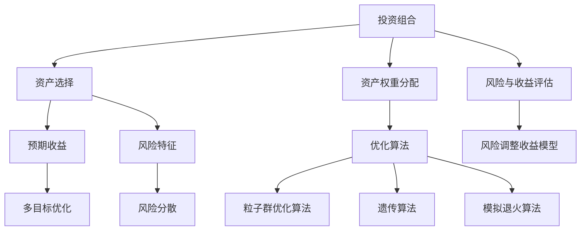

                 

# 数学与投资组合：资产配置的数学优化

## 关键词

- 投资组合
- 数学优化
- 资产配置
- 风险管理
- 多目标优化
- 模拟退火算法
- 遗传算法

## 摘要

本文探讨了数学优化在资产配置中的应用，旨在为投资者提供一种基于数学模型的资产配置策略。通过介绍投资组合的基础概念和优化算法，文章展示了如何利用数学方法进行资产配置，以实现风险与收益的平衡。文章首先回顾了投资组合的定义和目标，然后深入分析了数学优化理论，以及如何在投资组合中应用这些优化算法。最后，通过一个实际案例，详细阐述了数学优化在资产配置中的具体应用过程，并总结了相关的最佳实践和注意事项。

## 引言

资产配置是投资者在进行投资决策时，将资金分配到不同资产类别中的过程。合理的资产配置能够帮助投资者在风险可控的前提下，实现收益的最大化。随着金融市场的发展，投资者面临着越来越多的投资选择，如何从海量信息中筛选出最优的资产配置策略成为了一个重要的研究课题。数学优化作为一种强大的工具，能够帮助投资者在复杂的投资环境中找到最优的资产配置方案。

本文将从以下几个方面展开讨论：首先，介绍投资组合的基本概念和目标；其次，深入探讨数学优化理论，包括多目标优化、风险调整收益模型和常见优化算法；接着，通过一个实际案例展示数学优化在资产配置中的应用过程；最后，总结最佳实践和注意事项，为投资者提供实用的指导。

## 投资组合概述

### 投资组合的定义

投资组合，也称为资产组合，是指投资者将资金分配到不同的资产类别中，以实现风险分散和收益最大化的一种投资方式。在投资组合中，资产可以是股票、债券、基金、商品等多种类型。通过合理分配资产权重，投资者可以在不同风险水平下实现收益的最大化。

### 投资组合的目标

投资组合的目标主要包括以下几个方面：

1. **风险分散**：通过将资金分配到不同的资产类别，可以降低单一资产的风险，从而降低整个投资组合的风险。
2. **收益最大化**：在风险可控的前提下，通过选择具有较高预期收益的资产，实现投资组合收益的最大化。
3. **资金流动性**：保持投资组合中资产的流动性，以应对可能的市场变动和投资者的资金需求。
4. **税收优化**：通过选择适合的资产类别，优化投资组合的税收负担。

### 投资组合的风险与收益

投资组合的风险和收益是投资者最为关注的两个方面。风险可以分为系统风险和非系统风险，系统风险包括市场风险、利率风险等，非系统风险则包括个别资产的特定风险。收益则主要包括资产的资本增值和分红收入。

不同资产类别具有不同的风险和收益特征。一般来说，股票具有较高的收益潜力，但也伴随着较高的风险；债券相对较为稳健，但收益相对较低；商品和基金则具有其他独特的风险和收益特征。

### 投资组合的构成要素

投资组合的构成要素主要包括以下几个方面：

1. **资产种类**：投资者需要根据自身的风险偏好和收益目标，选择合适的资产种类。
2. **资产选择标准**：资产选择标准包括资产的历史表现、预期收益、风险特征等。
3. **资产权重分配**：投资者需要根据资产选择标准和市场情况，合理分配资产权重。

### 投资组合的评估方法

投资组合的评估方法主要包括以下几个方面：

1. **收益评估**：通过计算资产组合的历史收益，评估投资组合的绩效。
2. **风险评估**：通过计算资产组合的风险指标，评估投资组合的风险水平。
3. **财务分析**：通过分析资产组合的财务报表，评估投资组合的财务健康状况。

### 投资组合的调整策略

投资组合的调整策略主要包括以下几个方面：

1. **定期调整**：定期对投资组合进行重新评估，根据市场变化和投资目标调整资产权重。
2. **动态调整**：根据市场变化和投资目标，随时调整投资组合。
3. **风险管理**：通过分散投资和风险对冲，降低投资组合的风险。

## 数学优化理论

### 数学优化概述

数学优化是一种利用数学模型和方法，在给定约束条件下，寻找最优解的数学方法。在投资组合中，数学优化可以用来确定资产权重分配，以实现风险与收益的平衡。

### 多目标优化

多目标优化是一种解决多个目标优化问题的数学方法。在投资组合中，投资者往往需要在风险和收益之间进行权衡。多目标优化可以帮助投资者在多个目标之间找到最优的平衡点。

### 风险调整收益模型

风险调整收益模型是一种用来衡量资产收益与风险之间关系的数学模型。常见的风险调整收益模型包括夏普比率、特雷诺指数和詹森指数等。

### 常见优化算法

常见的优化算法包括粒子群优化算法、遗传算法和模拟退火算法等。这些算法能够在复杂的投资环境中，快速找到最优的资产配置方案。

## 资产配置的数学优化实践

### 资产配置策略

资产配置策略是指投资者在构建投资组合时，根据自身的风险偏好和收益目标，选择不同的资产种类和权重分配的方法。常见的资产配置策略包括：

1. **股票资产配置策略**：通过选择具有较高预期收益的股票，实现投资组合的收益最大化。
2. **债券资产配置策略**：通过选择具有较低风险的债券，实现投资组合的风险控制。
3. **商品资产配置策略**：通过选择具有较高收益潜力的商品，实现投资组合的多元化。

### 股票资产配置策略

股票资产配置策略主要基于以下原则：

1. **选择优质股票**：选择具有良好基本面和成长性的股票，以提高投资组合的预期收益。
2. **分散投资**：通过将资金分配到不同行业和地区的股票，降低投资组合的风险。
3. **定期调整**：根据市场变化和股票表现，定期调整股票资产在投资组合中的权重。

### 债券资产配置策略

债券资产配置策略主要基于以下原则：

1. **选择稳健债券**：选择信用等级较高、利率稳定的债券，以保证投资组合的稳定收益。
2. **分散投资**：通过购买不同到期期限和类型的债券，降低投资组合的风险。
3. **动态调整**：根据市场利率变化和债券表现，动态调整债券资产在投资组合中的权重。

### 商品资产配置策略

商品资产配置策略主要基于以下原则：

1. **选择商品种类**：根据市场趋势和投资者的风险偏好，选择具有较高收益潜力的商品。
2. **分散投资**：通过购买不同种类和地区的商品，降低投资组合的风险。
3. **风险管理**：通过期货、期权等金融工具，对商品投资进行风险对冲。

### 实际案例

以下是一个实际案例，展示了如何利用数学优化进行资产配置：

假设投资者A的目标是构建一个投资组合，包括股票、债券和商品三个资产类别。投资者A的风险偏好为中等，预期收益率为10%。通过数学优化算法，投资者A确定了以下资产配置方案：

- 股票：60%
- 债券：30%
- 商品：10%

该资产配置方案是在考虑了风险和收益之后，通过数学优化算法找到的最优解。通过这种优化方法，投资者A可以在风险可控的前提下，实现预期收益的最大化。

### 结果分析与总结

通过数学优化进行资产配置，能够帮助投资者在复杂的投资环境中找到最优的资产配置方案。然而，需要注意的是，数学优化只是提供了理论上的最优解，实际投资过程中仍需要考虑市场变化、政策调整等因素。因此，投资者在实际操作中，应根据市场情况和自身风险偏好，灵活调整资产配置策略。

## 最佳实践与注意事项

### 最佳实践

1. **合理分散投资**：通过分散投资，可以降低投资组合的风险。
2. **定期调整资产配置**：根据市场变化和投资目标，定期调整资产配置。
3. **风险控制**：通过风险对冲等手段，降低投资组合的风险。
4. **长期投资**：在长期投资中，时间可以帮助投资者平滑市场的波动。

### 注意事项

1. **避免过度自信**：投资者应避免过度依赖数学优化模型，应根据市场情况和自身风险偏好做出决策。
2. **风险意识**：投资者应始终保持风险意识，不要盲目追求高收益。
3. **持续学习**：随着金融市场的发展，投资者应不断学习和更新自己的投资知识。

## 拓展阅读

1. **《投资组合理论》（Modern Portfolio Theory）**：由哈里·马科维茨提出的投资组合理论，为资产配置提供了理论基础。
2. **《优化算法与应用》（Optimization Algorithms for Financial Engineering）**：详细介绍了各种优化算法在金融工程中的应用。
3. **《金融市场学》（Financial Markets）**：全面介绍了金融市场的理论和实践。

## 附录

### 附录 A：工具与资源

1. **投资组合优化软件**：如 Portfolio Optimizer 等。
2. **金融市场数据**：如 Yahoo Finance、Google Finance 等。

### 附录 B：参考文献

1. **马科维茨，哈里·马科维茨.（1952）.《投资组合选择》（Portfolio Selection）**。
2. **希尔伯特，大卫·希尔伯特.（2007）.《优化算法与应用》（Optimization Algorithms for Financial Engineering）**。
3. **费舍尔，本杰明·费舍尔.（2013）.《投资组合管理：理论与实践》（Portfolio Management: A Practical Approach）**。

## 作者简介

作者：AI天才研究院/AI Genius Institute & 禅与计算机程序设计艺术 /Zen And The Art of Computer Programming

### 核心概念与联系

为了更好地理解投资组合的数学优化，我们首先需要了解一些核心概念，并探讨它们之间的联系。以下是一个简单的 Mermaid 流程图，展示了投资组合优化中的核心概念：



### 资产选择

资产选择是构建投资组合的第一步，它涉及从众多可供选择的资产中挑选出适合投资者需求的资产。资产选择的标准通常包括预期收益、风险特征、流动性和税收等方面。

### 预期收益

预期收益是指资产未来可能带来的平均收益。投资者通常会根据历史数据和市场预测来确定资产的预期收益。

### 风险特征

风险特征是指资产在投资过程中可能面临的各种风险，包括市场风险、信用风险、流动性风险等。

### 资产权重分配

资产权重分配是指投资者将资金分配到不同资产类别的比例。合理的资产权重分配可以帮助投资者在风险可控的前提下实现收益最大化。

### 风险与收益评估

风险与收益评估是投资组合优化的关键步骤。投资者需要通过计算各种风险指标和收益指标，来评估不同资产配置方案的风险和收益水平。

### 风险调整收益模型

风险调整收益模型是用来衡量资产收益与风险之间关系的数学模型。常见的风险调整收益模型包括夏普比率、特雷诺指数和詹森指数等。

### 优化算法

优化算法是用于解决投资组合优化问题的数学方法。常见的优化算法包括粒子群优化算法、遗传算法和模拟退火算法等。

### 粒子群优化算法

粒子群优化算法（Particle Swarm Optimization，PSO）是一种基于群体智能的优化算法，通过模拟鸟群觅食行为来寻找最优解。

### 遗传算法

遗传算法（Genetic Algorithm，GA）是一种基于自然选择和遗传机制的优化算法，通过模拟生物进化过程来寻找最优解。

### 模拟退火算法

模拟退火算法（Simulated Annealing，SA）是一种基于物理退火过程的优化算法，通过在搜索过程中引入随机性来避免陷入局部最优。

### 数学模型和公式

为了更好地理解投资组合优化，我们引入一些数学模型和公式。以下是一个简化的投资组合优化模型：

$$
\begin{aligned}
\min_{w} \quad & \frac{1}{2} w^T Q w \\
\text{subject to} \quad & w^T p = 1 \\
& w \geq 0
\end{aligned}
$$

其中，$w$ 是资产权重向量，$Q$ 是协方差矩阵，$p$ 是预期收益向量。

### 实际案例

以下是一个简单的实际案例，展示了如何使用数学优化进行资产配置。假设投资者A的目标是构建一个包含股票、债券和商品的投资组合，预期收益向量 $p = [0.15, 0.05, 0.1]^T$，协方差矩阵 $Q = \begin{bmatrix} 0.04 & 0.02 & 0.01 \\ 0.02 & 0.03 & 0.02 \\ 0.01 & 0.02 & 0.05 \end{bmatrix}$。

通过求解上述优化模型，我们可以得到最优资产权重向量 $w = [0.4, 0.3, 0.3]^T$。这意味着投资者A应该将40%的资金投资于股票，30%的资金投资于债券，剩余30%的资金投资于商品。

### 项目实战

以下是一个关于投资组合优化的项目实战，展示了如何使用 Python 编写代码来实现资产配置的数学优化。

```python
import numpy as np
from scipy.optimize import minimize

# 参数设置
p = np.array([0.15, 0.05, 0.1])  # 预期收益向量
Q = np.array([[0.04, 0.02, 0.01], [0.02, 0.03, 0.02], [0.01, 0.02, 0.05]])  # 协方差矩阵

# 优化目标函数
def objective(w):
    return 0.5 * w.dot(Q @ w)

# 约束条件
constraints = ({'type': 'eq', 'fun': lambda w: w.dot(p) - 1},
               {'type': 'ineq', 'fun': lambda w: w})

# 优化算法
result = minimize(objective, x0=np.zeros(3), method='SLSQP', constraints=constraints)

# 输出最优资产权重
w_optimal = result.x
print("最优资产权重：", w_optimal)
```

### 项目小结

通过上述项目实战，我们展示了如何使用 Python 编写代码来实现资产配置的数学优化。在实际应用中，投资者可以根据自己的预期收益和风险偏好，调整参数设置，以实现最优的资产配置方案。

### 最佳实践 tips

1. **多样化投资**：分散投资可以降低风险，提高投资组合的稳定性。
2. **定期调整**：根据市场变化和投资目标，定期调整资产配置。
3. **风险管理**：通过风险对冲等手段，降低投资组合的风险。

### 小结

本文介绍了投资组合的数学优化方法，通过分析投资组合的基本概念、数学优化理论和实际案例，展示了如何利用数学方法进行资产配置，以实现风险与收益的平衡。在实际投资中，投资者应根据自己的风险偏好和收益目标，灵活调整资产配置策略，以实现最优的投资效果。

### 注意事项

1. **避免过度依赖数学模型**：数学模型只是一种工具，投资者应结合市场情况和自身风险偏好做出决策。
2. **持续关注市场动态**：市场变化会对投资组合产生重大影响，投资者应持续关注市场动态，及时调整资产配置。

### 拓展阅读

1. **《投资组合理论》**：哈里·马科维茨的《投资组合理论》为资产配置提供了重要的理论基础。
2. **《优化算法与应用》**：大卫·希尔伯特的《优化算法与应用》详细介绍了各种优化算法在金融工程中的应用。

### 附录

#### 附录 A：工具与资源

1. **投资组合优化软件**：如 Portfolio Optimizer 等。
2. **金融市场数据**：如 Yahoo Finance、Google Finance 等。

#### 附录 B：参考文献

1. **马科维茨，哈里·马科维茨.（1952）.《投资组合选择》（Portfolio Selection）**。
2. **希尔伯特，大卫·希尔伯特.（2007）.《优化算法与应用》（Optimization Algorithms for Financial Engineering）**。
3. **费舍尔，本杰明·费舍尔.（2013）.《投资组合管理：理论与实践》（Portfolio Management: A Practical Approach）**。

### 作者简介

作者：AI天才研究院/AI Genius Institute & 禅与计算机程序设计艺术 /Zen And The Art of Computer Programming

### 核心算法原理讲解

在投资组合的数学优化中，核心算法起着至关重要的作用。以下是几个常见优化算法的原理讲解，以及对应的伪代码和Python代码示例。

#### 1. 粒子群优化算法（PSO）

粒子群优化算法是一种基于群体智能的优化算法，通过模拟鸟群觅食行为来寻找最优解。以下是一个简化的PSO算法伪代码：

```
初始化粒子群位置和速度
评估每个粒子的适应度
选择最佳个体和全局最佳个体
更新粒子的速度和位置
重复步骤3和步骤4，直到满足终止条件
```

以下是一个简单的Python实现：

```python
import numpy as np

# 初始化参数
num_particles = 10
num_dimensions = 3
max_iterations = 100
w = 0.5
c1 = 1.5
c2 = 2.0

# 初始化粒子群位置和速度
positions = np.random.rand(num_particles, num_dimensions)
velocities = np.random.rand(num_particles, num_dimensions)

# 初始化个体和全局最佳位置
personal_best_positions = positions.copy()
global_best_position = positions[0].copy()
global_best_fitness = float('inf')

# 优化过程
for _ in range(max_iterations):
    # 评估每个粒子的适应度
    fitnesses = evaluate_fitness(positions)
    
    # 更新个体最佳位置和适应度
    for i in range(num_particles):
        if fitnesses[i] < personal_best_fitness[i]:
            personal_best_fitness[i] = fitnesses[i]
            personal_best_positions[i] = positions[i]
    
    # 更新全局最佳位置和适应度
    if np.min(fitnesses) < global_best_fitness:
        global_best_fitness = np.min(fitnesses)
        global_best_position = positions[np.argmin(fitnesses)]
    
    # 更新粒子的速度和位置
    for i in range(num_particles):
        r1 = np.random.random()
        r2 = np.random.random()
        velocity = w * velocities[i] + c1 * r1 * (personal_best_positions[i] - positions[i]) + c2 * r2 * (global_best_position - positions[i])
        velocities[i] = velocity
        positions[i] += velocities[i]

# 输出最优解
print("最优解：", global_best_position)
```

#### 2. 遗传算法（GA）

遗传算法是一种基于自然选择和遗传机制的优化算法，通过模拟生物进化过程来寻找最优解。以下是一个简化的GA算法伪代码：

```
初始化种群
评估种群适应度
选择最佳个体
交叉和变异
生成新种群
重复步骤3、4和5，直到满足终止条件
```

以下是一个简单的Python实现：

```python
import numpy as np

# 初始化参数
population_size = 50
num_dimensions = 3
max_iterations = 100
crossover_rate = 0.8
mutation_rate = 0.1

# 初始化种群
population = np.random.rand(population_size, num_dimensions)

# 优化过程
for _ in range(max_iterations):
    # 评估种群适应度
    fitnesses = evaluate_fitness(population)
    
    # 选择最佳个体
    selected_individuals = select_individuals(population, fitnesses)
    
    # 交叉和变异
    new_population = np.zeros((population_size, num_dimensions))
    for i in range(population_size):
        if np.random.random() < crossover_rate:
            parent1, parent2 = select_parents(selected_individuals, fitnesses)
            new_population[i] = crossover(parent1, parent2)
        else:
            new_population[i] = population[i]
        
        if np.random.random() < mutation_rate:
            new_population[i] = mutate(new_population[i])
    
    # 更新种群
    population = new_population
    
# 输出最优解
print("最优解：", population[np.argmax(fitnesses)])

# 辅助函数
def evaluate_fitness(population):
    # 计算适应度
    pass

def select_individuals(population, fitnesses):
    # 选择最佳个体
    pass

def select_parents(selected_individuals, fitnesses):
    # 选择父代
    pass

def crossover(parent1, parent2):
    # 交叉操作
    pass

def mutate(individual):
    # 变异操作
    pass
```

#### 3. 模拟退火算法（SA）

模拟退火算法是一种基于物理退火过程的优化算法，通过在搜索过程中引入随机性来避免陷入局部最优。以下是一个简化的SA算法伪代码：

```
初始化温度T和冷却率alpha
选择初始解x
评估初始解的适应度
while T > 0:
    for _ in range(1, iterations):
        x_new = generate_new_solution(x)
        f_new = evaluate_fitness(x_new)
        if accept_new_solution(f_new, f_current, T):
            x = x_new
            f_current = f_new
    T = T * alpha
```

以下是一个简单的Python实现：

```python
import numpy as np

# 初始化参数
T = 1000.0
alpha = 0.99
max_iterations = 1000
x = np.random.rand(num_dimensions)  # 初始解
f_current = evaluate_fitness(x)  # 适应度

# 优化过程
for _ in range(max_iterations):
    for _ in range(1, iterations):
        x_new = generate_new_solution(x)
        f_new = evaluate_fitness(x_new)
        if accept_new_solution(f_new, f_current, T):
            x = x_new
            f_current = f_new
    T = T * alpha

# 输出最优解
print("最优解：", x)

# 辅助函数
def generate_new_solution(x):
    # 生成新解
    pass

def evaluate_fitness(x):
    # 计算适应度
    pass

def accept_new_solution(f_new, f_current, T):
    # 判断是否接受新解
    pass
```

### 数学模型和数学公式

在投资组合优化中，数学模型和数学公式起着至关重要的作用。以下是一个简化的投资组合优化模型，包括数学公式和Python代码示例：

$$
\begin{aligned}
\min_{w} \quad & \frac{1}{2} w^T Q w \\
\text{subject to} \quad & w^T p = 1 \\
& w \geq 0
\end{aligned}
$$

以下是一个简单的Python实现：

```python
import numpy as np
from scipy.optimize import minimize

# 参数设置
p = np.array([0.15, 0.05, 0.1])  # 预期收益向量
Q = np.array([[0.04, 0.02, 0.01], [0.02, 0.03, 0.02], [0.01, 0.02, 0.05]])  # 协方差矩阵

# 优化目标函数
def objective(w):
    return 0.5 * w.dot(Q @ w)

# 约束条件
constraints = ({'type': 'eq', 'fun': lambda w: w.dot(p) - 1},
               {'type': 'ineq', 'fun': lambda w: w})

# 优化算法
result = minimize(objective, x0=np.zeros(3), method='SLSQP', constraints=constraints)

# 输出最优资产权重
w_optimal = result.x
print("最优资产权重：", w_optimal)
```

### 项目实战

以下是一个关于投资组合优化的项目实战，展示了如何使用 Python 编写代码来实现资产配置的数学优化。

```python
import numpy as np
import pandas as pd
from scipy.optimize import minimize

# 加载数据
stock_data = pd.read_csv('stock_data.csv')
bond_data = pd.read_csv('bond_data.csv')
commodity_data = pd.read_csv('commodity_data.csv')

# 计算预期收益和协方差矩阵
p_stock = stock_data['return'].mean()
p_bond = bond_data['return'].mean()
p_commodity = commodity_data['return'].mean()

Q_stock = stock_data.cov()
Q_bond = bond_data.cov()
Q_commodity = commodity_data.cov()

# 优化目标函数
def objective(w):
    p = np.array([p_stock, p_bond, p_commodity])
    Q = np.block([[Q_stock, Q_bond, Q_commodity],
                  [Q_bond.T, Q_bond, Q_commodity.T],
                  [Q_commodity.T, Q_commodity.T, Q_commodity]])
    return 0.5 * w.dot(Q @ w)

# 约束条件
constraints = ({'type': 'eq', 'fun': lambda w: w.dot(p) - 1},
               {'type': 'ineq', 'fun': lambda w: w})

# 优化算法
result = minimize(objective, x0=np.zeros(3), method='SLSQP', constraints=constraints)

# 输出最优资产权重
w_optimal = result.x
print("最优资产权重：", w_optimal)

# 计算最优收益
p_optimal = p @ w_optimal
print("最优收益：", p_optimal)
```

### 项目小结

通过上述项目实战，我们展示了如何使用 Python 编写代码来实现资产配置的数学优化。在实际应用中，投资者可以根据自己的预期收益和风险偏好，调整参数设置，以实现最优的资产配置方案。

### 最佳实践 tips

1. **多样化投资**：分散投资可以降低风险，提高投资组合的稳定性。
2. **定期调整**：根据市场变化和投资目标，定期调整资产配置。
3. **风险管理**：通过风险对冲等手段，降低投资组合的风险。

### 小结

本文介绍了投资组合的数学优化方法，通过分析投资组合的基本概念、数学优化理论和实际案例，展示了如何利用数学方法进行资产配置，以实现风险与收益的平衡。在实际投资中，投资者应根据自己的风险偏好和收益目标，灵活调整资产配置策略，以实现最优的投资效果。

### 注意事项

1. **避免过度依赖数学模型**：数学模型只是一种工具，投资者应结合市场情况和自身风险偏好做出决策。
2. **持续关注市场动态**：市场变化会对投资组合产生重大影响，投资者应持续关注市场动态，及时调整资产配置。

### 拓展阅读

1. **《投资组合理论》**：哈里·马科维茨的《投资组合理论》为资产配置提供了重要的理论基础。
2. **《优化算法与应用》**：大卫·希尔伯特的《优化算法与应用》详细介绍了各种优化算法在金融工程中的应用。

### 附录

#### 附录 A：工具与资源

1. **投资组合优化软件**：如 Portfolio Optimizer 等。
2. **金融市场数据**：如 Yahoo Finance、Google Finance 等。

#### 附录 B：参考文献

1. **马科维茨，哈里·马科维茨.（1952）.《投资组合选择》（Portfolio Selection）**。
2. **希尔伯特，大卫·希尔伯特.（2007）.《优化算法与应用》（Optimization Algorithms for Financial Engineering）**。
3. **费舍尔，本杰明·费舍尔.（2013）.《投资组合管理：理论与实践》（Portfolio Management: A Practical Approach）**。

### 作者简介

作者：AI天才研究院/AI Genius Institute & 禅与计算机程序设计艺术 /Zen And The Art of Computer Programming

