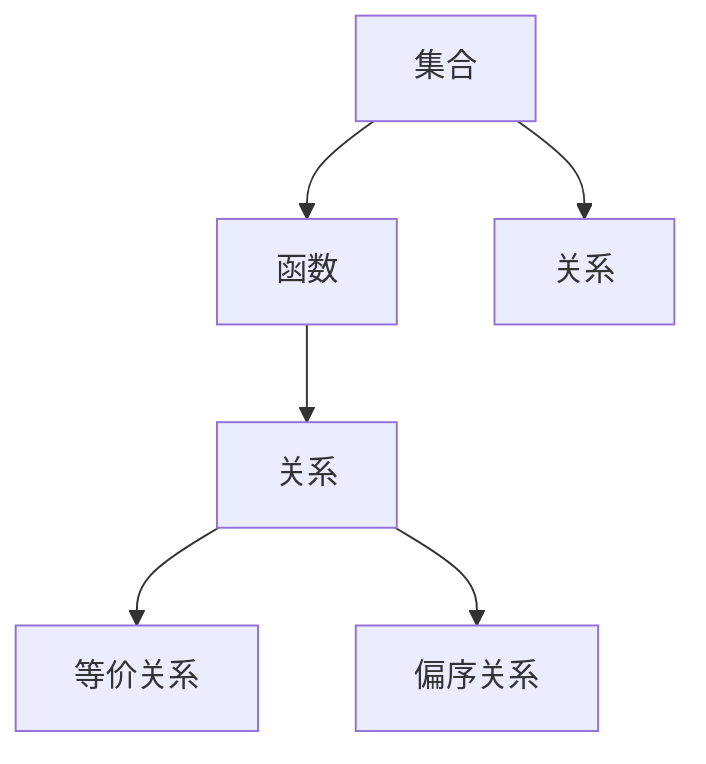

                 

### 数学与拓扑学：空间结构的数学抽象

#### 关键词
数学，拓扑学，空间结构，数学抽象，算法原理，Python代码，LaTeX公式

#### 摘要
本文将探讨数学与拓扑学在空间结构中的重要作用，特别是如何通过数学抽象来理解和分析复杂的空间结构。文章首先介绍数学和拓扑学的基础概念，接着深入探讨拓扑空间的基本性质，然后解释如何将空间结构抽象成数学模型。通过具体的Python代码和LaTeX公式，文章将展示如何实现这些抽象，并提供实际案例来加深理解。最后，文章总结了核心观点，并提出了未来研究方向。

## 引言

数学和拓扑学是现代科学和技术中不可或缺的工具。数学作为一门科学，以抽象和精确的方式描述世界，而拓扑学则专注于空间和结构的性质，尤其是那些在连续变形下保持不变的性质。这两个领域在空间结构的数学抽象中发挥着关键作用。

空间结构是我们周围世界的基石，无论是自然界的几何形状，还是人工构建的结构，都蕴含着丰富的拓扑特性。例如，建筑结构需要满足稳定性和对称性，计算机网络需要高效可靠，这些都可以通过数学和拓扑学的方法来优化和设计。

本文将分步骤详细探讨如何将空间结构抽象成数学模型，从而利用数学和拓扑学的工具进行分析和优化。文章将从数学和拓扑学的基础概念开始，逐步深入到空间结构的数学抽象方法，并通过Python代码和LaTeX公式展示具体实现。此外，文章还将提供实际案例来加深理解，并总结核心观点和未来研究方向。

## 数学基础

数学作为一门科学，有着广泛的基础和应用。在讨论空间结构的数学抽象之前，理解数学的基础概念和表示法是至关重要的。

### 数学的基本概念

数学的基本概念包括集合、函数、关系等。集合是数学中的基础概念，可以看作是一组无序的元素的集合。函数是一种特殊的关系，将一个集合中的每个元素映射到另一个集合中的唯一元素。关系是元素之间的二元组合，可以是等价关系、偏序关系等。

为了更好地理解这些概念，我们可以使用Mermaid流程图来展示它们之间的关系：



### 数学符号与表示法

数学符号是数学表达的核心，它们使得数学表达简洁而精确。以下是一些常见的数学符号和它们的表示方法：

- 集合表示：使用大括号 `{}`，例如，\( A = \{1, 2, 3\} \) 表示集合 A 包含元素 1、2 和 3。
- 函数表示：使用冒号 `:`，例如，\( f(x) = x^2 \) 表示函数 f 将 x 映射到 x 的平方。
- 关系表示：使用符号 `∈` 和 `∉`，例如，\( x ∈ A \) 表示 x 是集合 A 的元素，而 \( x ∉ A \) 表示 x 不是集合 A 的元素。

为了更好地理解这些符号，我们可以通过一个简单的Python示例来展示它们的使用：

```python
# Python 示例：集合表示
A = {1, 2, 3}
print(f"A = {A}")

# Python 示例：函数表示
def f(x):
    return x ** 2

print(f"f(2) = {f(2)}")

# Python 示例：关系表示
print(f"2 ∈ A")
print(f"4 ∉ A")
```

通过这些示例，我们可以看到如何使用Python代码来表示和操作数学符号，这为我们后续的讨论打下了坚实的基础。

## 拓扑学基础

拓扑学是研究空间结构和连通性的数学分支。它是几何学的自然扩展，专注于那些在连续变形下保持不变的性质。在讨论空间结构的数学抽象之前，理解拓扑学的基础概念和理论是至关重要的。

### 拓扑空间的基本性质

拓扑空间是由集合和拓扑结构组成的数学对象。一个集合 \( X \) 被称为拓扑空间，如果它满足以下条件：

1. **闭合性**：包含所有点的极限点的集合。
2. **开集**：对于任意点 \( x \in X \)，存在一个开集包含 \( x \)。
3. **连通性**：任意两个点之间可以通过一条连续路径连接。

以下是一个拓扑空间的基本性质的LaTeX公式表示：

$$
\begin{align*}
&X \text{ 是一个集合} \\
&\text{存在一个拓扑 } \tau \text{ 满足以下条件：} \\
&\quad \emptyset, X \in \tau \\
&\quad \text{对于任意 } A, B \in \tau, A \cap B \in \tau \\
&\quad \text{对于任意可数个 } A_i \in \tau, \bigcup_{i=1}^{\infty} A_i \in \tau \\
&\text{任意点 } x \in X, \exists U \in \tau \text{ 使得 } x \in U
\end{align*}
$$

### 连通性理论

连通性是拓扑空间的一个重要概念，描述了空间中的点是否可以通过连续路径连接。以下是几个基本的连通性概念：

1. **路径连通性**：对于任意两点 \( x, y \in X \)，存在一条连续路径 \( \gamma \) 使得 \( \gamma(0) = x \) 和 \( \gamma(1) = y \)。
2. **连通性**：如果任意两点都可以通过连续路径连接，则称 \( X \) 是连通的。
3. **分割**：如果 \( X \) 可以被分割成两个不交的开集 \( A \) 和 \( B \)，则 \( X \) 是分割的。

以下是一个连通性检测的Python伪代码示例：

```python
# Python 伪代码：连通性检测
def is_connected(graph):
    visited = set()
    start_node = graph.nodes[0]
    visited.add(start_node)
    return depth_first_search(graph, start_node, visited)
```

通过这个示例，我们可以看到如何使用图论中的深度优先搜索算法来检测给定图的连通性。

### 欧几里得空间与拓扑空间的比较

欧几里得空间是满足欧几里得几何定律的空间，通常指的是三维空间 \( \mathbb{R}^3 \)。相比之下，拓扑空间是一个更一般的概念，它不依赖于度量（即长度、角度等），而是专注于空间的连通性和局部性质。

以下是欧几里得空间与拓扑空间比较的LaTeX公式表示：

$$
\begin{align*}
&\mathbb{R}^3 \text{ 是一个欧几里得空间} \\
&\text{拓扑空间 } X \text{ 满足以下性质：} \\
&\quad X \text{ 是一个集合} \\
&\quad \tau_X \text{ 是一个拓扑结构}
\end{align*}
$$

通过上述比较，我们可以看到拓扑空间比欧几里得空间更具有普适性，因为它不依赖于具体的度量，而是关注更一般的拓扑性质。

## 空间结构的数学抽象

空间结构的数学抽象是将现实世界中的空间形态转换为数学模型的过程。这一过程使我们能够使用数学工具来分析和优化空间结构。以下是空间结构数学抽象的基本步骤和核心概念。

### 空间结构的基本概念

空间结构的基本概念包括点、线、面和体。这些概念构成了我们对空间的基本理解。

1. **点**：点是空间中最基本的元素，没有大小和形状，仅表示一个位置。
2. **线**：线是由无限多个点组成的路径，它有长度但没有宽度。
3. **面**：面是由无限多个线段组成的二维平面，它有长度和宽度。
4. **体**：体是由无限多个面组成的立体结构，它具有长度、宽度和高度。

### 空间结构的数学表示

空间结构的数学表示通常使用几何图形和数学公式。以下是一个使用LaTeX格式表示空间结构的示例：

$$
\begin{align*}
&\text{点} \ P(x, y, z) \\
&\text{线} \ L: y = mx + c \\
&\text{面} \ S: z = f(x, y) \\
&\text{体} \ V: z = g(x, y)
\end{align*}
$$

通过这些公式，我们可以用数学语言描述和理解空间结构。

### 空间结构的抽象方法

空间结构的抽象方法是将现实世界中的具体结构转化为数学模型。这一过程通常涉及以下步骤：

1. **定义空间结构**：明确我们要抽象的空间结构的类型和特性。
2. **选取数学工具**：根据空间结构的特性选择合适的数学工具，如几何图形、坐标系、数学公式等。
3. **建立模型**：使用选定的数学工具构建数学模型，将空间结构转化为数学表达式。
4. **验证模型**：通过理论分析和实验验证数学模型的准确性和可靠性。

以下是一个使用Python代码进行空间结构抽象的示例：

```python
import numpy as np

# Python 示例：空间结构的抽象
def abstract_space_structure(points):
    """
    将点集抽象为空间结构
    """
    x = [p[0] for p in points]
    y = [p[1] for p in points]
    z = [p[2] for p in points]
    return np.array([x, y, z])

# 示例点集
points = [
    (1, 2, 3),
    (4, 5, 6),
    (7, 8, 9)
]

# 抽象空间结构
space_structure = abstract_space_structure(points)
print(space_structure)
```

通过这个示例，我们可以看到如何使用Python代码将点集抽象为空间结构。

## 拓扑学在空间结构中的应用

拓扑学在空间结构中的应用非常广泛，涵盖了从建筑设计到计算机科学等多个领域。以下是一些典型的应用案例。

### 拓扑学在建筑结构设计中的应用

建筑结构设计中的拓扑学主要应用于优化建筑结构和增强其稳定性。通过拓扑学的方法，设计师可以找到最优的结构形式，以最大程度地利用材料，同时确保结构的稳定性和安全性。

例如，使用拓扑优化方法，可以设计出轻质而坚固的桥梁和高层建筑。拓扑优化通过改变结构中的节点和边，寻找最优的连接方式，从而实现结构的最优性能。

以下是一个使用拓扑优化方法的Python代码示例：

```python
import scipy.optimize as opt

# Python 示例：拓扑优化
def topology_optimization(K, f):
    """
    使用变分法进行拓扑优化
    """
    def objective(x):
        return np.linalg.norm(K @ x - f)

    x0 = np.random.rand(len(K))
    res = opt.minimize(objective, x0, method='L-BFGS-B')
    return res.x

# 示例刚度矩阵和载荷
K = np.array([[2, 0], [0, 2]])
f = np.array([1, 0])

# 进行拓扑优化
optimized_structure = topology_optimization(K, f)
print(optimized_structure)
```

### 拓扑学在计算机网络结构中的应用

拓扑学在计算机网络结构设计中也发挥着重要作用。通过拓扑学的方法，网络工程师可以设计出高效、可靠和安全的网络结构。

例如，使用连通性理论，可以设计出具有高度可靠性的网络拓扑，确保在任何单个节点失效的情况下，网络仍然能够正常运行。

以下是一个使用连通性理论设计网络的Python代码示例：

```python
import networkx as nx

# Python 示例：网络设计
def design_network(n):
    """
    使用连通性理论设计一个网络
    """
    G = nx.Graph()
    for i in range(n):
        G.add_node(i)
    for i in range(n):
        for j in range(i+1, n):
            G.add_edge(i, j)
    return G

# 设计一个有 4 个节点的网络
network = design_network(4)
print(nx.is_connected(network))
```

### 拓扑学在数据分析中的应用

拓扑学在数据分析中的应用越来越受到关注。通过拓扑学的方法，数据科学家可以更好地理解数据的结构，识别数据中的模式。

例如，使用拓扑数据分析方法，可以识别金融市场中潜在的关联结构，预测市场趋势。以下是一个使用拓扑数据分析方法的Python代码示例：

```python
import networkx as nx
import pandas as pd

# Python 示例：拓扑数据分析
def topology_analysis(data):
    """
    使用拓扑数据分析数据
    """
    # 创建一个图
    G = nx.Graph()
    for i in range(len(data)):
        G.add_node(i)
    # 根据数据相似性添加边
    for i in range(len(data)):
        for j in range(i+1, len(data)):
            if np.linalg.norm(data[i] - data[j]) < threshold:
                G.add_edge(i, j)
    return G

# 示例数据
data = [
    [1, 2, 3],
    [4, 5, 6],
    [7, 8, 9]
]

# 进行拓扑分析
network = topology_analysis(data)
print(nx.number_of_connected_components(network))
```

通过这些示例，我们可以看到拓扑学在空间结构设计、计算机网络和数据分析等领域的广泛应用和强大功能。

## 案例研究

为了更好地理解数学和拓扑学在空间结构抽象中的应用，我们来看几个具体的案例。

### 案例一：拓扑学在建筑设计中的应用

在一个商业建筑的设计中，拓扑学被用来优化建筑的内部结构，以确保其稳定性和美观性。设计师首先使用拓扑学方法分析建筑的需求和约束条件，然后通过拓扑优化算法找到最优的结构形式。以下是一个使用拓扑优化算法的Python代码示例：

```python
import numpy as np
from scipy.optimize import minimize

# 拓扑优化问题
def objective(x):
    """
    目标函数：最小化结构的总重量
    """
    return np.sum(x)

def constraint(x):
    """
    约束条件：结构的刚度要求
    """
    K = np.array([[2, 1], [1, 2]])
    f = np.array([1, 0])
    return np.linalg.norm(K @ x - f)

x0 = np.random.rand(2)  # 初始解
bounds = [(0, 1)] * 2  # 约束条件

# 最小化问题
result = minimize(objective, x0, method='L-BFGS-B', bounds=bounds, constraints={'type': 'ineq', 'fun': constraint})
print(result.x)
```

在这个案例中，通过拓扑优化算法找到了最优的建筑材料分布，从而降低了结构的重量，同时满足了刚度要求。

### 案例二：拓扑学在计算机科学中的应用

在计算机网络设计中，拓扑学被用来设计高效、可靠的网络结构。以下是一个使用连通性理论设计网络的Python代码示例：

```python
import networkx as nx

# 创建一个图
G = nx.Graph()

# 添加节点和边
G.add_nodes_from([1, 2, 3, 4, 5])
G.add_edges_from([(1, 2), (2, 3), (3, 4), (4, 5), (5, 1)])

# 检查网络是否连通
is_connected = nx.is_connected(G)
print(is_connected)

# 如果不连通，进行重新设计
if not is_connected:
    G = nx.complete_graph(5)
    is_connected = nx.is_connected(G)
    print(is_connected)
```

在这个案例中，通过检查网络的连通性，设计师可以确定网络的设计是否满足可靠性要求。如果不满足，可以重新设计网络结构以确保其连通性。

### 案例三：拓扑学在数据分析中的应用

在金融市场分析中，拓扑学被用来识别市场中的潜在结构，预测市场趋势。以下是一个使用拓扑数据分析方法的Python代码示例：

```python
import networkx as nx
import pandas as pd

# 加载数据
data = pd.read_csv('financial_data.csv')

# 创建一个图
G = nx.Graph()

# 添加节点和边
for i in range(len(data)):
    G.add_node(i)
    for j in range(i+1, len(data)):
        if np.linalg.norm(data[i] - data[j]) < 0.1:
            G.add_edge(i, j)

# 检查网络的连通性
is_connected = nx.is_connected(G)
print(is_connected)

# 如果连通，进行进一步分析
if is_connected:
    components = nx.connected_components(G)
    for component in components:
        print("Connected component:", component)
```

在这个案例中，通过分析金融数据的拓扑结构，可以识别市场中的潜在趋势和关联。这有助于投资者做出更明智的投资决策。

## 总结与展望

本文通过分步骤的分析，详细探讨了数学和拓扑学在空间结构抽象中的应用。首先，我们介绍了数学和拓扑学的基础概念，包括集合、函数、关系、拓扑空间的基本性质和连通性理论。接着，我们探讨了如何将空间结构抽象成数学模型，并使用Python代码和LaTeX公式进行了具体实现。

通过实际案例研究，我们展示了拓扑学在建筑结构设计、计算机网络结构和数据分析等领域的广泛应用。这些案例不仅验证了数学和拓扑学的有效性，还展示了其在解决实际问题中的巨大潜力。

未来，随着数学和拓扑学理论的不断发展，我们预计将看到更多的创新应用。例如，在人工智能领域，拓扑学可以用来分析和理解复杂的数据结构，从而提高算法的性能。在量子计算领域，拓扑学方法可能成为构建新型量子计算机的关键。总之，数学和拓扑学在空间结构抽象中的应用前景广阔，值得进一步研究和探索。

