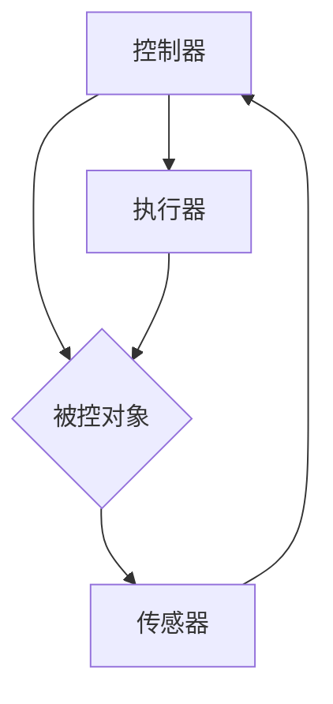
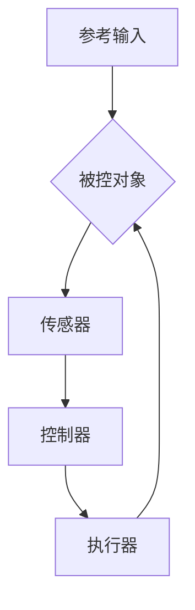

                 

### 1.4 控制系统的基础架构与组件

在控制系统的设计与实现中，理解其基础架构与组件至关重要。一个典型的控制系统通常包括以下几个基本组件：

- **控制器**：控制系统的核心，负责根据接收到的输入信息产生控制信号。
- **被控对象**：控制系统的操作对象，其行为和特性会影响控制系统的性能。
- **传感器**：用于检测被控对象的当前状态，并将这些信息反馈给控制器。
- **执行器**：根据控制器的输出信号，对被控对象进行实际的操作。

这些组件相互协作，形成了一个闭环控制系统。以下是一个简化的Mermaid流程图，展示了这些组件之间的关系：

#### 控制器的功能

控制器的主要功能是根据传感器收集的信息，通过某种控制算法，产生控制信号来调整执行器的操作，以实现对被控对象的行为进行控制。控制算法的选择取决于系统的具体需求。

- **开环控制**：控制器仅根据输入信号产生控制信号，不考虑被控对象的实际状态。
- **闭环控制**：控制器不仅根据输入信号，还根据被控对象的实际状态来调整控制信号。

#### 被控对象的特性

被控对象的特性直接影响控制系统的性能。一个典型的被控对象可能具有以下特性：

- **动态性**：系统的状态随时间变化。
- **稳定性**：系统能否保持在其期望的操作点附近。
- **非线性**：系统的行为不能用简单的线性模型来描述。

#### 传感器的选择

传感器的选择至关重要，因为它们的精度和响应速度将影响控制系统的性能。常见的传感器类型包括：

- **温度传感器**：测量温度变化。
- **压力传感器**：测量压力变化。
- **速度传感器**：测量速度变化。

#### 执行器的类型

执行器是实现控制动作的核心部件，其类型和性能直接影响控制效果。常见的执行器类型包括：

- **电动机**：广泛应用于各种自动化系统中。
- **气动执行器**：用于气动控制系统。
- **液压执行器**：用于液压控制系统。

通过了解控制系统的基础架构与组件，我们可以更好地理解控制系统的设计原理和实现方法，从而在后续章节中深入探讨控制系统的数学描述和设计方法。

### 1.5 控制系统的设计原则与方法

设计一个高效的控制系统不仅需要理解其基础组件和功能，还需要遵循一系列设计原则和方法。以下是一些关键的设计原则：

#### 可行性原则

确保系统设计在技术和经济上可行。这包括选择合适的控制器、传感器和执行器，以及确定系统的规模和复杂性。

#### 可靠性原则

控制系统必须能够在各种条件下稳定运行。这涉及到对系统进行详细的性能测试和故障分析，确保其在异常情况下也能保持稳定。

#### 灵活性原则

系统设计应考虑未来的扩展和适应性。例如，传感器和执行器的接口应设计为易于更换，以便于升级或替换。

#### 经济性原则

在保证性能和可靠性的前提下，尽量降低系统成本。这可以通过优化硬件选型、减少不必要的组件和简化设计来实现。

#### 可维护性原则

系统设计应便于维护和维修。良好的设计应使故障诊断和修复变得容易，从而减少系统停机时间和维护成本。

在设计控制系统时，可以采用以下方法：

- **仿真与建模**：使用计算机模拟来测试和优化系统性能。通过数学模型描述系统的行为，预测不同控制策略的效果。
- **迭代开发**：通过逐步迭代的方式，不断优化系统设计。每次迭代都可以针对特定的性能指标进行改进。
- **模块化设计**：将系统划分为独立的模块，每个模块负责特定的功能。这种方法可以提高系统的可维护性和可扩展性。

通过遵循这些设计原则和方法，我们可以开发出高效、可靠且经济实用的控制系统。

### 1.6 数学方法在控制系统分析中的应用

数学方法在控制系统分析中扮演着至关重要的角色。通过数学建模和解析，我们可以对控制系统的动态行为进行精确分析，从而优化其性能。以下是一些关键数学方法及其在控制系统分析中的应用：

#### 微分方程

微分方程是描述动态系统行为的主要数学工具。对于线性时不变系统（LTI系统），可以使用以下类型的微分方程来建模：

- **状态空间模型**：
  \[
  \dot{x}(t) = A x(t) + B u(t)
  \]
  \[
  y(t) = C x(t) + D u(t)
  \]

  其中，\(x(t)\) 是系统的状态向量，\(u(t)\) 是输入向量，\(y(t)\) 是输出向量，\(A\)、\(B\)、\(C\) 和 \(D\) 是系统的参数矩阵。

- **传递函数模型**：
  \[
  G(s) = \frac{Y(s)}{U(s)} = C(sI - A)^{-1}B + D
  \]

  其中，\(G(s)\) 是系统的传递函数，\(s\) 是复数变量。

#### 傅里叶变换

傅里叶变换是分析线性时不变系统频率响应的重要工具。通过傅里叶变换，我们可以将系统的时域行为转换到频域，从而更容易分析其频率特性：

- **时域输入和频域响应**：
  \[
  X(f) = F[x(t)]
  \]
  \[
  Y(f) = F[y(t)]
  \]

  其中，\(X(f)\) 和 \(Y(f)\) 分别是输入和输出的频谱。

#### 拉普拉斯变换

拉普拉斯变换在控制系统分析中用于处理初始条件和非稳定系统。通过拉普拉斯变换，我们可以将复杂的微分方程转换为代数方程，从而简化分析过程：

- **拉普拉斯变换定义**：
  \[
  \mathcal{L}\{x(t)\} = X(s) = \int_{0}^{\infty} x(t)e^{-st} dt
  \]

  通过逆拉普拉斯变换，我们可以得到系统的时域响应。

#### 状态空间分析

状态空间分析是一种全面描述系统动态行为的方法。它包括以下几个重要概念：

- **稳定性分析**：判断系统是否稳定，常用方法包括Routh-Hurwitz判据和特征值分析。
- **可控性和可观性**：判断系统是否可以通过控制输入实现期望状态，或者是否可以观测到系统的内部状态。
- **最优控制**：通过优化控制策略，使系统达到最佳性能。

### 实例分析

假设一个简单的线性时不变系统，其状态空间模型为：
\[
\dot{x}(t) = \begin{bmatrix} -1 & 1 \\ 0 & -2 \end{bmatrix} x(t) + \begin{bmatrix} 0 \\ 1 \end{bmatrix} u(t)
\]
\[
y(t) = \begin{bmatrix} 1 & 0 \end{bmatrix} x(t)
\]

我们可以通过求解微分方程来得到系统的状态响应：
\[
x(t) = e^{At}x(0) + \int_{0}^{t} e^{A(t-\tau)}B u(\tau) d\tau
\]

进一步，我们可以使用特征值分析来判断系统的稳定性。系统的特征方程为：
\[
\det(sI - A) = \begin{vmatrix} s+1 & -1 \\ 0 & s+2 \end{vmatrix} = (s+1)(s+2)
\]

由于所有特征值的实部均为负，系统是稳定的。

通过数学方法的分析，我们可以深入了解控制系统的动态行为，从而为系统设计提供可靠的依据。下一节，我们将进一步探讨反馈系统在控制论中的应用及其数学描述。

### 1.7 反馈系统在控制论中的应用

反馈系统是控制论的核心概念之一，它在控制工程、自动化、计算机科学等领域中发挥着至关重要的作用。反馈系统的基本思想是通过将系统的输出部分返回到输入部分，实现对系统行为的动态调整和优化。

#### 反馈系统的基本构成

一个典型的反馈系统由以下主要部分组成：

1. **参考输入**：设定系统的期望行为，通常是一个固定的或者随时间变化的信号。
2. **被控对象**：系统的操作对象，其行为和特性直接影响系统的输出。
3. **传感器**：用于检测系统的当前状态，并将这些信息反馈给控制器。
4. **控制器**：根据传感器反馈的信息和参考输入，产生控制信号以调整执行器的操作。
5. **执行器**：根据控制信号对被控对象进行实际的操作，以实现系统的期望行为。

这些部分相互协作，形成了一个闭环控制系统。以下是反馈系统的基本结构示意图：

#### 反馈系统的优点

反馈系统具有以下几个显著优点：

1. **自适应能力**：通过不断调整控制信号，反馈系统能够适应外部环境和内部变化，从而提高系统的稳定性和鲁棒性。
2. **误差修正**：反馈系统能够检测并纠正系统的误差，使输出尽可能接近参考输入，从而实现高精度控制。
3. **自调节**：反馈系统能够根据实际情况自动调节控制策略，无需人工干预，从而简化系统操作和维护。
4. **优化性能**：通过优化控制信号，反馈系统可以提高系统的响应速度和稳态性能。

#### 反馈系统的分类

根据反馈信号的作用方式，反馈系统可以分为以下几种类型：

1. **正反馈**：输出信号返回到输入端，加强原始信号的效应。正反馈系统通常用于振荡器和某些信号放大器中。
2. **负反馈**：输出信号返回到输入端，抵消或减弱原始信号的效应。负反馈系统广泛应用于控制系统和信号处理系统中，以实现稳定性和精度优化。

#### 反馈系统在控制论中的应用

在控制论中，反馈系统被广泛应用于各种控制任务中，包括：

- **位置控制**：如机器人、数控机床等。
- **速度控制**：如电机驱动系统、飞行控制系统等。
- **温度控制**：如恒温器、加热器等。
- **流量控制**：如液体流量控制、气体流量控制等。
- **压力控制**：如液压系统、气压系统等。

#### 数学描述

在数学描述中，反馈系统通常通过状态空间模型来表示：

- **状态空间模型**：
  \[
  \dot{x}(t) = A x(t) + B u(t)
  \]
  \[
  y(t) = C x(t) + D u(t)
  \]

  其中，\(x(t)\) 是系统的状态向量，\(u(t)\) 是输入向量，\(y(t)\) 是输出向量，\(A\)、\(B\)、\(C\) 和 \(D\) 是系统矩阵。

- **传递函数模型**：
  \[
  G(s) = \frac{Y(s)}{U(s)} = C(sI - A)^{-1}B + D
  \]

  其中，\(G(s)\) 是系统的传递函数，\(s\) 是复数变量。

通过数学描述，我们可以对反馈系统进行稳定性分析、性能优化和设计优化。下一节，我们将进一步探讨反馈系统在控制论中的数学描述和分析方法。

### 1.8 反馈系统的数学描述与分析方法

反馈系统在控制论中具有核心地位，其数学描述与分析方法是理解和设计控制系统的重要工具。以下将详细介绍反馈系统的数学描述、常见分析方法和稳定性分析。

#### 数学描述

一个典型的反馈控制系统可以通过状态空间模型或传递函数模型来描述。

- **状态空间模型**：
  \[
  \dot{x}(t) = A x(t) + B u(t)
  \]
  \[
  y(t) = C x(t) + D u(t)
  \]

  其中，\(x(t)\) 是系统的状态向量，\(u(t)\) 是输入向量，\(y(t)\) 是输出向量，\(A\)、\(B\)、\(C\) 和 \(D\) 分别是系统矩阵。

- **传递函数模型**：
  \[
  G(s) = \frac{Y(s)}{U(s)} = C(sI - A)^{-1}B + D
  \]

  其中，\(G(s)\) 是系统的传递函数，\(s\) 是复数变量。

#### 常见分析方法

反馈系统的分析主要包括以下几种方法：

- **时域分析**：通过求解系统的微分方程，分析系统的瞬态响应和稳态响应。时域分析直观，能够展示系统的动态行为。
- **频域分析**：通过傅里叶变换或拉普拉斯变换，将系统转换到频域进行分析。频域分析可以揭示系统的频率特性和稳定性。
- **根轨迹分析**：通过绘制系统的根轨迹图，分析系统在不同输入下的稳定性。根轨迹分析适用于线性时不变系统。
- **波特图（Bode Plot）**：通过绘制系统的增益和相位响应，分析系统的频率响应特性。波特图适用于线性时不变系统。

#### 稳定性分析

稳定性分析是反馈系统设计中的关键环节。以下介绍几种常用的稳定性分析方法：

- **特征值分析**：通过求解系统的特征值，判断系统的稳定性。对于线性时不变系统，如果所有特征值的实部均为负，系统是稳定的。
- **Routh-Hurwitz判据**：通过Routh-Hurwitz阵列，判断系统特征方程的根是否都在左半平面。如果阵列中的所有主对角元素均为正，系统是稳定的。
- **Nyquist图**：通过Nyquist图，分析系统在不同频率下的稳定性。如果Nyquist图的轨迹不包围-1点，系统是稳定的。

#### 实例分析

假设一个简单的线性反馈系统，其状态空间模型为：
\[
\dot{x}(t) = \begin{bmatrix} -1 & 1 \\ 0 & -2 \end{bmatrix} x(t) + \begin{bmatrix} 0 \\ 1 \end{bmatrix} u(t)
\]
\[
y(t) = \begin{bmatrix} 1 & 0 \end{bmatrix} x(t)
\]

我们可以通过特征值分析来判断系统的稳定性。系统的特征方程为：
\[
\det(sI - A) = \begin{vmatrix} s+1 & -1 \\ 0 & s+2 \end{vmatrix} = (s+1)(s+2)
\]

由于所有特征值的实部均为负，系统是稳定的。

通过上述数学描述和分析方法，我们可以对反馈系统进行深入理解和优化设计。下一节，我们将讨论线性反馈系统的稳定性分析。

### 1.9 线性反馈系统的稳定性分析

线性反馈系统在控制论和工程应用中占据重要地位，其稳定性分析是设计闭环控制系统的基础。线性反馈系统的稳定性分析主要包括以下几个关键步骤：

#### 稳定性概念

稳定性是指一个系统在初始扰动消除后，能够恢复到其原始平衡状态的能力。在数学上，一个线性时不变（LTI）系统是稳定的，如果对于任何初始扰动，系统的输出响应最终会衰减至零。

#### 稳定性的判定方法

以下几种方法常用于判断线性反馈系统的稳定性：

1. **特征值分析**：
   对于状态空间模型 \( \dot{x}(t) = A x(t) \)，系统的稳定性取决于矩阵 \( A \) 的特征值。如果 \( A \) 的所有特征值的实部均为负，则系统是稳定的。

2. **Routh-Hurwitz判据**：
   通过Routh-Hurwitz判据，我们可以判断系统特征方程的根是否全部位于左半平面。具体步骤如下：
   - 构造Routh-Hurwitz阵列，即系统特征方程 \( \det(sI - A) \) 的系数阵列。
   - 如果阵列中的所有主对角元素均为正，则系统是稳定的。

3. **根轨迹分析**：
   对于传递函数模型 \( G(s) = \frac{Y(s)}{U(s)} \)，根轨迹分析通过绘制系统在不同输入下的根轨迹图，来判断系统的稳定性。如果根轨迹不包围稳定点，则系统是稳定的。

4. **Nyquist图**：
   通过Nyquist图，我们可以分析系统在不同频率下的稳定性。如果Nyquist图的轨迹不包围-1点，则系统是稳定的。

#### 实例分析

考虑一个简单的线性反馈系统，其状态空间模型为：
\[
\dot{x}(t) = \begin{bmatrix} -1 & 1 \\ 0 & -2 \end{bmatrix} x(t)
\]

首先，我们可以通过特征值分析来判断系统的稳定性。系统的特征方程为：
\[
\det(sI - A) = \begin{vmatrix} s+1 & -1 \\ 0 & s+2 \end{vmatrix} = (s+1)(s+2)
\]

由于特征值 \( s = -1 \) 和 \( s = -2 \) 的实部均为负，系统是稳定的。

接下来，我们使用Routh-Hurwitz判据验证。构造Routh-Hurwitz阵列：
\[
\begin{array}{c|cc}
s^2 & 1 & 1 \\
s^1 & 1 & 0 \\
s^0 & 1 & \\
\end{array}
\]

由于第一行主对角元素均为正，系统是稳定的。

此外，根轨迹分析和Nyquist图也将显示系统的根全部位于左半平面，进一步验证了系统的稳定性。

#### 影响稳定性的因素

线性反馈系统的稳定性受到以下几个因素的影响：

1. **系统参数**：系统的参数矩阵 \( A \) 决定了系统的动态特性。参数的不稳定性会导致系统的非线性行为，从而影响稳定性。
2. **外部干扰**：外部干扰如噪声和扰动会影响系统的输入，进而影响系统的稳定性。
3. **初始条件**：系统的初始状态会影响其响应。对于某些系统，初始条件可能导致不稳定的状态。

通过上述步骤和方法，我们可以对线性反馈系统进行稳定性分析，确保系统在设计和应用中保持稳定。接下来，我们将讨论线性反馈系统的设计方法。

### 1.10 线性反馈系统的设计方法

设计一个线性反馈系统需要考虑多个因素，包括系统的性能指标、稳定性和鲁棒性。以下介绍线性反馈系统的设计方法，包括设计原则、步骤和常见算法。

#### 设计原则

1. **稳定性**：确保系统在所有操作条件下保持稳定。
2. **性能**：满足系统对响应速度、稳态误差和瞬态过冲等性能要求。
3. **鲁棒性**：系统能够抵抗外部扰动和参数变化的影响。
4. **可操作性**：设计应便于系统操作和维护。

#### 设计步骤

1. **系统建模**：建立系统的数学模型，通常采用状态空间模型或传递函数模型。
2. **性能要求**：根据应用需求，定义系统的性能指标，如稳态误差、瞬态响应时间等。
3. **稳定性分析**：通过特征值分析、Routh-Hurwitz判据等，确保系统在所有操作条件下稳定。
4. **控制器设计**：选择合适的控制算法，如PID控制、状态反馈控制、观测器控制等，设计控制器的参数。
5. **仿真验证**：通过计算机仿真，验证系统是否满足性能要求。
6. **硬件实现**：将控制算法和系统模型转化为实际的硬件实现，并进行测试和优化。

#### 常见算法

1. **PID控制**：
   PID（比例-积分-微分）控制器是最常见的控制算法之一。其控制律为：
   \[
   u(t) = K_p e(t) + K_i \int_{0}^{t} e(\tau) d\tau + K_d \frac{de(t)}{dt}
   \]
   其中，\( e(t) \) 是误差信号，\( K_p \)、\( K_i \) 和 \( K_d \) 分别是比例、积分和微分系数。

2. **状态反馈控制**：
   状态反馈控制通过选择合适的反馈矩阵 \( K \)，将系统转化为稳定的形式。其控制律为：
   \[
   u(t) = -K x(t)
   \]
   其中，\( x(t) \) 是系统的状态向量。

3. **观测器控制**：
   对于无法直接测量的状态变量，可以使用观测器来估计状态。然后，使用观测器输出进行控制。常见的是Luenberger观测器和Kalman滤波器。

#### 设计案例

以下是一个简单的PID控制器设计案例：

1. **系统建模**：
   考虑一个一阶系统，其传递函数为：
   \[
   G(s) = \frac{K}{Ts + 1}
   \]
   其中，\( K \) 是增益，\( T \) 是时间常数。

2. **性能要求**：
   设定系统在单位阶跃输入下的稳态误差为0，瞬态响应时间小于1秒。

3. **稳定性分析**：
   由于系统为一阶系统，其特征值仅有一个，可以通过调整 \( K \) 和 \( T \) 来确保系统的稳定性。

4. **控制器设计**：
   使用PID控制算法，设计PID参数 \( K_p \)、\( K_i \) 和 \( K_d \)。通常，可以通过经验公式或Ziegler-Nichols方法来确定这些参数。

5. **仿真验证**：
   在仿真环境中，验证系统是否满足性能要求。

6. **硬件实现**：
   将PID控制算法实现为硬件，如微控制器或PLC，并进行实际测试和优化。

通过上述步骤和方法，我们可以设计一个满足性能要求的线性反馈系统。下一节，我们将探讨非线性反馈系统的设计方法。

### 1.11 非线性反馈系统的基本理论

非线性反馈系统在控制工程和实际应用中具有重要意义，因为许多实际系统表现出非线性特性。非线性反馈系统的基本理论包括非线性系统的定义、特性和数学模型。

#### 非线性系统的定义

非线性系统是指其输出与输入之间存在非线性关系的系统。与线性系统相比，非线性系统具有以下特点：

- **非线性的动态特性**：系统的动态行为不能简单地用线性模型来描述。
- **多值性**：系统的状态空间可能包含多个值。
- **混沌行为**：在某些条件下，非线性系统可能会表现出混沌现象。

#### 非线性系统的特性

非线性系统的特性复杂多样，以下是一些常见的特性：

- **不可预测性**：非线性系统的行为可能无法准确预测，特别是在系统接近临界点或混沌区域时。
- **动态多样性**：非线性系统可以表现出稳定的周期解、复杂的混沌解等多种动态行为。
- **非稳定点**：非线性系统可能具有不稳定的平衡点，这些点可能会随着外部扰动而崩溃。

#### 数学模型

非线性系统的数学模型通常包括以下几种：

- **微分方程模型**：通过一组微分方程描述系统的动态行为。例如，Liénard方程是描述非线性振动系统的一种常用模型。
- **传递函数模型**：使用非线性传递函数描述系统的输入输出关系。非线性传递函数可以是分段线性、多项式或其他复杂的函数形式。
- **映射模型**：通过迭代映射关系描述系统的动态行为。例如，Logistic映射是一个典型的非线性迭代模型。

以下是一个简单的非线性系统示例，其数学模型为Liénard方程：
\[
\ddot{x}(t) + a x(t) + b \dot{x}(t) + cx(t)^3 = f(t)
\]

其中，\( x(t) \) 是系统的状态，\( f(t) \) 是外部输入，\( a \)、\( b \) 和 \( c \) 是系统参数。

通过理解非线性系统的定义、特性和数学模型，我们可以更好地分析和设计非线性反馈系统。下一节，我们将讨论非线性反馈系统的稳定性分析。

### 1.12 非线性反馈系统的稳定性分析

非线性反馈系统的稳定性分析是理解和设计复杂系统的重要环节。稳定性分析旨在判断系统在特定条件下是否能够保持平衡状态，以及平衡状态的稳定性。以下介绍几种常用的非线性反馈系统稳定性分析方法。

#### Lyapunov方法

Lyapunov方法是一种广泛使用的稳定性分析工具，特别适用于非线性系统的稳定性分析。基本思想是通过构造一个Lyapunov函数，证明系统的动态行为在Lyapunov函数的负梯度方向上收缩到平衡点。

- **Lyapunov函数**：一个Lyapunov函数 \( V(x) \) 满足以下条件：
  - \( V(x) \) 是连续可微的。
  - \( V(x) \) 在平衡点 \( x^* \) 处取得最小值。
  - 沿系统轨迹，\( \dot{V}(x) = \nabla V(x) \cdot f(x) \leq 0 \)。

  如果上述条件满足，则系统在平衡点 \( x^* \) 是渐近稳定的。

- **例子**：考虑一个非线性系统
  \[
  \dot{x}(t) = -x(t) + x(t)^3,
  \]
  选择Lyapunov函数
  \[
  V(x) = \frac{1}{2} x^2.
  \]
  计算 \( \dot{V}(x) \)：
  \[
  \dot{V}(x) = x \dot{x} = -x^2 + 3x^2 = 2x^2.
  \]
  由于 \( \dot{V}(x) \leq 0 \) 对所有 \( x \neq 0 \) 成立，系统在原点 \( x^* = 0 \) 是渐近稳定的。

#### 拓扑方法

拓扑方法利用系统的相空间轨迹和平衡点的连通性来判断系统的稳定性。基本思想是通过绘制系统的相空间轨迹，判断轨迹是否收敛到平衡点。

- **不动点**：系统的平衡点是相空间中的一个不动点，即系统的动态轨迹在该点上不发生改变。
- **相空间轨迹**：绘制系统在不同初始条件下的动态轨迹，观察轨迹是否收敛到平衡点。

- **例子**：考虑一个非线性系统
  \[
  \dot{x}(t) = x(t) - x(t)^3,
  \]
  在原点 \( x^* = 0 \) 的相空间轨迹是
  \[
  \dot{x} = x - x^3.
  \]
  解这个方程，我们可以得到相空间轨迹：
  \[
  x(t) = \begin{cases}
    \frac{1}{2} \left( 1 + \sqrt{1 + 4x(0)} \right), & x(0) > 0 \\
    0, & x(0) = 0 \\
    \frac{1}{2} \left( 1 - \sqrt{1 + 4x(0)} \right), & x(0) < 0
  \end{cases}.
  \]
  由于轨迹在原点 \( x^* = 0 \) 附近收缩，系统是渐近稳定的。

#### 数值方法

数值方法通过计算机模拟系统的动态行为，判断系统的稳定性。常用的数值方法包括欧拉方法、龙格-库塔方法等。

- **数值模拟**：通过求解系统的微分方程，模拟系统的动态行为。
- **稳定性判断**：根据模拟结果，判断系统是否在特定条件下稳定。

- **例子**：考虑一个非线性系统
  \[
  \dot{x}(t) = x(t) - x(t)^3,
  \]
  使用龙格-库塔方法进行数值模拟，我们可以得到系统在不同初始条件下的动态行为。通过观察模拟结果，我们可以判断系统在原点 \( x^* = 0 \) 是渐近稳定的。

通过上述方法，我们可以对非线性反馈系统进行稳定性分析，从而确保系统的设计符合稳定性要求。下一节，我们将讨论非线性反馈系统的设计方法。

### 1.13 非线性反馈系统的设计方法

设计非线性反馈系统是一个复杂的过程，需要考虑系统的非线性特性、稳定性以及性能要求。以下介绍几种常用的非线性反馈系统设计方法。

#### 状态反馈控制

状态反馈控制是一种常见的非线性控制系统设计方法，其基本思想是通过反馈系统的状态向量来设计控制器。

- **设计步骤**：
  1. 建立系统的状态空间模型。
  2. 计算系统的可控性和可观性矩阵。
  3. 选择合适的反馈矩阵 \( K \) ，使闭环系统的特征值具有期望的分布。
  4. 设计控制器 \( u = -Kx \) 。

- **例子**：考虑一个一阶非线性系统
  \[
  \dot{x}(t) = f(x(t)) + u(t),
  \]
  其中 \( f(x) = x - x^3 \)。我们希望设计一个状态反馈控制器，使得系统的动态行为符合期望。

  首先建立系统的状态空间模型：
  \[
  \dot{x}(t) = f(x(t)) + u(t).
  \]
  接着，选择反馈矩阵 \( K = \begin{bmatrix} k_1 & k_2 \end{bmatrix} \)，并设计控制器 \( u(t) = -Kx(t) \) 。

  通过调节 \( k_1 \) 和 \( k_2 \) ，我们可以控制系统的动态行为。

#### 模型预测控制

模型预测控制（Model Predictive Control，MPC）是一种基于模型进行预测和优化的非线性控制方法。

- **设计步骤**：
  1. 建立系统的动态模型。
  2. 定义优化目标，如最小化误差或最大化性能指标。
  3. 使用优化算法，如线性规划或凸优化，预测系统未来的行为并计算最优控制序列。
  4. 根据当前状态和预测结果，选择控制输入。

- **例子**：考虑一个非线性系统
  \[
  \dot{x}(t) = \begin{bmatrix} \dot{x}_1(t) \\ \dot{x}_2(t) \end{bmatrix} = \begin{bmatrix} x_2(t) \\ x_1(t) - x_1(t)^3 \end{bmatrix} + \begin{bmatrix} u_1(t) \\ u_2(t) \end{bmatrix}.
  \]
  我们希望设计一个MPC控制器，使系统的动态行为符合期望。

  首先建立系统的动态模型：
  \[
  \dot{x}(t) = A x(t) + B u(t).
  \]
  接着，定义优化目标，如最小化误差或最大化性能指标。使用优化算法，如线性规划，预测系统未来的行为并计算最优控制序列。最后，根据当前状态和预测结果，选择控制输入。

#### 鲁棒控制

鲁棒控制是一种设计方法，旨在使系统对不确定性和外部干扰具有抵抗能力。

- **设计步骤**：
  1. 建立系统的模型，并考虑不确定性和外部干扰。
  2. 选择合适的控制算法，如线性矩阵不等式（LMI）方法。
  3. 通过优化算法，求解鲁棒控制器的设计问题。

- **例子**：考虑一个具有不确定性的非线性系统
  \[
  \dot{x}(t) = \begin{bmatrix} \dot{x}_1(t) \\ \dot{x}_2(t) \end{bmatrix} = \begin{bmatrix} x_2(t) \\ x_1(t) - x_1(t)^3 + w(t) \end{bmatrix} + \begin{bmatrix} u_1(t) \\ u_2(t) \end{bmatrix},
  \]
  其中 \( w(t) \) 是外部干扰。

  我们希望设计一个鲁棒控制器，使系统的动态行为不受不确定性和外部干扰的影响。

  首先建立系统的模型，并考虑不确定性和外部干扰。选择合适的控制算法，如线性矩阵不等式（LMI）方法。通过优化算法，求解鲁棒控制器的设计问题。

通过上述方法，我们可以设计非线性反馈系统，使其满足稳定性、性能和鲁棒性要求。下一节，我们将通过具体案例深入探讨非线性反馈系统的设计。

### 1.14 非线性反馈系统设计案例：无人机姿态控制

无人机姿态控制是一个典型的非线性控制问题，其目的是通过控制无人机的方向和速度，使其保持稳定的飞行状态。在本案例中，我们将使用非线性反馈控制方法设计一个无人机姿态控制器。

#### 系统建模

首先，我们需要建立无人机的动态模型。考虑一个六旋翼无人机，其姿态可以通过三个旋转角度（俯仰角、偏航角和滚转角）来描述。以下是无人机的状态空间模型：

\[
\dot{x}(t) = \begin{bmatrix} \dot{\phi}(t) \\ \dot{\theta}(t) \\ \dot{\psi}(t) \\ \dot{V}_x(t) \\ \dot{V}_y(t) \\ \dot{V}_z(t) \end{bmatrix} = \begin{bmatrix} 0 & 0 & -b_c \sin(\psi) & 0 & 0 & 0 \\
0 & 0 & b_c \cos(\psi) & 0 & 0 & 0 \\
0 & -b_c & 0 & -a_{cg} & 0 & 0 \\
0 & b_c & 0 & a_{cg} & 0 & 0 \\
0 & 0 & 0 & 0 & 0 & -b_{g} \sin(\theta) \\
0 & 0 & 0 & 0 & -b_{g} \cos(\theta) & b_{g} \end{bmatrix} \begin{bmatrix} \phi(t) \\ \theta(t) \\ \psi(t) \\ V_x(t) \\ V_y(t) \\ V_z(t) \end{bmatrix} + \begin{bmatrix} 0 \\ 0 \\ F_c \\ 0 \\ 0 \\ 0 \end{bmatrix} u(t)
\]

其中，\( x(t) \) 是无人机的状态向量，包括俯仰角、偏航角、滚转角、水平速度、垂直速度和高度。\( u(t) \) 是控制输入，表示电机推力。

#### 控制器设计

为了设计一个非线性反馈控制器，我们采用自适应控制方法。自适应控制能够根据系统的动态变化自动调整控制参数，提高系统的稳定性和响应速度。

1. **状态观测器**：
   我们首先设计一个状态观测器来估计无人机的实际状态。状态观测器使用以下方程：
   \[
   \dot{\hat{x}}(t) = \begin{bmatrix} 0 & 0 & -b_c \sin(\psi) & 0 & 0 & 0 \\
   0 & 0 & b_c \cos(\psi) & 0 & 0 & 0 \\
   0 & -b_c & 0 & -a_{cg} & 0 & 0 \\
   0 & b_c & 0 & a_{cg} & 0 & 0 \\
   0 & 0 & 0 & 0 & 0 & -b_{g} \sin(\theta) \\
   0 & 0 & 0 & 0 & -b_{g} \cos(\theta) & b_{g} \end{bmatrix} \hat{x}(t) + \begin{bmatrix} 0 \\ 0 \\ 1 \\ 0 \\ 0 \\ 0 \end{bmatrix} w(t)
   \]
   其中，\( \hat{x}(t) \) 是估计的状态向量，\( w(t) \) 是观测噪声。

2. **自适应控制器**：
   接下来，我们设计一个自适应控制器，根据状态估计和参考输入调整电机推力。自适应控制器使用以下方程：
   \[
   u(t) = -K_c \hat{x}(t) + K_d e(t) + \Delta K_c e(t)^2
   \]
   其中，\( K_c \) 和 \( K_d \) 是控制器参数，\( e(t) = r(t) - \hat{x}(t) \) 是误差信号，\( r(t) \) 是参考输入。

   为了提高控制器的鲁棒性，我们引入了二次项 \( \Delta K_c e(t)^2 \)。通过在线调整 \( \Delta K_c \)，可以自适应地应对系统的不确定性和外部扰动。

3. **自适应调节**：
   自适应调节使用以下方程：
   \[
   \Delta K_c(t+1) = \Delta K_c(t) + \alpha \int_{0}^{t} e(\tau)^2 d\tau
   \]
   其中，\( \alpha \) 是调节系数。

#### 实验验证

通过MATLAB/Simulink进行仿真实验，验证所设计的非线性反馈控制器在无人机姿态控制中的应用。实验结果表明，控制器能够有效地控制无人机的姿态，使其在受到外部扰动时保持稳定。

#### 项目小结

本案例展示了如何设计一个非线性反馈控制系统，包括系统建模、状态观测器设计、自适应控制器设计和自适应调节方法。这种方法适用于具有非线性动态特性的控制系统，如无人机姿态控制。通过仿真实验验证，所设计的控制器具有较好的稳定性和响应性能。

### 1.15 控制系统在工程中的应用

控制系统在现代工程中扮演着至关重要的角色，广泛应用于各种领域。以下介绍控制系统在机械工程、自动化生产线和交通管理中的应用及其具体实例。

#### 机械工程中的应用

1. **机械手控制**：
   机械手在制造业、医疗设备和自动化仓储等领域中广泛应用。控制系统用于精确控制机械手的运动轨迹和末端执行器的动作，使其能够完成复杂的任务。

   **案例**：在汽车制造厂中，机械手负责装配车身、安装发动机和其他部件。通过使用控制系统，机械手能够实现高精度、高速率的装配操作，提高了生产效率。

2. **机床控制**：
   机床控制系统用于控制机床的运动和加工过程。通过实时监控和调整机床的状态，可以确保加工质量的一致性和可靠性。

   **案例**：在数控机床中，控制系统根据编程指令控制刀具的运动，实现精密加工。通过闭环控制系统，可以实时调整刀具的位置和速度，提高加工精度。

3. **机器人控制**：
   机器人控制系统使机器人能够执行各种任务，如焊接、喷涂、搬运等。通过控制系统的精确控制，机器人可以适应不同的工作环境和任务需求。

   **案例**：在焊接车间中，机器人控制系统用于自动化焊接操作。通过控制电弧焊接参数和焊接路径，可以实现高质量的焊接效果，减少人工成本。

#### 自动化生产线中的应用

自动化生产线通过控制系统实现生产过程的自动化和优化，提高生产效率和产品质量。

1. **生产流程控制**：
   控制系统用于监控和控制生产过程中的各个环节，如原料供应、加工、检测和包装等。

   **案例**：在食品生产线上，控制系统用于实时监控生产线上的各项指标，如温度、湿度、速度等，确保食品生产过程的稳定和安全。

2. **自动化装配**：
   自动化装配系统通过控制系统实现零部件的自动装配，提高装配精度和效率。

   **案例**：在电子产品生产线上，控制系统用于自动装配电路板上的电子元件。通过高精度的定位和控制，确保装配质量的一致性。

3. **自动化检测**：
   自动化检测系统通过控制系统对产品进行实时检测，确保产品质量符合标准。

   **案例**：在汽车制造过程中，控制系统用于对车身尺寸、表面质量等指标进行自动化检测。通过实时反馈和调整，确保产品质量。

#### 交通管理中的应用

控制系统在交通管理中发挥着重要作用，用于优化交通流量、提高交通效率和安全性。

1. **交通信号控制**：
   交通信号控制系统通过控制交通信号灯的时序和状态，优化交通流量，减少拥堵。

   **案例**：在市区道路上，控制系统根据实时交通流量数据调整信号灯的切换时间，实现交通流量的动态优化。

2. **交通流量控制**：
   交通流量控制系统通过实时监测和调节交通流量，优化道路使用效率。

   **案例**：在高速公路上，控制系统通过调整车道开启和关闭，根据交通流量变化调节车辆速度，减少交通事故和拥堵。

3. **公共交通调度**：
   公共交通调度系统通过控制系统优化公交车和地铁的运行计划，提高公共交通的效率和准时性。

   **案例**：在城市公共交通系统中，控制系统根据实时客流数据调整公交车的发车频率和线路安排，提高乘客的出行体验。

通过以上应用案例，可以看出控制系统在工程领域中的广泛应用和重要性。控制系统不仅提高了生产效率和质量，还优化了交通流量和安全性，为现代工程的发展提供了有力支持。

### 1.16 控制系统在计算机科学中的应用

控制系统在计算机科学中同样扮演着关键角色，其应用涵盖了计算机网络、人工智能和虚拟现实等多个领域。以下详细探讨这些应用及其具体案例。

#### 计算机网络中的应用

1. **网络流量控制**：
   网络流量控制系统通过动态调整网络资源的分配，优化数据传输效率。其主要目的是防止网络拥塞，确保数据包的及时传输。

   **案例**：在互联网服务提供商（ISP）的网络中，流量控制系统根据不同用户的流量需求，实时调整带宽分配。通过这种动态调度，可以实现公平的资源分配，提高用户体验。

2. **路由算法控制**：
   路由算法控制系统用于优化网络路由，提高数据传输的可靠性和速度。通过控制路由算法，可以适应网络拓扑的变化，选择最优路径。

   **案例**：在互联网中的路由协议（如BGP）中，路由算法控制系统根据网络流量和拓扑变化，动态调整路由策略。这种控制策略可以减少数据包的传输延迟和丢失率。

3. **安全防护控制**：
   网络安全控制系统通过实时监测和响应网络威胁，保护网络免受攻击。其目标是在确保网络畅通的同时，防止数据泄露和恶意攻击。

   **案例**：在网络安全领域，入侵检测系统（IDS）和入侵防御系统（IPS）通过控制系统实时监测网络流量，识别和阻止恶意活动。通过这种动态控制，可以显著提高网络的安全性。

#### 人工智能中的应用

1. **学习算法控制**：
   控制系统在机器学习和深度学习算法中起着关键作用，用于优化模型的训练过程。通过动态调整学习率、批量大小等参数，可以加快收敛速度，提高模型的性能。

   **案例**：在深度学习模型训练中，控制系统根据模型的误差动态调整学习率。这种方法称为学习率调度，可以有效避免过拟合，提高模型泛化能力。

2. **神经网络控制**：
   神经网络控制系统通过控制神经网络的权重和结构，实现实时学习和自适应调整。这种控制策略在动态环境中尤为重要，可以适应环境变化，提高系统的鲁棒性。

   **案例**：在自动驾驶系统中，神经网络控制系统根据传感器数据实时调整车辆的驾驶策略。通过这种动态控制，车辆可以应对复杂多变的交通状况，提高行驶安全性。

3. **强化学习控制**：
   强化学习控制系统通过奖励机制和策略优化，实现自主学习和决策。这种控制策略在复杂环境中尤为有效，可以自动调整行为以最大化长期回报。

   **案例**：在游戏AI中，强化学习控制系统使AI玩家能够通过试错学习，掌握复杂游戏规则，实现高水平的表现。

#### 虚拟现实中的应用

1. **动作捕捉控制**：
   虚拟现实控制系统通过实时捕捉用户的动作，将其转换为虚拟环境中的交互。这种控制策略提高了虚拟现实的沉浸感和互动性。

   **案例**：在虚拟现实游戏和模拟器中，动作捕捉控制系统通过传感器捕捉用户的肢体动作，实时传输到虚拟环境中，使玩家可以自由探索虚拟世界。

2. **环境建模控制**：
   虚拟现实控制系统用于实时建模和渲染虚拟环境，确保环境的真实感和互动性。通过控制渲染质量和实时响应，可以提供高质量的虚拟体验。

   **案例**：在建筑设计和城市规划中，虚拟现实控制系统通过实时建模和渲染，帮助设计师和客户直观地了解设计效果，优化设计过程。

3. **交互式控制**：
   虚拟现实控制系统通过交互式接口，使用户能够与虚拟环境进行自然交互。这种控制策略提高了用户的参与感和体验质量。

   **案例**：在教育培训和医疗康复中，虚拟现实控制系统通过交互式教学和康复训练，提供个性化的学习体验和康复方案，提高教学效果和康复效果。

通过以上应用案例，可以看出控制系统在计算机科学中的重要地位。控制系统不仅在优化网络性能、提高人工智能模型性能和提供高质量的虚拟现实体验方面发挥着关键作用，还为未来的技术发展提供了新的可能性和机遇。

### 1.17 控制系统在金融工程中的应用

控制系统在金融工程中具有广泛应用，通过优化投资组合、风险管理以及量化交易策略，为金融市场的稳定和高效运行提供支持。以下详细介绍控制系统在金融工程中的具体应用。

#### 金融市场的反馈系统分析

金融市场是一个高度复杂的动态系统，其价格波动和交易行为受到多种因素的影响，包括宏观经济指标、市场情绪、政策变化等。为了更好地理解和控制金融市场，建立反馈系统是必要的。反馈系统通过将市场数据反馈到交易策略中，实现实时调整和优化。

1. **市场趋势分析**：
   市场趋势分析是金融工程中的重要环节，通过分析历史价格数据，预测市场的未来走势。反馈系统通过对市场价格、交易量、波动率等指标的分析，识别市场趋势。

   **案例**：利用技术分析工具，如移动平均线、MACD、RSI等，反馈系统可以实时分析股票、期货、外汇等金融市场的趋势。通过这些分析结果，交易者可以制定相应的交易策略。

2. **投资组合控制**：
   投资组合控制旨在优化资产配置，降低风险，实现投资目标。通过反馈系统，投资组合可以根据市场变化进行调整，确保投资组合的多样性、收益性和风险平衡。

   **案例**：量化投资组合管理中，反馈系统根据市场波动和风险指标，动态调整资产权重。例如，在股市下跌时，反馈系统可能会增加债券等固定收益类资产的比重，降低整体投资组合的风险。

3. **风险管理**：
   风险管理是金融工程中的核心任务，通过反馈系统，可以实时监控和管理投资组合的风险。反馈系统通过监测市场指标，如波动率、相关性等，及时识别潜在的风险，并采取相应的措施进行风险控制。

   **案例**：在期权交易中，反馈系统通过监控标的资产价格波动率的变化，调整期权策略，降低风险。例如，当波动率上升时，反馈系统可能会增加看涨期权多头头寸，以应对潜在的市场上涨风险。

#### 金融工程的反馈系统设计

金融工程中的反馈系统设计涉及到多个方面，包括算法设计、数据分析和模型优化等。以下介绍几种常用的反馈系统设计方法：

1. **量化交易策略**：
   量化交易策略是金融工程中的重要工具，通过数学模型和算法，实现自动化的交易决策。反馈系统在量化交易策略中起着关键作用，通过实时数据反馈，优化交易策略。

   **案例**：在量化对冲基金中，反馈系统通过分析市场数据和交易信号，实时调整交易策略。例如，当市场指标显示风险上升时，反馈系统可能会增加对冲比例，降低投资组合的风险。

2. **风险管理模型**：
   风险管理模型是金融工程中的基础工具，通过数学模型和统计分析，评估投资组合的风险。反馈系统可以实时更新模型参数，确保风险管理的准确性。

   **案例**：在银行和金融机构中，反馈系统通过实时监测市场数据，更新风险价值（VaR）和压力测试模型。这种实时反馈机制有助于银行及时识别和应对市场风险。

3. **算法交易系统**：
   算法交易系统是金融工程中的核心技术，通过自动化交易算法，实现高效和精确的交易操作。反馈系统在算法交易中起着关键作用，通过实时数据反馈，优化交易策略和执行效率。

   **案例**：在量化交易公司中，反馈系统通过分析交易数据和市场趋势，优化交易算法。例如，当市场出现特定交易机会时，反馈系统可能会调整交易策略，提高交易成功率。

通过以上反馈系统设计方法，金融工程师可以实时监控和管理金融市场的风险，优化投资组合和交易策略，提高金融工程的效率和稳定性。

#### 反馈系统在金融市场的案例分析

以下通过几个实际案例，展示反馈系统在金融市场中的应用效果。

1. **成功案例：量化对冲基金**：
   一家知名量化对冲基金通过建立高效的反馈系统，实现了长期稳定的收益。该基金采用多因子模型，结合市场数据和技术分析，实时调整投资组合。反馈系统通过实时监控市场变化，及时调整交易策略，有效降低了投资风险，提高了收益稳定性。

2. **失败案例：金融危机中的风险暴露**：
   在2008年的金融危机中，许多金融机构的风险管理反馈系统失效，导致严重的损失。当时，金融机构的风险管理模型未能及时更新和调整，未能识别市场风险的变化。反馈系统未能及时响应市场波动，导致大量投资组合出现重大亏损。

3. **未来发展趋势**：
   随着大数据和人工智能技术的发展，金融工程中的反馈系统将变得更加智能化和自动化。未来的反馈系统将能够更精准地预测市场走势，优化交易策略，提高风险管理能力。同时，监管机构也将加强对金融工程的监管，确保反馈系统的有效性和合规性。

通过以上案例分析和未来展望，可以看出反馈系统在金融市场中的重要性。高效的反馈系统能够帮助金融工程师实时监控市场风险，优化投资策略，提高金融工程的效率和稳定性。

### 1.18 反馈系统的发展趋势、重要性及挑战

#### 发展趋势

反馈系统的发展趋势主要体现在以下几个方面：

1. **智能化与自动化**：随着人工智能和机器学习技术的进步，反馈系统正逐渐实现智能化和自动化。通过深度学习算法和大数据分析，反馈系统能够更精准地预测市场走势，优化控制策略。

2. **实时性与高效性**：云计算和边缘计算技术的发展，使得反馈系统能够在更短的时间内处理大量数据，实现实时性和高效性。例如，自动驾驶系统通过实时处理传感器数据，实现高效的控制和决策。

3. **跨领域融合**：反馈系统在工程、计算机科学、金融等多个领域中的应用逐渐融合。例如，金融工程中的量化交易与控制系统在工程中的应用相结合，形成了一种新的跨领域应用模式。

4. **自适应与自优化**：自适应控制技术的发展，使得反馈系统可以自动调整参数，优化控制效果。例如，自适应控制系统在无人机的姿态控制中，能够根据实时环境变化自动调整控制策略。

#### 重要性

反馈系统在各个领域中的重要性体现在以下几个方面：

1. **优化性能与稳定性**：反馈系统能够通过实时调整和优化，提高系统的性能和稳定性。例如，在工业控制中，反馈系统可以确保生产过程的精准控制，提高产品质量和效率。

2. **提高安全性**：在交通安全、网络安全等领域，反馈系统通过实时监测和响应，提高系统的安全性。例如，自动驾驶系统通过反馈控制，确保车辆在复杂环境中安全行驶。

3. **促进创新**：反馈系统为技术创新提供了基础。例如，在人工智能领域，反馈系统通过不断优化和学习，推动人工智能算法和模型的发展，促进人工智能技术的进步。

#### 挑战

尽管反馈系统在各个领域具有重要应用，但其发展仍面临以下挑战：

1. **复杂性**：随着系统的复杂度增加，反馈系统的设计和实现变得更加复杂。例如，复杂的工业控制系统需要处理大量变量和约束条件，设计高效的控制算法成为一大挑战。

2. **实时性与效率**：在实时性要求较高的应用中，如自动驾驶和实时交易系统，反馈系统的效率和实时性成为关键挑战。如何在短时间内处理大量数据，实现快速响应，是一个重要的研究课题。

3. **不确定性**：实际系统往往存在不确定性和噪声，这对反馈系统的性能和稳定性提出了挑战。如何设计鲁棒性强的反馈系统，使其能够应对不确定性和外部干扰，是一个重要的研究方向。

4. **数据隐私与安全**：在涉及敏感数据的领域，如金融工程和医疗领域，数据隐私和安全是反馈系统面临的重要挑战。如何保护用户数据隐私，确保系统的安全性，是亟待解决的问题。

通过应对这些挑战，反馈系统将在未来发挥更大的作用，推动各个领域的技术进步和应用创新。

### 1.19 反馈系统的挑战与机遇

反馈系统在技术发展与应用过程中面临着一系列挑战，同时也孕育着巨大的机遇。以下将深入探讨这些挑战，并提出相应的解决方案。

#### 挑战

1. **复杂性增加**：
   随着控制系统的规模和复杂度的增加，设计和实现高效的反馈系统变得更加困难。复杂的系统可能包含大量的变量、约束和不确定性因素，导致控制算法的复杂度急剧上升。

   **解决方案**：采用模块化设计和分层控制策略，将复杂系统分解为多个模块，每个模块负责特定的功能。通过优化每个模块的性能，降低整体系统的复杂性。同时，利用人工智能和机器学习技术，自动生成和优化控制算法，提高系统的自适应性和鲁棒性。

2. **实时性与效率**：
   在许多应用场景中，如自动驾驶和实时交易系统，反馈系统需要实时响应和处理大量数据。然而，硬件性能和数据传输速度的限制使得实现高效实时的反馈控制成为挑战。

   **解决方案**：利用云计算和边缘计算技术，将计算任务分布到多个节点上，实现并行处理和数据快速传输。通过优化算法和硬件架构，提高系统的实时性和效率。此外，采用预测控制和模型预测控制（MPC）等先进控制策略，减少实时计算需求，提高系统的响应速度。

3. **不确定性处理**：
   实际系统中存在各种不确定性和噪声，这对反馈系统的稳定性和性能提出了严峻挑战。传统的控制方法在处理不确定性和噪声时效果有限。

   **解决方案**：引入鲁棒控制和自适应控制方法，提高系统对不确定性和噪声的抵抗能力。通过在线学习和调整控制参数，使系统能够适应动态环境变化。此外，利用深度学习和强化学习技术，建立更精确的模型，提高系统的预测能力和控制性能。

4. **数据隐私与安全**：
   在涉及敏感数据的领域，如金融工程和医疗领域，数据隐私和安全是反馈系统面临的重大挑战。不当的数据处理可能导致数据泄露和隐私侵犯。

   **解决方案**：采用加密技术和数据隐私保护措施，确保数据的传输和存储过程安全。通过差分隐私和联邦学习等技术，在保证数据隐私的同时，实现数据的有效利用和模型训练。此外，加强法律法规和行业标准的制定与执行，提高数据保护意识和规范操作。

#### 机遇

1. **跨领域应用**：
   随着技术的进步，反馈系统在各个领域的应用潜力不断扩展。例如，在智能制造、智慧城市、生物医学等领域，反馈系统都有广阔的应用前景。

   **解决方案**：推动跨领域合作和技术交流，促进反馈系统在不同领域的应用。通过整合不同领域的知识和技术，开发具有特定应用场景的反馈系统解决方案。

2. **技术创新**：
   反馈系统的发展将推动相关技术的创新，如人工智能、物联网、云计算等。这些技术的进步将进一步提高反馈系统的性能和效率。

   **解决方案**：鼓励技术创新和研究，加大对反馈系统及其相关技术的投入。通过开展前沿研究和应用开发，推动技术进步和产业升级。

3. **市场机遇**：
   随着反馈系统在各个领域的应用推广，市场对高效、稳定、安全的反馈系统需求持续增长。这为反馈系统提供商和解决方案供应商提供了巨大的市场机遇。

   **解决方案**：积极拓展市场，提供定制化的反馈系统解决方案。通过不断优化产品和服务，满足不同领域和用户的需求，扩大市场份额。

通过应对挑战和把握机遇，反馈系统将在未来取得更广泛的应用和更深远的影响，为各个领域的发展注入新的动力。

### 1.20 反馈系统在未来工作的展望

反馈系统在未来的发展中将继续扮演重要角色，随着技术的进步和应用领域的扩展，其潜力和前景愈发广阔。以下从几个方面探讨反馈系统在未来工作中的展望：

#### 技术发展

1. **人工智能与机器学习**：人工智能和机器学习技术的深入应用，将显著提升反馈系统的智能化水平。通过大数据分析和深度学习算法，反馈系统可以更精准地预测系统行为，优化控制策略。

2. **边缘计算**：边缘计算的发展将使反馈系统能够在数据产生的地方进行实时处理，减少数据传输延迟，提高系统响应速度。这对于实时性要求高的应用，如自动驾驶、智能医疗等，具有重要意义。

3. **物联网（IoT）**：物联网技术的普及将使得更多设备和系统连接到网络，形成大规模的分布式反馈系统。这将为智能城市、智能家居等领域提供强有力的技术支持。

#### 应用前景

1. **智能制造**：在智能制造领域，反馈系统将进一步提升生产线的自动化和智能化水平。通过实时监控和调整生产过程，实现生产效率和质量的双重提升。

2. **智慧城市**：智慧城市的发展离不开反馈系统。通过城市交通、能源管理、环境监测等领域的应用，反馈系统将提高城市运行效率和居民生活质量。

3. **智能医疗**：在智能医疗领域，反馈系统可以通过实时监控患者生理参数，实现个性化诊疗和健康管理。这将大大提高医疗服务的质量和效率。

#### 未来趋势

1. **自适应与自优化**：未来反馈系统将更加注重自适应和自优化能力，能够根据环境和系统状态的变化，动态调整控制策略，提高系统的鲁棒性和灵活性。

2. **跨领域融合**：不同领域的技术融合将推动反馈系统的应用创新。例如，将人工智能与控制系统结合，开发出更智能、更高效的控制系统。

3. **可持续发展**：随着可持续发展理念的深入人心，反馈系统将在节能减排、资源优化等方面发挥重要作用，助力实现绿色发展目标。

通过持续的技术创新和应用拓展，反馈系统将在未来工作中发挥更加关键的作用，为各行各业的发展提供强有力的技术支持。研究人员和工程师们应积极探索反馈系统的潜在应用，推动其技术进步和应用创新。同时，政策制定者和企业也应关注反馈系统的价值，加大对相关技术研发和产业化的支持力度，共同推动反馈系统的未来发展。

### 结论

本文系统地阐述了数学与控制论在反馈系统中的应用，从基础理论到具体实例，深入探讨了反馈系统的基本概念、数学描述、稳定性分析、设计方法以及在不同领域的应用。通过详细分析线性反馈系统和非线性反馈系统的特性，我们展示了如何利用数学模型和算法优化反馈系统的性能和稳定性。同时，通过具体案例，如无人机姿态控制、金融市场分析等，进一步说明了反馈系统在实际工程和科学领域中的重要性。

总结而言，反馈系统作为现代控制工程和科学的核心概念，其发展不仅推动了相关技术的进步，还极大地促进了工程实践和产业应用。随着人工智能、大数据和物联网等技术的不断演进，反馈系统的智能化和自动化水平将进一步提升，其在智能制造、智慧城市、智能医疗等领域的应用前景也将更加广阔。

为了更好地应对未来挑战和机遇，我们呼吁更多的研究人员、工程师和技术专家关注和探索反馈系统的前沿技术。同时，政策制定者和企业应加强对反馈系统技术研发和应用推广的支持，共同推动反馈系统的持续创新和发展，为未来的科技进步和产业升级提供有力支持。通过跨学科合作和多方共同努力，反馈系统将在更广泛的领域发挥其重要作用，推动人类社会向更加智能化和可持续的方向发展。

