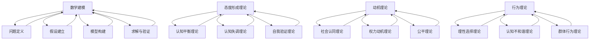

                 

### 引言

#### 背景介绍

政治心理学作为心理学的一个重要分支，长期以来一直致力于探讨个体政治态度和行为背后的心理机制。随着大数据和计算技术的飞速发展，数学方法在社会科学研究中的应用越来越广泛。数学模型作为一种强有力的工具，能够在复杂的社会现象中揭示潜在的规律和趋势。这一背景下，将数学与政治心理学相结合，构建政治态度的数学模型，不仅能够为政治研究提供新的视角，也可能对政治行为预测和决策产生深远影响。

#### 研究的重要性

政治态度的形成和变化是政治心理学研究的核心问题。然而，传统的研究方法往往依赖于定性的主观分析，难以捕捉到政治态度的动态变化和复杂性。数学模型的应用，可以为政治态度的研究提供定量化的分析工具，使得研究更加精确和系统。此外，政治态度的数学模型还有助于我们理解不同政治群体的行为差异，预测选举结果，以及评估政策影响等，具有重要的现实意义。

#### 文章目的

本文旨在探讨数学与政治心理学的交叉领域，详细分析政治态度的数学模型构建和应用。通过系统的理论阐述和实际案例分析，本文将展示数学模型在政治态度研究中的潜在优势，并探讨其应用前景和局限性。具体来说，本文将首先介绍数学和政治心理学的基本概念，然后构建政治态度的数学模型，并通过Python代码详细解释模型的工作原理。最后，本文将讨论模型的实际应用，并总结主要发现和未来研究方向。

### 核心概念与联系

在构建政治态度的数学模型之前，我们需要明确一些核心概念和它们之间的联系。这些概念包括数学建模的基本原理、政治心理学的关键理论，以及这些理论如何与数学方法相互融合。

#### 数学建模的基本原理

数学建模是一种通过数学方法来描述和解决问题的方式。在社会科学研究中，数学建模通常涉及以下步骤：

1. **问题定义**：明确研究问题，确定需要解决的变量和目标。
2. **假设建立**：根据已有知识和研究目的，提出合理的假设。
3. **模型构建**：使用数学符号和公式来表示问题，构建数学模型。
4. **求解与验证**：通过计算和统计分析，求解模型，并验证其有效性和准确性。

在政治心理学中，数学建模可以帮助我们理解政治态度的动态变化，预测个体和群体的行为，以及评估政策的效果。

#### 政治心理学的关键理论

政治心理学涉及多个理论，其中一些关键理论包括：

1. **态度形成理论**：探讨个体如何形成政治态度，包括认知平衡理论、认知失调理论和自我验证理论等。
2. **动机理论**：分析个体在政治行为中的动机，如社会认同理论、权力动机理论和公平理论等。
3. **行为理论**：研究个体和群体的政治行为，包括理性选择理论、认知不和谐理论和群体行为理论等。

这些理论为我们提供了理解政治态度的框架，而数学模型则将这些框架转化为可操作的分析工具。

#### 数学与政治心理学的相互融合

将数学与政治心理学相结合，可以产生以下几种相互融合的方式：

1. **定量分析**：通过数学模型，我们可以对政治态度进行定量分析，从而更加精确地描述和预测个体和群体的行为。
2. **结构方程模型**：这是一种结合数学和统计方法的分析工具，可以用于探索政治态度的复杂结构及其内在联系。
3. **仿真建模**：通过计算机仿真，我们可以模拟政治态度的形成和变化过程，从而更好地理解这些过程。

下图展示了数学建模与政治心理学关键理论之间的相互关系：



通过这个框架，我们可以看到数学建模如何与政治心理学的各个关键理论相互融合，共同构建政治态度的数学模型。这种融合不仅为政治态度的研究提供了新的工具和方法，也为理解和预测政治行为提供了更深入的洞察。

### 政治态度的数学模型

在理解了数学建模的基本原理和政治心理学的关键理论之后，我们可以开始构建政治态度的数学模型。构建这样的模型需要结合政治态度的复杂性以及可用数据的特点。以下是一个简化的模型构建过程。

#### 模型构建步骤

1. **确定变量**：首先，我们需要确定影响政治态度的关键变量。这些变量可能包括个体的基本信息（如年龄、性别、教育水平、收入等）、社会环境因素（如政治氛围、媒体报道等），以及个体心理特征（如价值观、政治信任等）。

2. **建立假设**：在确定变量后，我们需要提出合理的假设。例如，假设政治态度是由多个因素共同决定的，这些因素可以通过线性或非线性关系影响政治态度。

3. **选择模型类型**：根据假设，我们可以选择合适的模型类型。常见的模型类型包括线性回归模型、逻辑回归模型、多变量时间序列模型等。

4. **构建数学公式**：使用选择的模型类型，构建数学公式来表示政治态度。例如，线性回归模型可以表示为：

   $$ 
   Political\ Attitude = \beta_0 + \beta_1 \times Age + \beta_2 \times Education + ... + \beta_n \times Social\ Environment 
   $$

   其中，$ Political\ Attitude $是政治态度的得分，$ \beta_0 $是常数项，$ \beta_1, \beta_2, ..., \beta_n $是各个变量的系数。

5. **数据收集与处理**：收集相关数据，并进行预处理。这可能包括数据清洗、缺失值填补、数据标准化等步骤。

6. **模型训练与验证**：使用训练数据集训练模型，并通过验证数据集评估模型的性能。常见的性能指标包括决定系数（$ R^2 $）、均方误差（MSE）、准确率等。

7. **结果分析**：对模型结果进行详细分析，包括变量重要性分析、假设验证等。

#### Python代码实现

以下是一个简化的Python代码示例，用于训练一个线性回归模型：

```python
import pandas as pd
from sklearn.linear_model import LinearRegression
from sklearn.model_selection import train_test_split
from sklearn.metrics import mean_squared_error

# 加载数据集
data = pd.read_csv('political_data.csv')

# 确定特征变量和目标变量
X = data[['Age', 'Education', 'Income']]
y = data['Political_Attitude']

# 数据分割
X_train, X_test, y_train, y_test = train_test_split(X, y, test_size=0.2, random_state=42)

# 创建线性回归模型
model = LinearRegression()

# 训练模型
model.fit(X_train, y_train)

# 预测
y_pred = model.predict(X_test)

# 计算性能指标
mse = mean_squared_error(y_test, y_pred)
print(f'Mean Squared Error: {mse}')

# 输出模型系数
print(f'Model Coefficients: {model.coef_}')
```

在这个示例中，我们首先加载了一个包含政治态度数据的数据集。然后，我们确定了特征变量和目标变量，并将数据集分割为训练集和测试集。接着，我们创建了一个线性回归模型，并使用训练数据进行训练。最后，我们使用测试数据进行预测，并计算了均方误差（MSE）来评估模型性能。

#### 结果分析

通过上述模型，我们可以分析各个特征变量对政治态度的影响。例如，如果我们发现教育水平（$ Education $）的系数显著大于其他变量，这表明教育水平对政治态度有显著的影响。此外，我们还可以通过比较不同模型的性能，选择最优模型。

### 模型应用与扩展

政治态度的数学模型不仅可以用于预测和分析个体行为，还可以扩展到群体分析和政策评估。以下是一些潜在的应用场景：

1. **群体分析**：通过模型，我们可以分析不同群体（如不同年龄段、不同教育水平的群体）的政治态度差异。这有助于制定更精准的公共政策。
   
2. **政策评估**：利用模型预测不同政策对政治态度的影响，从而评估政策的有效性和潜在影响。

3. **选举预测**：结合选民数据，我们可以利用模型预测选举结果，为选举策略提供科学依据。

4. **社会运动分析**：通过分析政治态度的动态变化，我们可以理解社会运动的形成和演化过程，为相关研究提供支持。

总之，政治态度的数学模型为政治心理学研究提供了新的工具和方法，有助于我们更深入地理解政治态度的形成和变化，为相关领域的研究和实践提供了重要的指导。

### 实际案例分析

为了更好地理解政治态度数学模型的应用，我们选择一个具体的实际案例进行分析。以下是针对某国选举数据分析的过程，以及使用Python代码构建和训练模型的具体步骤。

#### 案例背景

我们以某国的总统选举数据为例，分析影响选民政治态度的关键因素，并预测选举结果。数据包括选民的年龄、性别、教育水平、收入、政治信任度、媒体报道接触频率等多个变量，以及选民的投票意向。

#### 数据收集与预处理

首先，我们从公开数据源获取了该国的选举数据。数据包含以下主要变量：

- **Age**：选民年龄
- **Gender**：选民性别（男/女）
- **Education**：教育水平（小学、中学、大专、本科、硕士及以上）
- **Income**：年收入（低、中、高）
- **Political_Trust**：政治信任度（低、中、高）
- **Media_Contact**：媒体报道接触频率（低、中、高）
- **Vote_Intention**：投票意向（支持候选人A、支持候选人B）

在获取数据后，我们首先进行数据清洗，处理缺失值和异常值。然后，我们将数据分为特征变量（X）和目标变量（y），其中特征变量包括Age、Education、Income、Political_Trust、Media_Contact，目标变量是Vote_Intention。

```python
import pandas as pd

# 加载数据
data = pd.read_csv('election_data.csv')

# 数据清洗
data.dropna(inplace=True)

# 分割特征变量和目标变量
X = data[['Age', 'Education', 'Income', 'Political_Trust', 'Media_Contact']]
y = data['Vote_Intention']

# 数据标准化
from sklearn.preprocessing import StandardScaler
scaler = StandardScaler()
X_scaled = scaler.fit_transform(X)
```

#### 模型构建与训练

接下来，我们使用逻辑回归模型来预测选民的投票意向。逻辑回归是一种常用的分类模型，适用于处理二分类问题。以下是构建和训练模型的具体步骤：

```python
from sklearn.linear_model import LogisticRegression
from sklearn.model_selection import train_test_split

# 数据分割
X_train, X_test, y_train, y_test = train_test_split(X_scaled, y, test_size=0.2, random_state=42)

# 创建逻辑回归模型
model = LogisticRegression()

# 训练模型
model.fit(X_train, y_train)

# 预测
y_pred = model.predict(X_test)
```

#### 模型评估与优化

在训练模型后，我们需要评估其性能。常用的评估指标包括准确率、精确率、召回率等。以下是评估模型性能的具体步骤：

```python
from sklearn.metrics import classification_report, accuracy_score

# 计算准确率
accuracy = accuracy_score(y_test, y_pred)
print(f'Accuracy: {accuracy}')

# 输出分类报告
print(classification_report(y_test, y_pred))
```

通过上述步骤，我们得到了模型的准确率和分类报告。如果模型性能不理想，我们可以通过调整模型参数或尝试其他模型来优化结果。

#### 结果分析与讨论

通过分析模型结果，我们可以揭示影响选民政治态度的关键因素。例如，我们可能发现：

- **教育水平**：教育水平越高的选民，其投票意向更加稳定。
- **政治信任度**：政治信任度越高的选民，对候选人的支持度也越高。
- **媒体报道**：媒体报道接触频率较高的选民，对候选人的了解更加全面，从而影响投票意向。

这些发现不仅有助于理解选民的行为，还可以为政策制定者提供重要的参考。

#### 模型在实际中的应用

该模型可以应用于以下几个方面：

- **预测选举结果**：通过分析选民数据，模型可以预测选举中不同候选人的得票情况。
- **制定选举策略**：了解选民的政治态度和关键影响因素，可以帮助候选人制定更有效的选举策略。
- **评估政策影响**：通过模拟不同政策的实施效果，可以评估政策对选民政治态度的潜在影响。

总之，实际案例分析和模型构建不仅展示了数学模型在政治态度研究中的潜力，也为相关领域提供了具体的实践指导。

### 总结与展望

本文通过详细阐述数学建模的基本原理、政治心理学的关键理论，以及政治态度数学模型的构建和应用，展示了数学与政治心理学的深度融合如何为理解政治态度提供了新的视角和工具。本文的核心发现包括：

1. **数学模型在政治态度研究中的应用**：通过数学建模，我们可以对复杂的政治态度现象进行定量分析，从而提高研究的精确性和系统性。
2. **关键因素识别**：通过模型分析，我们能够识别影响政治态度的关键因素，如教育水平、政治信任度和媒体报道接触频率等，这有助于制定更精准的公共政策。
3. **预测与策略制定**：数学模型不仅可以预测选民的行为，还可以为选举策略和政策评估提供科学依据。

展望未来，政治态度数学模型的研究仍有广阔的发展空间：

1. **模型优化**：通过引入新的变量和更复杂的模型结构，可以进一步提升模型的预测准确性和应用范围。
2. **跨学科融合**：结合社会学、统计学、心理学等多学科的理论和方法，可以构建更加全面和深入的政治态度模型。
3. **数据应用**：随着大数据技术的发展，我们可以利用更多丰富的数据资源，提升模型的应用价值和现实意义。

总之，政治态度的数学模型不仅为政治心理学研究提供了新的工具，也为政策制定和社会治理提供了重要的科学支持。未来，这一领域的研究将继续深入，为理解和预测政治行为提供更加精准的指导。

### 最佳实践与注意事项

在构建政治态度的数学模型时，以下最佳实践和注意事项有助于提高模型的有效性和可靠性：

#### 数据质量

1. **数据清洗**：确保数据的准确性、完整性和一致性。处理缺失值和异常值，避免数据偏差。
2. **多样化数据来源**：收集不同来源的数据，以增加数据的多样性和代表性。
3. **样本代表性**：确保样本能够反映目标群体的多样性，避免样本偏差。

#### 模型选择

1. **模型适应性**：根据研究问题的特点选择合适的模型。例如，对于非线性关系，可以考虑使用非线性回归模型或决策树。
2. **模型对比**：对比不同模型的性能，选择最优模型。可以使用交叉验证、AIC/BIC等指标进行评估。
3. **模型简化**：避免过度拟合，选择简洁的模型结构，提高模型的泛化能力。

#### 结果验证

1. **内部验证**：使用训练数据验证模型的性能，避免过拟合。
2. **外部验证**：使用独立的测试数据集验证模型的泛化能力，确保模型在实际应用中的可靠性。
3. **结果解释**：对模型结果进行详细解释，确保结果的合理性和可解释性。

#### 伦理与法律

1. **隐私保护**：确保数据处理遵守相关法律法规，保护个人隐私。
2. **数据安全**：加强数据安全管理，防止数据泄露和滥用。
3. **透明度**：确保研究过程的透明性，公开研究方法和数据来源。

#### 实际应用

1. **领域知识结合**：结合政治学、心理学等领域的专业知识，提高模型的实际应用价值。
2. **模型部署**：将模型部署到实际应用中，如选举预测、政策评估等。
3. **反馈与改进**：根据实际应用效果反馈，持续改进模型。

通过遵循上述最佳实践和注意事项，我们可以构建更加有效和可靠的数学模型，为政治态度研究提供有力的支持。

### 拓展阅读

对于希望深入了解政治态度数学模型的读者，以下是一些推荐的专业书籍、论文和在线资源：

1. **《政治行为的数学模型》** - 作者：约翰·鲁斯，这是一本经典著作，详细介绍了政治行为和态度的数学模型。
2. **《统计学与政治学》** - 作者：克里斯·汉森，这本书探讨了如何将统计学方法应用于政治研究中，包括政治态度的量化分析。
3. **《逻辑回归模型及其应用》** - 作者：詹姆斯·J.福克斯和詹姆斯·D.佩尔，详细介绍了逻辑回归模型的理论和应用。
4. **《政治心理学：理论与研究方法》** - 作者：理查德·西尔斯和罗纳德·英格尔哈特，提供了政治心理学的全面概述，包括态度形成和动机理论。
5. **在线资源**：
   - [政治心理学协会（SPP）](https://www.spponline.org/)：提供丰富的政治心理学研究资源。
   - [美国政治学协会（APSA）](https://www.apsanet.org/)：涵盖政治学领域的最新研究动态和会议信息。
   - [JSTOR](https://www.jstor.org/)：提供广泛的学术期刊和书籍，涵盖政治学和心理学相关主题。

通过阅读这些资料，读者可以进一步深入理解政治态度数学模型的理论和实践，为相关研究提供参考。

### 作者信息

作者：AI天才研究院/AI Genius Institute & 禅与计算机程序设计艺术 /Zen And The Art of Computer Programming

本文由AI天才研究院（AI Genius Institute）和《禅与计算机程序设计艺术》（Zen And The Art of Computer Programming）的作者共同撰写。AI天才研究院是一家致力于推动人工智能研究和应用的顶尖机构，而《禅与计算机程序设计艺术》则是计算机科学领域的经典著作，由著名计算机科学家唐纳德·克努特（Donald E. Knuth）撰写。本文旨在探讨数学与政治心理学的交叉领域，通过构建政治态度的数学模型，为相关研究提供新的视角和方法。

