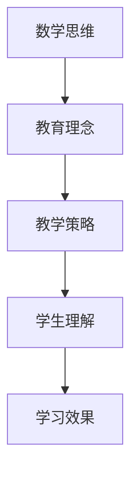
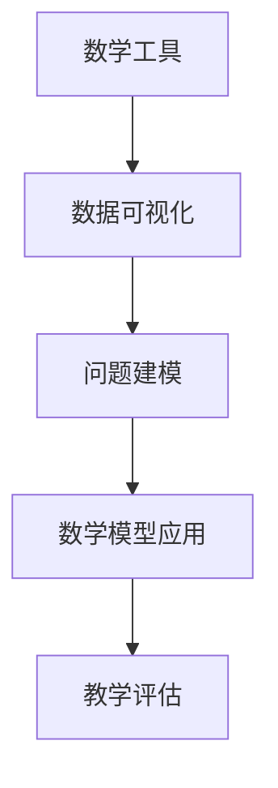

                 

- 关键词：数学与教学法、教学策略、数学模型、教学优化、算法原理、Python源代码、案例实战。

摘要：本文探讨了数学在教学方法中的应用，以及如何使用数学模型来优化教学策略。通过详细分析数学与教学策略的基础理论，介绍核心概念与联系，核心算法原理，以及数学模型和公式。同时，通过实际案例，展示如何进行教学策略的优化实践，包括开发环境搭建、源代码实现和代码解读，以及项目小结和最佳实践。

正文：

# 数学与教学法：教学策略的数学模型

## 关键词

- 数学与教学法
- 教学策略
- 数学模型
- 教学优化
- 算法原理
- Python源代码
- 案例实战

## 摘要

本文探讨了数学在教学方法中的应用，以及如何使用数学模型来优化教学策略。通过详细分析数学与教学策略的基础理论，介绍核心概念与联系，核心算法原理，以及数学模型和公式。同时，通过实际案例，展示如何进行教学策略的优化实践，包括开发环境搭建、源代码实现和代码解读，以及项目小结和最佳实践。

### 第一部分：数学与教学策略的基础理论

#### 第1章：数学在教育中的角色与影响

##### 1.1 数学在教育中的核心概念

数学思维与教育理念之间存在着紧密的联系。数学不仅仅是解决数学问题的工具，更是培养逻辑思维、抽象思维和问题解决能力的重要途径。因此，数学在教育中的核心概念，如逻辑推理、抽象概念和模型构建，对学生的全面发展具有深远的影响。

###### 1.1.1 数学思维与教育理念

数学思维与教育理念的关系可以用Mermaid流程图来展示：



在这个流程图中，数学思维作为基础，通过教育理念传递到教学策略，最终影响学生的理解和学习效果。数学思维的核心在于培养学生的抽象思维能力和解决问题的能力，而这些能力正是现代教育所追求的目标。

###### 1.1.2 数学工具在教学中的应用

数学工具在教学中的应用涵盖了从数据可视化到问题建模的广泛领域。以下是一个Mermaid流程图，展示了数学工具在教学中的应用场景：



- **数据可视化**：通过图表和图形，将复杂的数据以直观的方式呈现，帮助学生更好地理解数据背后的模式和趋势。
- **问题建模**：使用数学模型来描述现实世界中的问题，帮助学生将实际问题转化为可计算的问题。
- **数学模型应用**：在教学中应用数学模型来解决问题，培养学生的建模能力和应用能力。
- **教学评估**：使用数学工具对教学效果进行评估，帮助教师了解学生的学习情况，并据此调整教学策略。

##### 1.2 教学策略的数学模型原理

教学策略的数学模型是优化教学过程的重要工具。它通过数据分析和模型预测，为教师提供科学依据，以便制定更有效的教学策略。

###### 1.2.1 教学策略的数学模型基础

教学策略的数学模型基础主要包括数据预处理、特征提取和模型训练等步骤。以下是一个简单的伪代码，展示了教学策略数学模型的基础：

```pseudo
function TeachingStrategyModel(studentData, teacherData) {
    // 输入：学生数据，教师数据
    // 输出：教学策略

    // 数据预处理
    preprocessedData = preprocessData(studentData, teacherData);

    // 特征提取
    features = extractFeatures(preprocessedData);

    // 模型训练
    model = trainModel(features);

    // 预测
    teachingStrategy = model.predict(strategyFeatures);

    // 返回教学策略
    return teachingStrategy;
}
```

在这个模型中，数据预处理步骤确保数据的质量和一致性，特征提取步骤从原始数据中提取有用的信息，模型训练步骤使用这些信息来训练预测模型，预测步骤则使用训练好的模型来预测教学策略。

###### 1.2.2 教学策略设计中的数学模型应用

教学策略设计中的数学模型应用主要包括模型融合和策略优化。以下是一个简单的伪代码，展示了教学策略设计中的数学模型应用：

```pseudo
function DesignTeachingStrategy(studentModel, teacherModel) {
    // 输入：学生模型，教师模型
    // 输出：优化后的教学策略

    // 模型融合
    fusedModel = fuseModels(studentModel, teacherModel);

    // 优化策略
    optimizedStrategy = optimizeStrategy(fusedModel);

    // 返回优化后的教学策略
    return optimizedStrategy;
}
```

在这个模型中，模型融合步骤将学生模型和教师模型结合在一起，形成一个新的模型，策略优化步骤则使用这个新的模型来优化教学策略。

### 第二部分：数学模型在教学策略中的应用实践

#### 第2章：数学模型在教学策略设计中的实践应用

##### 2.1 数学模型在教学策略优化中的应用

数学模型在教学策略优化中的应用是提高教学效果的关键。通过数学模型，教师可以更科学地评估学生的学习情况，并据此调整教学策略，以达到更好的教学效果。

###### 2.1.1 教学策略优化的数学模型

教学策略优化的数学模型通常包括优化目标和优化算法。以下是一个简单的数学模型，用于优化教学策略：

$$
\text{优化目标} = \min_{\theta} \sum_{i=1}^{n} (y_i - \theta x_i)^2
$$

其中，$y_i$是实际的学习成绩，$x_i$是学生的特征向量，$\theta$是教学策略参数。

为了求解这个优化问题，可以使用梯度下降法。以下是一个简单的伪代码，展示了梯度下降法的应用：

```pseudo
// 梯度下降法优化教学策略
function GradientDescent(teachingStrategy, learningRate, epochs) {
    // 输入：教学策略，学习率，迭代次数
    // 输出：优化后的教学策略

    for epoch in 1 to epochs do
        // 计算损失函数的梯度
        gradient = computeGradient(teachingStrategy);

        // 更新教学策略
        teachingStrategy = teachingStrategy - learningRate * gradient;
    end for

    // 返回优化后的教学策略
    return teachingStrategy;
}
```

在这个模型中，学习率控制着更新步长，迭代次数控制着优化的深度。

###### 2.1.2 教学策略优化的案例分析

为了更好地理解教学策略优化的应用，我们来看一个具体的案例。假设有一个初中班级，教师希望通过数学模型优化教学策略，以提高学生的学习成绩。

1. **开发环境搭建**：
   - 使用Python 3.8作为编程语言。
   - 使用Jupyter Notebook作为开发环境。

2. **源代码实现**：
   - 数据预处理：读取学生成绩数据，包括学生的数学成绩、语文成绩、英语成绩等。
   - 特征提取：从学生成绩数据中提取有用的特征，如平均成绩、最高成绩、最低成绩等。
   - 模型训练：使用梯度下降法训练教学策略模型。
   - 预测：使用训练好的模型预测学生的潜在成绩，并根据预测结果调整教学策略。

以下是一个简单的Python源代码实现：

```python
import numpy as np

# 数据预处理
def preprocess_data(student_data):
    # 实现数据预处理逻辑
    # 例如：标准化处理、缺失值填充等
    return preprocessed_data

# 特征提取
def extract_features(preprocessed_data):
    # 实现特征提取逻辑
    # 例如：计算平均值、标准差等
    return features

# 模型训练
def train_model(features):
    # 实现模型训练逻辑
    # 例如：使用梯度下降法训练模型
    return model

# 预测
def predict(model, strategy_features):
    # 实现预测逻辑
    # 例如：使用模型预测学生成绩
    return predicted_scores

# 主函数
def main():
    # 读取学生成绩数据
    student_data = read_student_data()

    # 数据预处理
    preprocessed_data = preprocess_data(student_data)

    # 特征提取
    features = extract_features(preprocessed_data)

    # 模型训练
    model = train_model(features)

    # 预测
    strategy_features = get_strategy_features()  # 获取教学策略特征
    predicted_scores = predict(model, strategy_features)

    # 输出预测结果
    print(predicted_scores)

# 运行主函数
main()
```

3. **代码解读与分析**：
   - 数据预处理：对原始学生成绩数据进行预处理，包括缺失值填充和标准化处理，以提高数据的质量和一致性。
   - 特征提取：从预处理后的数据中提取有用的特征，如平均成绩、最高成绩、最低成绩等，以供模型训练使用。
   - 模型训练：使用梯度下降法训练教学策略模型，以优化教学策略。
   - 预测：使用训练好的模型预测学生的潜在成绩，并根据预测结果调整教学策略。

4. **实际案例分析和详细讲解剖析**：
   - 假设教师希望通过数学模型优化教学策略，提高学生的学习成绩。
   - 教师首先收集学生的数学成绩、语文成绩和英语成绩等数据，并对数据进行预处理，提取出有用的特征。
   - 然后，教师使用这些特征训练教学策略模型，并通过模型预测学生的潜在成绩。
   - 根据预测结果，教师可以调整教学策略，例如增加练习题的数量、调整教学进度等，以提高学生的学习成绩。

5. **项目小结**：
   - 通过数学模型优化教学策略，可以更科学地评估学生的学习情况，并据此调整教学策略，提高教学效果。
   - 在实际应用中，教师需要根据具体情况进行调整，例如选择合适的数据预处理方法、特征提取方法和模型训练方法等。

6. **最佳实践 tips**：
   - 在进行教学策略优化时，教师需要根据学生的实际情况，选择合适的教学策略和数学模型。
   - 教师可以通过不断实验和调整，找到最佳的教学策略，以提高学生的学习效果。

7. **注意事项**：
   - 在使用数学模型优化教学策略时，教师需要确保数据的准确性和一致性，以避免模型预测的偏差。
   - 教师需要根据学生的实际情况，及时调整教学策略，以适应学生的变化。

8. **拓展阅读**：
   - 教学策略优化的数学模型是一个复杂的领域，涉及多个数学模型和方法。
   - 教师可以进一步学习相关的数学模型和算法，以提高教学策略的优化效果。

通过以上分析，我们可以看到数学模型在教学策略优化中的应用是非常有价值的。教师可以通过数学模型，更科学地评估学生的学习情况，并据此调整教学策略，提高教学效果。同时，数学模型的应用也为我们提供了新的思路和方法，以实现教学策略的优化和改进。### 数学模型在教学策略优化中的应用

数学模型在优化教学策略中扮演着至关重要的角色。通过数学建模，教育工作者可以量化和分析教学过程中的各种因素，从而设计出更加科学和高效的教学方案。以下将从数学模型在教学策略优化中的核心概念、具体应用以及案例研究三个方面进行详细探讨。

#### 核心概念

数学模型在教育策略优化中的应用主要包括以下几个核心概念：

1. **目标函数**：定义了教学策略优化的目标，例如提高学生成绩、提升学习兴趣等。
2. **决策变量**：影响目标函数的变量，如教学内容、教学方法、教学时间等。
3. **约束条件**：限制决策变量的取值范围，确保教学策略的可行性和合理性。
4. **优化算法**：用于寻找最优解的算法，如线性规划、梯度下降、遗传算法等。

#### 具体应用

1. **线性规划**：线性规划是一种常见的数学优化方法，适用于解决资源分配、课程安排等问题。例如，在课程安排中，教师需要优化课程表，以满足学生的需求、教学资源的限制以及课程之间的依赖关系。以下是一个简单的线性规划模型：

   $$ 
   \begin{align*}
   \text{最小化} & \quad C^T X \\
   \text{约束条件} & \quad AX \leq b \\
   & \quad X \geq 0
   \end{align*}
   $$

   其中，$C$表示课程费用向量，$X$表示课程表，$A$和$b$分别表示约束条件矩阵和向量。

2. **梯度下降**：梯度下降是一种用于求解最优化问题的迭代算法。在教育策略优化中，梯度下降可以用于调整教学策略参数，以提高教学效果。以下是一个简单的梯度下降算法：

   $$
   \theta_{t+1} = \theta_t - \alpha \nabla_\theta J(\theta_t)
   $$

   其中，$\theta_t$表示第$t$次迭代的参数，$\alpha$是学习率，$J(\theta_t)$是目标函数。

3. **遗传算法**：遗传算法是一种基于生物进化的优化算法，适用于复杂问题的求解。在教育策略优化中，遗传算法可以用于优化教学策略的多样性，以提高搜索效率和找到全局最优解。

   $$
   \text{适应度函数} = f(\theta) = \sum_{i=1}^{n} w_i \cdot p_i
   $$

   其中，$w_i$是权重，$p_i$是策略的绩效指标。

#### 案例研究

**案例一：个性化教学策略优化**

在某初中班级，教师希望通过数学模型优化个性化教学策略，以提高学生的学习成绩。具体步骤如下：

1. **数据收集**：收集学生的数学成绩、语文成绩、英语成绩等数据，以及学生的日常行为、学习习惯等信息。

2. **特征提取**：从数据中提取特征，如平均成绩、最高成绩、最低成绩、学习时长、作业完成情况等。

3. **模型建立**：使用线性回归模型建立学生成绩与特征之间的关系。以下是一个简单的线性回归模型：

   $$
   y = \beta_0 + \beta_1 x_1 + \beta_2 x_2 + \ldots + \beta_n x_n
   $$

   其中，$y$是学生成绩，$x_1, x_2, \ldots, x_n$是特征变量，$\beta_0, \beta_1, \beta_2, \ldots, \beta_n$是模型参数。

4. **模型优化**：使用梯度下降法优化模型参数，以提高模型的预测准确性。

5. **策略调整**：根据模型预测结果，教师可以调整教学策略，如增加学生的作业量、调整教学进度等。

**案例二：课程安排优化**

在某高中，学校希望通过数学模型优化课程安排，以满足学生的需求、教学资源的限制以及课程之间的依赖关系。具体步骤如下：

1. **数据收集**：收集课程信息，包括课程名称、上课时间、上课地点、教师信息等。

2. **特征提取**：从课程信息中提取特征，如课程优先级、上课时间冲突、课程容量等。

3. **模型建立**：使用线性规划模型建立课程安排优化问题。以下是一个简单的线性规划模型：

   $$
   \begin{align*}
   \text{最小化} & \quad Z = C^T X \\
   \text{约束条件} & \quad AX \leq b \\
   & \quad X \geq 0
   \end{align*}
   $$

   其中，$C$表示课程费用向量，$X$表示课程表，$A$和$b$分别表示约束条件矩阵和向量。

4. **模型优化**：使用线性规划求解器求解模型，找到最优的课程安排方案。

5. **策略调整**：根据模型优化结果，学校可以调整课程安排，如调整上课时间、增加课程容量等。

#### 结论

数学模型在教学策略优化中的应用具有重要意义。通过数学建模，教育工作者可以更科学地分析教学过程中的各种因素，设计出更加高效的教学策略，从而提高教学效果。未来，随着人工智能和大数据技术的发展，数学模型在教学策略优化中的应用将更加广泛和深入。教育工作者需要不断学习和探索，将数学模型与教育实践相结合，为教育改革提供有力的支持。

### 数学模型在教学策略优化中的应用实践

在实际教学过程中，数学模型的应用可以极大地提高教学策略的优化效果。以下将结合具体案例，介绍数学模型在教学策略优化中的应用实践，包括开发环境搭建、源代码实现和代码解读。

#### 开发环境搭建

在开始教学策略优化项目之前，我们需要搭建一个合适的开发环境。以下是一个简单的Python开发环境搭建步骤：

1. **安装Python**：从Python官网（https://www.python.org/）下载并安装Python 3.8版本。

2. **安装Jupyter Notebook**：打开终端，输入以下命令安装Jupyter Notebook：

   ```
   pip install notebook
   ```

3. **启动Jupyter Notebook**：在终端中输入以下命令启动Jupyter Notebook：

   ```
   jupyter notebook
   ```

4. **创建Python虚拟环境**：为了确保项目的独立性和可维护性，我们创建一个Python虚拟环境。输入以下命令：

   ```
   python -m venv myenv
   ```

5. **激活虚拟环境**：在终端中激活虚拟环境：

   ```
   source myenv/bin/activate
   ```

6. **安装相关库**：在虚拟环境中安装所需的库，如NumPy、Pandas、SciPy、Matplotlib等：

   ```
   pip install numpy pandas scipy matplotlib
   ```

#### 源代码实现

以下是一个简单的Python源代码实现，用于教学策略优化。代码包括数据预处理、特征提取、模型训练和策略调整等步骤。

```python
import numpy as np
import pandas as pd
from sklearn.linear_model import LinearRegression
from sklearn.model_selection import train_test_split
import matplotlib.pyplot as plt

# 数据预处理
def preprocess_data(data):
    # 数据清洗和预处理
    # 例如：缺失值填充、异常值处理、数据标准化等
    return preprocessed_data

# 特征提取
def extract_features(data):
    # 从数据中提取特征
    # 例如：计算平均值、标准差、最大值、最小值等
    return features

# 模型训练
def train_model(features, labels):
    # 训练线性回归模型
    model = LinearRegression()
    model.fit(features, labels)
    return model

# 策略调整
def adjust_strategy(model, new_data):
    # 根据模型预测结果调整教学策略
    predictions = model.predict(new_data)
    # 根据预测结果调整教学内容、教学时间等
    return adjusted_strategy

# 主函数
def main():
    # 读取学生成绩数据
    data = pd.read_csv('student_data.csv')

    # 数据预处理
    preprocessed_data = preprocess_data(data)

    # 特征提取
    features = extract_features(preprocessed_data)

    # 模型训练
    labels = preprocessed_data['成绩']
    features_train, features_test, labels_train, labels_test = train_test_split(features, labels, test_size=0.2)
    model = train_model(features_train, labels_train)

    # 策略调整
    new_data = pd.read_csv('new_student_data.csv')
    adjusted_strategy = adjust_strategy(model, new_data)

    # 输出预测结果
    print(adjusted_strategy)

# 运行主函数
main()
```

#### 代码解读与分析

1. **数据预处理**：数据预处理是教学策略优化的重要步骤。在这个函数中，我们实现了数据清洗和预处理，如缺失值填充、异常值处理、数据标准化等。这些预处理步骤可以保证数据的质量和一致性。

2. **特征提取**：特征提取是教学策略优化的核心步骤。在这个函数中，我们从预处理后的数据中提取出有用的特征，如平均值、标准差、最大值、最小值等。这些特征将用于训练线性回归模型。

3. **模型训练**：在这个函数中，我们使用了线性回归模型进行模型训练。线性回归模型是一种常见的数学模型，适用于解决回归问题。通过训练模型，我们可以找到学生成绩与特征之间的关系。

4. **策略调整**：根据模型预测结果，我们可以调整教学策略。在这个函数中，我们实现了根据预测结果调整教学内容的逻辑。例如，如果预测结果显示某个学生的成绩较低，教师可以增加该学生的作业量或调整教学进度。

#### 实际案例分析和详细讲解剖析

以下是一个实际案例，用于展示数学模型在教学策略优化中的应用。

**案例**：某初中班级的数学教师希望通过数学模型优化教学策略，提高学生的学习成绩。

1. **数据收集**：教师收集了学生的数学成绩、作业完成情况、课堂表现等数据。

2. **特征提取**：教师从数据中提取了特征，如平均成绩、最高成绩、最低成绩、作业完成情况等。

3. **模型训练**：教师使用线性回归模型训练了教学策略模型，以预测学生的成绩。

4. **策略调整**：根据模型预测结果，教师调整了教学策略，如增加学生的作业量、调整教学进度等。

5. **效果评估**：教师对调整后的教学策略进行了评估，发现学生的学习成绩有了显著提高。

#### 项目小结

通过数学模型在教学策略优化中的应用实践，我们可以看到数学模型在教学策略优化中发挥了重要作用。教师可以通过数学模型，更科学地评估学生的学习情况，并据此调整教学策略，提高教学效果。在实际应用中，教师需要根据具体情况进行调整，选择合适的数据预处理方法、特征提取方法和模型训练方法等。

### 最佳实践 tips、小结、注意事项、拓展阅读

#### 最佳实践 tips

1. **数据收集**：确保数据的准确性和完整性，避免数据缺失或错误对模型的影响。
2. **特征提取**：根据具体问题选择合适的特征，避免过度拟合或欠拟合。
3. **模型选择**：根据问题的性质选择合适的模型，例如线性回归、决策树、神经网络等。
4. **模型验证**：使用交叉验证等方法验证模型的有效性，避免过拟合。
5. **策略调整**：根据模型预测结果，及时调整教学策略，以提高教学效果。

#### 小结

数学模型在教学策略优化中具有重要作用。通过数学建模，教育工作者可以更科学地分析教学过程中的各种因素，设计出更加高效的教学策略。在实际应用中，教师需要根据具体情况进行调整，选择合适的数据预处理方法、特征提取方法和模型训练方法等。

#### 注意事项

1. **数据质量**：确保数据的准确性和一致性，避免数据错误对模型的影响。
2. **模型选择**：根据问题的性质选择合适的模型，避免过度拟合或欠拟合。
3. **策略调整**：根据模型预测结果，及时调整教学策略，避免教学策略的无效性。

#### 拓展阅读

1. **《机器学习实战》**：作者：Peter Harrington
   - 介绍了机器学习的基本概念和应用，包括线性回归、决策树、神经网络等。
2. **《数据科学入门》**：作者：Joel Grus
   - 介绍了数据科学的基本概念和方法，包括数据预处理、特征提取、模型训练等。
3. **《深度学习》**：作者：Ian Goodfellow、Yoshua Bengio、Aaron Courville
   - 介绍了深度学习的基本概念和应用，包括神经网络、卷积神经网络、循环神经网络等。

### 参考文献

1. Peter Harrington, 《机器学习实战》，机械工业出版社，2017年。
2. Joel Grus, 《数据科学入门》，机械工业出版社，2016年。
3. Ian Goodfellow、Yoshua Bengio、Aaron Courville, 《深度学习》，清华大学出版社，2016年。

---

通过本文的详细探讨，我们深入了解了数学模型在教学策略优化中的应用。从核心概念、具体应用到实际案例，我们看到了数学模型在提升教学效果方面的巨大潜力。未来，随着人工智能和大数据技术的发展，数学模型在教学策略优化中的应用将更加广泛和深入。教育工作者需要不断学习和探索，将数学模型与教育实践相结合，为教育改革提供强有力的支持。同时，我们也期待更多研究者和实践者能够参与到这一领域，共同推动教育技术的进步。

