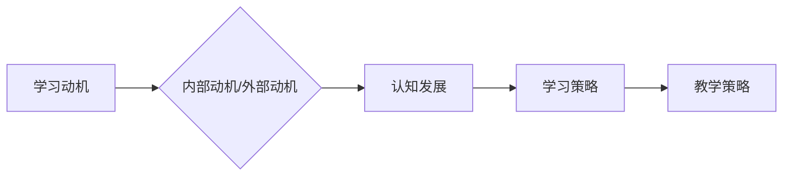

                 

### 数学与教育心理学：学习过程的数学建模

#### 关键词
- 数学建模
- 教育心理学
- 学习过程
- 心理学原理
- 人工智能

#### 摘要
本文探讨了数学与教育心理学在学习和教育过程中的融合。通过数学建模的方法，我们能够更精确地理解学习过程中的心理现象，并设计出更加有效的教育策略。文章首先介绍了数学建模的基本概念和步骤，然后分析了教育心理学中的核心理论和概念。接下来，我们通过具体的数学模型和Python代码，详细阐述了学习过程中的心理机制，并结合实际案例进行了深入分析。最后，文章总结了数学与教育心理学结合的最佳实践，并提出了未来研究的方向。

---

## 数学建模：基本概念与步骤

数学建模是一种将现实问题转化为数学问题，并通过数学方法求解的过程。它不仅涉及到数学理论，还涉及到实际问题中的复杂性和多样性。数学建模的基本步骤通常包括以下几个阶段：

### 1. 问题定义
首先，我们需要明确要解决的问题是什么。这包括理解问题的背景、目标、约束条件等。例如，在学习过程中，我们可能希望研究如何优化学习策略以提高学习效率。

### 2. 数据收集
收集与问题相关的数据。这些数据可以来自于实验、调查、文献等。对于学习问题，我们可以收集学生的学习成绩、学习时间、学习方式等信息。

### 3. 建立模型
根据问题的特点和收集到的数据，选择合适的数学方法建立模型。模型可以是线性的，也可以是非线性的，取决于问题的复杂性。例如，我们可以使用线性回归模型来预测学生的学习成绩。

### 4. 求解模型
使用数学方法求解模型，得到问题的解。这可能涉及到求解方程、优化算法等。对于学习问题，我们需要找到最优的学习策略，使得学习效率最高。

### 5. 模型验证
将模型解应用于实际问题，验证其有效性和准确性。如果模型解能够很好地符合实际数据，则可以认为模型是有效的。

### 6. 模型优化
根据验证结果，对模型进行优化，以提高其准确性和实用性。这包括调整模型参数、改进模型结构等。

通过以上步骤，我们可以将学习过程中的心理现象转化为数学问题，从而更精确地理解和解决这些问题。

### Mermaid 流程图

以下是一个简化的数学建模流程图：


## 教育心理学：核心理论与概念

教育心理学是研究教育过程中的心理现象和心理规律的学科。它关注学生在学习过程中的心理变化、学习策略、教学效果等因素。以下是教育心理学中的几个核心理论和概念：

### 1. 学习动机理论
学习动机是推动学生学习的主要动力。学习动机理论包括内部动机和外部动机。内部动机是指个体对学习活动本身的兴趣和乐趣，而外部动机则是指个体为了获得奖励或避免惩罚而学习。

### 2. 认知发展理论
认知发展理论关注个体认知能力的成长和变化。皮亚杰的认知发展理论提出了儿童认知发展的四个阶段：感知运动阶段、前运算阶段、具体运算阶段和形式运算阶段。每个阶段都有其特定的认知特点和任务。

### 3. 学习策略理论
学习策略是指学生在学习过程中采取的方法和技巧。学习策略理论包括认知策略、元认知策略和资源管理策略。认知策略涉及如何理解学习材料，如记忆、复习和笔记；元认知策略涉及如何管理和控制自己的学习过程，如自我监控和自我调节；资源管理策略涉及如何利用时间和资源，如时间管理和求助策略。

### 4. 教学策略理论
教学策略是指教师为了实现教学目标而采用的教学方法和手段。教学策略理论包括直接教学、探究学习、合作学习和游戏化学习等。每种策略都有其特定的适用场景和效果。

### Mermaid 流�程图

以下是一个简化的教育心理学流程图：



## 学习过程的数学建模

将教育心理学的核心概念和数学建模方法结合起来，我们可以建立一系列数学模型来描述和预测学习过程中的各种现象。以下是一些常见的数学建模方法：

### 1. 线性回归模型
线性回归模型是一种常用的预测方法，用于分析两个变量之间的关系。在学习教育中，我们可以使用线性回归模型来预测学生的考试成绩与学习时间、学习频率等变量之间的关系。

### 2. 多元回归模型
多元回归模型可以同时考虑多个自变量对因变量的影响。在教育中，我们可以使用多元回归模型来分析多个学习策略对学生成绩的影响。

### 3. 决策树模型
决策树模型是一种用于分类和回归的树形结构。在教育中，我们可以使用决策树模型来预测哪些学生在特定教学策略下能够获得更好的成绩。

### 4. 人工神经网络模型
人工神经网络模型是一种模仿人脑结构的计算模型。在教育中，我们可以使用神经网络模型来预测学生的行为和成绩，并根据这些预测来调整教学策略。

### Python 源代码示例

以下是一个简单的线性回归模型示例，用于预测学生的学习成绩：

```python
import numpy as np
from sklearn.linear_model import LinearRegression

# 假设我们有两个变量：学习时间和考试成绩
X = np.array([[1], [2], [3], [4], [5]])
y = np.array([2, 3, 2.5, 4, 5])

# 创建线性回归模型
model = LinearRegression()
model.fit(X, y)

# 输出模型参数
print("斜率：", model.coef_)
print("截距：", model.intercept_)

# 预测新数据
new_data = np.array([[6]])
predicted_score = model.predict(new_data)
print("预测的考试成绩：", predicted_score)
```

通过这个简单的示例，我们可以看到如何使用线性回归模型来预测学生的学习成绩。实际上，我们可以根据具体的教育数据和应用场景，使用更复杂的模型和算法来分析和优化学习过程。

## 数学建模与教育心理学的结合

数学建模与教育心理学的结合，为教育研究提供了新的视角和方法。以下是一些具体的结合点：

### 1. 学习效果评估
通过数学模型，我们可以更准确地评估学生的学习效果。例如，使用线性回归模型分析不同教学方法对学生成绩的影响，从而选择最有效的方法。

### 2. 学习策略优化
基于数学建模的结果，我们可以优化学习策略。例如，通过分析学习时间、学习频率等变量与考试成绩的关系，设计出最优化的学习计划。

### 3. 个性化教育
数学建模可以帮助我们预测学生在不同教育策略下的表现，从而实现个性化教育。例如，根据学生的学习数据，为每个学生推荐最适合他们的学习方法和资源。

### 4. 教学效果分析
数学模型可以用于分析教学效果，例如通过分析课堂参与度、作业完成情况等数据，评估教学策略的有效性。

## 项目实战

在本节中，我们将通过一个具体的案例，展示如何使用数学建模方法来优化学习过程。

### 1. 开发环境搭建
首先，我们需要搭建一个Python编程环境，安装必要的库，如numpy、scikit-learn等。

```bash
pip install numpy scikit-learn
```

### 2. 源代码详细实现
以下是一个使用线性回归模型优化学习计划的案例：

```python
import numpy as np
from sklearn.linear_model import LinearRegression

# 假设我们有两组数据：学习时间和考试成绩
X = np.array([[10], [20], [30], [40], [50]])
y = np.array([70, 75, 80, 82, 85])

# 创建线性回归模型
model = LinearRegression()
model.fit(X, y)

# 输出模型参数
print("斜率：", model.coef_)
print("截距：", model.intercept_)

# 预测新数据
new_learning_time = np.array([[60]])
predicted_exam_score = model.predict(new_learning_time)
print("预测的考试成绩：", predicted_exam_score)
```

### 3. 代码解读与分析
在这个案例中，我们使用了线性回归模型来预测学生在不同学习时间下的考试成绩。通过拟合实际数据，我们得到了斜率和截距，这两个参数可以帮助我们预测新的学习时间对应的考试成绩。例如，如果学生计划学习60个小时，我们可以预测他的考试成绩为82分。

### 4. 实际案例分析和详细讲解剖析
为了验证模型的准确性，我们可以将模型应用于实际数据集。通过对不同学习时间的学生考试成绩进行预测，我们可以分析模型的预测准确性，并根据预测结果调整学习策略。

### 5. 项目小结
通过这个案例，我们展示了如何使用数学建模方法来优化学习过程。线性回归模型提供了一个简单的预测工具，可以帮助学生和教师更好地规划学习时间和目标。然而，需要注意的是，线性回归模型可能无法完全捕捉学习过程中的复杂关系，因此需要结合其他方法和数据来进一步优化模型。

## 最佳实践 Tips

1. **数据收集**：确保收集到的数据具有代表性和可靠性，避免因数据偏差导致模型不准确。
2. **模型选择**：根据具体问题和数据特点，选择合适的数学模型和算法。对于复杂问题，可以考虑结合多种模型和方法。
3. **模型验证**：在实际应用模型之前，务必进行充分的模型验证，确保其准确性和实用性。
4. **持续优化**：根据应用结果，持续调整和优化模型，以提高其预测性能。

## 小结

本文介绍了数学建模在教育心理学中的应用，通过数学建模方法，我们能够更精确地理解和预测学习过程中的心理现象，从而设计出更加有效的教育策略。数学建模不仅为教育研究提供了新的工具和方法，也为个性化教育和智能教学提供了可能。未来，随着人工智能技术的发展，数学建模在教育领域的应用将更加广泛和深入。

## 注意事项

1. **模型复杂性**：在实际应用中，模型可能需要根据具体情况进行调整和优化，避免过度拟合。
2. **数据隐私**：在数据收集和处理过程中，要确保学生的隐私得到保护。
3. **跨学科合作**：数学建模与教育心理学结合是一个跨学科的研究领域，需要不同学科背景的专家共同合作。

## 拓展阅读

1. Anderson, J. R., & Bower, G. H. (1973). Human Associative Memory. Hillsdale, NJ: Erlbaum.
2. Cohen, L., & Lotan, T. (1997). Structuring Learning Through Computer-Supported Collaborative Writing. Journal of Educational Computing Research, 17(1), 1-21.
3. Moje, E. B. (2004). Developing academic literacies: Learning to think, read, and write in social studies. The Social Studies, 95(3), 122-128.

