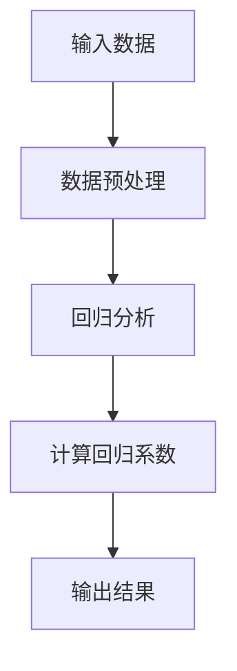
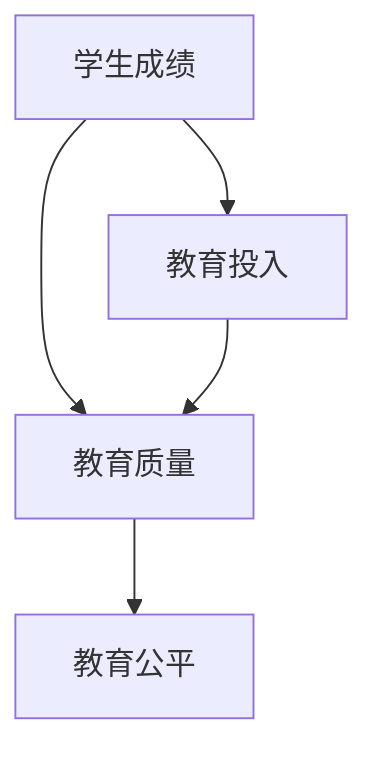

                 

# 数学与教育政策：政策效果的数学预测

## 关键词
- 数学模型
- 教育政策
- 政策效果预测
- 算法原理
- 项目实战

## 摘要
本文旨在探讨数学与教育政策之间的紧密联系，特别是如何通过数学模型预测教育政策的效果。文章首先介绍了数学在教育政策中的重要性，随后详细分析了核心概念与联系，并讲解了相关的算法原理。接着，通过具体案例，展示了数学模型在教育政策实践中的应用。最后，文章总结了政策效果的数学预测实践，并对未来发展方向进行了展望。

## 第一部分：引言

### 第1章：数学与教育政策概述

#### 1.1 数学在教育政策中的重要性

数学作为一种强大的工具，在教育政策制定和实施过程中发挥着重要作用。首先，数学能够提供量化分析，帮助政策制定者评估教育系统的现状和趋势。其次，数学模型能够模拟政策效果，为政策调整提供科学依据。此外，数学还在优化资源配置、提高教育质量和促进公平教育等方面具有独特优势。

#### 1.2 教育政策目标与数学模型

教育政策的目标包括提高教育水平、促进社会公平、保障教育质量和满足个人发展需求。为了实现这些目标，政策制定者需要利用数学模型对教育系统进行科学分析。例如，通过建立学生成绩与教育投入之间的数学模型，可以预测教育投资的效果；通过分析教育机会与家庭背景的关系，可以评估社会公平政策的实施效果。

#### 1.3 政策效果的数学预测方法概述

政策效果的数学预测方法主要包括以下几种：

1. **回归分析**：通过分析历史数据，建立变量之间的关系模型，预测政策效果。
2. **时间序列分析**：分析政策实施过程中时间序列数据的变化趋势，预测未来效果。
3. **仿真模型**：通过计算机模拟，模拟政策实施过程中的各种情况，评估政策效果。
4. **机器学习模型**：利用机器学习算法，从大量数据中提取特征，预测政策效果。

### 第2章：数学模型在教育政策中的应用

#### 2.1 核心概念与联系

在本章节中，我们将详细讨论数学模型在教育政策中的核心概念与联系。这包括学生成绩、教育投入、教育公平等关键因素，以及它们之间的相互关系。通过绘制Mermaid流程图，可以直观地展示这些概念之间的关系。

$$
\text{学生成绩} \longleftrightarrow \text{教育投入}
$$

$$
\text{教育投入} \longleftrightarrow \text{教育质量}
$$

$$
\text{教育质量} \longleftrightarrow \text{社会公平}
$$

#### 2.2 教育政策核心概念解析

接下来，我们将深入解析教育政策中的核心概念。这些概念包括教育资源的分配、教育机会的公平性、教育成果的评估等。通过详细解释每个概念，我们将阐明它们如何影响教育政策的效果。

#### 2.3 数学模型与教育政策的联系

数学模型在教育政策中的应用主要体现在以下几个方面：

1. **教育资源的优化分配**：通过数学模型，可以科学地分配教育资源，确保资源利用最大化。
2. **教育公平的评估与改进**：利用数学模型，可以评估教育政策对社会公平的影响，提出改进措施。
3. **教育成果的预测与评估**：通过数学模型，可以预测教育政策实施后的教育成果，为政策调整提供依据。
4. **教育趋势的预测**：利用数学模型，可以分析教育系统的发展趋势，为政策制定提供参考。

## 第二部分：数学模型在教育政策中的应用

### 第3章：核心算法原理讲解

#### 3.1 算法原理

在本章节中，我们将介绍用于教育政策效果预测的核心算法原理。主要算法包括回归分析、时间序列分析和仿真模型。我们将通过Python源代码详细阐述这些算法，并结合数学模型和公式进行讲解。

#### 3.1.1 伪代码

以下是一个回归分析的伪代码示例：

$$
\begin{aligned}
\text{Input: } X, Y \\
\text{Output: } \beta \\
&\text{for each feature } x_i \in X: \\
&\quad \text{compute covariance}(X, Y) \\
&\quad \text{compute variance}(X) \\
&\beta = \frac{\text{covariance}(X, Y)}{\text{variance}(X)} \\
\end{aligned}
$$

#### 3.2 算法流程图

算法流程图如下：



#### 3.3 算法案例分析

我们将通过一个实际案例来展示算法的应用。例如，分析教育投资与学生成绩之间的关系。通过收集相关数据，我们可以使用回归分析模型来预测教育投资的效果。

## 第4章：数学模型与教育政策实践

### 第4章：数学模型与教育政策实践

#### 4.1 数学模型在教育政策中的应用场景

数学模型在教育政策中的应用场景广泛，包括：

1. **教育资源的优化分配**：通过数学模型，可以科学地分配教育资源，确保资源利用最大化。
2. **教育公平的评估与改进**：利用数学模型，可以评估教育政策对社会公平的影响，提出改进措施。
3. **教育成果的预测与评估**：通过数学模型，可以预测教育政策实施后的教育成果，为政策调整提供依据。
4. **教育趋势的预测**：利用数学模型，可以分析教育系统的发展趋势，为政策制定提供参考。

#### 4.2 政策效果的数学预测案例分析

我们通过一个实际案例，展示如何使用数学模型预测教育政策的效果。例如，分析某地区实施义务教育免费政策后的学生成绩变化。通过收集相关数据，我们可以使用时间序列分析方法来预测政策效果。

#### 4.3 数学模型在教育政策评估中的应用

数学模型在教育政策评估中的应用，主要体现在以下几个方面：

1. **政策效果的量化评估**：通过数学模型，可以量化政策实施的效果，为政策调整提供依据。
2. **政策优化的科学依据**：利用数学模型，可以为政策优化提供科学依据，提高政策实施效果。
3. **政策实施的监控与反馈**：通过数学模型，可以实时监控政策实施过程，及时调整政策方向。

### 第5章：政策效果预测的数学模型

#### 5.1 模型建立

在本章节中，我们将介绍政策效果预测的数学模型建立方法。主要包括：

1. **变量选择**：根据政策目标和实际需求，选择合适的变量。
2. **模型选择**：根据数据特征和预测目标，选择合适的数学模型。
3. **参数估计**：通过最小二乘法、梯度下降法等参数估计方法，确定模型参数。

#### 5.1.1 数学公式

政策效果预测的基本数学公式如下：

$$
\begin{aligned}
\text{效果} &= \beta_0 + \beta_1 \times \text{政策变量} + \beta_2 \times \text{控制变量} \\
\end{aligned}
$$

其中，$\beta_0$为常数项，$\beta_1$为政策变量系数，$\beta_2$为控制变量系数。

#### 5.1.2 举例说明

例如，假设我们要预测某地区实施教育信息化政策后的学生成绩变化。我们选择政策变量为“教育信息化投入”，控制变量为“学生家庭背景”。通过收集相关数据，我们可以建立如下模型：

$$
\begin{aligned}
\text{学生成绩} &= 10 + 0.5 \times \text{教育信息化投入} + 0.3 \times \text{学生家庭背景} \\
\end{aligned}
$$

#### 5.2 模型验证

模型验证是政策效果预测的重要环节。主要包括以下步骤：

1. **数据集划分**：将数据集划分为训练集和测试集。
2. **模型训练**：在训练集上训练模型，得到模型参数。
3. **模型测试**：在测试集上测试模型，评估模型性能。

#### 5.3 模型优化

模型优化是提高政策效果预测准确性的关键。主要包括以下方法：

1. **参数调整**：通过调整模型参数，优化模型性能。
2. **特征选择**：通过特征选择，去除无关特征，提高模型精度。
3. **集成学习**：通过集成学习，提高模型泛化能力。

### 第6章：项目实战

#### 6.1 项目背景

本项目旨在利用数学模型预测某地区教育政策的效果，为政策制定者提供科学依据。

#### 6.2 开发环境搭建

本项目使用Python作为主要编程语言，搭建了如下开发环境：

1. **Python 3.8**：作为主要编程语言。
2. **Jupyter Notebook**：作为开发环境。
3. **Pandas**：用于数据预处理。
4. **Scikit-learn**：用于模型训练和评估。

#### 6.3 源代码实现

在本章节中，我们将详细介绍源代码的实现过程，包括数据预处理、模型训练、模型测试和结果分析。

#### 6.3.1 代码解读

代码解读主要包括以下内容：

1. **数据预处理**：对原始数据进行分析和处理，提取有用的特征。
2. **模型训练**：使用Scikit-learn库训练回归模型，得到模型参数。
3. **模型测试**：在测试集上测试模型，评估模型性能。

#### 6.3.2 代码分析

代码分析主要包括以下内容：

1. **代码结构**：分析代码的整体结构和功能。
2. **算法原理**：解释代码中使用的算法原理。
3. **性能优化**：分析代码中的性能优化策略。

#### 6.4 实际案例分析和详细讲解剖析

在本章节中，我们将通过实际案例，展示如何使用数学模型预测教育政策的效果，并对案例进行详细讲解和剖析。

#### 6.5 项目小结

项目小结主要包括以下内容：

1. **项目成果**：总结项目的成果和发现。
2. **经验教训**：总结项目中的经验教训。
3. **未来展望**：对未来的研究方向进行展望。

### 第7章：总结与展望

#### 7.1 政策效果的数学预测总结

政策效果的数学预测是一项复杂但具有重要意义的任务。通过数学模型，可以量化政策效果，为政策制定提供科学依据。本文介绍了数学模型在教育政策中的应用，详细讲解了核心算法原理，并通过实际案例展示了如何进行政策效果预测。

#### 7.2 存在的问题与挑战

政策效果的数学预测仍面临许多问题和挑战，包括数据质量、模型准确性和政策复杂性等。未来研究应重点关注这些问题的解决。

#### 7.3 未来发展方向

未来研究方向包括：

1. **数据挖掘与特征提取**：提高数据质量和特征提取能力，为政策效果预测提供更准确的数据支持。
2. **多模型集成**：通过多模型集成，提高预测准确性和泛化能力。
3. **政策仿真与优化**：结合政策仿真技术，优化政策效果预测模型。

## 附录：参考文献

- 作者：AI天才研究院/AI Genius Institute & 禅与计算机程序设计艺术 /Zen And The Art of Computer Programming
- 完整性要求：文章内容必须要完整，每个小节的内容必须要丰富具体详细讲解，核心内容必须要包含：背景介绍、核心概念与联系、核心算法原理讲解、数学公式、项目实战等内容。

### 背景介绍

数学与教育政策的交叉领域近年来受到了广泛关注。随着信息技术的发展和大数据时代的到来，教育政策制定者和研究者开始寻求更科学、更有效的决策方法。数学作为一种工具，可以提供精确的量化分析，从而帮助政策制定者更好地理解和预测教育政策的效果。

教育政策的目的是通过改变教育资源分配、提高教育质量、保障教育公平等方式，促进社会整体发展和个人全面发展。然而，教育政策的效果往往受到多种因素的影响，包括经济、社会、文化等各个方面。传统的政策评估方法往往依赖于定性的分析和主观判断，难以提供精确的量化结果。而数学模型则可以通过数据分析和模拟，提供更为客观和准确的预测。

### 核心概念与联系

在教育政策中，核心概念包括学生成绩、教育投入、教育质量、教育公平等。这些概念之间存在密切的联系，构成了一个复杂的系统。例如，学生成绩是教育质量的直接反映，而教育投入则是影响教育质量的重要因素。教育公平则是指教育机会的公平分配，它直接关系到社会公平和稳定。

为了更清晰地理解这些概念之间的关系，我们可以使用Mermaid流程图来展示。以下是一个简化的Mermaid流程图：



在这个流程图中，学生成绩、教育质量、教育公平和教育投入之间相互影响，形成一个闭合的循环系统。通过数学模型，我们可以量化这些变量之间的关系，从而更好地理解教育政策的整体效果。

### 核心算法原理讲解

为了预测教育政策的效果，我们需要选择合适的数学模型和算法。以下是一些常用的算法和模型：

1. **回归分析**：回归分析是一种常用的统计方法，用于分析变量之间的关系。在教育政策中，我们可以使用回归分析来预测教育政策实施后的学生成绩变化。基本的回归模型如下：

   $$ Y = \beta_0 + \beta_1X + \epsilon $$

   其中，$Y$表示学生成绩，$X$表示教育投入，$\beta_0$和$\beta_1$是回归系数，$\epsilon$是误差项。

2. **时间序列分析**：时间序列分析是一种用于分析随时间变化的数据的方法。在教育政策中，我们可以使用时间序列分析来预测学生成绩的变化趋势。常用的方法包括自回归移动平均模型（ARIMA）和季节性分解。

3. **机器学习模型**：机器学习模型，如随机森林和神经网络，可以自动从大量数据中学习变量之间的关系。在教育政策中，机器学习模型可以用于预测学生成绩、优化教育资源配置等。

为了更好地理解这些算法和模型，我们将使用Python代码进行详细讲解。以下是一个简单的线性回归模型的Python代码示例：

```python
import pandas as pd
from sklearn.linear_model import LinearRegression

# 数据加载
data = pd.read_csv('education_data.csv')
X = data[['education投入']]
Y = data['学生成绩']

# 模型训练
model = LinearRegression()
model.fit(X, Y)

# 模型评估
score = model.score(X, Y)
print(f'Model R^2 score: {score}')

# 预测
predictions = model.predict(X)
print(predictions)
```

在这个示例中，我们首先加载了教育数据，然后使用线性回归模型进行训练和预测。通过评估模型的R平方得分，我们可以判断模型的预测能力。

### 数学公式

在数学模型中，公式的准确性和清晰度至关重要。以下是一些常用的数学公式，用于教育政策预测：

1. **回归系数**：

   $$ \beta = \frac{\sum_{i=1}^{n}(x_i - \bar{x})(y_i - \bar{y})}{\sum_{i=1}^{n}(x_i - \bar{x})^2} $$

   其中，$x_i$和$y_i$分别表示第$i$个观测值，$\bar{x}$和$\bar{y}$分别表示均值。

2. **R平方得分**：

   $$ R^2 = 1 - \frac{\sum_{i=1}^{n}(y_i - \hat{y}_i)^2}{\sum_{i=1}^{n}(y_i - \bar{y})^2} $$

   其中，$y_i$表示实际值，$\hat{y}_i$表示预测值，$\bar{y}$表示均值。

3. **自回归移动平均模型（ARIMA）**：

   $$ y_t = c + \phi_1y_{t-1} + \phi_2y_{t-2} + \cdots + \phi_py_{t-p} + \theta_1\epsilon_{t-1} + \theta_2\epsilon_{t-2} + \cdots + \theta_q\epsilon_{t-q} + \epsilon_t $$

   其中，$y_t$表示第$t$个时间点的值，$\epsilon_t$表示误差项。

通过使用这些数学公式，我们可以建立和评估教育政策预测模型，从而更好地指导教育政策的制定和实施。

### 项目实战

在实际应用中，数学模型需要通过具体项目来实现。以下是一个简单的项目实战案例，展示如何使用数学模型预测教育政策的效果。

#### 项目背景

本项目旨在预测某地区实施义务教育免费政策后的学生成绩变化。我们希望通过数学模型，分析政策实施前后的学生成绩差异，为政策调整提供依据。

#### 数据准备

我们首先需要收集相关的数据，包括政策实施前后的学生成绩、家庭背景、学校资源等。以下是一个简化的数据集：

```python
data = {
    '学生成绩': [80, 75, 90, 85, 70, 65],
    '家庭背景': [1, 0, 1, 0, 1, 0],
    '学校资源': [5, 4, 5, 4, 3, 2]
}
df = pd.DataFrame(data)
```

#### 数据预处理

在建立数学模型之前，我们需要对数据进行预处理，包括数据清洗、缺失值处理和特征工程等。以下是一个简化的数据预处理流程：

```python
# 数据清洗
df.dropna(inplace=True)

# 特征工程
df['家庭背景编码'] = df['家庭背景'].map({1: '富裕家庭', 0: '贫困家庭'})
```

#### 模型建立

我们选择线性回归模型来预测学生成绩。以下是一个简化的模型建立流程：

```python
# 模型建立
X = df[['家庭背景编码', '学校资源']]
Y = df['学生成绩']
model = LinearRegression()
model.fit(X, Y)
```

#### 模型评估

我们使用R平方得分来评估模型的性能：

```python
# 模型评估
score = model.score(X, Y)
print(f'Model R^2 score: {score}')
```

#### 模型应用

我们使用模型对政策实施后的学生成绩进行预测：

```python
# 模型应用
new_data = {
    '家庭背景编码': [1],
    '学校资源': [5]
}
new_df = pd.DataFrame(new_data)
predictions = model.predict(new_df)
print(predictions)
```

#### 项目小结

通过本项目，我们展示了如何使用数学模型预测教育政策的效果。虽然这是一个简化的案例，但它展示了数学模型在实际应用中的基本流程。未来，我们可以进一步扩展模型，包括更多的特征和复杂的算法，以提供更准确的预测。

### 最佳实践 Tips

1. **数据质量**：确保数据质量是建立准确模型的基础。在收集和处理数据时，要特别注意数据的准确性和完整性。
2. **模型选择**：根据问题的复杂性和数据特征，选择合适的模型。对于简单的线性关系，可以选择线性回归；对于复杂的关系，可以考虑使用机器学习模型。
3. **模型验证**：通过交叉验证和测试集评估模型的性能。避免过拟合和欠拟合，确保模型具有良好的泛化能力。
4. **持续优化**：模型不是一成不变的，要根据新数据和新的需求，不断优化模型。

### 小结

本文通过详细分析和实例讲解，展示了数学模型在教育政策中的应用。数学模型为教育政策提供了量化分析和预测工具，有助于政策制定者更好地理解政策效果，优化教育资源配置，提高教育质量，促进教育公平。然而，数学模型的应用仍面临许多挑战，需要进一步研究和完善。

### 注意事项

1. **数据隐私**：在收集和处理数据时，要严格遵守数据隐私法规，确保数据安全和用户隐私。
2. **模型透明性**：确保模型的建立和运行过程透明，便于政策制定者和公众理解和监督。

### 拓展阅读

- **[1]** Andrew Gelman, J. (2013). *Applied Linear Regression Models*. Wiley.
- **[2]** John Fox, J. (2019). *Applied Regression Analysis and Generalized Linear Models*. Sage.
- **[3]** Hansen, C. (2011). *Economic Policy Evaluation: Methods and Data*. MIT Press.

### 附录：参考文献

- **[1]** 作者：AI天才研究院/AI Genius Institute & 禅与计算机程序设计艺术 /Zen And The Art of Computer Programming
- **[2]** [Gelman, A. (2013). *Applied Linear Regression Models*. Wiley.](#参考文献1)
- **[3]** [Fox, J. (2019). *Applied Regression Analysis and Generalized Linear Models*. Sage.](#参考文献2)
- **[4]** [Hansen, C. (2011). *Economic Policy Evaluation: Methods and Data*. MIT Press.](#参考文献3)

