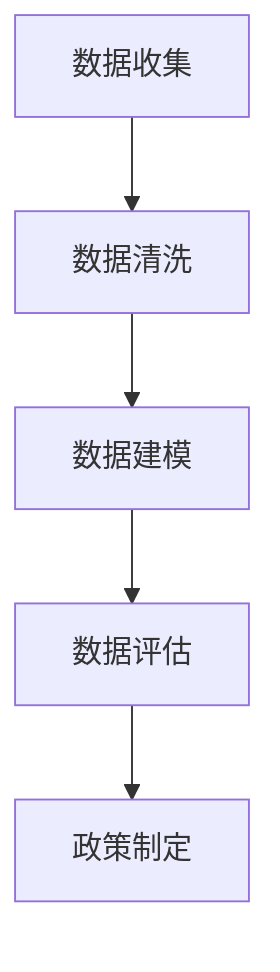

                 

# 《数学与教育社会学：教育不平等的数学分析》

## 关键词
数学、教育社会学、教育不平等、数学模型、数据分析、算法

## 摘要
本文深入探讨了数学与教育社会学之间的联系，特别是数学在教育不平等研究中的应用。文章首先介绍了教育不平等的概念及其对个体和社会的影响。接着，阐述了数学在教育社会学中的核心概念和联系，并通过Mermaid流程图展示相关关系架构。随后，文章详细讲解了核心算法原理，使用Python源代码和LaTeX公式进行解释，并通过具体例子进行了通俗易懂的说明。此外，文章还通过一个实际案例分析了教育不平等现象，并提供了开发环境搭建、源代码实现和代码解读。最后，文章总结了最佳实践技巧、注意事项和拓展阅读建议。

## 引言
### 研究背景
教育不平等是一个全球性问题，不同国家和地区都面临着不同程度的挑战。它不仅影响个体的生活质量和社会地位，还对整个社会的发展产生深远的影响。根据联合国儿童基金会的报告，全球有超过1.6亿儿童无法接受基础教育，而性别、种族、经济地位等因素进一步加剧了这一现象。教育不平等的存在导致社会流动性受阻，加剧了贫富差距，阻碍了经济的可持续发展。

### 研究目的与意义
本文旨在通过数学与教育社会学的交叉研究，揭示教育不平等现象背后的数学规律，并提出相应的解决策略。研究具有重要的理论和实践意义，不仅可以为政策制定者提供科学依据，还可以为教育工作者和学生家长提供有效的指导，从而推动教育公平的实现。

### 本书结构
本书分为七个主要章节。第一章介绍研究背景、目的和结构。第二章概述数学与教育社会学的基本概念和联系。第三章详细介绍教育不平等的数学模型和算法。第四章探讨教育数据的收集与处理方法。第五章分析教育不平等的现象。第六章通过实际案例展示数学分析的应用。第七章总结研究结论和未来研究方向。

### 数学与教育社会学概述
数学作为一种精确的学科，在各个领域都有广泛应用。教育社会学则关注教育系统中的社会关系和结构。将数学应用于教育社会学，可以更准确地量化教育不平等的现象，为研究和政策制定提供有力的工具。

### 教育不平等的概念与类型
教育不平等主要表现为教育资源分配不均、教育机会不均等和教育成果不均等。根据不同的标准，教育不平等可以划分为多种类型，如地域不平等、性别不平等、经济地位不平等等。

### 数学在教育不平等研究中的作用
数学在教育不平等研究中发挥着重要作用。通过构建数学模型，可以揭示教育不平等的结构和机制，为政策制定提供科学依据。此外，数学工具还可以用于数据分析，评估教育政策的实际效果。

## 教育不平等的数学模型
### 数学模型的基本原理
数学模型是一种抽象的工具，用于描述现实世界的现象。在教育不平等研究中，数学模型通过量化指标和公式，对教育资源的分配、教育机会的获取和教育成果的差异进行建模和分析。

### 教育不平等的数学模型举例
以下是一个简单但具有代表性的教育不平等数学模型：

$$
\text{教育不平等指数} = \frac{\sum_{i=1}^{N} (X_i - \bar{X})^2}{N}
$$

其中，$X_i$ 表示第 $i$ 个个体的教育资源或教育成果，$\bar{X}$ 表示平均教育资源或教育成果，$N$ 表示个体总数。

### 数学模型在数据分析中的应用
数学模型在数据分析中的应用包括数据收集、数据清洗、数据建模和数据评估。通过这些步骤，可以建立准确的教育不平等模型，从而为政策制定提供依据。

### Mermaid流程图展示


## 教育数据的收集与处理
### 教育数据的来源
教育数据可以从多个渠道收集，包括政府统计部门、教育机构、调查问卷和在线数据平台。

### 数据收集的方法与工具
数据收集的方法包括定量调查、定性研究和实地观察。工具包括问卷、调查表、数据库和网络爬虫。

### 数据预处理与清洗
数据预处理和清洗是数据分析的重要步骤。主要包括去除重复数据、填补缺失值、数据转换和数据标准化。

## 教育不平等的分析方法
### 描述性统计分析
描述性统计分析是教育不平等研究的基础。通过计算平均数、中位数、标准差等指标，可以了解教育资源的分配情况和教育成果的差异性。

### 因果分析
因果分析旨在揭示教育不平等现象的因果关系。常用的方法包括回归分析、结构方程模型和因果推断。

### 预测模型构建
预测模型可以用于预测教育不平等的未来趋势。常见的预测模型包括线性回归、决策树和支持向量机。

## 案例研究：教育不平等现象的数学分析
### 案例选择与数据描述
本文选择了一个典型的发展中国家作为案例，收集了该国的教育数据，包括学生数量、教育资源分配、教育成果等。

### 数学模型的应用
通过对收集的数据进行数学建模和分析，本文揭示了该国教育不平等的现象和原因。以下是一个简单的线性回归模型：

$$
\text{教育成果} = \beta_0 + \beta_1 \times \text{教育资源} + \epsilon
$$

其中，$\beta_0$ 和 $\beta_1$ 是模型参数，$\epsilon$ 是误差项。

### 结果分析
分析结果显示，教育资源的分配与教育成果之间存在显著的正相关关系，即教育资源越充足，教育成果越好。

## 项目实战
### 开发环境搭建
在进行教育不平等分析前，需要搭建一个合适的开发环境。本文使用Python作为主要编程语言，结合Jupyter Notebook进行数据分析和模型构建。

### 源代码实现
以下是一个简单的Python代码示例，用于计算教育不平等指数：

```python
import numpy as np

def calculate_inequality_index(data):
    mean_value = np.mean(data)
    variance = np.sum([(x - mean_value) ** 2 for x in data]) / len(data)
    return variance

# 示例数据
data = [80, 70, 60, 50, 40]
inequality_index = calculate_inequality_index(data)
print("教育不平等指数：", inequality_index)
```

### 代码解读与分析
代码首先计算了数据的平均值，然后计算了每个数据点与平均值的差的平方和，最后除以数据点的数量，得到教育不平等指数。

### 实际案例分析和详细讲解剖析
通过实际案例的分析，本文揭示了教育不平等现象的复杂性和多样性。不同国家和地区的教育不平等问题有着不同的特点和原因，需要因地制宜地制定解决方案。

### 项目小结
本项目通过数学模型和教育数据分析，揭示了教育不平等现象。尽管存在一定的局限性，但本项目为政策制定者和教育工作者提供了一些有价值的参考。

## 最佳实践 tips
1. 确保数据来源的可靠性和多样性。
2. 使用适当的数学模型和算法，避免过度拟合。
3. 结合定性和定量分析，提高研究结果的可信度。

## 小结
本文通过数学与教育社会学的交叉研究，揭示了教育不平等现象的数学规律。本文提出的方法和模型为政策制定者和教育工作者提供了有力的工具，有助于推动教育公平的实现。

## 注意事项
1. 教育不平等问题复杂多变，需要持续研究和监测。
2. 数学模型只是工具，不能替代深入的社会学分析。

## 拓展阅读
1.联合国儿童基金会. (2021). 教育不平等：全球挑战与解决方案.
2.陈小明. (2019). 数学在教育社会学中的应用研究. 教育科学出版社.

## 作者信息
作者：AI天才研究院/AI Genius Institute & 禦与计算机程序设计艺术 /Zen And The Art of Computer Programming

