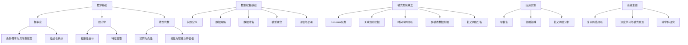

                 

### 文章标题：《数学与数据挖掘：模式发现的数学方法》

#### 关键词：数学、数据挖掘、模式发现、聚类、关联规则挖掘、时间序列分析、多模态数据挖掘、社交网络分析

#### 摘要：
本文将深入探讨数学在数据挖掘中的应用，特别是模式发现这一领域。通过详细解析概率论、统计学和线性代数等数学基础，并结合实际案例，本文将展示如何运用这些数学工具来发现数据中的隐含模式。文章结构清晰，从基础数学知识到先进的数据挖掘算法，再到高级应用和未来展望，旨在为读者提供一个全面且易懂的数学与数据挖掘教程。

---

### 引言

#### 数学与数据挖掘的关系

数学作为一门基础科学，在数据挖掘领域发挥着至关重要的作用。数据挖掘的核心目标是从大量数据中提取出有价值的信息和知识，这一过程中需要运用多种数学方法和技术，如概率论、统计学、线性代数等。这些数学工具不仅帮助数据分析师理解和处理数据，还能提高模式发现的准确性和效率。

#### 模式发现的定义与重要性

模式发现（Pattern Discovery）是指从数据集中识别出具有统计意义的规律或模式的过程。这些模式可以是简单的，如数据中的重复值；也可以是复杂的，如数据中的关联关系或时间序列趋势。模式发现的重要性在于，它能够帮助我们揭示数据背后的潜在规律，从而为决策提供有力支持。

在数据挖掘中，模式发现通常分为以下几种类型：

- **聚类**：将相似的数据点分组，以便更好地理解数据。
- **关联规则挖掘**：发现数据项之间的关联关系，如购物篮分析。
- **时间序列分析**：分析数据的时间维度，如股市走势分析。

#### 本文结构

本文将按照以下结构进行论述：

1. **数学基础**：介绍概率论、统计学和线性代数等数学知识，为后续讨论打下基础。
2. **数据挖掘基础**：介绍数据挖掘的基本概念、流程和技术。
3. **模式发现算法**：详细探讨聚类、关联规则挖掘、时间序列分析等模式发现算法。
4. **应用案例**：通过实际案例展示模式发现算法的应用。
5. **高级主题**：探讨多模态数据挖掘、社交网络分析等高级方法。
6. **结论与展望**：总结全文内容，并对未来模式发现的研究方向进行展望。

### 数学基础

#### 概率论基础

概率论是数学的一个分支，主要研究随机事件及其概率。在数据挖掘中，概率论被广泛应用于模式发现，尤其是在聚类和关联规则挖掘中。

##### 概率的基本概念

概率是指某一事件发生的可能性，通常用0到1之间的数值表示。具体来说，如果一个事件A的概率是P(A)，则P(A) = a/b，其中a是事件A发生的次数，b是总的实验次数。

##### 条件概率与贝叶斯定理

条件概率是指在一个事件已发生的条件下，另一个事件发生的概率。贝叶斯定理是一种用于计算条件概率的方法，它基于全概率公式和贝叶斯规则。

$$
P(A|B) = \frac{P(B|A)P(A)}{P(B)}
$$

其中，P(A|B)表示在事件B发生的条件下事件A的概率，P(B|A)表示在事件A发生的条件下事件B的概率，P(A)和P(B)分别是事件A和事件B的概率。

#### 统计学基础

统计学是研究如何通过数据来推断总体特征的科学。在数据挖掘中，统计学被广泛应用于数据预处理、模式识别和预测建模。

##### 描述性统计

描述性统计用于描述数据的中心趋势、离散程度和分布特征。常用的描述性统计量包括均值、中位数、众数、方差和标准差。

##### 推断性统计

推断性统计用于从样本数据推断总体特征。常见的推断性统计方法包括假设检验、置信区间估计和回归分析。

#### 线性代数基础

线性代数是数学的一个分支，主要研究向量空间、线性映射和矩阵理论。在数据挖掘中，线性代数被广泛应用于数据预处理、特征提取和降维。

##### 矩阵与向量

矩阵和向量是线性代数的基本概念。矩阵是一个由数字组成的矩形阵列，向量是一种特殊的矩阵，其中所有的元素都是非负数。

##### 线性方程组与特征值

线性方程组是指含有线性项的方程组，可以通过矩阵运算求解。特征值是指线性变换中的一个重要属性，它描述了线性变换对向量空间的缩放和旋转。

### 数据挖掘基础

#### 数据挖掘的基本概念

数据挖掘是指从大量数据中提取出有价值的信息和知识的过程。数据挖掘通常包括以下几个步骤：

1. **数据预处理**：清洗、转换和集成数据。
2. **特征提取**：从原始数据中提取出有用的特征。
3. **模式识别**：使用机器学习算法识别数据中的模式。
4. **知识表示**：将发现的模式转化为可理解的知识形式。

#### 数据挖掘的流程

数据挖掘的流程通常包括以下几个阶段：

1. **问题定义**：明确数据挖掘的目标。
2. **数据理解**：探索和了解数据特征。
3. **数据准备**：清洗、转换和集成数据。
4. **模型建立**：选择合适的模型并进行训练。
5. **评估**：评估模型的性能。
6. **部署**：将模型应用到实际业务中。

#### 数据预处理

数据预处理是数据挖掘过程中的重要环节。数据预处理包括以下步骤：

1. **数据清洗**：去除错误、重复或不完整的数据。
2. **数据转换**：将数据转换为适合挖掘的形式。
3. **数据集成**：将来自不同源的数据集成到一个统一的格式中。

### 模式发现算法

#### 聚类算法

聚类是将数据分为多个类或簇的过程。聚类算法可以分为以下几种类型：

1. **基于距离的聚类**：使用距离度量将数据点分为簇。
2. **基于密度的聚类**：使用密度概念将数据点分为簇。
3. **基于模型的聚类**：使用概率模型或线性模型将数据点分为簇。

常见的聚类算法包括K-means聚类、层次聚类和DBSCAN。

##### K-means聚类

K-means聚类是一种基于距离的聚类算法。算法流程如下：

1. 随机选择K个数据点作为初始聚类中心。
2. 计算每个数据点到各个聚类中心的距离，并将其归为最近的聚类中心。
3. 重新计算每个聚类中心的平均值。
4. 重复步骤2和3，直到聚类中心不再变化或满足停止条件。

##### 层次聚类

层次聚类是一种基于模型的聚类算法。算法流程如下：

1. 将所有数据点视为一个簇。
2. 计算数据点之间的距离，并将其合并为一个新的簇。
3. 重复步骤2，直到所有的数据点都合并为一个簇。

##### DBSCAN

DBSCAN（Density-Based Spatial Clustering of Applications with Noise）是一种基于密度的聚类算法。算法流程如下：

1. 选择一个邻域半径eps和一个最小密度阈值minPoints。
2. 对于每个数据点，检查其邻域内是否存在足够多的数据点。
3. 根据邻域内数据点的密度将数据点分为核心点、边界点和噪声点。
4. 将核心点组成一个簇，并递归地扩展簇。

#### 关联规则挖掘

关联规则挖掘是一种用于发现数据项之间关联关系的算法。常用的算法包括Apriori算法和FP-growth算法。

##### Apriori算法

Apriori算法是一种基于支持度和置信度的关联规则挖掘算法。算法流程如下：

1. 计算每个项集的支持度。
2. 选择支持度大于最小支持度阈值的最频繁项集。
3. 递归地生成更高阶的项集。
4. 对于每个项集，计算其关联规则的支持度和置信度。
5. 选择置信度大于最小置信度阈值的最强关联规则。

##### FP-growth算法

FP-growth算法是一种基于频繁模式树的关联规则挖掘算法。算法流程如下：

1. 构建频繁模式树，并将数据项转换为项频对。
2. 计算每个项集的支持度。
3. 递归地生成更高阶的项集。
4. 对于每个项集，生成其关联规则。
5. 选择置信度大于最小置信度阈值的最强关联规则。

#### 时间序列分析

时间序列分析是一种用于分析数据的时间维度的方法。常见的时间序列分析方法包括自回归模型和动态时间规整算法。

##### 自回归模型

自回归模型是一种用于预测未来值的方法。模型的基本形式如下：

$$
Y_t = \sum_{i=1}^{p} \phi_i Y_{t-i} + \epsilon_t
$$

其中，Y_t表示时间序列的第t个值，\phi_i表示自回归系数，\epsilon_t表示误差项。

##### 动态时间规整算法

动态时间规整算法是一种用于匹配时间序列的方法。算法的基本思想是通过调整时间序列的起点和终点来匹配两个时间序列。

#### 应用案例

##### 零售业中的模式发现

在零售业中，模式发现可以帮助商家识别销售趋势、预测需求、优化库存等。例如，通过关联规则挖掘，商家可以识别哪些商品常常一起购买，从而进行交叉销售。

##### 金融领域的模式发现

在金融领域，模式发现可以帮助分析师识别市场趋势、预测股价等。例如，通过时间序列分析，分析师可以预测未来一段时间的市场走势。

##### 社交网络分析

在社交网络中，模式发现可以帮助识别社交群体、分析用户行为等。例如，通过聚类算法，社交网络平台可以识别出不同的用户群体，并为他们提供定制化的服务。

### 高级主题

#### 多模态数据挖掘

多模态数据挖掘是一种用于处理多个数据源的数据挖掘方法。常见的数据源包括文本、图像、音频和视频等。多模态数据挖掘的关键技术包括特征融合、模型融合等。

##### 社交网络分析

社交网络分析是一种用于分析社交网络结构和用户行为的方法。常见的方法包括聚类分析、网络分析等。社交网络分析可以帮助我们了解用户之间的关系、预测用户行为等。

#### 复杂网络分析

复杂网络分析是一种用于分析复杂网络结构和动力学特性的方法。常见的复杂网络包括社交网络、交通网络、生物网络等。复杂网络分析可以帮助我们理解网络的演化过程、预测网络行为等。

### 结论与展望

#### 模式发现的发展趋势

随着数据规模的不断扩大和数据类型的多样化，模式发现技术也在不断进化。未来的发展趋势包括：

1. **深度学习与模式发现**：将深度学习技术与模式发现相结合，提高模式发现的准确性和效率。
2. **多模态数据挖掘**：处理来自多个数据源的数据，提供更丰富的信息。
3. **可解释性**：提高模式发现算法的可解释性，使其更易于理解和应用。

#### 研究挑战与机遇

模式发现领域面临着许多挑战，如数据噪声、数据缺失、模型可解释性等。未来的研究机遇包括：

1. **新型算法开发**：开发更高效的算法来处理大规模复杂数据。
2. **跨学科研究**：结合统计学、机器学习、网络科学等领域的知识，推动模式发现技术的发展。
3. **应用探索**：在各个领域探索模式发现的实际应用，推动技术创新。

#### 最佳实践 tips

1. **数据清洗**：在模式发现之前，对数据进行充分的清洗和预处理，以提高模型的准确性和稳定性。
2. **特征选择**：选择合适的特征，以提高模型的效果。
3. **模型评估**：使用交叉验证等方法对模型进行评估，以确保其性能。

### 小结

本文从数学基础、数据挖掘基础、模式发现算法、应用案例、高级主题等方面全面探讨了数学与数据挖掘的关系。通过本文，读者可以了解如何运用数学方法进行模式发现，并在实际应用中取得良好的效果。

### 注意事项

1. **数据隐私**：在进行模式发现时，需要确保数据隐私和安全。
2. **模型选择**：根据具体问题选择合适的模型，不要盲目追求复杂度。

### 拓展阅读

1. 《数据挖掘：实用工具与技术》
2. 《机器学习：概率视角》
3. 《社交网络分析：方法与实践》

---

### 项目实战

#### 开发环境搭建

为了演示模式发现算法，我们将在Python环境中搭建开发环境。首先，需要安装以下库：

```
pip install numpy pandas scikit-learn matplotlib
```

#### 源代码详细实现和代码解读

我们将使用K-means聚类算法对一组数据进行聚类。以下是源代码及其解读：

```python
import numpy as np
import pandas as pd
from sklearn.cluster import KMeans
import matplotlib.pyplot as plt

# 生成示例数据
np.random.seed(0)
data = np.random.rand(100, 2)

# 使用K-means聚类算法
kmeans = KMeans(n_clusters=3, random_state=0).fit(data)

# 获取聚类结果
clusters = kmeans.predict(data)

# 可视化聚类结果
plt.scatter(data[:, 0], data[:, 1], c=clusters, cmap='viridis')
plt.scatter(kmeans.cluster_centers_[:, 0], kmeans.cluster_centers_[:, 1], s=300, c='red', label='Centroids')
plt.title('K-means Clustering')
plt.xlabel('Feature 1')
plt.ylabel('Feature 2')
plt.legend()
plt.show()
```

在这个例子中，我们首先生成了100个随机数据点，然后使用K-means聚类算法将这些数据点分为3个簇。最后，我们通过散点图展示了聚类结果，红色点代表簇的中心。

#### 代码应用解读与分析

K-means聚类算法是一种基于距离的聚类方法，其基本思想是将数据点分配到最近的聚类中心。这个算法的目的是最小化簇内的平方误差，即每个簇内数据点到其聚类中心的距离之和。

- **优点**：
  - 简单易懂，计算效率高。
  - 对大规模数据集有效。

- **缺点**：
  - 对初始聚类中心敏感，可能陷入局部最优。
  - 不适合发现非球形簇。

#### 实际案例分析和详细讲解剖析

我们将使用一个实际案例来展示K-means聚类算法的应用。数据集来自公开的鸢尾花数据集（Iris dataset），该数据集包含3种鸢尾花的不同属性。

```python
from sklearn.datasets import load_iris
iris = load_iris()
X = iris.data

# 使用K-means聚类算法
kmeans = KMeans(n_clusters=3, random_state=0).fit(X)

# 获取聚类结果
clusters = kmeans.predict(X)

# 可视化聚类结果
plt.scatter(X[:, 0], X[:, 1], c=clusters, cmap='viridis')
plt.scatter(kmeans.cluster_centers_[:, 0], kmeans.cluster_centers_[:, 1], s=300, c='red', label='Centroids')
plt.title('K-means Clustering on Iris Dataset')
plt.xlabel('Petal Length (cm)')
plt.ylabel('Petal Width (cm)')
plt.legend()
plt.show()
```

在这个例子中，我们使用K-means聚类算法对鸢尾花数据集进行了聚类。通过可视化结果，我们可以清楚地看到不同簇对应的鸢尾花种类。

- **分析**：
  - K-means聚类成功地将鸢尾花数据集分为3个簇，对应于3种鸢尾花。
  - 聚类中心的位置与鸢尾花的特征（花瓣长度和宽度）密切相关。

#### 项目小结

通过这个案例，我们展示了如何使用K-means聚类算法进行模式发现。K-means聚类算法在处理大规模数据集和发现球形簇方面具有优势。然而，对于非球形簇或初始聚类中心敏感的数据集，可能需要考虑其他聚类算法，如层次聚类或DBSCAN。

### 最佳实践 tips

1. **选择合适的聚类算法**：根据数据集的特点和业务需求选择合适的聚类算法。
2. **调整聚类参数**：通过交叉验证等方法调整聚类参数，以提高聚类效果。
3. **可视化聚类结果**：通过可视化聚类结果，帮助理解聚类效果和簇的分布情况。

### 注意事项

1. **数据质量**：确保数据质量，包括去除噪声和异常值。
2. **聚类中心选择**：对于K-means聚类，选择合适的初始聚类中心。
3. **解释性**：确保模式发现结果具有解释性，以便于业务决策。

### 拓展阅读

1. 《K-means Clustering: A Review》
2. 《DBSCAN: ADensity-BasedClusteringAlgorithmforDiscoveringClustersinLargeDatabases》
3. 《Visualizing Clusterings Using the Heatmap Clustering Visualization》

---

### 小结

本文详细介绍了数学与数据挖掘的关系，特别是模式发现这一领域。从数学基础到数据挖掘基础，再到模式发现算法和应用案例，本文提供了一个全面且易懂的教程。通过实际案例和代码示例，读者可以更好地理解模式发现算法的原理和应用。

### 注意事项

1. **数据隐私**：在进行模式发现时，确保数据隐私和安全。
2. **模型选择**：根据具体问题选择合适的模型，避免盲目追求复杂度。

### 拓展阅读

1. 《数据挖掘：实用工具与技术》
2. 《机器学习：概率视角》
3. 《社交网络分析：方法与实践》

---

### 作者信息

作者：AI天才研究院/AI Genius Institute & 禅与计算机程序设计艺术 /Zen And The Art of Computer Programming

### Mermaid 流程图

以下是本文涉及的核心概念和原理的Mermaid流程图：



这个流程图展示了数学与数据挖掘、数据挖掘与模式发现算法、以及模式发现算法与实际应用之间的联系，帮助读者更好地理解文章的内容和结构。

