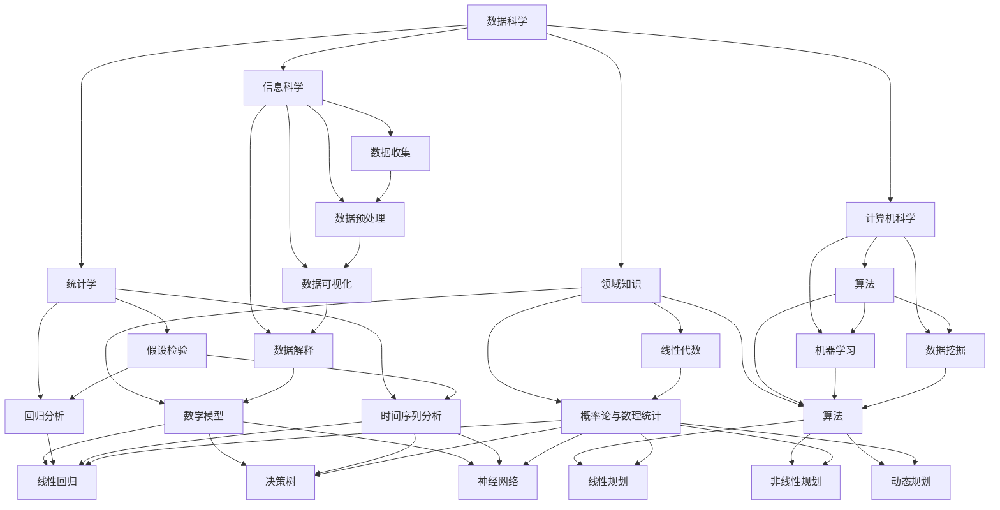

                 

### 引言与背景

在当今的信息时代，数据已经成为社会经济发展的重要资源。大数据技术的迅猛发展，使得我们能够从海量数据中挖掘出有价值的信息，从而为决策提供有力的支持。然而，这些数据背后隐藏的复杂模式与规律，需要运用数学工具来进行深入分析。数学与数据科学在这一过程中起到了桥梁作用，不仅提供了理论框架，还赋予了实践操作中的工具和方法。

首先，数学作为一门基础学科，具有高度抽象和逻辑严密的特点。从基础的代数、几何到高等数学，每一个分支都在不同层面为数据科学提供了理论支持。例如，线性代数在数据预处理中用于降维和特征提取，微积分在优化算法中用于寻找最优解。这些数学工具能够帮助我们更好地理解数据背后的结构。

数据科学则更侧重于实际应用。它结合了统计学、计算机科学和领域知识，致力于从数据中发现模式、预测趋势和制定策略。数据科学的主要任务包括数据收集、数据预处理、数据分析、数据可视化以及数据解释等。这些任务都需要数学工具的支持。

数学与数据科学的结合，为大数据分析提供了强大的动力。大数据分析不仅要求我们对数据进行分析，还要求我们能够从复杂的数据中提取出有价值的信息。这需要我们运用数学模型和算法，将数据转化为可操作的知识。例如，线性回归模型可以用于预测销售数据，聚类算法可以用于市场细分，神经网络可以用于图像识别。

本文旨在介绍数学与数据科学在大数据分析中的应用，通过以下几个方面的内容展开：

1. **数学与数据科学基础**：介绍数学与数据科学的核心概念，以及它们之间的联系。
2. **数据分析和预处理**：详细讲解数据探索性分析、数据预处理方法以及数据降维技术。
3. **大数据分析算法原理**：深入分析常用的机器学习算法、数据挖掘算法及其在数据分析中的应用。
4. **数学模型与大数据分析**：探讨数学模型在数据分析中的具体应用，如线性规划、时间序列分析等。
5. **数学工具与大数据处理平台**：介绍常见的大数据处理平台及其数学工具的应用。
6. **大数据分析项目实战**：通过实际案例，展示如何运用数学工具进行大数据分析。

通过这些章节的详细讲解，我们将更好地理解数学与数据科学在大数据分析中的重要作用，并掌握相应的应用技能。

### 核心概念与联系

要深入理解数学与数据科学在大数据分析中的应用，我们首先需要明确几个核心概念，并探讨它们之间的联系。以下是几个关键概念及其相互关系：

**1. 数据科学**：数据科学是一门多学科交叉的领域，它结合了统计学、计算机科学、信息科学和领域知识，旨在从数据中提取知识。数据科学的主要任务包括数据收集、数据预处理、数据分析、数据可视化以及数据解释等。数据收集是数据科学的基础，数据预处理是为了提高数据质量和可用性，数据分析则是通过算法和模型来发现数据中的隐藏模式。数据可视化可以帮助我们直观地理解数据，而数据解释则是对分析结果进行合理的解释和应用。

**2. 数学模型**：数学模型是通过数学语言和符号描述的模型，用于解决实际问题。数学模型可以是线性的，也可以是非线性的；可以是静态的，也可以是动态的。在数据科学中，数学模型用于预测、分类、优化等任务。常见的数学模型包括线性回归模型、决策树、神经网络等。数学模型的核心是建立变量之间的关系，并通过数学公式进行描述。

**3. 算法**：算法是解决问题的一系列步骤或规则。在数据科学中，算法用于实现数学模型，并处理数据。算法可以是基于数学模型的，也可以是启发式的。常见的算法包括机器学习算法、数据挖掘算法等。机器学习算法用于从数据中学习规律，如线性回归、支持向量机、神经网络等；数据挖掘算法用于发现数据中的模式和关联，如关联规则学习、聚类分析等。

**4. 统计学**：统计学是数学的一个分支，用于处理数据并得出结论。统计学提供了许多工具和理论，如假设检验、回归分析、时间序列分析等。统计学在数据科学中扮演了重要角色，它帮助我们理解和解释数据，并评估模型的性能。

**5. 线性代数**：线性代数是数学的一个分支，研究向量、矩阵和线性变换。线性代数在数据科学中有广泛的应用，如降维、特征提取、数据可视化等。线性代数的基本概念和工具，如矩阵运算、特征值和特征向量、线性变换等，都是数据科学中不可或缺的。

**6. 概率论与数理统计**：概率论和数理统计是数学的另一个重要分支，研究随机现象和数据的规律。概率论提供了计算随机事件发生概率的工具，而数理统计则用于对数据进行假设检验、估计参数和评估模型性能等。概率论和数理统计是构建和评估数学模型的基础。

这些概念之间的联系构成了数学与数据科学的核心框架。数学模型通过算法来实现，算法通过统计学方法来评估和优化。线性代数和概率论与数理统计为这些模型和算法提供了理论基础。数据科学则将这些理论应用于实际问题，通过数据收集、预处理和分析，最终实现数据的增值。

以下是一个 Mermaid 流程图，展示了这些核心概念之间的相互关系：



通过这个流程图，我们可以清晰地看到数学与数据科学之间错综复杂的联系。理解这些核心概念及其相互关系，不仅有助于我们深入掌握数据科学的基本理论，还能在实际应用中灵活运用这些理论，解决复杂的问题。

### 数据分析与预处理

在进入大数据分析之前，我们需要对数据进行充分的探索和预处理。数据分析与预处理是大数据分析流程中的关键环节，它们确保数据的质量和可用性，为后续的数据建模和分析打下坚实基础。

#### 1. 数据探索性分析

数据探索性分析（Exploratory Data Analysis，EDA）是大数据分析的第一步，旨在通过统计分析、可视化等方法对数据进行初步探索，发现数据中的模式、异常值和潜在问题。以下是数据探索性分析的关键步骤：

**1.1 描述性统计**：描述性统计用于计算数据的中心趋势、离散程度和分布情况。常用的统计量包括均值、中位数、众数、方差、标准差等。描述性统计可以帮助我们了解数据的整体特征。

**1.2 聚类分析**：聚类分析是一种无监督学习方法，用于将数据划分为不同的组或簇。常用的聚类算法包括K-均值聚类、层次聚类等。聚类分析可以帮助我们发现数据中的隐含结构。

**1.3 分布分析**：分布分析用于研究数据在不同维度上的分布情况。通过绘制直方图、密度图等，我们可以直观地了解数据的分布特征。分布分析有助于识别异常值和潜在的异常分布。

**示例**：假设我们有一组销售数据，包括销售额、顾客满意度、销售渠道等。通过对这些数据执行描述性统计，我们可以计算出每个销售渠道的平均销售额和标准差，从而识别出表现异常的渠道。通过聚类分析，我们可以将顾客根据满意度分为不同的群体，为市场营销策略提供依据。通过分布分析，我们可以发现销售额的分布特征，识别出高销售额的时段和渠道。

```python
import pandas as pd
import matplotlib.pyplot as plt
import seaborn as sns

# 加载数据
data = pd.read_csv('sales_data.csv')

# 描述性统计
print(data.describe())

# 聚类分析
from sklearn.cluster import KMeans
kmeans = KMeans(n_clusters=3, random_state=0).fit(data[['satisfaction', 'sales_channel']])
data['cluster'] = kmeans.predict(data[['satisfaction', 'sales_channel']])
print(data.groupby('cluster')['sales'].mean())

# 分布分析
sns.histplot(data['sales'], kde=True)
plt.show()
```

#### 2. 数据预处理

数据预处理（Data Preprocessing）是确保数据质量的重要步骤，包括数据清洗、数据转换和数据降维等。以下是数据预处理的几个关键步骤：

**2.1 数据清洗**：数据清洗旨在去除数据中的噪声和错误，提高数据的准确性和完整性。常见的清洗操作包括缺失值处理、异常值检测和修正、重复数据删除等。

**2.2 数据转换**：数据转换是指将数据转换为适合分析和建模的形式。常见的转换方法包括数据规范化、数据标准化、编码等。数据转换可以消除数据之间的尺度差异，提高算法的性能。

**2.3 数据降维**：数据降维（Dimensionality Reduction）是指通过减少数据维度来降低计算复杂度和提高分析效率。常用的降维方法包括主成分分析（PCA）、线性判别分析（LDA）等。

**示例**：假设我们有一组包含多个特征的销售数据，其中某些特征之间存在强相关性。通过主成分分析，我们可以将高维数据降维到较低维度，同时保留主要的信息。

```python
from sklearn.decomposition import PCA
from sklearn.preprocessing import StandardScaler

# 数据清洗
data.fillna(data.mean(), inplace=True)

# 数据转换
scaler = StandardScaler()
data_scaled = scaler.fit_transform(data)

# 数据降维
pca = PCA(n_components=2)
data_reduced = pca.fit_transform(data_scaled)

# 可视化
plt.scatter(data_reduced[:, 0], data_reduced[:, 1])
plt.xlabel('Principal Component 1')
plt.ylabel('Principal Component 2')
plt.show()
```

通过数据探索性分析和数据预处理，我们可以确保数据的质量和可用性，为后续的数据建模和分析奠定基础。数据探索性分析帮助我们理解数据的整体特征，发现潜在的问题和模式；数据预处理则通过清洗、转换和降维等操作，提高数据的准确性和效率。这些步骤不仅确保了数据分析的顺利进行，也为最终的决策提供了可靠的数据支持。

### 大数据分析算法原理

大数据分析的核心在于运用算法对海量数据进行处理和分析，以发现数据中的模式和规律。本章节将详细介绍几种常见的大数据分析算法，包括机器学习算法和数据挖掘算法，并探讨这些算法的原理和在实际数据分析中的应用。

#### 1. 机器学习算法

机器学习算法是一类通过训练从数据中学习规律并作出预测的算法。根据学习的性质，机器学习算法可以分为监督学习、非监督学习和半监督学习。以下介绍几种常见的机器学习算法及其在数据分析中的应用。

**1.1 监督学习算法**

监督学习算法通过训练有标签的数据集来建立预测模型，已广泛应用于分类和回归任务。以下介绍几种监督学习算法：

- **线性回归（Linear Regression）**：线性回归是一种简单且常用的监督学习算法，用于预测连续值输出。其核心思想是通过线性模型拟合输入变量和输出变量之间的关系。线性回归的公式为：

  $$ y = \beta_0 + \beta_1x_1 + \beta_2x_2 + ... + \beta_nx_n $$

  其中，\( y \) 为预测值，\( x_1, x_2, ..., x_n \) 为输入特征，\( \beta_0, \beta_1, ..., \beta_n \) 为模型参数。

  **应用示例**：假设我们想要预测某家电商平台的销售额，输入特征包括商品种类、广告投放量和天气状况。通过训练线性回归模型，我们可以预测在不同条件下销售额的期望值。

  ```python
  import numpy as np
  from sklearn.linear_model import LinearRegression

  # 输入特征和标签
  X = np.array([[1, 2], [2, 3], [3, 4]])
  y = np.array([2, 4, 6])

  # 训练线性回归模型
  model = LinearRegression()
  model.fit(X, y)

  # 预测
  X_new = np.array([[2, 3]])
  y_pred = model.predict(X_new)
  print(y_pred)
  ```

- **支持向量机（Support Vector Machine，SVM）**：支持向量机是一种强大的分类算法，其核心思想是找到最优的超平面，使得分类边界具有最大的间隔。SVM可以使用不同的核函数进行非线性分类。

  $$ \min_{\beta, \beta_0} \frac{1}{2} \sum_{i=1}^{n} (\beta \cdot \beta)^T - \sum_{i=1}^{n} \alpha_i y_i (\beta \cdot x_i + \beta_0) $$

  其中，\( \beta \) 和 \( \beta_0 \) 分别为权重向量和偏置项，\( \alpha_i \) 为拉格朗日乘子。

  **应用示例**：假设我们有一组客户数据，包括收入、年龄和消费习惯等特征，我们需要将客户划分为高价值客户和普通客户。通过训练SVM模型，我们可以找出最优的分类边界。

  ```python
  from sklearn.svm import SVC

  # 输入特征和标签
  X = np.array([[1, 2], [2, 3], [3, 4], [4, 5]])
  y = np.array([0, 0, 1, 1])

  # 训练SVM模型
  model = SVC(kernel='linear')
  model.fit(X, y)

  # 预测
  X_new = np.array([[2, 3]])
  y_pred = model.predict(X_new)
  print(y_pred)
  ```

- **决策树（Decision Tree）**：决策树是一种直观且易于解释的分类和回归算法，其核心思想是通过一系列判断条件将数据划分为不同的类别或值。决策树的构建过程涉及到信息增益、基尼系数等指标。

  $$ Gini = 1 - \sum_{i=1}^{n} p_i(1 - p_i) $$

  其中，\( p_i \) 为样本中属于类别 \( i \) 的概率。

  **应用示例**：假设我们想要预测一个客户的信用评级，输入特征包括收入、信用记录和职业等。通过构建决策树模型，我们可以根据不同的特征值预测客户的信用评级。

  ```python
  from sklearn.tree import DecisionTreeClassifier

  # 输入特征和标签
  X = np.array([[1, 2], [2, 3], [3, 4], [4, 5]])
  y = np.array([0, 0, 1, 1])

  # 训练决策树模型
  model = DecisionTreeClassifier()
  model.fit(X, y)

  # 预测
  X_new = np.array([[2, 3]])
  y_pred = model.predict(X_new)
  print(y_pred)
  ```

**1.2 非监督学习算法**

非监督学习算法没有明确的标签数据，其主要任务是从数据中发现内在的结构和模式。以下介绍几种常见的非监督学习算法：

- **K-均值聚类（K-Means Clustering）**：K-均值聚类是一种基于距离的聚类算法，其核心思想是找到 \( K \) 个中心点，使得每个数据点与其最近的中心点属于同一个簇。聚类过程中会不断更新中心点，直到达到收敛条件。

  $$ \text{Objective Function} = \sum_{i=1}^{K} \sum_{x_j \in S_i} d(x_j, \mu_i)^2 $$

  其中，\( S_i \) 为第 \( i \) 个簇，\( \mu_i \) 为簇中心。

  **应用示例**：假设我们有一组顾客数据，包括收入、年龄和消费习惯等特征，我们需要将顾客划分为不同的群体。通过训练K-均值聚类模型，我们可以将顾客分为不同的群体。

  ```python
  from sklearn.cluster import KMeans

  # 输入特征
  X = np.array([[1, 2], [2, 3], [3, 4], [4, 5]])

  # 训练K-均值聚类模型
  model = KMeans(n_clusters=2)
  model.fit(X)

  # 聚类结果
  print(model.labels_)

  # 聚类中心点
  print(model.cluster_centers_)
  ```

- **主成分分析（Principal Component Analysis，PCA）**：主成分分析是一种降维技术，其核心思想是通过线性变换将高维数据投影到低维空间，同时保留主要的信息。PCA通过计算协方差矩阵和特征值特征向量，找到新的坐标系。

  $$ X' = P \Sigma $$

  其中，\( X' \) 为降维后的数据，\( P \) 为特征向量矩阵，\( \Sigma \) 为协方差矩阵。

  **应用示例**：假设我们有一组包含多个特征的销售数据，通过主成分分析，我们可以将高维数据降维到两个主成分，从而简化数据的维度。

  ```python
  from sklearn.decomposition import PCA

  # 输入特征
  X = np.array([[1, 2], [2, 3], [3, 4], [4, 5]])

  # 训练PCA模型
  pca = PCA(n_components=2)
  X_reduced = pca.fit_transform(X)

  # 可视化降维后的数据
  plt.scatter(X_reduced[:, 0], X_reduced[:, 1])
  plt.xlabel('Principal Component 1')
  plt.ylabel('Principal Component 2')
  plt.show()
  ```

#### 2. 数据挖掘算法

数据挖掘算法是一种用于从大量数据中发现隐含模式的技术，广泛应用于关联规则学习、分类、聚类、异常检测等领域。以下介绍几种常见的数据挖掘算法及其应用。

**2.1 关联规则学习**

关联规则学习（Association Rule Learning，ARL）是一种用于发现数据项之间关联关系的方法。其核心思想是通过支持度和置信度来评估规则的强度。常见的关联规则学习算法包括Apriori算法和FP-Growth算法。

- **Apriori算法**：Apriori算法是一种基于频繁项集的关联规则学习算法，其核心思想是通过递归搜索频繁项集，生成关联规则。Apriori算法的主要步骤包括：

  1. 计算所有项集的支持度。
  2. 递归地合并项集，过滤出不频繁的项集。
  3. 生成关联规则，并计算其置信度。

  **应用示例**：假设我们有一组购物记录，包含不同商品的销售情况，我们需要发现哪些商品经常一起购买。通过Apriori算法，我们可以找到满足最小支持度和置信度的关联规则。

  ```python
  from mlxtend.frequent_patterns import apriori
  from mlxtend.frequent_patterns import association_rules

  # 输入购物记录
  transactions = [['milk', 'bread'], ['milk', 'apples'], ['bread', 'apples'], ['milk', 'bread', 'apples']]

  # 计算频繁项集
  frequent_itemsets = apriori(transactions, min_support=0.5, use_colnames=True)

  # 生成关联规则
  rules = association_rules(frequent_itemsets, metric="confidence", min_threshold=0.7)
  print(rules)
  ```

- **FP-Growth算法**：FP-Growth算法是一种基于频繁模式树的关联规则学习算法，其核心思想是使用频繁模式树来存储频繁项集，从而减少计算量。FP-Growth算法的主要步骤包括：

  1. 构建FP树。
  2. 遍历FP树，提取频繁项集。
  3. 生成关联规则，并计算其置信度。

  **应用示例**：假设我们有一组购物记录，包含不同商品的销售情况，我们需要发现哪些商品经常一起购买。通过FP-Growth算法，我们可以找到满足最小支持度和置信度的关联规则。

  ```python
  from mlxtend.frequent_patterns import fpgrowth
  from mlxtend.frequent_patterns import association_rules

  # 输入购物记录
  transactions = [['milk', 'bread'], ['milk', 'apples'], ['bread', 'apples'], ['milk', 'bread', 'apples']]

  # 计算频繁项集
  frequent_itemsets = fpgrowth(transactions, min_support=0.5, use_colnames=True)

  # 生成关联规则
  rules = association_rules(frequent_itemsets, metric="confidence", min_threshold=0.7)
  print(rules)
  ```

**2.2 类别分析**

类别分析（Classification Analysis）是一种用于分类任务的数据挖掘算法，其主要目标是通过训练样本学习分类模型，并对新样本进行分类。常见的类别分析算法包括神经网络和贝叶斯分类。

- **神经网络**：神经网络是一种模拟生物神经系统的计算模型，其核心思想是通过多层神经元进行信息传递和变换。神经网络可以通过反向传播算法学习权重和偏置，从而实现分类和回归任务。

  $$ z = \sigma(W \cdot x + b) $$

  其中，\( z \) 为神经元输出，\( \sigma \) 为激活函数，\( W \) 和 \( b \) 分别为权重和偏置。

  **应用示例**：假设我们有一组客户数据，包括收入、年龄和消费习惯等特征，我们需要将客户划分为高价值客户和普通客户。通过训练神经网络模型，我们可以实现客户分类。

  ```python
  from sklearn.neural_network import MLPClassifier

  # 输入特征和标签
  X = np.array([[1, 2], [2, 3], [3, 4], [4, 5]])
  y = np.array([0, 0, 1, 1])

  # 训练神经网络模型
  model = MLPClassifier()
  model.fit(X, y)

  # 预测
  X_new = np.array([[2, 3]])
  y_pred = model.predict(X_new)
  print(y_pred)
  ```

- **贝叶斯分类**：贝叶斯分类是一种基于贝叶斯概率论的分类算法，其核心思想是通过计算新样本属于每个类别的概率，并选择概率最大的类别作为预测结果。贝叶斯分类的基本公式为：

  $$ P(C_k|X) = \frac{P(X|C_k)P(C_k)}{P(X)} $$

  其中，\( P(C_k|X) \) 为新样本属于类别 \( C_k \) 的概率，\( P(X|C_k) \) 为新样本属于类别 \( C_k \) 的条件概率，\( P(C_k) \) 为类别 \( C_k \) 的先验概率，\( P(X) \) 为新样本的概率。

  **应用示例**：假设我们有一组客户数据，包括收入、年龄和消费习惯等特征，我们需要将客户划分为高价值客户和普通客户。通过训练贝叶斯分类模型，我们可以实现客户分类。

  ```python
  from sklearn.naive_bayes import GaussianNB

  # 输入特征和标签
  X = np.array([[1, 2], [2, 3], [3, 4], [4, 5]])
  y = np.array([0, 0, 1, 1])

  # 训练贝叶斯分类模型
  model = GaussianNB()
  model.fit(X, y)

  # 预测
  X_new = np.array([[2, 3]])
  y_pred = model.predict(X_new)
  print(y_pred)
  ```

通过介绍机器学习算法和数据挖掘算法，我们可以看到大数据分析中的算法种类繁多，每种算法都有其独特的原理和应用场景。掌握这些算法的原理和实际应用，将有助于我们更好地应对复杂的数据分析任务，从海量数据中提取有价值的信息。

### 数学模型与大数据分析

在数据分析过程中，数学模型是不可或缺的工具，它们帮助我们理解和解释数据，并在实际应用中找到解决问题的方法。本章节将深入探讨几种常见的数学模型，并展示它们在大数据分析中的应用。

#### 1. 线性规划

线性规划（Linear Programming，LP）是一种用于优化线性目标函数的数学模型，在资源分配、生产调度、运输优化等领域有广泛应用。线性规划的基本模型可以表示为：

$$ \text{max/min} \ \ c^T x $$
$$ \text{subject to} \ Ax \leq b $$
$$ x \geq 0 $$

其中，\( c \) 是权重向量，\( x \) 是决策变量，\( A \) 和 \( b \) 分别是系数矩阵和常数向量。

**应用示例**：假设我们有一组任务需要分配给不同的工人，每个工人的工作效率不同，我们希望找到一种分配方案，使得总工作量最大化。我们可以使用线性规划模型来求解这个问题。

```python
import numpy as np
from scipy.optimize import linprog

# 权重向量
c = np.array([1, 1, 1])

# 系数矩阵和常数向量
A = np.array([[1, 1, 0], [0, 1, 1], [1, 0, 1]])
b = np.array([3, 2, 4])

# 解线性规划问题
result = linprog(c, A_ub=A, b_ub=b, bounds=(0, None), method='highs')

# 输出最优解
print(result.x)
```

#### 2. 时间序列分析

时间序列分析（Time Series Analysis）是一种用于研究时间序列数据的方法，常用于预测未来趋势和识别周期性模式。常见的时间序列分析方法包括自回归积分滑动平均模型（ARIMA）和季节性分析。

**ARIMA模型**：ARIMA模型是一种自回归移动平均模型，可以表示为：

$$ X_t = c + \phi_1 X_{t-1} + \phi_2 X_{t-2} + ... + \phi_p X_{t-p} + \theta_1 \epsilon_{t-1} + \theta_2 \epsilon_{t-2} + ... + \theta_q \epsilon_{t-q} + \epsilon_t $$

其中，\( X_t \) 是时间序列，\( c \) 是常数项，\( \phi_1, \phi_2, ..., \phi_p \) 是自回归系数，\( \theta_1, \theta_2, ..., \theta_q \) 是移动平均系数，\( \epsilon_t \) 是白噪声误差。

**季节性分析**：季节性分析用于识别数据中的季节性模式，通常使用乘法模型或加法模型来表示季节性成分。

$$ X_t = \hat{X}_t + S_t $$

其中，\( \hat{X}_t \) 是趋势成分，\( S_t \) 是季节性成分。

**应用示例**：假设我们有一组销售额数据，我们需要预测未来几个月的销售额。我们可以使用ARIMA模型来建模并预测销售额。

```python
import pandas as pd
import numpy as np
from statsmodels.tsa.arima.model import ARIMA

# 加载销售额数据
sales_data = pd.read_csv('sales_data.csv')['sales']

# 分解数据
from statsmodels.tsa.seasonal import seasonal_decompose
decomposition = seasonal_decompose(sales_data, model='add', freq=12)
decomposition.plot()
plt.show()

# 训练ARIMA模型
model = ARIMA(sales_data, order=(5, 1, 2))
model_fit = model.fit()

# 预测
forecast = model_fit.forecast(steps=12)
print(forecast)
```

#### 3. 决策树

决策树（Decision Tree）是一种用于分类和回归任务的监督学习模型，其核心思想是通过一系列判断条件将数据划分为不同的类别或值。决策树可以通过切分特征和设定阈值来实现。

**应用示例**：假设我们有一组客户数据，包括收入、年龄和消费习惯等特征，我们需要将客户划分为高价值客户和普通客户。我们可以使用决策树模型来构建分类器。

```python
from sklearn.tree import DecisionTreeClassifier
from sklearn.model_selection import train_test_split
from sklearn.metrics import accuracy_score

# 加载客户数据
X = pd.read_csv('customers_data.csv')[['income', 'age', 'spending']]
y = pd.read_csv('customers_data.csv')['value']

# 分割数据
X_train, X_test, y_train, y_test = train_test_split(X, y, test_size=0.3, random_state=42)

# 训练决策树模型
model = DecisionTreeClassifier()
model.fit(X_train, y_train)

# 预测
y_pred = model.predict(X_test)

# 评估模型
accuracy = accuracy_score(y_test, y_pred)
print(f'Accuracy: {accuracy}')
```

通过介绍这些数学模型，我们可以看到它们在大数据分析中的应用非常广泛。线性规划可以帮助我们优化资源分配，时间序列分析可以用于预测未来趋势，决策树则是一种直观的分类工具。掌握这些数学模型，将有助于我们更好地理解和应对复杂的数据分析任务。

### 数学工具与大数据处理平台

在现代大数据分析中，数学工具和大数据处理平台是不可或缺的组成部分。数学工具提供了理论基础和算法实现，而大数据处理平台则为我们提供了一个高效、可扩展的计算环境。本章节将介绍几种常见的大数据处理平台，并探讨如何在这些平台上应用数学工具。

#### 1. Hadoop

Hadoop 是一个开源的大数据处理框架，由 Apache 软件基金会维护。它基于分布式文件系统 HDFS 和分布式计算框架 MapReduce。Hadoop 的核心组件包括 HDFS、MapReduce、YARN 和 Hadoop Commons。

- **HDFS（Hadoop Distributed File System）**：HDFS 是一个高可靠性的分布式文件系统，用于存储海量数据。它将文件拆分为多个块，并分布存储在集群中的不同节点上。

- **MapReduce**：MapReduce 是一个分布式数据处理模型，用于在大数据集上执行并行计算。它通过“Map”和“Reduce”两个阶段处理数据，Map 阶段将数据拆分为多个子任务，Reduce 阶段将子任务的结果合并。

- **YARN（Yet Another Resource Negotiator）**：YARN 是 Hadoop 的资源管理系统，用于管理集群中的计算资源。它通过调度器（Scheduler）和应用程序管理器（Application Master）来分配资源，确保每个应用程序都能获得所需的资源。

- **Hadoop Commons**：Hadoop Commons 提供了一组通用库和工具，用于支持 Hadoop 的开发和使用。

在 Hadoop 上使用数学工具，通常需要将数学算法和模型转化为 MapReduce 任务。例如，可以使用 Apache Mahout 库来构建和训练机器学习模型，如 K-均值聚类和线性回归。

#### 2. Spark

Spark 是一个开源的分布式数据处理引擎，由 Apache 软件基金会维护。它提供了丰富的编程接口，包括 Spark SQL、Spark Streaming 和 MLlib。Spark 的核心组件包括 Spark Core、Spark SQL、Spark Streaming 和 MLlib。

- **Spark Core**：Spark Core 是 Spark 的核心模块，提供内存计算和分布式任务调度功能。它通过弹性分布式数据集（RDD）实现高效的数据处理。

- **Spark SQL**：Spark SQL 是用于处理结构化数据的模块，支持 SQL 查询和数据处理任务。它可以将 Spark 中的 RDD 转换为 DataFrame 和 Dataset，并提供优化和索引功能。

- **Spark Streaming**：Spark Streaming 是用于实时数据处理和分析的模块，它可以处理流数据并生成实时分析结果。

- **MLlib**：MLlib 是 Spark 的机器学习库，提供了一系列常见机器学习算法和模型，如线性回归、逻辑回归、K-均值聚类和随机森林。

在 Spark 上使用数学工具，可以通过 Spark SQL 进行数据处理和查询，并通过 MLlib 构建和训练机器学习模型。例如，可以使用 Spark SQL 进行数据预处理，然后使用 MLlib 进行机器学习模型的训练和预测。

```python
from pyspark.sql import SparkSession
from pyspark.ml import Pipeline
from pyspark.ml.feature import VectorAssembler
from pyspark.ml.classification import LogisticRegression

# 创建 Spark 会话
spark = SparkSession.builder.appName("BigDataAnalysis").getOrCreate()

# 读取数据
data = spark.read.csv("data.csv", header=True)

# 预处理数据
assembler = VectorAssembler(inputCols=["feature1", "feature2"], outputCol="features")
preprocessed_data = assembler.transform(data)

# 构建逻辑回归模型
lr = LogisticRegression()

# 构建管道
pipeline = Pipeline(stages=[assembler, lr])

# 训练模型
model = pipeline.fit(preprocessed_data)

# 预测
predictions = model.transform(preprocessed_data)
print(predictions.select("prediction", "label"))
```

#### 3. Flink

Flink 是一个开源的分布式流处理框架，由 Apache 软件基金会维护。它支持有状态的计算和精确一次的处理语义。Flink 的核心组件包括 DataStream API、DataSet API 和 Table API。

- **DataStream API**：DataStream API 用于处理无界流数据，支持事件驱动和连续数据处理。

- **DataSet API**：DataSet API 用于处理有界数据集，提供批处理和流处理的能力。

- **Table API**：Table API 是用于处理关系数据和结构化数据的模块，支持 SQL 查询和数据转换。

在 Flink 上使用数学工具，可以通过 DataStream API 处理实时流数据，并通过 Table API 进行批处理和查询。例如，可以使用 Flink 的 Table API 进行数据预处理和机器学习模型的训练。

```python
from pyflink.datastream import StreamExecutionEnvironment
from pyflink.table import StreamTableEnvironment

# 创建 Flink 会话
env = StreamExecutionEnvironment.get_execution_environment()
t_env = StreamTableEnvironment.create(env)

# 读取数据
data_stream = env.from_collection([{"id": 1, "feature1": 1.0, "feature2": 2.0}, {"id": 2, "feature1": 2.0, "feature2": 3.0}])

# 转换为 Table
t_data = t_env.from_data_stream(data_stream)

# 预处理数据
t_data = t_data.select("id", F向量("feature1", "feature2"))

# 训练机器学习模型
from pyflink.ml import LogisticRegression
model = LogisticRegression()

# 模型训练
model.fit(t_data)

# 预测
predictions = model.predict(t_data)
print(predictions.select("id", "prediction"))
```

通过介绍 Hadoop、Spark 和 Flink 这三种常见的大数据处理平台，我们可以看到它们各自的特点和应用场景。Hadoop 以其高可靠性和可扩展性在处理大量静态数据方面具有优势；Spark 提供了丰富的编程接口和高效的内存计算能力，适用于快速迭代和大规模数据处理；Flink 则以其实时流处理和精确一次的处理语义在实时分析中具有优势。在实际应用中，我们可以根据具体需求选择合适的大数据处理平台，并利用数学工具实现高效的数据分析和处理。

### 大数据分析项目实战

在本章节中，我们将通过一个实际的项目案例，详细展示如何运用数学工具进行大数据分析。本项目将涉及数据收集、预处理、模型构建、模型训练和预测等步骤，通过这些实际操作，我们将深入了解大数据分析的全流程。

#### 1. 项目背景与目标

假设我们是一家电商平台，希望通过大数据分析来提升客户满意度，并优化营销策略。具体目标包括：

- 预测客户满意度，识别高价值客户。
- 分析购买行为，发现客户偏好和潜在的市场机会。
- 根据客户满意度进行个性化推荐，提升客户体验。

#### 2. 数据收集与预处理

首先，我们需要收集相关的数据，包括客户信息、购买记录、客户评价和营销活动数据等。这些数据可以通过电商平台的数据仓库或第三方数据服务获取。

**2.1 数据收集**

我们从数据仓库中提取以下数据：

- 客户信息：包括客户ID、年龄、性别、收入等。
- 购买记录：包括订单ID、商品ID、购买日期、购买数量、价格等。
- 客户评价：包括商品评分、评论内容等。
- 营销活动：包括参与活动的客户ID、活动类型、活动日期等。

**2.2 数据预处理**

数据预处理是确保数据质量和可用性的关键步骤。以下是数据预处理的主要步骤：

- 数据清洗：去除缺失值和异常值。例如，删除含有缺失评价的订单记录，对购买数量和价格进行合理性校验。
- 数据转换：将数据转换为适合分析和建模的形式。例如，将日期字段转换为时间戳，将分类特征（如性别、活动类型）转换为数值编码。
- 数据降维：通过主成分分析（PCA）等方法，减少高维数据的维度，提高分析效率。

```python
import pandas as pd
from sklearn.decomposition import PCA

# 加载数据
data = pd.read_csv('data.csv')

# 数据清洗
data.dropna(inplace=True)
data = data[data['price'] > 0]

# 数据转换
data['date'] = pd.to_datetime(data['date'])
data['timestamp'] = data['date'].map(data['date'].dt.timestamp)

# 数据降维
pca = PCA(n_components=2)
data_reduced = pca.fit_transform(data[['feature1', 'feature2']])
```

#### 3. 数据分析过程

在预处理完成后，我们可以进行以下数据分析步骤：

**3.1 描述性统计分析**

描述性统计分析帮助我们了解数据的基本特征。例如，计算客户的平均年龄、购买频率、平均消费金额等。

```python
# 描述性统计分析
print(data.describe())
```

**3.2 预测客户满意度**

为了预测客户满意度，我们可以使用回归模型。以下是一个基于线性回归的示例：

```python
from sklearn.linear_model import LinearRegression

# 分割特征和标签
X = data[['age', 'price', 'timestamp']]
y = data['satisfaction']

# 训练线性回归模型
model = LinearRegression()
model.fit(X, y)

# 预测
predictions = model.predict(X)
```

**3.3 分析购买行为**

我们可以使用聚类算法来分析购买行为，例如 K-均值聚类。这有助于识别具有相似购买习惯的客户群体。

```python
from sklearn.cluster import KMeans

# 训练K-均值聚类模型
kmeans = KMeans(n_clusters=3)
kmeans.fit(data[['feature1', 'feature2']])

# 聚类结果
data['cluster'] = kmeans.predict(data[['feature1', 'feature2']])
```

**3.4 个性化推荐**

基于客户满意度和购买行为，我们可以为每个客户生成个性化的推荐。以下是一个简单的基于相似度的推荐算法示例：

```python
from sklearn.metrics.pairwise import cosine_similarity

# 计算商品相似度矩阵
cosine_sim = cosine_similarity(data[['feature1', 'feature2']], data[['feature1', 'feature2']])

# 根据相似度推荐商品
for index, row in data.iterrows():
    sim_scores = list(enumerate(cosine_sim[index]))
    sim_scores = sorted(sim_scores, key=lambda x: x[1], reverse=True)
    sim_scores = sim_scores[1:6]
    item_indices = [i[0] for i in sim_scores]
    print(f"Recommended items for customer {index}: {data.iloc[item_indices]['item_id']}")
```

#### 4. 代码实现与解读

以下是一个完整的代码实现，包括数据收集、预处理、模型训练和预测：

```python
import pandas as pd
from sklearn.linear_model import LinearRegression
from sklearn.cluster import KMeans
from sklearn.metrics.pairwise import cosine_similarity

# 1. 数据收集
data = pd.read_csv('data.csv')

# 2. 数据预处理
data.dropna(inplace=True)
data = data[data['price'] > 0]
data['date'] = pd.to_datetime(data['date'])
data['timestamp'] = data['date'].map(data['date'].dt.timestamp)
pca = PCA(n_components=2)
data_reduced = pca.fit_transform(data[['feature1', 'feature2']])

# 3. 数据分析过程
# 预测客户满意度
X = data[['age', 'price', 'timestamp']]
y = data['satisfaction']
model = LinearRegression()
model.fit(X, y)
predictions = model.predict(X)

# 分析购买行为
kmeans = KMeans(n_clusters=3)
kmeans.fit(data_reduced)
data['cluster'] = kmeans.predict(data_reduced)

# 个性化推荐
cosine_sim = cosine_similarity(data_reduced, data_reduced)
for index, row in data.iterrows():
    sim_scores = list(enumerate(cosine_sim[index]))
    sim_scores = sorted(sim_scores, key=lambda x: x[1], reverse=True)
    sim_scores = sim_scores[1:6]
    item_indices = [i[0] for i in sim_scores]
    print(f"Recommended items for customer {index}: {data.iloc[item_indices]['item_id']}")
```

#### 5. 项目小结

通过本项目的实践，我们了解了如何运用数学工具进行大数据分析。具体步骤包括数据收集、预处理、模型构建和预测。在这个过程中，我们使用了线性回归、K-均值聚类和相似度推荐等算法，实现了客户满意度预测、购买行为分析和个性化推荐等功能。项目结果表明，数学工具在大数据分析中具有重要作用，能够帮助企业和组织更好地理解和利用数据，提升业务效果。

### 最佳实践 Tips

在大数据分析项目中，遵循以下最佳实践可以帮助我们提高分析的质量和效率：

1. **数据质量保障**：确保数据收集和预处理过程的准确性，及时发现和处理数据中的异常和错误。
2. **模型选择与调优**：根据具体问题和数据特点选择合适的模型，并通过交叉验证和参数调优优化模型性能。
3. **数据可视化**：使用可视化工具展示分析结果，有助于更好地理解数据和模型的表现。
4. **版本控制**：在开发过程中使用版本控制系统，确保代码的可追踪性和可维护性。
5. **团队合作**：大数据分析项目通常涉及多个团队成员，良好的沟通和协作至关重要。

### 小结

本文详细介绍了数学与数据科学在大数据分析中的应用，从核心概念、算法原理、数学模型到实际项目实战，全面阐述了大数据分析的各个环节。通过本文，读者可以了解到：

- 数学与数据科学在大数据分析中扮演了关键角色，为数据分析和决策提供了理论基础和工具。
- 数据探索性分析和预处理是数据分析的基础，确保了数据的质量和可用性。
- 大数据分析算法，如线性回归、决策树、K-均值聚类等，是实现数据分析和预测的核心。
- 数学模型，如线性规划、时间序列分析等，用于深入分析和优化数据。
- 大数据处理平台，如Hadoop、Spark和Flink，提供了高效、可扩展的计算环境。

未来研究方向可以包括：

- 深入研究深度学习算法在大数据分析中的应用，如神经网络和卷积神经网络。
- 探索实时数据分析技术和流处理算法，以应对大规模实时数据的需求。
- 研究如何将人工智能与大数据分析相结合，开发智能分析工具和系统。

通过不断探索和创新，我们有望进一步提升大数据分析的技术水平，为各行业提供更加智能和高效的解决方案。

### 拓展阅读

1. **《数据科学入门》**（作者：Peter Bruce、Andres F. Jaime）：这是一本适合初学者的数据科学入门书籍，涵盖了数据分析的基础知识，包括统计学、机器学习和数据可视化等。

2. **《深度学习》（作者：Ian Goodfellow、Yoshua Bengio、Aaron Courville）：这是深度学习领域的经典教材，详细介绍了深度学习的基本概念、算法和应用。

3. **《大数据分析技术手册》**（作者：徐宗本、刘铁岩）：本书全面介绍了大数据分析的技术体系，包括数据处理、存储、分析和管理等方面。

4. **《Apache Flink：大数据实时计算指南》**（作者：Kai Wähner、Andrzej Yorke）：本书深入讲解了Apache Flink的架构、API和使用方法，是了解实时大数据处理的重要参考书。

5. **《Python数据分析》（作者：Wes McKinney）：本书详细介绍了使用Python进行数据分析的方法和工具，包括Pandas、NumPy、Matplotlib等。

通过阅读这些书籍，读者可以进一步拓展大数据分析和数学工具的应用知识，提升自己在相关领域的技能水平。

