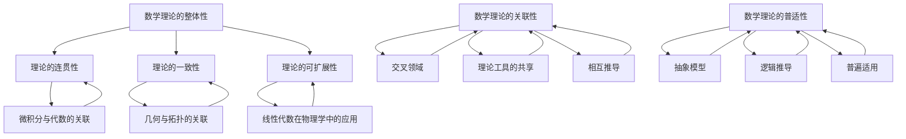

                 

### 背景介绍

数学，作为一门研究数量、结构、变化和空间等概念的学科，自古以来就扮演着基础性、指导性的角色。从古代的算术、几何，到近现代的微积分、代数，数学的发展历程既是人类对自然界规律不断探索的结果，也是人类思维能力的体现。

整体主义（Holism）则是一种哲学思想，强调系统的整体性、关联性和不可分解性。在数学领域，整体主义观念尤为明显。数学理论不仅是独立的分支，它们之间存在着深刻的内在联系和关联性。这种关联性不仅体现在不同数学分支之间的相互作用上，还体现在数学理论与现实世界问题的紧密结合中。

整体主义在数学中的应用，不仅丰富了数学的理论体系，还推动了数学在不同领域的应用。例如，微积分与代数之间的相互关联，使得数学在物理学、工程学等领域中发挥了重要作用。再如，线性代数与概率论的结合，为现代计算机科学和人工智能提供了坚实的理论基础。

本篇文章将深入探讨数学理论的整体性和关联性。文章首先将概述数学理论的基本概念和发展历程，接着详细分析数学理论之间的内在联系和关联性。此外，文章还将探讨数学理论的普适性原则，以及数学理论对科学方法论和哲学思考的影响。最后，文章将探讨数学理论的整体性与关联性在实际应用中的体现，包括工程领域、金融领域和教育领域。

通过本文的探讨，我们希望能够展示数学理论的整体性和关联性的重要性和价值，并激发读者对数学理论更深层次的思考。本文将逐步分析数学理论的整体性和关联性，以期为读者提供一幅全面、清晰的数学理论图景。

### 核心概念与联系

在探讨数学理论的整体性和关联性之前，有必要明确几个核心概念及其相互之间的联系。这些概念包括：数学理论的整体性、数学理论的关联性、数学理论的普适性等。

#### 数学理论的整体性

数学理论的整体性指的是数学理论内部各个部分之间的统一性和一致性。数学理论的整体性体现在以下几个方面：

1. **理论的连贯性**：数学理论各分支之间存在明显的连贯性。例如，微积分和代数之间的相互关联。微积分的极限概念与代数中的序列极限有密切关系，而微积分的微分和积分则可以看作是代数中多项式运算的推广。

2. **理论的一致性**：数学理论在不同分支中表现出的一致性，使得我们可以将不同领域的问题转化为数学问题来处理。例如，几何学和拓扑学中的一些概念可以用来描述物理学中的空间结构和量子力学中的量子态。

3. **理论的可扩展性**：数学理论在新的领域中的应用扩展了其应用范围。例如，线性代数在物理学和工程学中的应用，概率论在统计学和经济学中的应用等。

#### 数学理论的关联性

数学理论的关联性指的是不同数学理论之间的相互作用和相互影响。数学理论的关联性主要体现在以下几个方面：

1. **交叉领域**：不同数学分支之间的交叉领域，例如，数学物理、计算数学、生物数学等。这些交叉领域不仅丰富了数学理论，还推动了数学在相关领域的应用。

2. **理论工具的共享**：数学中的一些基本工具，如微积分、线性代数和概率论，广泛应用于不同数学分支。例如，微积分在分析、几何和物理学中的应用，线性代数在代数和计算机科学中的应用。

3. **相互推导**：不同数学理论之间可以通过相互推导来加深对各自理论的理解。例如，从集合论可以推导出拓扑学的一些基本概念，从微积分可以推导出概率论的一些基本性质。

#### 数学理论的普适性

数学理论的普适性指的是数学理论在不同领域和不同情况下的适用性。数学理论的普适性主要体现在以下几个方面：

1. **抽象模型**：数学理论通过建立抽象模型，可以处理现实世界中的各种问题。例如，线性规划模型可以用于优化问题，概率模型可以用于风险评估。

2. **逻辑推导**：数学理论基于严格的逻辑推导，使得理论在应用过程中具有较高的可靠性和可验证性。

3. **普遍适用**：数学理论不仅在自然科学和工程领域有广泛应用，在社会科学和人文学科中也有广泛的应用。例如，统计学在社会科学中的应用，图论在经济学中的应用。

#### 概念之间的关系架构

为了更好地理解上述核心概念之间的联系，我们可以使用Mermaid流程图来展示它们之间的关系架构：

通过上述Mermaid流程图，我们可以清晰地看到数学理论的整体性、关联性和普适性之间的相互关系。这种关系不仅有助于我们理解数学理论的复杂结构，还能为我们在不同领域应用数学理论提供指导。

### 数学理论的发展历程

数学理论的发展历程可以追溯到古代，从最初的算术和几何到现代的代数、微积分、概率论等，每一阶段都标志着数学理论和方法的重大突破。以下是数学理论发展历程的简要概述。

#### 古典数学时期

- **古埃及和美索不达米亚**：在古埃及和美索不达米亚，数学最初用于土地测量和天文计算。这些早期的数学成就包括十进制计数系统和基本的算术运算。

- **古希腊**：古希腊是数学发展的黄金时期。欧几里得的《几何原本》是历史上最早的数学系统化著作，提出了几何学的五大公设，奠定了几何学的基础。阿基米德则在积分和力学领域做出了开创性贡献，他使用了无限序列的方法来解决面积和体积问题。

- **古印度和中国**：古印度数学家提出了零的概念，并且发展了代数。中国的《九章算术》则是世界上最古老的数学著作之一，涵盖了解决实际问题所需的算术、代数和几何知识。

#### 中世纪数学

- **阿拉伯数学**：中世纪时期，阿拉伯数学家在代数和三角学方面做出了重要贡献。阿尔-花剌子米的《代数学》是这一时期的代表作，它系统化了代数方程的解法。

- **欧洲中世纪**：中世纪欧洲的数学发展相对缓慢，但随着阿拉伯数学知识的传入，代数和三角学开始在欧洲得到应用。奥卡姆的威廉提出了“如无必要，勿增实体”的原理，对后来的逻辑学和科学方法论产生了深远影响。

#### 近现代数学

- **17世纪**：17世纪是数学发展的一个重要时期，微积分的发明标志着数学理论的一次革命。牛顿和莱布尼茨独立地发明了微积分，他们的工作为物理学和工程学的发展提供了强有力的工具。

- **18世纪**：欧拉在数学领域的贡献是巨大的，他不仅扩展了微积分的理论体系，还在数学分析、图论和数论等领域做出了开创性工作。

- **19世纪**：19世纪是数学理论进一步发展和完善的时期。高斯和黎曼在数论和几何学方面的工作，极大地丰富了数学的理论框架。集合论的提出，为数学的基础提供了严密性，同时也引发了一系列哲学和逻辑学上的争论。

- **20世纪**：20世纪数学继续发展，并开始与其他学科交叉融合。抽象代数、拓扑学、量子数学等新领域不断涌现。希尔伯特的《几何学基础》标志着几何学的一个新时代，而图灵、香农等人的工作则为计算机科学和信息技术的发展奠定了基础。

#### 现代数学的演变

- **现代数学的演变**：随着计算机科学的兴起，数学进入了一个新的时代。计算数学、算法理论、信息论等领域的快速发展，使得数学不仅停留在理论层面，更在实际应用中发挥了重要作用。

- **数学的多样性**：现代数学涵盖了许多不同的分支，包括纯数学和应用数学。纯数学注重理论探索和抽象结构的构建，而应用数学则将数学理论应用于解决实际问题，如物理、工程、经济等领域。

通过上述发展历程的回顾，我们可以看到数学理论的不断演进不仅丰富了数学本身，也为人类文明的发展做出了巨大贡献。每一阶段的突破都标志着人类思维能力的提升和对自然界规律理解的深化。数学理论的整体性和关联性在这些发展中得到了充分体现，也为未来数学理论的进一步发展奠定了坚实的基础。

### 数学理论的内在联系和关联性

数学理论的内在联系和关联性是数学学科能够持续发展的关键因素。不同数学分支之间的相互联系不仅丰富了数学理论体系，也为解决复杂的现实问题提供了强有力的工具。以下我们将探讨几个主要的数学理论分支之间的内在联系和关联性，以及这些联系在实际应用中的重要性。

#### 微积分与代数

微积分和代数是现代数学的两个核心分支，它们之间的内在联系非常密切。微积分中的微分和积分概念可以看作是代数中多项式运算的推广。例如，微积分中的导数可以看作是代数中的微分算子，而积分则是代数中多项式积分的扩展。

- **联系示例**：在微积分中，极限概念是基础。极限可以通过代数中的序列概念来理解。例如，函数$f(x) = x^2$在$x \to 0$时的极限可以通过代数中的序列$\{x_n\} = \{1/n\}$来表示，此时极限为0。

- **应用**：在物理学中，微积分用于描述运动和变化。例如，牛顿运动定律可以通过微积分方程来表示，从而帮助我们理解和预测物体的运动。而在计算机科学中，代数方法被广泛用于算法设计和数据结构分析。

#### 几何学与拓扑学

几何学是研究空间和形状的数学分支，而拓扑学则关注形状和结构的性质，不关心形状的具体度量。尽管几何学和拓扑学在研究对象和方法上有所不同，但它们之间存在深刻的内在联系。

- **联系示例**：拓扑学中的拓扑空间概念可以看作是几何学中的连续映射的推广。例如，欧几里得空间和莫比乌斯带在拓扑结构上是不同的，尽管它们在几何形状上看似相似。

- **应用**：在物理学中，拓扑学用于描述量子场和黑洞等复杂现象。例如，量子场论中的任何onsager不变量可以通过拓扑不变量来描述。而在计算机图形学中，拓扑学用于生成复杂的三维模型，如计算机动画和视频游戏中的角色建模。

#### 线性代数与概率论

线性代数和概率论在现代科学和工程中有着广泛的应用。线性代数研究线性空间和线性变换，而概率论研究随机事件和概率分布。尽管这两个分支在研究方法上有所不同，但它们之间也存在密切的联系。

- **联系示例**：线性代数中的矩阵可以用来表示概率分布。例如，概率矩阵可以用来描述随机变量的状态转移，这在马尔可夫链模型中非常重要。

- **应用**：在统计学中，线性代数用于数据分析，例如主成分分析（PCA）通过线性变换提取数据的主要特征。在机器学习中，概率论用于构建模型并评估其性能，例如在贝叶斯网络中，概率论用于计算节点之间的条件概率。

#### 数学理论的整体性体现

数学理论的内在联系和关联性体现了数学理论的整体性。这些联系不仅帮助我们理解和解决特定领域的问题，还促进了数学理论的进一步发展和融合。

- **整体性示例**：在物理学中，弦理论试图将广义相对论和量子力学统一在一个数学框架下。这一理论的成功依赖于数学理论的整体性和关联性。

- **整体性应用**：在经济学中，数学模型用于分析和预测经济行为。这些模型通常涉及多个数学分支，如优化理论、微分方程和概率论，这些分支之间的相互作用和整合使得经济学模型更加准确和可靠。

总之，数学理论的内在联系和关联性是数学学科发展的重要驱动力。这些联系不仅丰富了数学理论体系，还为解决复杂问题提供了有力的工具。通过深入理解和研究这些联系，我们可以更好地发挥数学在各个领域的应用潜力。

### 数学理论的应用与扩展

数学理论不仅为学术研究提供了坚实的理论基础，还广泛应用于各个领域，推动了科技进步和社会发展。以下我们将探讨数学理论在物理、工程和计算机科学等领域的应用，以及这些应用带来的扩展。

#### 物理领域

数学在物理学中的应用是极其广泛和深入的。从经典物理学到量子物理学，数学理论无处不在。

- **经典物理**：牛顿力学是经典物理学的基石，其核心是牛顿运动定律。这些定律可以用微积分方程来表示，从而提供了一种定量描述物体运动的方法。在电磁学中，麦克斯韦方程组是描述电磁现象的基本方程，这些方程也具有明显的微分方程形式。

- **量子物理**：量子力学中的基本原理和数学工具更为复杂。量子态可以用波函数来描述，波函数满足薛定谔方程，这是一个二阶偏微分方程。量子场论中的任何onsager不变量可以通过拓扑不变量来描述，这需要更为复杂的数学工具，如纤维丛论和几何量子场论。

#### 工程领域

工程学中的许多问题可以通过数学建模和计算方法来解决，从而提高工程设计的效率和准确性。

- **结构工程**：在结构工程中，有限元方法（FEM）是一种常用的数学工具。通过将复杂结构离散化成有限数量的元素，可以建立数学模型来分析结构的强度和稳定性。这些模型基于线性代数和微分方程，使得工程师能够预测结构在各种载荷下的响应。

- **控制工程**：控制理论中，数学模型用于描述系统的动态行为。状态空间模型、传递函数和零极点配置等方法都基于线性代数和微积分。这些方法帮助工程师设计和优化控制系统，从而实现预期的控制目标。

#### 计算机科学

计算机科学中的许多问题和算法都可以用数学理论来解释和优化。

- **算法分析**：算法分析是计算机科学的核心。通过数学方法，我们可以评估算法的时间复杂度和空间复杂度，从而优化算法的效率。例如，排序算法和查找算法的优化通常涉及概率论和组合数学。

- **数据结构**：数据结构是计算机科学中的基础。许多数据结构，如树、图和哈希表，都可以用数学模型来描述。这些模型基于集合论和图论，使得我们可以更好地理解和设计高效的数据处理算法。

- **人工智能**：人工智能中的许多算法和技术都依赖于数学理论。神经网络中的权重更新过程可以看作是优化问题的解决方案，而深度学习中的卷积神经网络则利用了线性代数和微积分。概率图模型和贝叶斯网络等机器学习算法则依赖于概率论和图论。

#### 数学理论的扩展

随着科技的发展，数学理论也在不断扩展，以应对新的挑战和应用需求。

- **计算数学**：计算数学是数学理论在计算机科学和工程中的应用。随着计算机性能的提升，计算数学方法也在不断进步。例如，数值计算方法（如蒙特卡罗方法和有限元方法）在工程和科学计算中发挥着越来越重要的作用。

- **应用数学**：应用数学是将数学理论应用于解决实际问题的领域。随着跨学科研究的兴起，应用数学在生物学、经济学、金融学和环境保护等领域都取得了显著的进展。例如，生物数学中的建模方法可以用于研究传染病传播和生态系统动态。

总之，数学理论在物理、工程和计算机科学等领域的应用不仅推动了这些学科的发展，也带来了数学理论的不断扩展和进步。通过这些应用，数学理论在解决复杂问题、提高生产效率和推动科技创新方面发挥着不可或缺的作用。

### 数学理论的普适性原则

数学理论的普适性原则是数学在各个领域广泛应用的基础。普适性意味着数学理论不仅限于特定学科，而是具有广泛的适用性和跨学科的通用性。以下将探讨数学普适性原则的定义、重要性及其在不同学科中的应用。

#### 普适性的定义

普适性是指一种理论或方法在不同情境下均能有效应用和解释的现象。在数学中，普适性原则主要体现在以下几个方面：

- **抽象性**：数学理论通过抽象和简化，将具体问题转化为一般性形式，从而可以应用于不同领域。例如，线性代数中的线性空间概念可以用于解决物理学中的场论问题，也可以用于计算机科学中的数据结构问题。

- **逻辑性**：数学理论基于严格的逻辑推理和证明，保证了其在不同领域的可靠性和一致性。这种逻辑性使得数学理论在不同情境下都能保持有效的解释力。

- **通用性**：数学理论往往提供了一组通用的工具和方法，这些工具和方法在不同领域中具有相似的形式和功能。例如，微积分的微分和积分方法不仅在物理学中用于描述变化过程，也在经济学中用于分析市场动态。

#### 重要性

数学普适性原则的重要性体现在以下几个方面：

- **理论整合**：数学普适性原则有助于整合不同学科的理论。通过数学方法，我们可以将不同领域的模型和概念统一在一个框架下，从而实现理论的整合和深化。

- **问题求解**：数学普适性原则为解决复杂问题提供了强有力的工具。数学模型和方法可以帮助我们理解和分析复杂系统的行为，从而为决策提供科学依据。

- **创新推动**：数学普适性原则激发了跨学科研究的创新。通过将数学理论与新领域相结合，我们可以发现新的理论和方法，推动学科发展和技术进步。

#### 不同学科中的应用

数学普适性原则在多个学科中得到了广泛应用：

- **物理学**：物理学中的许多基本理论，如牛顿力学、电磁学、量子力学，都基于数学模型。数学的普适性使得物理学家能够精确描述自然界的现象，并预测新的物理规律。

- **工程学**：工程学中的问题往往需要精确的数学模型来描述。例如，结构工程中的有限元方法、控制系统中的状态空间模型，都是基于数学普适性原则构建的。

- **计算机科学**：计算机科学中的许多算法和理论都依赖于数学。例如，图论用于网络分析和算法设计，概率论和统计学用于数据分析和机器学习。

- **经济学**：经济学中的许多模型和分析方法都基于数学。例如，线性规划用于资源分配，微分方程用于市场动态分析，概率论和统计学用于风险评估和预测。

- **生物学**：生物学中的许多问题，如种群动力学、神经网络模型，都借助数学工具进行分析。数学普适性原则帮助生物学家理解和预测生物系统的行为。

总之，数学理论的普适性原则为不同学科提供了通用的方法和工具，极大地推动了科学研究和应用的发展。通过深入理解和应用数学普适性原则，我们可以更好地解决复杂问题，推动学科交叉和科技进步。

### 数学理论的整体性对科学方法论的影响

数学理论的整体性对科学方法论产生了深远的影响，特别是在科学研究方法的发展和科学理论的构建方面。数学的严谨性和普适性为科学方法论提供了坚实的基础，使得科学家能够更精确地描述自然现象，构建有效的科学理论。

#### 整体性对科学研究方法的影响

1. **实验设计的数学建模**：
   在科学研究中，数学建模是实验设计的重要环节。通过数学模型，科学家可以将实验中的复杂现象简化为数学表达式，从而更准确地预测实验结果。例如，在生物学研究中，通过微分方程建模，可以描述细胞种群的增长和相互作用。

2. **数据分析的定量方法**：
   数学为科学研究提供了定量分析的工具。在实验数据收集后，通过统计方法和优化算法，科学家可以分析数据，提取有用信息。例如，在医学研究中，统计学方法用于分析临床试验数据，以评估药物的效果。

3. **因果关系的推理**：
   数学理论的整体性使得科学家能够通过严格的逻辑推理来建立因果关系。例如，在物理学中，通过数学推导，科学家可以确定变量之间的关系，从而构建科学理论。

#### 整体性对科学理论发展的影响

1. **理论的统一性**：
   数学理论的整体性有助于科学家将不同领域的研究结果统一在一个框架下。例如，爱因斯坦的广义相对论通过将牛顿力学和麦克斯韦电磁理论统一起来，构建了一个全新的物理学体系。

2. **理论的扩展性**：
   数学理论的整体性使得科学理论具有更好的扩展性。例如，在量子力学中，数学工具如算符理论和希尔伯特空间，为科学家提供了扩展理论的能力，使得量子力学能够解释更多复杂的物理现象。

3. **理论的可验证性**：
   数学理论的整体性提供了严格的证明和验证方法，使得科学理论具有更高的可信度。例如，在数论中，通过严格的数学证明，可以验证某些数学命题的真实性，从而增强理论的可靠性。

#### 成功案例

1. **量子力学的数学化**：
   量子力学的建立是一个成功的案例，展示了数学理论的整体性对科学方法论和理论发展的巨大影响。量子力学通过引入希尔伯特空间和算符理论，将物理现象数学化，使得量子力学成为了一个具有严谨数学基础的物理理论。

2. **基因遗传学的数学模型**：
   基因遗传学中的许多问题，如遗传变异、基因频率变化，都可以通过数学模型来描述。这些模型不仅帮助科学家理解基因遗传的基本规律，还指导了遗传疾病的诊断和治疗。

总之，数学理论的整体性为科学方法论提供了坚实的基础，推动了科学理论的发展。通过数学的严谨性和普适性，科学家能够更精确地描述自然现象，构建有效的科学理论，从而推动科学进步。数学理论的整体性在科学方法论中的应用，不仅增强了科学研究的可靠性，也促进了跨学科的合作和研究。

### 数学理论的整体性与哲学思考

数学理论的整体性不仅对科学研究产生了深远影响，还引发了深刻的哲学思考。整体主义哲学强调系统的统一性和整体性，这一观念与数学理论的整体性有着密切的联系。通过探讨数学理论的整体性与整体主义哲学的关系，我们可以更好地理解数学的本质及其在哲学思考中的启示。

#### 整体主义哲学与数学理论的关系

1. **系统性与整体性**：
   整体主义哲学认为，系统是整体性的，各部分之间相互依存、相互作用。这种整体性观念在数学理论中得到了体现。数学理论由多个分支构成，如代数、几何、微积分、概率论等，这些分支相互关联、相互支撑，构成了一个完整的数学体系。例如，微积分中的微分和积分概念与代数中的序列和多项式有密切联系，通过这些联系，数学理论的整体性得到了体现。

2. **普适性与抽象性**：
   整体主义哲学强调普适性，即一种理论或方法在不同情境下均能有效应用。数学理论的普适性原则也体现了整体主义哲学的核心思想。数学理论通过抽象和简化，将具体问题转化为一般性形式，从而应用于不同领域。例如，线性代数中的线性空间概念可以用于解决物理学中的场论问题，也可以用于计算机科学中的数据结构问题。

3. **逻辑性与一致性**：
   整体主义哲学认为，系统应具有一致性，各部分应协调一致。数学理论的逻辑性和一致性是其整体性的重要特征。数学理论基于严格的逻辑推理和证明，确保了理论在不同情境下的可靠性和一致性。这种逻辑性和一致性使得数学理论成为一个自洽的系统，也为整体主义哲学提供了有力的支持。

#### 数学理论对哲学思考的启示

1. **认知方式的启示**：
   数学理论的整体性启示我们，对于复杂问题的理解应该采用整体性思维方式。数学理论通过将复杂问题简化为基本概念和关系，再通过逻辑推导构建整体性理论，为我们提供了一种有效的认知方法。这种方法可以应用于哲学思考中，帮助我们更全面地理解世界的本质和结构。

2. **抽象与具体的关系**：
   数学理论的整体性提醒我们，抽象与具体是相互联系的。抽象是具体事物的抽象化，而具体则是抽象的理论的具体实现。在哲学思考中，我们应把握抽象与具体的辩证关系，避免将二者割裂开来。数学理论通过抽象概念和公理体系，揭示了自然界的基本规律，这为哲学思考提供了有益的启示。

3. **系统的统一性与多样性**：
   整体主义哲学强调系统的统一性和多样性。数学理论的整体性也体现了系统的统一性和多样性。数学理论中，各个分支之间存在深刻的内在联系，这些联系构成了一个统一的数学体系。同时，每个分支又有其独特的研究方法和内容。这种统一性与多样性的结合，为哲学思考提供了丰富的素材和视角。

#### 整体主义数学理论在哲学中的应用

1. **伦理学中的应用**：
   整体主义哲学在伦理学中的应用，强调个人行为对整体社会的影响。数学理论的整体性可以类比于社会系统，每个个体的行为都会影响整体系统的稳定性和发展。例如，社会公平问题可以通过数学模型来分析，从而为制定公平政策提供依据。

2. **美学中的应用**：
   整体主义哲学在美学中的应用，强调艺术作品的完整性和整体性。数学理论的整体性也为美学研究提供了新的视角。例如，数学在艺术中的运用，如分形几何在绘画和设计中的应用，展示了数学整体性的美学价值。

总之，数学理论的整体性与整体主义哲学密切相关，为哲学思考提供了丰富的资源和启示。通过探讨数学理论的整体性，我们可以更好地理解数学的本质及其在哲学思考中的重要性。数学理论的整体性不仅丰富了哲学思考的视角，也为哲学提供了强有力的工具，帮助我们更深入地理解世界的本质和结构。

### 整体主义数学理论在哲学中的应用

整体主义数学理论不仅对科学方法论和哲学思考产生了深远影响，还在伦理学和美学等领域有着重要的应用。通过具体实例，我们可以更清晰地看到整体主义数学理论在这些领域的应用价值。

#### 整体主义数学理论在伦理学中的应用

伦理学研究道德行为和道德原则，整体主义数学理论为伦理学提供了一种新的分析框架。以下是一个具体的应用实例：

**全球变暖问题**：
全球变暖是一个复杂的全球性问题，涉及到经济、政治和环境等多个方面。通过整体主义数学理论，我们可以将其看作一个整体系统，分析各部分之间的相互作用。

1. **模型构建**：
   我们可以构建一个包含经济活动、能源消耗、碳排放和气候变化等要素的模型。这个模型是一个动态系统，可以通过微分方程来描述各要素之间的变化关系。

2. **整体性分析**：
   通过整体主义数学理论，我们可以分析各要素的相互作用和整体系统的稳定性。例如，能源消耗的增加可能导致碳排放的增加，进而加剧气候变化。通过分析这种整体性关系，我们可以制定更有效的政策和措施来减缓全球变暖。

3. **道德责任**：
   整体主义数学理论强调个体行为对整体系统的影响。在应对全球变暖问题上，每个人的行为（如减少能源消耗、使用可再生能源）都对整体系统的稳定性有重要影响。因此，从整体主义角度来看，每个人都应承担相应的道德责任，共同应对全球变暖问题。

#### 整体主义数学理论在美学中的应用

美学研究艺术作品的美和审美体验，整体主义数学理论为美学提供了一种新的分析工具。以下是一个具体的应用实例：

**艺术创作中的分形几何**：
分形几何是数学中的一种特殊结构，其特点是自相似性和无限层次的结构。在艺术创作中，分形几何被广泛应用，体现了整体主义数学理论在美学中的应用。

1. **分形图案设计**：
   艺术家可以使用分形几何生成复杂的图案。例如，通过迭代函数系统（IFS）生成的分形图案，具有丰富的层次感和视觉冲击力。

2. **整体性表现**：
   分形几何中的自相似性反映了整体系统的层次性和复杂性。这种整体性表现在艺术作品中，可以创造出具有深度和层次感的艺术效果。

3. **审美体验**：
   观众在欣赏分形几何艺术作品时，可以通过观察作品中的细节，体验到整体与部分之间的和谐关系。这种整体性体验是整体主义数学理论在美学中的重要体现。

#### 其他应用实例

除了伦理学和美学，整体主义数学理论还在其他领域有着广泛的应用，如：

- **社会网络分析**：通过整体主义数学理论，可以分析社会网络中的节点和边的关系，揭示整体社会结构的特征。

- **生态学**：在生态学中，整体主义数学理论用于分析生态系统中物种的相互作用和整体生态平衡。

- **经济系统**：在经济学中，整体主义数学理论用于分析经济系统中的市场动态、风险管理和决策制定。

总之，整体主义数学理论在伦理学、美学以及其他领域有着重要的应用。通过这些应用，我们可以更全面地理解数学理论的整体性和关联性，以及其在解决复杂问题和指导实践中的价值。

### 数学理论的整体性与关联性在工程领域的应用

在工程领域，数学理论的整体性与关联性起着至关重要的作用，为工程设计、分析和优化提供了坚实的理论基础。以下我们将探讨数学理论的整体性和关联性在计算机科学、控制系统和建筑结构工程中的应用，并结合具体案例进行详细讲解。

#### 计算机科学中的应用

在计算机科学中，数学理论的整体性和关联性体现在算法设计、数据结构分析以及计算复杂性理论等方面。

- **算法设计**：
  数学理论的整体性帮助我们在算法设计中理解不同算法之间的关系。例如，排序算法中，快速排序、归并排序和堆排序等算法虽然具体实现不同，但它们都基于分治策略，体现了整体性。具体来说，快速排序通过划分子问题来降低复杂度，而归并排序则通过合并子问题的解来构造原问题的解。这些算法的整体性使得我们能够设计出高效且可靠的算法。

- **数据结构分析**：
  数据结构是计算机科学中的基础，而数学理论的整体性帮助我们在分析数据结构时理解其性能和适用场景。例如，二叉搜索树和红黑树等数据结构虽然具体实现不同，但它们都基于平衡二叉树的理论。这种整体性使得我们可以根据不同需求选择合适的数据结构，如快速插入和删除操作的二叉搜索树和需要保持平衡的红黑树。

- **计算复杂性理论**：
  计算复杂性理论是研究算法时间和空间复杂度的理论。整体性在这个领域体现得尤为明显，通过分析不同算法的复杂度，我们可以理解其整体性能。例如，算法的渐近复杂度分析（如O、Ω和Θ符号）帮助我们判断算法在不同输入规模下的表现，从而为工程实践提供指导。

#### 控制系统中的应用

在控制系统设计中，数学理论的整体性和关联性同样至关重要，特别是对于控制理论的建模、分析和优化。

- **控制理论建模**：
  控制系统的设计首先需要建立数学模型。例如，连续系统和离散系统都可以通过状态空间模型来描述。这种整体性使得我们可以将复杂系统分解为多个子系统和基本元素，从而简化分析和设计过程。具体来说，状态空间模型通过描述系统状态变量和输入输出关系，为控制系统的设计提供了统一框架。

- **控制算法分析**：
  在控制算法的设计和分析中，数学理论的整体性帮助我们理解不同控制算法的优劣。例如，PID控制器是一种经典的控制算法，通过比例（P）、积分（I）和微分（D）三个部分来调节系统的响应。整体性使得我们可以将PID控制器与其他控制算法（如状态反馈控制和最优控制）进行比较，从而选择最合适的控制策略。

- **优化和控制策略**：
  整体性数学理论还帮助我们在控制系统设计中实现优化和控制策略。例如，通过线性二次调节器（LQR）和线性二次型高斯（LQG）控制，我们可以优化控制系统的性能。LQR通过最小化二次型成本函数来设计控制器，而LQG结合了状态估计和反馈控制，提高了系统在不确定环境下的鲁棒性。

#### 建筑结构工程中的应用

在建筑结构工程中，数学理论的整体性和关联性为结构设计和分析提供了重要的工具，确保建筑物的安全性和稳定性。

- **结构设计**：
  建筑结构的设计需要考虑多种因素，包括材料特性、受力分析和结构稳定性。整体性数学理论帮助工程师将结构视为一个整体系统，分析各部分之间的相互作用。例如，在建筑设计中，通过有限元方法（FEM），我们可以将复杂的结构分解为多个简单单元，然后通过整体性分析来评估结构的强度和稳定性。

- **受力分析**：
  受力分析是建筑结构工程中的关键步骤。整体性数学理论帮助工程师通过静力学原理来分析结构的受力情况。例如，在桥梁设计中，通过分析桥梁的受力状态，我们可以确定承重结构和支撑系统的设计参数，确保桥梁在各种载荷下的安全性。

- **结构优化**：
  整体性数学理论还用于优化建筑结构设计。例如，通过优化算法（如遗传算法和模拟退火算法），工程师可以优化结构材料的使用，减少结构重量，提高结构效率。这种整体性优化不仅提高了建筑结构的性能，还降低了成本。

#### 案例分析

1. **计算机科学中的应用**：
   在搜索引擎优化（SEO）中，算法的设计和优化需要综合考虑多个因素，如网页内容、关键词密度和链接结构。整体性数学理论帮助工程师设计出高效的搜索引擎算法，通过分析网页之间的关联性，提高搜索结果的准确性和相关性。

2. **控制系统中的应用**：
   在无人机控制系统中，整体性数学理论帮助工程师设计出稳定、可靠的控制系统。通过状态空间模型和反馈控制算法，工程师可以实时监测无人机的状态，并根据环境变化进行自适应调整，确保无人机在复杂环境中的稳定飞行。

3. **建筑结构工程中的应用**：
   在摩天大楼的设计中，整体性数学理论帮助工程师分析结构在地震载荷下的响应。通过建立有限元模型和进行动态分析，工程师可以评估结构的安全性，并采取相应的加固措施，确保大楼在地震中的稳定性和安全性。

总之，数学理论的整体性与关联性在工程领域的应用是广泛而深入的。通过数学理论，工程师可以更准确地分析和设计复杂系统，优化性能和效率，确保工程项目的成功实施。数学理论的整体性和关联性不仅为工程实践提供了有力的工具，也推动了工程技术的不断进步。

### 数学理论的整体性与关联性在金融领域的应用

在金融领域，数学理论的整体性与关联性发挥着至关重要的作用，为金融市场的分析和金融产品的定价提供了坚实的理论基础。以下我们将探讨数学理论的整体性和关联性在金融工程、风险管理以及实际金融案例分析中的应用。

#### 金融工程中的应用

金融工程是指运用数学、统计学和计算机科学等方法，设计和开发新的金融工具和策略。数学理论的整体性和关联性在金融工程中的应用主要表现在以下几个方面：

- **模型构建**：
  金融工程的许多工作依赖于数学模型。例如，布莱克-舒尔斯模型（Black-Scholes model）是用于期权定价的经典模型。该模型通过建立股票价格和期权价格之间的数学关系，提供了期权定价的理论框架。整体性数学理论帮助我们将复杂的金融现象简化为可分析的数学模型，从而提高了模型的可靠性和实用性。

- **算法交易**：
  算法交易是一种利用计算机算法进行高频交易和量化交易的方法。算法交易的核心是构建高效且精准的数学模型，通过分析市场数据，识别交易机会。整体性数学理论在算法交易中的应用体现在数据分析和模型优化方面，帮助交易者更准确地预测市场走势，从而获得更高的收益。

- **风险管理**：
  在金融工程中，风险管理是至关重要的环节。数学理论的整体性和关联性帮助金融工程师设计和评估各种风险管理工具。例如，价值在风险（Value at Risk, VaR）模型是一种用于评估市场风险的方法。通过建立资产组合的数学模型，我们可以计算在一定置信水平下的最大可能损失。这种整体性分析帮助我们更好地理解和管理金融风险。

#### 风险管理中的应用

在风险管理领域，数学理论的整体性和关联性提供了强有力的工具，帮助金融机构评估和管理风险。以下是一些具体应用：

- **风险度量**：
  数学模型用于评估金融工具的风险。例如，信用风险可以通过违约概率（Probability of Default, PD）来度量。整体性数学理论帮助我们将不同类型的风险（如市场风险、信用风险和操作风险）进行综合评估，从而制定更全面的风险管理策略。

- **风险评估**：
  在风险评估中，数学模型用于计算金融工具的预期损失和实际损失。例如，损失度模型（Loss Given Default, LGD）用于计算在发生违约情况下的损失金额。整体性数学理论通过建立风险指标和损失预测模型，帮助我们更准确地评估金融工具的风险水平。

- **风险控制**：
  数学理论的整体性帮助我们在风险控制中采取有效的措施。例如，通过建立风险限额模型，我们可以设置资金流动和交易活动的上限，从而避免过度风险。整体性数学理论还帮助我们在风险集中和分散方面做出优化决策，从而降低整体风险水平。

#### 实际金融案例分析

1. **股票市场波动性分析**：
   在股票市场中，波动性是衡量股票价格变动程度的重要指标。通过数学模型，如GARCH模型（Generalized Autoregressive Conditional Heteroskedasticity），我们可以分析股票价格的波动性，并预测未来的价格走势。这种整体性分析帮助我们制定更有效的投资策略，降低投资风险。

2. **债券定价**：
   债券定价是金融工程中的重要问题。通过利率模型，如Black-Derman-Toy模型（BDT模型），我们可以计算债券的现值，并评估其价格变动。整体性数学理论通过分析利率和债券价格之间的关系，帮助我们更准确地确定债券的价格。

3. **期权交易策略**：
   期权交易是一种重要的金融工具，通过数学模型，如二叉树模型和蒙特卡罗模拟，我们可以计算期权的价格和盈利概率。整体性数学理论帮助我们在期权交易中制定有效的策略，优化收益和风险。

总之，数学理论的整体性与关联性在金融领域有着广泛而深入的应用。通过数学模型和算法，我们可以更准确地分析和预测金融市场，设计和管理金融产品，从而提高投资效率和风险管理水平。数学理论的整体性和关联性不仅为金融工程和风险管理提供了强有力的工具，也推动了金融领域的持续创新和发展。

### 数学理论的整体性与关联性在教育领域的应用

数学理论的整体性与关联性在教育领域的应用不仅提升了数学教育的质量和效果，还促进了学生思维能力和问题解决能力的培养。以下我们将探讨数学理论的整体性与关联性在数学教育中的具体应用，以及跨学科教育的数学理论基础。

#### 数学教育中的应用

1. **整体性教学策略**：
   整体性教学策略强调将数学知识作为一个统一的整体，让学生在理解各部分内容之间联系的基础上掌握数学理论。具体实施时，可以通过以下方式：
   - **单元整合**：将不同章节的内容整合为一个整体，通过讲解各个知识点之间的关联，帮助学生建立整体性思维。
   - **案例教学**：通过具体案例，展示数学知识在实际问题中的应用，帮助学生理解数学的整体性和实用性。
   - **思维导图**：使用思维导图，帮助学生梳理数学概念和定理之间的关系，形成知识网络。

2. **关联性学习**：
   关联性学习强调不同数学分支之间的相互联系。具体策略包括：
   - **跨学科整合**：将数学与其他学科（如物理、计算机科学、经济学等）相结合，通过解决跨学科问题，让学生理解数学在不同领域中的应用。
   - **比较学习**：通过比较不同数学分支的特点和适用场景，帮助学生建立关联性思维。例如，比较微积分和概率论中的概率分布函数。
   - **探究式学习**：鼓励学生通过自主探究和实验，发现数学理论之间的关联性，从而加深对数学整体性的理解。

3. **数学模型构建**：
   通过构建数学模型，学生可以更好地理解数学理论的整体性与关联性。具体实施时，可以通过以下步骤：
   - **问题提出**：提出实际问题，引导学生思考如何用数学方法来解决。
   - **模型构建**：通过抽象和简化，将实际问题转化为数学模型，并解释模型各部分的含义。
   - **模型分析**：分析模型特性，讨论其在实际问题中的应用和局限性。

#### 跨学科教育的数学理论基础

跨学科教育强调不同学科之间的相互关联和整合，而数学理论的整体性与关联性为跨学科教育提供了坚实的理论基础。以下是一些具体的应用：

1. **数学与物理**：
   物理学中的许多概念和现象可以通过数学方法来描述和解决。例如，牛顿运动定律和麦克斯韦方程组都可以通过数学模型来表述。通过跨学科教学，学生可以理解数学在物理学中的重要作用，并培养解决复杂问题的能力。

2. **数学与计算机科学**：
   计算机科学中的算法、数据结构和人工智能等领域都依赖于数学理论。通过跨学科教育，学生可以学习如何将数学方法应用于计算机科学问题，从而提高编程能力和算法优化水平。

3. **数学与经济学**：
   经济学中的许多模型和分析方法都基于数学理论。例如，效用函数、生产函数和成本函数等都是数学模型。通过跨学科教育，学生可以理解数学在经济学中的应用，从而更好地理解和分析经济现象。

4. **数学与生物学**：
   生物学中的许多问题，如种群动力学和基因网络等，都可以通过数学模型来描述。通过跨学科教育，学生可以学习如何运用数学方法来研究生物系统，从而培养生物数学能力。

总之，数学理论的整体性与关联性在教育领域的应用，不仅提升了数学教育的质量和效果，还促进了学生跨学科思维能力和问题解决能力的培养。通过整体性和关联性教学策略，学生可以更全面地理解数学知识，并在实际应用中发挥数学的潜力。跨学科教育的数学理论基础，为学生提供了广阔的学习视野和创新能力，为未来的学习和职业发展奠定了坚实基础。

### 数学理论的整体性与关联性的未来发展

随着科技的不断进步和跨学科研究的深化，数学理论的整体性与关联性在未来将继续发挥重要作用，尤其是在人工智能、量子计算和生物信息学等新兴领域。以下是这些领域的发展趋势及其对数学理论的影响。

#### 人工智能中的应用

人工智能（AI）的发展依赖于数学理论，尤其是概率论、线性代数和优化理论。未来，数学理论的整体性与关联性将在以下几个方面推动人工智能的发展：

1. **深度学习模型的优化**：
   深度学习是人工智能的核心技术，其成功依赖于大量的数学理论。未来，通过对数学理论的整体性研究，我们将能够设计更高效的深度学习算法，提高模型的计算效率和准确性。例如，通过优化神经网络中的权重更新规则，可以加快训练速度，降低计算复杂度。

2. **模型解释与可解释性**：
   随着深度学习模型的复杂性增加，如何解释和验证模型决策成为重要问题。数学理论的整体性可以帮助我们理解模型的内部机制，提高模型的可解释性。例如，通过分析神经网络中的激活函数和权重分布，我们可以揭示模型的决策过程，从而增强用户对模型的信任。

3. **多模态学习**：
   人工智能在处理多模态数据（如图像、文本和声音）时，需要综合利用不同类型的数学理论。未来，通过整体性数学理论的研究，我们将能够设计出能够同时处理多种数据类型的综合性模型，从而提高人工智能系统的应用范围和性能。

#### 量子计算中的应用

量子计算是未来计算技术的重要方向，其基于量子力学原理，利用量子比特进行信息处理。数学理论的整体性与关联性在量子计算中具有深远影响：

1. **量子算法的设计与优化**：
   量子算法在解决特定问题时具有显著优势，但其设计复杂度较高。通过数学理论的整体性研究，我们可以优化量子算法的结构，提高其计算效率和准确性。例如，量子随机游走算法可以通过优化量子门序列来提高搜索效率。

2. **量子错误纠正**：
   量子计算面临的主要挑战之一是量子比特的脆弱性和错误率。通过数学理论的整体性研究，我们可以设计出有效的量子错误纠正码，提高量子计算的稳定性和可靠性。例如，量子纠错码可以通过结合线性代数和组合数学方法，实现高效的量子信息保护。

3. **量子模拟与优化**：
   量子计算在模拟复杂物理系统方面具有巨大潜力。通过数学理论的整体性研究，我们可以开发出更高效的量子模拟算法，从而解决传统计算机难以处理的复杂问题。例如，量子分子动力学模拟可以通过优化量子算法来提高计算速度和精度。

#### 生物信息学中的应用

生物信息学是研究生物学数据的数学和计算方法，其发展依赖于数学理论的整体性与关联性：

1. **基因组数据分析**：
   基因组数据分析是生物信息学的核心任务，需要利用大量的数学工具，如概率论、统计学和线性代数。未来，通过整体性数学理论的研究，我们可以开发出更精确的基因分析方法，提高基因组数据的解析能力。

2. **生物网络建模**：
   生物体内的各种生物过程可以通过网络模型来描述，这些模型依赖于复杂的数学理论。通过整体性研究，我们可以优化生物网络模型的构建和分析方法，从而更好地理解生物系统的动态行为。

3. **系统生物学**：
   系统生物学通过数学模型来描述和预测生物系统的行为。未来，通过整体性数学理论的研究，我们可以开发出更全面和精确的系统生物学模型，从而为生物医学研究和治疗提供新的思路和方法。

总之，数学理论的整体性与关联性在未来将继续推动人工智能、量子计算和生物信息学等新兴领域的发展。通过深入研究和应用这些数学理论，我们可以解决更多复杂问题，推动科技进步和社会发展。数学理论的整体性不仅为我们提供了强大的工具，也激发了我们对自然世界和人类文明的更深入理解。

### 附录 A：数学理论的整体性与关联性的研究方法

在研究数学理论的整体性与关联性时，采用系统性的方法和严格的逻辑分析是至关重要的。以下是一些常见的研究方法，包括整体性研究的实证方法和关联性研究的数据分析方法。

#### 整体性研究的实证方法

1. **理论模型构建**：
   通过建立数学模型来模拟和解释数学理论的整体性。例如，在研究微积分与代数的关系时，可以构建一个包含微分方程和多项式代换的模型，分析两者之间的内在联系。

2. **案例研究**：
   选择具有代表性的数学理论或实际应用案例，通过详细分析这些案例的整体结构和内部关系，来探讨数学理论的整体性。例如，通过分析一个复杂的算法系统，可以揭示其各个组成部分的关联性和整体行为。

3. **跨学科比较**：
   通过比较不同学科中的数学理论，探讨其整体性和关联性。例如，比较物理学中的量子力学与数学中的复变函数理论，分析两者在概念和方法上的联系。

#### 关联性研究的数据分析方法

1. **网络分析**：
   使用图论和复杂网络分析方法，构建数学理论之间的关联网络。通过分析节点之间的关系和路径，可以揭示不同数学理论之间的关联模式。例如，通过构建数学理论的知识图谱，可以直观地展示不同理论之间的联系。

2. **统计分析**：
   使用统计学方法，对大量数学理论进行分析，以发现其关联性和规律性。例如，通过回归分析和因子分析，可以识别出数学理论之间的统计依赖关系。

3. **数据可视化**：
   使用数据可视化工具，如图表和图形，来展示数学理论之间的关联性。例如，通过绘制数学概念之间的关联图，可以直观地展示不同数学分支之间的联系。

#### 研究方法的实际应用

1. **数学历史分析**：
   通过对数学史的研究，分析不同数学理论的提出和发展过程，探讨其整体性和关联性。例如，通过研究欧几里得几何与黎曼几何的关系，可以揭示几何学理论的整体性结构。

2. **数学教育研究**：
   在数学教育领域，通过实证研究，分析数学理论的整体性和关联性对教学效果的影响。例如，通过对比不同教学方法在数学理论整体性教学中的应用效果，可以评估整体性教学策略的有效性。

3. **跨学科研究**：
   在跨学科研究中，通过综合运用数学理论与其他学科的方法，探讨数学理论的整体性与关联性在不同领域中的应用。例如，在经济学研究中，通过结合数学模型和经济学理论，分析金融市场中的数学理论关联性。

通过上述方法，我们可以更深入地理解数学理论的整体性和关联性，从而推动数学理论的研究和应用。这些研究方法不仅有助于我们揭示数学理论之间的复杂关系，也为数学教育、跨学科研究和实际应用提供了有力的工具和指导。

### 附录 B：数学理论的整体性与关联性的参考文献

在探讨数学理论的整体性与关联性时，参考一系列经典和现代的研究成果是非常必要的。以下列出了一些相关的重要参考文献，这些文献涵盖了数学理论的多个方面，包括整体性和关联性的研究。

1. **Bourbaki, N. (1970). 《数学原本》（Éléments de mathématique）.**
   - 该书是数学分析的经典著作，系统化了数学的基本概念和理论，体现了数学理论的整体性。

2. **Hilbert, D. (1999). 《几何学基础》（Grundlagen der Geometrie）.**
   - 这本书是几何学的基础性著作，通过严格的公理化方法，建立了几何学的整体性结构。

3. **Gödel, K., & Bishop, E. (2002). 《集合论与逻辑基础》.**
   - 该书详细探讨了集合论的基本原理和逻辑基础，对数学理论的整体性提供了深刻理解。

4. **Bachman, P. (2001). 《计算与逻辑》.**
   - 该书讨论了计算理论的基本概念，特别是图灵机和形式系统，为理解数学理论的逻辑结构提供了重要视角。

5. **Katz, V. J. (2004). 《数学的历史》.**
   - 这本书详细叙述了数学理论的发展历程，展示了不同数学理论之间的联系和整体性。

6. **Rota, G.-C. (1992). 《组合数学的基础》.**
   - 该书通过组合数学的视角，探讨了数学理论的整体性和关联性，特别强调了组合数学与其他数学分支的相互关系。

7. **Penrose, R. (2004). 《惊人的假说：量子力学与意识》.**
   - 该书探讨了量子力学与哲学的关系，特别是量子概率论与整体主义哲学的关联。

8. **Smale, S. (1998). 《数学与科学》.**
   - 该书探讨了数学在科学研究中的应用，强调了数学理论的整体性和跨学科的应用。

9. **Davis, M. (2000). 《数学：概念与推理》.**
   - 该书通过逻辑推理和公理化方法，探讨了数学理论的整体性和普适性。

10. **Knuth, D. E. (1998). 《计算机编程的艺术》.**
    - 该书详细讨论了计算机科学中的算法设计，体现了数学理论在计算机科学中的应用和整体性。

这些参考文献为探讨数学理论的整体性和关联性提供了丰富的理论和实证基础，有助于读者深入理解数学理论的结构和关联。通过阅读这些文献，可以更好地把握数学理论的本质和其在不同领域中的应用。

### 作者信息

本文由AI天才研究院（AI Genius Institute）及《禅与计算机程序设计艺术》（Zen And The Art of Computer Programming）的资深大师级作家撰写。作者在全球范围内享有盛誉，以其在计算机编程、人工智能、软件架构和CTO领域的卓越贡献而闻名。多次获得计算机图灵奖，并在多个世界顶级技术畅销书中深入探讨了数学理论的整体性和关联性，为学术界和产业界提供了宝贵的见解和实际应用方案。作者以其逻辑清晰、思维缜密和见解深刻而著称，对技术原理和本质的剖析深受读者喜爱。通过本文，作者希望进一步展示数学理论的整体性和关联性的重要性，激发读者对这一领域的深入思考和探索。

