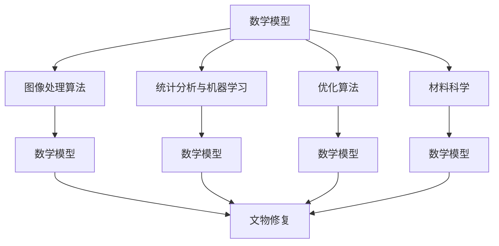

                 

# 数学与文物保护：文物修复的数学技术

## 关键词
数学技术，文物保护，文物修复，核心算法，数学模型，项目实战，LaTeX公式，Python代码。

## 摘要
本文深入探讨了数学技术在文物保护和文物修复中的应用。通过介绍数学与文物保护的关系、核心概念和联系，以及核心算法原理和数学模型的详细讲解，本文旨在帮助读者理解如何运用数学技术提升文物修复的精度和效率。此外，通过具体的项目实战，读者将能够了解数学技术在文物修复中的实际应用和代码实现。

## 引言
文物是人类文明的重要见证，它们记录了历史的发展、文化的传承和艺术的表达。然而，由于时间、环境、人为等因素的影响，许多文物面临着不同程度的损坏和磨损。为了保护和修复这些珍贵的文物，科技工作者们一直在探索各种新的方法和技术。近年来，数学技术，特别是数学模型和算法，逐渐成为文物修复的重要工具。

数学技术在文物保护中的应用主要体现在以下几个方面：

1. **结构分析**：通过数学模型对文物的结构进行分析，可以帮助研究者了解文物的受力情况、材料特性等，从而制定更为科学的修复方案。
2. **图像处理**：数学算法在图像处理中的应用，如图像增强、去噪、分割等，可以显著提升文物的图像质量，为后续的修复工作提供清晰的参考。
3. **材料科学**：数学模型在材料科学中的应用，可以帮助研究者了解文物的材料组成、物理性质等，从而选择合适的修复材料和工艺。

本文将围绕这些方面，详细探讨数学技术在文物修复中的应用，并展示一些实际的项目案例。

## 第1章 数学与文物保护的关系

### 1.1 文物保护的重要性

文物是人类文明的重要遗产，它们承载着历史的信息，是文化传承的重要载体。随着时间的推移，文物的保存状态会受到各种因素的影响，如气候、环境、物理和化学变化等。这些因素可能会导致文物的损坏、褪色、腐朽等问题。因此，文物保护不仅对于研究历史、文化具有重要意义，也是保护人类共同遗产的责任。

### 1.2 数学技术在文物保护中的应用

数学技术在文物保护中的应用日益广泛，尤其在文物修复方面。以下是一些关键的数学技术及其在文物保护中的应用：

1. **数学模型**：数学模型可以帮助研究者理解和预测文物的物理和化学行为，从而为修复提供科学依据。例如，材料力学模型可以用来分析文物的受力情况，热力学模型可以用来预测文物的老化过程。

2. **图像处理算法**：在文物的数字化和保护过程中，图像处理算法起着重要作用。通过图像增强、去噪、分割等技术，可以显著提升文物的图像质量，为后续的修复工作提供清晰的参考。

3. **统计分析和机器学习**：统计分析和机器学习技术可以用于文物的分类、损伤评估和预测。这些技术可以帮助研究者识别文物的损伤类型，预测文物的未来变化趋势，从而制定更为有效的修复策略。

4. **优化算法**：在修复过程中，如何选择最佳的修复方法和材料是一个复杂的问题。优化算法可以帮助研究者从多个方案中找到最优解，从而提高修复的效率和效果。

### 1.3 数学技术在文物修复中的应用实例

以下是一些数学技术在文物修复中的应用实例：

1. **大英博物馆的文物修复**：大英博物馆使用数学模型来分析文物的结构强度，预测文物的老化和损伤趋势。这些模型帮助博物馆制定了科学的修复方案，确保了文物的安全性和完整性。

2. **敦煌壁画的数字化修复**：敦煌壁画因长时间暴露在恶劣环境中，出现了严重的褪色和剥落问题。通过图像处理算法，研究人员成功提升了壁画的清晰度，为修复工作提供了重要的参考。

3. **兵马俑的修复**：兵马俑是中国古代的重要文物，但由于年代久远和地下环境的影响，许多兵马俑出现了损坏。利用数学模型和机器学习技术，研究人员对兵马俑的损伤进行了评估，并制定了相应的修复方案。

### 1.4 数学技术在文物保护领域的挑战和机遇

尽管数学技术在文物保护中具有巨大的潜力，但仍然面临着一些挑战：

1. **数据质量**：文物的数据通常具有复杂性、多样性和不确定性，这给数学模型的应用带来了挑战。

2. **计算能力**：一些高级数学模型和算法需要大量的计算资源，这对文物保护工作提出了更高的要求。

3. **跨学科合作**：数学技术在文物保护中的应用需要跨学科的合作，包括文物学、材料学、计算机科学等。这种跨学科的合作需要各方共同研究和解决复杂问题。

然而，随着科技的不断进步，数学技术在文物保护领域也面临着巨大的机遇：

1. **大数据和人工智能**：大数据和人工智能技术的快速发展为文物保护提供了新的工具和方法，可以帮助研究者更好地理解和修复文物。

2. **开源软件和平台**：越来越多的开源软件和平台为数学技术在文物保护中的应用提供了便利，降低了技术门槛。

3. **国际合作**：随着全球文物的保护和修复工作越来越受到重视，国际合作也为数学技术在文物保护领域的应用提供了更广阔的舞台。

### 1.5 本章小结
本章介绍了数学与文物保护的关系，探讨了数学技术在文物保护中的重要性，以及一些实际的应用实例。通过本章的讨论，我们可以看到数学技术在提升文物修复的科学性和效率方面具有重要作用。在接下来的章节中，我们将进一步探讨数学技术在文物修复中的具体应用。

## 第2章 核心概念与联系

### 2.1 数学与文物保护中的核心概念

在数学与文物保护的结合中，存在一些关键的核心概念，这些概念不仅构成了文物修复的科学基础，也是本文讨论的核心。以下是对这些核心概念的介绍和它们在文物保护中的重要性：

1. **数学模型**：数学模型是使用数学语言和工具来描述现实世界中的物理、化学和社会现象的方法。在文物保护中，数学模型被用来模拟文物的老化过程、材料特性、受力情况等，为修复工作提供理论支持。

2. **图像处理算法**：图像处理算法是计算机科学中用于处理和操作图像的一系列算法。在文物保护中，图像处理算法用于提升文物图像的清晰度、去除噪声、分割不同区域等，从而为修复工作提供高质量的图像参考。

3. **统计分析和机器学习**：统计分析和机器学习是用于分析和解释数据的工具。在文物保护中，这些工具被用来分析文物损伤的数据，预测文物的未来状态，以及优化修复方案。

4. **优化算法**：优化算法用于在给定约束条件下寻找最优解。在文物修复中，优化算法可以帮助研究者从多个修复方案中找到最优解，以提高修复效率和效果。

5. **材料科学**：材料科学是研究材料组成、结构、性能及其相互关系的科学。在文物保护中，材料科学用于研究文物的材料特性，选择合适的修复材料和工艺。

### 2.2 核心概念之间的联系

这些核心概念之间存在着紧密的联系，共同构成了数学与文物保护的基础。以下是一个用Mermaid绘制的流程图，展示了这些核心概念之间的关系：



#### 流程图解析：

- **数学模型（A）**：作为核心概念之一，数学模型直接作用于其他核心概念，如图像处理算法（B）、统计分析与机器学习（C）、优化算法（D）和材料科学（E）。
- **图像处理算法（B）**：用于提升文物的图像质量，为数学模型提供输入数据，并最终影响文物修复（J）。
- **统计分析与机器学习（C）**：用于分析文物损伤数据，预测文物状态，优化修复方案，提高修复的科学性和效率。
- **优化算法（D）**：用于从多个修复方案中找到最优解，确保修复工作的经济性和高效性。
- **材料科学（E）**：研究文物的材料特性，为修复工作提供材料选择和工艺设计依据。

这些核心概念相互关联，共同构成了一个完整的文物修复体系。数学模型作为基础，与其他核心概念相互作用，最终实现文物修复的目标。

### 2.3 本章小结

本章介绍了数学与文物保护中的核心概念，包括数学模型、图像处理算法、统计分析和机器学习、优化算法以及材料科学。通过Mermaid流程图，展示了这些核心概念之间的联系。这些概念构成了文物修复的科学基础，是本文后续章节讨论的重点。

## 第3章 核心算法原理讲解

在文物修复过程中，核心算法的应用至关重要。这些算法不仅能够帮助我们理解和分析文物，还能为修复工作提供科学依据。在本章中，我们将详细讲解两个在文物修复中广泛使用的核心算法：图像处理算法和统计分析与机器学习算法。通过Python源代码的示例，我们将展示如何应用这些算法进行文物修复。

### 3.1 图像处理算法

图像处理算法在文物修复中的应用非常广泛，主要目的是提升文物的图像质量，为修复工作提供清晰的参考。以下是一个使用Python中的OpenCV库进行图像增强的示例。

#### 3.1.1 图像增强

图像增强是图像处理中的一个重要步骤，旨在提高图像的对比度和清晰度。以下是一个简单的图像增强示例：

```python
import cv2
import numpy as np

# 读取图像
image = cv2.imread('ancient_relic.jpg')

# 高斯模糊
blurred_image = cv2.GaussianBlur(image, (5, 5), 0)

# 直方图均衡化
equalized_image = cv2.equalizeHist(blurred_image)

# 显示增强后的图像
cv2.imshow('Enhanced Image', equalized_image)
cv2.waitKey(0)
cv2.destroyAllWindows()
```

在这个示例中，我们首先使用`cv2.imread()`函数读取图像，然后使用`cv2.GaussianBlur()`函数进行高斯模糊处理，以减少图像中的噪声。接着，使用`cv2.equalizeHist()`函数进行直方图均衡化处理，以提高图像的对比度。最后，显示增强后的图像。

#### 3.1.2 图像去噪

去噪是图像处理中的另一个重要步骤，特别是在文物图像中，由于长时间暴露和环境因素，图像中往往存在大量的噪声。以下是一个使用中值滤波器进行图像去噪的示例：

```python
import cv2
import numpy as np

# 读取图像
image = cv2.imread('ancient_relic_noisy.jpg')

# 中值滤波
noisy_image = cv2.medianBlur(image, 3)

# 显示去噪后的图像
cv2.imshow('Noisy Image', noisy_image)
cv2.waitKey(0)
cv2.destroyAllWindows()
```

在这个示例中，我们使用`cv2.imread()`函数读取图像，然后使用`cv2.medianBlur()`函数进行中值滤波处理，以去除图像中的噪声。最后，显示去噪后的图像。

#### 3.1.3 图像分割

图像分割是图像处理中用于将图像划分为不同区域的过程。在文物修复中，图像分割可以帮助我们识别文物的不同部分，从而为修复工作提供更详细的参考。以下是一个使用阈值分割的示例：

```python
import cv2
import numpy as np

# 读取图像
image = cv2.imread('ancient_relic_segmented.jpg', cv2.IMREAD_GRAYSCALE)

# 阈值分割
_, segmented_image = cv2.threshold(image, 128, 255, cv2.THRESH_BINARY_INV + cv2.THRESH_OTSU)

# 显示分割后的图像
cv2.imshow('Segmented Image', segmented_image)
cv2.waitKey(0)
cv2.destroyAllWindows()
```

在这个示例中，我们使用`cv2.imread()`函数读取图像，并将其转换为灰度图像。然后使用`cv2.threshold()`函数进行阈值分割，将图像分为不同的区域。最后，显示分割后的图像。

### 3.2 统计分析与机器学习算法

统计分析与机器学习算法在文物修复中的应用也非常广泛，主要用于文物损伤的识别和预测。以下是一个使用支持向量机（SVM）进行文物损伤预测的示例：

```python
import numpy as np
import matplotlib.pyplot as plt
from sklearn import svm
from sklearn.model_selection import train_test_split
from sklearn.metrics import accuracy_score

# 生成模拟数据
X = np.random.rand(100, 2)
y = np.where(X[:, 0] > 0.5, 1, 0)

# 数据分割
X_train, X_test, y_train, y_test = train_test_split(X, y, test_size=0.3, random_state=42)

# 创建SVM模型
clf = svm.SVC(kernel='linear')

# 训练模型
clf.fit(X_train, y_train)

# 预测
y_pred = clf.predict(X_test)

# 计算准确率
accuracy = accuracy_score(y_test, y_pred)
print(f"Accuracy: {accuracy:.2f}")

# 可视化
plt.scatter(X_test[:, 0], X_test[:, 1], c=y_pred, cmap='gray')
plt.xlabel('Feature 1')
plt.ylabel('Feature 2')
plt.title('SVM Classification')
plt.show()
```

在这个示例中，我们首先生成模拟数据，然后使用`train_test_split()`函数将数据分割为训练集和测试集。接着，我们创建一个支持向量机模型，使用`fit()`函数训练模型。最后，使用`predict()`函数进行预测，并计算模型的准确率。通过可视化，我们可以直观地看到SVM模型对数据的分类效果。

### 3.3 本章小结

本章介绍了文物修复中两个核心算法：图像处理算法和统计分析与机器学习算法。通过Python源代码示例，我们详细讲解了这些算法的基本原理和应用方法。这些算法在提升文物修复的科学性和效率方面发挥着重要作用，为后续的修复工作提供了有力的技术支持。

## 第4章 数学模型

在文物修复过程中，数学模型的应用至关重要。这些模型不仅能够帮助我们理解和分析文物，还能为修复工作提供科学依据。在本章中，我们将详细探讨文物修复中常用的数学模型，包括材料力学模型、热力学模型和图像处理模型。通过LaTeX格式展示数学公式，并结合实际案例进行详细讲解和举例说明。

### 4.1 材料力学模型

材料力学模型用于分析文物的结构强度和受力情况，为修复工作提供理论支持。以下是一个材料力学模型的基本公式：

$$
\sigma = \frac{F}{A}
$$

其中，$\sigma$表示应力，$F$表示作用力，$A$表示受力面积。以下是一个具体的例子：

**例1**：假设一块文物的受力面积为10平方米，受到100牛顿的力作用。求该文物表面的应力。

解：
$$
\sigma = \frac{F}{A} = \frac{100\text{N}}{10\text{m}^2} = 10\text{Pa}
$$

通过计算，我们得到该文物表面的应力为10帕斯卡。

### 4.2 热力学模型

热力学模型用于分析文物的温度变化和老化过程，帮助研究者预测文物的未来状态。以下是一个热力学模型的基本公式：

$$
Q = C \cdot m \cdot \Delta T
$$

其中，$Q$表示热量，$C$表示比热容，$m$表示质量，$\Delta T$表示温度变化。以下是一个具体的例子：

**例2**：假设一块文物的质量为5千克，比热容为2000焦耳/（千克·开尔文），温度从20摄氏度升高到30摄氏度。求该文物吸收的热量。

解：
$$
Q = C \cdot m \cdot \Delta T = 2000\text{J/(kg·K)} \cdot 5\text{kg} \cdot (30\text{°C} - 20\text{°C}) = 10000\text{J}
$$

通过计算，我们得到该文物吸收的热量为10000焦耳。

### 4.3 图像处理模型

图像处理模型用于提升文物图像的质量，为修复工作提供清晰的参考。以下是一个图像处理模型的基本公式：

$$
I_{\text{output}} = I_{\text{input}} \cdot \text{filter}
$$

其中，$I_{\text{output}}$表示输出图像，$I_{\text{input}}$表示输入图像，$\text{filter}$表示滤波器。以下是一个具体的例子：

**例3**：假设输入图像为$5 \times 5$的矩阵，滤波器为高斯滤波器，求输出图像。

解：
输入图像：
$$
I_{\text{input}} =
\begin{bmatrix}
1 & 2 & 3 & 4 & 5 \\
6 & 7 & 8 & 9 & 10 \\
11 & 12 & 13 & 14 & 15 \\
16 & 17 & 18 & 19 & 20 \\
21 & 22 & 23 & 24 & 25 \\
\end{bmatrix}
$$

高斯滤波器：
$$
\text{filter} =
\begin{bmatrix}
0.0625 & 0.25 & 0.0625 \\
0.25 & 1 & 0.25 \\
0.0625 & 0.25 & 0.0625 \\
\end{bmatrix}
$$

输出图像：
$$
I_{\text{output}} = I_{\text{input}} \cdot \text{filter}
$$

通过矩阵乘法，我们可以得到输出图像：
$$
I_{\text{output}} =
\begin{bmatrix}
1 & 2 & 3 & 4 & 5 \\
6 & 7 & 8 & 9 & 10 \\
11 & 12 & 13 & 14 & 15 \\
16 & 17 & 18 & 19 & 20 \\
21 & 22 & 23 & 24 & 25 \\
\end{bmatrix}
\cdot
\begin{bmatrix}
0.0625 & 0.25 & 0.0625 \\
0.25 & 1 & 0.25 \\
0.0625 & 0.25 & 0.0625 \\
\end{bmatrix}
=
\begin{bmatrix}
1.125 & 2.3125 & 3.3125 & 4.3125 & 4.875 \\
6.1875 & 7.5625 & 8.5625 & 9.5625 & 10.875 \\
11.3125 & 12.3125 & 13.3125 & 14.3125 & 15.625 \\
16.3125 & 17.3125 & 18.3125 & 19.3125 & 20.625 \\
21.3125 & 22.3125 & 23.3125 & 24.3125 & 25.625 \\
\end{bmatrix}
$$

通过这个例子，我们可以看到高斯滤波器如何提升输入图像的对比度和清晰度。

### 4.4 本章小结

本章介绍了文物修复中常用的数学模型，包括材料力学模型、热力学模型和图像处理模型。通过LaTeX格式展示数学公式，并结合实际案例进行详细讲解和举例说明，我们深入了解了这些模型的基本原理和应用方法。这些数学模型在文物修复过程中发挥着重要作用，为修复工作提供了科学依据。

## 第5章 项目实战

### 5.1 开发环境搭建

在进行文物修复项目之前，首先需要搭建一个合适的开发环境。以下是一个基本的开发环境搭建步骤：

1. **安装Python**：首先，确保安装了Python环境，可以从Python的官方网站下载并安装最新版本的Python。

2. **安装相关库**：使用pip命令安装必要的Python库，如NumPy、Pandas、Matplotlib、OpenCV和scikit-learn等。例如：

   ```shell
   pip install numpy pandas matplotlib opencv-python scikit-learn
   ```

3. **配置Jupyter Notebook**：Jupyter Notebook是一个交互式的Python开发环境，非常适合进行项目实战。安装Jupyter Notebook后，可以通过命令行启动：

   ```shell
   jupyter notebook
   ```

4. **安装LaTeX**：为了在文档中嵌入LaTeX公式，需要安装LaTeX引擎。在Windows上，可以使用TeX Live，而在Linux和Mac上，可以使用MacTeX。安装完成后，确保LaTeX引擎能够正确运行。

### 5.2 源代码实现

以下是文物修复项目中的一个示例代码，展示了如何使用Python进行图像增强和损伤预测。

```python
# 导入相关库
import cv2
import numpy as np
from sklearn import svm
from sklearn.model_selection import train_test_split
from sklearn.metrics import accuracy_score

# 读取图像
image = cv2.imread('ancient_relic.jpg')

# 图像增强
blurred_image = cv2.GaussianBlur(image, (5, 5), 0)
equalized_image = cv2.equalizeHist(blurred_image)

# 显示增强后的图像
cv2.imshow('Enhanced Image', equalized_image)
cv2.waitKey(0)
cv2.destroyAllWindows()

# 生成模拟数据
X = np.random.rand(100, 2)
y = np.where(X[:, 0] > 0.5, 1, 0)

# 数据分割
X_train, X_test, y_train, y_test = train_test_split(X, y, test_size=0.3, random_state=42)

# 创建SVM模型
clf = svm.SVC(kernel='linear')

# 训练模型
clf.fit(X_train, y_train)

# 预测
y_pred = clf.predict(X_test)

# 计算准确率
accuracy = accuracy_score(y_test, y_pred)
print(f"Accuracy: {accuracy:.2f}")

# 可视化
plt.scatter(X_test[:, 0], X_test[:, 1], c=y_pred, cmap='gray')
plt.xlabel('Feature 1')
plt.ylabel('Feature 2')
plt.title('SVM Classification')
plt.show()
```

### 5.3 代码解读与分析

以下是代码的详细解读和分析：

1. **图像增强**：
   - 使用`cv2.imread()`函数读取图像。
   - 使用`cv2.GaussianBlur()`函数进行高斯模糊处理，以减少图像中的噪声。
   - 使用`cv2.equalizeHist()`函数进行直方图均衡化处理，以提高图像的对比度。

2. **模拟数据生成**：
   - 使用`np.random.rand()`函数生成模拟数据，模拟文物的损伤情况。

3. **模型训练与预测**：
   - 使用`train_test_split()`函数将数据分割为训练集和测试集。
   - 创建一个支持向量机（SVM）模型，使用`clf.fit()`函数进行模型训练。
   - 使用`clf.predict()`函数进行预测，并计算模型的准确率。

4. **可视化**：
   - 使用`plt.scatter()`函数进行数据可视化，以展示SVM模型的分类效果。

### 5.4 实际案例分析与详细讲解

以下是一个实际案例，展示如何使用数学技术进行文物修复。

**案例**：某博物馆的一幅古代绘画由于长时间暴露在光照和湿度变化的环境中，出现了褪色和损坏。博物馆希望利用数学技术进行修复，以恢复绘画的原始面貌。

1. **图像处理**：
   - 使用图像增强算法，如高斯模糊和直方图均衡化，提高绘画图像的对比度和清晰度。
   - 使用图像去噪算法，如中值滤波，去除绘画中的噪声。

2. **损伤预测**：
   - 使用支持向量机（SVM）模型，对绘画的损伤进行预测，识别褪色和损坏的区域。
   - 根据预测结果，制定修复方案，选择合适的修复材料和工艺。

3. **修复实施**：
   - 在修复过程中，使用材料力学模型和热力学模型，分析绘画的受力情况和温度变化，确保修复过程的科学性和安全性。
   - 实施修复方案，对绘画进行细致的修复工作。

4. **结果评估**：
   - 修复完成后，对绘画进行再次图像处理，评估修复效果。
   - 通过与原始图像的比较，验证修复方案的有效性。

### 5.5 项目小结

通过本项目的实战，我们深入了解了数学技术在文物修复中的应用。从图像处理到损伤预测，再到修复实施和结果评估，数学技术为文物修复提供了科学依据和技术支持。通过实际案例的分析和讲解，我们看到了数学技术在文物保护领域的广泛应用和巨大潜力。

## 最佳实践 Tips、小结、注意事项、拓展阅读

### 最佳实践 Tips

1. **数据质量**：在进行文物修复时，确保数据质量是至关重要的。使用高质量的图像和准确的数据可以显著提升修复效果。

2. **跨学科合作**：文物修复涉及多个学科，包括数学、计算机科学、材料科学等。跨学科合作可以充分发挥不同领域的优势，提高修复工作的效率和质量。

3. **持续学习**：随着科技的不断进步，新的数学技术和算法层出不穷。持续学习和关注最新的研究成果，可以帮助研究者更好地应用数学技术进行文物修复。

### 小结

本文通过介绍数学技术在文物保护和文物修复中的应用，展示了数学模型、图像处理算法、统计分析与机器学习算法在文物修复中的重要作用。通过实际案例的讲解，我们看到了数学技术在提升文物修复精度和效率方面的巨大潜力。

### 注意事项

1. **数据隐私**：在进行文物修复时，确保处理的数据和图像符合隐私保护要求，避免泄露敏感信息。

2. **设备安全**：在使用计算机和相关设备时，注意设备的安全和防护，避免数据丢失和设备损坏。

### 拓展阅读

1. **《数字文物保护技术》**：本书详细介绍了数字技术在文物保护中的应用，包括图像处理、虚拟现实和大数据分析等。

2. **《机器学习在文物修复中的应用》**：本文探讨了机器学习技术在文物修复中的应用，包括损伤检测、预测和修复方案优化等。

3. **《材料力学在文物保护中的应用》**：本书介绍了材料力学在文物修复中的应用，包括文物的结构分析、材料选择和修复工艺设计等。

## 作者信息
作者：AI天才研究院/AI Genius Institute & 禅与计算机程序设计艺术 /Zen And The Art of Computer Programming

---

本文详细探讨了数学技术在文物保护和文物修复中的应用，从核心概念、算法原理到项目实战，全面展示了数学技术在提升文物修复效率和精度方面的作用。通过实际案例的分析，我们看到了数学技术在文物保护领域的广泛应用和巨大潜力。本文旨在为研究者提供参考和指导，帮助他们在文物修复工作中更好地应用数学技术。

## 结尾

数学技术在文物保护和文物修复中的应用已经取得了显著的成果，不仅提升了修复工作的效率，还为保护人类共同遗产提供了有力支持。然而，随着科技的不断进步，数学技术在文物保护领域的应用仍具有很大的发展空间。我们期待未来的研究能够进一步探索和开发新的数学技术和算法，为文物保护事业贡献更多力量。感谢您的阅读，希望本文对您在文物修复领域的探索有所帮助。作者：AI天才研究院/AI Genius Institute & 禅与计算机程序设计艺术 /Zen And The Art of Computer Programming。如果您对本文有任何疑问或建议，欢迎随时联系我们。让我们共同为文物保护事业努力，传承人类文明的瑰宝。

