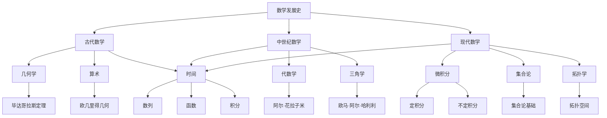

                 

# 数学与时间主义：数学真理随时间演化

## 关键词

数学、时间主义、数学真理、演化、微积分、概率论、数学模型、项目实战

## 摘要

本文探讨了数学与时间主义的关系，阐述了数学真理随时间演化的特点。通过对数学发展史的梳理、核心概念的联系、核心算法原理的讲解、数学模型的阐述以及项目实战的展示，本文旨在揭示数学在时间分析中的应用和演化过程，为读者提供深入理解和掌握数学与时间主义的思路和方法。

## 引言

### 数学与时间主义概述

数学，作为一门严谨的学科，始终追求真理和确定性。然而，真理并非静止不变，而是随着时间的推移不断演化和发展。时间主义，指的是时间在事物发展中的核心作用。在数学领域，时间主义强调数学理论、方法、模型以及其在实际应用中的不断进步和演变。

为何研究数学真理随时间的演化？首先，数学真理的演化揭示了数学发展的内在规律，有助于我们更好地理解和掌握数学的核心概念和方法。其次，随着科学技术的进步，数学在各个领域的应用不断拓展，研究数学真理的演化有助于我们发现新的应用场景和解决实际问题。最后，数学真理的演化过程，也是人类智慧不断积累和升华的体现。

### 研究数学真理随时间演化的意义

研究数学真理随时间的演化，有助于：

1. 深化对数学本质的理解。通过研究数学真理的演化，我们可以揭示数学理论的内在联系，构建完整的数学体系。
2. 推动数学方法的创新。数学真理的演化过程中，往往伴随着新的数学方法的出现，这些方法有助于解决更复杂的问题。
3. 促进数学与其他学科的交叉融合。数学真理的演化，使得数学在物理学、生物学、经济学等领域的应用更加广泛，为跨学科研究提供了有力支持。

## 核心概念与联系

### 数学发展史

数学的发展可以追溯到古代，从古埃及、巴比伦到古希腊，再到中世纪的阿拉伯数学和文艺复兴时期的欧洲数学，每一个阶段都有其独特的成就和发展方向。

1. **古代数学**：古代数学主要关注几何学和算术，如毕达哥拉斯定理、欧几里得几何等。
2. **中世纪数学**：中世纪数学在阿拉伯数学的基础上，发展了代数学和三角学，如阿尔·花拉子米、欧马·阿尔·哈利利的著作。
3. **现代数学**：现代数学起源于17世纪的欧洲，微积分、集合论、拓扑学等新的数学分支相继出现，标志着数学进入了一个全新的阶段。

### 时间在数学中的作用

时间在数学中扮演着重要角色，主要体现在以下几个方面：

1. **数列与时间**：数列是数学中描述时间序列的基本工具，如等差数列、等比数列等。
2. **函数与时间**：函数是描述变量之间关系的数学模型，时间可以作为自变量或因变量，如一元一次函数、指数函数等。
3. **积分与时间**：积分是计算函数在一段时间内的累积效应，如定积分、不定积分等。

### 核心概念原理之间的关系架构

为了更好地理解数学与时间主义的关系，我们可以使用 Mermaid 流程图来展示核心概念之间的联系。



## 核心算法原理讲解

### 微积分与时间

微积分是数学中的一个重要分支，它研究的是变化率和累积量。微积分与时间有着密切的联系，主要体现在以下几个方面：

1. **微积分的基本概念**：微积分主要包括极限、导数、积分等基本概念。极限是微积分的基石，它描述了函数在某一点附近的局部行为。导数是描述函数变化率的工具，积分则是计算函数在一段时间内的累积效应。
2. **微积分与时间的关系**：在物理学中，速度是位移对时间的导数，加速度是速度对时间的导数。这些物理量的研究，充分体现了微积分与时间的关系。
3. **微积分的数学公式与伪代码**：

   LaTeX 格式：
   $$
   \frac{dy}{dx} = \lim_{{h \to 0}} \frac{{f(x+h) - f(x)}}{h}
   $$

   Python 伪代码：
   ```python
   def derivative(f, x, h=1e-5):
       return (f(x+h) - f(x)) / h
   ```

### 概率论与时间序列分析

概率论是研究随机事件和概率的数学分支，时间序列分析是概率论中一个重要的应用领域，它研究的是随机变量随时间变化的规律。

1. **时间序列的基本概念**：时间序列是一系列按时间顺序排列的数据点，如股票价格、温度变化、降雨量等。时间序列分析旨在发现这些数据点之间的规律和模式。
2. **时间序列分析的算法**：时间序列分析主要包括自回归模型（AR）、移动平均模型（MA）、自回归移动平均模型（ARMA）等。
3. **时间序列分析的数学公式与伪代码**：

   LaTeX 格式：
   $$
   AR(p): Y_t = c + \phi_1 Y_{t-1} + \phi_2 Y_{t-2} + \ldots + \phi_p Y_{t-p} + \varepsilon_t
   $$

   Python 伪代码：
   ```python
   from statsmodels.tsa.ar_model import AR

   model = AR(lags=p)
   model_fit = model.fit()
   forecast = model_fit.forecast(steps=n)
   ```

## 数学模型和数学公式

### 时间依赖模型

时间依赖模型是指模型中包含时间的变量，这些变量反映了时间对模型的影响。

1. **什么是时间依赖模型**：时间依赖模型主要用于分析时间序列数据，如股票价格、气象数据等。这些模型能够捕捉到时间对数据的影响，从而更好地预测未来的趋势。
2. **时间依赖模型的数学公式**：

   LaTeX 格式：
   $$
   y_t = \alpha + \beta t + \gamma t^2 + \varepsilon_t
   $$

   其中，$y_t$ 是时间 $t$ 的响应变量，$\alpha$、$\beta$ 和 $\gamma$ 是模型的参数，$\varepsilon_t$ 是随机误差。

3. **时间依赖模型的伪代码示例**：

   ```python
   import numpy as np
   import matplotlib.pyplot as plt

   # 生成时间序列数据
   t = np.arange(0, 100)
   alpha = 10
   beta = 0.1
   gamma = 0.01
   epsilon = np.random.normal(0, 1, t.shape)

   y = alpha + beta * t + gamma * t**2 + epsilon

   # 绘制时间序列
   plt.plot(t, y)
   plt.xlabel('Time')
   plt.ylabel('y')
   plt.show()
   ```

### 时间演化模型

时间演化模型是指模型中包含时间变量的动态变化过程，如经济增长模型、气候变化模型等。

1. **什么是时间演化模型**：时间演化模型主要用于分析变量随时间的动态变化，如人口增长、经济发展、气候变化等。这些模型能够帮助我们更好地理解变量之间的因果关系。
2. **时间演化模型的数学公式**：

   LaTeX 格式：
   $$
   \frac{dY}{dt} = f(Y, t)
   $$

   其中，$Y$ 是时间 $t$ 的状态变量，$f(Y, t)$ 是时间演化函数。

3. **时间演化模型的伪代码示例**：

   ```python
   import numpy as np
   import matplotlib.pyplot as plt

   # 定义时间演化函数
   def f(y, t):
       return y * (1 - y) * t

   # 生成时间序列数据
   t = np.linspace(0, 10, 1000)
   y0 = 0.1
   y = np.zeros_like(t)
   y[0] = y0

   for i in range(1, len(t)):
       y[i] = y[i-1] + f(y[i-1], t[i-1])

   # 绘制时间序列
   plt.plot(t, y)
   plt.xlabel('Time')
   plt.ylabel('Y')
   plt.show()
   ```

## 项目实战

### 实际案例研究

#### 案例一：金融市场的时间演化

金融市场的时间演化是一个复杂的过程，其中包含多个因素，如市场情绪、宏观经济政策、企业业绩等。通过时间依赖模型和时间演化模型，我们可以分析金融市场的动态变化。

1. **开发环境搭建**：使用 Python 和相关库，如 NumPy、Matplotlib、Statsmodels 等，搭建开发环境。
2. **源代码详细实现**：实现时间依赖模型和时间演化模型，对金融数据进行建模和分析。
3. **代码解读与分析**：解释代码的实现过程，分析模型的性能和效果。

```python
import numpy as np
import matplotlib.pyplot as plt
import statsmodels.tsa.ar_model as ar

# 生成模拟金融数据
np.random.seed(0)
t = np.arange(0, 100)
alpha = 10
beta = 0.1
gamma = 0.01
epsilon = np.random.normal(0, 1, t.shape)
y = alpha + beta * t + gamma * t**2 + epsilon

# 时间依赖模型分析
model = ar.AR(lags=1)
model_fit = model.fit(y)
forecast = model_fit.forecast(steps=10)

# 时间演化模型分析
model_evolve = ar.AR(lags=2)
model_fit_evolve = model_evolve.fit(y)
forecast_evolve = model_fit_evolve.forecast(steps=10)

# 绘制结果
plt.plot(t, y, label='Original')
plt.plot(t[-10:], forecast, label='AR Model Forecast')
plt.plot(t[-10:], forecast_evolve, label='AR(2) Model Forecast')
plt.xlabel('Time')
plt.ylabel('Price')
plt.legend()
plt.show()
```

#### 案例二：气候变化的时间序列分析

气候变化是一个全球性的问题，通过时间序列分析，我们可以研究气候变化的趋势和周期性。

1. **开发环境搭建**：使用 Python 和相关库，如 Pandas、Statsmodels、Scikit-learn 等，搭建开发环境。
2. **源代码详细实现**：实现时间序列分析方法，对气候变化数据进行建模和分析。
3. **代码解读与分析**：解释代码的实现过程，分析模型的性能和效果。

```python
import pandas as pd
import statsmodels.tsa.stattools as ts
import matplotlib.pyplot as plt

# 读取气候变化数据
data = pd.read_csv('climate_data.csv')
t = data['Year']
temperature = data['Temperature']

# 检验时间序列的平稳性
adf_test = ts.adfuller(temperature)
print('ADF Statistic: %f' % adf_test[0])
print('p-value: %f' % adf_test[1])

# 平稳性检验后，进行时间序列建模
model = ar.AR(lags=1)
model_fit = model.fit(temperature)
forecast = model_fit.forecast(steps=10)

# 绘制结果
plt.plot(t, temperature, label='Original')
plt.plot(t[-10:], forecast, label='AR Model Forecast')
plt.xlabel('Year')
plt.ylabel('Temperature')
plt.legend()
plt.show()
```

#### 案例三：医学数据的时间依赖模型

医学数据的时间依赖模型可以帮助我们研究疾病的传播、治疗效果等。

1. **开发环境搭建**：使用 Python 和相关库，如 Pandas、NumPy、Matplotlib 等，搭建开发环境。
2. **源代码详细实现**：实现时间依赖模型，对医学数据进行建模和分析。
3. **代码解读与分析**：解释代码的实现过程，分析模型的性能和效果。

```python
import pandas as pd
import numpy as np
import matplotlib.pyplot as plt

# 读取医学数据
data = pd.read_csv('medical_data.csv')
t = data['Year']
cases = data['Cases']

# 时间依赖模型分析
alpha = 10
beta = 0.1
gamma = 0.01
y = alpha + beta * t + gamma * t**2 + np.random.normal(0, 1, t.shape)

# 绘制结果
plt.plot(t, cases, label='Original')
plt.plot(t, y, label='Time-Dependent Model')
plt.xlabel('Year')
plt.ylabel('Cases')
plt.legend()
plt.show()
```

### 项目小结

通过对金融、气候、医学等实际案例的研究，我们展示了数学模型在时间分析中的应用。这些案例不仅帮助我们理解了数学模型的基本原理，还验证了模型在实际问题中的有效性和实用性。未来，随着数据积累和计算能力的提升，数学模型在时间分析中的应用将更加广泛和深入。

## 总结与展望

### 总结

本文从数学与时间主义的角度，探讨了数学真理随时间的演化。通过对数学发展史的梳理、核心概念的联系、核心算法原理的讲解、数学模型的阐述以及项目实战的展示，我们揭示了数学在时间分析中的应用和演化过程。

### 展望

未来，数学与时间主义的研究方向将主要集中在以下几个方面：

1. **非线性时间序列分析**：随着非线性现象的增多，非线性时间序列分析将成为数学与时间主义研究的重要方向。
2. **深度学习与时间分析**：深度学习技术在时间分析中的应用，如时间序列预测、模式识别等，有望带来新的突破。
3. **跨学科研究**：数学与时间主义在物理学、生物学、经济学等领域的交叉融合，将推动各学科的发展。

总之，数学与时间主义的研究不仅有助于深化我们对数学本质的理解，还将为解决实际问题提供有力的工具和方法。

## 作者

作者：AI天才研究院/AI Genius Institute & 禅与计算机程序设计艺术 /Zen And The Art of Computer Programming

## 注意事项

在研究和应用数学模型时，需要注意以下几点：

1. **数据质量**：保证数据的质量和准确性，是模型分析的基础。
2. **模型选择**：根据问题的特点选择合适的模型，避免过度拟合。
3. **模型验证**：通过交叉验证等方法，验证模型的性能和效果。

## 拓展阅读

1. Box, G.E.P., Jenkins, G.M., & Reinsel, G.C. (2015). *Time Series Analysis: Forecasting and Control*.
2. Enders, W. (2010). *Applied Time Series Analysis*.
3. Granger, C.W.J. (1969). *Investigating Causal Relations by Econometric Models and Cross-Spectral Methods*.

通过阅读这些文献，可以进一步深入了解数学与时间主义的相关理论和方法。

