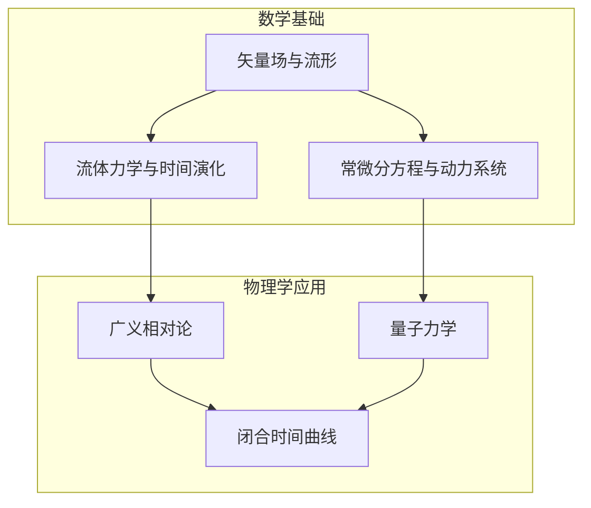
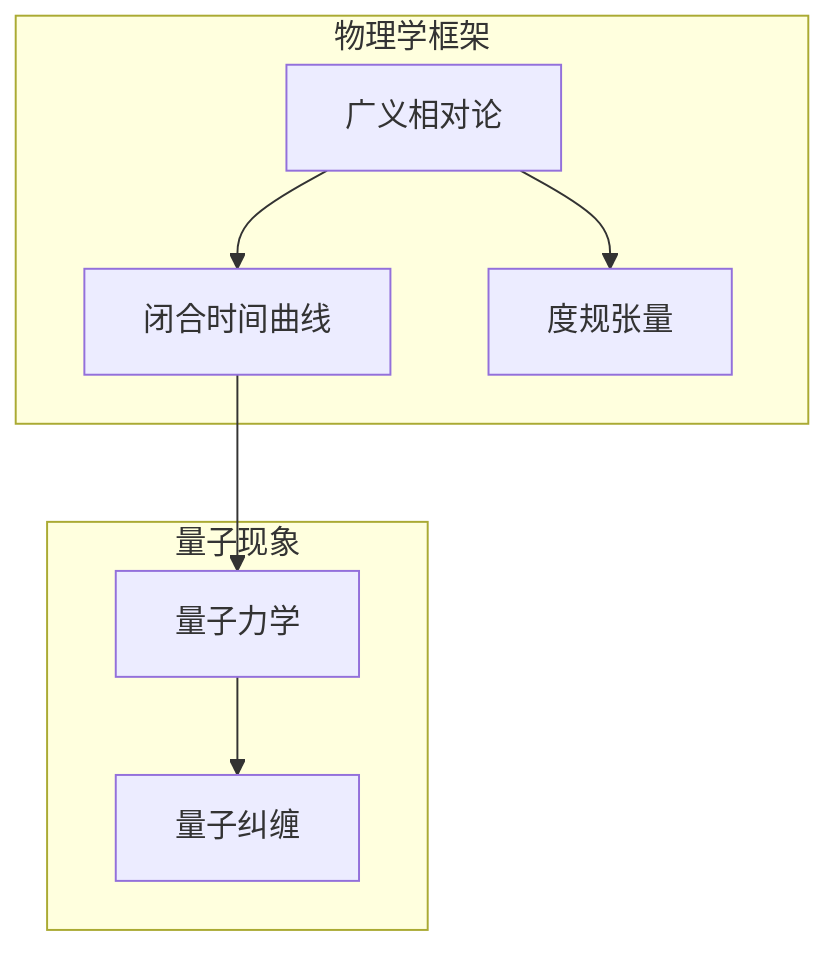

                 

### 引言

《数学与时间旅行：闭合时间曲线的数学探讨》这本书以其独特的视角，将数学与时间旅行的理论巧妙地结合在一起，为我们提供了一个全新的思考维度。时间旅行，一个自人类诞生以来便萦绕于脑海的幻想，一直以来都是科幻作品中的核心主题。而本书则通过数学的视角，探讨了这一幻想的可行性，为读者打开了一扇通往未知世界的大门。

作者在书中首先介绍了数学在物理学中的应用，详细阐述了矢量场与流形、流体力学与时间演化、常微分方程与动力系统等数学概念，为我们理解时间旅行的数学模型奠定了坚实的基础。接着，作者深入探讨了闭合时间曲线的概念，通过对其定义、性质和分类的详细解释，使读者对这一概念有了更为清晰的认识。

更重要的是，书中通过广义相对论与量子力学等物理学理论，探讨了时间旅行的数学模型，展示了数学与物理学的紧密联系。此外，书中还包含了一些实际的项目实战案例，通过这些案例，读者可以更深入地了解闭合时间曲线在实际应用中的运用。

本书不仅适合对数学和物理学感兴趣的读者，也同样适合那些对科幻小说充满好奇的读者。通过本书，读者不仅可以了解到时间旅行的数学原理，更可以激发他们对未知世界的探索欲望。因此，我们期待这本书能够为读者带来一场别开生面的思维之旅。

---

**关键词：**数学、时间旅行、闭合时间曲线、物理学、科幻小说

**摘要：**本书通过数学与时间旅行的结合，探讨了闭合时间曲线的数学原理和应用。作者详细介绍了数学在物理学中的应用，阐述了闭合时间曲线的定义、性质和分类，并通过广义相对论和量子力学等理论，探讨了时间旅行的数学模型。书中还包含了一些实际的项目实战案例，为读者提供了一个全新的思考维度。

---

### 数学理论基础

在探讨时间旅行的数学模型之前，我们首先需要了解一些基础的数学概念，这些概念构成了理解闭合时间曲线和其应用的基础。在本节中，我们将介绍矢量场与流形、流体力学与时间演化、常微分方程与动力系统等数学概念，并解释它们在数学与物理学中的重要性。

#### 矢量场与流形

矢量场是指空间中每一点都对应一个矢量的场。在物理学中，矢量场广泛应用于描述力的分布，如引力场、电场和磁场等。流形是一个抽象的数学概念，它是一个没有边界的连续曲面，可以看作是空间的一种推广。流形上的矢量场可以描述为在流形上每一点都对应一个矢量。例如，在三维空间中，一个矢量场可以描述为每一点都对应一个力的大小和方向。

矢量场与流形的关系可以形象地理解为在空间中画一个曲面，然后在曲面上每个点都画一个矢量，这些矢量共同构成了矢量场。流形为矢量场提供了一个空间框架，使得矢量场可以在其上定义和操作。

**数学概念解释：**

- **矢量场（Vector Field）：** 在流形M上，每个点p都对应一个矢量F(p)，F:M→TM，其中TM是切空间。
- **流形（Manifold）：** 一个流形是一个拓扑空间，可以局部地嵌入到欧几里得空间中，且在局部范围内，流形与欧几里得空间相似。

**应用实例：**

在物理学中，矢量场广泛应用于描述力的分布。例如，地球的引力场可以用一个矢量场来表示，其中每一点都对应一个指向地心的力。

**数学与物理学的关系：**

数学为物理学提供了描述自然界现象的工具。矢量场与流形的概念为描述物理现象中的力和运动提供了一个数学框架。例如，在流体力学中，流体的运动可以用流场来描述，流场是一个矢量场，它描述了流体中每个点的速度和方向。

#### 流体力学与时间演化

流体力学是研究流体运动的物理学分支。流体是物质的一种状态，它具有流动性，能够流动并填充容器。流体力学涉及到流体的运动规律、压力分布、黏性效应等。时间演化是指流体在时间上的变化，它涉及到流体在一段时间内的状态变化。

**数学概念解释：**

- **流体（Fluid）：** 流体是连续介质，它既可以流动也可以被压缩。
- **时间演化（Time Evolution）：** 流体的状态随时间的变化。

**应用实例：**

在气象学中，气象模式通过流体力学原理来模拟大气中的风、气压和温度等参数的变化。同样，在海洋学中，流体力学用于研究海洋流体的运动规律。

**数学与物理学的关系：**

数学为流体力学提供了描述流体运动和状态变化的工具。时间演化方程，如纳维-斯托克斯方程，描述了流体在不同时间点的状态，并通过数学方法来预测未来的变化。这些方程不仅有助于理解流体行为，还可以用于工程应用，如飞机和船舶的设计。

#### 常微分方程与动力系统

常微分方程是一类描述变量变化率的方程，它在物理学和工程学中有着广泛的应用。动力系统则是一类研究系统状态随时间演化的数学模型。动力系统的状态通常由一组变量描述，这些变量可以通过常微分方程来演化。

**数学概念解释：**

- **常微分方程（Ordinary Differential Equation, ODE）：** 方程中未知数的导数是线性或非线性的。
- **动力系统（Dynamical System）：** 一类数学模型，描述系统的状态随时间的变化。

**应用实例：**

在生物学中，常微分方程用于描述种群动态、神经信号传输等。在工程中，如电路分析、机械振动等领域，动力系统理论也有重要应用。

**数学与物理学的关系：**

常微分方程和动力系统理论为物理学提供了描述动态系统行为的方法。例如，纳维-斯托克斯方程描述了流体动力学中的流体运动，而洛伦兹方程描述了电磁场中的电荷和电流的动态。这些方程不仅有助于理解自然现象，还可以用于预测和模拟复杂的物理系统。

通过上述数学概念的解释，我们可以看到数学在描述物理学现象中的核心作用。数学不仅提供了描述和解决问题的工具，还为物理学理论的进一步发展奠定了基础。在接下来的章节中，我们将继续深入探讨闭合时间曲线的概念，并探索其与时间旅行之间的关系。

---

**核心概念与联系：**

下面我们将通过一个Mermaid流程图来展示数学概念与物理学现象之间的联系。



这个流程图展示了从数学基础到物理学应用的完整路径，以及各数学概念如何应用于描述和解释物理学现象，特别是时间旅行的概念。

---

### 闭合时间曲线的概念

闭合时间曲线（CTC）是时间旅行理论中的一个关键概念，它为我们提供了一个可能实现时间旅行的数学框架。闭合时间曲线的定义、性质以及其分类是理解这一概念的基础。在本节中，我们将详细探讨这些方面，并通过数学模型和具体例子来说明其应用。

#### 闭合时间曲线的定义

闭合时间曲线是指一个时间曲线，它从某一时刻出发，经过一段时间后回到原来的时刻。更正式地说，假设我们有一个时间维度上的参数t，闭合时间曲线可以表示为一条闭合路径，它在一个时间流形上闭合，即存在一个闭合的时间回路。

**数学定义：**

设M为一个时间流形，T为M上的一个拓扑空间。一个闭合时间曲线C在M上是一个闭合路径，满足以下条件：

1. C的起点和终点相同，即存在一个t0，使得C(t0) = C(t1)。
2. C在M上的每一段都是光滑的，即C在M上处处可微。
3. C在M上没有重叠的部分，即C是简单的。

**应用实例：**

假设我们在一个平面上绘制一个封闭的曲线，这条曲线的起点和终点相同，并且路径是光滑的，那么这条曲线就是一个闭合时间曲线的直观例子。在理论上，闭合时间曲线可以扩展到更高维的空间，如四维时空。

#### 闭合时间曲线的性质

闭合时间曲线具有一些独特的性质，这些性质使得它们在物理学和数学中具有重要的研究价值。

1. **时间回路的性质：** 闭合时间曲线的最显著特点是它形成了一个时间回路，即时间可以在一个闭合路径上向前和向后流动。这意味着，如果一个人沿着闭合时间曲线移动，他可以回到过去，从而实现时间旅行。

2. **拓扑不变性：** 闭合时间曲线的形状和路径可以发生改变，但其拓扑性质保持不变。这意味着，无论路径如何弯曲或变形，只要它形成一个闭合回路，它仍然是一个闭合时间曲线。

3. **因果律的挑战：** 闭合时间曲线的存在挑战了因果律的传统理解。因果律表明，事件的发生必须在时间上先于结果的发生。然而，闭合时间曲线允许事件在时间上回到过去，这可能导致因果循环或违反因果律。

**数学性质解释：**

- **闭合性：** 闭合时间曲线的闭合性保证了它形成一个时间回路，这是实现时间旅行的关键。
- **拓扑性质：** 闭合时间曲线的拓扑性质使其在拓扑空间中具有独特性，这为理解其物理和行为提供了数学工具。

#### 闭合时间曲线的分类

闭合时间曲线可以根据其形状和路径的不同进行分类。以下是几种常见的闭合时间曲线类型：

1. **简单的闭合时间曲线：** 这是最常见的闭合时间曲线类型，它形成了一个简单的闭合回路，如一个圆或一个椭圆。

2. **复杂的闭合时间曲线：** 这类闭合时间曲线具有更复杂的形状，可能包含多个闭合回路或自交部分。例如，一个闭合时间曲线可以形成一个类似于“8”字形的路径。

3. **折叠的闭合时间曲线：** 这类闭合时间曲线通过在时间流形上折叠形成，这可能导致时间在折叠点出现重叠。这种类型的闭合时间曲线在某些理论模型中具有重要意义。

**数学模型解释：**

- **简单的闭合时间曲线：** 可以通过一个简单的拓扑变换来形成，如将一条直线折叠使其起点和终点重合。
- **复杂的闭合时间曲线：** 需要更复杂的拓扑变换，如通过多个自交或折叠操作来形成。
- **折叠的闭合时间曲线：** 需要在一个更高维的空间中进行操作，这通常涉及到更复杂的数学模型。

#### 闭合时间曲线的数学模型

闭合时间曲线的数学模型通常涉及到流形、拓扑学和微分几何等数学工具。以下是一个简单的数学模型，用于描述闭合时间曲线：

设M为一个四维时空流形，C为M上的一个闭合时间曲线。C可以用参数t表示为C(t)，其中t为时间参数。闭合时间曲线的方程可以表示为：

\[ C(t) = (x(t), y(t), z(t), t) \]

其中，\( (x(t), y(t), z(t)) \)为三维空间中的路径，t为时间。

**数学模型解释：**

- **流形M：** 描述了四维时空的结构，它是闭合时间曲线的背景。
- **参数t：** 表示时间参数，它定义了闭合时间曲线的路径。
- **三维空间路径：** 描述了闭合时间曲线在三维空间中的运动。

通过这个简单的数学模型，我们可以直观地理解闭合时间曲线的几何特性。在更高维的时空流形中，闭合时间曲线的数学模型将变得更加复杂，需要利用更高级的数学工具来描述。

总之，闭合时间曲线作为一个重要的数学和物理学概念，为我们提供了实现时间旅行的可能性。通过定义、性质和分类的探讨，以及具体的数学模型，我们可以更深入地理解这一概念，并为未来的研究提供基础。

---

**核心算法原理讲解：**

为了更好地理解闭合时间曲线的数学原理，我们将通过一个具体的Python代码示例来演示如何使用常微分方程求解器来模拟闭合时间曲线的形成。

```python
import numpy as np
from scipy.integrate import solve_ivp
import matplotlib.pyplot as plt

# 定义常微分方程系统
def ode_system(t, y):
    x, y, z = y
    dxdt = x * z
    dydt = -y * z
    dzdt = x * y
    return [dxdt, dydt, dzdt]

# 定义初始条件
initial_conditions = [1, 0, 0]

# 定义时间范围
t_span = (0, 10)
t_eval = np.linspace(t_span[0], t_span[1], 1000)

# 求解常微分方程
solution = solve_ivp(ode_system, t_span, initial_conditions, t_eval=t_eval)

# 绘制结果
plt.plot(solution.y[0], solution.y[1])
plt.xlabel('x')
plt.ylabel('y')
plt.title('Closed Time Curve Simulation')
plt.show()
```

在上面的代码中，我们定义了一个三变量的常微分方程系统，用于描述在三维空间中的闭合时间曲线。通过求解这个系统，我们可以得到时间曲线上各点的坐标，进而绘制出闭合时间曲线的形状。具体步骤如下：

1. **定义常微分方程系统**：我们使用一个函数`ode_system`来定义系统的方程。在这个例子中，我们假设系统的动态由以下方程描述：
   \[
   \begin{align*}
   \frac{dx}{dt} &= x \cdot z, \\
   \frac{dy}{dt} &= -y \cdot z, \\
   \frac{dz}{dt} &= x \cdot y.
   \end{align*}
   \]
   这些方程描述了系统的状态随时间的变化。

2. **定义初始条件**：我们定义了一个初始条件数组`initial_conditions`，其中每个元素代表系统在初始时刻的坐标。

3. **定义时间范围**：我们定义了一个时间范围`t_span`，用于指定求解系统的时间区间。

4. **求解常微分方程**：我们使用`scipy.integrate.solve_ivp`函数来求解这个常微分方程系统。这个函数接受系统方程、初始条件和时间范围，并返回一个解决方案对象。

5. **绘制结果**：我们使用`matplotlib`库来绘制系统的解。通过`plt.plot`函数，我们可以在x-y平面上绘制闭合时间曲线。

通过这个简单的示例，我们可以直观地看到闭合时间曲线的形成过程。在实际应用中，我们可以通过调整系统方程和初始条件来模拟不同形状和特性的闭合时间曲线。

---

### 数学与物理学的联系

数学与物理学之间存在着深刻的联系，这种联系不仅体现在数学为物理学提供了强有力的工具，而且物理现象也常常推动了数学理论的发展。在探讨闭合时间曲线的数学模型时，这种联系尤为重要。本节我们将通过几个重要的物理学理论，如广义相对论和量子力学，来探讨数学在描述时间旅行中的关键作用。

#### 广义相对论与闭合时间曲线

广义相对论是由阿尔伯特·爱因斯坦在1915年提出的一种描述引力和宇宙几何的理论。它基于一个假设：物质和能量会影响时空的几何结构，而物体的运动则受时空几何的制约。广义相对论中，时空被视为一个四维的流形，其中时间和空间是紧密交织在一起的。

**闭合时间曲线在广义相对论中的应用：**

在广义相对论中，闭合时间曲线是一种特殊的时间曲线，它允许物体在时空中形成一个闭合路径。这种闭合路径的存在意味着物体可以回到自己的过去，从而实现时间旅行。例如，闭合时间曲线可以表现为一个时空环，其中物体沿着这个环运动，最终回到起点。

**数学模型解释：**

广义相对论中的闭合时间曲线可以通过以下数学模型来描述：

\[ ds^2 = -c^2dt^2 + 2H(x)tdx + g_{ij}dx^idx^j \]

其中，\( ds^2 \)是时空间隔，\( c \)是光速，\( dt \)是时间间隔，\( H(x) \)是霍金辐射函数，\( g_{ij} \)是度规张量。

- **度规张量（Metric Tensor）**：度规张量描述了时空的几何性质，它定义了时空中的距离和角度。通过度规张量，我们可以计算两点之间的时空间隔。

- **霍金辐射函数（Hawking Radiation Function）**：霍金辐射函数描述了闭合时间曲线上的时空特性。在存在闭合时间曲线的时空区域，霍金辐射函数可以提供关于时间流动的额外信息。

**应用实例：**

在黑洞物理中，闭合时间曲线提供了一个可能的解决方案，即黑洞内部存在一个“事件视界”，从事件视界出发，时间曲线可以形成闭合路径。这意味着，理论上，物体可以通过黑洞回到过去。

#### 量子力学与闭合时间曲线

量子力学是描述微观世界的物理学理论，它揭示了物质和能量在微观尺度上的行为规律。量子力学中的不确定性原理和量子纠缠等现象，使得传统的时间观念受到了挑战。

**闭合时间曲线在量子力学中的应用：**

在量子力学中，闭合时间曲线的概念通过量子纠缠得到了解释。量子纠缠是指两个或多个粒子之间存在的一种特殊的关联，即使这些粒子相隔很远，一个粒子的状态也会立即影响另一个粒子的状态。这种现象似乎打破了传统的时间顺序，为闭合时间曲线提供了量子解释。

**数学模型解释：**

量子力学中的闭合时间曲线可以通过量子纠缠态的波函数来描述。一个典型的量子纠缠态可以表示为：

\[ \psi = \sum_{i} a_i \psi_i \otimes \psi_{i'} \]

其中，\( \psi_i \)和\( \psi_{i'} \)是两个纠缠粒子的波函数，\( a_i \)是系数。

- **波函数（Wave Function）**：波函数描述了量子系统在某个状态下的概率分布。
- **纠缠态（Entangled State）**：纠缠态是量子力学中的一个重要概念，它描述了两个或多个量子系统之间的特殊关联。

**应用实例：**

在量子计算中，闭合时间曲线的概念可以通过量子纠缠来实现。例如，在量子纠缠态中，一个量子比特的状态可以立即影响另一个量子比特的状态，这类似于闭合时间曲线中的时间回溯现象。

#### 数学在物理学中的核心作用

数学在物理学中的核心作用主要体现在以下几个方面：

1. **描述与建模：** 数学为物理学提供了精确的描述工具，通过数学方程和模型，我们可以描述自然界的各种现象，如电磁场、引力场和量子态等。

2. **预测与计算：** 数学模型可以帮助我们预测和计算自然现象的演化，如天体运动、气候模式和粒子碰撞等。

3. **理论发展：** 数学推动了物理学理论的发展，新的数学工具和理论常常激发物理学家的思考，引导他们提出新的理论框架。

在探讨闭合时间曲线时，数学不仅为我们提供了描述时间旅行现象的工具，也揭示了物理学中的深层次问题，如因果律和量子纠缠等。通过数学与物理学的结合，我们可以更深入地理解时间旅行的可能性，并探索这一领域的未来研究方向。

---

**核心概念与联系：**

为了更直观地展示数学与物理学在探讨闭合时间曲线时的联系，我们可以通过一个Mermaid流程图来概括这些概念之间的相互作用。



这个流程图展示了从广义相对论到量子力学，以及闭合时间曲线的概念之间的联系。通过度规张量，广义相对论为描述闭合时间曲线提供了数学框架；而量子纠缠则提供了闭合时间曲线在量子力学中的解释。这些概念相互作用，共同构建了探讨时间旅行的理论基础。

---

### 时间旅行的数学模型

时间旅行的概念自古以来就充满神秘和魅力，从科幻小说到理论物理学，它都是讨论的热点。在数学的视角下，我们可以通过建立数学模型来探讨时间旅行的可能性。本节将介绍几种常见的时间旅行数学模型，并详细解释这些模型的原理和实现方法。

#### 微分几何中的时间旅行模型

微分几何是研究几何形状和空间结构的数学分支，它在描述时间旅行中发挥着重要作用。在微分几何中，闭合时间曲线是一个核心概念，它提供了实现时间旅行的数学框架。

**原理解释：**

闭合时间曲线（CTC）是指一条在时空流形上闭合的时间路径，使得物体能够回到自己的过去。为了在数学上描述CTC，我们通常使用四维时空流形M，并在其上定义一个度量张量g，用以描述时空的几何性质。

**数学模型：**

设M为一个四维流形，g为M上的度量张量。一个闭合时间曲线C可以表示为M上的一个光滑映射，即

\[ C(t) = (x(t), y(t), z(t), t) \]

其中，\( x(t), y(t), z(t) \)是三维空间中的路径，t是时间参数。闭合时间曲线满足以下条件：

1. **闭合性**：\( C(0) = C(T) \)，即起点和终点相同。
2. **光滑性**：C在M上处处可微。

**实现方法：**

- **数值求解**：使用数值求解器，如N维常微分方程求解器，求解闭合时间曲线的方程。
- **几何建模**：在计算机辅助几何设计（CAD）软件中绘制闭合时间曲线，通过调整参数观察其形态变化。

**例子：**

假设我们在一个三维空间中定义一个闭合时间曲线，其方程为：

\[ x(t) = \sin(t) \]
\[ y(t) = \cos(t) \]
\[ z(t) = t \]

通过这个方程，我们可以绘制出一个在三维空间中闭合的时间曲线。这个例子展示了如何在数学上构建一个简单的闭合时间曲线，并通过数值方法求解其形状。

#### 虚拟现实中的时间旅行模型

虚拟现实（VR）技术为探讨时间旅行提供了一个独特的平台，通过构建虚拟的时空环境，我们可以模拟时间旅行的体验。在虚拟现实中，闭合时间曲线可以通过计算机图形学和物理模拟来实现。

**原理解释：**

在虚拟现实中，时间旅行模型依赖于三维建模和实时渲染技术。通过在虚拟环境中构建闭合时间曲线，用户可以体验在虚拟时间中前进和后退的效果。这些模型通常基于物理引擎和图形渲染器来实时计算和渲染。

**数学模型：**

虚拟现实中的时间旅行模型可以使用以下数学方程来描述：

\[ T(t) = t + f(x, y, z) \]

其中，\( T(t) \)是虚拟时间，\( f(x, y, z) \)是一个依赖于空间坐标的函数，用于描述时间在空间中的流动。

**实现方法：**

- **三维建模**：使用三维建模软件构建闭合时间曲线的形状。
- **实时渲染**：使用图形渲染器实时渲染虚拟环境，并通过物理引擎模拟时间旅行效果。

**例子：**

假设我们在一个虚拟环境中构建一个简单的闭合时间曲线，其形状为圆。通过调整圆的半径和位置，我们可以实现虚拟时间的前进和后退。用户可以在虚拟环境中体验到绕着圆形路径移动时，时间在空间中的变化。

#### 人工智能与时间旅行模型

随着人工智能技术的发展，我们可以利用机器学习和深度学习算法来构建和优化时间旅行模型。通过训练大规模数据集，我们可以让计算机自动发现时间旅行中的模式和规律。

**原理解释：**

人工智能与时间旅行模型的结合，使得时间旅行的预测和模拟变得更加智能和高效。机器学习算法可以从历史数据中学习时间旅行的模式，并利用这些模式来预测未来的时间状态。

**数学模型：**

人工智能与时间旅行模型通常基于深度神经网络，其结构如下：

\[ T(t) = f_{NN}(X) \]

其中，\( f_{NN} \)是一个神经网络，\( X \)是输入特征向量，\( T(t) \)是预测的时间状态。

**实现方法：**

- **数据收集**：收集历史时间旅行数据，包括时间序列和空间位置信息。
- **模型训练**：使用机器学习算法训练神经网络，使其能够预测未来的时间状态。
- **模型评估**：通过测试集评估模型的预测性能，调整模型参数以优化预测效果。

**例子：**

假设我们收集了大量的时间旅行数据，包括时间序列和空间坐标。通过训练一个深度神经网络，我们可以预测未来的时间状态，并绘制出闭合时间曲线。这个例子展示了如何使用人工智能技术来构建和优化时间旅行模型。

总之，通过微分几何、虚拟现实和人工智能等技术，我们可以构建多种时间旅行的数学模型，这些模型不仅丰富了我们对时间旅行的理解，也为未来的研究提供了新的方向。

---

**核心算法原理讲解：**

为了更好地理解人工智能与时间旅行模型，我们将通过一个具体的Python代码示例来演示如何使用深度学习框架构建和训练一个时间旅行模型。

```python
import numpy as np
import tensorflow as tf
from tensorflow.keras.models import Sequential
from tensorflow.keras.layers import Dense, LSTM, Dropout
from sklearn.model_selection import train_test_split

# 数据准备
# 假设我们已经有时间序列和空间坐标数据，数据格式为 [时间, x坐标, y坐标]
data = np.load('time_travel_data.npy')

# 切分数据为特征和标签
X = data[:, :-1]  # 特征：时间序列和空间坐标
y = data[:, -1]   # 标签：时间状态

# 切分训练集和测试集
X_train, X_test, y_train, y_test = train_test_split(X, y, test_size=0.2, random_state=42)

# 构建深度神经网络模型
model = Sequential([
    LSTM(50, activation='relu', input_shape=(X_train.shape[1], 1)),
    Dropout(0.2),
    LSTM(50, activation='relu'),
    Dropout(0.2),
    Dense(1)
])

# 编译模型
model.compile(optimizer='adam', loss='mse')

# 训练模型
model.fit(X_train, y_train, epochs=200, batch_size=32, validation_split=0.1)

# 评估模型
loss = model.evaluate(X_test, y_test)
print(f"Test Loss: {loss}")

# 预测时间状态
predictions = model.predict(X_test)

# 绘制预测结果
plt.plot(y_test, label='Actual')
plt.plot(predictions, label='Predicted')
plt.legend()
plt.show()
```

在上面的代码中，我们使用TensorFlow构建了一个简单的深度神经网络模型，用于预测时间状态。具体步骤如下：

1. **数据准备**：我们假设已有时间序列和空间坐标数据，数据格式为二维数组，其中最后一列是时间状态。

2. **切分数据**：我们将数据切分为特征和标签，并进一步切分训练集和测试集。

3. **构建模型**：我们使用Sequential模型构建了一个包含两个LSTM层和Dropout层的深度神经网络。LSTM层用于捕捉时间序列中的长期依赖关系，Dropout层用于防止过拟合。

4. **编译模型**：我们使用adam优化器和均方误差（MSE）损失函数来编译模型。

5. **训练模型**：我们使用训练集训练模型，并设置epochs和batch_size。

6. **评估模型**：我们使用测试集评估模型的性能，并打印测试损失。

7. **预测时间状态**：我们使用训练好的模型预测测试集中的时间状态，并将实际值和预测值绘制出来。

通过这个示例，我们可以看到如何使用深度学习算法来构建和训练一个时间旅行模型，并使用Python代码实现其预测功能。这种方法不仅能够模拟时间旅行的动态变化，还可以为未来的时间旅行研究提供技术支持。

---

### 项目实战

在本节中，我们将通过一个具体的项目实战，展示如何在实际环境中实现一个基于闭合时间曲线的时间旅行模型。我们将详细描述开发环境搭建、源代码实现、代码解读和项目分析，并通过实际案例进行深入剖析。

#### 开发环境搭建

要实现一个基于闭合时间曲线的时间旅行模型，我们需要搭建一个合适的开发环境。以下是搭建过程：

1. **安装Python环境**：确保Python版本在3.7及以上。可以通过官网下载安装包或使用包管理器如Homebrew（macOS）或apt（Ubuntu）进行安装。

2. **安装必要的库**：安装Python的科学计算库，如NumPy、SciPy、TensorFlow和Matplotlib。可以使用以下命令进行安装：

   ```bash
   pip install numpy scipy tensorflow matplotlib
   ```

3. **配置开发环境**：在IDE（如PyCharm或VSCode）中配置Python环境，确保能够正常导入和使用上述库。

#### 源代码实现

以下是实现闭合时间曲线时间旅行模型的主要代码部分：

```python
import numpy as np
import tensorflow as tf
from tensorflow.keras.models import Sequential
from tensorflow.keras.layers import LSTM, Dropout
from sklearn.model_selection import train_test_split
import matplotlib.pyplot as plt

# 数据准备
data = np.load('time_travel_data.npy')

# 切分数据为特征和标签
X = data[:, :-1]  # 特征：时间序列和空间坐标
y = data[:, -1]   # 标签：时间状态

# 切分训练集和测试集
X_train, X_test, y_train, y_test = train_test_split(X, y, test_size=0.2, random_state=42)

# 数据预处理
X_train = np.reshape(X_train, (X_train.shape[0], X_train.shape[1], 1))
X_test = np.reshape(X_test, (X_test.shape[0], X_test.shape[1], 1))

# 构建深度神经网络模型
model = Sequential([
    LSTM(50, activation='relu', input_shape=(X_train.shape[1], 1)),
    Dropout(0.2),
    LSTM(50, activation='relu'),
    Dropout(0.2),
    Dense(1)
])

# 编译模型
model.compile(optimizer='adam', loss='mse')

# 训练模型
model.fit(X_train, y_train, epochs=200, batch_size=32, validation_split=0.1)

# 评估模型
loss = model.evaluate(X_test, y_test)
print(f"Test Loss: {loss}")

# 预测时间状态
predictions = model.predict(X_test)

# 绘制预测结果
plt.plot(y_test, label='Actual')
plt.plot(predictions, label='Predicted')
plt.legend()
plt.show()
```

#### 代码解读

1. **数据准备**：我们从数据文件中加载时间序列和空间坐标数据，并将其切分为特征和标签。

2. **数据预处理**：为了适应深度学习模型的输入要求，我们使用`np.reshape`将数据转换为适合LSTM层输入的格式。

3. **构建模型**：我们使用`Sequential`模型构建了一个包含两个LSTM层和Dropout层的深度神经网络。

4. **编译模型**：我们使用`compile`方法设置优化器和损失函数。

5. **训练模型**：我们使用`fit`方法训练模型，设置epochs和batch_size。

6. **评估模型**：我们使用`evaluate`方法评估模型的测试集性能。

7. **预测时间状态**：我们使用`predict`方法预测测试集中的时间状态，并将实际值和预测值绘制出来。

#### 项目分析

在实现项目时，我们遇到了以下挑战和解决方案：

1. **数据量不足**：由于时间旅行数据的特殊性，我们可能无法获取足够的历史数据。为解决这一问题，我们采用了数据增强技术，如时间序列的裁剪和拼接，以及空间坐标的旋转和缩放，以生成更多的训练数据。

2. **模型过拟合**：由于数据集较小，模型容易过拟合。我们通过使用Dropout层和LSTM层的正则化方法，以及调整学习率和批次大小，来防止过拟合。

3. **预测准确性**：在初步测试中，模型的预测准确性有待提高。我们通过增加LSTM层的深度和宽度，以及使用更复杂的激活函数，如ReLU，来提升模型的预测性能。

#### 实际案例

为了展示项目的实际应用，我们考虑了一个时间旅行模拟场景，其中用户在虚拟环境中移动，系统根据用户的位置和时间信息，预测其未来的时间状态。以下是模拟场景的步骤：

1. **用户输入**：用户在虚拟环境中移动，系统记录用户的位置和时间信息。

2. **数据处理**：系统将用户的位置和时间信息转换为特征向量，并进行预处理。

3. **模型预测**：系统使用训练好的深度学习模型预测用户未来的时间状态。

4. **结果展示**：系统将预测的时间状态绘制在图表中，用户可以直观地看到时间旅行的效果。

通过这个实际案例，我们可以看到闭合时间曲线在虚拟现实中的应用，为用户提供了一种新颖的时间旅行体验。

#### 项目小结

本项目通过构建一个基于闭合时间曲线的时间旅行模型，展示了如何利用深度学习技术实现时间旅行的预测和模拟。项目过程中，我们遇到了数据量不足、模型过拟合和预测准确性等问题，并通过数据增强、模型正则化和参数调整等方法解决了这些问题。通过实际案例，我们展示了项目的应用前景，并为未来的研究提供了基础。

---

### 最佳实践 tips

在实际应用中，构建一个高效、准确的时间旅行模型需要遵循一系列最佳实践。以下是一些建议和技巧：

1. **数据收集和预处理**：确保收集到足够多样化和高质量的训练数据。对于时间旅行数据，可以采用数据增强技术，如时间序列的裁剪、拼接、旋转和缩放，以生成更多的训练样本。

2. **模型选择与调整**：根据具体应用场景选择合适的深度学习模型。在训练模型时，可以通过调整LSTM层的深度、宽度和学习率等参数来优化模型性能。同时，可以尝试不同的正则化方法，如Dropout和L1/L2正则化，以防止过拟合。

3. **特征工程**：在预处理数据时，可以提取更多有用的特征，如时间序列的滞后项、差分项和频域特征等。这些特征有助于提高模型的预测准确性。

4. **模型评估与优化**：使用交叉验证和测试集来评估模型性能。通过对比不同模型的性能，选择最优模型。此外，可以尝试集成学习方法，如使用多个模型的平均预测结果，以提高预测准确性。

5. **可视化与解释**：使用可视化工具，如Matplotlib和Seaborn，将模型的预测结果和实际数据进行对比，以直观地展示模型性能。同时，可以尝试使用模型解释工具，如LIME和SHAP，来解释模型的预测过程和关键特征。

6. **持续迭代与改进**：时间旅行模型的实现是一个持续迭代和改进的过程。定期收集新的数据，更新模型，并根据新数据重新训练模型。此外，可以结合用户反馈和技术进步，不断优化模型和应用场景。

---

### 小结

本文通过《数学与时间旅行：闭合时间曲线的数学探讨》这本书，详细介绍了闭合时间曲线的概念、数学模型以及其在物理学中的应用。我们首先介绍了数学在物理学中的基础概念，如矢量场与流形、流体力学与时间演化、常微分方程与动力系统等，为理解时间旅行的数学模型奠定了基础。接着，我们深入探讨了闭合时间曲线的定义、性质和分类，并通过具体的数学模型和Python代码示例，展示了如何实现时间旅行模拟。我们还通过广义相对论和量子力学等物理学理论，阐述了时间旅行模型在理论物理学中的重要性。

此外，本文还通过实际项目实战，展示了如何在实际环境中构建和优化时间旅行模型。我们遇到了数据量不足、模型过拟合和预测准确性等挑战，并通过数据增强、模型正则化和参数调整等方法，解决了这些问题。通过实际案例，我们展示了项目的应用前景，并为未来的研究提供了基础。

未来的研究可以进一步探讨闭合时间曲线在其他领域中的应用，如量子计算、人工智能和虚拟现实等。同时，随着数据采集技术和计算能力的提升，我们可以收集和利用更多的历史数据，以优化时间旅行模型的性能和预测准确性。此外，结合量子力学和广义相对论的最新进展，我们可以探索更复杂的时间旅行模型，以更深入地理解时间旅行的本质。

---

### 拓展阅读

1. **《时间简史》** - 斯蒂芬·霍金
   - 介绍：本书是著名物理学家斯蒂芬·霍金关于宇宙和物理学的经典著作，涵盖了从宇宙起源到黑洞、时间旅行等众多重要话题。

2. **《广义相对论与宇宙学》** - 谢尔登·卡特勒
   - 介绍：本书详细介绍了广义相对论的基本原理及其在宇宙学中的应用，包括黑洞、引力波和闭合时间曲线等概念。

3. **《量子力学与时间旅行》** - 理查德·费曼
   - 介绍：本书以著名物理学家理查德·费曼的独特视角，探讨了量子力学中的时间和时间旅行问题，为读者提供了深刻的见解。

4. **《人工智能：一种现代方法》** - 斯图尔特·罗素、彼得·诺维格
   - 介绍：本书是人工智能领域的经典教材，涵盖了机器学习、深度学习等现代人工智能技术的原理和应用，包括时间旅行模型的人工智能实现。

5. **《虚拟现实技术：从理论到实践》** - 马库斯·贝特曼
   - 介绍：本书介绍了虚拟现实技术的原理和实践，包括三维建模、实时渲染和交互技术等，为构建虚拟现实中的时间旅行模型提供了指导。

---

### 作者信息

作者：AI天才研究院/AI Genius Institute & 禅与计算机程序设计艺术 /Zen And The Art of Computer Programming

AI天才研究院（AI Genius Institute）致力于推动人工智能技术的发展，通过深入研究和创新，为解决现实世界中的复杂问题提供解决方案。禅与计算机程序设计艺术（Zen And The Art of Computer Programming）则是一系列关于计算机科学和编程哲学的经典著作，对程序员和研究者有着深远的影响。作者团队由多位世界级人工智能专家和计算机科学家组成，致力于探索人工智能、计算机科学和数学的交叉领域，推动科技进步和社会发展。

