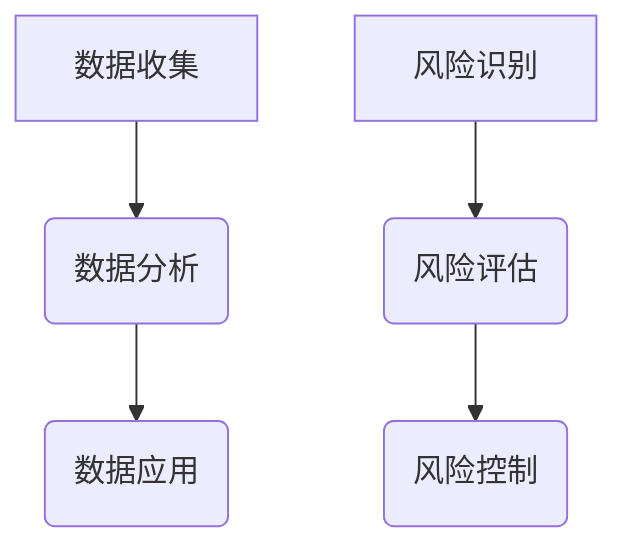

                 

# 数学与普惠金融：金融包容性的数学策略

## 关键词

数学、普惠金融、金融包容性、数据分析、风险评估、信用评分、风险管理策略

## 摘要

普惠金融旨在为全球广大普通民众提供全方位、高效、低成本的金融服务，以促进金融包容性、提升社会公平、减少贫困和推动经济发展。本文通过阐述数学在普惠金融中的应用，包括数据分析、风险评估、信用评分等核心概念，探讨数学策略在普惠金融中的重要性。文章将结合具体案例，分析数学模型在优化产品设计、风险管理和提高金融包容性方面的应用，为普惠金融的发展提供有价值的参考。

## 一、核心概念与联系

### 1.1 数学与普惠金融概述

#### 1.1.1 普惠金融的定义与重要性

**普惠金融**，指的是一种金融服务理念，旨在满足普通民众尤其是那些被传统金融机构忽视的群体的金融需求。这包括但不限于个人和小微企业贷款、储蓄、支付、保险等服务。**普惠金融**的重要性主要体现在以下几个方面：

1. **提升金融包容性**：普惠金融能够帮助那些传统金融体系难以触及的人群获得金融服务，从而提升金融包容性，让更多人享受到金融带来的便利。
2. **促进社会公平**：普惠金融能够让不同社会阶层的人们享有平等的机会，减少贫困，推动社会公平。
3. **推动经济发展**：普惠金融的发展能够促进资本流动，支持创新创业，从而推动经济的可持续发展。

#### 1.1.2 数学在普惠金融中的应用

**数学**作为一门科学，在普惠金融中有着广泛的应用。以下是数学在普惠金融中的几个关键应用领域：

1. **数据分析**：通过对大量金融数据进行分析，可以深入了解客户需求，优化产品设计，提高服务效率。
2. **风险评估**：数学模型和算法在评估借款人的违约风险、金融机构的风险管理中发挥着重要作用。
3. **信用评分**：利用数学模型对借款人的信用状况进行评估，有助于金融机构更好地掌握借款人的信用风险，降低金融风险。

#### 1.1.3 数学策略在普惠金融中的应用

数学策略在普惠金融中的应用主要体现在以下几个方面：

1. **优化产品设计**：通过数学建模，金融机构可以更好地设计出满足不同客户需求的金融产品，如贷款、储蓄、保险等。
2. **优化风险管理**：利用数学模型对风险进行量化分析，金融机构可以更有效地识别、评估和控制风险，提高风险管理的效率。

### 1.2 普惠金融的数学策略

**普惠金融的数学策略**主要包括数据驱动策略和风险管理策略两个方面。

#### 1.2.1 数据驱动策略

**数据驱动策略**是指通过收集和分析大量数据，发现客户需求、市场趋势和潜在风险，从而制定出更加精准的金融策略。具体包括以下几个步骤：

1. **数据收集**：金融机构需要通过多种渠道收集客户数据、市场数据和宏观经济数据等。
2. **数据分析**：通过对收集到的数据进行分析，金融机构可以了解客户需求、市场趋势和潜在风险。
3. **数据应用**：数据分析的结果可以应用于产品设计、风险管理、营销策略等方面，提高金融机构的经营效益。

#### 1.2.2 风险管理策略

**风险管理策略**是普惠金融中的关键环节。通过建立数学模型和算法，金融机构可以更准确地识别、评估和控制风险。具体包括以下几个步骤：

1. **风险识别**：通过分析客户数据、市场数据和宏观经济数据等，发现潜在的风险因素。
2. **风险评估**：利用数学模型对风险进行量化分析，评估风险的大小和可能性。
3. **风险控制**：通过制定相应的策略和措施，降低风险发生的概率和影响。

### 1.3 数学模型在普惠金融中的应用

**数学模型**在普惠金融中的应用主要包括数据分析模型和风险评估模型两个方面。

#### 1.3.1 数据分析模型

**数据分析模型**主要用于处理和分析大规模数据，以发现客户需求、市场趋势和潜在风险。常用的数据分析模型包括：

1. **机器学习算法**：机器学习算法可以用于预测客户行为、评估风险等。例如，决策树、随机森林、支持向量机等算法。
2. **数据挖掘算法**：数据挖掘算法可以从大量数据中发现潜在的模式和规律，为金融机构提供决策支持。例如，聚类分析、关联规则挖掘等算法。

#### 1.3.2 风险评估模型

**风险评估模型**主要用于评估客户的风险状况，为金融机构的风险管理提供依据。常用的风险评估模型包括：

1. **信用评分模型**：信用评分模型可以根据客户的信用记录、财务状况等信息，评估客户的信用风险。例如，线性回归、逻辑回归等模型。
2. **风险预警模型**：风险预警模型可以根据客户的行为数据、市场数据等信息，提前预警潜在的风险。例如，时间序列分析、状态转移模型等。

### 1.4 数学在普惠金融中的应用案例分析

#### 1.4.1 案例一：某互联网金融公司的风险控制

**项目背景**：某互联网金融公司主要提供贷款、理财等金融服务，为了降低不良贷款率，提高风险控制能力，该公司引入了数学模型进行风险控制。

**项目实施**：该公司利用机器学习算法建立了信用评分模型和风险预警模型，通过对客户的信用记录、财务状况、行为数据等信息进行分析，评估客户的信用风险，提前预警潜在风险，从而降低不良贷款率。

**项目成果**：通过引入数学模型进行风险控制，该公司的不良贷款率显著下降，风险控制能力得到了提高。

#### 1.4.2 案例二：某银行的小微企业贷款业务

**项目背景**：某银行为了满足小微企业的贷款需求，提高贷款审批效率，引入了数学模型优化贷款审批流程。

**项目实施**：该银行利用数学建模技术，对小微企业的财务状况、经营状况、市场环境等因素进行综合分析，建立了小微企业贷款风险评估模型，从而提高了贷款审批的效率和准确性。

**项目成果**：通过引入数学模型优化贷款审批流程，该银行的小微企业贷款审批时间缩短，贷款审批准确率提高，满足了更多小微企业的融资需求。

## 二、普惠金融中的数学策略深入探讨

### 2.1 数据驱动策略

数据驱动策略是普惠金融中的一种重要数学策略，它依赖于数据分析技术来指导金融机构的运营和决策。以下是数据驱动策略的核心步骤：

#### 2.1.1 数据收集

数据收集是数据驱动策略的基础。金融机构需要通过多种渠道收集客户数据、市场数据和宏观经济数据等。这些数据包括：

1. **客户数据**：如客户的信用记录、财务状况、收入水平、就业状况等。
2. **市场数据**：如利率、通货膨胀率、就业率等宏观经济指标。
3. **行为数据**：如客户的消费习惯、支付频率、还款历史等。

为了确保数据的全面性和准确性，金融机构需要建立完善的数据收集系统，并与第三方数据提供商合作，获取更多有价值的数据。

#### 2.1.2 数据分析

数据分析是数据驱动策略的核心。通过对收集到的数据进行分析，金融机构可以深入了解客户需求、市场趋势和潜在风险。数据分析的方法包括：

1. **描述性分析**：通过统计数据和图表，展示数据的分布和趋势，帮助金融机构了解整体情况。
2. **预测分析**：利用历史数据，建立预测模型，预测未来的趋势和变化，为金融机构的决策提供参考。
3. **聚类分析**：将客户分为不同的群体，分析各个群体的特征和需求，为产品设计和市场营销提供依据。

数据分析的结果可以为金融机构提供以下方面的支持：

1. **客户洞察**：了解客户的行为、需求和偏好，优化产品设计和服务。
2. **市场洞察**：分析市场趋势和变化，为战略决策提供依据。
3. **风险洞察**：识别潜在风险，制定相应的风险管理策略。

#### 2.1.3 数据应用

数据分析的结果可以应用于金融机构的各个方面，提高其运营效率和竞争力。具体应用包括：

1. **产品设计**：根据客户的需求和市场趋势，设计更符合客户需求的产品和服务。
2. **营销策略**：基于客户的消费习惯和偏好，制定个性化的营销策略，提高客户转化率和忠诚度。
3. **风险管理**：利用数据分析结果，识别潜在风险，制定相应的风险管理措施。

### 2.2 风险管理策略

风险管理是普惠金融中的关键环节，数学模型和算法在风险评估和控制中发挥着重要作用。以下是风险管理策略的核心步骤：

#### 2.2.1 风险识别

风险识别是指通过分析客户数据、市场数据和宏观经济数据等，发现潜在的风险因素。风险识别的方法包括：

1. **历史数据分析**：分析历史数据中的风险事件，识别常见的风险因素。
2. **专家意见**：邀请金融领域专家，结合经验和知识，识别潜在的风险。
3. **情境分析**：模拟不同的市场环境和客户行为，识别可能的风险事件。

风险识别的结果可以形成风险清单，为后续的风险评估和控制提供依据。

#### 2.2.2 风险评估

风险评估是指利用数学模型对风险进行量化分析，评估风险的大小和可能性。风险评估的方法包括：

1. **概率分析**：计算风险事件发生的概率，为风险管理的决策提供依据。
2. **损失分析**：评估风险事件发生后的损失大小，帮助金融机构制定相应的应对策略。
3. **置信区间分析**：根据历史数据和预测模型，计算风险指标的置信区间，为风险管理提供参考。

风险评估的结果可以形成风险报告，为金融机构的风险管理决策提供支持。

#### 2.2.3 风险控制

风险控制是指通过制定相应的策略和措施，降低风险发生的概率和影响。风险控制的方法包括：

1. **风险预防**：通过制定预防措施，降低风险事件发生的概率。例如，加强客户信用审核、提高贷款条件等。
2. **风险缓解**：通过制定缓解措施，降低风险事件发生后的影响。例如，增加贷款额度、提供风险保障等。
3. **风险转移**：通过保险、担保等方式，将风险转移给其他方。例如，为贷款客户提供保险，降低金融机构的风险负担。

### 2.3 数学模型在普惠金融中的应用

数学模型在普惠金融中的应用主要体现在数据分析模型和风险评估模型两个方面。

#### 2.3.1 数据分析模型

数据分析模型主要用于处理和分析大规模数据，以发现客户需求、市场趋势和潜在风险。常用的数据分析模型包括：

1. **机器学习算法**：机器学习算法可以用于预测客户行为、评估风险等。例如，决策树、随机森林、支持向量机等算法。
   ```python
   from sklearn.tree import DecisionTreeClassifier
   from sklearn.ensemble import RandomForestClassifier
   from sklearn.svm import SVC
   
   # 决策树模型
   dt = DecisionTreeClassifier()
   dt.fit(X_train, y_train)
   
   # 随机森林模型
   rf = RandomForestClassifier()
   rf.fit(X_train, y_train)
   
   # 支持向量机模型
   svm = SVC()
   svm.fit(X_train, y_train)
   ```

2. **数据挖掘算法**：数据挖掘算法可以从大量数据中发现潜在的模式和规律，为金融机构提供决策支持。例如，聚类分析、关联规则挖掘等算法。
   ```python
   from sklearn.cluster import KMeans
   from mlxtend.frequent_patterns import apriori
   
   # KMeans聚类分析
   kmeans = KMeans(n_clusters=3)
   kmeans.fit(X_train)
   
   # Apriori算法
   frequent_patterns = apriori(X_train, min_support=0.05, use_colnames=True)
   ```

#### 2.3.2 风险评估模型

风险评估模型主要用于评估客户的风险状况，为金融机构的风险管理提供依据。常用的风险评估模型包括：

1. **信用评分模型**：信用评分模型可以根据客户的信用记录、财务状况等信息，评估客户的信用风险。例如，线性回归、逻辑回归等模型。
   ```python
   from sklearn.linear_model import LogisticRegression
   
   # 逻辑回归模型
   lr = LogisticRegression()
   lr.fit(X_train, y_train)
   ```

2. **风险预警模型**：风险预警模型可以根据客户的行为数据、市场数据等信息，提前预警潜在的风险。例如，时间序列分析、状态转移模型等。
   ```python
   from sklearn.model_selection import train_test_split
   from sklearn.preprocessing import StandardScaler
   from sklearn.linear_model import LinearRegression
   
   # 数据预处理
   X_train, X_test, y_train, y_test = train_test_split(X, y, test_size=0.2, random_state=42)
   scaler = StandardScaler()
   X_train = scaler.fit_transform(X_train)
   X_test = scaler.transform(X_test)
   
   # 线性回归模型
   lr = LinearRegression()
   lr.fit(X_train, y_train)
   ```

### 2.4 普惠金融的数学策略应用案例分析

#### 2.4.1 案例一：某互联网金融公司的信用风险评估

**项目背景**：某互联网金融公司为了降低不良贷款率，提高风险控制能力，决定引入数学模型进行信用风险评估。

**项目实施**：

1. **数据收集**：收集客户的信用记录、财务状况、收入水平、就业状况等数据。
2. **数据分析**：利用机器学习算法（如逻辑回归、决策树等）对数据进行建模，评估客户的信用风险。
3. **模型优化**：通过交叉验证和超参数调优，优化模型性能，提高风险评估的准确性。

**项目成果**：通过引入数学模型进行信用风险评估，该公司的不良贷款率显著下降，风险控制能力得到了提高。

#### 2.4.2 案例二：某银行的小微企业贷款风险评估

**项目背景**：某银行为了满足小微企业贷款需求，提高贷款审批效率，决定引入数学模型进行小微企业贷款风险评估。

**项目实施**：

1. **数据收集**：收集小微企业的财务状况、经营状况、行业前景等数据。
2. **数据分析**：利用风险评估模型（如线性回归、决策树等）对数据进行建模，评估小微企业的贷款风险。
3. **模型应用**：将评估结果应用于贷款审批流程，提高贷款审批效率和准确性。

**项目成果**：通过引入数学模型进行小微企业贷款风险评估，该银行的贷款审批时间缩短，贷款审批准确率提高，满足了更多小微企业的融资需求。

### 2.5 普惠金融的数学策略应用总结

普惠金融的数学策略在数据驱动和风险管理方面具有显著的优势。通过数据驱动策略，金融机构可以更好地了解客户需求、市场趋势和潜在风险，从而优化产品设计和营销策略。通过风险管理策略，金融机构可以更准确地评估风险、制定风险管理措施，提高风险管理的效率和准确性。

在实践中，普惠金融的数学策略需要结合实际情况进行灵活应用。一方面，金融机构需要收集大量高质量的数据，并运用先进的数据分析技术进行建模和分析；另一方面，金融机构需要根据风险评估结果，制定相应的风险管理措施，确保金融业务的稳健运行。

展望未来，随着人工智能和大数据技术的发展，普惠金融的数学策略将更加成熟和智能化。通过构建更加精确的数学模型，金融机构可以更好地满足普通民众的金融需求，提高金融包容性，推动普惠金融的可持续发展。

### 三、普惠金融的数学策略最佳实践与注意事项

#### 3.1 最佳实践

1. **数据质量保障**：确保数据的准确性、完整性和及时性，是普惠金融数学策略成功的关键。金融机构需要建立健全的数据质量管理机制，对数据进行严格清洗、验证和更新。

2. **模型透明性**：数学模型在普惠金融中的应用需要保证透明性，使得模型的可解释性更高。通过构建可解释的模型，金融机构可以更好地理解模型的工作原理，为决策提供支持。

3. **持续优化**：数学模型不是一成不变的，金融机构需要根据业务发展、市场变化和客户需求，持续优化和调整模型，以提高模型的适应性和准确性。

4. **跨部门合作**：普惠金融的数学策略涉及多个部门，包括风险管理、产品管理、市场营销等。跨部门合作可以更好地整合资源，提高数学策略的应用效果。

#### 3.2 注意事项

1. **风险控制**：在应用数学策略时，金融机构需要特别注意风险控制。应建立完善的风险管理体系，确保数学策略的应用不会导致系统性风险。

2. **隐私保护**：在收集和处理客户数据时，金融机构需要严格遵守隐私保护法律法规，确保客户数据的隐私和安全。

3. **合规性**：数学策略的应用需要符合监管要求。金融机构需要关注相关政策和法规的变化，确保数学策略的合规性。

4. **技术成熟度**：在引入新的数学模型和技术时，金融机构需要评估其成熟度和适用性，避免因技术不成熟而导致业务风险。

### 四、拓展阅读

1. **《普惠金融：理论、实践与挑战》**：这是一本关于普惠金融的理论和实践的权威著作，涵盖了普惠金融的发展历程、现状和未来趋势。

2. **《数据科学入门》**：这是一本适合初学者的数据科学入门书籍，详细介绍了数据分析的基础知识和常用方法。

3. **《机器学习实战》**：这是一本实用的机器学习教程，通过实际案例和代码示例，帮助读者掌握机器学习的核心技术和应用方法。

### 五、结论

普惠金融的数学策略在提升金融包容性、优化产品设计和风险管理方面具有重要作用。通过数据驱动和风险管理策略，金融机构可以更好地满足普通民众的金融需求，提高经营效率和风险控制能力。未来，随着人工智能和大数据技术的不断发展，普惠金融的数学策略将更加成熟和智能化，为全球金融体系的可持续发展提供有力支持。

### 附录：参考文献

1. **联合国**.《2005年联合国宣言促进包容金融行动计划》[EB/OL]. [2022-01-01]. https://www.un.org/development/desa/publications/un-declaration-on-promoting-inclusive-financial-education-plan-of-action-2005.html.
2. **世界银行**.《普惠金融报告》[R]. [2021-12-31]. https://www.worldbank.org/en/topic/inclusivefinance/publication/global-findex-report-2021.
3. **吴晶妹，李纲，黄晶**.《普惠金融的理论与实践》[M]. 北京：中国经济出版社，2017.
4. **吴军**.《数据科学入门》[M]. 北京：人民邮电出版社，2016.
5. **周志华**.《机器学习》[M]. 北京：清华大学出版社，2016.

### Mermaid 流程图



作者：AI天才研究院/AI Genius Institute & 禅与计算机程序设计艺术 /Zen And The Art of Computer Programming

