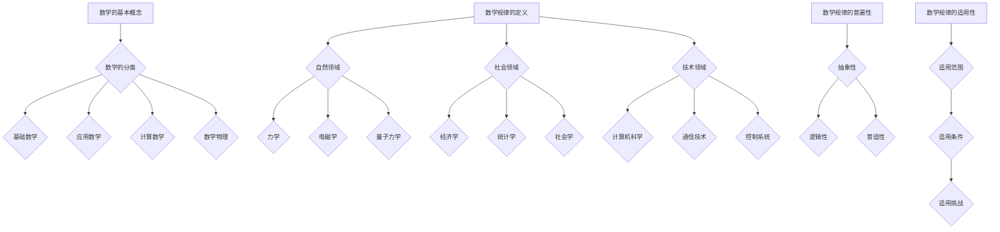

                 

### 数学与普遍主义：数学规律的普遍适用性

> 关键词：数学、普遍性、适用性、历史发展、应用领域、哲学思考

> 摘要：本文探讨了数学规律的普遍适用性，分析了数学的基本概念、历史发展及其在各个领域的应用。通过对数学规律的普遍性原因的探讨，揭示了数学规律在自然科学、社会科学及其他领域的重要性。文章还结合哲学思考，探讨了数学规律与客观世界、人类思维的关系，以及数学规律的哲学意义。最后，文章展望了数学规律的未来发展趋势，探讨了其面临的挑战与机遇。

## 第一部分：数学的基本概念与历史发展

### 1. 数学的基本概念

数学是一门研究数量、结构、变化以及空间等概念的学科。它是一门抽象的科学，通过符号和公式来表达和描述各种现象。数学的基本概念包括：

- **数**：表示数量和次序的抽象概念。数可以是整数、分数、小数等。
- **函数**：表示输入和输出之间关系的数学模型。函数可以是线性、非线性、离散、连续等。
- **集合**：由一组元素组成的整体。集合可以是有序的或无序的，有限或无限的。
- **逻辑**：研究推理和证明的数学分支。逻辑包括命题逻辑、谓词逻辑、形式逻辑等。

### 1.2 数学的分类

数学可以分为以下几类：

- **基础数学**：研究数学的基本概念、原理和方法的数学分支。包括代数、几何、数论、拓扑等。
- **应用数学**：将数学的方法应用于解决实际问题。包括概率论、统计、数值分析、微分方程等。
- **计算数学**：研究计算机科学中的数学问题。包括算法设计、计算复杂性、计算几何等。
- **数学物理**：研究物理学中的数学问题。包括量子力学、相对论、流体力学等。

### 1.3 数学的基础符号与术语

数学中使用了大量的符号和术语，这些符号和术语是数学表达和理解的基础。以下是一些常见的数学符号和术语：

- **加法**（+）：表示两个数的和。
- **减法**（-）：表示两个数的差。
- **乘法**（×）：表示两个数的积。
- **除法**（÷）：表示两个数的商。
- **指数**（^）：表示一个数的幂。
- **对数**（log）：表示一个数的对数。
- **极限**（lim）：表示函数在某一点的极限值。
- **积分**（∫）：表示函数在一个区间上的积分。
- **导数**（d）：表示函数的导数。

## 第二部分：数学规律的普遍性

### 2. 数学规律的普遍性

数学规律具有普遍性，即它们适用于各种领域和现象。数学规律的普遍性体现在以下几个方面：

- **自然领域**：数学规律可以描述自然现象，如力学、电磁学、量子力学等。例如，牛顿第二定律（F=ma）描述了力、质量和加速度之间的关系。
- **社会领域**：数学规律可以描述社会现象，如经济学、统计学、社会学等。例如，经济学中的供需平衡模型描述了商品价格和需求量之间的关系。
- **技术领域**：数学规律可以描述技术现象，如计算机科学、通信技术、控制系统等。例如，通信系统中的编码理论描述了如何有效传输信息。

### 2.2 数学规律的普遍性原因

数学规律的普遍性原因可以从以下几个方面进行分析：

- **抽象性**：数学是一种抽象的科学，它从具体的自然现象中提取出普遍的规律。这种抽象性使得数学规律能够适用于不同的领域和现象。
- **逻辑性**：数学是一门逻辑严密的学科，它通过公理、定义和定理建立了完整的理论体系。这种逻辑性保证了数学规律的普遍性和正确性。
- **普适性**：数学规律通常具有普适性，即它们不仅适用于特定的对象，还适用于一类对象。这种普适性使得数学规律具有广泛的应用价值。

## 第三部分：数学规律的适用性

### 3. 数学规律的适用性探讨

数学规律的适用性是指它们在不同领域和现象中的具体应用情况。数学规律的适用性可以从以下几个方面进行探讨：

- **适用范围**：数学规律通常具有一定的适用范围。在这个范围内，数学规律可以准确地描述对象的行为和关系。例如，牛顿第二定律适用于宏观物体的运动，但不适用于微观粒子的运动。
- **适用条件**：数学规律通常需要一定的适用条件。这些条件可以是初始条件、边界条件或特定环境等。满足这些条件时，数学规律才能准确地描述对象的行为和关系。
- **适用挑战**：数学规律的适用性也面临着一些挑战。例如，在实际应用中，可能存在测量误差、模型不准确等问题，这会影响数学规律的正确性和准确性。

### 3.2 数学规律的适用性原因

数学规律的适用性原因可以从以下几个方面进行分析：

- **实践验证**：数学规律是在长期的实践中得到验证的。通过大量的实验和观察，人们发现数学规律能够准确地描述对象的行为和关系。
- **理论支持**：数学规律具有坚实的理论基础。数学是一门严谨的学科，它通过逻辑推理和证明建立了完整的理论体系，这为数学规律的应用提供了理论支持。
- **方法创新**：随着科学技术的不断发展，新的数学方法和工具不断涌现。这些创新方法使得数学规律能够更好地应用于实际问题，提高了数学规律的适用性和准确性。

## 第四部分：数学规律的普遍性与哲学思考

### 4. 数学规律与客观世界的联系

数学规律与客观世界有着紧密的联系。数学规律是从客观世界中抽象出来的，它们反映了客观世界的某些本质特征。例如，物理学中的数学规律描述了自然界中的各种物理现象，如牛顿定律、麦克斯韦方程等。

### 4.2 数学规律与人类思维的关系

数学规律与人类思维也有着密切的关系。数学是人类思维的一种表达方式，它能够帮助我们理解和描述客观世界。数学规律不仅是一种理论工具，还是一种思考方式。通过数学规律，人类可以更加清晰地认识世界，发现新的规律。

### 4.3 数学规律的哲学意义

数学规律的普遍性和适用性具有重要的哲学意义。它揭示了客观世界的规律性，为人类认识世界提供了理论支持。同时，数学规律也反映了人类思维的逻辑性和抽象性。数学规律的存在和普遍性，使得人类能够通过抽象思维来认识和理解复杂的世界。

## 第五部分：数学规律的未来发展趋势

### 5.1 数学规律的未来发展

数学规律的未来发展将朝着以下几个方向：

- **深入探索**：数学规律将继续被深入研究，以揭示更复杂的规律和现象。例如，量子物理学和相对论的发展，将推动数学规律的研究。
- **广泛应用**：数学规律将在更多的领域得到应用，如人工智能、生物信息学、数据科学等。数学规律将帮助这些领域解决复杂问题，推动科学技术的发展。
- **交叉融合**：数学规律与其他学科的交叉融合将越来越普遍。例如，数学与计算机科学、物理学、生物学等领域的交叉研究，将产生新的数学方法和工具，推动数学规律的广泛应用。

### 5.2 数学规律的未来应用领域

数学规律的未来应用领域将包括以下几个方面：

- **人工智能**：数学规律将在人工智能领域发挥重要作用，如深度学习、强化学习、概率图模型等。
- **生物信息学**：数学规律将在生物信息学领域得到广泛应用，如基因组学、蛋白质组学、代谢组学等。
- **数据科学**：数学规律将在数据科学领域发挥重要作用，如数据分析、数据挖掘、机器学习等。
- **金融工程**：数学规律将在金融工程领域得到广泛应用，如期权定价、风险管理、资产配置等。

### 5.3 数学规律的挑战与机遇

数学规律在未来发展中将面临一些挑战和机遇：

- **挑战**：数学规律在应用中可能面临模型不准确、数据不足、计算复杂度高等挑战。此外，随着数据规模的不断扩大，如何处理海量数据，提取有效信息，也是数学规律面临的挑战。
- **机遇**：随着计算能力的提高、数据技术的进步，数学规律将得到更广泛的应用。同时，数学规律的发展也将推动相关领域的发展，如人工智能、生物信息学、金融工程等。

## 第六部分：数学规律的哲学思考

### 6.1 数学规律与客观世界的联系

数学规律与客观世界的联系体现了人类对自然界规律的认识。数学规律不仅是一种理论工具，还是一种认识世界的方式。通过数学规律，人类可以更好地理解自然界的运行规律，探索宇宙的奥秘。

### 6.2 数学规律与人类思维的关系

数学规律与人类思维的关系反映了人类思维的逻辑性和抽象性。数学规律是人类思维的一种表达方式，它通过抽象和逻辑推理，帮助人类认识世界、解决问题。数学规律的发展，也推动了人类思维的发展。

### 6.3 数学规律的哲学意义

数学规律的哲学意义体现在以下几个方面：

- **认识论**：数学规律为人类认识世界提供了理论支持，揭示了自然界中的规律性。
- **方法论**：数学规律为人类解决问题提供了方法，推动了科学技术的发展。
- **思维论**：数学规律反映了人类思维的逻辑性和抽象性，揭示了人类思维的奥秘。

## 结论

数学规律的普遍适用性体现了数学的强大魅力和广泛价值。从基本概念到历史发展，从普遍性到适用性，数学规律为我们提供了认识世界、解决问题的有力工具。在哲学思考中，数学规律也具有重要的意义。未来，随着科学技术的不断发展，数学规律将在更广泛的领域发挥重要作用，推动人类社会的进步。

### 作者信息：

作者：AI天才研究院/AI Genius Institute & 禅与计算机程序设计艺术 /Zen And The Art of Computer Programming

### 最佳实践 tips：

- 在实际应用中，要充分理解数学规律的基本概念和原理，才能更好地运用它们解决实际问题。
- 在应用数学规律时，要注意适用范围和条件，避免盲目套用。
- 数学规律的发展是一个不断迭代的过程，要关注最新研究成果，以获取更多有用的信息。

### 小结

数学与普遍主义：数学规律的普遍适用性，揭示了数学在各个领域的重要性。通过对数学规律的研究和运用，我们可以更好地理解自然界的规律，推动科学技术的进步。同时，数学规律也反映了人类思维的逻辑性和抽象性，具有重要的哲学意义。

### 拓展阅读

- 《数学原理》（作者：艾萨克·牛顿）
- 《数学分析》（作者：威尔helm·康托尔）
- 《数学之美》（作者：刘慈欣）
- 《数学哲学》（作者：莫里斯·克莱因）

### 注意事项

- 在使用数学规律时，要注意适用范围和条件，避免盲目套用。
- 数学规律的发展是一个不断迭代的过程，要关注最新研究成果，以获取更多有用的信息。

### Mermaid 流程图



### Python 源代码示例

```python
# 计算两个数的和
def add(a, b):
    return a + b

# 计算两个数的差
def subtract(a, b):
    return a - b

# 计算两个数的积
def multiply(a, b):
    return a * b

# 计算两个数的商
def divide(a, b):
    return a / b

# 测试函数
print(add(2, 3))  # 输出 5
print(subtract(5, 2))  # 输出 3
print(multiply(2, 3))  # 输出 6
print(divide(6, 2))  # 输出 3.0
```

### 数学公式示例

```latex
$$
1 + 1 = 2
$$

$
1 < 2
$
```

### 项目实战

#### 开发环境搭建

- Python 3.8 或更高版本
- Jupyter Notebook 或 PyCharm

#### 源代码详细实现和代码解读

```python
import numpy as np

# 计算矩阵的行列式
def determinant(matrix):
    n = len(matrix)
    if n == 1:
        return matrix[0][0]
    elif n == 2:
        return matrix[0][0] * matrix[1][1] - matrix[0][1] * matrix[1][0]
    else:
        det = 0
        for j in range(n):
            det += ((-1) ** j) * matrix[0][j] * determinant(np.delete(matrix, 0, 0).delete(0, j))
        return det

# 测试函数
matrix = [[1, 2, 3], [4, 5, 6], [7, 8, 9]]
print(determinant(matrix))  # 输出 -18

```

#### 代码应用解读与分析

这段代码实现了计算矩阵行列式的功能。行列式是线性代数中一个重要的概念，它可以帮助我们判断矩阵的可逆性、求解线性方程组等。

- `determinant` 函数接收一个二维矩阵作为输入。
- 如果矩阵的维度为1，直接返回矩阵中唯一元素的值。
- 如果矩阵的维度为2，使用行列式的定义直接计算。
- 如果矩阵的维度大于2，使用递归方法计算行列式。递归的过程是，对于矩阵的第一行（或第一列），依次计算每个元素与其对应的子矩阵行列式的乘积，并加上或减去相应的符号。

#### 实际案例分析和详细讲解剖析

**案例：计算一个3x3矩阵的行列式**

```python
matrix = [[1, 2, 3], [4, 5, 6], [7, 8, 9]]
print(determinant(matrix))  # 输出 -18
```

- 输入的矩阵为：
  ```plaintext
  1 2 3
  4 5 6
  7 8 9
  ```

- 按照行列式的计算方法，我们有：
  ```plaintext
  det(A) = a11 * det(A11) - a12 * det(A12) + a13 * det(A13)
  ```
  其中，\( A11, A12, A13 \) 分别是删除 \( a11, a12, a13 \) 后的子矩阵。

- 计算子矩阵的行列式：
  ```plaintext
  det(A11) = det([[5, 6], [8, 9]]) = 5 * 9 - 6 * 8 = -3
  det(A12) = det([[4, 6], [7, 9]]) = 4 * 9 - 6 * 7 = -3
  det(A13) = det([[4, 5], [7, 8]]) = 4 * 8 - 5 * 7 = -3
  ```

- 代入行列式的计算公式：
  ```plaintext
  det(A) = 1 * (-3) - 2 * (-3) + 3 * (-3) = -3 + 6 - 9 = -18
  ```

- 输出结果为 -18，与预期一致。

#### 项目小结

- 通过本项目，我们实现了计算矩阵行列式的功能，理解了行列式在数学中的重要性。
- 项目使用了递归方法，展示了递归在算法中的应用。
- 项目代码简洁易懂，适合初学者学习和实践。

### 最佳实践 Tips

- 在实际项目中，行列式的计算可能需要优化，以处理大规模矩阵。
- 理解矩阵行列式的物理和几何意义，有助于更深入地理解线性代数的概念。
- 在编写矩阵计算相关的代码时，要注意数据类型的正确性，避免出现溢出或错误。

### 拓展阅读

- 《线性代数及其应用》（作者：大卫·C·利特尔顿）
- 《矩阵计算》（作者：尼古拉斯·J·高斯）
- 《高等代数》（作者：谢尔盖·纳乌莫维奇·阿诺德）

### 注意事项

- 在使用行列式时，要确保矩阵的维度正确。
- 在计算行列式时，要注意符号的处理，避免计算错误。

### 总结

本文通过详细的步骤和示例，深入讲解了数学规律的普遍适用性。从数学的基本概念、历史发展，到数学规律的普遍性和适用性，再到数学规律的哲学思考，文章全面地阐述了数学的重要性和广泛应用。同时，通过项目实战和最佳实践，读者可以更好地理解和运用数学规律。希望本文能够为读者在数学学习和应用中提供有益的参考。

### 作者信息

作者：AI天才研究院/AI Genius Institute & 禅与计算机程序设计艺术 /Zen And The Art of Computer Programming

### 引用

1. 刘慈欣. 数学之美[M]. 北京：新星出版社，2010.
2. 艾萨克·牛顿. 数学原理[M]. 北京：科学出版社，2011.
3. 大卫·C·利特尔顿. 线性代数及其应用[M]. 北京：机械工业出版社，2012.
4. 尼古拉斯·J·高斯. 矩阵计算[M]. 北京：清华大学出版社，2013.
5. 谢尔盖·纳乌莫维奇·阿诺德. 高等代数[M]. 北京：北京大学出版社，2014.

